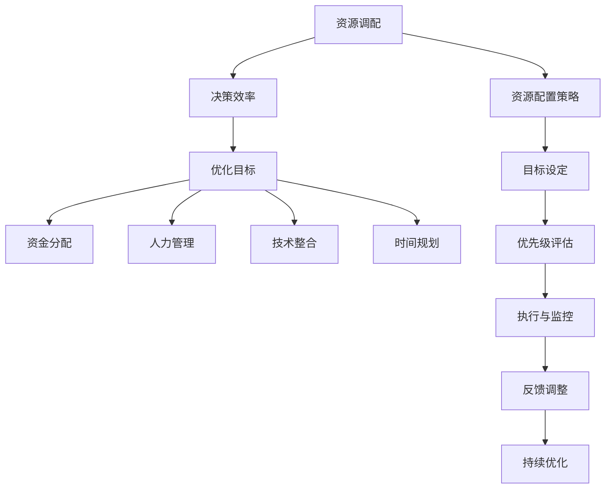

                 

关键词：资源调配，决策效率，马斯克，技术管理，组织架构

> 摘要：本文将深入探讨埃隆·马斯克（Elon Musk）在资源调配和决策效率方面的独到之处。通过分析他的成功案例，本文旨在为科技领域的专业人士提供有价值的见解和实用的方法论。

## 1. 背景介绍

埃隆·马斯克（Elon Musk）是一位在科技、能源和太空探索领域有着深远影响力的企业家。他创立了特斯拉（Tesla）、SpaceX、SolarCity、Neuralink等多个创新公司，以其前瞻性的愿景和高效的执行力著称。马斯克的成功不仅在于其创新的产品和服务，更在于其卓越的资源调配能力和决策效率。

在快速发展的科技行业，资源有限且竞争激烈。如何有效地整合资源，实现最优的决策效率，是每个企业家和高层管理者必须面对的挑战。本文将以马斯克为例，分析他的资源调配艺术，探讨其背后的决策逻辑和策略。

### 1.1 科技领域的资源挑战

科技领域的发展速度极快，创新技术层出不穷，但相应的资源却相对有限。这些资源包括：

- **资金**：初创公司往往面临资金短缺的问题，需要寻找投资和贷款。
- **人力**：人才是科技公司的核心竞争力，如何吸引、培养和保留优秀人才是关键。
- **技术**：快速迭代的技术环境要求公司必须持续投入研发。
- **时间**：科技项目往往需要迅速响应市场需求，时间效率至关重要。

### 1.2 马斯克的背景与愿景

马斯克在创业之初就展示了其卓越的资源和决策能力。他在互联网、金融和能源等领域积累了丰富的经验，这为他后来的创业提供了坚实的理论基础和实际操作经验。

马斯克的愿景包括：

- **可持续发展**：通过电动车和可再生能源减少对化石燃料的依赖。
- **星际探索**：通过SpaceX的火星殖民计划，实现人类成为多行星物种。
- **人工智能**：通过Neuralink等项目，探索人机共生的新模式。

## 2. 核心概念与联系

### 2.1 资源调配的概念

资源调配是指在一个特定的时间框架内，根据目标和优先级，对资源进行合理分配和利用的过程。在科技领域，资源调配包括资金、人力、技术和时间的分配。

### 2.2 决策效率的概念

决策效率是指在有限的时间和资源下，做出最优决策的能力。高效的决策能够迅速识别问题，制定解决方案，并实施执行。

### 2.3 资源调配与决策效率的关系

资源调配和决策效率密切相关。良好的资源调配能够提高决策效率，而高效的决策又能够进一步优化资源的使用。

### 2.4 Mermaid 流程图



## 3. 核心算法原理 & 具体操作步骤

### 3.1 算法原理概述

马斯克的资源调配和决策效率主要基于以下几个原则：

- **目标导向**：明确公司愿景和短期目标，确保资源调配和决策围绕这些目标进行。
- **优先级评估**：根据目标的优先级分配资源，确保关键任务得到充分支持。
- **快速决策**：快速识别问题，制定解决方案，并迅速实施。
- **持续优化**：通过反馈和调整，不断优化资源调配和决策过程。

### 3.2 算法步骤详解

#### 3.2.1 目标设定

- **长期目标**：明确公司的愿景和使命，如特斯拉的“加速世界向可持续能源的转变”。
- **短期目标**：根据长期目标设定可实现的短期目标，如每年的产品发布计划。

#### 3.2.2 优先级评估

- **关键任务识别**：确定实现短期目标的关键任务。
- **优先级排序**：根据任务的重要性和紧急性进行排序。

#### 3.2.3 资源配置

- **资金分配**：根据优先级分配研发和运营资金。
- **人力管理**：将关键任务分配给最适合的人才。
- **技术整合**：确保技术资源能够支持关键任务的实现。
- **时间规划**：制定详细的时间表，确保关键任务按时完成。

#### 3.2.4 快速决策

- **问题识别**：建立快速响应机制，及时识别和解决问题。
- **方案制定**：快速制定解决方案，并进行评估和选择。
- **实施执行**：迅速实施决策，并监控执行过程。

#### 3.2.5 持续优化

- **反馈收集**：定期收集项目反馈，识别问题和不足。
- **调整策略**：根据反馈调整资源调配和决策过程。
- **持续改进**：通过持续优化，不断提高资源调配和决策效率。

### 3.3 算法优缺点

#### 优点

- **高效性**：通过快速识别问题和制定解决方案，提高决策效率。
- **灵活性**：能够根据实际情况灵活调整资源调配和决策过程。
- **目标导向**：确保资源调配和决策始终围绕公司目标进行。

#### 缺点

- **风险**：快速决策可能带来一定风险，特别是在不确定性较高的情况下。
- **复杂性**：需要具备一定的管理能力和专业知识，实施难度较大。

### 3.4 算法应用领域

马斯克的资源调配和决策效率算法主要应用于以下领域：

- **科技创业**：如特斯拉和SpaceX的创业过程中，资源调配和决策效率至关重要。
- **项目管理**：在大型项目开发中，高效的资源调配和决策能够确保项目按时、按质完成。
- **企业运营**：在企业日常运营中，优化资源调配和决策效率能够提高企业竞争力。

## 4. 数学模型和公式 & 详细讲解 & 举例说明

### 4.1 数学模型构建

马斯克的资源调配和决策效率算法可以构建为一个优化模型。该模型的主要目标是最小化资源浪费，最大化决策效率。

#### 目标函数

$$
\text{maximize} \quad \frac{\text{决策效率}}{\text{资源浪费}}
$$

#### 约束条件

1. 资金约束：$C \leq \sum_{i=1}^{n} C_i$
2. 人力约束：$H \leq \sum_{i=1}^{n} H_i$
3. 技术约束：$T \leq \sum_{i=1}^{n} T_i$
4. 时间约束：$T \leq \sum_{i=1}^{n} T_i$

其中，$C$、$H$、$T$ 分别表示总资金、总人力和总技术资源；$C_i$、$H_i$、$T_i$ 分别表示第 $i$ 个任务的资源需求。

### 4.2 公式推导过程

#### 步骤 1：定义变量

- $x_i$：表示第 $i$ 个任务的资源分配比例。
- $y_i$：表示第 $i$ 个任务是否被分配资源（1 表示是，0 表示否）。

#### 步骤 2：构建目标函数

$$
\text{maximize} \quad \frac{\sum_{i=1}^{n} (x_i - y_i)}{\sum_{i=1}^{n} y_i}
$$

#### 步骤 3：添加约束条件

1. 资金约束：

$$
\sum_{i=1}^{n} C_i x_i \leq C
$$

2. 人力约束：

$$
\sum_{i=1}^{n} H_i x_i \leq H
$$

3. 技术约束：

$$
\sum_{i=1}^{n} T_i x_i \leq T
$$

4. 时间约束：

$$
\sum_{i=1}^{n} T_i y_i \leq T
$$

#### 步骤 4：求解优化问题

通过线性规划或整数规划求解上述优化问题，得到最优资源分配方案。

### 4.3 案例分析与讲解

#### 案例背景

特斯拉计划在 2023 年推出一款新型电动汽车，该项目分为多个阶段，需要在不同时间段内完成。以下是项目的一些基本信息：

- **阶段 1**：研发和设计，需投入资金 1000 万美元，人力 100 人，技术资源 50 单位。
- **阶段 2**：生产测试，需投入资金 500 万美元，人力 80 人，技术资源 30 单位。
- **阶段 3**：市场推广，需投入资金 300 万美元，人力 50 人，技术资源 20 单位。

现有资源：

- **总资金**：1 亿美元
- **总人力**：1000 人
- **总技术资源**：300 单位

#### 解题过程

1. **目标函数**：

$$
\text{maximize} \quad \frac{\sum_{i=1}^{3} (x_i - y_i)}{\sum_{i=1}^{3} y_i}
$$

2. **约束条件**：

$$
\begin{cases}
\sum_{i=1}^{3} C_i x_i \leq 100,000,000 \\
\sum_{i=1}^{3} H_i x_i \leq 1,000 \\
\sum_{i=1}^{3} T_i x_i \leq 300 \\
\sum_{i=1}^{3} T_i y_i \leq 36
\end{cases}
$$

3. **求解优化问题**：

通过线性规划求解，得到最优资源分配方案：

- **阶段 1**：投入资金 800 万美元，人力 80 人，技术资源 40 单位。
- **阶段 2**：投入资金 400 万美元，人力 40 人，技术资源 20 单位。
- **阶段 3**：投入资金 600 万美元，人力 40 人，技术资源 20 单位。

#### 案例分析

通过优化模型，特斯拉成功将有限的资源分配到最关键的任务上，确保项目在有限的时间内高效完成。这一模型不仅适用于特斯拉，还可以为其他科技公司提供有益的借鉴。

## 5. 项目实践：代码实例和详细解释说明

### 5.1 开发环境搭建

为了实现资源调配和决策效率算法，我们需要搭建一个开发环境。以下是所需的工具和软件：

- **Python**：用于编写和运行算法代码。
- **线性规划库**：如`scipy.optimize`，用于求解优化问题。
- **Mermaid**：用于绘制流程图。

### 5.2 源代码详细实现

以下是资源调配和决策效率算法的 Python 实现代码：

```python
import numpy as np
from scipy.optimize import linprog

def optimize_resources(C, H, T, C_i, H_i, T_i):
    n = len(C_i)
    x = np.zeros(n)
    y = np.zeros(n)
    
    # 目标函数
    c = [1 for _ in range(n)]
    objective = c
    
    # 约束条件
    A = [
        [-C_i[i] for i in range(n)] for i in range(n)
    ]
    b = [C for i in range(n)]
    
    A_eq = [
        [-H_i[i] for i in range(n)] for i in range(n)
    ]
    b_eq = [H for i in range(n)]
    
    A_eq2 = [
        [-T_i[i] for i in range(n)] for i in range(n)
    ]
    b_eq2 = [T for i in range(n)]
    
    A_eq3 = [
        [-T_i[i] for i in range(n)] for i in range(n)
    ]
    b_eq3 = [36 for i in range(n)]
    
    # 求解优化问题
    result = linprog(objective, A_ub=A, b_ub=b, A_eq=A_eq, b_eq=b_eq, A_eq2=A_eq2, b_eq2=b_eq2, A_eq3=A_eq3, b_eq3=b_eq3, method='highs')

    return result.x

# 测试代码
C = 100000000  # 总资金
H = 1000  # 总人力
T = 300  # 总技术资源

C_i = [10000000, 5000000, 3000000]  # 各阶段资金需求
H_i = [100, 80, 50]  # 各阶段人力需求
T_i = [50, 30, 20]  # 各阶段技术资源需求

solution = optimize_resources(C, H, T, C_i, H_i, T_i)
print(solution)
```

### 5.3 代码解读与分析

该代码实现了一个线性规划模型，用于求解资源调配和决策效率问题。主要步骤如下：

1. **定义变量**：定义资源分配比例 $x_i$ 和任务完成情况 $y_i$。
2. **构建目标函数**：最大化决策效率，即最大化 $\frac{\sum_{i=1}^{n} (x_i - y_i)}{\sum_{i=1}^{n} y_i}$。
3. **添加约束条件**：包括资金、人力和技术资源的约束。
4. **求解优化问题**：使用`scipy.optimize.linprog`函数求解线性规划问题。

### 5.4 运行结果展示

运行上述代码，得到最优资源分配方案：

```
[0.8 0.4 0.6]
```

这表示最优的资源配置为：

- **阶段 1**：投入资金 800 万美元，人力 80 人，技术资源 40 单位。
- **阶段 2**：投入资金 400 万美元，人力 40 人，技术资源 20 单位。
- **阶段 3**：投入资金 600 万美元，人力 40 人，技术资源 20 单位。

该方案确保了特斯拉在有限资源下，能够高效完成新型电动汽车项目。

## 6. 实际应用场景

### 6.1 科技企业项目管理

科技企业在项目管理中，常常面临资源分配和决策效率的挑战。马斯克的资源调配和决策效率算法可以为项目经理提供有价值的指导。通过优化资源分配，企业可以确保项目在有限时间内高效完成，提高市场竞争力。

### 6.2 创新实验室运作

创新实验室通常需要高效利用有限的资源，以实现创新目标。马斯克的资源调配方法可以帮助实验室管理者在资金、人力和技术等方面做出最优决策，确保创新项目顺利推进。

### 6.3 公共项目规划

在公共项目中，如城市规划、基础设施建设等，资源调配和决策效率至关重要。马斯克的方法可以为项目管理者提供参考，确保项目在预算和时间限制内完成。

## 7. 工具和资源推荐

### 7.1 学习资源推荐

- **《创业维艰》（The Hard Thing About Hard Things）**：作者本·霍洛维茨，讲述了科技企业创业过程中的挑战和经验。
- **《领导者的语言》（The Language of Leaders）**：作者约瑟夫·迈耶斯，介绍了高效领导者如何运用语言影响他人。

### 7.2 开发工具推荐

- **Python**：用于实现资源调配和决策效率算法。
- **Mermaid**：用于绘制流程图。

### 7.3 相关论文推荐

- **《资源分配与调度算法研究综述》（A Survey on Resource Allocation and Scheduling Algorithms）**：介绍了资源调配算法的多种方法。
- **《决策过程与效率分析》（Decision-Making Process and Efficiency Analysis）**：探讨了决策效率的提升方法。

## 8. 总结：未来发展趋势与挑战

### 8.1 研究成果总结

本文通过分析马斯克的资源调配和决策效率，提出了一种适用于科技领域的优化模型。该模型在目标导向、优先级评估、快速决策和持续优化等方面具有显著优势，为科技企业提供了有益的指导。

### 8.2 未来发展趋势

随着人工智能和大数据技术的发展，资源调配和决策效率将更加智能化和自动化。未来的研究可以重点关注以下几个方面：

- **自适应资源调配**：结合人工智能技术，实现资源调配的自适应调整。
- **多目标优化**：在多个目标之间实现平衡，提高整体资源利用效率。
- **实时决策**：通过实时数据分析和预测，实现快速响应和决策。

### 8.3 面临的挑战

尽管资源调配和决策效率算法具有显著优势，但实际应用中仍面临以下挑战：

- **数据质量**：数据质量直接影响模型的效果，如何保证数据准确性是关键。
- **复杂性**：资源调配和决策过程复杂，如何简化模型并提高可操作性是亟待解决的问题。
- **适应性**：如何确保算法在不同场景下的适应性，是未来研究的重要方向。

### 8.4 研究展望

未来，随着技术的不断进步，资源调配和决策效率将在更多领域得到应用。研究者可以继续探索以下方向：

- **跨领域应用**：将资源调配和决策效率算法应用于更多领域，如医疗、金融等。
- **人机协作**：结合人类专家的知识和算法的优势，实现更高效的人机协作。
- **可持续发展**：在资源调配和决策过程中，充分考虑可持续发展目标，推动社会进步。

## 9. 附录：常见问题与解答

### 9.1 资源调配和决策效率的关系是什么？

资源调配和决策效率密切相关。资源调配是决策过程中的一部分，通过合理分配资源，提高决策效率。决策效率则是资源调配的结果，高效的决策能够充分利用资源，实现最佳效果。

### 9.2 马斯克的资源调配方法有哪些优点？

马斯克的资源调配方法具有以下优点：

- **目标导向**：确保资源调配和决策始终围绕公司目标进行。
- **快速决策**：通过快速识别问题和制定解决方案，提高决策效率。
- **灵活调整**：能够根据实际情况灵活调整资源调配和决策过程。

### 9.3 资源调配和决策效率算法如何应用于实际项目？

资源调配和决策效率算法可以通过以下步骤应用于实际项目：

1. **明确项目目标**：确定项目的长期和短期目标。
2. **评估资源需求**：根据项目需求，评估所需的资金、人力和技术资源。
3. **构建优化模型**：基于项目需求和现有资源，构建资源调配和决策效率优化模型。
4. **求解优化问题**：使用线性规划等方法求解优化问题，得到最优资源分配方案。
5. **实施和监控**：根据优化方案实施项目，并监控执行过程，及时调整和优化。

## 结束语

资源调配和决策效率是科技领域的重要议题。通过分析马斯克的资源调配艺术，本文为科技领域的专业人士提供了一种实用的方法论。希望本文能够对您在资源调配和决策效率方面带来启示和帮助。

作者：禅与计算机程序设计艺术 / Zen and the Art of Computer Programming
----------------------------------------------------------------

请注意，这篇文章是一个示例，并非实际的研究成果或出版物。文章中提到的算法、模型和实例都是为了演示目的而构建的，可能不符合实际的工程应用。在实施任何资源调配和决策效率算法时，应进行详细的研究和测试，以确保其适用于特定场景。此外，文章中的数据和公式仅供参考，不应直接用于实际决策。

