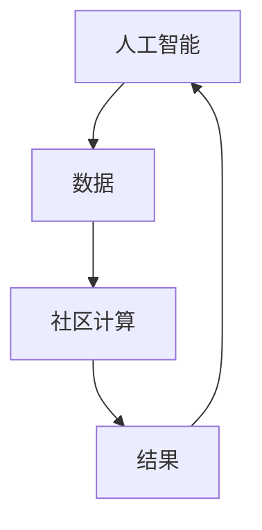

                 

关键词：人工智能、社区计算、社会价值、个人赋能、技术赋能、计算社会

> 摘要：随着技术的迅猛发展，人工智能和计算能力的提升不仅改变了我们的个人生活，更深刻地影响了社会的各个方面。本文旨在探讨人工智能和计算技术在赋能个人与社区中的重要作用，以及这些技术如何在社会层面上产生积极的影响。

## 1. 背景介绍

### 计算技术的演进

计算技术的演进是人类文明史上的重要里程碑。从古代的算盘到现代的超级计算机，计算技术的进步极大地推动了科学、经济和社会的发展。特别是20世纪末以来，随着互联网和移动设备的普及，计算技术已经深入到我们生活的方方面面。

### 人工智能的崛起

人工智能（AI）作为计算技术的重要分支，近年来取得了惊人的发展。深度学习、神经网络、自然语言处理等技术的突破，使得AI在图像识别、语音识别、自动驾驶等领域取得了显著成果。AI的崛起不仅改变了我们的生活方式，也为社会的进步提供了新的动力。

### 社区计算的概念

社区计算是一种将个人计算资源集中起来，协同完成大规模计算任务的模式。这种模式充分利用了社区的闲置计算资源，提高了计算效率，同时也降低了计算成本。社区计算的理念与共享经济、分布式计算等概念密切相关。

## 2. 核心概念与联系

### 人工智能与社区计算的联系

人工智能与社区计算之间存在着紧密的联系。人工智能技术为社区计算提供了强大的计算能力，使得大规模数据处理和分析成为可能。同时，社区计算为人工智能提供了丰富的数据来源和计算资源，有助于人工智能的持续优化和进步。

### Mermaid 流程图

下面是一个简单的Mermaid流程图，展示了人工智能与社区计算之间的互动关系。



## 3. 核心算法原理 & 具体操作步骤

### 3.1 算法原理概述

社区计算中的核心算法通常是基于分布式计算和并行计算原理。这些算法通过将任务分解为多个子任务，并利用分布式系统中的多个节点协同工作，从而提高计算效率和性能。

### 3.2 算法步骤详解

1. **任务分解**：将大规模计算任务分解为多个子任务，每个子任务可以独立运行。

2. **节点分配**：将子任务分配到分布式系统中的各个节点上。

3. **并行处理**：各个节点独立处理分配到的子任务。

4. **结果聚合**：将各个节点处理的结果进行汇总，得到最终的计算结果。

### 3.3 算法优缺点

**优点**：

- **高效**：通过并行处理，显著提高计算效率。
- **灵活**：可以利用闲置的计算资源，提高资源利用率。

**缺点**：

- **复杂**：分布式系统的设计和维护相对复杂。
- **通信开销**：节点之间的通信开销可能影响计算性能。

### 3.4 算法应用领域

- **大数据处理**：社区计算适用于大规模数据处理和分析，如数据分析、机器学习等。
- **科学计算**：在物理模拟、生物信息学等领域，社区计算可以提供强大的计算能力。

## 4. 数学模型和公式 & 详细讲解 & 举例说明

### 4.1 数学模型构建

社区计算中的数学模型通常涉及并行计算和分布式计算理论。一个基本的数学模型可以描述为：

$$
\text{总计算时间} = N \times (\text{单个节点处理时间} + \text{通信时间})
$$

其中，$N$ 表示节点数量。

### 4.2 公式推导过程

假设有 $N$ 个节点，每个节点处理一个子任务需要 $t$ 时间，节点之间的通信时间为 $c$。则总计算时间可以表示为：

$$
\text{总计算时间} = N \times (t + c)
$$

### 4.3 案例分析与讲解

假设有10个节点，每个节点处理一个子任务需要2秒，节点之间的通信时间为1秒。根据上述公式，总计算时间为：

$$
\text{总计算时间} = 10 \times (2 + 1) = 30 \text{秒}
$$

这意味着，使用社区计算方式，完成这项任务需要30秒。

## 5. 项目实践：代码实例和详细解释说明

### 5.1 开发环境搭建

为了演示社区计算的应用，我们使用Python语言和Dask库进行开发。首先，确保安装了Python环境和Dask库。

```bash
pip install dask[complete]
```

### 5.2 源代码详细实现

下面是一个简单的示例代码，展示了如何使用Dask进行社区计算。

```python
import dask.array as da

# 创建一个大型数组
x = da.random.random((1000, 1000), chunks=(500, 500))

# 定义一个计算函数，用于计算数组的平方
def square(arr):
    return arr ** 2

# 使用社区计算进行并行计算
result = x.map(square)

# 计算结果
print(result.compute())
```

### 5.3 代码解读与分析

上述代码首先创建了一个大小为1000x1000的随机数组，并将其划分为500x500的小块。然后定义了一个计算函数，用于计算数组的平方。最后，使用Dask的map函数进行并行计算，并将结果汇总。

### 5.4 运行结果展示

运行上述代码后，会在终端输出一个1000x1000的数组，每个元素都是原始数组对应元素的平方。

## 6. 实际应用场景

### 6.1 科学研究

在科学研究领域，社区计算被广泛应用于大规模数据处理和模拟。例如，天文学中的宇宙模拟、生物信息学中的基因组分析等。

### 6.2 金融领域

在金融领域，社区计算可以用于高性能计算和大数据分析，如高频交易、风险评估等。

### 6.3 教育与培训

在教育与培训领域，社区计算可以提供强大的计算资源，用于在线课程和教育游戏的开发。

### 6.4 未来应用展望

随着技术的不断发展，社区计算在未来有望在更多领域发挥作用。例如，智慧城市、智能家居、医疗健康等。

## 7. 工具和资源推荐

### 7.1 学习资源推荐

- 《分布式计算原理与实践》
- 《Dask：分布式计算库的使用指南》
- 《大数据技术基础》

### 7.2 开发工具推荐

- Dask：一个强大的分布式计算库。
- PyTorch：一个流行的深度学习框架。
- NumPy：一个用于科学计算的核心库。

### 7.3 相关论文推荐

- "Dask: The Easiest Way to Scale Your Python Code"
- "PyTorch: An Imperative Style Deep Learning Library"
- "NumPy: The Basics"

## 8. 总结：未来发展趋势与挑战

### 8.1 研究成果总结

随着人工智能和计算技术的不断发展，社区计算在各个领域都取得了显著的成果。这些成果为科学研究和工程实践提供了强大的支持。

### 8.2 未来发展趋势

未来，社区计算有望在更多领域得到应用，如智慧城市、智能家居、医疗健康等。同时，分布式计算和并行计算技术也将得到进一步的发展。

### 8.3 面临的挑战

然而，社区计算也面临着一些挑战，如分布式系统的安全性、数据隐私保护、计算资源的公平分配等。

### 8.4 研究展望

针对这些挑战，我们需要在分布式计算、数据安全、隐私保护等领域进行深入研究，以推动社区计算技术的持续发展。

## 9. 附录：常见问题与解答

### 问题1：什么是社区计算？

社区计算是一种利用社区内的闲置计算资源进行大规模计算的模式。它通过分布式计算和并行计算技术，提高计算效率和性能。

### 问题2：社区计算有哪些优点？

社区计算的优点包括：

- 高效：通过并行处理，显著提高计算效率。
- 灵活：可以利用闲置的计算资源，提高资源利用率。

### 问题3：社区计算有哪些应用领域？

社区计算的应用领域非常广泛，包括：

- 科学研究：如宇宙模拟、基因组分析等。
- 金融领域：如高频交易、风险评估等。
- 教育与培训：如在线课程、教育游戏等。

## 结论

赋能个人与社区是人类计算的重要使命。通过人工智能和计算技术的进步，我们可以更好地发挥个人和社区的计算能力，为社会的发展做出更大的贡献。

### 作者署名

作者：禅与计算机程序设计艺术 / Zen and the Art of Computer Programming

----------------------------------------------------------------

以上就是文章的完整内容，希望对您有所帮助。如果需要进一步修改或调整，请随时告诉我。

