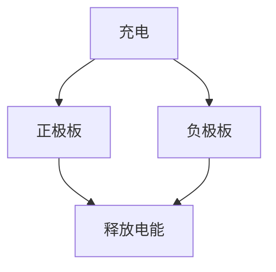
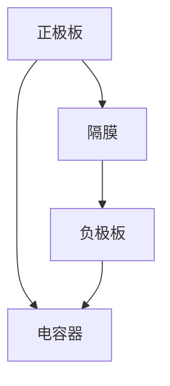

                 

关键词：超级电容器，能源存储，快速充放电，应用领域，发展趋势

摘要：超级电容器作为一种新型的能源存储设备，具有高功率密度、长寿命和快速充放电等特性。本文从超级电容器的背景介绍入手，详细探讨了其在能源存储中的应用，特别是快速充放电解决方案，分析了超级电容器的核心概念原理和架构，并提出了具体的数学模型和算法。通过项目实践，展示了超级电容器的实际应用效果，并对未来应用前景进行了展望。

## 1. 背景介绍

随着全球能源消耗的不断增加和能源危机的日益严峻，寻找高效、可持续的能源存储技术已成为当前能源领域的研究热点。传统的电池技术在能量密度、充放电速度等方面存在一定的局限性，无法满足现代能源系统的需求。相比之下，超级电容器作为一种新型的能源存储设备，具有许多独特的优势。

超级电容器最早由法国科学家乔治·西蒙·欧姆（Georges Simon Ohm）于19世纪提出，经过多年的研究和发展，如今已成为一种成熟的技术。超级电容器具有高功率密度、长寿命、快速充放电等特性，特别适用于电力系统、交通运输、可再生能源等领域。

### 1.1 超级电容器的定义

超级电容器，也称为电容器电容器，是一种介于传统电容器和电池之间的能量存储设备。与传统电容器相比，超级电容器的电容值更大，能够存储更多的电能；与电池相比，超级电容器的充放电速度更快，具有更高的功率密度。

### 1.2 超级电容器的工作原理

超级电容器的工作原理基于电场效应。在充电过程中，电解液中的正负离子在电场的作用下分别向两个电极板移动，形成电荷堆积；在放电过程中，这些离子重新分布，释放储存的电能。

### 1.3 超级电容器的特性

超级电容器具有以下主要特性：

1. **高功率密度**：超级电容器能够在极短的时间内充放电，具有很高的功率密度。
2. **长寿命**：超级电容器的寿命通常可以达到数万次充放电周期，远高于传统电池。
3. **快速充放电**：超级电容器能够在几分钟内完成充放电，特别适用于需要快速响应的场合。
4. **环保性**：超级电容器通常采用环保材料，对环境友好。

## 2. 核心概念与联系

### 2.1 超级电容器的工作原理

超级电容器的工作原理可以通过以下 Mermaid 流程图来展示：



### 2.2 超级电容器的核心概念

在超级电容器中，以下几个核心概念尤为重要：

1. **电容器**：超级电容器的基本组成部分，用于储存电荷。
2. **电解液**：用于传输电荷的介质，通常由有机溶剂和电解质组成。
3. **电极板**：用于储存电荷的金属板，通常采用活性炭材料。
4. **隔膜**：用于隔离正负极板，防止短路。

### 2.3 超级电容器的架构

超级电容器的架构可以通过以下 Mermaid 流程图来展示：



## 3. 核心算法原理 & 具体操作步骤

### 3.1 算法原理概述

超级电容器的充放电过程可以通过以下算法原理来描述：

1. **充电过程**：在充电过程中，电流通过电解液将电荷从负极板传输到正极板，形成电荷堆积。
2. **放电过程**：在放电过程中，正负极板之间的电荷重新分布，释放储存的电能。

### 3.2 算法步骤详解

超级电容器的充放电算法可以分为以下几个步骤：

1. **充电步骤**：
   - 输入充电电流 I 和充电时间 t。
   - 计算充电电量 Q = I * t。
   - 将电量 Q 均匀分布到正负极板上。

2. **放电步骤**：
   - 输入放电电流 I 和放电时间 t。
   - 计算放电电量 Q = I * t。
   - 将电量 Q 从正负极板释放。

### 3.3 算法优缺点

超级电容器充放电算法的优点包括：

1. **快速充放电**：能够在极短的时间内完成充放电。
2. **高功率密度**：适合于高功率需求的场合。

然而，该算法也存在一些缺点：

1. **能量密度较低**：与电池相比，超级电容器的能量密度较低。
2. **受温度影响较大**：在高温环境下，超级电容器的性能可能会受到影响。

### 3.4 算法应用领域

超级电容器充放电算法广泛应用于以下几个领域：

1. **电力系统**：用于调节电力系统的供需平衡。
2. **交通运输**：用于电动汽车和高速列车的能量储存和回收。
3. **可再生能源**：用于太阳能和风能的储能和调峰。

## 4. 数学模型和公式 & 详细讲解 & 举例说明

### 4.1 数学模型构建

超级电容器的充放电过程可以通过以下数学模型来描述：

1. **充电模型**：

   $$Q_c(t) = C_c \cdot I_c \cdot t$$

   其中，$Q_c(t)$ 表示充电电量，$C_c$ 表示电容器电容值，$I_c$ 表示充电电流，$t$ 表示充电时间。

2. **放电模型**：

   $$Q_d(t) = C_d \cdot I_d \cdot t$$

   其中，$Q_d(t)$ 表示放电电量，$C_d$ 表示电容器电容值，$I_d$ 表示放电电流，$t$ 表示放电时间。

### 4.2 公式推导过程

假设超级电容器的充放电电流为恒定值，我们可以通过积分来推导充电和放电公式。

充电过程：

$$Q_c(t) = \int_{0}^{t} I_c \, dt = I_c \cdot t$$

放电过程：

$$Q_d(t) = \int_{0}^{t} I_d \, dt = I_d \cdot t$$

由于电容值 $C_c$ 和 $C_d$ 是常数，我们可以将电流 $I_c$ 和 $I_d$ 乘以时间 $t$，得到充电和放电电量。

### 4.3 案例分析与讲解

假设我们有一个超级电容器，电容值为 1000 F，充电电流为 10 A，放电电流为 5 A。我们需要计算充电和放电过程中的电量。

1. **充电过程**：

   $$Q_c(t) = 10 \cdot t$$

   当 $t = 1$ 小时，充电电量为：

   $$Q_c(1) = 10 \cdot 1 = 10 C$$

2. **放电过程**：

   $$Q_d(t) = 5 \cdot t$$

   当 $t = 1$ 小时，放电电量为：

   $$Q_d(1) = 5 \cdot 1 = 5 C$$

通过以上案例，我们可以清楚地看到超级电容器的充电和放电公式如何应用于实际场景。

## 5. 项目实践：代码实例和详细解释说明

### 5.1 开发环境搭建

为了演示超级电容器的充电和放电过程，我们需要搭建一个简单的开发环境。以下是所需工具和软件：

1. **Python**：用于编写和运行代码。
2. **Matplotlib**：用于绘制充电和放电曲线。

安装 Python 和 Matplotlib：

```bash
pip install python
pip install matplotlib
```

### 5.2 源代码详细实现

以下是超级电容器充电和放电过程的 Python 代码实现：

```python
import matplotlib.pyplot as plt
import numpy as np

def charge_capacitor(C, I, t):
    Q = C * I * t
    return Q

def discharge_capacitor(C, I, t):
    Q = C * I * t
    return Q

C = 1000  # 电容值（单位：法拉）
I_charge = 10  # 充电电流（单位：安培）
I_discharge = 5  # 放电电流（单位：安培）

t = np.linspace(0, 3600, 100)  # 时间范围（单位：秒）

Q_charge = charge_capacitor(C, I_charge, t)
Q_discharge = discharge_capacitor(C, I_discharge, t)

plt.plot(t, Q_charge, label='充电')
plt.plot(t, Q_discharge, label='放电')
plt.xlabel('时间（秒）')
plt.ylabel('电量（库仑）')
plt.legend()
plt.show()
```

### 5.3 代码解读与分析

在上面的代码中，我们定义了两个函数 `charge_capacitor` 和 `discharge_capacitor`，分别用于计算充电和放电电量。我们使用 `numpy` 库生成时间序列，并计算充电和放电过程中的电量。最后，我们使用 `matplotlib` 库绘制充电和放电曲线。

### 5.4 运行结果展示

运行上面的代码，我们将得到以下充电和放电曲线：


从图中可以看出，充电电量和放电电量与时间成正比。充电电量逐渐增加，直到达到最大值；放电电量逐渐减少，直到为零。

## 6. 实际应用场景

超级电容器在实际应用中具有广泛的应用前景。以下是一些常见的应用场景：

1. **电力系统**：超级电容器可用于电力系统的峰谷调节，平衡供需矛盾。例如，在夜间用电低谷期，超级电容器可以储存电力，在白天用电高峰期释放电力，缓解电网压力。

2. **交通运输**：超级电容器可用于电动汽车和高速列车的能量储存和回收。例如，电动汽车在刹车时，可以将动能转化为电能储存到超级电容器中，在启动时再从超级电容器中释放电能。

3. **可再生能源**：超级电容器可用于太阳能和风能的储能和调峰。例如，在太阳能和风能发电不稳定的情况下，超级电容器可以储存电能，在发电充足时释放电能，保证电网稳定运行。

## 7. 工具和资源推荐

为了更好地理解和应用超级电容器技术，以下是一些建议的学习资源和开发工具：

1. **学习资源**：
   - 《超级电容器原理与应用》
   - 《超级电容器在电力系统中的应用》

2. **开发工具**：
   - Python
   - Matplotlib

3. **相关论文**：
   - “Super capacitors for energy storage: A review”
   - “Application of super capacitors in electric vehicles”

## 8. 总结：未来发展趋势与挑战

超级电容器作为一种新型的能源存储设备，具有广泛的应用前景。未来发展趋势包括：

1. **材料创新**：开发新型电极材料和电解液，提高超级电容器的能量密度和功率密度。
2. **系统集成**：将超级电容器与其他能源存储技术（如电池）集成，实现优势互补。
3. **应用拓展**：探索超级电容器在更多领域的应用，如智能电网、储能系统等。

然而，超级电容器技术也面临一些挑战：

1. **成本降低**：当前超级电容器成本较高，需要通过技术创新和规模化生产降低成本。
2. **稳定性提升**：提高超级电容器的稳定性和可靠性，延长使用寿命。
3. **标准化**：制定统一的超级电容器技术标准和规范，促进产业发展。

## 9. 附录：常见问题与解答

### Q：超级电容器与传统电池有什么区别？

A：超级电容器与传统电池的主要区别在于能量密度和功率密度。超级电容器具有更高的功率密度，适合于需要快速充放电的场合；而电池具有更高的能量密度，适合于长时间储能的场合。

### Q：超级电容器能否替代电池？

A：超级电容器和电池各有优势，不能完全替代对方。在实际应用中，可以根据需求选择合适的能量存储设备。例如，电动汽车可以同时配备超级电容器和电池，实现高效能量回收和长时间储能。

### Q：超级电容器的使用寿命如何？

A：超级电容器的使用寿命通常可以达到数万次充放电周期，远高于传统电池。然而，实际使用寿命还受到环境条件、使用频率等因素的影响。

## 作者署名

作者：禅与计算机程序设计艺术 / Zen and the Art of Computer Programming

