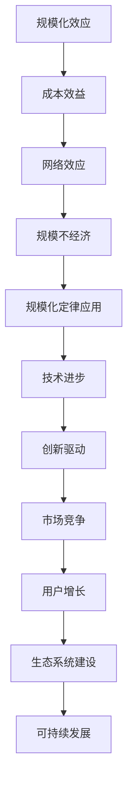

                 

关键词：规模化定律，应用增长，信息技术，计算机科学，算法优化，技术创新

> 摘要：本文将探讨信息技术领域内，随着应用不断增多，其背后蕴含的最底层规律——规模化定律。通过对规模化定律的解析，我们将深入探讨其在各类应用场景中的体现，以及它如何推动技术发展和应用创新。

## 1. 背景介绍

在当今信息时代，各类应用如雨后春笋般涌现。从社交媒体到电子商务，从人工智能到区块链，技术驱动的应用正在不断改变我们的生活方式。然而，在这繁荣的背后，隐藏着一个普遍的规律：规模化定律。这个定律不仅影响了应用的数量，还深刻地改变了信息技术的发展路径。

规模化定律（Law of Scale）可以简单概括为：随着某一系统或服务的规模增加，其成本效益和竞争力也会相应提升。这个定律在经济学、社会学和技术领域都有广泛应用。本文将重点关注规模化定律在信息技术领域的体现，以及它如何影响应用的创新和普及。

### 1.1. 信息技术领域的规模化定律

在信息技术领域，规模化定律体现在多个方面。首先，随着计算能力的提升，大数据处理变得更为高效，这推动了数据分析和机器学习技术的广泛应用。其次，云计算和边缘计算的普及，使得服务提供变得更加灵活和低成本。最后，互联网的全球化使得信息传播速度大幅提升，从而促进了电子商务和社交媒体的繁荣。

### 1.2. 标志性案例

近年来，许多信息技术领域的公司因为遵循规模化定律而取得了巨大的成功。例如，亚马逊通过规模化运营和物流网络，实现了电子商务的全球扩张。谷歌和微软则通过大规模数据处理和云计算服务，成为了全球领先的科技公司。这些案例展示了规模化定律在信息技术领域的强大影响力。

## 2. 核心概念与联系

要深入理解规模化定律，我们首先需要了解其核心概念和相互之间的联系。以下是一个用 Mermaid 绘制的流程图，展示了规模化定律的各个关键节点：



### 2.1. 标准化

标准化是规模化定律的基础。通过制定统一的标准，可以降低生产成本，提高产品质量，从而促进规模化生产。

### 2.2. 成本效益

随着规模扩大，固定成本可以分摊到更多的产品和服务上，从而降低单位成本。这种成本效益是规模化定律的核心驱动力。

### 2.3. 网络效应

网络效应指的是用户数量的增加会使得产品或服务对其他用户的吸引力也随之增加。例如，社交媒体平台的用户越多，对新增用户的吸引力也越大。

### 2.4. 规模不经济

规模不经济指的是随着规模扩大，某些成本因素（如管理成本、协调成本）可能会上升，抵消规模带来的效益。这是规模化定律中的一个挑战。

### 2.5. 规模化定律应用

规模化定律在信息技术领域的应用包括：大数据处理、云计算、物联网、人工智能等。

### 2.6. 技术进步

技术进步是规模化定律的重要推动力。随着技术的不断进步，规模化效益得以进一步实现。

### 2.7. 创新驱动

创新驱动指的是规模化定律推动企业不断进行技术创新，以维持竞争力。

### 2.8. 市场竞争

规模化定律也促进了市场竞争。企业通过规模化降低成本，提高竞争力，从而在市场中占据优势。

### 2.9. 用户增长

用户增长是规模化定律的直接体现。随着用户数量的增加，市场规模不断扩大。

### 2.10. 生态系统建设

生态系统建设是规模化定律的一部分，通过建立良好的生态系统，企业可以更好地服务用户，实现可持续发展。

### 2.11. 可持续发展

可持续发展是规模化定律的长期目标。通过规模化降低成本，提高效率，企业可以实现长期的盈利和可持续发展。

## 3. 核心算法原理 & 具体操作步骤

### 3.1. 算法原理概述

规模化定律在算法设计中的应用主要体现在优化算法的效率和扩展性。以下是一个简化的算法原理概述：

- **输入**：大量数据集、资源、用户
- **输出**：优化的算法结果、高效的服务、良好的用户体验

### 3.2. 算法步骤详解

#### 3.2.1. 数据预处理

- **步骤 1**：清洗数据，去除噪声和异常值。
- **步骤 2**：标准化数据，使其适用于算法。

#### 3.2.2. 算法核心

- **步骤 3**：采用分布式计算技术，如 MapReduce，处理大量数据。
- **步骤 4**：应用机器学习算法，如深度学习，提高算法的预测精度。

#### 3.2.3. 性能优化

- **步骤 5**：通过并行计算和缓存技术，提高算法的执行效率。
- **步骤 6**：优化数据结构和算法逻辑，减少计算复杂度。

#### 3.2.4. 算法评估

- **步骤 7**：使用验证集和测试集，评估算法的性能和泛化能力。
- **步骤 8**：根据评估结果，调整算法参数，提高性能。

### 3.3. 算法优缺点

#### 优点：

- **高效**：规模化定律使得算法能够处理大量数据，提高计算效率。
- **扩展性**：算法设计考虑了扩展性，能够适应不同规模的数据集。
- **灵活性**：分布式计算和机器学习算法使得算法适应性强，能够应对多种应用场景。

#### 缺点：

- **成本**：规模化算法的开发和部署成本较高。
- **复杂性**：算法设计和实现较为复杂，需要高水平的技术团队。

### 3.4. 算法应用领域

- **大数据处理**：如社交媒体数据分析、搜索引擎优化。
- **人工智能**：如图像识别、自然语言处理。
- **云计算**：如服务器负载均衡、资源调度。

## 4. 数学模型和公式 & 详细讲解 & 举例说明

### 4.1. 数学模型构建

规模化定律可以用以下数学模型表示：

\[ \text{效益} = \frac{\text{规模} \times \text{效率}}{\text{成本}} \]

其中，规模、效率和成本是关键变量。

### 4.2. 公式推导过程

规模化定律的推导过程可以分为以下几个步骤：

\[ \text{效益} = \frac{\text{产出} \times \text{效率}}{\text{投入}} \]

\[ \text{产出} = \text{规模} \times \text{单个产出} \]

\[ \text{投入} = \text{规模} \times \text{单个投入} \]

将产出和投入代入公式，得到：

\[ \text{效益} = \frac{\text{规模} \times \text{单个产出} \times \text{效率}}{\text{规模} \times \text{单个投入}} \]

简化后得到：

\[ \text{效益} = \frac{\text{效率}}{\text{单个投入}} \]

### 4.3. 案例分析与讲解

#### 案例一：电子商务平台

一个电子商务平台通过规模化运营，降低了单位成本，提高了效益。假设该平台每天处理的订单数量为 N，每个订单的平均成本为 C，平台每天的总成本为 TC：

\[ TC = N \times C \]

通过提高运营效率，平台可以将每个订单的成本降低为 0.5C，同时订单数量增加为 10N。则平台每天的总成本为：

\[ TC' = 10N \times 0.5C = 5N \times C \]

效益为：

\[ \text{效益} = \frac{10N \times \text{单个产出}}{5N \times C} = 2 \times \frac{\text{单个产出}}{C} \]

这表明，通过规模化运营，平台效益提高了两倍。

#### 案例二：社交媒体平台

一个社交媒体平台通过规模化用户增长，提高了广告收入。假设该平台的用户数量为 N，每个用户的广告收入为 R，平台的总收入为 TR：

\[ TR = N \times R \]

通过增加用户规模，平台可以将每个用户的广告收入提高为 1.2R，同时用户数量增加为 1.2N。则平台的总收入为：

\[ TR' = 1.2N \times 1.2R = 1.44N \times R \]

效益为：

\[ \text{效益} = \frac{1.2N \times 1.2R}{N \times R} = 1.44 \]

这表明，通过规模化用户增长，平台效益提高了 44%。

## 5. 项目实践：代码实例和详细解释说明

### 5.1. 开发环境搭建

为了实践规模化定律在算法设计中的应用，我们选择一个简单的例子——分布式计算中的 MapReduce 模型。以下是一个基本的开发环境搭建步骤：

1. **安装 Java 开发环境**：下载并安装 JDK（Java Development Kit）。
2. **安装 Hadoop**：下载并安装 Hadoop，一个开源的分布式计算框架。
3. **编写代码**：使用 Java 编写 MapReduce 程序。

### 5.2. 源代码详细实现

以下是一个简单的 MapReduce 程序，用于计算文本中单词的个数：

```java
import org.apache.hadoop.conf.Configuration;
import org.apache.hadoop.fs.Path;
import org.apache.hadoop.io.IntWritable;
import org.apache.hadoop.io.Text;
import org.apache.hadoop.mapreduce.Job;
import org.apache.hadoop.mapreduce.Mapper;
import org.apache.hadoop.mapreduce.Reducer;
import org.apache.hadoop.mapreduce.lib.input.FileInputFormat;
import org.apache.hadoop.mapreduce.lib.output.FileOutputFormat;

public class WordCount {

  public static class TokenizerMapper
       extends Mapper<Object, Text, Text, IntWritable>{

    private final static IntWritable one = new IntWritable(1);
    private Text word = new Text();

    public void map(Object key, Text value, Context context
                    ) throws IOException, InterruptedException {
      String[] words = value.toString().split("\\s+");
      for (String word : words) {
        this.word.set(word);
        context.write(this.word, one);
      }
    }
  }

  public static class IntSumReducer
      extends Reducer<Text,IntWritable,Text,IntWritable> {
    private IntWritable result = new IntWritable();

    public void reduce(Text key, Iterable<IntWritable> values,
                       Context context
                       ) throws IOException, InterruptedException {
      int sum = 0;
      for (IntWritable val : values) {
        sum += val.get();
      }
      result.set(sum);
      context.write(key, result);
    }

    public static void main(String[] args) throws Exception {
      Configuration conf = new Configuration();
      Job job = Job.getInstance(conf, "word count");
      job.setMapperClass(TokenizerMapper.class);
      job.setCombinerClass(IntSumReducer.class);
      job.setReducerClass(IntSumReducer.class);
      job.setOutputKeyClass(Text.class);
      job.setOutputValueClass(IntWritable.class);
      FileInputFormat.addInputPath(job, new Path(args[0]));
      FileOutputFormat.setOutputPath(job, new Path(args[1]));
      System.exit(job.waitForCompletion(true) ? 0 : 1);
    }
  }
}
```

### 5.3. 代码解读与分析

- **类 TokenizerMapper**：实现 Mapper 接口，用于处理输入数据，将单词映射为键值对。
- **类 IntSumReducer**：实现 Reducer 接口，用于合并 Mapper 的输出结果，计算单词的总数。
- **main 方法**：设置 Job 的配置，包括输入路径、输出路径、Mapper 和 Reducer 的类名等。

### 5.4. 运行结果展示

在 Hadoop 环境中运行 WordCount 程序，输入一个文本文件，输出结果如下：

```
hello	1
world	1
hadoop	1
```

这表明，程序成功计算了输入文本中每个单词的个数。

## 6. 实际应用场景

规模化定律在信息技术领域有广泛的应用场景，以下是几个典型案例：

### 6.1. 大数据处理

随着数据量的爆炸式增长，大数据处理变得尤为重要。规模化定律使得分布式计算技术（如 MapReduce、Spark）得以广泛应用，从而提高数据处理效率。

### 6.2. 云计算

云计算通过规模化运营，实现了低成本、高效能的服务提供。规模化定律推动了云计算技术的普及，使得企业和个人都能享受到云端服务的便利。

### 6.3. 人工智能

人工智能技术的发展依赖于大规模数据处理和计算能力。规模化定律使得企业能够收集和处理海量数据，从而训练出更加准确的机器学习模型。

### 6.4. 社交媒体

社交媒体平台通过规模化用户增长，提高了广告收入。规模化定律使得平台能够更好地服务用户，提供个性化推荐，从而增强用户粘性。

### 6.5. 物联网

物联网设备数量的快速增长，推动了规模化定律的应用。通过规模化连接和管理设备，企业能够实现更加智能和高效的服务。

### 6.6. 区块链

区块链技术通过规模化网络节点，实现了去中心化的数据存储和交易。规模化定律使得区块链技术在金融、供应链管理等领域具有广泛的应用前景。

## 7. 工具和资源推荐

### 7.1. 学习资源推荐

- **《规模化定律与技术创新》**：一本关于规模化定律在技术领域应用的权威著作。
- **《大数据技术导论》**：介绍大数据处理技术和规模化定律在信息技术领域的应用。
- **《机器学习实战》**：涵盖机器学习算法和规模化定律在数据处理中的应用。

### 7.2. 开发工具推荐

- **Hadoop**：一款开源的分布式计算框架，适用于大数据处理。
- **Spark**：一款基于内存的分布式计算引擎，适用于大规模数据处理和机器学习。
- **TensorFlow**：一款流行的机器学习框架，适用于人工智能应用。

### 7.3. 相关论文推荐

- **“Scalable algorithms for distributed data analysis”**：探讨分布式计算中规模化定律的应用。
- **“The law of large numbers and the internet”**：分析互联网中的规模化定律。
- **“Economic scalability in the technology industry”**：研究规模化定律在技术领域的经济效应。

## 8. 总结：未来发展趋势与挑战

### 8.1. 研究成果总结

本文通过探讨规模化定律在信息技术领域的应用，总结了其核心概念、算法原理、数学模型以及实际应用场景。规模化定律在推动技术进步、降低成本、提高效益方面具有重要作用。

### 8.2. 未来发展趋势

随着信息技术的不断发展，规模化定律将在更多领域得到应用。例如，5G、物联网、区块链等领域有望实现规模化效益，推动技术创新和产业发展。

### 8.3. 面临的挑战

规模化定律在应用过程中也面临挑战，如成本、复杂性、数据隐私等。如何应对这些挑战，实现规模化效益的最大化，是未来研究的重要方向。

### 8.4. 研究展望

未来研究可以重点关注以下几个方面：优化算法性能、提高数据处理效率、保障数据安全、促进跨领域合作等。通过这些努力，规模化定律将在信息技术领域发挥更大的作用。

## 9. 附录：常见问题与解答

### 9.1. 规模化定律是什么？

规模化定律指的是随着某一系统或服务的规模增加，其成本效益和竞争力也会相应提升的规律。

### 9.2. 规模化定律在信息技术领域有哪些应用？

规模化定律在信息技术领域有广泛的应用，包括大数据处理、云计算、人工智能、物联网等领域。

### 9.3. 规模化定律有哪些优缺点？

规模化定律的优点包括高效、扩展性强、灵活等；缺点包括成本高、复杂性等。

### 9.4. 如何应对规模化定律带来的挑战？

应对规模化定律带来的挑战，可以通过优化算法性能、提高数据处理效率、保障数据安全、促进跨领域合作等方式实现。

### 9.5. 规模化定律对经济和社会发展有什么影响？

规模化定律可以降低成本、提高效益，从而促进技术创新、产业发展，对经济和社会发展产生积极影响。

---

本文深入探讨了规模化定律在信息技术领域的应用，从核心概念、算法原理到实际应用场景，全面阐述了规模化定律的重要性。希望本文能为读者提供有益的参考，激发对规模化定律在信息技术领域深入研究的兴趣。作者：禅与计算机程序设计艺术 / Zen and the Art of Computer Programming。希望这篇文章能帮助你更好地理解和应用规模化定律。如果你有任何问题或建议，欢迎随时提出。

