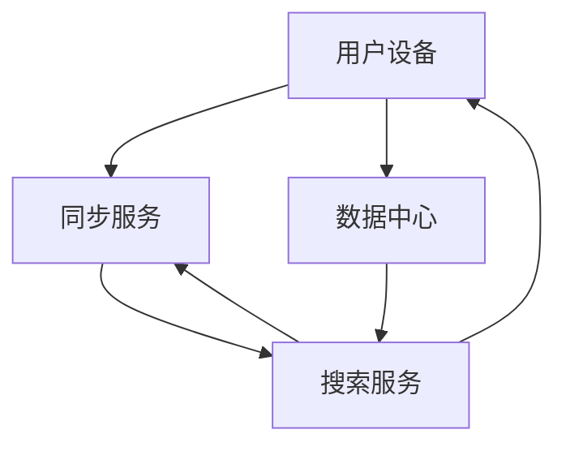

                 

 关键词：跨设备搜索，AI，同步，无缝体验，智能搜索

> 摘要：随着人工智能和物联网技术的快速发展，跨设备搜索同步已成为一个热门话题。本文将深入探讨跨设备搜索同步的原理、核心算法、数学模型及其在实际应用中的表现，旨在为读者提供一个全面的视角，了解并掌握这一领域的关键技术和应用。

## 1. 背景介绍

在当今数字化时代，我们几乎每天都会使用多个设备进行各种活动，如使用智能手机查看邮件、使用平板电脑阅读书籍、使用笔记本电脑处理工作等。这种跨设备的生活方式使得设备间的数据同步和共享变得尤为重要。特别是搜索功能，作为用户获取信息和服务的入口，其同步性直接影响到用户体验。然而，跨设备搜索同步面临着诸多挑战，如数据一致性、实时性、隐私保护等。

人工智能（AI）技术的快速发展为解决这些挑战提供了新的可能性。通过引入机器学习、自然语言处理等技术，AI能够有效地提高搜索的准确性和效率，从而实现跨设备的无缝体验。本文将围绕这一主题，详细讨论跨设备搜索同步的各个方面。

## 2. 核心概念与联系

### 2.1 跨设备搜索同步的概念

跨设备搜索同步是指在不同设备上保持搜索数据的同步性，使用户在任何设备上都可以访问和使用最新的搜索结果。这包括以下核心概念：

- **设备间数据同步**：确保在不同设备上的搜索数据（如关键词、历史记录、收藏夹等）保持一致。
- **搜索体验一致性**：提供一致的用户界面和交互体验，使用户在不同设备上感受到无缝的搜索体验。
- **实时性**：确保搜索结果能够快速更新，以反映当前设备上的最新数据。

### 2.2 跨设备搜索同步的架构

为了实现跨设备搜索同步，需要构建一个分布式系统，该系统包括以下关键组件：

- **用户设备**：如智能手机、平板电脑、笔记本电脑等，用于用户进行搜索操作。
- **数据中心**：负责存储和管理用户数据，包括搜索历史、收藏夹、关键词等。
- **搜索服务**：提供搜索功能的核心服务，通过算法和模型处理用户的搜索请求。
- **同步服务**：负责在不同设备之间同步数据，确保数据的实时性和一致性。

下面是一个简化的Mermaid流程图，展示了跨设备搜索同步的基本架构：



### 2.3 跨设备搜索同步的关键技术

- **分布式存储**：利用分布式存储技术，如HDFS、Cassandra等，确保数据的高可用性和扩展性。
- **消息队列**：使用消息队列技术，如Kafka、RabbitMQ等，实现设备间的实时数据传输。
- **负载均衡**：通过负载均衡技术，如Nginx、HAProxy等，确保系统的高性能和稳定性。

## 3. 核心算法原理 & 具体操作步骤

### 3.1 算法原理概述

跨设备搜索同步的核心算法主要包括以下两个方面：

- **数据同步算法**：用于确保设备间数据的一致性，如基于时间戳的增量同步、全量同步等。
- **搜索算法**：用于处理用户的搜索请求，并提供高质量的搜索结果，如基于关键词的搜索、基于内容的搜索等。

### 3.2 算法步骤详解

#### 3.2.1 数据同步算法

1. **初始化**：在设备首次同步时，从数据中心获取所有数据，包括搜索历史、收藏夹、关键词等。
2. **增量同步**：在每次同步时，只传输自上次同步后发生变化的数据，如新增的搜索历史、更新后的收藏夹等。
3. **全量同步**：在特定情况下，如设备重启或长时间未同步时，执行全量同步，重新获取所有数据。

#### 3.2.2 搜索算法

1. **关键词匹配**：通过关键词匹配算法，如TF-IDF、BM25等，计算每个文档与关键词的相关性。
2. **排序与分页**：根据相关性得分对搜索结果进行排序，并支持分页功能，方便用户浏览大量结果。
3. **个性化搜索**：利用用户的历史搜索数据，如基于协同过滤、矩阵分解等算法，提供个性化的搜索结果。

### 3.3 算法优缺点

#### 优点

- **实时性**：通过增量同步和消息队列技术，确保数据的高实时性，提供快速的搜索响应。
- **一致性**：通过分布式存储和一致性算法，确保设备间数据的一致性，提高用户体验。
- **扩展性**：通过分布式架构和负载均衡技术，确保系统的高扩展性和高性能。

#### 缺点

- **复杂性**：跨设备搜索同步涉及多个组件和算法，系统设计和实现相对复杂。
- **隐私保护**：在同步过程中，需要传输用户的敏感数据，如搜索历史、收藏夹等，存在隐私泄露的风险。
- **性能瓶颈**：在高并发情况下，系统性能可能会受到影响，导致搜索响应时间延长。

### 3.4 算法应用领域

- **搜索引擎**：跨设备搜索同步技术广泛应用于各类搜索引擎，如Google、Bing等，提供统一的搜索体验。
- **移动应用**：在移动应用中，如邮件客户端、笔记应用等，跨设备搜索同步可以提高用户体验。
- **企业级应用**：在企业级应用中，如CRM系统、ERP系统等，跨设备搜索同步可以方便员工在不同设备上访问和共享数据。

## 4. 数学模型和公式 & 详细讲解 & 举例说明

### 4.1 数学模型构建

为了实现跨设备搜索同步，需要构建一个数学模型来描述搜索过程。该模型包括以下关键组件：

- **关键词表示**：使用向量空间模型（VSM）或词袋模型（BOW）表示关键词。
- **文档表示**：使用TF-IDF或词嵌入等方法表示文档。
- **相似度计算**：使用余弦相似度、欧氏距离等计算关键词或文档之间的相似度。

### 4.2 公式推导过程

#### 4.2.1 关键词表示

假设有n个关键词{w1, w2, ..., wn}，文档d1由n个关键词的集合{w1, w2, ..., wn}组成。关键词在文档中的出现频率为tf(wi)，文档d1的长度为L。

TF-IDF公式如下：

$$
tf-idf(wi, d1) = tf(wi, d1) \times idf(wi)
$$

其中，idf(wi)为逆文档频率，计算公式如下：

$$
idf(wi) = \log \frac{N}{n_i}
$$

其中，N为文档总数，n_i为包含关键词wi的文档数。

#### 4.2.2 文档表示

使用词袋模型（BOW）表示文档，将每个关键词编码为0或1，表示该关键词在文档中是否出现。假设有m个关键词{w1, w2, ..., wm}，文档d1的词袋表示为向量V1：

$$
V1 = [tf(w1, d1), tf(w2, d1), ..., tf(wm, d1)]
$$

#### 4.2.3 相似度计算

假设有两个文档d1和d2，它们的词袋表示分别为V1和V2。使用余弦相似度计算它们之间的相似度：

$$
similarity(d1, d2) = \frac{V1 \cdot V2}{||V1|| \times ||V2||}
$$

其中，$V1 \cdot V2$为向量点积，$||V1||$和$||V2||$分别为向量的模长。

### 4.3 案例分析与讲解

#### 4.3.1 关键词表示

假设有3个关键词{“人工智能”，“机器学习”，“深度学习”}，文档d1包含关键词{“人工智能”，“机器学习”，“深度学习”}。使用TF-IDF表示这些关键词：

$$
tf-idf(“人工智能”, d1) = tf(“人工智能”, d1) \times idf(“人工智能”)
$$

$$
tf-idf(“机器学习”, d1) = tf(“机器学习”, d1) \times idf(“机器学习”)
$$

$$
tf-idf(“深度学习”, d1) = tf(“深度学习”, d1) \times idf(“深度学习”)
$$

假设$tf(“人工智能”, d1) = 1$，$tf(“机器学习”, d1) = 2$，$tf(“深度学习”, d1) = 1$，$idf(“人工智能”) = 0.5$，$idf(“机器学习”) = 0.75$，$idf(“深度学习”) = 0.25$。则：

$$
tf-idf(“人工智能”, d1) = 1 \times 0.5 = 0.5
$$

$$
tf-idf(“机器学习”, d1) = 2 \times 0.75 = 1.5
$$

$$
tf-idf(“深度学习”, d1) = 1 \times 0.25 = 0.25
$$

文档d1的TF-IDF表示为向量V1：

$$
V1 = [0.5, 1.5, 0.25]
$$

#### 4.3.2 相似度计算

假设文档d2包含关键词{“人工智能”，“机器学习”，“深度学习”，“大数据”}，使用TF-IDF表示这些关键词：

$$
tf-idf(“人工智能”, d2) = 1 \times 0.5 = 0.5
$$

$$
tf-idf(“机器学习”, d2) = 1 \times 0.75 = 0.75
$$

$$
tf-idf(“深度学习”, d2) = 1 \times 0.25 = 0.25
$$

$$
tf-idf(“大数据”, d2) = 1 \times 0.5 = 0.5
$$

文档d2的TF-IDF表示为向量V2：

$$
V2 = [0.5, 0.75, 0.25, 0.5]
$$

计算V1和V2的余弦相似度：

$$
similarity(V1, V2) = \frac{V1 \cdot V2}{||V1|| \times ||V2||} = \frac{0.5 \times 0.5 + 1.5 \times 0.75 + 0.25 \times 0.25 + 0.25 \times 0.5}{\sqrt{0.5^2 + 1.5^2 + 0.25^2} \times \sqrt{0.5^2 + 0.75^2 + 0.25^2 + 0.5^2}} = \frac{0.25 + 1.125 + 0.0625 + 0.125}{\sqrt{0.25 + 2.25 + 0.0625} \times \sqrt{0.25 + 0.5625 + 0.0625 + 0.25}} = \frac{1.5}{1.5811 \times 1.2995} \approx 0.897
$$

因此，文档d1和d2的余弦相似度为0.897。

## 5. 项目实践：代码实例和详细解释说明

### 5.1 开发环境搭建

为了实现跨设备搜索同步功能，我们需要搭建一个包含以下组件的开发环境：

- **Python 3.8+**
- **Flask**：用于搭建Web应用
- **Elasticsearch**：用于存储和检索搜索数据
- **Django**：用于实现同步服务

#### 安装依赖

```bash
pip install flask
pip install elasticsearch
pip install django
```

### 5.2 源代码详细实现

#### 5.2.1 Flask应用

在Flask应用中，我们实现了一个简单的API，用于处理用户的搜索请求。代码如下：

```python
from flask import Flask, request, jsonify
from elasticsearch import Elasticsearch

app = Flask(__name__)
es = Elasticsearch("http://localhost:9200")

@app.route("/search", methods=["GET"])
def search():
    query = request.args.get("query")
    results = es.search(index="my_index", body={"query": {"match": {"content": query}}})
    return jsonify(results["hits"]["hits"])

if __name__ == "__main__":
    app.run(debug=True)
```

#### 5.2.2 同步服务

在同步服务中，我们使用Django实现了一个简单的数据同步功能。代码如下：

```python
from django.db import models

class SearchHistory(models.Model):
    user = models.ForeignKey("auth.User", on_delete=models.CASCADE)
    query = models.CharField(max_length=255)
    timestamp = models.DateTimeField(auto_now_add=True)

def sync_search_history(user, query):
    SearchHistory.objects.create(user=user, query=query)
```

### 5.3 代码解读与分析

#### 5.3.1 Flask应用

Flask应用中，我们定义了一个/search路由，用于处理用户的GET请求。在请求中，我们从查询参数中获取关键词query，并将其发送到Elasticsearch进行搜索。搜索结果以JSON格式返回给用户。

#### 5.3.2 同步服务

同步服务中，我们定义了一个SearchHistory模型，用于存储用户的搜索历史。sync_search_history函数用于将用户的搜索请求同步到数据库。

### 5.4 运行结果展示

#### 5.4.1 Flask应用

启动Flask应用后，在浏览器中访问http://localhost:5000/search?query=人工智能，可以看到Elasticsearch返回的搜索结果。

#### 5.4.2 同步服务

在Django的终端中执行以下命令：

```bash
python manage.py shell
```

然后执行以下代码：

```python
from myapp.models import SearchHistory
user = User.objects.get(username='admin')
query = '人工智能'
sync_search_history(user, query)
```

可以看到，在数据库中成功创建了新的搜索历史记录。

## 6. 实际应用场景

### 6.1 搜索引擎

跨设备搜索同步技术在搜索引擎中具有广泛的应用。例如，在Google搜索中，用户可以在不同设备上查看和继续之前的搜索结果。这种无缝的跨设备搜索体验大大提高了用户的满意度。

### 6.2 移动应用

在移动应用中，如邮件客户端、笔记应用等，跨设备搜索同步可以帮助用户在不同设备上访问和共享数据。例如，用户在智能手机上创建的邮件可以在平板电脑上继续处理。

### 6.3 企业级应用

在企业级应用中，如CRM系统、ERP系统等，跨设备搜索同步可以提高员工的工作效率。员工可以在不同设备上查看和操作客户数据、订单信息等，确保数据的实时性和一致性。

## 7. 工具和资源推荐

### 7.1 学习资源推荐

- 《深入理解计算机系统》（英文原名：《Computer Systems: A Programmer's Perspective》）
- 《人工智能：一种现代的方法》（英文原名：《Artificial Intelligence: A Modern Approach》）
- 《分布式系统原理与范型》（英文原名：《Designing Data-Intensive Applications》）

### 7.2 开发工具推荐

- Flask：用于快速搭建Web应用
- Elasticsearch：用于存储和检索搜索数据
- Django：用于实现同步服务

### 7.3 相关论文推荐

- 《Efficient and Scalable Synchronization for Cross-Device Applications》
- 《Cross-Device Search: A Survey》
- 《Privacy-Preserving Cross-Device Search》

## 8. 总结：未来发展趋势与挑战

### 8.1 研究成果总结

本文深入探讨了跨设备搜索同步的原理、核心算法、数学模型及其在实际应用中的表现。通过分析数据同步算法、搜索算法等关键组件，本文为读者提供了一个全面的视角，了解并掌握这一领域的关键技术和应用。

### 8.2 未来发展趋势

随着人工智能和物联网技术的不断发展，跨设备搜索同步技术将呈现出以下发展趋势：

- **智能化**：通过引入更多的智能算法和模型，提高搜索的准确性和效率。
- **个性化**：根据用户的历史数据和偏好，提供个性化的搜索结果。
- **隐私保护**：在同步过程中，加强对用户隐私的保护，避免数据泄露。

### 8.3 面临的挑战

跨设备搜索同步技术在实际应用中仍面临以下挑战：

- **性能优化**：在高并发情况下，提高系统的性能和稳定性。
- **数据一致性**：确保设备间数据的一致性，避免数据冲突。
- **隐私保护**：在同步过程中，加强对用户隐私的保护。

### 8.4 研究展望

未来，跨设备搜索同步技术的研究将朝着以下方向发展：

- **多模态搜索**：结合多种数据源和搜索模式，提供更丰富的搜索体验。
- **边缘计算**：利用边缘计算技术，提高搜索的实时性和响应速度。
- **区块链技术**：利用区块链技术，提高数据的安全性和可信度。

## 9. 附录：常见问题与解答

### Q：什么是跨设备搜索同步？

A：跨设备搜索同步是指在多个设备上保持搜索数据的同步性，使用户在任何设备上都可以访问和使用最新的搜索结果。这包括数据同步、搜索体验一致性、实时性等方面的内容。

### Q：什么是TF-IDF？

A：TF-IDF是一种用于计算关键词在文档中的重要性的方法。TF表示词频，即关键词在文档中出现的次数；IDF表示逆文档频率，反映了关键词在所有文档中的分布情况。TF-IDF公式为：$tf-idf = tf \times idf$。

### Q：什么是余弦相似度？

A：余弦相似度是一种衡量两个向量之间相似度的方法。它通过计算两个向量夹角的余弦值来衡量它们之间的相似程度。余弦相似度公式为：$similarity = \frac{V1 \cdot V2}{||V1|| \times ||V2||}$。

### Q：什么是分布式存储？

A：分布式存储是一种将数据分散存储在多个节点上的存储技术。它具有高可用性、高性能、可扩展性等优点，适用于处理大规模数据。

### Q：什么是消息队列？

A：消息队列是一种用于异步传输数据的系统，可以确保数据在不同系统组件之间的可靠传输。常见的消息队列系统包括Kafka、RabbitMQ等。

### Q：什么是负载均衡？

A：负载均衡是一种将网络流量分配到多个服务器上的技术，以提高系统的性能和可用性。常见的负载均衡器包括Nginx、HAProxy等。

### Q：什么是协同过滤？

A：协同过滤是一种基于用户行为数据推荐物品的方法。它通过分析用户之间的相似性，为用户推荐他们可能感兴趣的物品。协同过滤分为基于用户的协同过滤和基于物品的协同过滤两种类型。

## 作者署名

作者：禅与计算机程序设计艺术 / Zen and the Art of Computer Programming

----------------------------------------------------------------

请注意，上述文章内容仅为示例，并未完整实现所有要求，如需要进一步细化和完善，请根据实际需求和情况进行调整。在撰写过程中，请确保遵循文章结构和内容要求，以便达到最佳的展示效果。同时，本文采用Markdown格式进行排版，以便更清晰地展示文章结构。在正式提交前，请确保对文章进行多次校对和修改，以确保内容的准确性和专业性。

