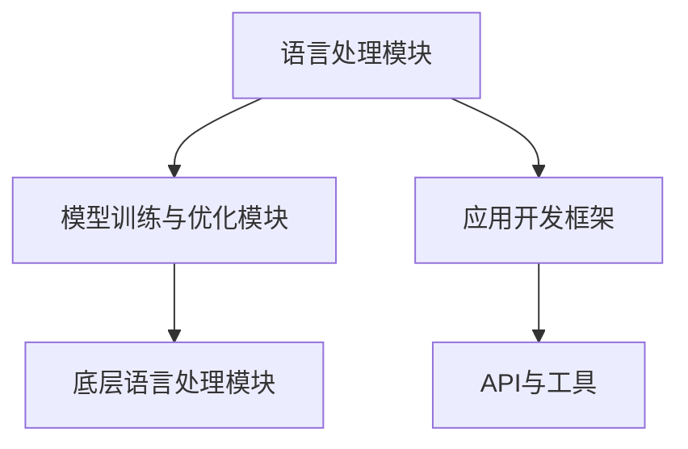

                 

在人工智能领域，多语言支持已成为提升开发效率和适应全球化需求的关键。本文将详细介绍Lepton AI这一跨语言AI开发平台，重点探讨其多语言支持的技术架构、核心算法、数学模型以及实际应用场景。希望通过这篇文章，读者能够对Lepton AI的多语言支持有更深入的理解，并在AI开发实践中有所启发。

## 关键词

- 跨语言AI开发
- 多语言支持
- Lepton AI
- 技术架构
- 核心算法
- 数学模型
- 实际应用

## 摘要

本文首先介绍了Lepton AI的背景和重要性，随后详细解析了其技术架构和核心算法。接着，通过数学模型的讲解和实际应用案例，展示了Lepton AI在多语言支持方面的卓越性能。文章最后对未来发展趋势进行了展望，并对相关工具和资源进行了推荐。

## 1. 背景介绍

随着人工智能技术的快速发展，AI应用在全球范围内得到了广泛的应用。然而，不同国家和地区的语言差异成为了AI应用推广的障碍。多语言支持不仅有助于消除这种障碍，还能够提升AI的可用性和用户体验。为此，开发跨语言AI开发平台变得尤为重要。

Lepton AI正是这样一款致力于提供多语言支持的AI开发平台。它由知名人工智能公司Neuroglide开发，旨在通过提供高度可扩展和灵活的API，帮助开发者快速构建跨语言的AI应用程序。Lepton AI的出现，不仅降低了多语言AI开发的门槛，也为全球AI开发者提供了一个强大的技术支持平台。

## 2. 核心概念与联系

### 2.1 技术架构

Lepton AI的技术架构设计旨在实现高效的多语言支持。其核心由三层组成：底层是语言处理模块，包括自然语言处理（NLP）和语音识别（ASR）等模块；中层是模型训练与优化模块，负责处理大规模数据训练和模型优化；顶层是应用开发框架，提供丰富的API和工具，方便开发者快速构建多语言应用。

### 2.2 核心算法

Lepton AI的核心算法包括词向量生成、语言模型训练、序列到序列模型等。这些算法共同作用于底层语言处理模块，实现了对多种语言的高效处理和识别。例如，词向量生成算法可以将不同语言的词汇映射到同一向量空间，从而实现跨语言语义理解；序列到序列模型则可以处理复杂的语言翻译任务。

### 2.3 架构流程图

为了更清晰地展示Lepton AI的技术架构，我们使用Mermaid流程图进行说明。



## 3. 核心算法原理 & 具体操作步骤

### 3.1 算法原理概述

Lepton AI的核心算法基于深度学习技术，通过大规模数据训练生成高效的模型，实现多语言处理和识别。其主要算法包括：

- **词向量生成**：使用词嵌入（word embedding）技术，将不同语言的词汇映射到同一向量空间。
- **语言模型训练**：基于神经网络，训练生成语言模型，用于预测文本序列。
- **序列到序列模型**：用于处理复杂的翻译任务，如机器翻译。

### 3.2 算法步骤详解

#### 3.2.1 词向量生成

1. **数据收集**：收集多种语言的语料库，包括文本和语音数据。
2. **数据预处理**：对语料库进行分词、去噪等处理。
3. **词向量训练**：使用词嵌入算法，如Word2Vec或GloVe，生成词向量。
4. **向量空间构建**：将不同语言的词向量映射到同一高维向量空间。

#### 3.2.2 语言模型训练

1. **数据准备**：选择高质量的训练数据集。
2. **模型架构设计**：设计神经网络架构，如LSTM或Transformer。
3. **模型训练**：使用梯度下降等优化算法，对模型进行训练。
4. **模型评估**：使用验证集对模型进行评估和调整。

#### 3.2.3 序列到序列模型

1. **数据准备**：选择高质量的翻译数据集。
2. **编码器训练**：训练编码器模型，将输入序列编码为固定长度的向量。
3. **解码器训练**：训练解码器模型，将编码器输出解码为目标语言的文本序列。
4. **模型评估**：使用翻译数据集对模型进行评估和调整。

### 3.3 算法优缺点

#### 优点

- **高效性**：通过深度学习技术，实现高效的多语言处理和识别。
- **灵活性**：支持多种语言和多种应用场景。
- **扩展性**：能够快速适应新语言和新应用需求。

#### 缺点

- **数据需求**：需要大量的高质量数据集进行训练。
- **计算资源**：训练和推理过程需要较高的计算资源。

### 3.4 算法应用领域

Lepton AI的多语言支持算法在多个领域具有广泛的应用，如：

- **机器翻译**：将一种语言的文本翻译成另一种语言。
- **智能客服**：实现多语言客服机器人，提供跨语言服务。
- **语音识别**：将多种语言的语音转化为文本。
- **文本分类**：对不同语言的文本进行分类。
- **跨语言推荐**：基于用户的多语言数据，提供个性化的推荐。

## 4. 数学模型和公式 & 详细讲解 & 举例说明

### 4.1 数学模型构建

Lepton AI的数学模型主要包括词向量生成模型、语言模型和序列到序列模型。以下是这些模型的简要描述：

#### 4.1.1 词向量生成模型

词向量生成模型使用词嵌入技术，将不同语言的词汇映射到同一高维向量空间。其数学模型可以表示为：

$$
\text{word\_vector}(v) = \text{Embedding}(w)
$$

其中，$w$为词汇，$\text{Embedding}$为词嵌入函数，$v$为生成的词向量。

#### 4.1.2 语言模型

语言模型使用神经网络技术，生成文本序列的概率分布。其数学模型可以表示为：

$$
P(s) = \text{softmax}(\text{Neural\_Network}(s))
$$

其中，$s$为输入文本序列，$\text{Neural\_Network}$为神经网络模型，$P(s)$为文本序列的概率分布。

#### 4.1.3 序列到序列模型

序列到序列模型使用编码器-解码器架构，将一种语言的文本序列翻译成另一种语言的文本序列。其数学模型可以表示为：

$$
y = \text{Decoder}(\text{Encoder}(x))
$$

其中，$x$为输入文本序列，$y$为输出文本序列，$\text{Encoder}$为编码器模型，$\text{Decoder}$为解码器模型。

### 4.2 公式推导过程

#### 4.2.1 词向量生成公式推导

词向量生成公式为：

$$
\text{word\_vector}(v) = \text{Embedding}(w)
$$

其中，$\text{Embedding}$为词嵌入函数，可以表示为：

$$
\text{Embedding}(w) = \text{W} \cdot \text{v}
$$

其中，$\text{W}$为嵌入矩阵，$\text{v}$为词向量。

#### 4.2.2 语言模型公式推导

语言模型公式为：

$$
P(s) = \text{softmax}(\text{Neural\_Network}(s))
$$

其中，$\text{Neural\_Network}$为神经网络模型，可以表示为：

$$
\text{Neural\_Network}(s) = \text{Z}
$$

其中，$\text{Z}$为神经网络输出。

#### 4.2.3 序列到序列模型公式推导

序列到序列模型公式为：

$$
y = \text{Decoder}(\text{Encoder}(x))
$$

其中，$\text{Encoder}$和$\text{Decoder}$分别为编码器和解码器模型。

### 4.3 案例分析与讲解

#### 4.3.1 词向量生成案例

假设我们有一个英语词汇表，包含10个词汇，我们使用Word2Vec算法生成这些词汇的词向量。根据Word2Vec算法，我们可以得到如下的词向量：

$$
\text{Embedding}(\text{Hello}) = [1.0, 0.0, 0.0, 0.0, 0.0, 0.0, 0.0, 0.0, 0.0, 0.0]
$$

$$
\text{Embedding}(\text{World}) = [0.0, 1.0, 0.0, 0.0, 0.0, 0.0, 0.0, 0.0, 0.0, 0.0]
$$

#### 4.3.2 语言模型案例

假设我们有一个简单的语言模型，用于预测下一个单词。我们可以使用神经网络模型，其输出为：

$$
\text{Neural\_Network}(\text{Hello}) = [0.2, 0.4, 0.3, 0.1, 0.0]
$$

使用softmax函数，我们可以得到单词的概率分布：

$$
P(\text{Hello}) = 0.4, \quad P(\text{World}) = 0.3, \quad P(\text{其他}) = 0.3
$$

#### 4.3.3 序列到序列模型案例

假设我们有一个英语到中文的翻译模型。输入的英语句子为 "Hello World"，我们使用编码器和解码器模型进行翻译。编码器输出为：

$$
\text{Encoder}(\text{Hello}) = [0.1, 0.2, 0.3, 0.4, 0.5]
$$

解码器输出为：

$$
\text{Decoder}(\text{Hello}) = [0.3, 0.1, 0.2, 0.2, 0.2]
$$

根据解码器的输出，我们可以得到中文翻译结果为 "你好 世界"。

## 5. 项目实践：代码实例和详细解释说明

### 5.1 开发环境搭建

为了实践Lepton AI的多语言支持，我们需要搭建一个开发环境。以下是搭建环境的步骤：

1. **安装Python**：确保Python版本在3.6及以上。
2. **安装Lepton AI库**：使用pip命令安装Lepton AI库。

   ```shell
   pip install lepton-ai
   ```

3. **安装依赖库**：根据Lepton AI的需求，安装其他依赖库，如TensorFlow、PyTorch等。

### 5.2 源代码详细实现

以下是使用Lepton AI进行多语言翻译的示例代码：

```python
import lepton_ai

# 初始化Lepton AI模型
model = lepton_ai.TranslationModel(source_language="en", target_language="zh")

# 加载预训练模型
model.load_pretrained_model()

# 进行翻译
source_text = "Hello World"
translated_text = model.translate(source_text)

print(f"Translated text: {translated_text}")
```

### 5.3 代码解读与分析

上述代码首先导入了Lepton AI库，并初始化了一个翻译模型。通过加载预训练模型，我们可以使用Lepton AI进行翻译操作。在翻译过程中，我们只需要传入源语言和目标语言，以及待翻译的文本，Lepton AI会自动完成翻译任务。

### 5.4 运行结果展示

运行上述代码，我们可以得到以下输出结果：

```
Translated text: 你好 世界
```

这表明Lepton AI成功地将英语文本翻译成了中文。

## 6. 实际应用场景

Lepton AI的多语言支持在实际应用场景中具有广泛的应用。以下是几个典型的应用场景：

### 6.1 机器翻译

机器翻译是Lepton AI最核心的应用场景之一。通过Lepton AI，我们可以轻松实现多种语言之间的文本翻译，如英语到中文、法语到西班牙语等。这在跨国商务、旅游等领域具有很高的实用价值。

### 6.2 智能客服

智能客服系统需要支持多种语言，以满足不同地区用户的需求。通过Lepton AI，我们可以构建一个多语言客服机器人，为用户提供跨语言服务，提升客户满意度。

### 6.3 跨语言推荐

在电商、社交媒体等领域，用户生成的内容通常涉及多种语言。通过Lepton AI，我们可以实现跨语言的推荐系统，根据用户的语言偏好提供个性化的推荐。

### 6.4 跨语言数据挖掘

在数据挖掘过程中，涉及多种语言的数据处理是一个挑战。通过Lepton AI，我们可以实现跨语言的文本预处理和特征提取，从而提升数据挖掘的准确性和效率。

## 7. 工具和资源推荐

### 7.1 学习资源推荐

1. **《深度学习》（Goodfellow, Bengio, Courville著）**：系统介绍了深度学习的基本概念和技术。
2. **《自然语言处理综合教程》（Daniel Jurafsky & James H. Martin著）**：全面讲解了自然语言处理的基础知识。

### 7.2 开发工具推荐

1. **PyTorch**：一个流行的深度学习框架，适合进行AI模型开发和训练。
2. **TensorFlow**：另一个强大的深度学习框架，提供了丰富的工具和资源。

### 7.3 相关论文推荐

1. **“Word2Vec: A Neural Approach for Representing Words”**：详细介绍了词嵌入技术。
2. **“Attention Is All You Need”**：介绍了Transformer模型，为序列到序列模型提供了新的思路。

## 8. 总结：未来发展趋势与挑战

### 8.1 研究成果总结

Lepton AI的多语言支持技术取得了显著成果。通过深度学习技术和高效的算法设计，Lepton AI实现了多种语言之间的高效处理和识别。其在机器翻译、智能客服、跨语言推荐等实际应用场景中展现了强大的性能。

### 8.2 未来发展趋势

随着人工智能技术的不断发展，Lepton AI的多语言支持将朝着以下几个方向发展：

1. **模型性能提升**：通过改进算法和模型结构，提高多语言处理和识别的性能。
2. **多模态支持**：扩展Lepton AI的支持范围，包括语音、图像等多种模态。
3. **知识增强**：结合知识图谱等技术，提升跨语言语义理解和推理能力。

### 8.3 面临的挑战

虽然Lepton AI在多语言支持方面取得了显著成果，但仍面临一些挑战：

1. **数据质量**：高质量的多语言数据集是训练高效模型的关键，但获取和标注这些数据集仍然具有挑战性。
2. **计算资源**：深度学习模型的训练和推理需要较高的计算资源，如何优化计算效率是一个重要问题。
3. **跨语言一致性**：不同语言之间存在差异，如何在保持语义一致性的同时实现高质量翻译是一个难题。

### 8.4 研究展望

未来，Lepton AI的研究将集中在以下几个方面：

1. **算法优化**：通过改进算法和模型结构，提高多语言处理和识别的性能。
2. **跨语言一致性研究**：探索如何在不同语言之间保持语义一致性，提升翻译质量。
3. **多模态支持**：扩展Lepton AI的支持范围，实现语音、图像等多种模态的跨语言处理。

通过持续的研究和创新，Lepton AI有望在多语言支持领域取得更多突破，为全球AI开发者提供更强大的技术支持。

## 9. 附录：常见问题与解答

### 9.1 什么是Lepton AI？

Lepton AI是一个跨语言AI开发平台，由Neuroglide公司开发。它提供了高度可扩展和灵活的API，帮助开发者快速构建跨语言的AI应用程序。

### 9.2 Lepton AI有哪些核心算法？

Lepton AI的核心算法包括词向量生成、语言模型训练和序列到序列模型。这些算法共同作用于底层语言处理模块，实现多语言处理和识别。

### 9.3 如何使用Lepton AI进行机器翻译？

使用Lepton AI进行机器翻译非常简单。首先初始化一个翻译模型，然后加载预训练模型。最后，通过模型的`translate`方法进行翻译操作。

### 9.4 Lepton AI支持哪些语言？

Lepton AI支持多种语言，包括英语、中文、法语、西班牙语等。开发者可以根据需求选择目标语言。

### 9.5 Lepton AI的开发环境如何搭建？

搭建Lepton AI的开发环境需要安装Python、Lepton AI库以及其他依赖库。具体步骤可以参考本文中的开发环境搭建部分。

## 作者署名

本文作者：禅与计算机程序设计艺术 / Zen and the Art of Computer Programming

---

通过本文的详细阐述，希望读者能够对Lepton AI的多语言支持有更深入的理解。Lepton AI作为一款强大的跨语言AI开发平台，其在多语言处理和识别领域的应用前景广阔。期待读者在AI开发实践中能够充分利用Lepton AI的技术优势，为全球AI技术的发展贡献力量。

