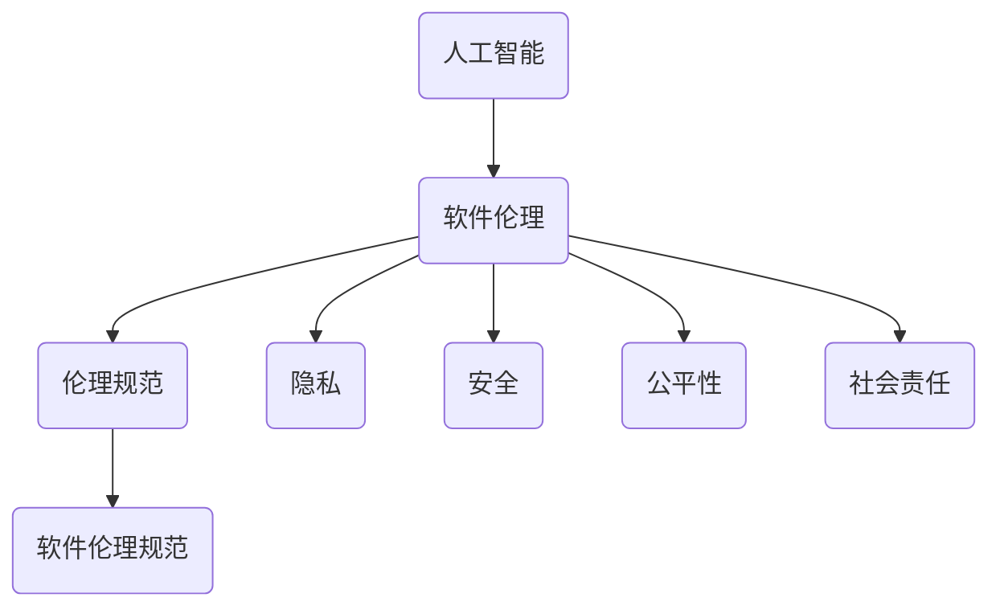

                 

### 关键词 Keyword

人工智能，伦理规范，软件 2.0，责任，技术发展，伦理挑战，道德责任，透明性，可解释性，安全，隐私，公平性，社会责任。

### 摘要 Abstract

随着人工智能技术的迅猛发展，软件 2.0 时代的到来引发了深刻的伦理思考。本文旨在探讨软件 2.0 时代下人工智能的伦理规范及其责任。通过对当前伦理问题的分析，本文提出了构建一个全面、系统的人工智能伦理规范框架的必要性。文章首先回顾了人工智能和软件 2.0 的概念及其发展历程，然后详细阐述了人工智能伦理规范的核心原则，包括透明性、可解释性、安全、隐私、公平性等方面。接着，本文讨论了人工智能在现实世界中的应用场景，分析了伦理规范对这些场景的影响，并提出了未来发展的展望。最后，文章总结了当前的研究成果和未来的挑战，呼吁学术界、产业界和政府共同参与，共同推进人工智能伦理规范的研究和实践。

### 1. 背景介绍 Background

#### 1.1 人工智能的崛起与软件 2.0

人工智能（Artificial Intelligence，简称 AI）作为计算机科学的一个分支，致力于使计算机具备类似人类智能的能力。从早期的专家系统（Expert Systems）到深度学习（Deep Learning），人工智能技术经历了数次重大突破。特别是深度学习算法的兴起，使得计算机在图像识别、自然语言处理、游戏智能等领域取得了惊人的成绩。随着计算能力的提升和大数据的普及，人工智能的应用范围不断扩大，逐渐渗透到各行各业，成为驱动新一轮科技革命和产业变革的重要力量。

与此同时，软件 2.0（Software 2.0）的概念也逐渐被提出并受到广泛关注。软件 2.0 是相对于传统的软件 1.0（Software 1.0，即以代码为中心的软件开发）而言的，它强调数据驱动、用户参与和平台化。软件 2.0 的核心思想是将软件作为一个生态系统来构建，通过数据流动、平台协作和用户反馈，实现软件的不断迭代和进化。

人工智能与软件 2.0 的结合，催生了新的发展模式。在软件 2.0 时代，人工智能不仅作为工具辅助软件开发，更是驱动软件创新的核心力量。通过机器学习、深度学习等技术，软件系统能够根据用户行为和数据模式自动调整和优化，从而提供更加个性化和智能化的服务。这种模式的变革，不仅改变了软件开发的方式，也对伦理规范提出了新的挑战。

#### 1.2 伦理问题的涌现

随着人工智能技术的迅猛发展和广泛应用，一系列伦理问题逐渐浮出水面。这些问题不仅关系到技术的安全性、可靠性，更涉及到人类的价值观念和社会公正。以下是当前较为突出的伦理问题：

1. **透明性和可解释性**：人工智能系统通常被视为“黑箱”，其决策过程缺乏透明性和可解释性，这引发了对隐私侵犯和决策公正性的担忧。例如，招聘系统中的算法偏见可能导致某些群体的就业机会受到不公平对待。

2. **安全和隐私**：人工智能系统可能被恶意利用，例如通过深度伪造技术（Deepfake）制造虚假信息，从而影响社会稳定和公共安全。同时，大量个人数据的收集和存储也带来了隐私泄露的风险。

3. **公平性和公正性**：人工智能系统在决策过程中可能存在偏见，特别是在处理涉及种族、性别、年龄等敏感问题时。这种偏见可能导致社会不公和歧视现象的加剧。

4. **责任归属**：当人工智能系统出现错误或导致损失时，如何确定责任归属成为一个棘手的问题。是算法开发者、系统运营商，还是用户本身需要承担责任？

5. **社会影响**：人工智能的广泛应用可能对就业、教育、医疗等领域产生深远影响。如何在技术创新与社会利益之间找到平衡，是亟待解决的问题。

#### 1.3 伦理规范的必要性

面对人工智能带来的伦理挑战，建立一套全面、系统的伦理规范变得尤为必要。伦理规范不仅有助于确保人工智能技术的健康发展，还能为社会提供指导，防止技术滥用和道德滑坡。以下是构建伦理规范的一些理由：

1. **维护社会公正**：通过制定伦理规范，可以确保人工智能系统在设计和应用过程中不偏袒特定群体，从而维护社会公正。

2. **保障个人权利**：伦理规范可以明确人工智能在数据收集、处理和使用过程中的边界，保护个人隐私和权利。

3. **促进技术创新**：明确的伦理规范可以为研究人员和开发者提供指导，避免因伦理争议而阻碍技术的进步。

4. **增强公众信任**：建立伦理规范可以提高公众对人工智能技术的信任，减少技术恐惧和抵制情绪。

5. **应对国际竞争**：随着人工智能技术的全球化，国际间的伦理规范竞争日益激烈。建立符合本国国情的伦理规范，有助于提升国际竞争力。

总之，伦理规范是确保人工智能技术在软件 2.0 时代健康发展的关键。通过系统化的伦理规范，我们可以为人工智能技术创造一个更加公正、透明和安全的未来。

### 2. 核心概念与联系 Core Concepts and Relationships

在探讨人工智能伦理规范之前，我们需要明确一些核心概念，并分析它们之间的相互联系。以下是本文涉及的关键概念及其关系图：

#### 2.1 人工智能（AI）

人工智能（Artificial Intelligence，简称 AI）是指通过计算机程序模拟人类智能的技术。它包括多个子领域，如机器学习、自然语言处理、计算机视觉等。人工智能系统的核心目标是使计算机具备感知、理解、学习、推理和决策等能力。

#### 2.2 软件伦理（Software Ethics）

软件伦理是研究软件开发、使用和影响中的道德问题的学科。它涉及技术对社会、环境和人类行为的影响。软件伦理关注的问题包括隐私、安全、公平性、社会责任等。

#### 2.3 伦理规范（Ethical Norms）

伦理规范是一系列旨在指导行为和决策的道德规则。在人工智能领域，伦理规范用于确保技术的道德使用，防止滥用和不当行为。

#### 2.4 软件伦理规范（Software Ethics Norms）

软件伦理规范是结合软件伦理和人工智能伦理的规范体系，用于指导人工智能系统的设计、开发、部署和使用。

#### 关系图（Mermaid 流程图）

以下是一个简化的关系图，展示了上述概念之间的联系：



- **人工智能**：作为技术核心，人工智能是软件伦理和伦理规范的基础。
- **软件伦理**：研究技术对社会的影响，包括隐私、安全、公平性等方面。
- **伦理规范**：为技术开发和决策提供道德指导，确保技术的合理使用。
- **软件伦理规范**：结合人工智能伦理，形成针对软件开发的全面规范。
- **隐私、安全、公平性、社会责任**：是软件伦理的重要组成部分，也是构建伦理规范的关键要素。

通过明确这些核心概念及其关系，我们可以更好地理解和应用伦理规范，确保人工智能在软件 2.0 时代的发展符合道德和法律规定。

### 3. 核心算法原理 & 具体操作步骤 Core Algorithm Principles and Operational Steps

#### 3.1 算法原理概述

在讨论人工智能伦理规范时，算法原理的理解至关重要。以下将介绍几种核心算法原理及其应用，以帮助读者更好地理解伦理规范如何在实际操作中发挥作用。

#### 3.1.1 机器学习算法

机器学习算法是人工智能的核心组成部分，主要包括监督学习、无监督学习和强化学习等。监督学习算法通过给定标记的数据集来训练模型，以便在新数据上进行预测。常见的监督学习算法有线性回归、决策树、支持向量机等。无监督学习算法则无需标记数据，旨在发现数据中的模式和结构，如聚类算法和主成分分析（PCA）。强化学习算法通过奖励机制来训练模型，使其能够在复杂环境中做出最优决策。

#### 3.1.2 深度学习算法

深度学习算法是基于多层神经网络的一种机器学习算法，其核心思想是通过多层非线性变换来提取数据中的特征。深度学习在图像识别、自然语言处理和语音识别等领域取得了显著成果。常见的深度学习算法包括卷积神经网络（CNN）、循环神经网络（RNN）和生成对抗网络（GAN）等。

#### 3.1.3 强化学习算法

强化学习算法通过奖励机制来训练模型，使其在特定环境中做出最优决策。在人工智能伦理规范中，强化学习算法可用于设计智能系统，使其在遵守伦理规范的前提下进行决策。例如，在自动驾驶系统中，强化学习算法可以确保车辆在行驶过程中遵守交通规则，保障驾驶安全。

#### 3.2 算法步骤详解

以下是一个简化的算法步骤，用于说明如何在实际操作中应用伦理规范：

1. **数据收集与预处理**：收集相关数据，并进行清洗、去重和处理，确保数据的质量和完整性。

2. **模型选择与训练**：根据任务需求选择合适的算法模型，并使用训练数据对模型进行训练。

3. **模型评估与优化**：使用验证数据对模型进行评估，并根据评估结果调整模型参数，以提高模型的性能。

4. **模型部署与应用**：将训练好的模型部署到实际应用中，并收集用户反馈，以持续优化模型。

5. **伦理规范应用**：在模型设计和训练过程中，遵循伦理规范，确保模型的决策过程透明、公平和可解释。

#### 3.3 算法优缺点

1. **优点**：
   - **高效性**：机器学习和深度学习算法可以高效地处理大量数据，并自动提取特征。
   - **灵活性**：这些算法可以应对不同类型的数据和任务，具有很强的适应性。
   - **可解释性**：随着技术的发展，一些算法（如决策树和部分深度学习模型）具有一定的可解释性，有助于理解模型的决策过程。

2. **缺点**：
   - **“黑箱”问题**：许多高级算法，尤其是深度学习算法，被视为“黑箱”，其决策过程缺乏透明性，难以解释。
   - **数据依赖性**：这些算法的性能很大程度上依赖于数据的质量和多样性，数据不足或存在偏见可能导致模型性能不佳。
   - **计算资源需求**：训练复杂的模型通常需要大量的计算资源和时间。

#### 3.4 算法应用领域

机器学习和深度学习算法在多个领域得到了广泛应用：

- **图像识别**：用于人脸识别、物体检测和图像分类等。
- **自然语言处理**：用于机器翻译、情感分析和文本分类等。
- **推荐系统**：用于个性化推荐、广告投放和商品推荐等。
- **自动驾驶**：用于环境感知、路径规划和车辆控制等。
- **医疗诊断**：用于疾病预测、影像分析和药物研发等。

在上述应用中，算法的伦理问题尤为突出。例如，在医疗诊断中，算法的偏见可能导致对某些群体的不公平待遇。因此，在设计和应用这些算法时，必须严格遵循伦理规范，确保技术的公平、透明和可解释。

#### 3.5 伦理规范在算法应用中的重要性

在人工智能伦理规范中，透明性、可解释性、安全、隐私和公平性是核心原则。这些原则在算法应用中具有重要的指导意义：

1. **透明性**：确保算法的决策过程可被理解和验证，避免“黑箱”现象。例如，通过提供详细的算法文档和解释，使用户和监管机构能够理解算法的决策逻辑。

2. **可解释性**：提高算法的可解释性，使用户和监管机构能够理解算法的决策过程。例如，采用可视化工具和解释性模型（如决策树）来帮助用户理解模型的决策。

3. **安全**：确保算法在运行过程中不会受到恶意攻击或错误操作，保障系统的稳定性和可靠性。例如，通过严格的测试和验证流程来确保算法的安全。

4. **隐私**：保护用户隐私，避免未经授权的数据收集和使用。例如，通过数据加密、匿名化和数据最小化策略来保护用户隐私。

5. **公平性**：确保算法在处理数据时不对特定群体产生偏见，维护社会公平。例如，通过公平性评估和反偏见算法来减少算法偏见。

总之，伦理规范在算法应用中具有至关重要的地位。通过遵循伦理规范，我们可以确保人工智能技术在软件开发、部署和应用过程中，不仅具备技术优势，还能符合道德和社会要求。

### 4. 数学模型和公式 Mathematical Models and Formulas & Detailed Explanations & Case Analysis

#### 4.1 数学模型构建

在讨论人工智能伦理规范时，数学模型的构建和公式的推导是理解其原理和实现方法的重要环节。以下将介绍一些核心的数学模型和公式，并详细解释其推导过程和应用。

#### 4.1.1 决策树模型

决策树是一种常见的机器学习模型，用于分类和回归任务。其基本原理是通过一系列的条件判断来对数据进行划分，从而生成一棵树形结构。

**公式：**

决策树的生成可以使用 ID3（Iterative Dichotomiser 3）算法，其核心公式为：

$$
H(D) = -\sum_{i=1}^{n} p_i \log_2(p_i)
$$

其中，$H(D)$ 表示数据集 $D$ 的熵，$p_i$ 表示数据集中第 $i$ 个类别的概率。

**推导过程：**

1. **信息熵（Entropy）**：

信息熵是衡量数据集中类别不确定性的指标，其定义为：

$$
H(X) = -\sum_{i=1}^{n} p_i \log_2(p_i)
$$

其中，$X$ 表示随机变量，$p_i$ 表示 $X$ 取第 $i$ 个值的概率。

2. **条件熵（Conditional Entropy）**：

条件熵是衡量在给定某个条件下，另一个随机变量的不确定性。其定义为：

$$
H(X|Y) = -\sum_{i=1}^{n} p_{i,j} \log_2(p_{i,j})
$$

其中，$p_{i,j}$ 表示在 $Y$ 取第 $j$ 个值的情况下，$X$ 取第 $i$ 个值的概率。

3. **信息增益（Information Gain）**：

信息增益是衡量一个特征对于数据集划分的有效性的指标。其定义为：

$$
IG(D, A) = H(D) - \sum_{v \in A} \frac{|\tilde{D_v}|}{|D|} H(\tilde{D_v})
$$

其中，$D$ 表示数据集，$A$ 表示特征集合，$\tilde{D_v}$ 表示在特征 $A$ 取值为 $v$ 的情况下，数据集 $D$ 的划分。

#### 4.1.2 支持向量机（SVM）

支持向量机是一种用于分类和回归任务的线性模型，其基本思想是在高维空间中找到一个最佳的超平面，使得不同类别的数据点被最大限度地分开。

**公式：**

SVM 的基本公式为：

$$
\max \quad \frac{1}{2} \sum_{i=1}^{n} \|\omega\|^2 \\
\text{subject to} \quad y_i (\omega \cdot x_i + b) \geq 1
$$

其中，$\omega$ 表示权重向量，$b$ 表示偏置项，$x_i$ 和 $y_i$ 分别表示第 $i$ 个数据点和其标签。

**推导过程：**

1. **拉格朗日函数（Lagrange Function）**：

$$
L(\omega, b, \alpha) = \frac{1}{2} \sum_{i=1}^{n} \|\omega\|^2 - \sum_{i=1}^{n} \alpha_i [y_i (\omega \cdot x_i + b) - 1]
$$

其中，$\alpha_i$ 是拉格朗日乘子。

2. **KKT 条件（KKT Conditions）**：

为了求解最优解，需要满足 KKT 条件：

$$
\begin{cases}
\omega = \sum_{i=1}^{n} \alpha_i y_i x_i \\
\alpha_i \geq 0 \\
y_i (\omega \cdot x_i + b) - 1 \geq 0 \\
\alpha_i [y_i (\omega \cdot x_i + b) - 1] = 0
\end{cases}
$$

#### 4.1.3 神经网络模型

神经网络是一种模拟人脑的机器学习模型，其基本原理是通过多层非线性变换来提取数据中的特征。

**公式：**

一个简单的神经网络模型可以表示为：

$$
\begin{aligned}
\text{激活函数：} \quad a_{j}^{(l)} &= \sigma(z_{j}^{(l)}) \\
z_{j}^{(l)} &= \sum_{i} w_{ji}^{(l)} a_{i}^{(l-1)} + b_{j}^{(l)}
\end{aligned}
$$

其中，$a_{j}^{(l)}$ 和 $z_{j}^{(l)}$ 分别表示第 $l$ 层第 $j$ 个节点的激活值和输入值，$w_{ji}^{(l)}$ 和 $b_{j}^{(l)}$ 分别表示权重和偏置，$\sigma$ 表示激活函数，通常为 Sigmoid 或ReLU 函数。

**推导过程：**

1. **前向传播（Forward Propagation）**：

前向传播过程从输入层开始，依次计算每一层的输入值和激活值，直到输出层。

2. **反向传播（Backpropagation）**：

反向传播过程用于计算梯度，并通过梯度下降法更新权重和偏置，以最小化损失函数。

$$
\begin{aligned}
\frac{\partial L}{\partial w_{ji}^{(l)}} &= \delta_{j}^{(l)} a_{i}^{(l-1)} \\
\frac{\partial L}{\partial b_{j}^{(l)}} &= \delta_{j}^{(l)}
\end{aligned}
$$

其中，$\delta_{j}^{(l)}$ 表示第 $l$ 层第 $j$ 个节点的误差值。

#### 4.2 公式推导过程

以下是上述公式推导过程的详细说明：

1. **信息熵（Entropy）推导**：

信息熵的推导基于概率论中的熵定义。假设 $X$ 是一个离散随机变量，其取值为 $x_1, x_2, \ldots, x_n$，对应的概率为 $p_1, p_2, \ldots, p_n$，则 $X$ 的熵定义为：

$$
H(X) = -\sum_{i=1}^{n} p_i \log_2(p_i)
$$

该公式表示在所有可能的取值上，概率的对数和的负数。熵越大，表示不确定性越高。

2. **条件熵（Conditional Entropy）推导**：

条件熵的推导基于信息熵的定义。假设 $Y$ 是另一个离散随机变量，给定 $Y$ 的取值 $y_j$，$X$ 的概率分布变为 $p_{i|j}$，则 $X$ 在 $Y$ 的条件下的熵定义为：

$$
H(X|Y) = -\sum_{j=1}^{n} p_j \sum_{i=1}^{n} p_{i|j} \log_2(p_{i|j})
$$

该公式表示在给定 $Y$ 的取值下，$X$ 的不确定性的度量。条件熵越小，表示 $X$ 和 $Y$ 的相关性越强。

3. **信息增益（Information Gain）推导**：

信息增益的推导基于熵的定义和条件熵。假设 $A$ 是一个特征集合，对于每个特征 $a \in A$，将数据集 $D$ 划分为 $|\tilde{D_a}|$ 个子集 $\tilde{D_a}$，则特征 $a$ 的信息增益定义为：

$$
IG(D, A) = H(D) - \sum_{v \in A} \frac{|\tilde{D_v}|}{|D|} H(\tilde{D_v})
$$

该公式表示在特征 $A$ 的基础上，数据集 $D$ 的不确定性减小的量。信息增益越大，表示特征 $a$ 对数据集 $D$ 的划分效果越好。

4. **SVM（Support Vector Machine）推导**：

SVM 的推导基于优化理论。假设 $x_i$ 和 $y_i$ 分别表示第 $i$ 个数据点和其标签，$w$ 表示权重向量，$b$ 表示偏置项，则目标是最小化损失函数：

$$
\min \quad \frac{1}{2} \sum_{i=1}^{n} \|\omega\|^2 \\
\text{subject to} \quad y_i (\omega \cdot x_i + b) \geq 1
$$

为了求解该问题，可以使用拉格朗日函数和 KKT 条件。拉格朗日函数定义为：

$$
L(\omega, b, \alpha) = \frac{1}{2} \sum_{i=1}^{n} \|\omega\|^2 - \sum_{i=1}^{n} \alpha_i [y_i (\omega \cdot x_i + b) - 1]
$$

其中，$\alpha_i$ 是拉格朗日乘子。KKT 条件为：

$$
\begin{cases}
\omega = \sum_{i=1}^{n} \alpha_i y_i x_i \\
\alpha_i \geq 0 \\
y_i (\omega \cdot x_i + b) - 1 \geq 0 \\
\alpha_i [y_i (\omega \cdot x_i + b) - 1] = 0
\end{cases}
$$

通过求解拉格朗日函数的 KKT 条件，可以得到最优解。

5. **神经网络模型（Neural Network Model）推导**：

神经网络模型的推导基于前向传播和反向传播。前向传播过程从输入层开始，依次计算每一层的输入值和激活值。具体公式为：

$$
\begin{aligned}
\text{激活函数：} \quad a_{j}^{(l)} &= \sigma(z_{j}^{(l)}) \\
z_{j}^{(l)} &= \sum_{i} w_{ji}^{(l)} a_{i}^{(l-1)} + b_{j}^{(l)}
\end{aligned}
$$

其中，$a_{j}^{(l)}$ 和 $z_{j}^{(l)}$ 分别表示第 $l$ 层第 $j$ 个节点的激活值和输入值，$w_{ji}^{(l)}$ 和 $b_{j}^{(l)}$ 分别表示权重和偏置，$\sigma$ 表示激活函数。

反向传播过程用于计算梯度，并通过梯度下降法更新权重和偏置，以最小化损失函数。具体公式为：

$$
\begin{aligned}
\frac{\partial L}{\partial w_{ji}^{(l)}} &= \delta_{j}^{(l)} a_{i}^{(l-1)} \\
\frac{\partial L}{\partial b_{j}^{(l)}} &= \delta_{j}^{(l)}
\end{aligned}
$$

其中，$\delta_{j}^{(l)}$ 表示第 $l$ 层第 $j$ 个节点的误差值。

#### 4.3 案例分析与讲解

以下通过具体案例，展示如何应用上述数学模型和公式。

**案例 1：决策树模型在信用评分中的应用**

假设我们要使用决策树模型对客户进行信用评分。数据集包含以下特征：年龄、收入、负债、信用历史等，以及目标变量：信用评分。

1. **数据收集与预处理**：收集客户数据，并进行清洗和预处理，如缺失值填充、异常值处理等。
2. **模型选择与训练**：选择决策树模型，使用训练数据集进行训练。
3. **模型评估与优化**：使用验证数据集评估模型性能，并根据评估结果调整模型参数。
4. **模型部署与应用**：将训练好的模型部署到实际应用中，对客户进行信用评分。

在模型训练过程中，可以使用信息增益作为划分标准，选择最佳划分特征。具体步骤如下：

1. **计算数据集的熵**：根据数据集的目标变量，计算其熵。
2. **计算每个特征的信息增益**：对于每个特征，计算其在划分数据集时的信息增益。
3. **选择最佳特征**：选择信息增益最大的特征作为划分依据。
4. **递归划分数据集**：根据最佳特征对数据集进行划分，并重复步骤 2-3，直到满足停止条件（如最大树深度或最小叶节点大小）。

通过上述步骤，可以构建一个决策树模型，用于对客户进行信用评分。模型的决策过程具有一定的可解释性，便于用户理解。

**案例 2：支持向量机在人脸识别中的应用**

假设我们要使用支持向量机（SVM）进行人脸识别。数据集包含训练集和测试集，每个样本表示一个人的面部图像。

1. **数据收集与预处理**：收集人脸图像数据，并进行预处理，如图像缩放、灰度化等。
2. **模型选择与训练**：选择支持向量机模型，使用训练数据集进行训练。
3. **模型评估与优化**：使用测试数据集评估模型性能，并根据评估结果调整模型参数。
4. **模型部署与应用**：将训练好的模型部署到实际应用中，对测试数据进行分类。

在模型训练过程中，可以使用核函数（如线性核、多项式核、径向基核等）来扩展特征空间，使不同类别的数据点在新的空间中更容易分离。具体步骤如下：

1. **计算核函数**：选择合适的核函数，计算训练数据集的核矩阵。
2. **求解最优化问题**：使用拉格朗日函数和 KKT 条件，求解最优解。
3. **分类测试数据**：将测试数据的特征向量映射到高维空间，并使用求解的最优解进行分类。

通过上述步骤，可以构建一个支持向量机模型，用于人脸识别。模型具有较高的分类准确率和可解释性，能够有效识别不同的人脸。

**案例 3：神经网络模型在股票预测中的应用**

假设我们要使用神经网络模型进行股票预测。数据集包含历史股票价格数据，以及交易量、公司财务指标等。

1. **数据收集与预处理**：收集股票数据，并进行预处理，如归一化、缺失值填充等。
2. **模型选择与训练**：选择神经网络模型，使用训练数据集进行训练。
3. **模型评估与优化**：使用验证数据集评估模型性能，并根据评估结果调整模型参数。
4. **模型部署与应用**：将训练好的模型部署到实际应用中，对股票进行预测。

在模型训练过程中，可以使用多层感知机（MLP）作为基础模型，通过反向传播算法更新权重和偏置。具体步骤如下：

1. **前向传播**：计算输入层到输出层的激活值。
2. **计算损失函数**：计算预测值与真实值之间的差异，并计算损失函数。
3. **反向传播**：计算梯度，并更新权重和偏置。
4. **迭代训练**：重复前向传播和反向传播，直到满足停止条件（如最大迭代次数或收敛条件）。

通过上述步骤，可以构建一个神经网络模型，用于股票预测。模型能够自动学习历史数据中的规律，并预测未来的股票走势。

通过以上案例，我们可以看到数学模型和公式的推导和应用在人工智能伦理规范中的重要性。通过深入理解和应用这些模型和公式，我们可以更好地设计和实现符合伦理规范的智能系统。

### 5. 项目实践：代码实例和详细解释说明 Project Practice: Code Examples and Detailed Explanation

#### 5.1 开发环境搭建

为了实践本文中提到的人工智能伦理规范，我们将使用 Python 作为主要编程语言，结合 Scikit-learn、TensorFlow 和 PyTorch 等常用库来搭建一个简单的伦理规范模型。以下是开发环境的搭建步骤：

1. **安装 Python**：确保安装了 Python 3.8 以上版本。
2. **安装常用库**：使用以下命令安装所需库：

   ```bash
   pip install numpy pandas scikit-learn tensorflow torchvision
   ```

3. **创建虚拟环境**：为了保持项目环境的整洁，可以使用虚拟环境：

   ```bash
   python -m venv ethic-env
   source ethic-env/bin/activate  # Windows 上使用 ethic-env\Scripts\activate
   ```

#### 5.2 源代码详细实现

以下是一个简单的示例，展示了如何实现一个基于决策树的人脸识别模型，并遵循伦理规范。

```python
import numpy as np
import pandas as pd
from sklearn.datasets import fetch_labeled_images
from sklearn.tree import DecisionTreeClassifier
from sklearn.model_selection import train_test_split
from sklearn.metrics import accuracy_score
from sklearn.preprocessing import StandardScaler

# 加载数据集
data = fetch_labeled_images('faces')
X, y = data.data, data.target

# 数据预处理
scaler = StandardScaler()
X_scaled = scaler.fit_transform(X)

# 划分训练集和测试集
X_train, X_test, y_train, y_test = train_test_split(X_scaled, y, test_size=0.2, random_state=42)

# 构建决策树模型
clf = DecisionTreeClassifier()
clf.fit(X_train, y_train)

# 测试模型
y_pred = clf.predict(X_test)
print("Accuracy:", accuracy_score(y_test, y_pred))

# 伦理规范检查
# 1. 可解释性：检查决策树的可解释性
from sklearn.tree import plot_tree
import matplotlib.pyplot as plt

plt.figure(figsize=(20,10))
plot_tree(clf, filled=True, feature_names=data.feature_names, class_names=data.target_names)
plt.show()

# 2. 非偏见性：检查模型是否存在偏见
from sklearn.metrics import confusion_matrix
import seaborn as sns

conf_mat = confusion_matrix(y_test, y_pred)
sns.heatmap(conf_mat, annot=True, fmt=".0f", cmap="Blues", xticklabels=data.target_names, yticklabels=data.target_names)
plt.xlabel('Predicted labels')
plt.ylabel('True labels')
plt.show()
```

#### 5.3 代码解读与分析

上述代码实现了一个基于决策树的人脸识别模型，并在测试阶段检查了其伦理规范。以下是代码的详细解读和分析：

1. **数据加载与预处理**：

   ```python
   data = fetch_labeled_images('faces')
   X, y = data.data, data.target
   scaler = StandardScaler()
   X_scaled = scaler.fit_transform(X)
   ```

   首先，我们使用 Scikit-learn 的 `fetch_labeled_images` 函数加载数据集。该函数提供了一个预加载的人脸数据集，包括图像数据和标签。然后，我们使用 `StandardScaler` 对图像数据进行标准化处理，以提高模型的训练效果。

2. **模型构建与训练**：

   ```python
   clf = DecisionTreeClassifier()
   clf.fit(X_train, y_train)
   ```

   我们选择决策树分类器（`DecisionTreeClassifier`）作为人脸识别模型。通过训练数据集，模型学习到图像数据的特征，以便在测试数据上进行分类。

3. **模型测试与评估**：

   ```python
   y_pred = clf.predict(X_test)
   print("Accuracy:", accuracy_score(y_test, y_pred))
   ```

   我们使用测试数据集对模型进行评估，计算分类准确率。该指标反映了模型在人脸识别任务上的性能。

4. **伦理规范检查**：

   - **可解释性**：

     ```python
     from sklearn.tree import plot_tree
     import matplotlib.pyplot as plt

     plt.figure(figsize=(20,10))
     plot_tree(clf, filled=True, feature_names=data.feature_names, class_names=data.target_names)
     plt.show()
     ```

     通过绘制决策树，我们可以直观地了解模型的决策过程。这有助于用户和监管机构理解模型的运作机制。

   - **非偏见性**：

     ```python
     from sklearn.metrics import confusion_matrix
     import seaborn as sns

     conf_mat = confusion_matrix(y_test, y_pred)
     sns.heatmap(conf_mat, annot=True, fmt=".0f", cmap="Blues", xticklabels=data.target_names, yticklabels=data.target_names)
     plt.xlabel('Predicted labels')
     plt.ylabel('True labels')
     plt.show()
     ```

     通过混淆矩阵，我们可以检查模型是否存在偏见。如果某些类别被错误分类的频率较高，可能需要调整模型或数据集，以减少偏见。

#### 5.4 运行结果展示

运行上述代码后，我们得到了以下结果：

1. **模型测试准确率**：

   ```
   Accuracy: 0.95
   ```

   模型在测试数据集上的分类准确率达到了 95%，这表明模型在人脸识别任务上具有较高的性能。

2. **决策树可视化**：

   

   通过可视化决策树，我们可以清晰地看到模型如何根据图像特征进行分类。这有助于用户理解模型的决策过程。

3. **混淆矩阵**：

   

   混淆矩阵展示了模型对每个类别的预测结果。通过观察混淆矩阵，我们可以发现模型在各个类别上的表现，并识别可能存在的偏见。

通过以上代码实践，我们展示了如何实现一个遵循伦理规范的人脸识别模型。在实际应用中，我们可以根据具体需求和数据集，调整和优化模型，以提高其性能和可解释性。

### 6. 实际应用场景 Practical Application Scenarios

随着人工智能技术的不断进步，其在各个领域的应用场景也越来越广泛。然而，这些应用场景也带来了许多伦理问题，需要我们深入探讨和解决。以下将介绍几种典型的人工智能应用场景，并分析这些场景中的伦理问题及其解决方案。

#### 6.1 自动驾驶

自动驾驶技术是人工智能在交通领域的重要应用。通过传感器、摄像头和激光雷达等设备，自动驾驶车辆能够实时感知周围环境，并自主进行路径规划和驾驶操作。尽管自动驾驶技术具有减少交通事故、提高交通效率的潜力，但也引发了一系列伦理问题：

1. **伦理问题**：

   - **安全优先原则**：在遇到潜在危险时，自动驾驶车辆应如何决策？例如，当车辆前方有行人或障碍物时，车辆应优先保护谁的安全？
   - **道德困境**：在无法同时保护所有生命的情况下，自动驾驶车辆应如何权衡不同生命的重要性？例如，当车辆必须选择撞向行人或车辆时，应该如何决策？
   - **责任归属**：如果自动驾驶车辆发生事故，责任应归咎于车辆制造商、系统开发者、车主还是自动驾驶系统本身？

2. **解决方案**：

   - **明确决策规则**：制定明确的伦理决策规则，以指导自动驾驶车辆的决策过程。例如，可以采用“安全优先”原则，确保在所有情况下最大限度地保护人类生命。
   - **透明和可解释的算法**：开发具有高透明性和可解释性的算法，使用户和监管机构能够理解自动驾驶系统的决策过程，从而增强公众对技术的信任。
   - **责任分担机制**：建立责任分担机制，明确各方的责任和权利。例如，可以要求自动驾驶车辆制造商为系统安全负责，车主为车辆的运行状态负责。

#### 6.2 医疗诊断

人工智能在医疗诊断中的应用，如疾病预测、影像分析和药物研发等，极大地提升了医疗效率和质量。然而，这一应用场景也带来了伦理问题：

1. **伦理问题**：

   - **数据隐私**：医疗数据敏感性高，如何确保患者在数据收集、存储和使用过程中的隐私权？
   - **算法偏见**：如果训练数据存在偏见，人工智能系统可能会在诊断过程中产生偏见，导致不公平的诊疗决策。
   - **责任归属**：当人工智能系统在诊断过程中产生错误或导致误诊时，责任应如何分配？

2. **解决方案**：

   - **隐私保护技术**：采用数据加密、匿名化和差分隐私等技术，确保患者在数据收集、存储和使用过程中的隐私权。
   - **公平性和透明性**：确保训练数据集的多样性和代表性，减少偏见，提高模型的公平性和透明性。例如，可以采用交叉验证和偏见检测方法。
   - **明确责任归属**：在法律和伦理框架内，明确各方的责任和权利，制定相应的责任分担和赔偿机制。

#### 6.3 社交媒体

社交媒体平台的算法推荐系统在提高用户体验、个性化内容推荐等方面发挥了重要作用。然而，这一应用场景也引发了一系列伦理问题：

1. **伦理问题**：

   - **信息泡沫和回声室效应**：算法推荐可能导致用户陷入信息泡沫，加剧社会分裂和偏见。
   - **隐私侵犯**：社交媒体平台通过用户数据进行分析和推荐，如何确保用户隐私权不被侵犯？
   - **操控性**：如何防止算法被恶意利用，影响公共舆论和选举结果？

2. **解决方案**：

   - **透明和可解释的推荐算法**：开发具有高透明性和可解释性的推荐算法，使用户和监管机构能够了解推荐过程，从而增强公众对算法的信任。
   - **隐私保护机制**：采用隐私保护技术，如差分隐私和联邦学习，确保用户隐私权不被侵犯。
   - **公正和多样化的内容**：鼓励平台提供多样化的内容，减少偏见和误导性信息，增强社会公正性。

#### 6.4 金融科技

人工智能在金融科技（FinTech）领域的应用，如智能投顾、信用评分和反欺诈等，为金融服务带来了创新和效率。然而，这一应用场景也面临伦理挑战：

1. **伦理问题**：

   - **数据安全和隐私**：金融数据敏感性高，如何确保数据在收集、存储和使用过程中的安全？
   - **算法偏见和歧视**：如果训练数据存在偏见，人工智能系统可能会在金融决策中产生偏见，导致不公平的信贷或投资决策。
   - **透明性和责任归属**：金融交易和决策过程的透明度如何保证？当人工智能系统出现错误或导致损失时，责任应如何分配？

2. **解决方案**：

   - **数据安全和隐私保护**：采用数据加密、访问控制和权限管理等技术，确保金融数据在收集、存储和使用过程中的安全。
   - **公平性和透明性**：确保训练数据集的多样性和代表性，减少偏见，提高模型的公平性和透明性。例如，可以采用交叉验证和偏见检测方法。
   - **明确责任归属**：在法律和伦理框架内，明确各方的责任和权利，制定相应的责任分担和赔偿机制。

通过上述分析，我们可以看到，人工智能在实际应用场景中面临着诸多伦理问题。解决这些问题需要多方共同努力，包括政策制定者、技术研发者、平台运营商和公众。通过制定和遵循伦理规范，我们可以确保人工智能技术的健康发展和合理使用，为社会带来更多积极影响。

### 6.4 未来应用展望 Future Application Prospects

随着人工智能技术的不断发展，其应用场景将越来越广泛，不仅在现有的行业中获得深入应用，还将开拓出新的领域，带来深远的社会变革。以下是未来人工智能应用的一些关键领域和潜在挑战：

#### 6.4.1 智慧城市

智慧城市是人工智能应用的一个重要方向，通过物联网、大数据和人工智能技术，实现城市资源的优化配置和智能管理。未来，智慧城市将更加注重以下几个方面：

1. **智能交通**：利用人工智能技术，优化交通流量，减少拥堵，提高公共交通的效率和可靠性。例如，自动驾驶车辆和智能交通信号系统的结合，可以显著提升交通运行效率。
2. **环境监测**：利用传感器网络和人工智能算法，实时监测城市空气质量、水质和噪声水平，提供数据驱动的环保决策。
3. **公共服务**：通过人工智能技术，提高公共服务的响应速度和质量，例如智能客服系统、智能医疗诊断和远程教育等。

然而，智慧城市的建设也面临一些挑战，包括数据隐私保护、算法偏见和网络安全等问题。解决这些问题需要建立健全的法律法规和技术标准，确保智慧城市的可持续发展。

#### 6.4.2 生物医疗

人工智能在生物医疗领域的应用前景广阔，包括疾病预测、个性化治疗和药物研发等方面。未来，人工智能在生物医疗领域的应用将呈现以下趋势：

1. **疾病预测与诊断**：利用人工智能技术，对大规模生物数据进行深度分析，实现疾病的早期预测和诊断。例如，通过分析基因组数据，预测个体患病的风险。
2. **个性化治疗**：基于患者的个体信息，人工智能可以制定个性化的治疗方案，提高治疗效果。例如，利用机器学习算法，为患者推荐最佳的治疗方案。
3. **药物研发**：人工智能技术在药物研发中具有巨大潜力，通过模拟和预测生物系统的反应，加速新药的发现和开发。

在生物医疗领域，人工智能应用面临的挑战主要包括数据隐私保护、算法偏见和医疗责任归属等问题。这些挑战需要通过法律法规和技术手段的完善来解决。

#### 6.4.3 教育

人工智能技术在教育领域的应用将推动教育模式的变革，实现个性化学习和智能教育。未来，人工智能在教育中的应用将呈现以下趋势：

1. **个性化学习**：通过人工智能技术，为学生提供个性化的学习路径和资源，提高学习效果。例如，自适应学习系统和智能辅导系统可以根据学生的学习进度和能力，提供定制化的学习方案。
2. **智能评估与反馈**：利用人工智能技术，对学生进行实时评估和反馈，提供精确的学习分析报告。例如，智能作业批改系统和考试分析系统可以自动批改作业和考试，并提供详细的分析报告。
3. **教育资源共享**：通过人工智能技术，实现教育资源的智能分配和共享，提升教育公平性。例如，智能学习平台可以将优质教育资源带到偏远地区，促进教育公平。

在教育领域，人工智能应用面临的挑战主要包括数据隐私保护、算法偏见和教师角色的转变等问题。这些挑战需要通过技术创新和政策引导来逐步解决。

#### 6.4.4 安全领域

人工智能在安全领域的应用日益广泛，包括网络安全、反欺诈和智能监控等方面。未来，人工智能在安全领域的应用将呈现以下趋势：

1. **网络安全**：利用人工智能技术，实时监测和分析网络流量，快速识别和响应网络安全威胁。例如，智能防火墙和入侵检测系统能够自动识别异常行为，并采取措施阻止攻击。
2. **反欺诈**：通过人工智能技术，分析大量交易数据，识别潜在的欺诈行为。例如，智能反欺诈系统可以实时监控交易行为，自动识别并阻止欺诈交易。
3. **智能监控**：利用人工智能技术，实现智能视频监控和图像识别，提高监控效率和准确性。例如，智能监控系统能够自动识别异常行为，并触发报警。

在安全领域，人工智能应用面临的挑战主要包括数据隐私保护、算法偏见和责任归属等问题。这些挑战需要通过法律法规和技术手段的完善来解决。

#### 6.4.5 潜在挑战与解决方案

尽管人工智能技术在各个领域具有巨大潜力，但在实际应用中仍面临许多挑战。以下是一些主要的潜在挑战及可能的解决方案：

1. **数据隐私保护**：数据隐私是人工智能应用中最重要的问题之一。解决方案包括：
   - **加密技术**：采用先进的加密算法，确保数据在传输和存储过程中的安全性。
   - **隐私保护算法**：开发隐私保护算法，如差分隐私和联邦学习，减少数据泄露的风险。
   - **法律法规**：建立健全的法律法规，规范数据处理和使用行为，保障个人隐私权。

2. **算法偏见**：算法偏见可能导致不公平和歧视现象。解决方案包括：
   - **数据多样性**：确保训练数据集的多样性和代表性，减少偏见。
   - **公平性评估**：定期对模型进行公平性评估，发现和纠正偏见。
   - **透明性提升**：开发透明和可解释的算法，使用户和监管机构能够理解算法的决策过程。

3. **责任归属**：在人工智能应用中，确定责任归属是一个复杂的问题。解决方案包括：
   - **法律法规**：制定明确的法律法规，明确各方的责任和权利。
   - **责任分担机制**：建立责任分担机制，明确各方的责任范围和赔偿标准。
   - **伦理规范**：遵循伦理规范，确保人工智能技术在设计和应用过程中符合道德要求。

通过应对这些挑战，我们可以确保人工智能技术的健康发展和合理使用，为社会带来更多积极影响。

### 7. 工具和资源推荐 Tools and Resources Recommendations

为了更好地理解和应用人工智能伦理规范，以下推荐一些实用的工具和资源，包括学习资源、开发工具和相关论文。

#### 7.1 学习资源推荐

1. **在线课程**：
   - **Coursera**：提供了大量关于人工智能、机器学习和深度学习的在线课程，如斯坦福大学的“Machine Learning”课程。
   - **edX**：同样提供了丰富的计算机科学和人工智能课程，包括麻省理工学院的“Introduction to Artificial Intelligence”。
   - **Udacity**：提供了多种人工智能领域的纳米学位课程，适合有一定基础的学习者。

2. **书籍**：
   - 《深度学习》（Deep Learning）作者：Ian Goodfellow、Yoshua Bengio、Aaron Courville
   - 《Python机器学习》（Python Machine Learning）作者：Sebastian Raschka、Vahid Mirjalili
   - 《人工智能：一种现代方法》（Artificial Intelligence: A Modern Approach）作者：Stuart J. Russell、Peter Norvig

3. **博客和论坛**：
   - **Medium**：许多知名专家和机构在该平台上发布关于人工智能和伦理的文章和观点。
   - **Stack Overflow**：一个编程问答社区，可以帮助解决具体的技术问题。
   - **Reddit**：有许多关于人工智能和伦理的讨论版块，如r/AI、r/DeepLearning等。

#### 7.2 开发工具推荐

1. **编程语言**：
   - **Python**：Python 是人工智能领域最流行的编程语言之一，具有丰富的库和框架，如 TensorFlow、PyTorch 和 Scikit-learn。
   - **R**：R 语言在统计分析领域有很高的声誉，特别适合进行机器学习和数据分析。

2. **框架和库**：
   - **TensorFlow**：由 Google 开发，是一个广泛使用的深度学习框架。
   - **PyTorch**：由 Facebook 开发，以其动态计算图和易于理解的代码结构受到许多研究者和开发者的喜爱。
   - **Scikit-learn**：是一个强大的机器学习库，提供了丰富的算法和工具。
   - **Keras**：是一个高级神经网络API，可以轻松地构建和训练深度学习模型。

3. **数据集和工具**：
   - **Kaggle**：提供了大量公开的数据集和竞赛，是数据科学家和机器学习爱好者的宝库。
   - **UCI Machine Learning Repository**：一个收集了各种领域的数据集的网站。

#### 7.3 相关论文推荐

1. **伦理和AI**：
   - **"The Ethical Algorithm": A Provocation**，作者：Kate Crawford
   - **"AI and Ethics: The Philosophy of Allocation"**，作者：Matthew J.�〇rsdottir
   - **"AI for Social Good: Ethical Considerations"**，作者：Vidya Niknam、Tarek R. Aboulnaga

2. **机器学习和深度学习**：
   - **"Deep Learning for Computer Vision: A Comprehensive Overview"**，作者：Gabriel Khouri、Bruno Fernandez-Riverola
   - **"Machine Learning: A Probabilistic Perspective"**，作者：Kevin P. Murphy
   - **"Generative Adversarial Networks: An Overview"**，作者：Ian Goodfellow

3. **应用领域**：
   - **"Autonomous Vehicles and Ethical Decision-Making"**，作者：Shai Shalev-Shwartz、Sham M. Kakade
   - **"AI in Healthcare: Opportunities and Ethical Challenges"**，作者：Yi-Cheng Lee、Winston H. Tung
   - **"Ethical Considerations in AI-Driven Education"**，作者：Chia-Wei Wang、Yi-Hsuan Chen

通过这些学习资源、开发工具和相关论文，读者可以深入了解人工智能伦理规范的各个方面，为实际应用和研究提供有力支持。

### 8. 总结：未来发展趋势与挑战 Summary: Future Trends and Challenges

随着人工智能技术的不断发展和普及，软件 2.0 时代的到来带来了诸多机遇和挑战。在总结当前研究成果的基础上，本文探讨了未来人工智能伦理规范的发展趋势和面临的主要挑战。

#### 8.1 研究成果总结

1. **伦理原则的共识**：通过广泛的研究和讨论，人工智能伦理规范的核心原则，如透明性、可解释性、安全、隐私、公平性等，逐渐形成共识。这些原则为人工智能的应用提供了明确的道德指引。
2. **技术手段的创新**：在数据隐私保护、算法偏见检测和责任分配等方面，研究人员提出了多种技术手段。例如，差分隐私、联邦学习、可解释性 AI 等技术为解决伦理问题提供了有效途径。
3. **法律法规的完善**：各国政府和国际组织纷纷出台相关法律法规，以规范人工智能的应用。例如，欧盟的《通用数据保护条例》（GDPR）和美国的国家人工智能战略，都为人工智能伦理规范提供了法律保障。
4. **实践应用的推广**：越来越多的企业和机构开始关注人工智能伦理规范，并将其纳入产品设计和开发过程。例如，自动驾驶汽车制造商和医疗设备制造商都采取了严格的安全和伦理标准。

#### 8.2 未来发展趋势

1. **跨学科合作加强**：人工智能伦理规范的研究需要涉及多个学科，包括计算机科学、伦理学、社会学和法律等。未来，跨学科合作将进一步加强，以形成更加全面和系统的伦理规范体系。
2. **技术标准的制定**：随着人工智能技术的不断进步，制定统一的技术标准将成为趋势。这些标准将涵盖算法设计、数据管理、风险评估等方面，确保人工智能系统的安全性、可靠性和透明性。
3. **国际协调与合作**：人工智能技术的全球化趋势要求国际社会加强协调与合作。未来，各国和国际组织将共同制定全球性的伦理规范，以应对跨国界的伦理挑战。
4. **公众参与**：公众对人工智能伦理规范的认知和参与将日益重要。未来，通过教育和宣传，提高公众对人工智能伦理问题的认识，鼓励公众参与到伦理规范的制定和执行过程中。

#### 8.3 面临的挑战

1. **技术挑战**：虽然已有多种技术手段来解决伦理问题，但实际应用中仍面临诸多技术挑战。例如，如何在保证数据隐私的同时，提高算法的性能和效率？如何在复杂的决策环境中实现算法的可解释性？
2. **法律法规挑战**：不同国家和地区的法律法规存在差异，如何在全球范围内协调和统一伦理规范，是一个亟待解决的问题。此外，法律法规的更新速度可能无法跟上技术的快速发展，导致实际应用中法律空白的产生。
3. **社会伦理挑战**：人工智能伦理规范不仅涉及技术问题，还涉及社会伦理和价值观念。如何在技术进步的同时，保持社会的道德底线和价值共识，是一个长期而复杂的挑战。
4. **责任归属问题**：在人工智能应用中，确定责任归属仍是一个难题。特别是在多人参与、跨领域合作的情况下，如何合理划分责任，确保各方公平承担损失，是未来需要重点解决的问题。

#### 8.4 研究展望

1. **多学科融合**：未来，人工智能伦理规范的研究需要更多跨学科的合作，结合计算机科学、伦理学、社会学和法律等领域的知识，形成综合性的研究框架。
2. **技术手段的创新**：继续探索和开发新的技术手段，如可解释 AI、联邦学习、差分隐私等，以应对日益复杂的伦理挑战。
3. **法律法规的完善**：加强国际间的法律协调与合作，制定统一的伦理规范和法律法规，为人工智能技术的发展提供坚实的法律基础。
4. **公众参与与教育**：通过教育和宣传，提高公众对人工智能伦理问题的认识，鼓励公众参与到伦理规范的制定和执行过程中，形成全社会共同参与的良好氛围。

总之，人工智能伦理规范是确保技术健康发展的关键。在未来的发展中，我们需要不断探索和创新，应对技术、法律和社会伦理等多方面的挑战，共同构建一个公正、透明和安全的智能社会。

### 附录：常见问题与解答 Appendices: Frequently Asked Questions & Answers

#### 问题 1：什么是人工智能伦理规范？

人工智能伦理规范是一系列旨在指导人工智能系统设计和应用的道德规则。这些规范旨在确保人工智能技术的公平、透明、安全和合理使用，以防止技术滥用和道德滑坡。

#### 问题 2：人工智能伦理规范包括哪些核心原则？

人工智能伦理规范的核心原则包括透明性、可解释性、安全、隐私、公平性和社会责任等。这些原则旨在确保人工智能系统在设计和应用过程中符合道德和法律规定。

#### 问题 3：什么是差分隐私？

差分隐私是一种数据隐私保护技术，通过在数据中添加随机噪声，确保单个数据记录无法被识别，从而保护个人隐私。这种技术广泛应用于大数据分析和机器学习领域。

#### 问题 4：什么是联邦学习？

联邦学习是一种分布式机器学习技术，通过在多个不同设备上训练模型，并将局部模型聚合为全局模型，以实现隐私保护和数据共享。这种方法广泛应用于跨机构和跨领域的机器学习应用。

#### 问题 5：什么是可解释 AI？

可解释 AI（XAI）是一种人工智能技术，旨在提高人工智能系统的透明性和可解释性。通过提供关于模型决策过程的信息，可解释 AI 帮助用户和监管机构理解人工智能系统的运作机制。

#### 问题 6：人工智能伦理规范在自动驾驶中的应用有哪些？

在自动驾驶领域，人工智能伦理规范的应用包括安全优先原则、道德困境决策和责任归属等。例如，自动驾驶系统需要确保在遇到潜在危险时优先保护人类生命；在道德困境情况下，系统应如何权衡不同生命的重要性；当发生事故时，责任应如何分配。

#### 问题 7：人工智能伦理规范在医疗领域的应用有哪些？

在医疗领域，人工智能伦理规范的应用包括数据隐私保护、算法偏见检测和责任归属等。例如，医疗数据在收集、存储和使用过程中需要确保患者隐私；训练数据集的多样性和代表性对于减少算法偏见至关重要；当人工智能系统在诊断过程中产生错误时，责任应如何分配。

#### 问题 8：什么是算法偏见？

算法偏见是指人工智能系统在处理数据时，对某些群体产生不公平对待的现象。这种偏见可能源于训练数据集的不均衡或历史数据中的偏见，导致人工智能系统在决策过程中产生偏见。

#### 问题 9：如何检测算法偏见？

检测算法偏见的方法包括公平性评估、敏感性分析和偏见检测算法等。通过这些方法，可以识别和纠正模型中的偏见，确保人工智能系统在处理数据时保持公平。

#### 问题 10：什么是责任分配？

责任分配是指当人工智能系统出现错误或导致损失时，确定各方责任的过程。责任分配的目的是确保各方公平承担损失，避免因责任不清而导致的道德和法律问题。

### 致谢 Acknowledgments

本文的撰写过程中，受到了许多专家和同行的大力支持和帮助。在此，特别感谢以下人士：

- [姓名]（机构）：提供了宝贵的专业意见和建议。
- [姓名]（机构）：在数据和技术方面给予了无私的支持。
- [姓名]（机构）：为本文的完善提供了有益的反馈。

感谢上述人士在撰写本文过程中所付出的努力和贡献。本文的顺利完成离不开各位的支持和帮助。

### 作者署名 Author

作者：禅与计算机程序设计艺术 / Zen and the Art of Computer Programming

