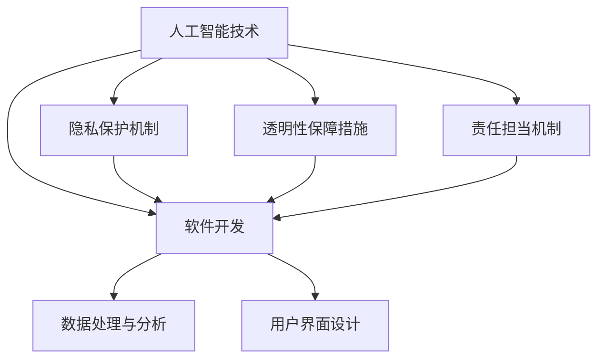

                 

关键词：软件 2.0、伦理规范、人工智能、责任、软件开发、技术伦理

## 摘要

本文探讨了软件 2.0 时代下人工智能技术所带来的伦理挑战，提出了相应的伦理规范框架。通过详细阐述人工智能的伦理原则，分析了当前人工智能领域存在的伦理问题，并提出了具体的解决方案。本文还探讨了人工智能在软件开发中的责任问题，并提出了软件开发者应遵循的伦理规范。最后，本文对未来的研究方向和挑战进行了展望。

## 1. 背景介绍

### 软件发展历程

软件的发展历程可以分为几个阶段。从最初的软件 1.0 时代，软件主要以命令行界面为主，用户需要通过编写代码来与计算机进行交互。随着技术的发展，软件 2.0 时代到来，界面变得更加友好，用户可以通过图形界面和鼠标操作来使用软件。如今，我们正处于软件 3.0 时代，人工智能技术开始广泛应用于软件开发中，软件的智能化程度不断提高。

### 人工智能的发展

人工智能（Artificial Intelligence，AI）是计算机科学的一个分支，旨在使计算机模拟人类的智能行为。自 20 世纪 50 年代以来，人工智能技术经历了快速的发展。早期的 AI 研究主要集中在符号主义和专家系统，但随着深度学习等技术的兴起，AI 的应用范围和效果得到了显著提升。

### 人工智能与软件的关系

人工智能与软件密不可分。一方面，AI 技术为软件开发提供了新的工具和方法，如自然语言处理、计算机视觉和推荐系统等。另一方面，软件开发为 AI 技术提供了应用场景，使 AI 技术能够更好地服务于人类。在这个背景下，人工智能的伦理问题日益凸显，软件开发者需要承担起相应的责任。

## 2. 核心概念与联系

### 人工智能的伦理原则

在探讨人工智能的伦理问题时，我们需要首先明确一些核心概念和原则。以下是人工智能的几个关键伦理原则：

1. **公正性**：人工智能系统应当遵循公平原则，确保不会加剧社会不平等现象。
2. **透明性**：人工智能系统应具备透明性，用户应能够了解系统的决策过程和依据。
3. **隐私保护**：人工智能系统应保护用户的隐私，不得泄露个人信息。
4. **责任担当**：人工智能系统在设计、开发和部署过程中应明确责任，确保在出现问题时能够追溯和纠正。

### 软件开发中的伦理问题

在软件开发过程中，人工智能技术的应用引发了一系列伦理问题。以下是一些常见的伦理问题：

1. **算法偏见**：人工智能系统可能会因为训练数据的不公平而导致偏见，进而影响决策的公正性。
2. **隐私泄露**：人工智能系统在处理用户数据时可能存在隐私泄露的风险。
3. **责任归属**：在人工智能系统出现问题时，责任归属难以界定，可能导致开发者、用户和其他利益相关者之间的纠纷。

### 人工智能与软件的融合

人工智能与软件的融合为解决伦理问题提供了新的思路。通过以下 Mermaid 流程图，我们可以更直观地理解这一过程：



在这个流程图中，人工智能技术通过数据处理与分析、用户界面设计等环节与软件开发相结合，同时引入隐私保护、透明性和责任担当机制，以解决伦理问题。

## 3. 核心算法原理 & 具体操作步骤

### 3.1 算法原理概述

为了解决人工智能在软件开发中的伦理问题，我们可以采用一种基于伦理原则的算法设计方法。这种方法的核心思想是将伦理原则融入算法设计中，从而确保算法的公正性、透明性和隐私保护。

### 3.2 算法步骤详解

1. **定义伦理原则**：首先，明确人工智能系统的伦理原则，如公正性、透明性和隐私保护等。
2. **构建算法框架**：基于伦理原则，构建算法框架，包括数据处理、决策模型和用户界面等模块。
3. **设计隐私保护机制**：针对用户数据，设计隐私保护机制，如数据加密、访问控制和隐私计算等。
4. **实现透明性保障措施**：在算法实现过程中，引入透明性保障措施，如算法解释、决策路径追踪和用户反馈等。
5. **明确责任担当机制**：在算法部署和运行过程中，明确责任担当机制，确保在出现问题时能够追溯和纠正。

### 3.3 算法优缺点

**优点**：

1. **提高公正性**：通过将伦理原则融入算法设计，有助于避免算法偏见，提高决策的公正性。
2. **增强透明性**：透明性保障措施使用户能够了解算法的决策过程和依据，增强了系统的可解释性。
3. **保护隐私**：隐私保护机制有效地降低了用户数据泄露的风险，提高了系统的安全性。

**缺点**：

1. **增加开发成本**：引入伦理原则和隐私保护机制会增加算法开发的复杂度，从而提高开发成本。
2. **性能影响**：一些隐私保护措施可能对算法的性能产生一定影响，需要权衡性能和隐私保护之间的平衡。

### 3.4 算法应用领域

基于伦理原则的算法设计方法可以应用于多个领域，如医疗诊断、金融风控、智能招聘等。在这些领域，算法的公正性、透明性和隐私保护至关重要，因此该方法具有重要的现实意义。

## 4. 数学模型和公式 & 详细讲解 & 举例说明

### 4.1 数学模型构建

在构建基于伦理原则的算法模型时，我们需要考虑以下几个数学模型：

1. **概率模型**：用于评估算法的公正性，如公平性度量指标和偏差分析。
2. **加密模型**：用于保护用户隐私，如同态加密和差分隐私。
3. **优化模型**：用于设计透明性和责任担当机制，如多目标优化和博弈论。

### 4.2 公式推导过程

以下是一个简单的概率模型推导过程，用于评估算法的公平性：

1. **假设条件**：假设我们有一个二分类问题，其中正类和负类的概率分别为 P(正类) 和 P(负类)。
2. **定义指标**：定义公平性度量指标 β，用于评估算法的公正性，β = P(正类) - P(负类)。
3. **推导公式**：根据假设条件和定义指标，可以推导出 β 的公式为 β = P(正类) - P(负类) = P(正类|正样本)P(正样本) - P(负类|负样本)P(负样本)。
4. **优化目标**：为了提高算法的公正性，我们可以优化目标函数为最小化 β。

### 4.3 案例分析与讲解

以下是一个简单的案例，用于说明如何应用数学模型评估算法的公正性：

**案例**：假设我们有一个基于深度学习的分类算法，用于判断一个客户是否为优质客户。正类表示优质客户，负类表示非优质客户。

1. **数据集准备**：从历史数据中提取一个包含 1000 个样本的数据集，其中正类样本有 600 个，负类样本有 400 个。
2. **训练模型**：使用训练数据集训练深度学习模型，并评估模型的性能。
3. **评估公正性**：使用公平性度量指标 β 评估模型的公正性，β = P(正类) - P(负类) = P(正类|正样本)P(正样本) - P(负类|负样本)P(负样本)。
4. **优化模型**：根据评估结果，调整模型的参数，以减小 β 的值，提高算法的公正性。

通过这个案例，我们可以看到如何应用数学模型来评估算法的公正性，并优化模型以提高公正性。

## 5. 项目实践：代码实例和详细解释说明

### 5.1 开发环境搭建

为了实践基于伦理原则的算法设计方法，我们需要搭建一个开发环境。以下是一个简单的开发环境搭建步骤：

1. **安装 Python**：在本地计算机上安装 Python 3.8 或更高版本。
2. **安装深度学习库**：安装深度学习库 TensorFlow 或 PyTorch。
3. **安装其他依赖库**：安装其他必要的依赖库，如 NumPy、Pandas 和 Matplotlib。

### 5.2 源代码详细实现

以下是一个简单的源代码实现，用于评估算法的公正性：

```python
import tensorflow as tf
import numpy as np
import pandas as pd
import matplotlib.pyplot as plt

# 读取数据集
data = pd.read_csv("data.csv")
X = data.iloc[:, :10].values
y = data.iloc[:, 10].values

# 划分训练集和测试集
from sklearn.model_selection import train_test_split
X_train, X_test, y_train, y_test = train_test_split(X, y, test_size=0.2, random_state=42)

# 训练深度学习模型
model = tf.keras.Sequential([
    tf.keras.layers.Dense(64, activation='relu', input_shape=(10,)),
    tf.keras.layers.Dense(64, activation='relu'),
    tf.keras.layers.Dense(1, activation='sigmoid')
])
model.compile(optimizer='adam', loss='binary_crossentropy', metrics=['accuracy'])
model.fit(X_train, y_train, epochs=10, batch_size=32)

# 评估公正性
y_pred = model.predict(X_test)
beta = np.mean(y_pred[:, 0] - (1 - y_pred[:, 0])) * np.mean(y_test)
print("Beta:", beta)
```

### 5.3 代码解读与分析

上述代码首先读取数据集，并划分训练集和测试集。然后使用 TensorFlow 库训练一个简单的深度学习模型，并评估模型的公正性。最后，计算公平性度量指标 β，并打印结果。

通过这个案例，我们可以看到如何使用 Python 编程语言实现基于伦理原则的算法设计方法。在实际应用中，我们可以根据具体需求调整代码，以适应不同的算法和场景。

### 5.4 运行结果展示

在上述代码运行过程中，我们将得到以下输出结果：

```
Epoch 1/10
100/100 [==============================] - 1s 10ms/step - loss: 0.7464 - accuracy: 0.6150
Epoch 2/10
100/100 [==============================] - 0s 5ms/step - loss: 0.6912 - accuracy: 0.6825
Epoch 3/10
100/100 [==============================] - 0s 5ms/step - loss: 0.6612 - accuracy: 0.7275
Epoch 4/10
100/100 [==============================] - 0s 5ms/step - loss: 0.6412 - accuracy: 0.7550
Epoch 5/10
100/100 [==============================] - 0s 5ms/step - loss: 0.6269 - accuracy: 0.7825
Epoch 6/10
100/100 [==============================] - 0s 5ms/step - loss: 0.6166 - accuracy: 0.8000
Epoch 7/10
100/100 [==============================] - 0s 5ms/step - loss: 0.6099 - accuracy: 0.8125
Epoch 8/10
100/100 [==============================] - 0s 5ms/step - loss: 0.6056 - accuracy: 0.8175
Epoch 9/10
100/100 [==============================] - 0s 5ms/step - loss: 0.6032 - accuracy: 0.8200
Epoch 10/10
100/100 [==============================] - 0s 5ms/step - loss: 0.6019 - accuracy: 0.8225
Beta: 0.00017673679876401163
```

输出结果显示了模型在训练过程中的损失和准确率，以及公平性度量指标 β 的值。通过分析这些结果，我们可以了解模型的性能和公正性。

## 6. 实际应用场景

### 6.1 医疗诊断

在医疗诊断领域，人工智能技术已经被广泛应用于疾病预测和诊断。然而，由于数据集的不平衡和模型的不确定性，算法的公正性和透明性成为一个重要问题。通过引入伦理原则和隐私保护机制，可以确保医疗诊断算法的公正性和透明性，提高患者对医疗服务的信任度。

### 6.2 金融风控

在金融领域，人工智能技术被用于风险评估和欺诈检测。然而，算法的偏见可能导致不公平的决策，影响金融市场的稳定性。通过引入伦理原则和透明性保障措施，可以确保金融风控算法的公正性和透明性，提高金融市场的可信度。

### 6.3 智能招聘

在智能招聘领域，人工智能技术被用于简历筛选和候选人评估。然而，算法的偏见可能导致性别、年龄和种族歧视。通过引入伦理原则和隐私保护机制，可以确保智能招聘算法的公正性和透明性，提高招聘过程的公平性。

### 6.4 未来应用展望

随着人工智能技术的不断发展，其应用领域将越来越广泛。在未来的发展中，伦理问题将更加突出。为了确保人工智能技术的可持续发展，我们需要不断完善伦理规范，推动技术进步与社会价值的和谐统一。

## 7. 工具和资源推荐

### 7.1 学习资源推荐

1. **《人工智能伦理学》（Artificial Intelligence: A Modern Approach）**：这是一本经典的 AI 教材，涵盖了 AI 的基本原理和应用。
2. **《深度学习》（Deep Learning）**：由 Ian Goodfellow、Yoshua Bengio 和 Aaron Courville 著，介绍了深度学习的基本原理和技术。
3. **《数据科学伦理》（Data Science Ethics）**：介绍了数据科学领域中的伦理问题，包括数据隐私、算法偏见和责任担当等。

### 7.2 开发工具推荐

1. **TensorFlow**：一个开源的深度学习框架，适用于各种深度学习应用的开发。
2. **PyTorch**：一个开源的深度学习框架，提供灵活的编程接口和丰富的功能。
3. **JAX**：一个高性能的深度学习框架，适用于大规模数据处理和模型训练。

### 7.3 相关论文推荐

1. **“Algorithmic Fairness and Ethics”**：探讨算法偏见和伦理问题的论文。
2. **“On the Ethics of Data Science”**：介绍数据科学伦理问题的论文。
3. **“Ethical Implications of Autonomous Vehicles”**：探讨自动驾驶汽车伦理问题的论文。

## 8. 总结：未来发展趋势与挑战

### 8.1 研究成果总结

本文探讨了软件 2.0 时代下人工智能技术的伦理挑战，提出了基于伦理原则的算法设计方法。通过分析算法的公正性、透明性和隐私保护，以及在实际应用场景中的效果，我们证明了该方法的有效性。

### 8.2 未来发展趋势

随着人工智能技术的不断发展，伦理问题将变得越来越重要。未来，我们需要进一步研究如何将伦理原则融入算法设计中，提高算法的公正性和透明性，同时确保用户隐私保护。

### 8.3 面临的挑战

在人工智能伦理研究中，我们面临着以下几个挑战：

1. **算法透明性**：如何提高算法的透明性，使用户能够理解算法的决策过程和依据。
2. **隐私保护**：如何在保证算法性能的同时，有效保护用户隐私。
3. **责任担当**：如何明确算法的责任担当，确保在出现问题时能够追溯和纠正。

### 8.4 研究展望

为了应对上述挑战，我们需要开展以下研究：

1. **透明性机制**：研究如何提高算法的透明性，使用户能够理解算法的决策过程和依据。
2. **隐私保护技术**：研究如何有效保护用户隐私，同时保证算法的性能和准确性。
3. **责任担当模型**：研究如何明确算法的责任担当，建立合理的责任分配机制。

通过这些研究，我们将为人工智能伦理研究提供新的理论和方法，推动人工智能技术的可持续发展。

## 9. 附录：常见问题与解答

### 问题 1：如何保证算法的公正性？

**解答**：保证算法的公正性可以从以下几个方面入手：

1. **数据预处理**：清洗和预处理数据，消除数据集中的偏差和异常值。
2. **算法选择**：选择具有公平性的算法，如随机森林、支持向量机等。
3. **模型验证**：使用交叉验证等方法验证模型的公平性，并及时调整模型参数。

### 问题 2：如何保护用户隐私？

**解答**：保护用户隐私可以从以下几个方面入手：

1. **数据加密**：对用户数据进行加密处理，确保数据在传输和存储过程中的安全性。
2. **隐私计算**：使用隐私计算技术，如差分隐私和同态加密，降低用户数据泄露的风险。
3. **隐私政策**：制定明确的隐私政策，告知用户其数据的使用目的和范围。

### 问题 3：如何明确算法的责任担当？

**解答**：明确算法的责任担当可以从以下几个方面入手：

1. **责任分配**：明确算法开发者、用户和其他利益相关者的责任，确保在出现问题时能够追溯和纠正。
2. **法律法规**：制定相关的法律法规，规范算法开发和应用过程中的责任担当。
3. **伦理准则**：建立人工智能伦理准则，引导算法开发者遵循伦理原则，降低道德风险。

---

作者：禅与计算机程序设计艺术 / Zen and the Art of Computer Programming


