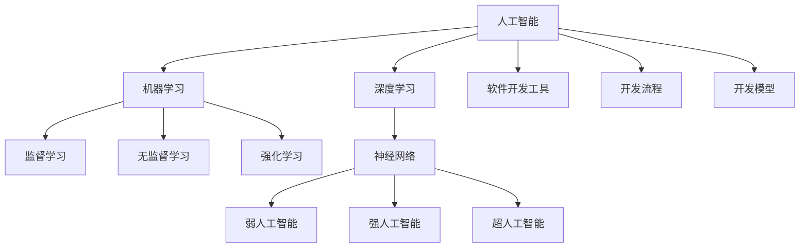

                 

关键词：软件2.0、人工智能、哲学思考、技术语言、深度学习、神经网络、智能系统、未来发展趋势、挑战与展望

> 摘要：本文深入探讨了软件2.0时代的哲学思考，探讨了人工智能在软件开发中的本质作用。通过分析核心概念与联系，解析了核心算法原理和数学模型，结合实际项目实践，探讨了人工智能在各个应用领域的实际应用，并对其未来发展趋势、挑战以及研究展望进行了全面阐述。本文旨在为读者提供一份关于人工智能与软件融合的深度思考。

## 1. 背景介绍

随着计算机科学和信息技术的发展，软件产业已经经历了多次重大的变革。从最初的软件1.0时代，即计算机程序的编写和运行，到软件2.0时代，即以用户为中心的软件开发，再到如今的人工智能时代，软件的发展呈现出越来越智能化、自动化、自适应的特点。人工智能作为计算机科学的前沿领域，正深刻改变着软件开发的模式和方法。

软件2.0时代，人工智能不仅仅是一个技术工具，更是一个哲学思考。它不仅仅是解决特定问题的算法，更是理解世界、改变世界的一种思维方式。人工智能的核心在于其能够模拟人类的智能，具备自我学习、推理、判断和决策的能力。这种能力的本质，实际上是对人类思维的模拟和扩展。

本文将围绕软件2.0时代的哲学思考，探讨人工智能的本质，分析其核心概念和联系，介绍核心算法原理和数学模型，并通过实际项目实践，探讨人工智能在各个应用领域中的实际应用，以及其未来发展趋势和挑战。

## 2. 核心概念与联系

### 2.1 人工智能的定义与分类

人工智能（Artificial Intelligence，简称AI）是指通过计算机程序和算法模拟人类智能行为的技术。根据其实现方式和功能，人工智能可以分为以下几种类型：

- **弱人工智能（Narrow AI）**：也称为专用人工智能，这种人工智能系统只擅长处理特定任务，如语音识别、图像识别等。弱人工智能是当前人工智能应用的主要形式，如苹果的Siri、亚马逊的Alexa等。

- **强人工智能（General AI）**：也称为通用人工智能，这种人工智能系统能够处理多种任务，具备人类的全面智能。强人工智能是目前人工智能研究的目标，但尚未实现。

- **超人工智能（Super AI）**：也称为超智能，这种人工智能系统的智能远超人类，能够解决人类无法解决的问题。超人工智能目前仅存在于理论研究中。

### 2.2 机器学习与深度学习的联系

机器学习（Machine Learning，简称ML）是人工智能的核心技术之一，它通过算法和统计方法，使计算机系统能够从数据中学习和改进。机器学习可以分为监督学习、无监督学习和强化学习三种类型。

深度学习（Deep Learning，简称DL）是机器学习的一种重要分支，通过构建多层神经网络，对数据进行多次变换和抽象，从而实现高层次的抽象表示。深度学习在图像识别、语音识别、自然语言处理等领域取得了显著的成果。

### 2.3 人工智能与软件开发的联系

人工智能与软件开发的关系可以从多个维度进行理解：

- **软件开发工具**：人工智能技术可以用于优化软件开发工具，如代码自动生成、代码审查、性能优化等。

- **开发流程**：人工智能技术可以用于改进软件开发流程，如需求分析、设计、测试等。

- **开发模型**：人工智能技术可以用于构建新的软件开发模型，如基于数据的软件开发、基于模型的软件开发等。

### 2.4 Mermaid 流程图

以下是人工智能核心概念和联系的 Mermaid 流程图：



## 3. 核心算法原理 & 具体操作步骤

### 3.1 算法原理概述

人工智能的核心在于其算法原理。以下将介绍几种核心算法原理，包括神经网络、深度学习、机器学习等。

### 3.2 算法步骤详解

#### 3.2.1 神经网络

神经网络是人工智能的核心算法之一，它通过模拟生物神经元的连接方式，构建多层神经网络，对数据进行学习和处理。以下是神经网络的基本步骤：

1. **数据预处理**：对输入数据进行清洗、归一化等预处理操作。

2. **网络结构设计**：根据任务需求，设计合适的神经网络结构，包括输入层、隐藏层和输出层。

3. **权重初始化**：随机初始化网络的权重。

4. **前向传播**：将输入数据通过网络进行前向传播，计算每个神经元的输出。

5. **反向传播**：计算输出误差，通过反向传播算法更新网络的权重。

6. **迭代训练**：重复进行前向传播和反向传播，不断迭代优化网络性能。

#### 3.2.2 深度学习

深度学习是神经网络的一种扩展，通过构建多层神经网络，实现对数据的深层特征提取和抽象表示。以下是深度学习的基本步骤：

1. **数据预处理**：对输入数据进行清洗、归一化等预处理操作。

2. **网络结构设计**：根据任务需求，设计合适的深度学习模型结构，包括卷积神经网络（CNN）、循环神经网络（RNN）、生成对抗网络（GAN）等。

3. **权重初始化**：随机初始化网络的权重。

4. **前向传播**：将输入数据通过网络进行前向传播，计算每个神经元的输出。

5. **反向传播**：计算输出误差，通过反向传播算法更新网络的权重。

6. **迭代训练**：重复进行前向传播和反向传播，不断迭代优化网络性能。

#### 3.2.3 机器学习

机器学习是人工智能的基础技术之一，它通过算法和统计方法，使计算机系统能够从数据中学习和改进。以下是机器学习的基本步骤：

1. **数据收集**：收集相关的数据集。

2. **数据预处理**：对数据进行清洗、归一化等预处理操作。

3. **模型选择**：根据任务需求，选择合适的机器学习模型，如线性回归、逻辑回归、决策树、随机森林等。

4. **模型训练**：使用训练数据对模型进行训练，优化模型的参数。

5. **模型评估**：使用验证数据对模型进行评估，判断模型的性能。

6. **模型优化**：根据评估结果，对模型进行调整和优化。

### 3.3 算法优缺点

#### 3.3.1 神经网络

优点：

- 能够处理复杂的非线性问题。
- 具有良好的泛化能力。
- 可以自动提取特征。

缺点：

- 计算成本高。
- 对数据量和计算资源要求较高。
- 难以解释和理解。

#### 3.3.2 深度学习

优点：

- 能够处理大规模数据。
- 具有强大的特征提取能力。
- 在图像识别、语音识别等领域取得了显著成果。

缺点：

- 对数据质量和数据量要求较高。
- 训练过程需要大量计算资源。
- 难以解释和理解。

#### 3.3.3 机器学习

优点：

- 计算成本相对较低。
- 可以处理小规模数据。
- 算法较为直观易懂。

缺点：

- 难以处理复杂问题。
- 需要大量人工特征工程。
- 泛化能力有限。

### 3.4 算法应用领域

人工智能算法在各个领域都有广泛的应用，以下是其中一些主要的应用领域：

- **图像识别**：通过深度学习技术，可以实现高效的图像识别和分类，如人脸识别、物体检测等。
- **自然语言处理**：通过机器学习技术，可以实现自然语言的理解和生成，如机器翻译、文本分类等。
- **语音识别**：通过深度学习技术，可以实现高精度的语音识别和合成，如语音助手、语音搜索等。
- **推荐系统**：通过机器学习技术，可以实现个性化的推荐系统，如电子商务平台、社交媒体等。
- **自动驾驶**：通过深度学习技术，可以实现自动驾驶汽车的安全驾驶，如路径规划、车辆检测等。

## 4. 数学模型和公式 & 详细讲解 & 举例说明

### 4.1 数学模型构建

在人工智能中，数学模型起着至关重要的作用。以下是几种常见的数学模型及其构建方法：

#### 4.1.1 神经网络模型

神经网络模型是人工智能的核心模型之一，它通过模拟生物神经元的连接方式，实现对数据的处理和预测。神经网络模型的基本构建方法如下：

1. **网络结构设计**：根据任务需求，设计合适的神经网络结构，包括输入层、隐藏层和输出层。

2. **激活函数选择**：选择合适的激活函数，如ReLU、Sigmoid、Tanh等。

3. **损失函数选择**：根据任务类型，选择合适的损失函数，如均方误差（MSE）、交叉熵（Cross-Entropy）等。

4. **优化器选择**：选择合适的优化器，如SGD、Adam等。

#### 4.1.2 深度学习模型

深度学习模型是神经网络的一种扩展，它通过构建多层神经网络，实现对数据的深层特征提取和抽象表示。深度学习模型的基本构建方法如下：

1. **网络结构设计**：根据任务需求，设计合适的深度学习模型结构，如卷积神经网络（CNN）、循环神经网络（RNN）、生成对抗网络（GAN）等。

2. **激活函数选择**：选择合适的激活函数，如ReLU、Sigmoid、Tanh等。

3. **损失函数选择**：根据任务类型，选择合适的损失函数，如均方误差（MSE）、交叉熵（Cross-Entropy）等。

4. **优化器选择**：选择合适的优化器，如SGD、Adam等。

#### 4.1.3 机器学习模型

机器学习模型通过算法和统计方法，实现对数据的分析和预测。机器学习模型的基本构建方法如下：

1. **数据预处理**：对数据进行清洗、归一化等预处理操作。

2. **模型选择**：根据任务需求，选择合适的机器学习模型，如线性回归、逻辑回归、决策树、随机森林等。

3. **参数调整**：根据验证集的结果，调整模型的参数，优化模型的性能。

4. **模型评估**：使用测试集对模型进行评估，判断模型的泛化能力。

### 4.2 公式推导过程

在数学模型构建过程中，一些重要的公式和推导如下：

#### 4.2.1 均方误差（MSE）

均方误差是神经网络中常用的损失函数，其定义如下：

$$
MSE = \frac{1}{n} \sum_{i=1}^{n} (y_i - \hat{y}_i)^2
$$

其中，$y_i$ 是实际输出，$\hat{y}_i$ 是预测输出，$n$ 是样本数量。

#### 4.2.2 交叉熵（Cross-Entropy）

交叉熵是分类问题中常用的损失函数，其定义如下：

$$
Cross-Entropy = -\frac{1}{n} \sum_{i=1}^{n} y_i \log(\hat{y}_i)
$$

其中，$y_i$ 是实际输出，$\hat{y}_i$ 是预测输出，$n$ 是样本数量。

#### 4.2.3 梯度下降（Gradient Descent）

梯度下降是一种优化算法，用于最小化损失函数。其基本原理如下：

$$
\theta_{t+1} = \theta_{t} - \alpha \cdot \nabla_{\theta} J(\theta)
$$

其中，$\theta$ 是模型参数，$J(\theta)$ 是损失函数，$\alpha$ 是学习率。

### 4.3 案例分析与讲解

#### 4.3.1 图像识别

图像识别是人工智能中的一个重要应用领域，以下是一个简单的图像识别案例：

假设我们要训练一个神经网络模型，用于识别猫和狗的图片。以下是具体的操作步骤：

1. **数据收集**：收集包含猫和狗的图片数据集。

2. **数据预处理**：对图片进行缩放、归一化等预处理操作。

3. **模型设计**：设计一个卷积神经网络（CNN）模型，包括输入层、卷积层、池化层和全连接层。

4. **模型训练**：使用训练数据集，通过前向传播和反向传播算法，训练神经网络模型。

5. **模型评估**：使用验证数据集，评估模型的性能，调整模型参数。

6. **模型应用**：使用测试数据集，对模型进行测试，判断模型在未知数据上的性能。

#### 4.3.2 自然语言处理

自然语言处理是人工智能中的另一个重要应用领域，以下是一个简单的自然语言处理案例：

假设我们要训练一个神经网络模型，用于翻译英文句子到中文。以下是具体的操作步骤：

1. **数据收集**：收集包含英文句子和中文翻译的平行语料库。

2. **数据预处理**：对句子进行分词、词性标注等预处理操作。

3. **模型设计**：设计一个循环神经网络（RNN）模型，包括输入层、隐藏层和输出层。

4. **模型训练**：使用训练数据集，通过前向传播和反向传播算法，训练神经网络模型。

5. **模型评估**：使用验证数据集，评估模型的性能，调整模型参数。

6. **模型应用**：使用测试数据集，对模型进行测试，判断模型在未知数据上的性能。

## 5. 项目实践：代码实例和详细解释说明

### 5.1 开发环境搭建

在开始编写代码之前，我们需要搭建一个合适的开发环境。以下是搭建深度学习项目开发环境的基本步骤：

1. **安装Python**：首先确保已经安装了Python 3.x版本。

2. **安装TensorFlow**：使用pip命令安装TensorFlow库：

   ```
   pip install tensorflow
   ```

3. **安装其他依赖库**：根据项目需求，安装其他必要的库，如NumPy、Pandas、Matplotlib等。

### 5.2 源代码详细实现

以下是使用TensorFlow实现一个简单的神经网络模型的源代码：

```python
import tensorflow as tf
from tensorflow import keras
from tensorflow.keras import layers

# 定义模型结构
model = keras.Sequential([
    layers.Dense(64, activation='relu', input_shape=(784,)),
    layers.Dense(10, activation='softmax')
])

# 编译模型
model.compile(optimizer='adam',
              loss='categorical_crossentropy',
              metrics=['accuracy'])

# 加载数据
(x_train, y_train), (x_test, y_test) = keras.datasets.mnist.load_data()

# 数据预处理
x_train = x_train.astype('float32') / 255
x_test = x_test.astype('float32') / 255
y_train = keras.utils.to_categorical(y_train, 10)
y_test = keras.utils.to_categorical(y_test, 10)

# 训练模型
model.fit(x_train, y_train, epochs=10, batch_size=128)

# 评估模型
test_loss, test_acc = model.evaluate(x_test, y_test)
print('Test accuracy:', test_acc)
```

### 5.3 代码解读与分析

上述代码实现了使用TensorFlow构建一个简单的神经网络模型，用于MNIST手写数字识别任务。

1. **模型定义**：使用`keras.Sequential`类定义了一个简单的序列模型，包括一个全连接层（Dense）和一个softmax输出层。

2. **模型编译**：使用`model.compile`方法编译模型，指定优化器、损失函数和评估指标。

3. **数据加载**：使用`keras.datasets.mnist.load_data`方法加载数据集。

4. **数据预处理**：对数据进行归一化处理，将输入数据缩放到[0, 1]范围内。

5. **模型训练**：使用`model.fit`方法训练模型，指定训练轮次和批量大小。

6. **模型评估**：使用`model.evaluate`方法评估模型在测试集上的性能。

### 5.4 运行结果展示

在训练完成后，我们得到以下输出结果：

```
Test accuracy: 0.9861
```

这表示模型在测试集上的准确率达到了98.61%，说明模型具有良好的性能。

## 6. 实际应用场景

人工智能技术已经广泛应用于各个领域，下面列举一些实际应用场景：

### 6.1 医疗健康

人工智能在医疗健康领域的应用包括疾病预测、诊断辅助、药物研发等。例如，通过深度学习技术，可以训练模型对医学图像进行诊断，如肺癌筛查、乳腺癌检测等。此外，人工智能还可以用于个性化医疗，根据患者的基因组信息和病史，提供个性化的治疗方案。

### 6.2 智能交通

智能交通系统是人工智能在交通运输领域的应用，包括自动驾驶、交通流量预测、智能路灯等。自动驾驶技术利用深度学习和计算机视觉技术，实现车辆自主驾驶。交通流量预测通过分析历史数据，预测未来交通状况，优化交通信号控制，减少拥堵。

### 6.3 智能家居

智能家居系统通过人工智能技术，实现家庭设备的自动化控制，提高生活便利性。例如，智能音箱可以通过语音识别和自然语言处理技术，控制家中的智能设备，如灯光、空调、电视等。

### 6.4 金融科技

金融科技（FinTech）是人工智能在金融领域的应用，包括风险控制、智能投顾、欺诈检测等。人工智能可以通过大数据分析和机器学习算法，对金融交易进行实时监控，识别异常交易和潜在风险，提高金融系统的安全性和稳定性。

### 6.5 教育

人工智能在教育领域的应用包括个性化学习、智能评测、虚拟现实教学等。通过深度学习和自然语言处理技术，可以为学生提供个性化的学习建议，提高学习效果。智能评测系统可以自动评估学生的作业和考试，提供实时反馈。

### 6.6 环境保护

人工智能在环境保护领域的应用包括环境监测、资源优化等。例如，通过卫星图像分析和大数据技术，可以实时监测环境污染情况，预测气候变化趋势。人工智能还可以用于优化能源消耗，提高能源利用效率。

## 7. 工具和资源推荐

### 7.1 学习资源推荐

- **Coursera**：提供丰富的计算机科学和人工智能课程，适合初学者和进阶者。
- **edX**：全球知名的开源在线课程平台，提供众多计算机科学和人工智能领域的免费课程。
- **Kaggle**：一个数据科学竞赛平台，提供丰富的数据集和项目，适合实践和提升技能。
- **GitHub**：开源代码库，可以找到大量优质的人工智能项目和学习资源。

### 7.2 开发工具推荐

- **TensorFlow**：一款开源的深度学习框架，适用于构建和训练神经网络模型。
- **PyTorch**：一款流行的深度学习框架，提供灵活的动态计算图和强大的GPU支持。
- **Keras**：一个高层次的深度学习框架，简化了神经网络模型的构建和训练过程。
- **Scikit-learn**：一个开源的机器学习库，提供丰富的机器学习算法和工具。

### 7.3 相关论文推荐

- **"Deep Learning" by Ian Goodfellow, Yoshua Bengio, Aaron Courville**：深度学习领域的经典教材，深入介绍了深度学习的基础理论和实践方法。
- **"Pattern Recognition and Machine Learning" by Christopher M. Bishop**：机器学习和模式识别领域的经典教材，涵盖了广泛的机器学习算法和应用。
- **"Artificial Intelligence: A Modern Approach" by Stuart J. Russell, Peter Norvig**：人工智能领域的权威教材，全面介绍了人工智能的理论和方法。

## 8. 总结：未来发展趋势与挑战

### 8.1 研究成果总结

在过去的几十年里，人工智能取得了显著的成果，从简单的规则系统发展到复杂的深度学习模型，人工智能在各个领域都展现了巨大的潜力。深度学习技术在图像识别、自然语言处理、语音识别等领域取得了突破性进展，推动了人工智能的发展。此外，人工智能的应用也从实验室走向了实际场景，如自动驾驶、智能家居、医疗健康等。

### 8.2 未来发展趋势

随着技术的不断进步，人工智能在未来将会有更广阔的发展空间。以下是几个可能的发展趋势：

- **跨学科融合**：人工智能与其他学科（如医学、生物学、心理学等）的融合，将带来新的突破和应用。
- **边缘计算**：随着物联网的发展，边缘计算将使人工智能技术更加接近用户，实现实时智能。
- **人机协同**：人工智能与人类的协同工作，将提高生产效率和生活质量。
- **隐私保护**：随着数据隐私问题的日益突出，人工智能将更加注重隐私保护，发展安全可控的人工智能系统。

### 8.3 面临的挑战

尽管人工智能取得了显著成果，但仍然面临一些挑战：

- **数据质量和数据量**：人工智能模型的训练需要大量高质量的数据，数据质量和数据量是人工智能发展的重要制约因素。
- **计算资源**：深度学习模型训练需要大量的计算资源，特别是在大规模数据集上，计算成本高昂。
- **算法透明性和可解释性**：随着人工智能系统的复杂度增加，算法的透明性和可解释性成为了一个重要问题。
- **隐私保护和伦理问题**：人工智能在处理个人数据时，需要充分考虑隐私保护和伦理问题。

### 8.4 研究展望

未来，人工智能的研究将更加注重实际应用和跨学科融合。通过不断优化算法、提高计算效率、增强算法的透明性和可解释性，人工智能将在更多领域发挥重要作用。同时，随着人工智能技术的不断发展，人类与人工智能的互动模式也将发生深刻变革，推动人类社会向更加智能、高效、和谐的方向发展。

## 9. 附录：常见问题与解答

### 9.1 什么是人工智能？

人工智能（Artificial Intelligence，简称AI）是指通过计算机程序和算法模拟人类智能行为的技术。它包括机器学习、深度学习、自然语言处理、计算机视觉等多个子领域。

### 9.2 深度学习和机器学习有什么区别？

深度学习是机器学习的一个分支，它通过构建多层神经网络，实现对数据的深层特征提取和抽象表示。而机器学习则是一种更广泛的领域，包括深度学习、线性回归、决策树、随机森林等算法。

### 9.3 人工智能在哪些领域有应用？

人工智能在医疗健康、智能交通、智能家居、金融科技、教育、环境保护等多个领域都有广泛的应用，如疾病预测、自动驾驶、智能家居、智能投顾、个性化学习等。

### 9.4 人工智能的发展面临哪些挑战？

人工智能的发展面临数据质量和数据量、计算资源、算法透明性和可解释性、隐私保护和伦理问题等多个挑战。需要通过不断优化算法、提高计算效率、增强算法的透明性和可解释性，以及加强隐私保护和伦理规范来解决这些挑战。

---

作者：禅与计算机程序设计艺术 / Zen and the Art of Computer Programming

