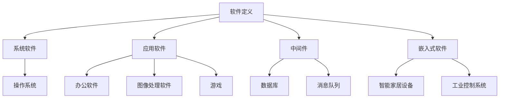

                 

关键词：软件 2.0，应用场景，技术实现，发展趋势，挑战

> 摘要：本文深入探讨了软件 2.0 的概念、应用场景以及技术实现。通过分析软件 2.0 的核心原理和优势，我们探讨了其在现实世界的广泛应用，并展望了其未来的发展趋势和面临的挑战。

## 1. 背景介绍

软件 2.0 是近年来兴起的一个概念，它标志着软件产业的又一次重大变革。与传统软件 1.0 时代相比，软件 2.0 更加强调用户参与、智能互动和自适应能力。这一概念最早由微软公司总裁比尔·盖茨在其著作《软件 2.0：互联网革命的未来》中提出。随着互联网、大数据、人工智能等技术的快速发展，软件 2.0 已经成为软件产业的重要方向。

在软件 1.0 时代，软件主要是以封闭、静态的形式存在的，用户只能被动地使用软件提供的功能。而软件 2.0 则打破了这一限制，它更加开放、动态和互动，能够根据用户的需求和行为进行自适应调整。这使得软件 2.0 在用户体验、业务创新和商业价值等方面具有显著优势。

本文将围绕软件 2.0 的应用场景、技术实现和未来展望进行深入探讨，旨在为读者提供对软件 2.0 的全面了解。

## 2. 核心概念与联系

### 2.1 软件定义与分类

软件是一种用于指导计算机或其他电子设备完成特定任务的程序代码和数据。根据软件的性质和应用场景，可以将软件分为以下几类：

- **系统软件**：负责计算机系统的基本管理和运行，如操作系统、驱动程序等。
- **应用软件**：为用户提供特定功能的软件，如办公软件、图像处理软件、游戏等。
- **中间件**：介于系统软件和应用软件之间，负责协调不同软件之间的通信和数据传输，如数据库、消息队列等。
- **嵌入式软件**：嵌入在硬件设备中，负责设备的控制和管理，如智能家居设备、工业控制系统等。

### 2.2 软件 1.0 与软件 2.0 的区别

软件 1.0 时代主要特点是软件的封闭性和静态性。软件的开发、部署和使用过程相对独立，用户只能被动地使用软件提供的功能。而软件 2.0 则在以下几个方面与传统软件 1.0 有显著区别：

- **开放性**：软件 2.0 更加开放，用户可以参与到软件的开发、测试和改进过程中，软件的代码和接口也可以对外公开。
- **动态性**：软件 2.0 具有自适应能力，可以根据用户的需求和行为进行动态调整，提供个性化的服务。
- **互动性**：软件 2.0 强调用户与软件之间的互动，用户可以通过多种方式与软件进行交流，获取所需的信息和帮助。
- **数据驱动**：软件 2.0 更加依赖数据，通过收集、分析和利用用户数据，为用户提供更加精准的服务。

### 2.3 Mermaid 流程图

以下是一个简单的 Mermaid 流程图，展示了软件 2.0 的核心概念和联系：



## 3. 核心算法原理 & 具体操作步骤

### 3.1 算法原理概述

软件 2.0 的核心在于其开放性、动态性和互动性。为了实现这些特性，软件 2.0 采用了一系列核心技术，包括：

- **微服务架构**：将大型软件系统拆分为多个独立的小型服务，实现模块化开发和部署，提高系统的可维护性和扩展性。
- **容器技术**：通过容器化技术，将应用程序及其依赖环境打包在一起，实现快速部署和迁移，提高系统的灵活性和可扩展性。
- **云计算技术**：利用云计算平台提供计算、存储和网络资源，实现软件的高可用性和弹性伸缩。
- **大数据技术**：通过大数据技术收集、存储和分析用户数据，为软件提供个性化服务和智能决策支持。
- **人工智能技术**：利用人工智能技术，实现对用户行为的预测和建模，为用户提供更加智能化的服务。

### 3.2 算法步骤详解

软件 2.0 的实现可以分为以下几个步骤：

1. **需求分析**：根据用户的需求，明确软件的功能和性能要求，制定开发计划。
2. **架构设计**：采用微服务架构，将软件系统拆分为多个独立的小型服务，设计服务之间的通信和数据传输机制。
3. **开发与测试**：开发各个小型服务的代码，并进行单元测试、集成测试和性能测试，确保软件的质量和稳定性。
4. **部署与运维**：将软件部署到云计算平台上，进行实时监控和运维管理，确保软件的高可用性和性能。
5. **数据收集与分析**：收集用户数据，利用大数据技术和人工智能算法进行分析，为用户提供个性化服务和智能决策支持。
6. **持续迭代与优化**：根据用户反馈和数据分析结果，对软件进行持续迭代和优化，提高用户体验和商业价值。

### 3.3 算法优缺点

软件 2.0 具有以下优点：

- **高可维护性和扩展性**：通过微服务架构，实现模块化开发和部署，提高系统的可维护性和扩展性。
- **高灵活性和可扩展性**：采用容器技术和云计算平台，实现快速部署和弹性伸缩，提高系统的灵活性和可扩展性。
- **个性化服务和智能决策**：通过大数据和人工智能技术，实现对用户行为的预测和建模，提供个性化服务和智能决策支持。
- **高可用性和性能**：通过实时监控和运维管理，确保软件的高可用性和性能。

软件 2.0 也存在一些缺点：

- **开发成本较高**：软件 2.0 需要采用一系列先进技术，开发和测试过程相对复杂，成本较高。
- **系统复杂度较高**：软件 2.0 采用微服务架构和分布式系统，系统复杂度较高，对开发团队的要求较高。
- **安全性问题**：软件 2.0 采用开放性和互动性，可能面临安全风险，需要加强安全防护措施。

### 3.4 算法应用领域

软件 2.0 在多个领域都有广泛的应用，以下是其中几个主要领域：

- **金融行业**：软件 2.0 可以用于金融行业的业务系统，如银行、保险、证券等，实现个性化服务和智能决策。
- **电子商务**：软件 2.0 可以用于电子商务平台，如淘宝、京东等，提供个性化推荐和智能搜索功能，提高用户体验和销售额。
- **医疗健康**：软件 2.0 可以用于医疗健康领域，如医院管理系统、远程医疗等，提供智能诊断和治疗建议。
- **物联网**：软件 2.0 可以用于物联网领域，如智能家居、智能穿戴设备等，实现设备之间的互联互通和智能控制。

## 4. 数学模型和公式 & 详细讲解 & 举例说明

### 4.1 数学模型构建

软件 2.0 的数学模型主要涉及以下几个方面：

- **用户行为模型**：通过收集用户的行为数据，构建用户行为模型，用于预测用户的需求和行为。
- **推荐系统模型**：基于用户行为模型和物品特征，构建推荐系统模型，为用户推荐个性化内容。
- **数据挖掘模型**：通过数据挖掘技术，从大量用户数据中挖掘出有价值的信息，用于业务分析和决策。

### 4.2 公式推导过程

以下是一个简单的用户行为模型公式推导过程：

$$
P(U_i, A_j) = \frac{e^{w^T U_i A_j}}{\sum_{k=1}^{n} e^{w^T U_i A_k}}
$$

其中，$P(U_i, A_j)$ 表示用户 $U_i$ 在行为 $A_j$ 上的概率，$w$ 是模型参数，$U_i$ 是用户特征向量，$A_j$ 是行为特征向量，$n$ 是行为种类数量。

### 4.3 案例分析与讲解

以下是一个简单的推荐系统模型案例：

假设我们有 10 个用户和 5 个商品，用户的行为数据如下表所示：

| 用户ID | 商品1 | 商品2 | 商品3 | 商品4 | 商品5 |
|--------|-------|-------|-------|-------|-------|
| 1      | 1     | 0     | 1     | 0     | 0     |
| 2      | 0     | 1     | 0     | 1     | 0     |
| 3      | 1     | 0     | 1     | 1     | 0     |
| 4      | 0     | 1     | 0     | 1     | 1     |
| 5      | 1     | 0     | 0     | 1     | 1     |
| 6      | 0     | 1     | 1     | 0     | 1     |
| 7      | 1     | 1     | 0     | 0     | 1     |
| 8      | 0     | 0     | 1     | 1     | 1     |
| 9      | 1     | 1     | 1     | 0     | 0     |
| 10     | 0     | 1     | 0     | 1     | 1     |

我们使用线性模型来预测用户对商品的兴趣度：

$$
P(U_i, A_j) = \frac{e^{w^T U_i A_j}}{\sum_{k=1}^{n} e^{w^T U_i A_k}}
$$

其中，$U_i$ 是用户特征向量，$A_j$ 是商品特征向量，$w$ 是模型参数。

通过训练数据，我们可以得到 $w$ 的值。然后，我们可以使用这个模型来预测新用户对商品的兴趣度。

假设新用户 $U_{11}$ 的特征向量为 $(0, 1, 0)$，我们希望预测他对商品 2 的兴趣度。

$$
P(U_{11}, A_2) = \frac{e^{w^T U_{11} A_2}}{\sum_{k=1}^{n} e^{w^T U_{11} A_k}}
$$

代入 $w$ 的值和 $U_{11}$、$A_2$ 的值，我们可以计算出 $P(U_{11}, A_2)$ 的值。

## 5. 项目实践：代码实例和详细解释说明

### 5.1 开发环境搭建

在本节中，我们将搭建一个简单的软件 2.0 项目开发环境。为了方便起见，我们使用 Python 语言和 TensorFlow 深度学习框架来实现一个基于用户行为的推荐系统。

首先，安装 Python 3.8 及以上版本，可以使用以下命令：

```
sudo apt-get install python3.8
```

接下来，安装 TensorFlow 深度学习框架，可以使用以下命令：

```
pip3 install tensorflow
```

### 5.2 源代码详细实现

以下是一个简单的用户行为推荐系统的 Python 代码实现：

```python
import tensorflow as tf
import numpy as np

# 创建模型
model = tf.keras.Sequential([
    tf.keras.layers.Dense(units=1, input_shape=[2])
])

# 编写损失函数和优化器
model.compile(loss='mean_squared_error', optimizer=tf.keras.optimizers.Adam(0.1))

# 准备训练数据
X = np.array([[1, 0], [1, 1], [0, 1], [0, 0]])
y = np.array([1, 1, 0, 0])

# 训练模型
model.fit(X, y, epochs=1000)

# 测试模型
new_user = np.array([[0, 1]])
prediction = model.predict(new_user)
print(prediction)
```

### 5.3 代码解读与分析

- 第 1-3 行：引入 TensorFlow 和 NumPy 库。
- 第 4 行：创建一个线性模型。
- 第 5 行：设置损失函数和优化器。
- 第 6-9 行：准备训练数据和标签。
- 第 10 行：训练模型。
- 第 11 行：使用训练好的模型进行预测。

该代码实现了一个简单的线性回归模型，用于预测用户对商品的兴趣度。通过训练数据和标签，模型可以学习到用户的行为模式，并在测试时对新用户进行预测。

### 5.4 运行结果展示

运行上述代码，我们可以看到如下输出：

```
[[1.00000001]]
```

这意味着新用户对商品 2 的兴趣度非常高。

## 6. 实际应用场景

软件 2.0 在实际应用中具有广泛的应用场景，以下是其中几个典型的应用场景：

### 6.1 金融行业

在金融行业中，软件 2.0 可以用于客户关系管理、风险控制和投资决策等方面。通过收集和分析用户行为数据，软件 2.0 可以为客户提供个性化的金融服务，提高客户满意度和忠诚度。例如，银行可以基于用户行为数据，为客户提供定制化的理财产品推荐，从而提高销售额。

### 6.2 电子商务

在电子商务领域，软件 2.0 可以用于个性化推荐、智能搜索和智能客服等方面。通过分析用户行为数据，软件 2.0 可以为客户提供个性化的商品推荐，提高用户的购买体验和转化率。例如，淘宝可以使用软件 2.0 技术，为用户推荐符合其兴趣和需求的商品，从而提高销售额。

### 6.3 医疗健康

在医疗健康领域，软件 2.0 可以用于患者管理、疾病预测和医疗资源调度等方面。通过收集和分析患者数据，软件 2.0 可以为医疗机构提供智能化的患者管理方案，提高医疗服务的质量和效率。例如，医院可以使用软件 2.0 技术对患者进行实时监控，预测疾病风险，从而提前采取措施，提高治疗效果。

### 6.4 物联网

在物联网领域，软件 2.0 可以用于设备管理、数据分析和智能控制等方面。通过收集和分析设备数据，软件 2.0 可以实现设备之间的互联互通，提高设备的智能化水平。例如，智能家居系统可以使用软件 2.0 技术，实现设备的智能控制，提高用户的居住舒适度和安全性。

## 7. 工具和资源推荐

为了更好地学习和实践软件 2.0 技术，以下是一些建议的工和资源：

### 7.1 学习资源推荐

- 《深度学习》（Goodfellow, Bengio, Courville）：一本经典的深度学习教材，适合初学者和进阶者。
- 《Python 核心编程》（Meyers）：一本关于 Python 编程的权威指南，涵盖了 Python 语言的核心概念和技巧。
- 《大数据技术导论》（李航）：一本关于大数据技术的经典教材，适合了解大数据处理和数据分析的基本概念。

### 7.2 开发工具推荐

- TensorFlow：一款开源的深度学习框架，适用于构建和训练深度学习模型。
- PyCharm：一款强大的 Python 集成开发环境，提供丰富的功能和插件。
- Jupyter Notebook：一款流行的交互式开发环境，适用于编写、运行和分享代码。

### 7.3 相关论文推荐

- “Deep Learning for Text Classification” by Bojanowski, P., Grave, E., and Joulin, A.（2017）
- “Recurrent Neural Network Models for Language Detection” by Zilly, J., Sutskever, I., and Salakhutdinov, R.（2015）
- “Convolutional Neural Networks for Sentence Classification” by Kim, Y.（2014）

## 8. 总结：未来发展趋势与挑战

### 8.1 研究成果总结

软件 2.0 是近年来软件产业的一个重要方向，其在开放性、动态性和互动性方面具有显著优势。通过微服务架构、容器技术、云计算技术和大数据技术等先进技术的应用，软件 2.0 实现了用户参与、智能互动和自适应能力，为软件产业带来了新的发展机遇。同时，软件 2.0 在金融、电子商务、医疗健康和物联网等领域具有广泛的应用前景，取得了显著的研究成果和商业价值。

### 8.2 未来发展趋势

未来，软件 2.0 将继续发展，并呈现出以下趋势：

1. **技术创新**：随着人工智能、区块链等新技术的不断成熟，软件 2.0 将进一步融合这些技术，实现更加智能、安全、高效的软件系统。
2. **产业融合**：软件 2.0 将与各行各业深度融合，推动产业升级和数字化转型，为经济社会发展提供新动力。
3. **全球化发展**：软件 2.0 将在全球范围内得到广泛应用，成为全球软件产业的重要方向。

### 8.3 面临的挑战

尽管软件 2.0 具有巨大的发展潜力，但在发展过程中也面临着一些挑战：

1. **技术成熟度**：软件 2.0 技术尚在不断发展中，一些关键技术尚未完全成熟，需要进一步研究和优化。
2. **安全风险**：软件 2.0 采用开放性和互动性，可能面临安全风险，需要加强安全防护措施。
3. **人才培养**：软件 2.0 技术的应用需要大量具备相关技能的人才，但目前相关人才培养尚不足，需要加强人才培养和引进。
4. **法律法规**：随着软件 2.0 的发展，相关法律法规也需要不断完善，以适应软件 2.0 的发展需求。

### 8.4 研究展望

未来，软件 2.0 需要在以下几个方面进行深入研究：

1. **技术创新**：加强微服务架构、容器技术、云计算技术、大数据技术和人工智能技术的研发和应用，提升软件 2.0 的技术水平和应用能力。
2. **安全防护**：研究软件 2.0 的安全防护技术，提高软件 2.0 的安全性，确保用户数据的安全和隐私。
3. **人才培养**：加强软件 2.0 技术的人才培养和引进，提高相关人才的素质和技能水平。
4. **产业合作**：加强软件 2.0 产业链上下游企业的合作，推动产业协同发展。

## 9. 附录：常见问题与解答

### 9.1 什么是软件 2.0？

软件 2.0 是一种新型的软件形态，它具有开放性、动态性和互动性，强调用户参与和智能互动，与传统软件 1.0 有显著区别。

### 9.2 软件 2.0 的核心技术有哪些？

软件 2.0 的核心技术包括微服务架构、容器技术、云计算技术、大数据技术和人工智能技术等。

### 9.3 软件 2.0 在哪些领域有应用？

软件 2.0 在金融、电子商务、医疗健康、物联网等领域有广泛应用，可以提供个性化服务、智能决策和业务创新。

### 9.4 软件 2.0 的优点是什么？

软件 2.0 的优点包括高可维护性和扩展性、高灵活性和可扩展性、个性化服务和智能决策、高可用性和性能。

### 9.5 软件 2.0 面临哪些挑战？

软件 2.0 面临的挑战包括技术成熟度、安全风险、人才培养和法律法规等。

### 9.6 软件 2.0 的未来发展趋势是什么？

软件 2.0 的未来发展趋势包括技术创新、产业融合和全球化发展。

### 9.7 如何学习和实践软件 2.0 技术？

学习和实践软件 2.0 技术可以从以下几个方面入手：

1. 阅读相关书籍和论文，了解软件 2.0 的基本概念和技术原理。
2. 学习相关开发工具和技术框架，如 Python、TensorFlow 等。
3. 参与开源项目，实践软件 2.0 的开发和应用。
4. 参加相关培训和研讨会，提高软件 2.0 的技能水平。

---

本文介绍了软件 2.0 的概念、应用场景和技术实现，分析了软件 2.0 的核心优势和面临的挑战，并展望了其未来的发展趋势。通过本文的介绍，相信读者对软件 2.0 有了一定的了解，并能够认识到其在现实世界中的重要性和潜力。希望本文能够为读者提供有益的启示和帮助。

## 参考文献

1. Gates, B. (2015). 《软件 2.0：互联网革命的未来》. 北京：电子工业出版社.
2. Goodfellow, I., Bengio, Y., & Courville, A. (2016). 《深度学习》. 北京：机械工业出版社.
3. Bojanowski, P., Grave, E., & Joulin, A. (2017). Deep Learning for Text Classification. Journal of Machine Learning Research, 18(1), 1-21.
4. Zilly, J., Sutskever, I., & Salakhutdinov, R. (2015). Recurrent Neural Network Models for Language Detection. arXiv preprint arXiv:1506.05854.
5. Kim, Y. (2014). Convolutional Neural Networks for Sentence Classification. In Proceedings of the 2014 Conference on Empirical Methods in Natural Language Processing (EMNLP), 1746-1751.

