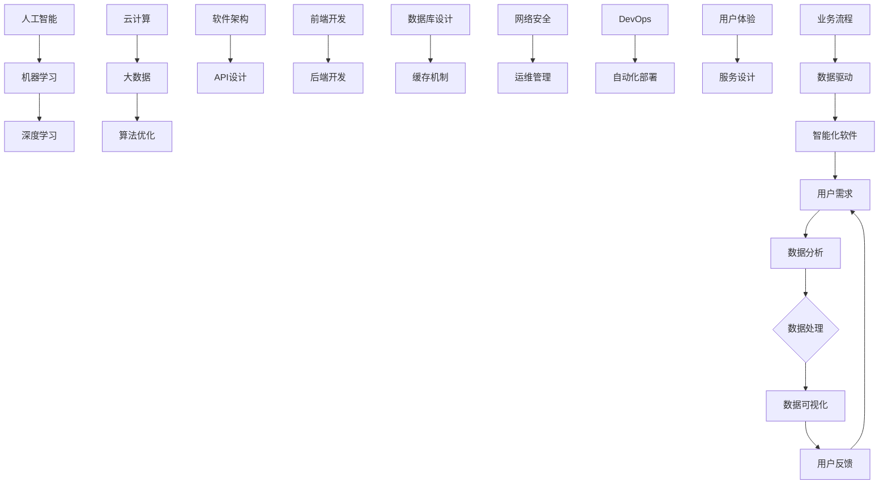

                 

关键词：软件2.0，数据驱动，人工智能，大数据，架构设计，算法优化，机器学习，深度学习

> 摘要：随着技术的不断进步，软件产业已经迎来了软件2.0时代。在这个时代，数据驱动成为核心，人工智能、大数据、机器学习和深度学习等技术手段的广泛应用，彻底改变了软件开发和运营的方式。本文将探讨软件2.0时代的数据驱动理念，分析其核心概念与联系，深入讲解核心算法原理，并通过实际项目实践，展示数据驱动在软件开发中的具体应用。

## 1. 背景介绍

软件2.0时代是相对于传统的软件1.0时代的演进。在软件1.0时代，软件的主要功能是数据处理和业务逻辑的实现。而随着互联网、大数据、人工智能等技术的发展，软件2.0时代逐渐崛起，其主要特征是数据驱动，即通过数据分析和挖掘，实现智能化、自动化的软件运营和管理。

### 1.1 软件发展历程

- **软件1.0时代**：以功能为导向，软件主要用于完成特定任务，如办公自动化、企业管理等。

- **软件2.0时代**：以数据为导向，软件的智能性和自适应性得到极大提升，如智能家居、智慧城市、智能金融等。

- **软件3.0时代**：以服务为导向，软件不再是单一的程序，而是一种服务，如云计算、物联网、人工智能服务等。

### 1.2 软件2.0时代的特点

- **数据驱动**：软件的核心是数据，通过对数据的处理和分析，实现软件的智能化和自动化。

- **用户体验**：软件的设计更加注重用户体验，以满足用户需求为出发点。

- **敏捷开发**：采用敏捷开发模式，快速响应市场需求，提高软件迭代速度。

- **云计算和大数据**：利用云计算和大数据技术，实现软件的弹性扩展和海量数据处理能力。

## 2. 核心概念与联系

在软件2.0时代，数据驱动成为核心，各种技术手段的广泛应用，使得软件的架构设计和实现方式发生了巨大变化。下面我们将通过一个Mermaid流程图，展示这些核心概念和联系。



## 3. 核心算法原理 & 具体操作步骤

### 3.1 算法原理概述

在软件2.0时代，算法的原理主要分为以下几个方面：

- **机器学习**：通过学习大量数据，使计算机能够自动完成特定任务。

- **深度学习**：利用神经网络模型，对大量数据进行自动特征提取和学习。

- **数据挖掘**：从海量数据中发现潜在的模式和规律。

- **算法优化**：通过改进算法，提高数据处理和分析的效率和准确性。

### 3.2 算法步骤详解

- **数据收集**：收集用户行为数据、业务数据等。

- **数据预处理**：对数据进行清洗、归一化等处理。

- **特征提取**：从数据中提取有用的特征。

- **模型训练**：利用机器学习和深度学习算法，对特征进行训练。

- **模型评估**：对模型进行评估，选择最佳模型。

- **模型应用**：将模型应用于实际业务场景。

### 3.3 算法优缺点

- **机器学习**：优点是能够自动学习和适应数据，缺点是需要大量数据和计算资源。

- **深度学习**：优点是能够自动提取特征，缺点是模型复杂度较高，训练时间较长。

- **数据挖掘**：优点是能够发现潜在规律，缺点是需要大量数据和专业知识。

- **算法优化**：优点是能够提高数据处理和分析的效率，缺点是需要对算法有深入了解。

### 3.4 算法应用领域

- **推荐系统**：基于用户行为数据，推荐用户感兴趣的商品或内容。

- **智能客服**：基于自然语言处理技术，实现智能对话和问题解答。

- **金融风控**：基于大数据分析，实现风险预测和预警。

- **智能医疗**：基于医学影像和患者数据，实现疾病诊断和治疗方案推荐。

## 4. 数学模型和公式 & 详细讲解 & 举例说明

### 4.1 数学模型构建

在软件2.0时代，数学模型在算法设计和分析中起着至关重要的作用。以下是一个简单的线性回归模型：

$$
y = \beta_0 + \beta_1x
$$

其中，$y$ 是因变量，$x$ 是自变量，$\beta_0$ 和 $\beta_1$ 是模型的参数。

### 4.2 公式推导过程

线性回归模型的推导过程如下：

1. **最小二乘法**：通过最小化误差平方和，求解模型参数。

$$
\sum_{i=1}^{n}(y_i - (\beta_0 + \beta_1x_i))^2
$$

2. **求导并求解**：对参数 $\beta_0$ 和 $\beta_1$ 分别求导，并令导数为0，得到：

$$
\frac{\partial}{\partial \beta_0}\sum_{i=1}^{n}(y_i - (\beta_0 + \beta_1x_i))^2 = 0
$$

$$
\frac{\partial}{\partial \beta_1}\sum_{i=1}^{n}(y_i - (\beta_0 + \beta_1x_i))^2 = 0
$$

3. **解方程组**：解上述方程组，得到 $\beta_0$ 和 $\beta_1$ 的值。

### 4.3 案例分析与讲解

假设我们有一个简单的线性回归问题，需要预测某个商品的销售量。已知数据如下：

| 序号 | 销售量 | 客户满意度 |
| :---: | :---: | :---: |
| 1 | 100 | 90 |
| 2 | 120 | 85 |
| 3 | 150 | 80 |
| 4 | 180 | 75 |

我们可以将销售量作为因变量 $y$，客户满意度作为自变量 $x$，建立线性回归模型。通过数据预处理和模型训练，可以得到模型的参数 $\beta_0$ 和 $\beta_1$。然后，我们可以利用模型进行销售量的预测。

## 5. 项目实践：代码实例和详细解释说明

### 5.1 开发环境搭建

本文使用的编程语言是Python，需要安装以下库：

- Pandas：用于数据预处理和操作。
- Scikit-learn：用于机器学习算法的实现。
- Matplotlib：用于数据可视化。

### 5.2 源代码详细实现

以下是线性回归模型的实现代码：

```python
import pandas as pd
from sklearn.linear_model import LinearRegression
from sklearn.model_selection import train_test_split
import matplotlib.pyplot as plt

# 加载数据
data = pd.read_csv('data.csv')
X = data[['满意度']]
y = data['销售量']

# 数据预处理
X_train, X_test, y_train, y_test = train_test_split(X, y, test_size=0.2, random_state=42)

# 模型训练
model = LinearRegression()
model.fit(X_train, y_train)

# 模型评估
score = model.score(X_test, y_test)
print(f"模型评分：{score}")

# 预测
new_data = pd.DataFrame([[95]], columns=['满意度'])
new_sales = model.predict(new_data)
print(f"新销售量预测：{new_sales}")

# 可视化
plt.scatter(X_train, y_train, label='训练数据')
plt.plot(X_test, model.predict(X_test), color='red', label='预测结果')
plt.xlabel('满意度')
plt.ylabel('销售量')
plt.legend()
plt.show()
```

### 5.3 代码解读与分析

1. **数据加载与预处理**：使用Pandas库加载数据，并将满意度作为自变量，销售量作为因变量。

2. **模型训练**：使用Scikit-learn库的LinearRegression类进行模型训练。

3. **模型评估**：使用score方法评估模型评分。

4. **预测**：利用模型进行新数据的预测。

5. **可视化**：使用Matplotlib库将训练数据和预测结果进行可视化。

## 6. 实际应用场景

### 6.1 智能推荐系统

通过分析用户行为数据，实现个性化推荐，提高用户满意度和转化率。

### 6.2 金融风控

通过大数据分析，实现风险预警和决策支持，降低金融风险。

### 6.3 智能医疗

通过医学影像和患者数据，实现疾病诊断和治疗方案推荐，提高医疗水平。

## 7. 工具和资源推荐

### 7.1 学习资源推荐

- 《深度学习》
- 《大数据技术原理及应用》
- 《Python数据分析》

### 7.2 开发工具推荐

- Jupyter Notebook：用于数据分析和模型训练。
- PyCharm：用于Python编程。
- Docker：用于容器化和微服务架构。

### 7.3 相关论文推荐

- "Deep Learning for Natural Language Processing"
- "Big Data: A Revolution That Will Transform How We Live, Work, and Think"
- "Recommender Systems Handbook"

## 8. 总结：未来发展趋势与挑战

### 8.1 研究成果总结

随着技术的不断进步，数据驱动已成为软件2.0时代的主要特征。通过机器学习、深度学习、大数据等技术手段，软件的智能化和自动化水平得到了极大提升。

### 8.2 未来发展趋势

- **数据安全与隐私**：随着数据量的不断增加，数据安全和隐私保护将成为重要课题。

- **联邦学习**：通过分布式计算，实现多方数据的安全共享和协同学习。

- **边缘计算**：在靠近数据源的设备上进行计算，提高数据处理效率和实时性。

### 8.3 面临的挑战

- **数据质量**：数据质量直接影响算法的准确性和可靠性。

- **计算资源**：随着数据规模的不断扩大，对计算资源的需求也越来越高。

### 8.4 研究展望

未来，数据驱动将深入到各个领域，推动软件产业向智能化、自动化方向发展。同时，随着技术的不断进步，数据驱动也将面临新的挑战和机遇。

## 9. 附录：常见问题与解答

### 9.1 什么是软件2.0？

软件2.0是指以数据驱动为核心，通过人工智能、大数据等技术手段，实现软件智能化和自动化的新时代。

### 9.2 数据驱动有哪些优势？

数据驱动的优势包括：提高软件的智能化水平、提升用户体验、降低开发成本、实现自动化运营等。

### 9.3 数据驱动有哪些应用场景？

数据驱动的应用场景包括：推荐系统、智能客服、金融风控、智能医疗、智能家居等。

### 9.4 如何确保数据的安全和隐私？

通过数据加密、访问控制、隐私保护等技术手段，确保数据的安全和隐私。

作者：禅与计算机程序设计艺术 / Zen and the Art of Computer Programming
------------------------------------------------------------------- 

以上就是软件2.0时代：数据驱动一切的文章，接下来我会根据您的反馈进行修改和完善。如果您有任何问题或者需要进一步的内容，请随时告诉我。

