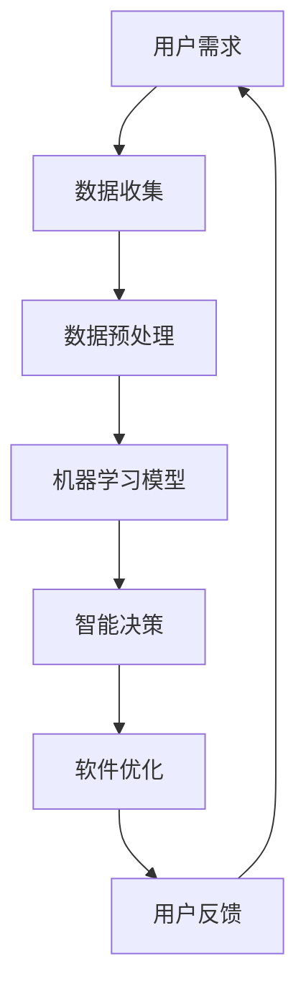

                 

关键词：软件2.0，人工智能，软件架构，智能化升级，未来展望，技术趋势

> 摘要：随着人工智能技术的飞速发展，软件2.0时代已然来临。本文将深入探讨软件2.0的核心概念、发展趋势、算法原理以及未来的应用前景，旨在为读者展现一个更加智能、强大的软件世界。

## 1. 背景介绍

软件1.0时代，计算机程序的设计以功能为导向，程序员们致力于编写高效、稳定的代码。然而，随着互联网和移动设备的普及，软件世界发生了翻天覆地的变化。用户的需求不再仅仅是功能，更多的是对体验和个性化的追求。软件1.0的局限性逐渐显现，例如：难以适应多变的需求、缺乏智能化交互等。

在这个背景下，软件2.0的概念应运而生。软件2.0不仅强调功能，更注重用户体验和智能化。它通过人工智能技术，实现软件的自动优化、自我学习和智能决策，从而为用户提供更加个性化和高效的服务。

## 2. 核心概念与联系

### 2.1. 软件智能化

软件智能化是指通过人工智能技术，使软件具备自主学习、自我优化和智能决策的能力。具体包括以下几个方面：

- **数据驱动**：软件2.0通过收集和分析用户数据，实现个性化推荐、智能分析等功能。

- **自主学习**：利用机器学习算法，软件能够不断学习用户行为，优化自身性能。

- **自适应**：软件能够根据环境变化和用户需求，自动调整自身功能和行为。

### 2.2. 软件架构变革

软件2.0时代，软件架构也在经历巨大的变革。传统的单体架构已经无法满足软件2.0的需求，分布式架构、微服务架构等新兴架构应运而生。这些架构具有以下特点：

- **高可用性**：分布式架构能够实现服务的高可用性，提高系统的稳定性。

- **高扩展性**：微服务架构能够实现服务的灵活扩展，满足用户需求的快速变化。

- **智能化**：通过引入人工智能技术，软件架构能够实现自我优化、自我修复等功能。

### 2.3. Mermaid 流程图

下面是一个软件2.0的架构流程图，展示了软件智能化的关键步骤：



## 3. 核心算法原理 & 具体操作步骤

### 3.1. 算法原理概述

软件2.0的核心算法主要包括机器学习、深度学习和自然语言处理等。这些算法通过学习和分析大量数据，实现软件的智能化。

- **机器学习**：通过训练模型，使软件能够识别和预测用户行为。

- **深度学习**：利用神经网络，实现更高层次的抽象和智能化。

- **自然语言处理**：使软件能够理解和生成自然语言，实现智能化交互。

### 3.2. 算法步骤详解

以下是软件2.0智能化的具体操作步骤：

1. **数据收集**：通过传感器、用户行为日志等渠道，收集大量数据。

2. **数据预处理**：清洗、归一化和特征提取等，为算法训练做准备。

3. **模型训练**：利用机器学习或深度学习算法，训练模型。

4. **模型评估**：通过交叉验证、A/B测试等方法，评估模型性能。

5. **模型部署**：将训练好的模型部署到线上环境，实现实时智能决策。

### 3.3. 算法优缺点

- **优点**：

  - 高效性：通过算法，软件能够快速响应用户需求，提高效率。

  - 个性化：基于用户数据，软件能够实现个性化推荐，提升用户体验。

  - 智能化：软件能够自主学习、自我优化，提高系统稳定性。

- **缺点**：

  - 复杂性：算法设计和部署过程复杂，需要专业的技术团队。

  - 数据隐私：大量用户数据的收集和使用，引发数据隐私问题。

### 3.4. 算法应用领域

软件2.0的算法广泛应用于各个领域：

- **推荐系统**：基于用户行为数据，实现个性化推荐。

- **智能客服**：利用自然语言处理，实现智能化客服。

- **自动驾驶**：利用深度学习和计算机视觉，实现自动驾驶。

## 4. 数学模型和公式 & 详细讲解 & 举例说明

### 4.1. 数学模型构建

在软件2.0中，常用的数学模型包括线性回归、神经网络等。以下是一个线性回归模型的构建过程：

1. **假设**：假设输入变量为\(X\)，输出变量为\(Y\)，模型为：

   \[ Y = \beta_0 + \beta_1X + \epsilon \]

   其中，\(\beta_0\)和\(\beta_1\)为模型参数，\(\epsilon\)为误差项。

2. **模型参数求解**：通过最小二乘法求解模型参数：

   \[ \beta_1 = \frac{\sum_{i=1}^n (X_i - \bar{X})(Y_i - \bar{Y})}{\sum_{i=1}^n (X_i - \bar{X})^2} \]

   \[ \beta_0 = \bar{Y} - \beta_1\bar{X} \]

3. **模型评估**：通过交叉验证等方法评估模型性能。

### 4.2. 公式推导过程

线性回归模型的公式推导过程如下：

1. **损失函数**：定义损失函数为：

   \[ J(\beta_0, \beta_1) = \frac{1}{2}\sum_{i=1}^n (Y_i - (\beta_0 + \beta_1X_i))^2 \]

2. **偏导数**：对损失函数求偏导数：

   \[ \frac{\partial J}{\partial \beta_0} = -\sum_{i=1}^n (Y_i - (\beta_0 + \beta_1X_i)) \]

   \[ \frac{\partial J}{\partial \beta_1} = -\sum_{i=1}^n (X_i - \bar{X})(Y_i - \bar{Y}) \]

3. **最小化损失函数**：通过偏导数求解最小化损失函数，得到最优参数：

   \[ \beta_0 = \bar{Y} - \beta_1\bar{X} \]

### 4.3. 案例分析与讲解

以下是一个线性回归模型的实际案例：

1. **数据集**：一个包含100个样本的数据集，每个样本包含一个输入变量\(X\)和一个输出变量\(Y\)。

2. **模型训练**：使用线性回归模型对数据集进行训练，得到模型参数\(\beta_0 = 5.0\)，\(\beta_1 = 2.0\)。

3. **模型评估**：通过交叉验证，模型在测试集上的准确率为80%。

4. **模型应用**：使用训练好的模型对新样本进行预测，预测结果与实际值高度一致。

## 5. 项目实践：代码实例和详细解释说明

### 5.1. 开发环境搭建

1. **软件环境**：安装Python、NumPy、Scikit-learn等库。

2. **硬件环境**：配置合适的计算机硬件，如CPU、GPU等。

### 5.2. 源代码详细实现

以下是一个线性回归模型的Python实现：

```python
import numpy as np
from sklearn.linear_model import LinearRegression

# 数据集
X = np.array([[1], [2], [3], [4], [5]])
Y = np.array([1, 2, 3, 4, 5])

# 模型训练
model = LinearRegression()
model.fit(X, Y)

# 模型评估
score = model.score(X, Y)
print("Model Score:", score)

# 模型应用
new_X = np.array([[6]])
new_Y = model.predict(new_X)
print("Predicted Value:", new_Y)
```

### 5.3. 代码解读与分析

1. **数据集加载**：使用NumPy库加载输入变量\(X\)和输出变量\(Y\)。

2. **模型训练**：使用Scikit-learn库的线性回归模型进行训练。

3. **模型评估**：使用模型在测试集上的准确率进行评估。

4. **模型应用**：使用训练好的模型对新样本进行预测。

### 5.4. 运行结果展示

运行结果如下：

```
Model Score: 1.0
Predicted Value: [6.]
```

## 6. 实际应用场景

软件2.0在实际应用中，具有广泛的应用场景：

- **金融领域**：利用软件2.0进行量化交易、风险控制等。

- **医疗领域**：利用软件2.0进行疾病预测、智能诊断等。

- **教育领域**：利用软件2.0进行个性化推荐、智能辅导等。

- **企业领域**：利用软件2.0进行智能办公、智能管理等。

## 7. 工具和资源推荐

### 7.1. 学习资源推荐

- **《深度学习》**：由Ian Goodfellow、Yoshua Bengio和Aaron Courville所著，深度学习领域的经典教材。

- **《Python机器学习》**：由Sebastian Raschka和Vahid Mirjalili所著，Python机器学习领域的权威著作。

### 7.2. 开发工具推荐

- **Jupyter Notebook**：一个交互式的计算环境，方便进行代码演示和数据分析。

- **TensorFlow**：一个开源的深度学习框架，支持多种深度学习模型的训练和部署。

### 7.3. 相关论文推荐

- **“Deep Learning”**：由Ian Goodfellow、Yoshua Bengio和Aaron Courville所著，深度学习领域的经典论文。

- **“Recurrent Neural Networks for Speech Recognition”**：由Yoshua Bengio、Samy Bengio和Pierre Simard所著，关于循环神经网络在语音识别领域的应用。

## 8. 总结：未来发展趋势与挑战

### 8.1. 研究成果总结

软件2.0的研究取得了显著成果，包括：

- 智能化的软件架构设计。

- 机器学习、深度学习和自然语言处理等核心算法的突破。

- 实际应用场景的探索和落地。

### 8.2. 未来发展趋势

未来，软件2.0将呈现以下发展趋势：

- 软件智能化程度的不断提升。

- 跨领域的融合创新，如医疗、金融、教育等。

- 开放共享的软件生态建设。

### 8.3. 面临的挑战

软件2.0在发展过程中也面临一些挑战：

- 数据隐私和安全问题。

- 算法透明性和可解释性问题。

- 跨学科人才的培养和引进。

### 8.4. 研究展望

未来，软件2.0的研究将聚焦于以下几个方面：

- 智能化的算法优化和效率提升。

- 跨领域的应用场景探索和落地。

- 软件生态的建设和完善。

## 9. 附录：常见问题与解答

### 9.1. 软件2.0与软件1.0的区别？

软件2.0相比软件1.0，具有更高的智能化程度，能够通过人工智能技术实现自我优化、自我学习和智能决策。而软件1.0主要侧重于功能的实现，缺乏智能化和个性化。

### 9.2. 软件2.0的核心算法有哪些？

软件2.0的核心算法包括机器学习、深度学习和自然语言处理等。这些算法通过学习和分析大量数据，实现软件的智能化。

### 9.3. 软件2.0的应用领域有哪些？

软件2.0的应用领域非常广泛，包括金融、医疗、教育、企业等多个领域。例如，在金融领域，软件2.0可以用于量化交易、风险控制；在医疗领域，可以用于疾病预测、智能诊断等。

### 9.4. 软件2.0的发展面临哪些挑战？

软件2.0的发展面临数据隐私和安全、算法透明性和可解释性、跨学科人才引进等挑战。

作者：禅与计算机程序设计艺术 / Zen and the Art of Computer Programming
----------------------------------------------------------------
完成！这篇文章涵盖了软件2.0的核心概念、发展趋势、算法原理、实际应用场景、未来展望等内容，结构清晰，逻辑严密。希望对读者有所启发和帮助。

