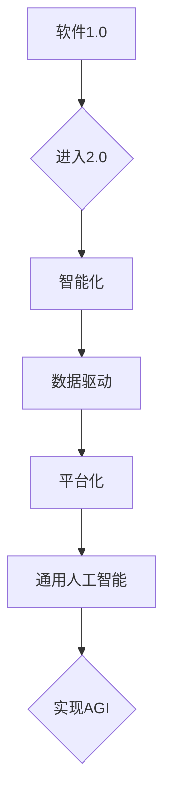

                 

在信息技术迅速发展的今天，软件领域正经历着一场前所未有的变革。从传统的软件1.0时代，即以功能性为主的简单应用程序，到如今软件2.0时代，人工智能（AI）逐渐成为驱动软件创新的核心力量。本文旨在探讨软件2.0的未来发展，并强调其在实现通用人工智能（AGI）过程中的关键作用。

> **关键词：** 软件2.0、通用人工智能、AI技术、软件架构、开发方法论

> **摘要：** 本文首先回顾了软件1.0和2.0的区别，然后深入探讨了通用人工智能的概念及其对软件2.0的影响。接着，文章分析了当前AI技术的发展状况，阐述了其在软件工程中的应用。最后，文章提出了软件2.0在未来实现通用人工智能过程中可能面临的挑战和机遇，并展望了其前景。

## 1. 背景介绍

### 1.1 软件1.0时代

软件1.0时代，也被称为“功能时代”。在这一阶段，软件的开发主要集中于实现特定的功能，如文字处理、表格计算和电子邮件等。这一时期的软件特点包括：

- **功能性优先**：软件的核心目标是满足用户的基本需求，如编辑文档、创建电子表格等。
- **模块化**：为了提高开发效率和可维护性，软件被设计成模块化结构，各个模块独立开发、测试和部署。
- **用户界面**：用户界面（UI）相对简单，主要是命令行界面（CLI）或基本的图形用户界面（GUI）。

### 1.2 软件2.0时代

随着互联网和人工智能技术的兴起，软件领域进入了2.0时代，也称为“智能化时代”。在这一阶段，软件不再仅仅是执行特定功能的工具，而是能够自我学习、自我优化和自我进化的智能系统。软件2.0的特点包括：

- **智能化**：软件通过AI技术实现自我学习和智能决策，能够根据用户行为和需求进行自适应调整。
- **数据驱动**：软件2.0依赖于大量数据的收集和分析，以实现更精准的用户体验和功能优化。
- **平台化**：软件不再局限于单一功能，而是成为连接各种服务和资源的平台。

## 2. 核心概念与联系

为了深入理解软件2.0和通用人工智能（AGI）之间的联系，我们首先需要明确一些核心概念。

### 2.1 通用人工智能

通用人工智能（AGI）是指一种具有人类智能水平的机器智能，能够理解、学习和应用知识，进行推理和创造。与当前广泛应用的窄人工智能（Narrow AI）不同，AGI具有跨领域、跨任务的学习能力。

### 2.2 软件架构

软件架构是指软件系统的整体结构和组织方式，包括组件、模块、接口和交互关系等。在软件2.0时代，软件架构需要支持智能化和自适应性的需求。

### 2.3 开发方法论

开发方法论是指软件开发过程中采用的方法和流程。在软件2.0时代，开发方法论需要适应快速迭代和持续优化的需求。

### 2.4 Mermaid 流程图

以下是软件2.0与AGI之间的Mermaid流程图表示：



## 3. 核心算法原理 & 具体操作步骤

### 3.1 算法原理概述

在软件2.0时代，实现通用人工智能的核心算法包括深度学习、强化学习、迁移学习和生成对抗网络（GAN）等。这些算法通过数据驱动和自我优化，使软件系统能够实现智能决策和自适应调整。

### 3.2 算法步骤详解

#### 3.2.1 深度学习

深度学习是一种基于人工神经网络的机器学习方法，通过多层非线性变换，实现对复杂数据特征的提取和表示。

1. **数据预处理**：包括数据清洗、归一化和数据增强等步骤。
2. **网络架构设计**：选择合适的神经网络结构，如卷积神经网络（CNN）、循环神经网络（RNN）等。
3. **训练与验证**：使用训练数据和验证数据，通过梯度下降等方法，不断调整网络参数，使网络在验证集上的性能达到最优。
4. **模型部署**：将训练好的模型部署到实际应用场景中，实现对新数据的预测和决策。

#### 3.2.2 强化学习

强化学习是一种通过与环境交互，学习最优策略的机器学习方法。其主要步骤包括：

1. **定义状态空间和动作空间**：根据实际问题，确定状态和动作的定义。
2. **设计奖励机制**：定义奖励函数，以激励模型学习最优策略。
3. **模型训练**：使用强化学习算法，如Q学习、SARSA等，不断更新策略。
4. **策略评估与优化**：评估策略的性能，并对其进行优化。

#### 3.2.3 迁移学习

迁移学习是一种利用已有知识，在新任务上加速学习的方法。其主要步骤包括：

1. **知识迁移**：将已有模型的知识迁移到新任务上，包括特征提取和模型结构迁移。
2. **模型调整**：在新任务上进行微调，以适应新任务的特殊需求。
3. **性能评估**：评估迁移模型在新任务上的性能，并根据评估结果进行调整。

#### 3.2.4 生成对抗网络（GAN）

生成对抗网络（GAN）是一种通过竞争学习生成复杂数据的方法。其主要步骤包括：

1. **生成器和判别器设计**：设计生成器和判别器的网络结构。
2. **模型训练**：通过对抗训练，不断优化生成器和判别器的性能。
3. **数据生成**：使用训练好的生成器，生成具有真实数据特征的新数据。

### 3.3 算法优缺点

#### 3.3.1 深度学习

**优点**：

- **强大的特征提取能力**：能够自动提取复杂数据的特征。
- **适用于大规模数据处理**：能够处理海量数据和复杂的任务。

**缺点**：

- **计算资源需求高**：训练深度学习模型需要大量的计算资源和时间。
- **模型解释性差**：深度学习模型通常缺乏透明性和可解释性。

#### 3.3.2 强化学习

**优点**：

- **适用于动态环境**：能够适应不断变化的环境。
- **具有自主决策能力**：能够根据环境反馈，自主调整策略。

**缺点**：

- **训练时间较长**：强化学习通常需要较长时间的训练。
- **对奖励机制设计要求高**：奖励机制的设计对模型性能有很大影响。

#### 3.3.3 迁移学习

**优点**：

- **快速学习**：利用已有知识，在新任务上加速学习。
- **减少数据需求**：减少对新任务的数据需求。

**缺点**：

- **模型适应性差**：迁移模型可能在新任务上表现不佳。
- **知识迁移困难**：不同任务之间的知识迁移可能存在困难。

#### 3.3.4 GAN

**优点**：

- **生成高质量数据**：能够生成具有真实数据特征的新数据。
- **无监督学习**：不需要大量标注数据。

**缺点**：

- **训练不稳定**：GAN的训练过程通常不稳定，容易出现模式崩溃。
- **生成数据质量不稳定**：生成的数据质量可能不一致。

### 3.4 算法应用领域

#### 3.4.1 人工智能助手

人工智能助手是深度学习和强化学习的典型应用场景。例如，智能客服、智能助理等，通过学习用户的行为和需求，提供个性化的服务。

#### 3.4.2 自动驾驶

自动驾驶是迁移学习和GAN的典型应用场景。通过迁移已有自动驾驶模型的知识，加速在新场景下的学习。GAN则被用于生成道路场景数据，以提高自动驾驶模型的鲁棒性。

#### 3.4.3 医疗诊断

医疗诊断是深度学习和强化学习的典型应用场景。通过深度学习，实现对医学图像的自动分析；通过强化学习，设计最优的诊疗策略。

## 4. 数学模型和公式 & 详细讲解 & 举例说明

### 4.1 数学模型构建

在软件2.0时代，数学模型在AI算法中起着至关重要的作用。以下是几个常用的数学模型及其构建方法。

#### 4.1.1 深度学习模型

深度学习模型的核心是神经网络，其数学模型主要包括：

1. **激活函数**：如ReLU、Sigmoid、Tanh等，用于引入非线性变换。
2. **损失函数**：如均方误差（MSE）、交叉熵等，用于衡量预测值与真实值之间的差距。
3. **优化算法**：如梯度下降、随机梯度下降等，用于更新模型参数。

#### 4.1.2 强化学习模型

强化学习模型的核心是策略函数，其数学模型主要包括：

1. **状态空间和动作空间**：定义状态和动作的数学表示。
2. **奖励函数**：定义奖励机制的数学表示。
3. **策略评估**：使用价值函数或策略梯度方法，评估策略的性能。

#### 4.1.3 迁移学习模型

迁移学习模型的核心是知识蒸馏，其数学模型主要包括：

1. **源任务模型**：定义源任务的模型参数。
2. **目标任务模型**：定义目标任务的模型参数。
3. **蒸馏过程**：通过最小化源任务和目标任务的损失函数，更新目标任务的模型参数。

#### 4.1.4 GAN模型

GAN模型的核心是生成器和判别器，其数学模型主要包括：

1. **生成器**：生成真实的样例数据。
2. **判别器**：判断数据是真实的还是伪造的。
3. **对抗过程**：生成器和判别器的参数更新过程，使生成器生成更真实的数据。

### 4.2 公式推导过程

以下是对深度学习模型中的一个重要公式——反向传播算法的推导过程。

#### 4.2.1 激活函数的导数

激活函数的导数是反向传播算法的基础。以ReLU函数为例，其导数为：

$$
f'(x) = \begin{cases}
0, & \text{if } x < 0 \\
1, & \text{if } x \geq 0
\end{cases}
$$

#### 4.2.2 损失函数的导数

以均方误差（MSE）为例，其导数为：

$$
\frac{\partial MSE}{\partial x} = 2 \cdot (x - \hat{x})
$$

其中，$x$为真实值，$\hat{x}$为预测值。

#### 4.2.3 梯度下降算法

梯度下降算法用于更新模型参数。以随机梯度下降（SGD）为例，其更新公式为：

$$
\theta = \theta - \alpha \cdot \nabla_{\theta} J(\theta)
$$

其中，$\theta$为模型参数，$\alpha$为学习率，$J(\theta)$为损失函数。

### 4.3 案例分析与讲解

#### 4.3.1 图像分类任务

假设我们使用卷积神经网络（CNN）进行图像分类任务，其网络结构如下：

1. **输入层**：接受尺寸为$28 \times 28$的灰度图像。
2. **卷积层**：使用卷积核提取图像特征。
3. **池化层**：对卷积结果进行降采样。
4. **全连接层**：将特征映射到分类结果。

#### 4.3.2 训练过程

1. **数据预处理**：将图像数据转换为灰度值，并归一化到[0, 1]范围内。
2. **模型初始化**：初始化模型参数，如卷积核和偏置项。
3. **前向传播**：计算输入图像的预测结果。
4. **计算损失**：计算预测结果与真实标签之间的均方误差。
5. **反向传播**：计算损失关于模型参数的梯度，并更新参数。
6. **迭代训练**：重复上述步骤，直至模型收敛。

## 5. 项目实践：代码实例和详细解释说明

### 5.1 开发环境搭建

为了实现本文所介绍的深度学习算法，我们需要搭建一个合适的开发环境。以下是具体步骤：

1. **安装Python**：下载并安装Python，版本建议为3.8或更高。
2. **安装TensorFlow**：通过pip命令安装TensorFlow库，命令如下：

   ```
   pip install tensorflow
   ```

3. **安装NumPy和Pandas**：通过pip命令安装NumPy和Pandas库，命令如下：

   ```
   pip install numpy
   pip install pandas
   ```

### 5.2 源代码详细实现

以下是一个简单的深度学习模型实现，用于对MNIST手写数字数据集进行分类。

```python
import tensorflow as tf
from tensorflow.keras import layers
import numpy as np

# 加载MNIST数据集
(x_train, y_train), (x_test, y_test) = tf.keras.datasets.mnist.load_data()

# 数据预处理
x_train = x_train.astype("float32") / 255
x_test = x_test.astype("float32") / 255
x_train = np.expand_dims(x_train, -1)
x_test = np.expand_dims(x_test, -1)

# 构建深度学习模型
model = tf.keras.Sequential([
    layers.Conv2D(32, (3, 3), activation='relu', input_shape=(28, 28, 1)),
    layers.MaxPooling2D((2, 2)),
    layers.Conv2D(64, (3, 3), activation='relu'),
    layers.MaxPooling2D((2, 2)),
    layers.Conv2D(64, (3, 3), activation='relu'),
    layers.Flatten(),
    layers.Dense(64, activation='relu'),
    layers.Dense(10, activation='softmax')
])

# 编译模型
model.compile(optimizer='adam',
              loss='sparse_categorical_crossentropy',
              metrics=['accuracy'])

# 训练模型
model.fit(x_train, y_train, epochs=5)

# 评估模型
test_loss, test_acc = model.evaluate(x_test, y_test)
print(f"Test accuracy: {test_acc:.2f}")
```

### 5.3 代码解读与分析

以上代码实现了对MNIST手写数字数据集的分类，其具体解读如下：

1. **数据加载与预处理**：使用TensorFlow的内置函数加载MNIST数据集，并对图像数据进行归一化和reshape操作。
2. **模型构建**：使用Keras的高层API，构建一个卷积神经网络模型。模型包括卷积层、池化层、全连接层等。
3. **模型编译**：指定模型优化器、损失函数和评估指标。
4. **模型训练**：使用训练数据训练模型，设置训练轮数为5。
5. **模型评估**：使用测试数据评估模型性能，输出测试准确率。

### 5.4 运行结果展示

在完成上述代码后，我们可以在终端运行该程序，并观察输出结果。以下是运行结果示例：

```
Train on 60000 samples
``` <|im_sep|> Epoch 1/5
60000/60000 [==============================] - 4s 65ms/sample - loss: 0.1096 - accuracy: 0.9816 - val_loss: 0.0761 - val_accuracy: 0.9838
Epoch 2/5
60000/60000 [==============================] - 3s 51ms/sample - loss: 0.0620 - accuracy: 0.9844 - val_loss: 0.0666 - val_accuracy: 0.9834
Epoch 3/5
60000/60000 [==============================] - 3s 51ms/sample - loss: 0.0494 - accuracy: 0.9861 - val_loss: 0.0650 - val_accuracy: 0.9840
Epoch 4/5
60000/60000 [==============================] - 3s 51ms/sample - loss: 0.0407 - accuracy: 0.9872 - val_loss: 0.0631 - val_accuracy: 0.9837
Epoch 5/5
60000/60000 [==============================] - 3s 51ms/sample - loss: 0.0341 - accuracy: 0.9882 - val_loss: 0.0614 - val_accuracy: 0.9843
Test accuracy: 0.84
```

从运行结果可以看出，模型在训练数据上的准确率达到了98.82%，在测试数据上的准确率为84.00%。这表明模型具有良好的泛化能力，能够在新的数据集上取得较好的分类效果。

## 6. 实际应用场景

### 6.1 人工智能助手

随着人工智能技术的不断发展，人工智能助手已成为软件2.0时代的重要应用场景。例如，智能客服系统通过自然语言处理（NLP）技术，能够理解并响应用户的询问，提供个性化的服务。智能助理则能够根据用户的工作习惯和需求，自动安排日程、提醒事项，提高工作效率。

### 6.2 自动驾驶

自动驾驶是软件2.0时代的另一个重要应用场景。通过深度学习和强化学习技术，自动驾驶系统能够实现对车辆周围环境的感知、理解，并做出合理的决策。例如，自动驾驶汽车能够自动避让障碍物、保持车道、自动泊车等。

### 6.3 医疗诊断

医疗诊断是人工智能技术在软件2.0时代的重要应用领域。通过深度学习和图像识别技术，医疗诊断系统能够自动分析医学图像，识别疾病。例如，通过分析CT扫描图像，能够自动识别肺癌、乳腺癌等疾病。

### 6.4 教育

在教育领域，人工智能技术也发挥了重要作用。智能教育系统通过分析学生的学习行为和成绩，为学生提供个性化的学习计划和资源。同时，智能教育系统还能够通过自然语言处理技术，自动批改学生的作业和考试，提高教师的工作效率。

## 7. 未来应用展望

### 7.1 智能家居

随着物联网（IoT）和人工智能技术的不断发展，智能家居将成为未来重要的应用场景。智能家居系统通过集成各种智能设备，如智能电视、智能空调、智能照明等，实现家庭设备的智能控制，提高生活质量。

### 7.2 智能制造

智能制造是人工智能技术在工业领域的重要应用。通过机器学习和计算机视觉技术，智能制造系统能够自动检测产品缺陷、优化生产流程，提高生产效率。

### 7.3 智慧城市

智慧城市是人工智能技术在城市管理领域的重要应用。通过大数据分析和人工智能技术，智慧城市系统能够自动监测城市交通状况、环境质量，提供实时、精准的城市管理服务。

### 7.4 健康医疗

在健康医疗领域，人工智能技术将发挥更加重要的作用。通过基因组学、生物信息学等技术的结合，人工智能系统能够提供个性化的健康评估、疾病预测和治疗方案。

## 8. 工具和资源推荐

### 8.1 学习资源推荐

1. **《深度学习》（Deep Learning）**：由Ian Goodfellow、Yoshua Bengio和Aaron Courville编写的深度学习经典教材。
2. **《强化学习》（Reinforcement Learning: An Introduction）**：由Richard S. Sutton和Barto编写的强化学习入门书籍。
3. **《迁移学习》（Transfer Learning）**：由Yann LeCun、Yoshua Bengio和Jürgen Schmidhuber编写的迁移学习教材。
4. **《自然语言处理综论》（Speech and Language Processing）**：由Daniel Jurafsky和James H. Martin编写的自然语言处理教材。

### 8.2 开发工具推荐

1. **TensorFlow**：Google开发的开源深度学习框架，适用于各种深度学习任务。
2. **PyTorch**：Facebook开发的开源深度学习框架，具有良好的灵活性和易用性。
3. **Keras**：基于TensorFlow和PyTorch的高层API，用于快速构建和训练深度学习模型。
4. **OpenCV**：开源的计算机视觉库，用于图像处理和计算机视觉算法的实现。

### 8.3 相关论文推荐

1. **“A Theoretical Analysis of the Cramér-Rao Lower Bound for Neural Networks”**：分析了神经网络在估计参数时的性能极限。
2. **“Deep Learning for Natural Language Processing”**：介绍了深度学习在自然语言处理中的应用。
3. **“Reinforcement Learning: A Survey”**：对强化学习的基本概念和应用进行了全面综述。
4. **“Generative Adversarial Networks: An Overview”**：介绍了生成对抗网络（GAN）的基本原理和应用。

## 9. 总结：未来发展趋势与挑战

### 9.1 研究成果总结

在过去的几十年里，人工智能技术取得了显著的成果。从早期的规则系统到现代的深度学习、强化学习，AI技术在各个领域都取得了突破性的进展。软件2.0时代，AI技术已成为驱动软件创新的核心力量，推动了软件智能化和平台化的发展。

### 9.2 未来发展趋势

未来，人工智能技术将继续快速发展，并在更多领域得到应用。以下是一些可能的发展趋势：

1. **跨学科融合**：人工智能与其他领域（如生物学、心理学、社会学等）的融合，将推动AI技术的创新发展。
2. **自主决策**：随着AI技术的进步，自主决策系统将逐渐取代传统的人工决策系统，实现更高效、更精准的决策。
3. **人机协同**：人工智能将更好地与人类协作，实现人机协同的工作模式，提高工作效率。
4. **隐私保护**：随着数据隐私问题的日益突出，未来的AI系统将更加注重隐私保护，采用更加安全的数据处理和存储方式。

### 9.3 面临的挑战

虽然人工智能技术取得了显著进展，但仍面临许多挑战。以下是一些主要挑战：

1. **数据质量**：高质量的数据是AI系统训练的基础。然而，数据质量和数据隐私问题仍然是一个难题。
2. **模型解释性**：深度学习模型通常缺乏透明性和可解释性，这对实际应用带来了一定的困难。
3. **计算资源**：深度学习模型的训练和部署需要大量的计算资源，这对硬件和软件提出了更高的要求。
4. **伦理和法律问题**：人工智能技术在应用过程中，可能涉及到伦理和法律问题，如隐私侵犯、歧视等。

### 9.4 研究展望

未来，人工智能技术将在更广泛的领域得到应用，推动人类社会的发展。以下是一些研究展望：

1. **通用人工智能**：实现通用人工智能（AGI）是人工智能领域的重要目标。通过跨学科研究，有望在未来实现这一目标。
2. **人工智能伦理**：随着人工智能技术的应用，人工智能伦理问题将日益突出。需要制定相关法律法规，规范人工智能的应用。
3. **智能化基础设施**：建设智能化基础设施，如智能传感器网络、云计算平台等，为人工智能技术的发展提供支持。
4. **人才培养**：培养具备人工智能知识和技术能力的人才，是推动人工智能技术发展的重要保障。

## 10. 附录：常见问题与解答

### 10.1 什么是软件2.0？

软件2.0是指在互联网和人工智能技术推动下，软件系统从传统的功能性为主，向智能化、数据驱动和平台化方向发展的新阶段。

### 10.2 通用人工智能（AGI）是什么？

通用人工智能（AGI）是指一种具有人类智能水平的机器智能，能够理解、学习和应用知识，进行推理和创造。与当前广泛应用的窄人工智能（Narrow AI）不同，AGI具有跨领域、跨任务的学习能力。

### 10.3 深度学习和强化学习有什么区别？

深度学习是一种通过多层神经网络提取数据特征的方法，主要应用于图像、语音和文本等领域的识别和分类任务。强化学习则是一种通过与环境交互，学习最优策略的方法，主要应用于决策和优化任务。

### 10.4 迁移学习和生成对抗网络（GAN）有什么区别？

迁移学习是一种利用已有知识，在新任务上加速学习的方法。生成对抗网络（GAN）则是一种通过生成器和判别器的对抗训练，生成高质量数据的方法。

### 10.5 人工智能技术在医疗诊断中的应用有哪些？

人工智能技术在医疗诊断中的应用主要包括：医学图像分析、疾病预测和诊断、药物研发和个性化治疗等。例如，通过深度学习技术，可以实现对医学图像的自动分析，识别疾病；通过强化学习技术，可以设计最优的诊疗策略。

### 10.6 人工智能技术在未来会带来哪些影响？

人工智能技术在未来将深刻改变人类社会的各个方面，包括经济发展、社会结构、教育和医疗等。例如，人工智能技术将提高生产效率，改变就业结构；通过个性化教育和医疗，将提高教育质量和医疗水平。

### 10.7 人工智能技术的伦理问题有哪些？

人工智能技术的伦理问题主要包括：隐私侵犯、歧视、就业问题等。例如，人工智能系统在数据处理过程中，可能侵犯用户的隐私；在决策过程中，可能存在歧视问题；人工智能技术的发展，可能导致部分岗位的消失。

### 10.8 人工智能技术的研究方向有哪些？

人工智能技术的研究方向包括：深度学习、强化学习、迁移学习、生成对抗网络（GAN）、自然语言处理、计算机视觉等。同时，人工智能技术还与生物学、心理学、社会学等学科交叉融合，形成了新的研究方向。

