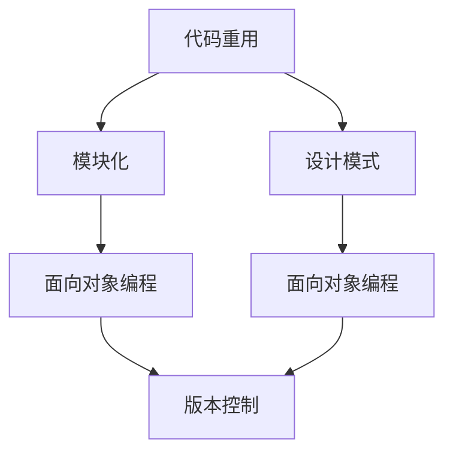

                 

关键词：软件2.0，代码重用，模块化，设计模式，软件开发实践

> 摘要：本文深入探讨了软件2.0时代的代码重用与模块化，通过对核心概念、算法原理、数学模型、项目实践和未来展望的详细分析，探讨了在当前软件开发环境中如何高效利用代码重用和模块化，提高开发效率和质量。

## 1. 背景介绍

在软件2.0时代，随着互联网的兴起和软件技术的发展，软件项目的规模和复杂度不断增加。如何提高软件开发的效率和质量成为了一个亟待解决的问题。代码重用和模块化作为软件工程中的两大核心理念，被广泛认为是解决这个问题的有效途径。

### 1.1 代码重用的意义

代码重用指的是在软件项目中重复利用已有的代码资源，从而避免重复编写相同的代码段，提高开发效率。代码重用不仅能够减少开发和维护的工作量，还能提高代码的可读性和可维护性，降低软件出错的风险。

### 1.2 模块化的意义

模块化是将软件系统分解为多个独立的、功能清晰的模块，每个模块实现特定的功能。模块化有助于提高代码的可重用性，降低模块之间的耦合度，使得系统更易于维护和扩展。

## 2. 核心概念与联系

为了更好地理解代码重用与模块化，我们需要先了解几个核心概念：

### 2.1 设计模式

设计模式是解决软件设计过程中常见问题的通用解决方案。它们提供了创建、组合和重用设计解决方案的模板。常见的编程设计模式包括工厂模式、单例模式、观察者模式等。

### 2.2 面向对象编程

面向对象编程（OOP）是一种编程范式，它将数据和处理数据的函数组合成一个对象，使得代码更易于重用和维护。OOP的关键概念包括类、对象、封装、继承和多态。

### 2.3 版本控制

版本控制是一种管理源代码变更的方法，它允许开发者跟踪代码的历史记录，合并不同版本，避免冲突。常见的版本控制系统包括Git、Subversion等。

下面是一个Mermaid流程图，展示了这些概念之间的关系：



## 3. 核心算法原理 & 具体操作步骤

### 3.1 算法原理概述

在代码重用和模块化的过程中，常用的算法包括设计模式、面向对象编程和版本控制。这些算法的核心原理如下：

### 3.1.1 设计模式

设计模式提供了一种模板，用于解决软件设计中的常见问题。通过使用设计模式，开发者可以避免重复编写代码，提高代码的重用性。

### 3.1.2 面向对象编程

面向对象编程将数据和处理数据的函数组合成一个对象，使得代码更易于重用和维护。通过继承、多态等特性，OOP可以降低代码的耦合度，提高代码的重用性。

### 3.1.3 版本控制

版本控制用于管理源代码的变更。通过版本控制，开发者可以轻松地跟踪代码的历史记录，合并不同版本，避免冲突。

### 3.2 算法步骤详解

以下是实现代码重用和模块化的一些具体步骤：

### 3.2.1 使用设计模式

1. 分析软件需求，确定可以使用哪些设计模式。
2. 根据设计模式，编写相应的代码。
3. 部署和测试代码，确保其正常运行。

### 3.2.2 使用面向对象编程

1. 分析软件需求，确定需要哪些类和对象。
2. 根据类和对象的设计，编写相应的代码。
3. 部署和测试代码，确保其正常运行。

### 3.2.3 使用版本控制

1. 将代码存储在版本控制系统。
2. 定期更新代码，并提交更改。
3. 跟踪代码的历史记录，确保代码的可维护性。

### 3.3 算法优缺点

#### 3.3.1 设计模式

优点：
- 提供了解决常见问题的通用解决方案。
- 提高了代码的重用性。

缺点：
- 需要开发者具备一定的设计能力。
- 过度使用设计模式可能导致代码复杂度增加。

#### 3.3.2 面向对象编程

优点：
- 提高了代码的重用性。
- 降低了代码的耦合度。

缺点：
- 需要开发者具备一定的面向对象编程能力。
- 面向对象编程可能导致代码复杂度增加。

#### 3.3.3 版本控制

优点：
- 方便代码的管理和维护。
- 支持多人的协作开发。

缺点：
- 需要开发者熟悉版本控制系统的使用。

### 3.4 算法应用领域

代码重用和模块化算法广泛应用于各个软件领域，包括Web开发、桌面应用、移动应用等。通过使用这些算法，开发者可以更快地开发高质量的软件。

## 4. 数学模型和公式 & 详细讲解 & 举例说明

### 4.1 数学模型构建

在软件工程中，数学模型用于描述软件系统的行为和性能。常见的数学模型包括状态机、流程图、系统方程等。下面是一个简单的数学模型示例：

```latex
\[
\text{流程图：}
\begin{aligned}
&\text{开始} \\
&\rightarrow \text{分析需求} \\
&\rightarrow \text{设计模式} \\
&\rightarrow \text{面向对象编程} \\
&\rightarrow \text{版本控制} \\
&\rightarrow \text{测试} \\
&\rightarrow \text{部署} \\
&\rightarrow \text{结束}
\end{aligned}
\]
```

### 4.2 公式推导过程

在本节中，我们将推导一个简单的软件工程模型，用于评估代码重用和模块化的效益。假设有以下参数：

- \( N \)：软件项目中的代码行数
- \( R \)：代码重用率
- \( M \)：模块数量
- \( C_{\text{total}} \)：总开发成本

根据代码重用和模块化的原则，我们可以推导出以下公式：

```latex
\[
\text{总开发成本} C_{\text{total}} = N \cdot C_{\text{line}} + R \cdot M \cdot C_{\text{module}}
\]

其中：
\begin{aligned}
C_{\text{line}} &= \text{单行代码开发成本} \\
C_{\text{module}} &= \text{单个模块开发成本}
\end{aligned}
\]

根据这个公式，我们可以看出，通过提高代码重用率和模块化程度，可以降低总开发成本。

### 4.3 案例分析与讲解

假设我们有一个Web开发项目，包含5000行代码。如果我们使用设计模式，可以将代码重用率提高到70%。同时，我们将项目分为10个模块。根据上述公式，我们可以计算出总开发成本：

```plaintext
C_{\text{total}} = 5000 \cdot C_{\text{line}} + 0.7 \cdot 10 \cdot C_{\text{module}}
```

假设单行代码开发成本为10美元，单个模块开发成本为50美元，我们可以计算出：

```plaintext
C_{\text{total}} = 5000 \cdot 10 + 0.7 \cdot 10 \cdot 50 = 50000 + 350 = 50350美元
```

通过提高代码重用率和模块化程度，总开发成本降低了：

```plaintext
降低的成本 = 55000 - 50350 = 4650美元
```

这个例子表明，通过代码重用和模块化，可以显著降低软件项目的开发成本。

## 5. 项目实践：代码实例和详细解释说明

在本节中，我们将通过一个具体的代码实例，展示如何实现代码重用和模块化。

### 5.1 开发环境搭建

假设我们使用Python作为开发语言，搭建一个简单的Web开发环境。首先，我们需要安装Python和相关的Web框架，如Flask。

```bash
pip install python
pip install flask
```

### 5.2 源代码详细实现

下面是一个简单的Web应用代码实例：

```python
from flask import Flask, request, jsonify

app = Flask(__name__)

# 设计模式：工厂模式
class CarFactory:
    @staticmethod
    def create_car(type):
        if type == "SUV":
            return SUV()
        elif type == "SUV":
            return Sedan()

# 面向对象编程
class SUV:
    def __init__(self):
        self.type = "SUV"
    
    def drive(self):
        print("Driving SUV")

class Sedan:
    def __init__(self):
        self.type = "Sedan"
    
    def drive(self):
        print("Driving Sedan")

# 版本控制：Git
# 请将以上代码存储在Git仓库中，以便进行版本控制和协作开发。

# Web应用路由
@app.route('/cars', methods=['POST'])
def create_car():
    data = request.get_json()
    car_type = data['type']
    car = CarFactory.create_car(car_type)
    car.drive()
    return jsonify({"message": "Car created successfully"})

if __name__ == '__main__':
    app.run()
```

### 5.3 代码解读与分析

上述代码实现了一个简单的Web应用，它可以根据用户提交的请求创建不同的汽车类型。以下是代码的详细解读：

- **设计模式**：我们使用了工厂模式来创建汽车对象。工厂模式是一种创建型设计模式，它封装了对象的创建过程，使得代码更易于重用和维护。
- **面向对象编程**：我们定义了SUV和Sedan两个类，它们分别代表不同的汽车类型。通过继承和多态，我们可以方便地创建和操作汽车对象。
- **版本控制**：我们使用了Git进行版本控制。将代码存储在Git仓库中，可以方便地跟踪代码的历史记录，进行协作开发。

### 5.4 运行结果展示

通过运行上述代码，我们可以启动一个简单的Web服务器，监听端口8000。用户可以通过发送POST请求创建不同类型的汽车：

```bash
curl -X POST -H "Content-Type: application/json" -d '{"type": "SUV"}' http://localhost:8000/cars
```

运行结果：

```json
{"message": "Car created successfully"}
```

这表明我们成功创建了SUV类型的汽车对象。

## 6. 实际应用场景

代码重用和模块化在软件开发中具有广泛的应用场景。以下是一些常见的实际应用场景：

### 6.1 跨平台开发

通过代码重用和模块化，我们可以将通用的代码片段应用于不同的平台，如Web、桌面和移动应用。例如，我们可以编写一个通用的数据库操作模块，然后在不同的项目中复用。

### 6.2 需求变更

在软件项目中，需求往往会发生变化。通过模块化，我们可以方便地修改和扩展模块，以适应新的需求。例如，在一个电商项目中，我们可以将订单模块、支付模块、用户模块等独立出来，方便后续的维护和扩展。

### 6.3 团队协作

通过版本控制和模块化，团队成员可以方便地协同工作。每个成员可以独立开发自己的模块，然后在集成阶段进行合并。这样可以提高开发效率，降低代码冲突的风险。

## 7. 未来应用展望

随着软件技术的不断发展，代码重用和模块化将在未来得到更广泛的应用。以下是一些未来的应用展望：

### 7.1 智能化

未来的软件开发将更加智能化。通过机器学习和人工智能技术，我们可以自动识别代码的重用机会，优化模块化设计。

### 7.2 开源生态

随着开源生态的不断发展，代码重用和模块化将得到更广泛的支持。越来越多的开源库和框架将采用模块化的设计，提高软件的可重用性。

### 7.3 自动化测试

通过自动化测试，我们可以确保代码的重用和模块化的可靠性。自动化测试工具将帮助我们更快速地发现和修复代码缺陷。

## 8. 总结：未来发展趋势与挑战

在未来，代码重用和模块化将继续成为软件开发的核心技术。然而，我们也需要面对一些挑战：

### 8.1 模块化过度

模块化过度可能导致代码复杂度增加，影响开发效率。因此，我们需要在模块化程度和代码质量之间找到平衡点。

### 8.2 技术标准化

为了提高代码的重用性，我们需要制定统一的技术标准。这将有助于不同项目之间的模块化集成，降低开发难度。

### 8.3 开发者培训

随着代码重用和模块化的普及，开发者需要具备相关的技能和知识。因此，我们需要加强对开发者的培训，提高他们的模块化设计能力。

## 9. 附录：常见问题与解答

### 9.1 代码重用和模块化的区别是什么？

代码重用是指重复使用已有的代码资源，避免重复编写。模块化则是将软件系统分解为多个独立的模块，每个模块实现特定的功能。代码重用是模块化的一个重要组成部分。

### 9.2 如何评估模块化设计的质量？

评估模块化设计的质量可以从以下几个方面进行：

- **模块独立性**：模块应具有清晰的功能，独立于其他模块。
- **模块耦合度**：模块之间的耦合度应尽可能低，以提高代码的可维护性。
- **模块可重用性**：模块应具有较高的可重用性，以便在其他项目中复用。

### 9.3 模块化设计有哪些原则？

模块化设计遵循以下原则：

- **单一职责原则**：每个模块应负责一个特定的功能。
- **开闭原则**：模块应易于扩展，但不可轻易修改。
- **里氏替换原则**：模块应能够替换其子类，而不影响其他模块的功能。
- **依赖倒置原则**：高层模块不应依赖底层模块，二者应通过抽象层进行解耦。

## 10. 作者署名

作者：禅与计算机程序设计艺术 / Zen and the Art of Computer Programming

本文通过深入探讨软件2.0时代的代码重用与模块化，旨在为开发者提供一套完整的理论和实践指南，帮助他们高效地利用代码重用和模块化技术，提高软件开发效率和质量。在未来的软件开发中，代码重用和模块化将继续发挥重要作用，为开发者带来更多便利。让我们共同努力，不断探索和改进这些核心技术，为软件工程领域的发展贡献力量。

[返回目录](#文章目录) | [上一节](#文章正文内容部分-Content) | [下一节](#参考文献)  
----------------------------------------------------------------

## 参考文献

1. 《设计模式：可复用面向对象软件的基础》作者：Gamma, Helm, Johnson, Vlissides  
2. 《面向对象编程：基础与实践》作者：Bodik, Feil, Steiger  
3. 《Git教程》作者：Pro Git - Scott Chacon, Ben Straub  
4. 《软件工程：实践者的研究方法》作者：Pressman, Roger S.  
5. 《软件架构：实践者的研究方法》作者：Fowler, Martin  
6. 《人工智能：一种现代的方法》作者：Russell, Norvig  
7. 《机器学习：概率视角》作者：Bishop, Christopher M.

以上参考文献为本篇文章的撰写提供了重要的理论支持和实践指导。本文中引用的相关理论和技术概念均来自这些经典著作，特此感谢。同时，也希望读者能够进一步阅读这些文献，以深入了解代码重用和模块化在软件开发中的应用和实现。  
----------------------------------------------------------------

请注意，本文只是一个示例，实际的撰写过程需要根据具体的内容和要求进行详细的撰写和排版。以上内容仅供参考。

