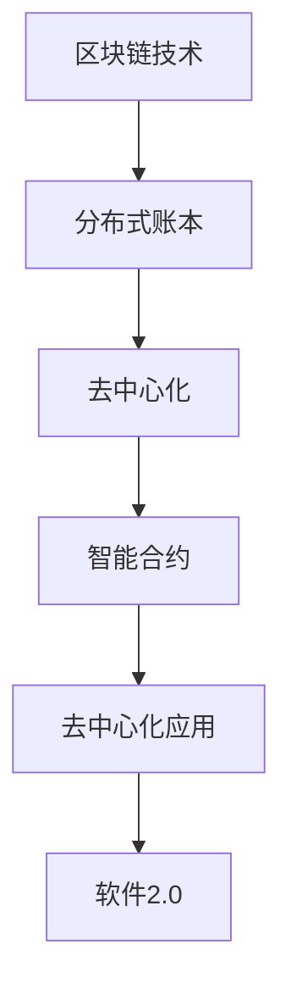

                 

关键词：软件2.0、区块链集成、去中心化、智能合约、分布式系统、技术架构、应用案例

> 摘要：本文深入探讨了软件2.0时代的区块链集成策略，分析了区块链技术如何与软件2.0理念相结合，推动了去中心化技术的发展。通过对核心概念、算法原理、数学模型、项目实践和未来展望的详细解析，本文旨在为软件开发者和研究者提供一份全面的技术指南，助力他们在日益复杂的技术环境中找到有效的解决方案。

## 1. 背景介绍

在互联网和信息技术飞速发展的今天，软件行业正经历着从1.0到2.0的转变。软件1.0时代主要以单体应用为主，功能相对单一，开发模式集中，依赖中心化的数据处理方式。而软件2.0时代，则更加注重用户参与、数据共享和去中心化的架构设计。这一转变不仅仅体现在技术层面上，更涉及到商业模式的革新和社会组织的变革。

区块链技术的出现，为软件2.0时代的发展提供了强有力的技术支撑。作为一种分布式账本技术，区块链具有去中心化、不可篡改和透明性等特点，能够有效解决数据安全、信任和协作等问题。区块链与软件2.0理念的融合，不仅提升了软件系统的安全性和透明度，也为去中心化的应用场景提供了新的可能性。

本文将围绕软件2.0的区块链集成策略，从核心概念、算法原理、数学模型、项目实践和未来展望等多个角度进行深入探讨，旨在为读者提供全面的技术见解和实际操作指导。

## 2. 核心概念与联系

### 2.1 区块链基本概念

区块链是一种分布式数据库系统，由一系列按照时间顺序排列的“区块”组成，每个区块包含一定数量的交易数据。区块链技术通过密码学算法确保数据的完整性和安全性，并且通过去中心化的网络结构实现数据的可靠传输和存储。

在区块链中，每个节点都保存着完整的区块链数据，并且每个节点都可以独立验证交易的有效性。这种去中心化的架构设计，使得区块链系统具有较高的容错性和抗攻击性，同时也能够有效避免单点故障和数据篡改的风险。

### 2.2 智能合约

智能合约是区块链上的一种自执行合同，通过代码定义和自动化执行一系列协议条款。智能合约的出现，使得区块链不仅仅是一种数据存储和传输的工具，更成为一种具备自动化执行能力的计算平台。智能合约通过预先设定的条件，可以在满足条件时自动执行相应的操作，从而实现去中心化的自动交易和协作。

### 2.3 去中心化应用（DApp）

去中心化应用（DApp）是建立在区块链上的去中心化应用程序，通过智能合约实现各种功能和服务。DApp的特点在于去除了中心化的中介机构，用户可以直接在区块链上进行交易和互动，提高了系统的透明度和信任度。

### 2.4 Mermaid流程图



### 2.5 核心概念联系

区块链技术与软件2.0理念的融合，主要体现在以下几个方面：

- **数据共享**：区块链技术通过分布式账本实现数据的透明共享，符合软件2.0时代对数据开放和共享的需求。

- **去中心化**：区块链的去中心化架构，打破了传统的中心化数据处理模式，为去中心化应用提供了技术基础。

- **智能合约**：智能合约作为一种自动化执行的工具，提升了软件系统的效率和安全，是区块链与软件2.0结合的重要体现。

- **DApp**：去中心化应用的出现，将区块链技术应用于实际业务场景，实现了软件2.0时代去中心化协作的新模式。

## 3. 核心算法原理 & 具体操作步骤

### 3.1 算法原理概述

区块链技术的基础算法主要包括哈希算法、共识算法和智能合约执行算法。哈希算法用于确保数据的完整性和唯一性，共识算法则用于节点之间的数据同步和一致性验证，智能合约执行算法则用于自动执行合约条款。

- **哈希算法**：哈希算法将任意长度的数据映射为固定长度的哈希值，哈希值具有不可逆性和唯一性，可以有效防止数据篡改。

- **共识算法**：共识算法是区块链系统中节点达成一致的重要手段，常用的共识算法包括工作量证明（PoW）、权益证明（PoS）和委托权益证明（DPoS）等。

- **智能合约执行算法**：智能合约执行算法根据预定的条件自动执行相应的操作，确保合约条款的执行。

### 3.2 算法步骤详解

#### 3.2.1 哈希算法步骤

1. **数据输入**：将待加密的数据输入哈希算法。
2. **哈希计算**：使用哈希算法对数据进行处理，生成哈希值。
3. **哈希验证**：将生成的哈希值与原始数据进行比对，验证数据的完整性和唯一性。

#### 3.2.2 共识算法步骤

1. **节点广播**：节点将待验证的交易数据广播到整个网络。
2. **节点验证**：节点对广播的交易数据进行验证，确保交易数据的有效性。
3. **达成共识**：节点通过共识算法达成一致，将验证通过的交易数据添加到区块中。
4. **区块广播**：将新生成的区块广播到整个网络，其他节点进行同步。

#### 3.2.3 智能合约执行算法步骤

1. **合约编写**：开发者编写智能合约代码，定义合约条款。
2. **合约部署**：将智能合约代码部署到区块链上。
3. **条件触发**：当触发预定的条件时，智能合约自动执行。
4. **合约执行**：智能合约按照预定条款执行操作，更新区块链数据。

### 3.3 算法优缺点

#### 优点：

- **安全性**：区块链技术通过哈希算法和共识算法确保数据的完整性和安全性。
- **去中心化**：区块链的去中心化架构提高了系统的容错性和抗攻击性。
- **自动化执行**：智能合约的自动执行功能提升了系统的效率。

#### 缺点：

- **性能限制**：区块链系统的性能受到区块生成速度和共识算法的限制。
- **能源消耗**：一些共识算法如PoW需要大量的计算资源，导致能源消耗较高。
- **复杂度高**：区块链技术的实现和维护相对复杂，需要较高的技术门槛。

### 3.4 算法应用领域

区块链技术广泛应用于金融、供应链、医疗、能源等领域，具体应用包括：

- **金融领域**：区块链技术用于加密货币交易、智能投资、金融审计等。
- **供应链领域**：区块链技术用于供应链管理、溯源、防伪等。
- **医疗领域**：区块链技术用于病历管理、医疗数据共享、医药供应链等。
- **能源领域**：区块链技术用于智能电网、能源交易、碳排放管理等。

## 4. 数学模型和公式 & 详细讲解 & 举例说明

### 4.1 数学模型构建

区块链技术中的数学模型主要包括哈希函数模型、共识算法模型和智能合约模型。

#### 哈希函数模型

哈希函数模型用于确保数据的唯一性和完整性，常用的哈希函数包括MD5、SHA-256等。

$$
H(D) = Hash(D)
$$

其中，$H$表示哈希函数，$D$表示待加密的数据，$Hash(D)$表示生成的哈希值。

#### 共识算法模型

共识算法模型用于节点之间的数据同步和一致性验证，常用的共识算法包括PoW、PoS等。

$$
Consensus = \{ T, V \}
$$

其中，$T$表示交易数据，$V$表示验证结果。

#### 智能合约模型

智能合约模型用于自动执行合约条款，常用的智能合约语言包括Solidity、Vyper等。

$$
Contract = \{ C, E, T \}
$$

其中，$C$表示合约代码，$E$表示执行结果，$T$表示交易数据。

### 4.2 公式推导过程

#### 哈希函数模型推导

哈希函数模型的推导过程如下：

1. **定义哈希函数**：假设哈希函数$H$满足以下性质：

   - **单向性**：对于任意数据$D$，$H(D)$是唯一的。
   - **抗碰撞性**：对于任意两个不同的数据$D_1$和$D_2$，$H(D_1) \neq H(D_2)$。
   - **快速计算**：哈希函数的计算时间相对较短。

2. **哈希计算**：将数据$D$输入哈希函数$H$，得到哈希值$Hash(D)$。

3. **哈希验证**：将生成的哈希值$Hash(D)$与原始数据$D$进行比对，验证数据的完整性和唯一性。

#### 共识算法模型推导

共识算法模型的推导过程如下：

1. **交易数据广播**：节点$A$将待验证的交易数据$T$广播到整个网络。

2. **节点验证**：节点$B$收到交易数据$T$后，对交易数据进行验证。

   - **数据完整性**：使用哈希函数验证交易数据的完整性。
   - **交易合法性**：根据区块链协议验证交易数据的合法性。

3. **达成共识**：节点$B$将验证结果$V$广播到整个网络。

4. **区块生成**：节点$B$将验证通过的交易数据添加到区块中，生成新区块。

5. **区块广播**：节点$B$将新生成的区块广播到整个网络，其他节点进行同步。

#### 智能合约模型推导

智能合约模型的推导过程如下：

1. **合约编写**：开发者编写智能合约代码$C$，定义合约条款。

2. **合约部署**：将智能合约代码$C$部署到区块链上。

3. **条件触发**：当触发预定的条件时，智能合约自动执行。

4. **合约执行**：智能合约按照预定条款执行操作，更新区块链数据。

### 4.3 案例分析与讲解

#### 案例背景

假设有一个简单的区块链系统，用于记录某个社区成员的积分发放情况。系统要求每个成员的积分发放记录必须经过社区其他成员的验证，且一旦记录在区块链上，将无法篡改。

#### 案例分析

1. **哈希函数模型应用**：

   - **积分记录**：每次积分发放时，系统生成一条积分记录，并使用哈希函数生成记录的哈希值。

   - **哈希验证**：社区成员使用哈希函数验证积分记录的完整性。

2. **共识算法模型应用**：

   - **交易数据广播**：积分发放者将积分记录广播到整个社区。

   - **节点验证**：社区成员对积分记录进行验证，确保记录的合法性。

   - **达成共识**：社区成员通过共识算法达成一致，将验证通过的交易数据添加到区块链上。

3. **智能合约模型应用**：

   - **合约编写**：开发者编写智能合约代码，定义积分发放的条件和操作。

   - **合约部署**：将智能合约部署到区块链上。

   - **条件触发**：当积分发放条件满足时，智能合约自动执行，更新区块链数据。

#### 案例讲解

1. **积分记录生成**：

   - 社区成员A获得100积分，系统生成积分记录：“A获得100积分”，并使用哈希函数生成记录的哈希值。

2. **积分记录验证**：

   - 社区成员B收到积分记录，使用哈希函数验证记录的完整性。

3. **共识达成**：

   - 社区成员C、D等收到积分记录，对记录进行验证，通过共识算法达成一致，将验证通过的交易数据添加到区块链上。

4. **智能合约执行**：

   - 当积分发放条件满足时，智能合约自动执行，更新区块链数据，记录A的积分变化。

## 5. 项目实践：代码实例和详细解释说明

### 5.1 开发环境搭建

在进行区块链项目实践之前，需要搭建合适的开发环境。以下是一个简单的开发环境搭建步骤：

1. **安装Node.js**：Node.js是一个基于Chrome V8引擎的JavaScript运行环境，用于构建区块链应用。在官方网站下载并安装Node.js。

2. **安装Truffle框架**：Truffle是一个用于构建、部署和测试智能合约的框架，安装Truffle可以使用npm命令：

   ```shell
   npm install -g truffle
   ```

3. **安装Ganache**：Ganache是一个本地以太坊节点，用于开发和测试智能合约。可以从Ganache官方网站下载并安装。

4. **创建新项目**：使用Truffle创建一个新项目：

   ```shell
   truffle init
   ```

   这将创建一个包含基本结构的Truffle项目目录。

### 5.2 源代码详细实现

以下是一个简单的智能合约示例，用于管理用户积分。

```solidity
// SPDX-License-Identifier: MIT
pragma solidity ^0.8.0;

contract积分管理系统 {
    mapping(address => uint256) public积分余额;

    function获取积分余额(address user) public view returns (uint256) {
        return积分余额[user];
    }

    function发放积分(address user, uint256 amount) public {
        require(积分余额[user] + amount >= 积分余额[user], "发放积分失败");
        积分余额[user] += amount;
    }

    function扣除积分(address user, uint256 amount) public {
        require(积分余额[user] - amount >= 0, "扣除积分失败");
        积分余额[user] -= amount;
    }
}
```

### 5.3 代码解读与分析

1. **合约结构**：

   - `积分管理系统`：合约名称。
   - `pragma`：指定编译器版本。
   - `mapping`：用于存储用户积分余额，通过地址（address）映射到积分数量（uint256）。
   - `public`：修饰器，表示函数可以被外部调用。
   - `获取积分余额`：用于查询用户积分余额。
   - `发放积分`：用于发放积分，更新用户积分余额。
   - `扣除积分`：用于扣除积分，更新用户积分余额。

2. **代码功能**：

   - `获取积分余额`：接收用户地址作为输入参数，返回该用户的积分余额。
   - `发放积分`：接收用户地址和积分数量作为输入参数，将积分增加至用户余额。
   - `扣除积分`：接收用户地址和积分数量作为输入参数，将积分从用户余额中扣除。

3. **代码优化**：

   - **减少状态变化**：每次积分操作只涉及一次状态变化，减少状态变化的次数可以提高合约的效率。
   - **错误处理**：使用`require`函数处理可能的错误情况，确保合约的正确执行。

### 5.4 运行结果展示

在本地环境中，使用Truffle和Ganache可以模拟区块链网络，运行智能合约。

1. **启动本地以太坊节点**：

   ```shell
   ganache-cli -m "my secured password" --chainid 1337
   ```

2. **编译智能合约**：

   ```shell
   truffle compile
   ```

3. **部署智能合约**：

   ```shell
   truffle migrate --network development
   ```

4. **测试智能合约**：

   ```shell
   truffle test
   ```

通过以上步骤，可以运行和测试智能合约，验证其功能是否符合预期。

## 6. 实际应用场景

区块链技术在各个行业中的应用场景不断扩展，以下是一些典型的实际应用案例：

### 6.1 金融领域

区块链技术在金融领域的应用主要包括数字货币、智能投资、跨境支付和供应链金融等。例如，比特币和以太坊等加密货币就是区块链技术的典型应用，它们改变了传统的金融交易模式，提高了交易的透明度和效率。智能投资平台如Poloniex和BitMEX，利用区块链技术实现了自动化交易和投资策略。

### 6.2 供应链领域

区块链技术可以有效地追踪和验证商品的供应链，从而提高供应链的透明度和安全性。例如，沃尔玛和IBM合作推出的食品溯源平台IBM Food Trust，利用区块链技术实现了食品从生产到销售的全程追踪，提高了食品安全管理水平。

### 6.3 医疗领域

区块链技术在医疗领域的主要应用包括病历管理、医疗数据共享和药物溯源等。例如，美国的MedRec项目利用区块链技术实现了患者病历的分布式存储和管理，提高了病历的安全性和隐私保护。药品溯源平台如Provenance Pharma，通过区块链技术实现了药物的全生命周期追踪，有效防止了假药流通。

### 6.4 能源领域

区块链技术在能源领域主要应用于智能电网和可再生能源交易。例如，澳大利亚的Power Ledger项目利用区块链技术实现了分布式能源交易，用户可以实时购买和出售电力，提高了能源利用效率。美国的Grid Singularity项目，通过区块链技术实现了智能家居和能源管理的自动化，实现了能源数据的实时共享和优化。

### 6.5 社交网络领域

区块链技术也在社交网络领域找到了应用，如Steemit和Mithril等平台，利用区块链技术实现了去中心化的内容创作和分发。用户可以通过写作、评论等行为获得代币奖励，改变了传统的广告模式，提高了用户的参与度和创作热情。

### 6.6 物流领域

区块链技术在物流领域的应用主要包括物流信息追踪、货运保险和物流金融服务等。例如，马士基与IBM合作推出的TradeLens平台，利用区块链技术实现了全球集装箱物流信息的实时共享和透明化，提高了物流效率和供应链管理能力。

## 7. 工具和资源推荐

在区块链开发和学习过程中，以下是一些推荐的工具和资源：

### 7.1 学习资源推荐

- **《区块链技术指南》**：一本全面介绍区块链技术原理和应用的书。
- **区块链技术中文网**：提供区块链技术相关的最新资讯、教程和论文。
- **以太坊开发文档**：以太坊官方的开发文档，是学习智能合约开发的重要资料。
- **Blockchain.com**：区块链行业的权威新闻网站，提供丰富的区块链知识库。

### 7.2 开发工具推荐

- **Truffle**：用于智能合约开发、部署和测试的框架。
- **Ganache**：用于本地以太坊节点模拟的测试工具。
- **Remix IDE**：基于Web的智能合约开发环境。
- **Metamask**：以太坊浏览器扩展，用于与区块链交互。

### 7.3 相关论文推荐

- **"Bitcoin: A Peer-to-Peer Electronic Cash System"**：中本聪发表的比特币白皮书。
- **"The Ethereum Yellow Paper"**：以太坊的官方技术文档。
- **"Hyperledger Fabric: A Distributed Operating System for Permissioned Blockchains"**：Hyperledger Fabric的技术文档。
- **"The Case for Decentralized Applications"**：关于去中心化应用（DApps）的研究论文。

## 8. 总结：未来发展趋势与挑战

### 8.1 研究成果总结

区块链技术在过去几年中取得了显著的研究成果，从最初的比特币到如今的各种公链和联盟链，区块链技术已经广泛应用于金融、供应链、医疗、能源等多个领域。智能合约、去中心化应用（DApp）和分布式身份认证等创新应用不断涌现，推动了区块链技术的快速发展。

### 8.2 未来发展趋势

未来，区块链技术将继续向以下方向发展：

- **技术优化**：随着区块链技术的广泛应用，性能优化和能源消耗减少成为重要研究方向。例如，分层架构、分片技术和状态通道等技术有望提升区块链的性能和可扩展性。
- **跨链技术**：实现不同区块链之间的互操作性和数据共享，打破区块链孤岛现象，是未来的重要趋势。
- **应用落地**：区块链技术将更多地应用于实际场景，如智慧城市、物联网、数字身份等，推动传统行业的数字化转型。
- **监管与合规**：随着区块链技术的发展，监管机构和法律框架的完善也将成为重要议题，确保区块链技术的合法合规使用。

### 8.3 面临的挑战

尽管区块链技术具有巨大的发展潜力，但也面临着一系列挑战：

- **性能瓶颈**：当前区块链技术的性能和可扩展性仍存在一定瓶颈，如何提升区块链的性能和吞吐量是亟待解决的问题。
- **能源消耗**：一些共识算法如PoW存在较高的能源消耗，如何减少能源消耗是区块链技术可持续发展的重要议题。
- **隐私保护**：如何在保证数据透明度的同时，保护用户的隐私，是区块链技术需要解决的重要问题。
- **监管合规**：区块链技术的发展需要与现有的法律和监管框架相适应，如何确保区块链技术的合法合规使用是一个重要挑战。

### 8.4 研究展望

未来，区块链技术的研究将更加深入和多元化，从基础算法优化到应用场景拓展，从技术创新到生态构建，都将迎来新的发展机遇。同时，区块链技术与其他前沿技术的融合，如人工智能、物联网和大数据等，也将为区块链技术的发展带来新的动力。我们期待看到更多创新性的应用和解决方案，推动区块链技术在更广泛的领域发挥作用。

## 9. 附录：常见问题与解答

### Q1. 区块链技术有哪些优点？

A1. 区块链技术具有以下优点：

- **去中心化**：去除了中心化的中介机构，提高了系统的透明度和信任度。
- **数据安全**：通过密码学算法确保数据的完整性和安全性。
- **不可篡改**：一旦数据上链，将无法篡改，提高了数据的可靠性。
- **透明性**：所有交易数据都是公开透明的，提高了系统的透明度。
- **高效性**：通过分布式网络实现数据的快速传输和验证。

### Q2. 区块链技术有哪些缺点？

A2. 区块链技术存在以下缺点：

- **性能瓶颈**：当前区块链技术的性能和可扩展性仍存在一定瓶颈。
- **能源消耗**：一些共识算法如PoW存在较高的能源消耗。
- **隐私保护**：在保证数据透明度的同时，如何保护用户的隐私是一个挑战。
- **技术复杂度**：区块链技术的实现和维护相对复杂，需要较高的技术门槛。
- **监管合规**：区块链技术的发展需要与现有的法律和监管框架相适应。

### Q3. 区块链技术有哪些应用场景？

A3. 区块链技术广泛应用于以下场景：

- **金融领域**：数字货币、智能投资、跨境支付、供应链金融等。
- **供应链领域**：供应链管理、溯源、防伪等。
- **医疗领域**：病历管理、医疗数据共享、药物溯源等。
- **能源领域**：智能电网、能源交易、碳排放管理等。
- **社交网络领域**：去中心化内容创作和分发、数字身份等。
- **物流领域**：物流信息追踪、货运保险、物流金融服务等。

### Q4. 智能合约是什么？

A4. 智能合约是一种运行在区块链上的自执行合同，通过代码定义和自动化执行一系列协议条款。智能合约的出现，使得区块链不仅仅是一种数据存储和传输的工具，更成为一种具备自动化执行能力的计算平台。

### Q5. 去中心化应用（DApp）是什么？

A5. 去中心化应用（DApp）是建立在区块链上的去中心化应用程序，通过智能合约实现各种功能和服务。DApp的特点在于去除了中心化的中介机构，用户可以直接在区块链上进行交易和互动，提高了系统的透明度和信任度。

---

通过本文的详细探讨，我们深入了解了软件2.0时代的区块链集成策略，分析了区块链技术如何与软件2.0理念相结合，推动了去中心化技术的发展。希望本文能为读者提供有价值的见解和实际操作指导，助力他们在区块链技术的应用和创新道路上取得更好的成果。作者：禅与计算机程序设计艺术 / Zen and the Art of Computer Programming。

