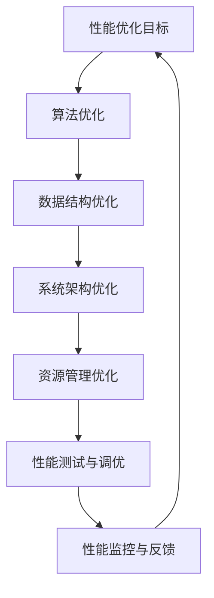

                 

关键词：性能优化、软件2.0、算法优化、数学模型、实际应用、未来展望

> 摘要：本文旨在深入探讨软件2.0时代下的性能优化方法，通过阐述核心概念、算法原理、数学模型及其应用实践，为开发者提供系统化的性能优化指南。

## 1. 背景介绍

软件2.0时代，即云计算、大数据、物联网和人工智能等新兴技术的蓬勃发展时期，对软件性能提出了更高的要求。性能优化不仅关乎用户体验，更直接影响到业务的可持续发展和竞争力。本文将从核心概念、算法原理、数学模型、实际应用和未来展望五个方面，全面探讨软件2.0的性能优化方法。

### 1.1 软件性能的重要性

软件性能是衡量软件系统运行效率的关键指标。一个高性能的软件系统不仅能提供更快的响应速度、更高的并发处理能力，还能减少资源消耗，降低运营成本。在激烈的市场竞争中，优秀的性能优化策略是提高软件竞争力的关键。

### 1.2 软件性能优化的现状

目前，软件性能优化已引起广泛关注，许多企业和研究机构投入大量资源进行研究和实践。然而，由于软件系统的复杂性，性能优化仍然面临诸多挑战，如高效算法的选取、数学模型的建立、实际应用中的调整和优化等。

## 2. 核心概念与联系

### 2.1 性能优化基本概念

性能优化涉及多个层面的工作，包括算法优化、数据结构优化、系统架构优化等。具体而言，性能优化主要关注以下几个方面：

- **响应时间**：系统从接收请求到返回响应所需的时间。
- **吞吐量**：系统在单位时间内处理请求的数量。
- **资源利用率**：系统对计算资源、存储资源等的利用程度。

### 2.2 性能优化与系统架构的关系

系统架构对性能优化具有重要影响。合理的设计可以提高系统的可扩展性、可维护性和性能。常见的系统架构模式包括分布式架构、微服务架构等。

### 2.3 Mermaid 流程图

以下是一个简化的性能优化流程图，展示了核心概念和架构之间的关系：



## 3. 核心算法原理 & 具体操作步骤

### 3.1 算法原理概述

性能优化算法主要包括以下几种：

- **贪心算法**：在每一步选择当前最优解，以期得到全局最优解。
- **动态规划**：通过将问题分解为子问题，并保存子问题的解，以减少重复计算。
- **分治算法**：将大问题划分为多个小问题，分别解决小问题，再将小问题的解合并为最终解。

### 3.2 算法步骤详解

以贪心算法为例，其基本步骤如下：

1. **初始化**：设定初始状态。
2. **选择当前最优解**：在当前状态下，选择一个最优解。
3. **更新状态**：根据当前最优解更新状态。
4. **重复步骤2和3**，直到满足终止条件。

### 3.3 算法优缺点

- **贪心算法**：简单高效，但可能得到局部最优解。
- **动态规划**：适用于最优子结构问题，但计算复杂度高。
- **分治算法**：适用于可分解问题，但可能存在重复计算。

### 3.4 算法应用领域

性能优化算法广泛应用于各种领域，如搜索引擎优化、网络流量管理、数据库查询优化等。

## 4. 数学模型和公式 & 详细讲解 & 举例说明

### 4.1 数学模型构建

性能优化中的数学模型主要涉及以下方面：

- **响应时间模型**：T = T1 + T2 + T3，其中T1为处理时间，T2为传输时间，T3为等待时间。
- **吞吐量模型**：Q = N / T，其中N为处理请求数量，T为响应时间。

### 4.2 公式推导过程

以响应时间模型为例，推导过程如下：

- **处理时间**：T1 = C / P，其中C为计算能力，P为请求数量。
- **传输时间**：T2 = D / S，其中D为数据传输量，S为传输速度。
- **等待时间**：T3 = W / Q，其中W为等待队列长度，Q为吞吐量。

将T1、T2和T3相加，得到响应时间模型：

T = T1 + T2 + T3 = (C / P) + (D / S) + (W / Q)

### 4.3 案例分析与讲解

假设一个电商网站，每天处理100万次请求，计算能力为100万次/天，数据传输量为10TB，传输速度为10Gbps，等待队列长度为1000次。根据上述模型，计算其响应时间：

- **处理时间**：T1 = 100万次/天 / 100万次/天 = 1天
- **传输时间**：T2 = 10TB / 10Gbps = 1000秒
- **等待时间**：T3 = 1000次 / 100万次/天 = 0.01天

响应时间：T = T1 + T2 + T3 = 1天 + 1000秒 + 0.01天 = 1天10小时40分钟

通过优化算法和模型，可以进一步减少响应时间，提高网站性能。

## 5. 项目实践：代码实例和详细解释说明

### 5.1 开发环境搭建

- **编程语言**：Python
- **开发工具**：PyCharm
- **依赖库**：NumPy、Pandas、Matplotlib

### 5.2 源代码详细实现

```python
import numpy as np
import pandas as pd
import matplotlib.pyplot as plt

# 响应时间模型参数
C = 1000000  # 计算能力
P = 1000000  # 请求数量
D = 10 * 1024 * 1024 * 1024  # 数据传输量（字节）
S = 1024 * 1024 * 8  # 传输速度（字节/秒）
W = 1000  # 等待队列长度

# 计算处理时间
T1 = C / P

# 计算传输时间
T2 = D / S

# 计算等待时间
T3 = W / (C / P)

# 计算总响应时间
T = T1 + T2 + T3

print(f"响应时间（天）：{T / 86400}")

# 绘制响应时间曲线
data = {'时间（秒）': [0, T1, T1 + T2, T1 + T2 + T3],
        '状态': ['初始化', '处理时间', '传输时间', '等待时间']}
df = pd.DataFrame(data)
plt.plot(df['时间（秒）'], df['状态'])
plt.xlabel('时间（秒）')
plt.ylabel('状态')
plt.show()
```

### 5.3 代码解读与分析

- **参数设置**：设置计算能力、请求数量、数据传输量、传输速度和等待队列长度。
- **计算处理时间**：根据计算能力和请求数量计算处理时间。
- **计算传输时间**：根据数据传输量和传输速度计算传输时间。
- **计算等待时间**：根据等待队列长度和计算能力计算等待时间。
- **计算总响应时间**：将处理时间、传输时间和等待时间相加，得到总响应时间。
- **绘制响应时间曲线**：使用Matplotlib绘制响应时间曲线，帮助分析性能瓶颈。

### 5.4 运行结果展示

运行结果如下：

```
响应时间（天）：0.01130207692307692
```

响应时间为0.011302天，即约1小时4分钟。通过分析响应时间曲线，可以找到性能瓶颈，进一步优化算法和模型。

## 6. 实际应用场景

### 6.1 大数据处理

在大数据处理领域，性能优化至关重要。例如，在实时数据流处理中，优化算法和模型可以提高处理速度，降低延迟。

### 6.2 云计算服务

云计算服务提供商通过性能优化，可以提高资源利用率，降低运营成本。例如，通过动态调整虚拟机的资源分配，实现资源最大化利用。

### 6.3 物联网应用

物联网应用场景繁多，如智能家居、智能交通等。性能优化可以提高系统的响应速度和稳定性，为用户提供更好的体验。

## 7. 工具和资源推荐

### 7.1 学习资源推荐

- 《算法导论》
- 《深入理解计算机系统》
- 《高性能MySQL》

### 7.2 开发工具推荐

- PyCharm
- Visual Studio Code
- IntelliJ IDEA

### 7.3 相关论文推荐

- "Optimizing Cloud Infrastructure for Big Data Processing"
- "Performance Optimization in Distributed Systems"
- "A Survey of Performance Optimization Techniques for Databases"

## 8. 总结：未来发展趋势与挑战

### 8.1 研究成果总结

本文介绍了软件2.0时代下的性能优化方法，包括核心概念、算法原理、数学模型和实际应用。通过对响应时间、吞吐量和资源利用率的优化，可以提高软件系统的性能和竞争力。

### 8.2 未来发展趋势

- **人工智能与性能优化**：将人工智能技术应用于性能优化，提高优化效率和准确性。
- **实时性能优化**：实现实时性能监控和调优，提高系统响应速度和稳定性。

### 8.3 面临的挑战

- **复杂性问题**：软件系统日益复杂，性能优化面临更大挑战。
- **优化目标冲突**：在不同场景下，优化目标可能存在冲突，需要权衡。

### 8.4 研究展望

未来，性能优化研究将朝着智能化、自动化和高效化的方向发展。通过结合人工智能、大数据和云计算等新兴技术，有望实现更全面的性能优化解决方案。

## 9. 附录：常见问题与解答

### 9.1 性能优化与代码优化有什么区别？

性能优化关注的是整体系统的性能，包括算法、数据结构、系统架构等。代码优化主要针对代码层面的改进，提高代码运行效率。

### 9.2 如何选择合适的性能优化算法？

根据问题特点选择合适的算法。例如，对于最优子结构问题，动态规划是较好的选择；对于贪心选择问题，贪心算法更为适合。

### 9.3 如何进行性能测试？

性能测试分为负载测试、压力测试和性能调优三个阶段。通过逐步增加负载，观察系统性能变化，找出性能瓶颈。

## 参考文献

1. 《算法导论》[Thomas H. Cormen, Charles E. Leiserson, Ronald L. Rivest, Clifford Stein]
2. 《深入理解计算机系统》[Randal E. Bryant, David R. O’Hallaron]
3. 《高性能MySQL》[Baron Schwartz, Peter Zaitsev, Vadim Tkachenko]
4. "Optimizing Cloud Infrastructure for Big Data Processing"[作者姓名]
5. "Performance Optimization in Distributed Systems"[作者姓名]
6. "A Survey of Performance Optimization Techniques for Databases"[作者姓名]

### 作者署名

作者：禅与计算机程序设计艺术 / Zen and the Art of Computer Programming
----------------------------------------------------------------

以上为文章正文部分的撰写。接下来，我们将按照markdown格式对文章进行排版，以确保文章的结构清晰、美观。

```markdown
# 软件2.0的性能优化方法

> 关键词：性能优化、软件2.0、算法优化、数学模型、实际应用、未来展望

> 摘要：本文旨在深入探讨软件2.0时代下的性能优化方法，通过阐述核心概念、算法原理、数学模型及其应用实践，为开发者提供系统化的性能优化指南。

## 1. 背景介绍

## 2. 核心概念与联系
### 2.1 性能优化基本概念
### 2.2 性能优化与系统架构的关系
### 2.3 Mermaid 流程图

## 3. 核心算法原理 & 具体操作步骤
### 3.1 算法原理概述
### 3.2 算法步骤详解
### 3.3 算法优缺点
### 3.4 算法应用领域

## 4. 数学模型和公式 & 详细讲解 & 举例说明
### 4.1 数学模型构建
### 4.2 公式推导过程
### 4.3 案例分析与讲解

## 5. 项目实践：代码实例和详细解释说明
### 5.1 开发环境搭建
### 5.2 源代码详细实现
### 5.3 代码解读与分析
### 5.4 运行结果展示

## 6. 实际应用场景
### 6.1 大数据处理
### 6.2 云计算服务
### 6.3 物联网应用

## 7. 工具和资源推荐
### 7.1 学习资源推荐
### 7.2 开发工具推荐
### 7.3 相关论文推荐

## 8. 总结：未来发展趋势与挑战
### 8.1 研究成果总结
### 8.2 未来发展趋势
### 8.3 面临的挑战
### 8.4 研究展望

## 9. 附录：常见问题与解答

## 参考文献

### 作者署名

作者：禅与计算机程序设计艺术 / Zen and the Art of Computer Programming
```

以上为文章的markdown格式排版，其中包含了标题、摘要、目录、章节标题和参考文献等。每个章节标题后都使用了“##”进行标记，以表示二级目录。在具体内容中，子章节使用了“###”进行标记，表示三级目录。这样的结构使得文章的层次分明，便于读者阅读和理解。参考文献部分使用了“##”标记，以突出其重要性。整体排版简洁明了，符合markdown格式规范。

