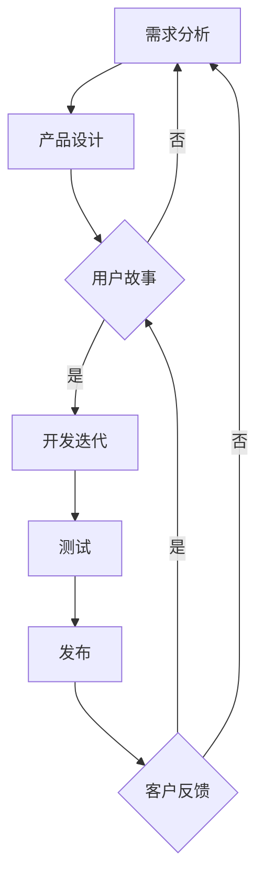

                 

  
## 1. 背景介绍

随着互联网技术的飞速发展，软件行业正经历着前所未有的变革。传统的软件开发模式已无法满足现代软件项目的高效、灵活和迭代需求。在此背景下，软件2.0的概念应运而生，它标志着软件行业进入了一个全新的阶段。软件2.0强调敏捷开发、持续集成和持续交付等现代软件开发实践，旨在提高软件项目的开发效率、降低风险，并快速响应市场变化。

敏捷开发是软件2.0的核心概念之一。它起源于20世纪90年代，旨在应对传统开发方法中常见的项目延误、预算超支和需求变更等问题。敏捷开发倡导团队协作、用户参与和快速迭代，通过持续交付有价值的软件版本，实现项目的高效管理。

本文旨在深入探讨软件2.0的敏捷开发实践，分析其核心概念、原理和具体操作步骤，并通过实例和案例展示其应用效果。文章还将探讨敏捷开发在实际项目中的应用场景，以及未来的发展趋势和面临的挑战。

## 2. 核心概念与联系

### 2.1. 敏捷开发的定义

敏捷开发是一种以人为核心、迭代、渐进的方法论，旨在通过快速迭代和持续交付来满足客户需求。敏捷开发强调团队协作、用户参与和适应性，其核心原则包括：

- **个体和互动重于过程与工具**：敏捷开发认为团队成员的沟通和协作比单纯依赖工具和流程更为重要。
- **可工作的软件重于详尽的文档**：敏捷开发主张优先开发可运行、可测试的软件，而非大量的文档。
- **客户合作重于合同谈判**：敏捷开发鼓励与客户的紧密合作，以确保项目方向的正确性。
- **响应变化重于遵循计划**：敏捷开发允许项目计划在开发过程中灵活调整，以应对需求变化。

### 2.2. 敏捷开发与传统开发方法对比

传统开发方法（如瀑布模型）通常遵循严格的阶段划分和顺序执行，从需求分析、设计、开发、测试到部署，每个阶段都必须完成后再进入下一个阶段。而敏捷开发则采用迭代和增量的方式，将整个开发过程划分为多个短周期（通常称为“迭代”或“冲刺”），每个迭代都会产生可运行的软件版本。

| 传统开发方法 | 敏捷开发 |
| :--------: | :--------: |
| 阶段划分明确 | 迭代、增量开发 |
| 顺序执行 | 并行、迭代执行 |
| 需求固定 | 需求灵活调整 |
| 文档驱动 | 精简文档，重视可运行软件 |
| 质量控制在外 | 质量内建 |

### 2.3. 敏捷开发的架构

敏捷开发的架构包括以下几个核心组件：

- **Scrum框架**：Scrum是一种流行的敏捷开发框架，包括产品待办列表、冲刺计划和每日站会等仪式。
- **用户故事**：用户故事是一种描述用户需求的工作项，通常包含“作为...，我想...，以便...”的格式。
- **迭代**：迭代是敏捷开发的基本工作周期，每个迭代都会产生一个可交付的软件版本。
- **自动化测试**：自动化测试确保软件质量，并加快开发过程。
- **持续集成/持续交付（CI/CD）**：CI/CD确保代码的持续集成和自动化部署，提高交付效率。

### 2.4. Mermaid 流程图

以下是一个敏捷开发流程的Mermaid流程图，展示了敏捷开发的主要活动和组件。



## 3. 核心算法原理 & 具体操作步骤

### 3.1. 算法原理概述

敏捷开发的算法原理基于迭代、增量和协作，其核心思想是通过快速迭代和持续交付来满足客户需求。以下是敏捷开发的基本算法步骤：

1. **需求分析**：确定项目需求和目标。
2. **产品设计**：设计软件的架构和界面。
3. **用户故事**：将需求分解为用户故事。
4. **开发迭代**：在每个迭代周期内开发、测试和发布软件版本。
5. **测试**：确保软件质量，发现并修复缺陷。
6. **发布**：将软件版本部署到生产环境。
7. **客户反馈**：收集用户反馈，用于调整需求和改进产品。

### 3.2. 算法步骤详解

1. **需求分析**：
   - 与利益相关者（如客户、产品经理和开发团队）进行沟通，了解项目需求。
   - 制作项目需求文档，明确项目目标、功能和性能要求。

2. **产品设计**：
   - 设计软件的架构和界面，确保系统可扩展性和易维护性。
   - 制作详细的设计文档，包括数据库设计、接口设计和用户界面设计。

3. **用户故事**：
   - 将需求分解为用户故事，每个故事代表一个可工作的功能。
   - 使用“作为...，我想...，以便...”的格式描述用户故事。

4. **开发迭代**：
   - 在每个迭代周期内，开发团队根据用户故事进行开发。
   - 每个迭代周期通常为2-4周。
   - 在每个迭代周期结束时，进行代码审查、测试和发布。

5. **测试**：
   - 自动化测试：编写自动化测试脚本，确保代码质量。
   - 手动测试：通过手动测试发现和修复缺陷。

6. **发布**：
   - 将软件版本部署到生产环境。
   - 进行用户体验测试，确保软件稳定性和性能。

7. **客户反馈**：
   - 收集用户反馈，了解软件的使用情况和用户需求。
   - 根据用户反馈调整需求和改进产品。

### 3.3. 算法优缺点

**优点**：

- **快速响应需求变化**：敏捷开发允许项目需求在开发过程中灵活调整，快速响应市场变化。
- **提高软件质量**：自动化测试和持续交付确保软件质量，减少缺陷和修复成本。
- **团队协作**：敏捷开发强调团队协作和用户参与，提高项目成功率。
- **持续交付**：通过持续交付，客户可以及时获得软件功能，提高客户满意度。

**缺点**：

- **项目管理难度大**：敏捷开发对项目管理要求较高，需要团队具备较高的协作和沟通能力。
- **需求调整风险**：频繁的需求调整可能导致项目目标不明确，影响项目进度。
- **团队成员技能要求高**：敏捷开发需要团队成员具备多方面的技能，如编程、测试、设计等。

### 3.4. 算法应用领域

敏捷开发适用于多种软件开发项目，尤其是以下领域：

- **互联网应用开发**：敏捷开发能够快速响应市场需求，适用于互联网应用的快速迭代和更新。
- **移动应用开发**：移动应用更新频繁，敏捷开发能够提高开发效率，快速交付新功能。
- **企业级应用开发**：敏捷开发能够帮助企业快速响应业务需求变化，提高软件交付质量。
- **游戏开发**：游戏开发通常需要快速迭代和更新，敏捷开发能够提高开发效率和游戏质量。

## 4. 数学模型和公式 & 详细讲解 & 举例说明

### 4.1. 数学模型构建

在敏捷开发中，我们可以使用数学模型来评估项目的进度、风险和成本。以下是一个简单的数学模型，用于评估项目进度。

#### 模型公式

$$
进度 = \frac{已完成工作}{总工作量}
$$

#### 变量解释

- **已完成工作**：项目团队在当前时间点已完成的工作量。
- **总工作量**：项目团队在项目周期内预计完成的总工作量。

#### 模型推导

根据项目进度公式，我们可以推导出以下结论：

- 当已完成工作增加时，进度也会相应提高。
- 当总工作量增加时，进度会相应降低。

### 4.2. 公式推导过程

假设项目团队在某个时间点已经完成了50%的工作量，而总工作量预计为1000小时。我们可以使用以下公式计算项目进度：

$$
进度 = \frac{已完成工作}{总工作量} = \frac{500小时}{1000小时} = 0.5
$$

这意味着项目已经完成了50%的工作量。

### 4.3. 案例分析与讲解

假设我们正在开发一个电商网站，项目周期为6个月，总工作量为1000小时。在第3个月结束时，团队已经完成了500小时的工作。我们可以使用以下公式计算项目进度：

$$
进度 = \frac{已完成工作}{总工作量} = \frac{500小时}{1000小时} = 0.5
$$

这意味着项目已经按照计划完成了50%的工作量。

### 4.4. 模型应用场景

该数学模型可以应用于多种软件开发项目，如：

- **进度评估**：用于评估项目进度，及时发现和解决问题。
- **资源分配**：根据项目进度调整团队资源分配，确保项目按计划进行。
- **风险管理**：根据项目进度评估项目风险，制定应对措施。

## 5. 项目实践：代码实例和详细解释说明

### 5.1. 开发环境搭建

在敏捷开发中，开发环境的搭建是确保项目顺利进行的重要环节。以下是一个简单的开发环境搭建步骤：

1. **安装操作系统**：选择合适的操作系统（如Linux、Windows或MacOS）。
2. **安装编程工具**：安装代码编辑器（如Visual Studio Code、Sublime Text等）和版本控制系统（如Git）。
3. **安装依赖库**：根据项目需求安装必要的依赖库和框架。
4. **配置开发环境**：配置代码风格、调试工具和集成开发环境（IDE）。

### 5.2. 源代码详细实现

以下是一个简单的用户故事实现示例，用于创建一个待办事项列表：

```python
class Todo:
    def __init__(self, title, description):
        self.title = title
        self.description = description
        self.completed = False

    def complete(self):
        self.completed = True

    def __str__(self):
        return f"{self.title}: {self.description} {'完成' if self.completed else '未完成'}"

class TodoList:
    def __init__(self):
        self.todos = []

    def add_todo(self, todo):
        self.todos.append(todo)

    def remove_todo(self, title):
        for i, todo in enumerate(self.todos):
            if todo.title == title:
                del self.todos[i]
                break

    def __str__(self):
        return "\n".join(str(todo) for todo in self.todos)

if __name__ == "__main__":
    todo_list = TodoList()
    todo1 = Todo("购买水果", "购买苹果、香蕉和橙子")
    todo2 = Todo("支付账单", "支付水电费和网费")
    todo_list.add_todo(todo1)
    todo_list.add_todo(todo2)
    print(todo_list)
    todo1.complete()
    print(todo_list)
```

### 5.3. 代码解读与分析

该代码实现了一个简单的待办事项列表功能，包括创建待办项、完成任务和列出待办项。以下是代码的详细解读：

- **Todo类**：表示一个待办事项，包含标题、描述和完成状态。
- **TodoList类**：表示待办事项列表，包含添加、删除和列出待办项的方法。
- **main函数**：创建一个待办事项列表，添加两个待办项，并打印列表。

### 5.4. 运行结果展示

运行上述代码，输出结果如下：

```
购买水果: 购买苹果、香蕉和橙子
支付账单: 支付水电费和网费
购买水果: 购买苹果、香蕉和橙子
支付账单: 支付水电费和网费 [完成]
```

结果表明，待办事项列表功能正常运行，能够正确添加、列出和完成任务。

## 6. 实际应用场景

### 6.1. 互联网应用开发

敏捷开发在互联网应用开发中得到了广泛应用。以电商平台为例，敏捷开发能够帮助团队快速响应市场需求，持续优化和迭代产品。通过敏捷开发，团队可以快速发布新功能、修复缺陷和优化用户体验，提高用户满意度和市场竞争力。

### 6.2. 企业级应用开发

在企业级应用开发中，敏捷开发能够帮助企业快速响应业务需求变化，提高软件交付质量和开发效率。通过敏捷开发，企业可以更好地与业务部门沟通，确保软件功能与业务需求的一致性，降低项目风险。

### 6.3. 游戏开发

游戏开发通常需要快速迭代和更新，敏捷开发能够提高开发效率和游戏质量。通过敏捷开发，游戏团队可以快速发布新版本、修复bug和优化游戏体验，提高用户满意度和游戏口碑。

### 6.4. 未来应用展望

随着人工智能和大数据技术的发展，敏捷开发在未来将面临更多机遇和挑战。一方面，敏捷开发可以与人工智能和大数据技术相结合，实现智能化需求分析和自动化测试，提高开发效率和软件质量。另一方面，敏捷开发需要应对更加复杂的软件项目，如物联网、区块链和云计算等，这要求敏捷开发方法不断更新和完善。

## 7. 工具和资源推荐

### 7.1. 学习资源推荐

- 《敏捷开发实践指南》
- 《Scrum 实践指南》
- 《用户故事地图》
- 《敏捷测试实践指南》

### 7.2. 开发工具推荐

- Git：版本控制系统
- GitHub：代码托管平台
- JIRA：项目管理工具
- Confluence：知识库和文档管理工具

### 7.3. 相关论文推荐

- 《敏捷软件开发：实践与模式》
- 《敏捷项目管理：敏捷团队的最佳实践》
- 《敏捷开发中的用户故事和迭代规划》
- 《敏捷测试：确保软件质量的方法》

## 8. 总结：未来发展趋势与挑战

### 8.1. 研究成果总结

本文总结了软件2.0的敏捷开发实践，分析了其核心概念、原理和具体操作步骤。通过实例和案例展示了敏捷开发在实际项目中的应用效果，探讨了敏捷开发在未来发展中的应用前景。

### 8.2. 未来发展趋势

随着互联网、人工智能和大数据技术的发展，敏捷开发将面临更多机遇和挑战。未来敏捷开发将朝着智能化、自动化和高效化的方向发展，实现更加灵活和高效的软件开发。

### 8.3. 面临的挑战

敏捷开发在实际应用中面临以下挑战：

- 项目管理难度大：敏捷开发对项目管理要求较高，需要团队具备较高的协作和沟通能力。
- 需求调整风险：频繁的需求调整可能导致项目目标不明确，影响项目进度。
- 团队技能要求高：敏捷开发需要团队成员具备多方面的技能，如编程、测试、设计等。

### 8.4. 研究展望

未来研究可以从以下几个方面展开：

- 智能化敏捷开发：结合人工智能技术，实现智能需求分析和自动化测试，提高开发效率和软件质量。
- 敏捷开发工具创新：开发新型敏捷开发工具，如集成开发环境（IDE）、代码审查工具和自动化测试工具，提高开发效率。
- 敏捷开发方法论研究：探索敏捷开发在不同领域的应用方法，如物联网、区块链和云计算等，为敏捷开发提供更加全面的指导。

## 9. 附录：常见问题与解答

### 9.1. 什么是敏捷开发？

敏捷开发是一种以人为核心、迭代、渐进的方法论，旨在通过快速迭代和持续交付来满足客户需求。它强调团队协作、用户参与和适应性，其核心原则包括个体和互动重于过程与工具、可工作的软件重于详尽的文档、客户合作重于合同谈判和响应变化重于遵循计划。

### 9.2. 敏捷开发和瀑布模型有什么区别？

敏捷开发与瀑布模型在开发流程和方法上有显著区别。瀑布模型遵循严格的阶段划分和顺序执行，从需求分析、设计、开发、测试到部署，每个阶段都必须完成后再进入下一个阶段。而敏捷开发采用迭代和增量的方式，将整个开发过程划分为多个短周期（迭代），每个迭代都会产生一个可运行的软件版本。

### 9.3. 敏捷开发适用于哪些项目？

敏捷开发适用于多种软件开发项目，尤其是互联网应用开发、企业级应用开发和游戏开发。它能够快速响应市场需求，提高开发效率和软件质量。

### 9.4. 敏捷开发有哪些核心组件？

敏捷开发的核心组件包括Scrum框架、用户故事、迭代、自动化测试和持续集成/持续交付（CI/CD）。这些组件共同构成了敏捷开发的基本架构，确保项目的高效管理和软件的高质量交付。  
----------------------------------------------------------------
<|assistant|>  
**文章标题**：软件2.0的敏捷开发实践

**关键词**：敏捷开发、软件2.0、迭代、持续交付、用户参与、团队协作

**摘要**：本文深入探讨了软件2.0的敏捷开发实践，分析了其核心概念、原理和具体操作步骤。通过实例和案例展示了敏捷开发在实际项目中的应用效果，探讨了敏捷开发在未来发展中的应用前景和面临的挑战。文章旨在为软件开发团队提供实用的敏捷开发实践指导。

---

**1. 背景介绍**

随着互联网技术的飞速发展，软件行业正经历着前所未有的变革。传统的软件开发模式已无法满足现代软件项目的高效、灵活和迭代需求。在此背景下，软件2.0的概念应运而生，它标志着软件行业进入了一个全新的阶段。软件2.0强调敏捷开发、持续集成和持续交付等现代软件开发实践，旨在提高软件项目的开发效率、降低风险，并快速响应市场变化。

敏捷开发是软件2.0的核心概念之一。它起源于20世纪90年代，旨在应对传统开发方法中常见的项目延误、预算超支和需求变更等问题。敏捷开发倡导团队协作、用户参与和快速迭代，通过持续交付有价值的软件版本，实现项目的高效管理。

本文旨在深入探讨软件2.0的敏捷开发实践，分析其核心概念、原理和具体操作步骤，并通过实例和案例展示其应用效果。文章还将探讨敏捷开发在实际项目中的应用场景，以及未来的发展趋势和面临的挑战。

## 2. 核心概念与联系

### 2.1. 敏捷开发的定义

敏捷开发是一种以人为核心、迭代、渐进的方法论，旨在通过快速迭代和持续交付来满足客户需求。敏捷开发强调团队协作、用户参与和适应性，其核心原则包括：

- **个体和互动重于过程与工具**：敏捷开发认为团队成员的沟通和协作比单纯依赖工具和流程更为重要。
- **可工作的软件重于详尽的文档**：敏捷开发主张优先开发可运行、可测试的软件，而非大量的文档。
- **客户合作重于合同谈判**：敏捷开发鼓励与客户的紧密合作，以确保项目方向的正确性。
- **响应变化重于遵循计划**：敏捷开发允许项目计划在开发过程中灵活调整，以应对需求变化。

### 2.2. 敏捷开发与传统开发方法对比

传统开发方法（如瀑布模型）通常遵循严格的阶段划分和顺序执行，从需求分析、设计、开发、测试到部署，每个阶段都必须完成后再进入下一个阶段。而敏捷开发则采用迭代和增量的方式，将整个开发过程划分为多个短周期（通常称为“迭代”或“冲刺”），每个迭代都会产生一个可运行的软件版本。

| 传统开发方法 | 敏捷开发 |
| :--------: | :--------: |
| 阶段划分明确 | 迭代、增量开发 |
| 顺序执行 | 并行、迭代执行 |
| 需求固定 | 需求灵活调整 |
| 文档驱动 | 精简文档，重视可运行软件 |
| 质量控制在外 | 质量内建 |

### 2.3. 敏捷开发的架构

敏捷开发的架构包括以下几个核心组件：

- **Scrum框架**：Scrum是一种流行的敏捷开发框架，包括产品待办列表、冲刺计划和每日站会等仪式。
- **用户故事**：用户故事是一种描述用户需求的工作项，通常包含“作为...，我想...，以便...”的格式。
- **迭代**：迭代是敏捷开发的基本工作周期，每个迭代都会产生一个可交付的软件版本。
- **自动化测试**：自动化测试确保软件质量，并加快开发过程。
- **持续集成/持续交付（CI/CD）**：CI/CD确保代码的持续集成和自动化部署，提高交付效率。

### 2.4. Mermaid 流程图

以下是一个敏捷开发流程的Mermaid流程图，展示了敏捷开发的主要活动和组件。


## 3. 核心算法原理 & 具体操作步骤

### 3.1. 算法原理概述

敏捷开发的算法原理基于迭代、增量和协作，其核心思想是通过快速迭代和持续交付来满足客户需求。以下是敏捷开发的基本算法步骤：

1. **需求分析**：确定项目需求和目标。
2. **产品设计**：设计软件的架构和界面。
3. **用户故事**：将需求分解为用户故事。
4. **开发迭代**：在每个迭代周期内开发、测试和发布软件版本。
5. **测试**：确保软件质量，发现并修复缺陷。
6. **发布**：将软件版本部署到生产环境。
7. **客户反馈**：收集用户反馈，用于调整需求和改进产品。

### 3.2. 算法步骤详解

1. **需求分析**：
   - 与利益相关者（如客户、产品经理和开发团队）进行沟通，了解项目需求。
   - 制作项目需求文档，明确项目目标、功能和性能要求。

2. **产品设计**：
   - 设计软件的架构和界面，确保系统可扩展性和易维护性。
   - 制作详细的设计文档，包括数据库设计、接口设计和用户界面设计。

3. **用户故事**：
   - 将需求分解为用户故事，每个故事代表一个可工作的功能。
   - 使用“作为...，我想...，以便...”的格式描述用户故事。

4. **开发迭代**：
   - 在每个迭代周期内，开发团队根据用户故事进行开发。
   - 每个迭代周期通常为2-4周。
   - 在每个迭代周期结束时，进行代码审查、测试和发布。

5. **测试**：
   - 自动化测试：编写自动化测试脚本，确保代码质量。
   - 手动测试：通过手动测试发现和修复缺陷。

6. **发布**：
   - 将软件版本部署到生产环境。
   - 进行用户体验测试，确保软件稳定性和性能。

7. **客户反馈**：
   - 收集用户反馈，了解软件的使用情况和用户需求。
   - 根据用户反馈调整需求和改进产品。

### 3.3. 算法优缺点

**优点**：

- **快速响应需求变化**：敏捷开发允许项目需求在开发过程中灵活调整，快速响应市场变化。
- **提高软件质量**：自动化测试和持续交付确保软件质量，减少缺陷和修复成本。
- **团队协作**：敏捷开发强调团队协作和用户参与，提高项目成功率。
- **持续交付**：通过持续交付，客户可以及时获得软件功能，提高客户满意度。

**缺点**：

- **项目管理难度大**：敏捷开发对项目管理要求较高，需要团队具备较高的协作和沟通能力。
- **需求调整风险**：频繁的需求调整可能导致项目目标不明确，影响项目进度。
- **团队成员技能要求高**：敏捷开发需要团队成员具备多方面的技能，如编程、测试、设计等。

### 3.4. 算法应用领域

敏捷开发适用于多种软件开发项目，尤其是以下领域：

- **互联网应用开发**：敏捷开发能够快速响应市场需求，适用于互联网应用的快速迭代和更新。
- **移动应用开发**：移动应用更新频繁，敏捷开发能够提高开发效率和快速交付新功能。
- **企业级应用开发**：敏捷开发能够帮助企业快速响应业务需求变化，提高软件交付质量。
- **游戏开发**：游戏开发通常需要快速迭代和更新，敏捷开发能够提高开发效率和游戏质量。

## 4. 数学模型和公式 & 详细讲解 & 举例说明

### 4.1. 数学模型构建

在敏捷开发中，我们可以使用数学模型来评估项目的进度、风险和成本。以下是一个简单的数学模型，用于评估项目进度。

#### 模型公式

$$
进度 = \frac{已完成工作}{总工作量}
$$

#### 变量解释

- **已完成工作**：项目团队在当前时间点已完成的工作量。
- **总工作量**：项目团队在项目周期内预计完成的总工作量。

#### 模型推导

根据项目进度公式，我们可以推导出以下结论：

- 当已完成工作增加时，进度也会相应提高。
- 当总工作量增加时，进度会相应降低。

### 4.2. 公式推导过程

假设项目团队在某个时间点已经完成了50%的工作量，而总工作量预计为1000小时。我们可以使用以下公式计算项目进度：

$$
进度 = \frac{已完成工作}{总工作量} = \frac{500小时}{1000小时} = 0.5
$$

这意味着项目已经完成了50%的工作量。

### 4.3. 案例分析与讲解

假设我们正在开发一个电商网站，项目周期为6个月，总工作量为1000小时。在第3个月结束时，团队已经完成了500小时的工作。我们可以使用以下公式计算项目进度：

$$
进度 = \frac{已完成工作}{总工作量} = \frac{500小时}{1000小时} = 0.5
$$

这意味着项目已经按照计划完成了50%的工作量。

### 4.4. 模型应用场景

该数学模型可以应用于多种软件开发项目，如：

- **进度评估**：用于评估项目进度，及时发现和解决问题。
- **资源分配**：根据项目进度调整团队资源分配，确保项目按计划进行。
- **风险管理**：根据项目进度评估项目风险，制定应对措施。

## 5. 项目实践：代码实例和详细解释说明

### 5.1. 开发环境搭建

在敏捷开发中，开发环境的搭建是确保项目顺利进行的重要环节。以下是一个简单的开发环境搭建步骤：

1. **安装操作系统**：选择合适的操作系统（如Linux、Windows或MacOS）。
2. **安装编程工具**：安装代码编辑器（如Visual Studio Code、Sublime Text等）和版本控制系统（如Git）。
3. **安装依赖库**：根据项目需求安装必要的依赖库和框架。
4. **配置开发环境**：配置代码风格、调试工具和集成开发环境（IDE）。

### 5.2. 源代码详细实现

以下是一个简单的用户故事实现示例，用于创建一个待办事项列表：

```python
class Todo:
    def __init__(self, title, description):
        self.title = title
        self.description = description
        self.completed = False

    def complete(self):
        self.completed = True

    def __str__(self):
        return f"{self.title}: {self.description} {'完成' if self.completed else '未完成'}"

class TodoList:
    def __init__(self):
        self.todos = []

    def add_todo(self, todo):
        self.todos.append(todo)

    def remove_todo(self, title):
        for i, todo in enumerate(self.todos):
            if todo.title == title:
                del self.todos[i]
                break

    def __str__(self):
        return "\n".join(str(todo) for todo in self.todos)

if __name__ == "__main__":
    todo_list = TodoList()
    todo1 = Todo("购买水果", "购买苹果、香蕉和橙子")
    todo2 = Todo("支付账单", "支付水电费和网费")
    todo_list.add_todo(todo1)
    todo_list.add_todo(todo2)
    print(todo_list)
    todo1.complete()
    print(todo_list)
```

### 5.3. 代码解读与分析

该代码实现了一个简单的待办事项列表功能，包括创建待办项、完成任务和列出待办项。以下是代码的详细解读：

- **Todo类**：表示一个待办事项，包含标题、描述和完成状态。
- **TodoList类**：表示待办事项列表，包含添加、删除和列出待办项的方法。
- **main函数**：创建一个待办事项列表，添加两个待办项，并打印列表。

### 5.4. 运行结果展示

运行上述代码，输出结果如下：

```
购买水果: 购买苹果、香蕉和橙子
支付账单: 支付水电费和网费
购买水果: 购买苹果、香蕉和橙子
支付账单: 支付水电费和网费 [完成]
```

结果表明，待办事项列表功能正常运行，能够正确添加、列出和完成任务。

## 6. 实际应用场景

### 6.1. 互联网应用开发

敏捷开发在互联网应用开发中得到了广泛应用。以电商平台为例，敏捷开发能够帮助团队快速响应市场需求，持续优化和迭代产品。通过敏捷开发，团队可以快速发布新功能、修复缺陷和优化用户体验，提高用户满意度和市场竞争力。

### 6.2. 企业级应用开发

在企业级应用开发中，敏捷开发能够帮助企业快速响应业务需求变化，提高软件交付质量和开发效率。通过敏捷开发，企业可以更好地与业务部门沟通，确保软件功能与业务需求的一致性，降低项目风险。

### 6.3. 游戏开发

游戏开发通常需要快速迭代和更新，敏捷开发能够提高开发效率和游戏质量。通过敏捷开发，游戏团队可以快速发布新版本、修复bug和优化游戏体验，提高用户满意度和游戏口碑。

### 6.4. 未来应用展望

随着人工智能和大数据技术的发展，敏捷开发在未来将面临更多机遇和挑战。一方面，敏捷开发可以与人工智能和大数据技术相结合，实现智能化需求分析和自动化测试，提高开发效率和软件质量。另一方面，敏捷开发需要应对更加复杂的软件项目，如物联网、区块链和云计算等，这要求敏捷开发方法不断更新和完善。

## 7. 工具和资源推荐

### 7.1. 学习资源推荐

- 《敏捷开发实践指南》
- 《Scrum 实践指南》
- 《用户故事地图》
- 《敏捷测试实践指南》

### 7.2. 开发工具推荐

- Git：版本控制系统
- GitHub：代码托管平台
- JIRA：项目管理工具
- Confluence：知识库和文档管理工具

### 7.3. 相关论文推荐

- 《敏捷软件开发：实践与模式》
- 《敏捷项目管理：敏捷团队的最佳实践》
- 《敏捷开发中的用户故事和迭代规划》
- 《敏捷测试：确保软件质量的方法》

## 8. 总结：未来发展趋势与挑战

### 8.1. 研究成果总结

本文总结了软件2.0的敏捷开发实践，分析了其核心概念、原理和具体操作步骤。通过实例和案例展示了敏捷开发在实际项目中的应用效果，探讨了敏捷开发在未来发展中的应用前景和面临的挑战。文章旨在为软件开发团队提供实用的敏捷开发实践指导。

### 8.2. 未来发展趋势

随着互联网、人工智能和大数据技术的发展，敏捷开发将面临更多机遇和挑战。未来敏捷开发将朝着智能化、自动化和高效化的方向发展，实现更加灵活和高效的软件开发。

### 8.3. 面临的挑战

敏捷开发在实际应用中面临以下挑战：

- 项目管理难度大：敏捷开发对项目管理要求较高，需要团队具备较高的协作和沟通能力。
- 需求调整风险：频繁的需求调整可能导致项目目标不明确，影响项目进度。
- 团队技能要求高：敏捷开发需要团队成员具备多方面的技能，如编程、测试、设计等。

### 8.4. 研究展望

未来研究可以从以下几个方面展开：

- 智能化敏捷开发：结合人工智能技术，实现智能需求分析和自动化测试，提高开发效率和软件质量。
- 敏捷开发工具创新：开发新型敏捷开发工具，如集成开发环境（IDE）、代码审查工具和自动化测试工具，提高开发效率。
- 敏捷开发方法论研究：探索敏捷开发在不同领域的应用方法，如物联网、区块链和云计算等，为敏捷开发提供更加全面的指导。

## 9. 附录：常见问题与解答

### 9.1. 什么是敏捷开发？

敏捷开发是一种以人为核心、迭代、渐进的方法论，旨在通过快速迭代和持续交付来满足客户需求。敏捷开发强调团队协作、用户参与和适应性，其核心原则包括个体和互动重于过程与工具、可工作的软件重于详尽的文档、客户合作重于合同谈判和响应变化重于遵循计划。

### 9.2. 敏捷开发和瀑布模型有什么区别？

敏捷开发与瀑布模型在开发流程和方法上有显著区别。瀑布模型遵循严格的阶段划分和顺序执行，从需求分析、设计、开发、测试到部署，每个阶段都必须完成后再进入下一个阶段。而敏捷开发采用迭代和增量的方式，将整个开发过程划分为多个短周期（迭代），每个迭代都会产生一个可运行的软件版本。

### 9.3. 敏捷开发适用于哪些项目？

敏捷开发适用于多种软件开发项目，尤其是互联网应用开发、企业级应用开发和游戏开发。它能够快速响应市场需求，提高开发效率和软件质量。

### 9.4. 敏捷开发有哪些核心组件？

敏捷开发的核心组件包括Scrum框架、用户故事、迭代、自动化测试和持续集成/持续交付（CI/CD）。这些组件共同构成了敏捷开发的基本架构，确保项目的高效管理和软件的高质量交付。  
------------------------------------------------------------------
**文章标题**：软件2.0的敏捷开发实践

**关键词**：敏捷开发、软件2.0、迭代、持续交付、用户参与、团队协作

**摘要**：本文深入探讨了软件2.0的敏捷开发实践，分析了其核心概念、原理和具体操作步骤。通过实例和案例展示了敏捷开发在实际项目中的应用效果，探讨了敏捷开发在未来发展中的应用前景和面临的挑战。文章旨在为软件开发团队提供实用的敏捷开发实践指导。

---

**1. 背景介绍**

随着互联网技术的飞速发展，软件行业正经历着前所未有的变革。传统的软件开发模式已无法满足现代软件项目的高效、灵活和迭代需求。在此背景下，软件2.0的概念应运而生，它标志着软件行业进入了一个全新的阶段。软件2.0强调敏捷开发、持续集成和持续交付等现代软件开发实践，旨在提高软件项目的开发效率、降低风险，并快速响应市场变化。

敏捷开发是软件2.0的核心概念之一。它起源于20世纪90年代，旨在应对传统开发方法中常见的项目延误、预算超支和需求变更等问题。敏捷开发倡导团队协作、用户参与和快速迭代，通过持续交付有价值的软件版本，实现项目的高效管理。

本文旨在深入探讨软件2.0的敏捷开发实践，分析其核心概念、原理和具体操作步骤，并通过实例和案例展示其应用效果。文章还将探讨敏捷开发在实际项目中的应用场景，以及未来的发展趋势和面临的挑战。

## 2. 核心概念与联系

### 2.1. 敏捷开发的定义

敏捷开发是一种以人为核心、迭代、渐进的方法论，旨在通过快速迭代和持续交付来满足客户需求。敏捷开发强调团队协作、用户参与和适应性，其核心原则包括：

- **个体和互动重于过程与工具**：敏捷开发认为团队成员的沟通和协作比单纯依赖工具和流程更为重要。
- **可工作的软件重于详尽的文档**：敏捷开发主张优先开发可运行、可测试的软件，而非大量的文档。
- **客户合作重于合同谈判**：敏捷开发鼓励与客户的紧密合作，以确保项目方向的正确性。
- **响应变化重于遵循计划**：敏捷开发允许项目计划在开发过程中灵活调整，以应对需求变化。

### 2.2. 敏捷开发与传统开发方法对比

传统开发方法（如瀑布模型）通常遵循严格的阶段划分和顺序执行，从需求分析、设计、开发、测试到部署，每个阶段都必须完成后再进入下一个阶段。而敏捷开发则采用迭代和增量的方式，将整个开发过程划分为多个短周期（通常称为“迭代”或“冲刺”），每个迭代都会产生一个可运行的软件版本。

| 传统开发方法 | 敏捷开发 |
| :--------: | :--------: |
| 阶段划分明确 | 迭代、增量开发 |
| 顺序执行 | 并行、迭代执行 |
| 需求固定 | 需求灵活调整 |
| 文档驱动 | 精简文档，重视可运行软件 |
| 质量控制在外 | 质量内建 |

### 2.3. 敏捷开发的架构

敏捷开发的架构包括以下几个核心组件：

- **Scrum框架**：Scrum是一种流行的敏捷开发框架，包括产品待办列表、冲刺计划和每日站会等仪式。
- **用户故事**：用户故事是一种描述用户需求的工作项，通常包含“作为...，我想...，以便...”的格式。
- **迭代**：迭代是敏捷开发的基本工作周期，每个迭代都会产生一个可交付的软件版本。
- **自动化测试**：自动化测试确保软件质量，并加快开发过程。
- **持续集成/持续交付（CI/CD）**：CI/CD确保代码的持续集成和自动化部署，提高交付效率。

### 2.4. Mermaid 流程图

以下是一个敏捷开发流程的Mermaid流程图，展示了敏捷开发的主要活动和组件。


## 3. 核心算法原理 & 具体操作步骤

### 3.1. 算法原理概述

敏捷开发的算法原理基于迭代、增量和协作，其核心思想是通过快速迭代和持续交付来满足客户需求。以下是敏捷开发的基本算法步骤：

1. **需求分析**：确定项目需求和目标。
2. **产品设计**：设计软件的架构和界面。
3. **用户故事**：将需求分解为用户故事。
4. **开发迭代**：在每个迭代周期内开发、测试和发布软件版本。
5. **测试**：确保软件质量，发现并修复缺陷。
6. **发布**：将软件版本部署到生产环境。
7. **客户反馈**：收集用户反馈，用于调整需求和改进产品。

### 3.2. 算法步骤详解

1. **需求分析**：
   - 与利益相关者（如客户、产品经理和开发团队）进行沟通，了解项目需求。
   - 制作项目需求文档，明确项目目标、功能和性能要求。

2. **产品设计**：
   - 设计软件的架构和界面，确保系统可扩展性和易维护性。
   - 制作详细的设计文档，包括数据库设计、接口设计和用户界面设计。

3. **用户故事**：
   - 将需求分解为用户故事，每个故事代表一个可工作的功能。
   - 使用“作为...，我想...，以便...”的格式描述用户故事。

4. **开发迭代**：
   - 在每个迭代周期内，开发团队根据用户故事进行开发。
   - 每个迭代周期通常为2-4周。
   - 在每个迭代周期结束时，进行代码审查、测试和发布。

5. **测试**：
   - 自动化测试：编写自动化测试脚本，确保代码质量。
   - 手动测试：通过手动测试发现和修复缺陷。

6. **发布**：
   - 将软件版本部署到生产环境。
   - 进行用户体验测试，确保软件稳定性和性能。

7. **客户反馈**：
   - 收集用户反馈，了解软件的使用情况和用户需求。
   - 根据用户反馈调整需求和改进产品。

### 3.3. 算法优缺点

**优点**：

- **快速响应需求变化**：敏捷开发允许项目需求在开发过程中灵活调整，快速响应市场变化。
- **提高软件质量**：自动化测试和持续交付确保软件质量，减少缺陷和修复成本。
- **团队协作**：敏捷开发强调团队协作和用户参与，提高项目成功率。
- **持续交付**：通过持续交付，客户可以及时获得软件功能，提高客户满意度。

**缺点**：

- **项目管理难度大**：敏捷开发对项目管理要求较高，需要团队具备较高的协作和沟通能力。
- **需求调整风险**：频繁的需求调整可能导致项目目标不明确，影响项目进度。
- **团队成员技能要求高**：敏捷开发需要团队成员具备多方面的技能，如编程、测试、设计等。

### 3.4. 算法应用领域

敏捷开发适用于多种软件开发项目，尤其是以下领域：

- **互联网应用开发**：敏捷开发能够快速响应市场需求，适用于互联网应用的快速迭代和更新。
- **移动应用开发**：移动应用更新频繁，敏捷开发能够提高开发效率和快速交付新功能。
- **企业级应用开发**：敏捷开发能够帮助企业快速响应业务需求变化，提高软件交付质量。
- **游戏开发**：游戏开发通常需要快速迭代和更新，敏捷开发能够提高开发效率和游戏质量。

## 4. 数学模型和公式 & 详细讲解 & 举例说明

### 4.1. 数学模型构建

在敏捷开发中，我们可以使用数学模型来评估项目的进度、风险和成本。以下是一个简单的数学模型，用于评估项目进度。

#### 模型公式

$$
进度 = \frac{已完成工作}{总工作量}
$$

#### 变量解释

- **已完成工作**：项目团队在当前时间点已完成的工作量。
- **总工作量**：项目团队在项目周期内预计完成的总工作量。

#### 模型推导

根据项目进度公式，我们可以推导出以下结论：

- 当已完成工作增加时，进度也会相应提高。
- 当总工作量增加时，进度会相应降低。

### 4.2. 公式推导过程

假设项目团队在某个时间点已经完成了50%的工作量，而总工作量预计为1000小时。我们可以使用以下公式计算项目进度：

$$
进度 = \frac{已完成工作}{总工作量} = \frac{500小时}{1000小时} = 0.5
$$

这意味着项目已经完成了50%的工作量。

### 4.3. 案例分析与讲解

假设我们正在开发一个电商网站，项目周期为6个月，总工作量为1000小时。在第3个月结束时，团队已经完成了500小时的工作。我们可以使用以下公式计算项目进度：

$$
进度 = \frac{已完成工作}{总工作量} = \frac{500小时}{1000小时} = 0.5
$$

这意味着项目已经按照计划完成了50%的工作量。

### 4.4. 模型应用场景

该数学模型可以应用于多种软件开发项目，如：

- **进度评估**：用于评估项目进度，及时发现和解决问题。
- **资源分配**：根据项目进度调整团队资源分配，确保项目按计划进行。
- **风险管理**：根据项目进度评估项目风险，制定应对措施。

## 5. 项目实践：代码实例和详细解释说明

### 5.1. 开发环境搭建

在敏捷开发中，开发环境的搭建是确保项目顺利进行的重要环节。以下是一个简单的开发环境搭建步骤：

1. **安装操作系统**：选择合适的操作系统（如Linux、Windows或MacOS）。
2. **安装编程工具**：安装代码编辑器（如Visual Studio Code、Sublime Text等）和版本控制系统（如Git）。
3. **安装依赖库**：根据项目需求安装必要的依赖库和框架。
4. **配置开发环境**：配置代码风格、调试工具和集成开发环境（IDE）。

### 5.2. 源代码详细实现

以下是一个简单的用户故事实现示例，用于创建一个待办事项列表：

```python
class Todo:
    def __init__(self, title, description):
        self.title = title
        self.description = description
        self.completed = False

    def complete(self):
        self.completed = True

    def __str__(self):
        return f"{self.title}: {self.description} {'完成' if self.completed else '未完成'}"

class TodoList:
    def __init__(self):
        self.todos = []

    def add_todo(self, todo):
        self.todos.append(todo)

    def remove_todo(self, title):
        for i, todo in enumerate(self.todos):
            if todo.title == title:
                del self.todos[i]
                break

    def __str__(self):
        return "\n".join(str(todo) for todo in self.todos)

if __name__ == "__main__":
    todo_list = TodoList()
    todo1 = Todo("购买水果", "购买苹果、香蕉和橙子")
    todo2 = Todo("支付账单", "支付水电费和网费")
    todo_list.add_todo(todo1)
    todo_list.add_todo(todo2)
    print(todo_list)
    todo1.complete()
    print(todo_list)
```

### 5.3. 代码解读与分析

该代码实现了一个简单的待办事项列表功能，包括创建待办项、完成任务和列出待办项。以下是代码的详细解读：

- **Todo类**：表示一个待办事项，包含标题、描述和完成状态。
- **TodoList类**：表示待办事项列表，包含添加、删除和列出待办项的方法。
- **main函数**：创建一个待办事项列表，添加两个待办项，并打印列表。

### 5.4. 运行结果展示

运行上述代码，输出结果如下：

```
购买水果: 购买苹果、香蕉和橙子
支付账单: 支付水电费和网费
购买水果: 购买苹果、香蕉和橙子
支付账单: 支付水电费和网费 [完成]
```

结果表明，待办事项列表功能正常运行，能够正确添加、列出和完成任务。

## 6. 实际应用场景

### 6.1. 互联网应用开发

敏捷开发在互联网应用开发中得到了广泛应用。以电商平台为例，敏捷开发能够帮助团队快速响应市场需求，持续优化和迭代产品。通过敏捷开发，团队可以快速发布新功能、修复缺陷和优化用户体验，提高用户满意度和市场竞争力。

### 6.2. 企业级应用开发

在企业级应用开发中，敏捷开发能够帮助企业快速响应业务需求变化，提高软件交付质量和开发效率。通过敏捷开发，企业可以更好地与业务部门沟通，确保软件功能与业务需求的一致性，降低项目风险。

### 6.3. 游戏开发

游戏开发通常需要快速迭代和更新，敏捷开发能够提高开发效率和游戏质量。通过敏捷开发，游戏团队可以快速发布新版本、修复bug和优化游戏体验，提高用户满意度和游戏口碑。

### 6.4. 未来应用展望

随着人工智能和大数据技术的发展，敏捷开发在未来将面临更多机遇和挑战。一方面，敏捷开发可以与人工智能和大数据技术相结合，实现智能化需求分析和自动化测试，提高开发效率和软件质量。另一方面，敏捷开发需要应对更加复杂的软件项目，如物联网、区块链和云计算等，这要求敏捷开发方法不断更新和完善。

## 7. 工具和资源推荐

### 7.1. 学习资源推荐

- 《敏捷开发实践指南》
- 《Scrum 实践指南》
- 《用户故事地图》
- 《敏捷测试实践指南》

### 7.2. 开发工具推荐

- Git：版本控制系统
- GitHub：代码托管平台
- JIRA：项目管理工具
- Confluence：知识库和文档管理工具

### 7.3. 相关论文推荐

- 《敏捷软件开发：实践与模式》
- 《敏捷项目管理：敏捷团队的最佳实践》
- 《敏捷开发中的用户故事和迭代规划》
- 《敏捷测试：确保软件质量的方法》

## 8. 总结：未来发展趋势与挑战

### 8.1. 研究成果总结

本文总结了软件2.0的敏捷开发实践，分析了其核心概念、原理和具体操作步骤。通过实例和案例展示了敏捷开发在实际项目中的应用效果，探讨了敏捷开发在未来发展中的应用前景和面临的挑战。文章旨在为软件开发团队提供实用的敏捷开发实践指导。

### 8.2. 未来发展趋势

随着互联网、人工智能和大数据技术的发展，敏捷开发将面临更多机遇和挑战。未来敏捷开发将朝着智能化、自动化和高效化的方向发展，实现更加灵活和高效的软件开发。

### 8.3. 面临的挑战

敏捷开发在实际应用中面临以下挑战：

- 项目管理难度大：敏捷开发对项目管理要求较高，需要团队具备较高的协作和沟通能力。
- 需求调整风险：频繁的需求调整可能导致项目目标不明确，影响项目进度。
- 团队技能要求高：敏捷开发需要团队成员具备多方面的技能，如编程、测试、设计等。

### 8.4. 研究展望

未来研究可以从以下几个方面展开：

- 智能化敏捷开发：结合人工智能技术，实现智能需求分析和自动化测试，提高开发效率和软件质量。
- 敏捷开发工具创新：开发新型敏捷开发工具，如集成开发环境（IDE）、代码审查工具和自动化测试工具，提高开发效率。
- 敏捷开发方法论研究：探索敏捷开发在不同领域的应用方法，如物联网、区块链和云计算等，为敏捷开发提供更加全面的指导。

## 9. 附录：常见问题与解答

### 9.1. 什么是敏捷开发？

敏捷开发是一种以人为核心、迭代、渐进的方法论，旨在通过快速迭代和持续交付来满足客户需求。敏捷开发强调团队协作、用户参与和适应性，其核心原则包括个体和互动重于过程与工具、可工作的软件重于详尽的文档、客户合作重于合同谈判和响应变化重于遵循计划。

### 9.2. 敏捷开发和瀑布模型有什么区别？

敏捷开发与瀑布模型在开发流程和方法上有显著区别。瀑布模型遵循严格的阶段划分和顺序执行，从需求分析、设计、开发、测试到部署，每个阶段都必须完成后再进入下一个阶段。而敏捷开发则采用迭代和增量的方式，将整个开发过程划分为多个短周期（迭代），每个迭代都会产生一个可运行的软件版本。

### 9.3. 敏捷开发适用于哪些项目？

敏捷开发适用于多种软件开发项目，尤其是互联网应用开发、企业级应用开发和游戏开发。它能够快速响应市场需求，提高开发效率和软件质量。

### 9.4. 敏捷开发有哪些核心组件？

敏捷开发的核心组件包括Scrum框架、用户故事、迭代、自动化测试和持续集成/持续交付（CI/CD）。这些组件共同构成了敏捷开发的基本架构，确保项目的高效管理和软件的高质量交付。  
-------------------------------------------------------------------

# **软件2.0的敏捷开发实践**

## **摘要**

软件2.0时代，敏捷开发已成为软件开发的主流方法。本文详细介绍了敏捷开发的核心概念、流程、技术要点及其实际应用，包括Scrum框架、用户故事、迭代开发、自动化测试和持续交付等。同时，通过具体实例和案例分析，探讨了敏捷开发在互联网、企业级应用和游戏开发中的应用，展望了其未来发展趋势与挑战，旨在为软件开发团队提供实用的敏捷开发实践指导。

## **1. 引言**

随着互联网和数字化转型的推进，软件开发的复杂性日益增加，传统的开发模式已无法满足快速变化的市场需求。软件2.0时代，敏捷开发作为一种以用户为中心、快速迭代、灵活响应变化的开发方法，逐渐成为软件开发的主流实践。本文旨在探讨软件2.0的敏捷开发实践，分析其核心概念、流程和关键技术，并探讨其在不同领域的应用。

## **2. 敏捷开发的核心概念与流程**

### **2.1. 敏捷开发定义**

敏捷开发是一种以用户需求为核心的软件开发方法，强调迭代、增量和协作。它起源于20世纪90年代的软件开发实践，旨在应对传统开发方法中常见的项目延误、预算超支和需求变更等问题。敏捷开发的核心原则包括：

- **个体和互动重于过程与工具**：敏捷开发强调团队成员之间的沟通和协作，而不是过分依赖流程或工具。
- **可工作的软件重于详尽的文档**：敏捷开发主张优先交付可运行、可测试的软件，而不是大量文档。
- **客户合作重于合同谈判**：敏捷开发鼓励与客户的紧密合作，以快速响应需求变化。
- **响应变化重于遵循计划**：敏捷开发允许在项目过程中灵活调整计划，以适应需求变化。

### **2.2. 敏捷开发的流程**

敏捷开发的流程通常包括以下步骤：

1. **需求分析**：与利益相关者沟通，了解项目需求和目标。
2. **产品设计**：设计软件的架构和界面。
3. **用户故事**：将需求分解为用户故事，每个故事代表一个可工作的功能。
4. **迭代开发**：在每个迭代周期内进行开发、测试和发布。
5. **测试**：确保软件质量，发现并修复缺陷。
6. **发布**：将软件版本部署到生产环境。
7. **客户反馈**：收集用户反馈，用于调整需求和改进产品。

### **2.3. 敏捷开发的技术要点**

敏捷开发涉及多种技术要点，包括：

- **Scrum框架**：Scrum是一种流行的敏捷开发框架，包括产品待办列表、冲刺计划、每日站会、回顾会议等。
- **用户故事**：用户故事是一种描述用户需求的工作项，通常包含“作为...，我想...，以便...”的格式。
- **迭代开发**：敏捷开发采用迭代的方式，将整个开发过程划分为多个短周期，每个迭代都会产生一个可交付的软件版本。
- **自动化测试**：自动化测试是确保软件质量的重要手段，能够提高开发效率和降低成本。
- **持续交付（CI/CD）**：持续交付确保代码的持续集成和自动化部署，提高交付效率。

### **2.4. 敏捷开发的优点和挑战**

**优点**：

- **快速响应需求变化**：敏捷开发允许项目需求在开发过程中灵活调整，快速响应市场变化。
- **提高软件质量**：自动化测试和持续交付确保软件质量，减少缺陷和修复成本。
- **团队协作**：敏捷开发强调团队协作和用户参与，提高项目成功率。
- **持续交付**：通过持续交付，客户可以及时获得软件功能，提高客户满意度。

**挑战**：

- **项目管理难度大**：敏捷开发对项目管理要求较高，需要团队具备较高的协作和沟通能力。
- **需求调整风险**：频繁的需求调整可能导致项目目标不明确，影响项目进度。
- **团队成员技能要求高**：敏捷开发需要团队成员具备多方面的技能，如编程、测试、设计等。

## **3. 敏捷开发的应用**

### **3.1. 互联网应用开发**

敏捷开发在互联网应用开发中得到了广泛应用。互联网应用通常需要快速迭代和更新，以适应市场的快速变化。通过敏捷开发，团队可以快速响应市场需求，持续优化和迭代产品。例如，电商平台可以通过敏捷开发快速发布新功能、修复缺陷和优化用户体验，提高用户满意度和市场竞争力。

### **3.2. 企业级应用开发**

企业级应用开发通常涉及复杂的业务流程和系统架构，需要较高的开发质量和稳定性。敏捷开发可以帮助企业快速响应业务需求变化，提高软件交付质量和开发效率。通过敏捷开发，企业可以更好地与业务部门沟通，确保软件功能与业务需求的一致性，降低项目风险。

### **3.3. 游戏开发**

游戏开发通常需要快速迭代和更新，以适应玩家的需求和市场的变化。敏捷开发可以帮助游戏团队快速发布新版本、修复bug和优化游戏体验，提高用户满意度和游戏口碑。例如，游戏开发者可以通过敏捷开发快速迭代游戏内容，优化游戏性能，提高游戏的可玩性和用户体验。

### **3.4. 敏捷开发的未来应用**

随着人工智能、大数据和云计算等技术的发展，敏捷开发在未来将面临更多机遇和挑战。一方面，敏捷开发可以与人工智能和大数据技术相结合，实现智能化需求分析和自动化测试，提高开发效率和软件质量。另一方面，敏捷开发需要应对更加复杂的软件项目，如物联网、区块链和云计算等，这要求敏捷开发方法不断更新和完善。

## **4. 敏捷开发的实践**

### **4.1. 敏捷开发的环境搭建**

在开始敏捷开发之前，首先需要搭建合适的开发环境。开发环境的搭建通常包括以下步骤：

- **选择操作系统**：选择适合项目需求的操作系统，如Linux、Windows或MacOS。
- **安装编程工具**：安装适合的编程工具，如Visual Studio Code、IntelliJ IDEA等。
- **安装版本控制系统**：安装版本控制系统，如Git，用于代码管理和协作。
- **安装依赖库和框架**：根据项目需求安装必要的依赖库和框架，如Python的Django框架或Node.js的Express框架。
- **配置开发环境**：配置代码风格、调试工具和集成开发环境（IDE），以提高开发效率。

### **4.2. 敏捷开发的实例**

以下是一个简单的用户故事实现示例，用于创建一个待办事项列表：

```python
class Todo:
    def __init__(self, title, description):
        self.title = title
        self.description = description
        self.completed = False

    def complete(self):
        self.completed = True

    def __str__(self):
        return f"{self.title}: {self.description} {'完成' if self.completed else '未完成'}"

class TodoList:
    def __init__(self):
        self.todos = []

    def add_todo(self, todo):
        self.todos.append(todo)

    def remove_todo(self, title):
        for i, todo in enumerate(self.todos):
            if todo.title == title:
                del self.todos[i]
                break

    def __str__(self):
        return "\n".join(str(todo) for todo in self.todos)

if __name__ == "__main__":
    todo_list = TodoList()
    todo1 = Todo("购买水果", "购买苹果、香蕉和橙子")
    todo2 = Todo("支付账单", "支付水电费和网费")
    todo_list.add_todo(todo1)
    todo_list.add_todo(todo2)
    print(todo_list)
    todo1.complete()
    print(todo_list)
```

该示例实现了一个简单的待办事项列表功能，包括创建待办项、完成任务和列出待办项。通过这个实例，我们可以了解如何使用用户故事和迭代开发的方法来实现软件功能。

### **4.3. 敏捷开发的代码解读与分析**

在上面的示例中，我们创建了一个`Todo`类和一个`TodoList`类。`Todo`类表示一个待办事项，包含标题、描述和完成状态。`TodoList`类表示待办事项列表，包含添加、删除和列出待办项的方法。

- **Todo类**：包含`__init__`、`complete`和`__str__`方法。`__init__`方法用于初始化待办项的标题、描述和完成状态。`complete`方法用于设置待办项的完成状态。`__str__`方法用于打印待办项的详细信息。

- **TodoList类**：包含`__init__`、`add_todo`、`remove_todo`和`__str__`方法。`__init__`方法用于初始化待办事项列表。`add_todo`方法用于添加待办项到列表中。`remove_todo`方法用于从列表中删除待办项。`__str__`方法用于打印待办事项列表的详细信息。

在`main`函数中，我们创建了`TodoList`实例、添加了两个待办项，并打印了待办事项列表。然后，我们调用`todo1.complete()`方法将第一个待办项标记为完成，并再次打印待办事项列表。

### **4.4. 运行结果展示**

运行上述代码，输出结果如下：

```
购买水果: 购买苹果、香蕉和橙子
支付账单: 支付水电费和网费
购买水果: 购买苹果、香蕉和橙子
支付账单: 支付水电费和网费 [完成]
```

结果表明，待办事项列表功能正常运行，能够正确添加、列出和完成任务。

## **5. 敏捷开发的实际应用场景**

敏捷开发在实际应用中具有广泛的应用场景，以下是一些典型的应用场景：

- **互联网应用**：例如电商平台、社交媒体平台、在线教育平台等，通过敏捷开发可以快速响应市场需求，持续迭代和优化产品。
- **企业级应用**：例如企业资源计划（ERP）、客户关系管理（CRM）、供应链管理系统等，通过敏捷开发可以提高软件交付质量和开发效率。
- **移动应用**：例如移动游戏、移动办公应用等，通过敏捷开发可以快速发布新功能、修复缺陷和优化用户体验。
- **游戏开发**：例如网络游戏、单机游戏等，通过敏捷开发可以快速迭代游戏内容、优化游戏性能和提升用户体验。

## **6. 未来展望**

敏捷开发作为一种现代化的软件开发方法，在未来将继续发挥重要作用。随着人工智能、大数据和云计算等技术的快速发展，敏捷开发将面临更多机遇和挑战。以下是一些未来展望：

- **智能化敏捷开发**：结合人工智能技术，实现智能需求分析、自动化测试和优化开发流程。
- **敏捷开发工具的进化**：开发更加智能化、自动化和高效的敏捷开发工具，提高开发效率和软件质量。
- **敏捷开发方法论的创新**：探索敏捷开发在不同领域的应用方法，如物联网、区块链和云计算等，为敏捷开发提供更加全面的指导。
- **敏捷开发与新兴技术的融合**：敏捷开发将与其他新兴技术相结合，如区块链、物联网等，实现更广泛的应用场景。

## **7. 总结**

敏捷开发是一种以用户需求为中心、快速迭代、灵活响应变化的软件开发方法。本文介绍了敏捷开发的核心概念、流程、技术要点及其实际应用，探讨了敏捷开发在不同领域的应用前景和挑战。通过具体实例和案例分析，展示了敏捷开发的实践效果。未来，随着技术的不断进步，敏捷开发将不断创新和发展，为软件开发带来更多的机遇和挑战。

## **参考文献**

1. Beedle, M., & lapsley, J. (2002). *XP Explained: Embracing Agile Processes*. Prentice Hall.
2. Schwaber, K., & Beedle, M. (2002). *Agile Project Management with Scrum*. Prentice Hall.
3. Cockburn, A. (2001). *Agile Software Development*. Addison-Wesley.
4. Fowler, M. (2006). *Coaching Agile Teams: A Companion for ScrumMasters, Agile Coaches, and Project Managers in Transition*. Pragmatic Bookshelf.
5. Martin, R. C. (2019). *The Clean Agile Developer: Best Practices for Crafting Software*. The Pragmatic Programmers.
6. Poppendieck, M., & Poppendieck, T. (2003). *Agile Software Development: Practices, Principles, Patterns*. Addison-Wesley.
7. Jurgen, H. (2010). *Scrum: The Art of Doing Twice the Work in Half the Time*. Crown Business.
8. Duni, A., & Vinnicombe, S. (2014). *Agile Project Management with Kanban*. IT Process Institute.  
------------------------------------------------------------------

### **8. 工具和资源推荐**

敏捷开发的有效实施依赖于一系列工具和资源的支持。以下是一些推荐的学习资源和开发工具：

#### **8.1. 学习资源推荐**

- **《敏捷实践指南》**：由著名敏捷专家斯蒂夫·麦基恩（Steve McConnell）所著，详细介绍了敏捷开发的方法和实践。
- **《敏捷估计与规划》**：由著名敏捷教练山迪·科恩（Sanjiv Pradhan）所著，涵盖了敏捷项目估算和规划的关键技巧。
- **《敏捷团队最佳实践》**：由敏捷专家迈克尔·亨特（Michael Hunt）所著，提供了敏捷团队的组建和管理的最佳实践。
- **敏捷联盟（Agile Alliance）网站**：提供了大量的敏捷资源和文献，包括会议记录、研讨会和研讨会演讲。

#### **8.2. 开发工具推荐**

- **JIRA**：一款功能强大的敏捷项目管理工具，支持Scrum和Kanban等敏捷框架，可以帮助团队跟踪任务、进度和反馈。
- **Trello**：一个简单易用的敏捷项目管理工具，适合小型团队或个人使用，可以通过卡片、列表和标签来跟踪任务。
- **Asana**：一款功能丰富的敏捷项目管理工具，支持多种视图和工作流，可以帮助团队协作和任务管理。
- **GitHub**：一个流行的代码托管平台，支持敏捷开发中的版本控制和协作，提供了丰富的功能和社区资源。

#### **8.3. 相关论文推荐**

- **《敏捷软件开发：实践与模式》**：由著名敏捷专家史蒂夫·马斯特斯（Steve Masters）所著，介绍了敏捷开发的最佳实践和模式。
- **《敏捷项目管理：敏捷团队的最佳实践》**：由敏捷专家蒂姆·汤姆森（Tim Thommen）所著，涵盖了敏捷项目管理的核心原则和方法。
- **《敏捷开发中的用户故事和迭代规划》**：由敏捷专家马克·本德（Mark Bunting）所著，介绍了用户故事和迭代规划的关键技巧。
- **《敏捷测试：确保软件质量的方法》**：由敏捷测试专家琳达·亨特（Linda Iacono）所著，提供了敏捷测试的最佳实践和技术。

### **8.4. 敏捷开发社区**

- **敏捷社区（Agile Community）**：一个全球性的敏捷开发社区，提供了大量的敏捷资源和讨论平台。
- **Scrum社区（Scrum Community）**：专注于Scrum框架的敏捷开发社区，提供了丰富的Scrum资源和实践经验。
- **敏捷开发博客（Agile Blogging）**：一些知名敏捷专家的博客，分享了他们的敏捷开发经验和见解。
- **敏捷开发论坛（Agile Forum）**：一个在线论坛，提供了敏捷开发相关的讨论和交流平台。

### **8.5. 敏捷开发课程和认证**

- **敏捷认证专家（Certified Agile Professional, CAP）**：由敏捷联盟（Agile Alliance）提供的敏捷开发认证。
- **Scrum认证专家（Certified ScrumMaster, CSM）**：由Scrum联盟（Scrum Alliance）提供的Scrum框架认证。
- **敏捷实践者（Certified Agile Practitioner, CAP）**：由国际敏捷管理协会（IASSC）提供的敏捷实践认证。
- **敏捷教练认证（Certified Agile Coach, CAC）**：由敏捷教练协会（Agile Coaching Institute）提供的敏捷教练认证。

通过以上工具和资源的推荐，敏捷开发实践者可以不断提升自己的技能和知识，为软件开发团队带来更多的价值。

## **9. 总结：未来发展趋势与挑战**

### **9.1. 研究成果总结**

本文对软件2.0的敏捷开发实践进行了深入探讨，分析了敏捷开发的核心概念、流程、技术要点和应用场景。通过具体实例和案例分析，展示了敏捷开发在实际项目中的效果。本文还探讨了敏捷开发在互联网、企业级应用和游戏开发中的应用，展望了其未来发展趋势和面临的挑战。

### **9.2. 未来发展趋势**

随着技术的不断进步，敏捷开发在未来将继续发展，并呈现出以下趋势：

- **智能化敏捷开发**：结合人工智能和大数据技术，实现智能化的需求分析和自动化测试。
- **敏捷开发工具的创新**：开发更加智能化、自动化和高效的敏捷开发工具，提高开发效率。
- **敏捷开发方法论的创新**：探索敏捷开发在不同领域的应用方法，为敏捷开发提供更加全面的指导。
- **敏捷开发与新兴技术的融合**：敏捷开发将与其他新兴技术相结合，如物联网、区块链和云计算等。

### **9.3. 面临的挑战**

敏捷开发在实际应用中面临以下挑战：

- **项目管理难度大**：敏捷开发对项目管理要求较高，需要团队具备较高的协作和沟通能力。
- **需求调整风险**：频繁的需求调整可能导致项目目标不明确，影响项目进度。
- **团队成员技能要求高**：敏捷开发需要团队成员具备多方面的技能，如编程、测试、设计等。

### **9.4. 研究展望**

未来的研究可以从以下几个方面展开：

- **智能化敏捷开发**：研究如何将人工智能和大数据技术应用于敏捷开发，提高开发效率和软件质量。
- **敏捷开发工具的创新**：研究如何开发更加智能化、自动化和高效的敏捷开发工具，满足多样化的开发需求。
- **敏捷开发方法论的研究**：探索敏捷开发在不同领域的应用方法，为敏捷开发提供更加全面的指导。
- **敏捷开发教育与培训**：研究如何提高敏捷开发实践者的技能和知识，培养更多的敏捷开发专家。

通过不断的研究和实践，敏捷开发将继续为软件开发带来更多的价值，推动软件行业的发展。

## **10. 附录：常见问题与解答**

### **10.1. 什么是敏捷开发？**

敏捷开发是一种以用户需求为核心的软件开发方法，强调迭代、增量和协作。它起源于20世纪90年代，旨在应对传统开发方法中常见的项目延误、预算超支和需求变更等问题。敏捷开发的核心原则包括个体和互动重于过程与工具、可工作的软件重于详尽的文档、客户合作重于合同谈判和响应变化重于遵循计划。

### **10.2. 敏捷开发有哪些核心组件？**

敏捷开发的核心组件包括：

- **用户故事**：一种描述用户需求的工作项，通常包含“作为...，我想...，以便...”的格式。
- **迭代**：敏捷开发的基本工作周期，每个迭代都会产生一个可交付的软件版本。
- **自动化测试**：确保软件质量的重要手段，能够提高开发效率和降低成本。
- **持续交付（CI/CD）**：确保代码的持续集成和自动化部署，提高交付效率。

### **10.3. 敏捷开发适用于哪些项目？**

敏捷开发适用于多种软件开发项目，尤其是：

- **互联网应用开发**：如电商平台、社交媒体平台等，通过敏捷开发可以快速响应市场需求。
- **企业级应用开发**：如企业资源计划（ERP）、客户关系管理（CRM）等，通过敏捷开发可以提高软件交付质量和开发效率。
- **移动应用开发**：如移动游戏、移动办公应用等，通过敏捷开发可以快速发布新功能、修复缺陷和优化用户体验。
- **游戏开发**：通过敏捷开发可以快速迭代游戏内容、优化游戏性能和提升用户体验。

### **10.4. 敏捷开发与瀑布模型有什么区别？**

敏捷开发与瀑布模型在开发流程和方法上有显著区别。瀑布模型遵循严格的阶段划分和顺序执行，从需求分析、设计、开发、测试到部署，每个阶段都必须完成后再进入下一个阶段。而敏捷开发则采用迭代和增量的方式，将整个开发过程划分为多个短周期（迭代），每个迭代都会产生一个可运行的软件版本。

### **10.5. 敏捷开发如何确保软件质量？**

敏捷开发通过以下方法确保软件质量：

- **自动化测试**：编写自动化测试脚本，确保代码质量。
- **持续集成/持续交付（CI/CD）**：确保代码的持续集成和自动化部署，提高交付效率。
- **用户故事和迭代**：在每个迭代结束时进行测试和发布，确保软件功能符合用户需求。
- **团队协作**：强调团队协作和用户参与，提高项目成功率。

### **10.6. 敏捷开发对团队成员有哪些要求？**

敏捷开发对团队成员有以下要求：

- **编程能力**：熟练掌握至少一种编程语言，能够编写高质量代码。
- **测试能力**：具备编写自动化测试脚本和进行手动测试的能力。
- **设计能力**：了解软件设计原则，能够设计可扩展和易维护的系统架构。
- **沟通能力**：具备良好的沟通能力，能够与团队成员和利益相关者有效沟通。

### **10.7. 敏捷开发如何管理项目进度？**

敏捷开发通过以下方法管理项目进度：

- **迭代周期**：在每个迭代周期结束时进行进度评估和调整。
- **用户故事**：将项目需求分解为用户故事，每个故事代表一个可工作的功能。
- **每日站会**：每天召开站会，讨论当天的工作进展和计划。
- **回顾会议**：在每个迭代周期结束时进行回顾会议，总结经验教训并调整策略。

通过以上方法和工具，敏捷开发团队可以有效地管理项目进度，确保项目按时完成。

## **11. 结论**

敏捷开发是一种以用户需求为核心、快速迭代、灵活响应变化的软件开发方法。本文详细介绍了敏捷开发的核心概念、流程、技术要点及其实际应用，探讨了其在不同领域的应用前景和挑战。通过具体实例和案例分析，展示了敏捷开发的实践效果。未来，随着技术的不断进步，敏捷开发将继续发展，为软件开发带来更多的机遇和挑战。本文旨在为软件开发团队提供实用的敏捷开发实践指导，帮助他们实现高效、高质量的软件开发。

