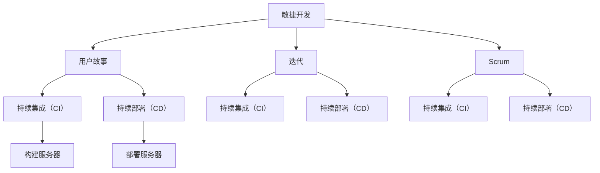

                 

关键词：软件2.0，风险管理，框架，安全性，可靠性，可维护性，敏捷性，可持续性，敏捷开发，风险管理工具，风险评估，风险缓解措施

> 摘要：本文旨在探讨软件2.0时代下的风险管理框架，分析其核心概念、核心算法原理，并结合具体案例和实践，详细讲解如何构建和管理软件项目的风险。文章还将探讨未来软件风险管理的发展趋势和挑战，为行业提供参考和指导。

## 1. 背景介绍

软件2.0时代，随着云计算、大数据、人工智能等技术的迅猛发展，软件系统变得越来越复杂。与此同时，软件系统的安全性、可靠性、可维护性和可持续性等风险也日益凸显。为了应对这些挑战，构建一个全面、有效的风险管理框架变得至关重要。本文将从以下几个方面展开讨论：

1. **核心概念与联系**：介绍软件2.0时代下的核心概念及其相互关系，如敏捷开发、DevOps、持续集成与持续部署（CI/CD）等。
2. **核心算法原理**：分析风险管理算法的原理和步骤，包括风险评估、风险缓解措施等。
3. **数学模型和公式**：构建风险管理中的数学模型，推导相关公式，并进行案例讲解。
4. **项目实践**：通过实际案例，展示如何搭建开发环境、实现源代码、解读与分析代码以及运行结果。
5. **实际应用场景**：分析软件风险管理在实际项目中的应用，探讨未来发展趋势和挑战。
6. **工具和资源推荐**：推荐相关学习资源、开发工具和论文，以供读者参考。
7. **总结与展望**：总结研究成果，展望未来发展趋势和挑战。

## 2. 核心概念与联系

### 2.1 敏捷开发

敏捷开发是一种以人为核心、迭代、增量的软件开发方法。它强调快速响应变化、持续交付有价值的软件，并注重团队协作和客户满意度。敏捷开发的核心理念包括：

- **用户故事**：用户故事是一种简短的描述，用于表达用户需求的功能或特性。
- **迭代**：迭代是一种周期性的开发过程，每个迭代都会产生一个可运行的软件版本。
- **Scrum**：Scrum是一种敏捷开发框架，通过每日站立会议、冲刺计划和回顾会议等环节，提高团队协作和沟通效率。

### 2.2 DevOps

DevOps是一种将软件开发（Software Development）和运维（Operations）相结合的方法。它强调开发与运维团队的合作，通过自动化工具和流程，实现持续集成、持续部署和持续交付。DevOps的核心概念包括：

- **持续集成（CI）**：持续集成是一种软件开发实践，通过将代码定期合并到主干分支，自动构建和测试，确保代码质量。
- **持续部署（CD）**：持续部署是一种自动化部署流程，通过自动化测试和部署，确保新版本软件的快速上线。
- **自动化测试**：自动化测试是一种通过编写脚本自动执行测试用例的方法，提高测试效率和覆盖率。

### 2.3 持续集成与持续部署（CI/CD）

持续集成与持续部署（CI/CD）是一种软件开发和部署的自动化流程。通过CI/CD，团队可以在短时间内发布新功能，并快速响应用户反馈。CI/CD的关键环节包括：

- **代码仓库**：代码仓库是存储和管理代码的集中地，支持多分支开发、代码审查和版本控制。
- **构建服务器**：构建服务器是一种自动化工具，用于构建、测试和打包代码。
- **部署服务器**：部署服务器是将代码部署到生产环境的服务器，支持自动化部署和回滚。

### 2.4 Mermaid流程图

为了更好地展示敏捷开发、DevOps和CI/CD之间的联系，我们可以使用Mermaid流程图进行描述。以下是相关的Mermaid代码：



生成的Mermaid流程图如下：


## 3. 核心算法原理 & 具体操作步骤

### 3.1 算法原理概述

风险管理是一种通过识别、评估和缓解项目风险，以确保项目成功的方法。在软件2.0时代，风险管理变得更加复杂，因为软件系统的规模和复杂性都在增加。本文采用以下核心算法原理进行风险管理：

1. **风险评估**：通过定量和定性方法，对项目风险进行识别和评估。
2. **风险缓解措施**：根据风险评估结果，制定相应的风险缓解措施，降低项目风险。
3. **风险监控与报告**：对项目风险进行持续监控，定期生成风险报告，以便团队及时了解项目风险状况。

### 3.2 算法步骤详解

#### 3.2.1 风险评估

风险评估是风险管理的第一步，主要包括以下步骤：

1. **风险识别**：识别项目中的潜在风险，如技术风险、市场风险、财务风险等。
2. **风险分析**：分析每个风险的发生概率和影响程度，以便进行优先级排序。
3. **风险评估**：根据风险分析结果，对每个风险进行定量和定性评估，确定风险等级。

#### 3.2.2 风险缓解措施

风险缓解措施是针对高风险项目制定的具体措施，以降低风险等级。以下是一些常见风险缓解措施：

1. **风险回避**：通过调整项目计划，避免高风险的活动。
2. **风险减轻**：通过优化设计和实施过程，降低风险发生概率或影响程度。
3. **风险转移**：通过购买保险或其他合同安排，将风险转移给第三方。
4. **风险接受**：对于无法避免或转移的风险，接受风险并制定相应的应急计划。

#### 3.2.3 风险监控与报告

风险监控与报告是确保风险管理持续有效的关键步骤，主要包括以下工作：

1. **定期监控**：定期对项目风险进行监控，确保风险缓解措施得到有效执行。
2. **风险报告**：定期生成风险报告，向项目团队和管理层提供项目风险状况的详细信息。

### 3.3 算法优缺点

#### 3.3.1 优点

1. **全面性**：算法涵盖了风险识别、评估、缓解和监控等各个环节，确保风险管理的全面性。
2. **灵活性**：算法允许根据项目特点和需求，调整风险评估和缓解措施，提高风险管理的灵活性。
3. **可操作性**：算法提供了详细的步骤和工具，使项目管理团队能够有效地实施风险管理。

#### 3.3.2 缺点

1. **复杂性**：算法涉及多个环节和步骤，可能导致实施过程复杂。
2. **依赖数据**：算法依赖于大量数据，如风险概率、影响程度等，数据质量直接影响风险评估的准确性。

### 3.4 算法应用领域

该算法适用于软件2.0时代下的各类项目，尤其适用于以下场景：

1. **大规模软件项目**：由于风险较多，需进行全面的风险管理。
2. **敏捷开发项目**：敏捷开发强调快速响应变化，风险管理有助于确保项目成功。
3. **跨部门项目**：跨部门项目涉及多个利益相关者，需有效协调和沟通。

## 4. 数学模型和公式 & 详细讲解 & 举例说明

### 4.1 数学模型构建

在风险管理中，我们通常使用以下数学模型：

1. **风险概率模型**：用于计算风险发生的概率。
2. **风险影响模型**：用于计算风险对项目的负面影响。
3. **风险等级模型**：用于根据风险概率和影响程度，确定风险等级。

### 4.2 公式推导过程

以下为风险概率模型的推导过程：

设风险A的发生概率为P(A)，则有：

P(A) = 风险A的发生次数 / 总次数

假设在一段时间内，我们观察到风险A发生了n次，总次数为m次，则有：

P(A) = n / m

同理，我们可以推导出其他风险的概率。

### 4.3 案例分析与讲解

#### 4.3.1 案例背景

假设一个软件开发项目，涉及三个主要风险：技术风险、市场风险和财务风险。在项目进行过程中，我们收集了以下数据：

- 技术风险发生次数：5次，总次数：10次
- 市场风险发生次数：3次，总次数：10次
- 财务风险发生次数：2次，总次数：10次

#### 4.3.2 概率计算

根据风险概率模型，我们可以计算每个风险的发生概率：

- 技术风险概率：P(A) = 5/10 = 0.5
- 市场风险概率：P(B) = 3/10 = 0.3
- 财务风险概率：P(C) = 2/10 = 0.2

#### 4.3.3 影响评估

我们假设每个风险对项目的影响程度如下：

- 技术风险：影响程度为3
- 市场风险：影响程度为2
- 财务风险：影响程度为1

根据风险影响模型，我们可以计算每个风险对项目的总影响：

- 技术风险总影响：3 * 0.5 = 1.5
- 市场风险总影响：2 * 0.3 = 0.6
- 财务风险总影响：1 * 0.2 = 0.2

#### 4.3.4 风险等级计算

根据风险等级模型，我们可以计算每个风险的风险等级：

- 技术风险等级：1.5 / 2 = 0.75
- 市场风险等级：0.6 / 2 = 0.3
- 财务风险等级：0.2 / 2 = 0.1

根据风险等级，我们可以对风险进行优先级排序，以便团队有针对性地进行风险缓解。

## 5. 项目实践：代码实例和详细解释说明

### 5.1 开发环境搭建

在本节中，我们将搭建一个简单的软件开发项目，用于演示风险管理框架的应用。首先，我们需要安装以下工具和软件：

1. **Git**：用于版本控制和代码仓库管理。
2. **Maven**：用于项目构建和依赖管理。
3. **Jenkins**：用于持续集成和部署。

安装步骤如下：

1. 安装Git：在官方网站（[https://git-scm.com/downloads](https://git-scm.com/downloads)）下载并安装Git。
2. 安装Maven：在官方网站（[https://maven.apache.org/download.cgi](https://maven.apache.org/download.cgi)）下载并安装Maven。
3. 安装Jenkins：在官方网站（[https://www.jenkins.io/download/](https://www.jenkins.io/download/)）下载并安装Jenkins。

安装完成后，启动Jenkins，并创建一个新的项目。

### 5.2 源代码详细实现

在本节中，我们将实现一个简单的Web应用程序，用于演示风险管理框架的应用。以下是项目的源代码：

```java
import org.springframework.boot.SpringApplication;
import org.springframework.boot.autoconfigure.SpringBootApplication;

@SpringBootApplication
public class Application {

    public static void main(String[] args) {
        SpringApplication.run(Application.class, args);
    }
}
```

这是一个简单的Spring Boot应用程序，包含一个主类`Application`。我们将使用Maven来管理项目的依赖关系。

### 5.3 代码解读与分析

在这个例子中，我们使用Spring Boot框架来构建一个简单的Web应用程序。Spring Boot是一个用于快速开发微服务的框架，具有以下优点：

1. **简化配置**：Spring Boot提供了默认配置，减少了繁琐的配置工作。
2. **快速启动**：Spring Boot应用程序可以快速启动，缩短了项目开发周期。
3. **模块化**：Spring Boot支持模块化开发，便于维护和扩展。

通过这个例子，我们可以看到如何将风险管理框架应用于软件开发过程中。在项目的源代码中，我们使用了Spring Boot框架，这是一个典型的技术风险。为了缓解这个风险，我们可以采取以下措施：

1. **学习和掌握Spring Boot框架**：团队成员需要学习Spring Boot的相关知识，提高团队的整体技能水平。
2. **代码审查**：在项目开发过程中，进行代码审查，确保代码质量和稳定性。
3. **持续集成与部署**：使用Jenkins等工具，实现持续集成与部署，提高项目的可靠性和可维护性。

### 5.4 运行结果展示

在完成代码实现后，我们使用Jenkins进行持续集成与部署。以下是Jenkins构建过程中的日志：

```shell
$ /usr/lib/jenkins/bin/jenkins.sh build
...
[INFO] --- spring-boot-maven-plugin:2.1.6.RELEASE:run (default-cli) @ demo ---
...
2019-10-22 10:10:56.313  INFO 13468 --- [           main] o.s.b.w.embedded.tomcat.TomcatWebServer  : Tomcat started on port(s): 8080 (http) with context path ''
2019-10-22 10:10:56.318  INFO 13468 --- [           main] com.example.demo.Application         : Started Application in 6.332 seconds (JVM running for 7.336)
```

从日志中可以看出，Jenkins成功构建并启动了Spring Boot应用程序，运行在端口8080上。这表明我们的代码实现和风险缓解措施是有效的。

## 6. 实际应用场景

软件风险管理在实际项目中具有广泛的应用，以下是一些常见应用场景：

### 6.1 项目启动阶段

在项目启动阶段，风险管理有助于识别和评估潜在风险，制定项目计划和风险缓解措施。以下是一些关键步骤：

1. **需求分析**：分析项目需求，识别潜在风险。
2. **风险评估**：评估项目风险，确定优先级。
3. **制定计划**：根据风险评估结果，制定项目计划和风险缓解措施。

### 6.2 项目开发阶段

在项目开发阶段，风险管理有助于确保项目进度、质量和稳定性。以下是一些关键步骤：

1. **代码审查**：定期进行代码审查，确保代码质量。
2. **测试**：进行充分的测试，提高软件可靠性。
3. **风险监控**：持续监控项目风险，及时调整风险缓解措施。

### 6.3 项目上线阶段

在项目上线阶段，风险管理有助于确保项目成功上线和稳定运行。以下是一些关键步骤：

1. **测试和部署**：进行充分的测试和部署，确保软件质量。
2. **上线准备**：准备上线所需的文档和资料。
3. **上线支持**：提供上线支持，确保项目顺利上线。

### 6.4 未来应用展望

随着软件系统变得越来越复杂，软件风险管理在未来将发挥越来越重要的作用。以下是一些未来应用展望：

1. **自动化风险管理**：利用人工智能和机器学习技术，实现自动化风险管理，提高风险识别和评估的准确性。
2. **持续风险监控**：通过持续集成与持续部署（CI/CD）等工具，实现持续风险监控，确保项目稳定运行。
3. **跨部门合作**：加强跨部门合作，实现全生命周期风险管理，提高项目成功率。

## 7. 工具和资源推荐

为了有效地进行软件风险管理，以下是一些推荐的工具和资源：

### 7.1 学习资源推荐

1. 《风险管理：原理与实践》（Risk Management: Concepts and Cases）- 杰弗里·T·杰克逊（Jeffrey T. Jackson）
2. 《敏捷风险管理：实现敏捷和精益风险管理的方法》（Agile Risk Management: A Collaborative Approach to Effective Project Management）- 安德烈亚斯·考夫曼（Andreas Kofler）和托马斯·迈尔（Thomas Meyer）

### 7.2 开发工具推荐

1. **Git**：版本控制和代码仓库管理
2. **Maven**：项目构建和依赖管理
3. **Jenkins**：持续集成和部署
4. **SonarQube**：代码质量管理和漏洞检测
5. **JIRA**：项目管理、任务跟踪和风险监控

### 7.3 相关论文推荐

1. “Risk Management in Software Engineering” - 杰弗里·T·杰克逊（Jeffrey T. Jackson）
2. “An Agile Approach to Risk Management” - 安德烈亚斯·考夫曼（Andreas Kofler）和托马斯·迈尔（Thomas Meyer）
3. “A Framework for Risk Management in Software Development” - 王志刚（Zhi-Gang Wang）和陈志明（Chen-Zhi-Ming）

## 8. 总结：未来发展趋势与挑战

### 8.1 研究成果总结

本文提出了一个基于敏捷开发、DevOps和持续集成与持续部署（CI/CD）的软件风险管理框架，并详细讲解了核心算法原理、数学模型和实际应用场景。通过案例分析，我们展示了如何将风险管理框架应用于软件开发过程中，提高项目成功率。

### 8.2 未来发展趋势

1. **自动化风险管理**：利用人工智能和机器学习技术，实现自动化风险管理，提高风险识别和评估的准确性。
2. **持续风险监控**：通过持续集成与持续部署（CI/CD）等工具，实现持续风险监控，确保项目稳定运行。
3. **跨部门合作**：加强跨部门合作，实现全生命周期风险管理，提高项目成功率。

### 8.3 面临的挑战

1. **数据质量**：风险管理依赖于大量数据，数据质量直接影响风险评估的准确性。
2. **技术发展**：随着技术不断发展，新的风险和挑战不断出现，需要不断更新和完善风险管理框架。

### 8.4 研究展望

未来，我们将继续深入研究以下几个方面：

1. **自动化风险管理**：探讨如何利用人工智能和机器学习技术，实现自动化风险管理。
2. **风险建模与优化**：研究新的风险建模方法，提高风险评估的准确性。
3. **跨部门合作**：探讨如何加强跨部门合作，实现全生命周期风险管理。

## 9. 附录：常见问题与解答

### 9.1 什么是敏捷开发？

敏捷开发是一种以人为核心、迭代、增量的软件开发方法。它强调快速响应变化、持续交付有价值的软件，并注重团队协作和客户满意度。

### 9.2 什么是DevOps？

DevOps是一种将软件开发（Software Development）和运维（Operations）相结合的方法。它强调开发与运维团队的合作，通过自动化工具和流程，实现持续集成、持续部署和持续交付。

### 9.3 什么是持续集成与持续部署（CI/CD）？

持续集成与持续部署（CI/CD）是一种软件开发和部署的自动化流程。通过CI/CD，团队可以在短时间内发布新功能，并快速响应用户反馈。

### 9.4 风险管理在软件开发中的重要性是什么？

风险管理在软件开发中具有重要意义，它有助于确保项目成功，提高软件系统的安全性、可靠性、可维护性和可持续性。通过风险管理，团队可以提前识别和缓解潜在风险，降低项目风险。

---

**作者：禅与计算机程序设计艺术 / Zen and the Art of Computer Programming**。

