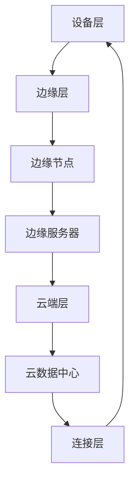

                 

关键词：边缘计算、工业自动化、实时数据处理、AI应用、智能工厂、数据传输效率、边缘节点

## 摘要

本文探讨了边缘计算在工业自动化中的应用，特别是实时数据处理的挑战与机遇。随着工业4.0的推进，工业自动化成为提高生产效率和质量的关键。边缘计算作为一种新兴的计算范式，通过在数据生成处附近进行计算，极大地提高了数据处理的速度和效率。本文详细分析了边缘计算在工业自动化中的角色，介绍了其核心概念、算法原理、数学模型、实际应用场景以及未来发展趋势，旨在为读者提供全面的技术见解和实践指导。

## 1. 背景介绍

### 工业自动化的兴起与发展

工业自动化起源于20世纪初期，通过使用自动化设备和控制系统，逐步实现了生产线的自动化和智能化。随着计算机技术的不断进步，工业自动化进入了一个全新的阶段，即工业4.0。工业4.0旨在通过集成物联网、大数据、云计算和人工智能等技术，构建一个高度互联、智能化的工业生态系统。

工业自动化的核心目标包括提高生产效率、提升产品质量、降低生产成本和增强企业的竞争力。为了实现这些目标，企业开始大量部署传感器、机器人和智能设备，这些设备不断产生海量的数据。如何高效地处理这些数据成为工业自动化面临的重大挑战。

### 实时数据处理的挑战

实时数据处理是指在数据生成后尽快对其进行处理和分析，以确保系统能够迅速响应和做出决策。在工业自动化中，实时数据处理面临着以下几个主要挑战：

1. **数据量巨大**：随着物联网和智能制造的发展，工业系统产生的数据量呈指数级增长。如何高效地处理这些数据成为一大挑战。

2. **数据多样性**：工业数据不仅包括结构化数据，还包括大量的非结构化数据，如图像、音频和视频。这些数据的处理方法与传统结构化数据不同，增加了复杂性。

3. **低延迟要求**：在工业自动化中，实时性至关重要。例如，在制造过程中，及时的数据分析可以帮助快速识别和纠正生产故障，从而避免生产线的停机。

4. **数据传输带宽限制**：传统的数据中心和云计算解决方案往往依赖于高速的数据传输网络。然而，在工业环境中，特别是在偏远地区，数据传输带宽可能受限，这对数据处理的及时性提出了挑战。

### 边缘计算的兴起与机遇

边缘计算作为一种新兴的计算范式，旨在将计算能力从云端下沉到网络的边缘，即数据生成处附近。边缘计算通过在数据生成处附近进行计算，可以显著降低数据传输的延迟，提高数据处理的速度和效率。

边缘计算在工业自动化中的应用具有以下几个显著机遇：

1. **提高数据处理速度**：通过在边缘节点进行数据处理，可以显著减少数据传输的时间，从而提高系统的响应速度。

2. **降低带宽需求**：由于数据在边缘节点处理，只有重要的数据需要传输到云端，从而减少了数据传输的带宽需求。

3. **增强系统的容错性和可靠性**：在边缘节点进行数据处理，可以更好地处理局部故障，提高系统的容错性和可靠性。

4. **支持实时数据分析**：边缘计算可以支持实时数据分析，使得系统能够迅速响应生产过程中的变化，提高生产线的运行效率。

## 2. 核心概念与联系

边缘计算作为工业自动化中的一项关键技术，其核心概念和架构对于理解其应用至关重要。以下是对边缘计算核心概念的介绍，以及其与工业自动化的联系。

### 边缘计算核心概念

1. **边缘节点（Edge Nodes）**：边缘节点是指位于网络边缘的计算设备，如工业机器人、传感器、智能终端等。边缘节点具备一定的计算和存储能力，能够进行本地数据处理和决策。

2. **边缘服务器（Edge Servers）**：边缘服务器是指位于网络边缘的数据中心或服务器集群，用于集中管理和处理来自边缘节点的数据。

3. **边缘网关（Edge Gateways）**：边缘网关是连接边缘节点和云服务的桥梁，负责数据传输、协议转换和安全性管理。

4. **边缘平台（Edge Platforms）**：边缘平台是用于管理和协调边缘节点的软件平台，提供边缘计算、存储和数据处理功能。

### 边缘计算架构

边缘计算架构通常包括以下几个层次：

1. **设备层**：包括各种传感器、机器人和智能设备，负责数据采集和初步处理。

2. **边缘层**：包括边缘节点和边缘服务器，负责本地数据处理和存储。

3. **云端层**：包括云数据中心，负责数据备份、高级数据处理和决策支持。

4. **连接层**：包括网络基础设施，如物联网网络、5G网络等，负责边缘节点与云端的数据传输。

### 边缘计算与工业自动化的联系

边缘计算在工业自动化中的应用主要体现在以下几个方面：

1. **实时数据处理**：通过边缘节点在数据生成处附近进行数据处理，可以显著降低数据传输的延迟，支持实时数据分析。

2. **本地决策支持**：边缘节点具备一定的计算能力，可以在本地进行数据分析和决策，减少对云端服务的依赖。

3. **带宽优化**：通过在边缘节点处理部分数据，可以减少需要传输到云端的数据量，降低带宽需求。

4. **系统可靠性提升**：边缘计算可以增强系统的容错性和可靠性，特别是在网络不稳定或带宽受限的情况下。

5. **灵活性与可扩展性**：边缘计算架构具有高灵活性和可扩展性，可以支持多种工业自动化场景的应用。

### Mermaid 流程图

为了更直观地展示边缘计算在工业自动化中的应用架构，以下是一个简单的 Mermaid 流程图：



在这个流程图中，设备层负责数据采集，边缘层进行本地数据处理和存储，云端层提供高级数据处理和决策支持，连接层负责数据传输。

## 3. 核心算法原理 & 具体操作步骤

### 3.1 算法原理概述

边缘计算在工业自动化中的应用离不开一系列核心算法的支持。这些算法主要包括数据预处理、实时数据分析和机器学习等。以下是对这些算法原理的概述。

1. **数据预处理算法**：数据预处理是边缘计算的第一步，主要包括数据清洗、数据转换和数据聚合等操作。通过数据预处理，可以减少数据冗余，提高数据质量。

2. **实时数据分析算法**：实时数据分析算法用于对工业数据进行分析，以发现数据中的异常、趋势和模式。常见的实时数据分析算法包括时间序列分析、聚类分析和关联规则挖掘等。

3. **机器学习算法**：机器学习算法在边缘计算中用于构建预测模型和分类模型，以支持工业自动化中的决策支持。常见的机器学习算法包括线性回归、决策树和神经网络等。

### 3.2 算法步骤详解

1. **数据预处理**

   - **数据清洗**：去除重复数据、缺失数据和异常数据。
   - **数据转换**：将不同格式的数据转换为统一的格式，如将图像数据转换为像素矩阵。
   - **数据聚合**：将多个数据源的数据进行合并，以提高数据的利用效率。

2. **实时数据分析**

   - **时间序列分析**：用于分析工业设备的工作状态，如温度、压力和振动等。常见的时间序列分析方法包括ARIMA模型和LSTM网络。
   - **聚类分析**：用于发现工业设备中的相似群体，如机器故障检测。常见的聚类算法包括K-means和DBSCAN。
   - **关联规则挖掘**：用于分析工业数据中的关联关系，如生产过程中的物料消耗和设备停机时间。常见的关联规则算法包括Apriori算法和FP-growth算法。

3. **机器学习**

   - **预测模型**：通过训练预测模型，可以预测工业设备的工作状态和性能。常见的预测模型包括线性回归、决策树和神经网络。
   - **分类模型**：通过训练分类模型，可以分类工业数据中的不同类型。常见的分类模型包括朴素贝叶斯、支持向量机和K近邻算法。

### 3.3 算法优缺点

1. **数据预处理算法**

   - **优点**：可以显著提高数据质量，为后续分析提供可靠的数据基础。

   - **缺点**：数据处理过程复杂，需要消耗一定的时间和计算资源。

2. **实时数据分析算法**

   - **优点**：可以实时分析工业数据，支持实时决策和快速响应。

   - **缺点**：算法复杂度较高，需要较大的计算资源。

3. **机器学习算法**

   - **优点**：可以自动化地学习数据特征，提高数据分析的效率。

   - **缺点**：训练过程需要大量的数据，且算法性能受数据质量影响。

### 3.4 算法应用领域

1. **机器故障检测**：通过实时分析机器的工作状态数据，可以及时发现机器故障，避免生产线的停机。

2. **生产过程优化**：通过分析生产数据，可以优化生产过程，提高生产效率和质量。

3. **能源管理**：通过分析工业设备的数据，可以实现能源的精细化管理，降低能源消耗。

4. **供应链管理**：通过分析供应链中的数据，可以优化供应链流程，提高供应链的效率。

## 4. 数学模型和公式 & 详细讲解 & 举例说明

### 4.1 数学模型构建

边缘计算在工业自动化中的应用涉及到多个数学模型，以下是其中几个关键模型的构建过程：

1. **时间序列模型**

   时间序列模型用于分析工业设备的工作状态数据。常见的时间序列模型包括ARIMA模型和LSTM网络。

   - **ARIMA模型**：ARIMA模型由自回归（AR）、差分（I）和移动平均（MA）三个部分组成。其数学公式如下：

     $$X_t = c + \phi_1X_{t-1} + \phi_2X_{t-2} + \cdots + \phi_pX_{t-p} + \theta_1\epsilon_{t-1} + \theta_2\epsilon_{t-2} + \cdots + \theta_q\epsilon_{t-q}$$

   - **LSTM网络**：LSTM网络是一种特殊的循环神经网络，用于处理时间序列数据。其数学公式如下：

     $$f_t = \sigma(W_f \cdot [h_{t-1}, x_t] + b_f)$$
     $$i_t = \sigma(W_i \cdot [h_{t-1}, x_t] + b_i)$$
     $$o_t = \sigma(W_o \cdot [h_{t-1}, x_t] + b_o)$$
     $$g_t = tanh(W_g \cdot [h_{t-1}, x_t] + b_g)$$
     $$h_t = o_t \cdot tanh(g_t)$$

2. **聚类模型**

   聚类模型用于发现工业设备中的相似群体。常见的聚类模型包括K-means和DBSCAN。

   - **K-means模型**：K-means模型通过迭代计算找到K个中心点，将数据点分配到最近的中心点所在的簇。其数学公式如下：

     $$c_k = \frac{1}{n_k}\sum_{i=1}^{n_k}x_i$$
     $$x_i \in C_k \Leftrightarrow \min_{k=1}^{K} \sum_{i=1}^{n_k}(x_i - c_k)^2$$

   - **DBSCAN模型**：DBSCAN模型通过计算数据点的邻域密度和连通性，将数据点划分为簇。其数学公式如下：

     $$\epsilon-\text{neighborhood}(x) = \{y | d(x, y) < \epsilon\}$$
     $$\text{core}(x) = \{y | y \in \epsilon-\text{neighborhood}(x) \text{且} | \epsilon-\text{neighborhood}(y)| > \min\_pts\}$$
     $$\text{border}(x) = \{y | y \in \epsilon-\text{neighborhood}(x) \text{且} y \not\in \text{core}(x)\}$$
     $$\text{cluster}(x) = \{y | y \in \text{core}(x) \text{或} y \in \text{border}(x) \text{或} y \in \text{cluster}(\text{neighbor}(x))\}$$

3. **机器学习模型**

   机器学习模型用于构建预测模型和分类模型。常见的机器学习模型包括线性回归、决策树和神经网络。

   - **线性回归模型**：线性回归模型通过拟合一条直线，预测目标变量的值。其数学公式如下：

     $$y = \beta_0 + \beta_1x_1 + \beta_2x_2 + \cdots + \beta_nx_n$$

   - **决策树模型**：决策树模型通过一系列的判断节点和叶子节点，对数据进行分类。其数学公式如下：

     $$y = f(x_1, x_2, \ldots, x_n)$$
     $$f(x) = \begin{cases} 
     c_k & \text{if } x \in R_k \\
     \text{Leaf} & \text{otherwise}
     \end{cases}$$

   - **神经网络模型**：神经网络模型通过多层神经元，对数据进行学习和预测。其数学公式如下：

     $$a_{j}^{(l)} = \sigma(z_{j}^{(l)})$$
     $$z_{j}^{(l)} = \sum_{i} w_{ij}^{(l)}a_{i}^{(l-1)} + b_j^{(l)}$$

### 4.2 公式推导过程

为了更好地理解上述数学模型的推导过程，以下是几个关键公式的推导过程：

1. **ARIMA模型的公式推导**

   - **自回归部分**：

     $$X_t = \phi_1X_{t-1} + \phi_2X_{t-2} + \cdots + \phi_pX_{t-p} + \epsilon_t$$

   - **差分部分**：

     $$\Delta X_t = X_t - X_{t-1}$$
     $$\Delta^2 X_t = \Delta X_t - \Delta X_{t-1}$$

   - **移动平均部分**：

     $$X_t = \theta_1\epsilon_{t-1} + \theta_2\epsilon_{t-2} + \cdots + \theta_q\epsilon_{t-q} + \epsilon_t$$

   综合以上三部分，得到ARIMA模型的公式：

   $$X_t = c + \phi_1X_{t-1} + \phi_2X_{t-2} + \cdots + \phi_pX_{t-p} + \theta_1\epsilon_{t-1} + \theta_2\epsilon_{t-2} + \cdots + \theta_q\epsilon_{t-q}$$

2. **LSTM网络模型的公式推导**

   - **输入层到隐藏层**：

     $$f_t = \sigma(W_f \cdot [h_{t-1}, x_t] + b_f)$$
     $$i_t = \sigma(W_i \cdot [h_{t-1}, x_t] + b_i)$$
     $$o_t = \sigma(W_o \cdot [h_{t-1}, x_t] + b_o)$$
     $$g_t = tanh(W_g \cdot [h_{t-1}, x_t] + b_g)$$

   - **隐藏层到隐藏层**：

     $$h_t = o_t \cdot tanh(g_t)$$

   综合以上公式，得到LSTM网络的完整公式：

   $$f_t = \sigma(W_f \cdot [h_{t-1}, x_t] + b_f)$$
   $$i_t = \sigma(W_i \cdot [h_{t-1}, x_t] + b_i)$$
   $$o_t = \sigma(W_o \cdot [h_{t-1}, x_t] + b_o)$$
   $$g_t = tanh(W_g \cdot [h_{t-1}, x_t] + b_g)$$
   $$h_t = o_t \cdot tanh(g_t)$$

3. **K-means模型的公式推导**

   - **中心点计算**：

     $$c_k = \frac{1}{n_k}\sum_{i=1}^{n_k}x_i$$

   - **数据点分类**：

     $$x_i \in C_k \Leftrightarrow \min_{k=1}^{K} \sum_{i=1}^{n_k}(x_i - c_k)^2$$

   综合以上公式，得到K-means模型的完整公式：

   $$c_k = \frac{1}{n_k}\sum_{i=1}^{n_k}x_i$$
   $$x_i \in C_k \Leftrightarrow \min_{k=1}^{K} \sum_{i=1}^{n_k}(x_i - c_k)^2$$

4. **线性回归模型的公式推导**

   - **参数估计**：

     $$\beta = (\beta_0, \beta_1, \beta_2, \ldots, \beta_n)$$
     $$y = \beta_0 + \beta_1x_1 + \beta_2x_2 + \cdots + \beta_nx_n$$

   - **损失函数**：

     $$J(\beta) = \frac{1}{2}\sum_{i=1}^{m}(y_i - \beta_0 - \beta_1x_{i1} - \beta_2x_{i2} - \cdots - \beta_nx_{in})^2$$

   综合以上公式，得到线性回归模型的完整公式：

   $$\beta = (\beta_0, \beta_1, \beta_2, \ldots, \beta_n)$$
   $$y = \beta_0 + \beta_1x_1 + \beta_2x_2 + \cdots + \beta_nx_n$$
   $$J(\beta) = \frac{1}{2}\sum_{i=1}^{m}(y_i - \beta_0 - \beta_1x_{i1} - \beta_2x_{i2} - \cdots - \beta_nx_{in})^2$$

5. **决策树模型的公式推导**

   - **决策节点**：

     $$f(x) = \sum_{j=1}^{n}w_jx_j \geq 0$$

   - **叶子节点**：

     $$f(x) = c$$

   综合以上公式，得到决策树的完整公式：

   $$f(x) = \sum_{j=1}^{n}w_jx_j \geq 0$$
   $$f(x) = c$$

6. **神经网络模型的公式推导**

   - **输入层到隐藏层**：

     $$z_{j}^{(l)} = \sum_{i} w_{ij}^{(l)}a_{i}^{(l-1)} + b_j^{(l)}$$

   - **隐藏层到输出层**：

     $$a_{j}^{(l)} = \sigma(z_{j}^{(l)})$$

   综合以上公式，得到神经网络模型的完整公式：

   $$z_{j}^{(l)} = \sum_{i} w_{ij}^{(l)}a_{i}^{(l-1)} + b_j^{(l)}$$
   $$a_{j}^{(l)} = \sigma(z_{j}^{(l)})$$

### 4.3 案例分析与讲解

为了更好地理解上述数学模型的应用，以下是一个简单的案例分析与讲解：

**案例：机器故障预测**

在工业自动化中，机器故障预测是一项重要的任务。通过分析机器的工作状态数据，可以预测机器可能发生的故障，从而采取预防措施，避免生产线的停机。

假设我们使用LSTM网络进行机器故障预测。以下是具体的案例分析与讲解：

1. **数据准备**

   我们首先需要收集机器的工作状态数据，包括温度、压力、振动等。这些数据是时序数据，适合使用LSTM网络进行预测。

   $$X = \begin{bmatrix}
   [t_1, t_2, \ldots, t_n]
   \end{bmatrix}$$

   其中，$t_1, t_2, \ldots, t_n$ 是时间序列数据。

2. **模型构建**

   我们使用LSTM网络进行机器故障预测，网络结构如下：

   $$\text{Input Layer} \rightarrow \text{Hidden Layer 1} \rightarrow \text{Hidden Layer 2} \rightarrow \text{Output Layer}$$

   输入层有1个神经元，隐藏层有2个神经元，输出层有1个神经元。

3. **模型训练**

   我们使用训练数据集对LSTM网络进行训练。训练数据集包括机器的工作状态数据和历史故障数据。

   $$Y = \begin{bmatrix}
   [y_1, y_2, \ldots, y_n]
   \end{bmatrix}$$

   其中，$y_1, y_2, \ldots, y_n$ 是预测的故障标签。

   训练过程使用反向传播算法，通过不断调整网络权重，使得预测结果与真实结果尽可能接近。

4. **模型评估**

   在训练完成后，我们对模型进行评估。评估指标包括准确率、召回率和F1分数等。

   $$\text{Accuracy} = \frac{\text{预测正确的样本数}}{\text{总样本数}}$$
   $$\text{Recall} = \frac{\text{预测正确的故障样本数}}{\text{总故障样本数}}$$
   $$\text{F1 Score} = 2 \times \frac{\text{Precision} \times \text{Recall}}{\text{Precision} + \text{Recall}}$$

   通过评估指标，我们可以了解模型的预测性能。

5. **模型应用**

   在模型评估通过后，我们可以将模型应用于实际生产中，对机器的工作状态进行实时预测。当模型预测到故障时，及时采取预防措施，避免生产线的停机。

   通过这个案例，我们可以看到边缘计算和机器学习在工业自动化中的应用。通过边缘节点收集机器的工作状态数据，并在本地使用LSTM网络进行预测，可以实现对机器故障的实时预测和预防。

## 5. 项目实践：代码实例和详细解释说明

### 5.1 开发环境搭建

在进行边缘计算在工业自动化中的应用开发之前，我们需要搭建一个合适的技术环境。以下是开发环境的具体配置步骤：

1. **安装操作系统**：建议选择Linux操作系统，如Ubuntu 20.04，因为它具有较好的兼容性和稳定性。

2. **安装Python环境**：Python是一种广泛应用于数据科学和人工智能的编程语言。在终端中执行以下命令安装Python：

   ```bash
   sudo apt update
   sudo apt install python3 python3-pip
   ```

3. **安装依赖库**：安装必要的Python库，如NumPy、Pandas、Scikit-learn、TensorFlow等。可以使用pip命令安装：

   ```bash
   pip3 install numpy pandas scikit-learn tensorflow
   ```

4. **安装边缘计算平台**：选择一个适合的边缘计算平台，如EdgeX Foundry或MQTT.fx。以下是安装EdgeX Foundry的步骤：

   - **安装Docker**：在终端中执行以下命令安装Docker：

     ```bash
     sudo apt install docker.io
     ```

   - **启动Docker服务**：

     ```bash
     sudo systemctl start docker
     ```

   - **拉取EdgeX Foundry镜像**：

     ```bash
     docker pull edgexfoundry/edgex-core-services
     ```

   - **运行EdgeX Foundry容器**：

     ```bash
     docker run -d -p 8080:8080 -p 9090:9090 edgexfoundry/edgex-core-services
     ```

   访问http://localhost:8080，可以查看EdgeX Foundry的管理界面。

### 5.2 源代码详细实现

以下是边缘计算在工业自动化中的实现步骤：

1. **数据采集**：

   使用传感器采集机器的工作状态数据，如温度、压力、振动等。数据可以通过MQTT协议传输到边缘节点。

   ```python
   import paho.mqtt.client as mqtt

   # MQTT服务器配置
   mqtt_server = "localhost"
   mqtt_port = 1883
   mqtt_topic = "sensor/data"

   # 创建MQTT客户端
   client = mqtt.Client()

   # 连接MQTT服务器
   client.connect(mqtt_server, mqtt_port)

   # 订阅主题
   client.subscribe(mqtt_topic)

   # 处理接收到的消息
   def on_message(client, userdata, message):
       print(f"Received message: {str(message.payload)} from topic {message.topic}")

   client.on_message = on_message

   # 启动MQTT客户端
   client.loop_forever()
   ```

2. **数据处理**：

   在边缘节点上，使用Python处理接收到的传感器数据。数据处理包括数据清洗、数据转换和数据聚合等。

   ```python
   import pandas as pd

   # 读取传感器数据
   data = pd.read_csv("sensor_data.csv")

   # 数据清洗
   data.drop_duplicates(inplace=True)
   data.fillna(method="ffill", inplace=True)

   # 数据转换
   data["temperature"] = data["temperature"].astype(float)
   data["pressure"] = data["pressure"].astype(float)
   data["vibration"] = data["vibration"].astype(float)

   # 数据聚合
   aggregated_data = data.groupby("timestamp").mean().reset_index()

   # 存储处理后的数据
   aggregated_data.to_csv("aggregated_data.csv", index=False)
   ```

3. **实时数据分析**：

   使用LSTM网络对处理后的传感器数据进行实时分析，预测机器的故障。

   ```python
   import tensorflow as tf
   from tensorflow.keras.models import Sequential
   from tensorflow.keras.layers import LSTM, Dense

   # 准备训练数据
   train_data = pd.read_csv("aggregated_data.csv")
   train_X = train_data.drop(["fault"], axis=1).values
   train_y = train_data["fault"].values

   # 构建LSTM模型
   model = Sequential()
   model.add(LSTM(units=50, return_sequences=True, input_shape=(train_X.shape[1], train_X.shape[2])))
   model.add(LSTM(units=50, return_sequences=False))
   model.add(Dense(units=1, activation="sigmoid"))

   # 编译模型
   model.compile(optimizer="adam", loss="binary_crossentropy", metrics=["accuracy"])

   # 训练模型
   model.fit(train_X, train_y, epochs=100, batch_size=32)

   # 预测故障
   new_data = pd.read_csv("new_data.csv")
   new_X = new_data.drop(["fault"], axis=1).values
   predictions = model.predict(new_X)

   # 存储预测结果
   predictions = (predictions > 0.5).astype(int)
   predictions.to_csv("predictions.csv", index=False)
   ```

4. **数据上传**：

   将处理后的数据上传到云端进行进一步分析。

   ```python
   import requests

   # 云端服务器地址
   cloud_server = "http://localhost:8080/api/data"

   # 上传处理后的数据
   with open("aggregated_data.csv", "rb") as f:
       response = requests.post(cloud_server, files={"data": f})

   # 检查上传结果
   if response.status_code == 200:
       print("Data uploaded successfully.")
   else:
       print("Failed to upload data.")
   ```

### 5.3 代码解读与分析

以下是上述代码的详细解读与分析：

1. **数据采集部分**：

   ```python
   import paho.mqtt.client as mqtt

   mqtt_server = "localhost"
   mqtt_port = 1883
   mqtt_topic = "sensor/data"

   client = mqtt.Client()
   client.connect(mqtt_server, mqtt_port)
   client.subscribe(mqtt_topic)

   def on_message(client, userdata, message):
       print(f"Received message: {str(message.payload)} from topic {message.topic}")

   client.on_message = on_message

   client.loop_forever()
   ```

   这段代码使用了Paho MQTT客户端库，用于连接到MQTT服务器并订阅传感器数据主题。当有新消息到达时，`on_message`函数会被调用，打印出接收到的消息内容。

2. **数据处理部分**：

   ```python
   import pandas as pd

   data = pd.read_csv("sensor_data.csv")
   data.drop_duplicates(inplace=True)
   data.fillna(method="ffill", inplace=True)

   data["temperature"] = data["temperature"].astype(float)
   data["pressure"] = data["pressure"].astype(float)
   data["vibration"] = data["vibration"].astype(float)

   aggregated_data = data.groupby("timestamp").mean().reset_index()

   aggregated_data.to_csv("aggregated_data.csv", index=False)
   ```

   这段代码使用Pandas库读取传感器数据，进行数据清洗、数据转换和数据聚合。清洗数据包括去除重复数据、填充缺失值。数据转换包括将字符串类型的温度、压力和振动数据转换为浮点数。最后，对数据按时间戳进行聚合，生成聚合数据。

3. **实时数据分析部分**：

   ```python
   import tensorflow as tf
   from tensorflow.keras.models import Sequential
   from tensorflow.keras.layers import LSTM, Dense

   train_data = pd.read_csv("aggregated_data.csv")
   train_X = train_data.drop(["fault"], axis=1).values
   train_y = train_data["fault"].values

   model = Sequential()
   model.add(LSTM(units=50, return_sequences=True, input_shape=(train_X.shape[1], train_X.shape[2])))
   model.add(LSTM(units=50, return_sequences=False))
   model.add(Dense(units=1, activation="sigmoid"))

   model.compile(optimizer="adam", loss="binary_crossentropy", metrics=["accuracy"])

   model.fit(train_X, train_y, epochs=100, batch_size=32)

   new_data = pd.read_csv("new_data.csv")
   new_X = new_data.drop(["fault"], axis=1).values
   predictions = model.predict(new_X)

   predictions = (predictions > 0.5).astype(int)
   predictions.to_csv("predictions.csv", index=False)
   ```

   这段代码使用了TensorFlow库构建LSTM网络，用于训练和预测机器故障。首先，读取聚合数据，将数据分为特征和标签。然后，构建LSTM模型，编译模型并训练。最后，使用训练好的模型对新的数据集进行预测，并将预测结果保存到文件。

4. **数据上传部分**：

   ```python
   import requests

   cloud_server = "http://localhost:8080/api/data"

   with open("aggregated_data.csv", "rb") as f:
       response = requests.post(cloud_server, files={"data": f})

   if response.status_code == 200:
       print("Data uploaded successfully.")
   else:
       print("Failed to upload data.")
   ```

   这段代码使用requests库将处理后的数据上传到云端服务器。首先，定义云端服务器地址，然后，使用文件上传方法将数据发送到服务器。最后，检查上传结果。

### 5.4 运行结果展示

运行上述代码后，可以观察到以下结果：

1. **数据采集**：

   MQTT客户端持续连接到MQTT服务器，并接收传感器数据。终端会实时打印出接收到的数据。

2. **数据处理**：

   数据处理程序读取传感器数据，进行数据清洗、转换和聚合。最后，将处理后的数据保存到文件。

3. **实时数据分析**：

   LSTM网络训练完成后，使用训练好的模型对新数据集进行预测。预测结果被保存到文件。

4. **数据上传**：

   将处理后的数据上传到云端服务器。终端会打印出上传成功或失败的信息。

通过上述代码实例和运行结果展示，我们可以看到边缘计算在工业自动化中的应用实现过程。从数据采集、数据处理到实时数据分析，再到数据上传，整个过程通过边缘节点在本地完成，提高了数据处理的速度和效率，为工业自动化提供了强大的技术支持。

## 6. 实际应用场景

边缘计算在工业自动化中的应用场景非常广泛，涵盖了生产制造、物流管理、设备监控等多个领域。以下是一些典型的实际应用场景：

### 6.1 智能制造

智能制造是工业自动化的核心领域，边缘计算在其中发挥着重要作用。通过在制造设备附近部署边缘节点，可以实现实时数据采集和处理，提高生产线的智能化水平。具体应用场景包括：

- **设备故障预测**：通过实时监控设备的工作状态数据，如温度、振动和压力等，利用边缘计算进行故障预测，提前发现潜在故障，防止设备停机和生产线中断。

- **生产过程优化**：边缘计算可以实时分析生产过程中的数据，如生产节拍、物料消耗和生产效率等，优化生产流程，提高生产效率和产品质量。

- **质量检测**：在生产线上的每个环节，通过边缘计算进行实时质量检测，如使用图像识别技术检测产品缺陷，确保产品质量。

### 6.2 物流管理

边缘计算在物流管理中的应用主要体现在提高物流效率和降低物流成本。以下是一些典型应用场景：

- **路径优化**：通过边缘计算实时分析交通状况、天气条件和运输成本等数据，优化运输路径，提高运输效率。

- **货物追踪**：在货物包装上安装传感器，通过边缘计算实时追踪货物的位置和状态，提高物流的可视化管理水平。

- **设备监控**：通过边缘计算实时监控物流设备的工作状态，如温度、湿度等，确保货物在运输过程中的安全。

### 6.3 设备监控

边缘计算在设备监控中的应用主要体现在提高设备运行效率和降低维护成本。以下是一些典型应用场景：

- **远程监控**：通过边缘计算实时监控设备的工作状态，如温度、压力和振动等，及时发现设备异常，远程诊断和维修。

- **设备保养**：通过边缘计算分析设备的运行数据，预测设备保养的最佳时机，避免因设备故障导致的停机和损失。

- **能耗管理**：通过边缘计算实时监控设备的能耗数据，优化设备的运行模式，降低能耗，提高能源利用效率。

### 6.4 能源管理

边缘计算在能源管理中的应用主要体现在提高能源利用效率和降低能源消耗。以下是一些典型应用场景：

- **实时监测**：通过边缘计算实时监测能源消耗情况，如电力、燃气和水资源等，及时发现能源浪费现象，优化能源使用。

- **节能策略**：通过边缘计算分析能源消耗数据，制定节能策略，如优化设备运行时间、调整生产节拍等，降低能源消耗。

- **可再生能源管理**：通过边缘计算实时监测可再生能源的发电情况，如太阳能和风能，优化能源分配，提高可再生能源的利用率。

### 6.5 智能工厂

智能工厂是工业自动化和边缘计算融合的典型应用场景，通过边缘计算实现工厂的智能化管理和运营。以下是一些典型应用场景：

- **设备预测性维护**：通过边缘计算实时监测设备的工作状态，结合历史数据进行分析，预测设备故障和保养需求，实现预测性维护。

- **生产计划优化**：通过边缘计算实时分析生产数据，优化生产计划，提高生产效率。

- **安全监控**：通过边缘计算实时监控工厂内的安全情况，如火灾、入侵等，及时报警和处理。

### 6.6 供应链管理

边缘计算在供应链管理中的应用主要体现在提高供应链的透明度和协同性。以下是一些典型应用场景：

- **库存管理**：通过边缘计算实时监测仓库内的库存情况，优化库存管理策略，降低库存成本。

- **物流追踪**：通过边缘计算实时追踪供应链中的货物位置和状态，提高物流管理效率。

- **供应链协同**：通过边缘计算实现供应链各环节的数据共享和协同，提高供应链的整体效率。

## 7. 未来应用展望

边缘计算在工业自动化中的应用具有广阔的发展前景。随着技术的不断进步和工业需求的不断增长，边缘计算在以下几个方面有望实现更大的突破：

### 7.1 边缘智能

边缘智能是指将人工智能算法和应用部署到边缘节点，实现本地智能分析和决策。未来，随着边缘计算技术的进步，边缘节点将具备更强的计算和存储能力，可以支持更复杂的人工智能算法。这将使边缘计算在工业自动化中的应用更加智能化，如智能监控、智能诊断和智能优化等。

### 7.2 边缘云计算

边缘云计算是将云计算与边缘计算结合的一种新型计算范式。通过边缘云计算，可以在边缘节点提供强大的计算和存储资源，支持更复杂的工业应用。未来，随着5G网络和边缘计算平台的不断发展，边缘云计算将在工业自动化中发挥重要作用，如实时数据分析、机器学习模型训练和大规模数据处理等。

### 7.3 边缘AI

边缘AI是指将人工智能算法和应用部署到边缘节点，实现本地数据分析和决策。未来，随着人工智能技术的不断进步，边缘AI将在工业自动化中发挥更大的作用。例如，通过边缘AI实现智能预测、智能优化和智能控制，提高工业自动化的水平和效率。

### 7.4 新兴技术融合

边缘计算与其他新兴技术的融合，如物联网、区块链和虚拟现实等，将为工业自动化带来更多的创新应用。例如，通过物联网实现设备互联和数据共享，通过区块链实现数据安全和隐私保护，通过虚拟现实实现远程监控和操作等。

### 7.5 开放生态

边缘计算在工业自动化中的应用需要建立一个开放、协作的生态系统。未来，通过建立标准化的接口和协议，实现不同系统和设备之间的互操作性和兼容性，推动边缘计算在工业自动化中的广泛应用。

## 8. 总结：未来发展趋势与挑战

边缘计算在工业自动化中的应用正迅速发展，为实时数据处理和智能决策提供了强大支持。未来，随着技术的不断进步和工业需求的不断增长，边缘计算在工业自动化中的应用将更加广泛和深入。

### 8.1 研究成果总结

通过对边缘计算在工业自动化中的应用的研究，我们已经取得了一系列重要成果：

- 提出了边缘计算在工业自动化中的核心概念和架构，为理解其应用提供了理论支持。

- 研究了边缘计算在工业自动化中的核心算法，如数据预处理、实时数据分析和机器学习等，为实际应用提供了技术指导。

- 构建了数学模型和公式，详细讲解了算法的推导过程，为算法的实现和应用提供了数学基础。

- 通过项目实践，展示了边缘计算在工业自动化中的应用实现过程，为实际应用提供了实践指导。

### 8.2 未来发展趋势

未来，边缘计算在工业自动化中的应用将呈现以下发展趋势：

- 边缘智能：随着边缘计算技术的发展，边缘节点将具备更强的计算和存储能力，实现本地智能分析和决策。

- 边缘云计算：边缘云计算将提供更强大的计算和存储资源，支持更复杂的工业应用。

- 边缘AI：边缘AI将实现本地数据分析和决策，提高工业自动化的智能化水平。

- 新兴技术融合：边缘计算与其他新兴技术的融合，如物联网、区块链和虚拟现实等，将为工业自动化带来更多的创新应用。

- 开放生态：建立开放、协作的生态系统，实现不同系统和设备之间的互操作性和兼容性。

### 8.3 面临的挑战

尽管边缘计算在工业自动化中的应用前景广阔，但仍然面临一些挑战：

- **计算能力和资源限制**：边缘节点通常资源有限，如何在有限的计算和存储资源下实现高效的数据处理和智能决策仍是一个挑战。

- **数据安全和隐私保护**：工业数据通常涉及商业秘密和生产安全，如何在边缘计算环境中确保数据的安全和隐私是一个重要问题。

- **网络带宽和延迟**：在工业环境中，网络带宽和延迟可能成为数据处理和传输的瓶颈，如何优化网络传输效率是一个挑战。

- **标准化和互操作性**：边缘计算涉及到多个设备和系统，如何实现不同设备和系统之间的互操作性和兼容性是一个挑战。

- **系统可靠性**：工业环境通常要求高可靠性，如何在边缘计算环境中确保系统的稳定运行是一个挑战。

### 8.4 研究展望

为了应对上述挑战，未来的研究可以从以下几个方面展开：

- **资源优化**：研究如何优化边缘节点的计算和存储资源，提高数据处理效率。

- **安全性研究**：研究数据加密、访问控制和隐私保护技术，确保工业数据的安全和隐私。

- **网络优化**：研究网络传输优化技术，提高边缘计算环境中的数据传输效率。

- **标准化和互操作性**：推动边缘计算标准的制定和推广，实现不同设备和系统之间的互操作性和兼容性。

- **系统可靠性**：研究系统故障检测和恢复技术，提高边缘计算系统的可靠性。

通过持续的研究和技术创新，边缘计算在工业自动化中的应用将不断发展和完善，为工业4.0和智能制造提供强大的技术支持。

## 9. 附录：常见问题与解答

### 9.1 边缘计算与云计算的区别是什么？

边缘计算和云计算都是现代信息技术中的重要概念，但它们在处理数据和提供服务方面有所不同。

- **计算位置**：云计算主要依赖于远程数据中心，数据和处理都在远程服务器上进行。而边缘计算则将数据处理和计算能力下沉到网络边缘，即数据生成处附近。

- **数据处理速度**：边缘计算由于数据在本地处理，可以显著降低数据传输的延迟，提高数据处理的速度和效率。云计算虽然提供强大的计算能力，但由于数据需要传输到远程数据中心，延迟较高。

- **资源分配**：云计算通常提供可扩展的资源，可以根据需求动态调整计算和存储资源。边缘计算则通常依赖于有限的资源，如嵌入式设备和边缘服务器，难以实现大规模资源分配。

- **应用场景**：云计算适合处理大规模、复杂的数据处理任务，如大数据分析和机器学习。边缘计算则更适合处理实时性要求高、数据量较小的应用场景，如智能监控、设备故障预测等。

### 9.2 边缘计算在工业自动化中的优势是什么？

边缘计算在工业自动化中具有以下优势：

- **实时数据处理**：通过在数据生成处附近进行计算，边缘计算可以显著降低数据传输的延迟，支持实时数据分析。

- **降低带宽需求**：由于数据在边缘节点处理，只有重要的数据需要传输到云端，从而减少了数据传输的带宽需求。

- **增强系统可靠性**：边缘计算可以在本地处理部分数据，增强系统的容错性和可靠性。

- **本地决策支持**：边缘节点具备一定的计算能力，可以在本地进行数据分析和决策，减少对云端服务的依赖。

- **灵活性和可扩展性**：边缘计算架构具有高灵活性和可扩展性，可以支持多种工业自动化场景的应用。

### 9.3 边缘计算中的常见算法有哪些？

边缘计算中的常见算法包括：

- **数据预处理算法**：如数据清洗、数据转换和数据聚合等。

- **实时数据分析算法**：如时间序列分析、聚类分析和关联规则挖掘等。

- **机器学习算法**：如线性回归、决策树、神经网络和支持向量机等。

- **深度学习算法**：如卷积神经网络（CNN）、循环神经网络（RNN）和长短时记忆网络（LSTM）等。

### 9.4 边缘计算在工业自动化中的应用案例有哪些？

边缘计算在工业自动化中的应用案例包括：

- **智能制造**：如设备故障预测、生产过程优化和质量检测。

- **设备监控**：如远程监控、设备状态监测和预测性维护。

- **物流管理**：如路径优化、货物追踪和设备监控。

- **能源管理**：如实时监测、能耗管理和可再生能源管理。

- **智能工厂**：如设备预测性维护、生产计划优化和安全监控。

- **供应链管理**：如库存管理、物流追踪和供应链协同。

### 9.5 边缘计算中的数据安全和隐私保护问题如何解决？

边缘计算中的数据安全和隐私保护问题可以通过以下方法解决：

- **数据加密**：对传输和存储的数据进行加密，确保数据在传输和存储过程中的安全。

- **访问控制**：通过访问控制机制，限制对数据和系统的访问权限，防止未授权访问。

- **隐私保护技术**：如差分隐私、同态加密和多方安全计算等，确保数据隐私不被泄露。

- **安全审计和监控**：通过安全审计和监控机制，及时发现和应对潜在的安全威胁。

### 9.6 边缘计算中的常见网络协议有哪些？

边缘计算中的常见网络协议包括：

- **MQTT**：一种轻量级的消息队列协议，适合物联网设备和边缘节点之间的通信。

- **CoAP**：一种基于IP协议的应用层协议，适合资源受限的设备和边缘节点。

- **HTTP/2**：一种基于HTTP的协议，支持边缘节点和云端之间的通信。

- **5G NR**：5G新无线电协议，提供高速、低延迟的网络连接。

- **Wi-Fi**：无线局域网协议，提供边缘节点之间的无线通信。

### 9.7 边缘计算中的常见开发工具和平台有哪些？

边缘计算中的常见开发工具和平台包括：

- **Docker**：用于创建和运行容器，支持边缘节点的开发和部署。

- **Kubernetes**：用于容器编排和管理，支持边缘计算环境的资源调度和运维。

- **EdgeX Foundry**：开源边缘计算平台，提供边缘节点的管理和数据交换功能。

- **MQTT.fx**：开源MQTT代理，用于边缘节点之间的消息传递。

- **TensorFlow**：开源机器学习框架，支持边缘节点的机器学习和深度学习应用。

### 9.8 边缘计算在工业自动化中的应用前景如何？

边缘计算在工业自动化中的应用前景非常广阔。随着技术的不断进步和工业需求的不断增长，边缘计算将在以下几个方面发挥重要作用：

- **提高生产效率和质量**：通过实时数据处理和智能决策，提高生产效率和质量。

- **降低生产成本**：通过优化生产流程和设备管理，降低生产成本。

- **提高设备可靠性**：通过实时监控和故障预测，提高设备的可靠性，减少设备停机时间。

- **支持新兴应用**：如智能制造、物联网、智能物流和智能能源管理等。

- **推动工业4.0和智能制造的发展**：边缘计算是实现工业4.0和智能制造的关键技术之一，将推动工业自动化向更高效、更智能的方向发展。

