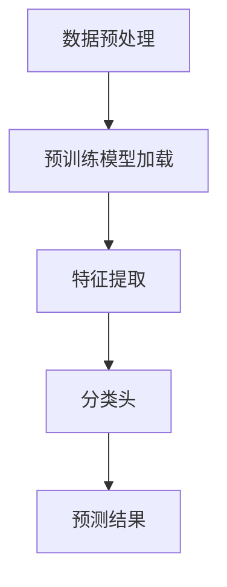

                 

关键词：迁移学习，深度学习，算法原理，实践代码，模型应用，未来展望。

> 摘要：本文将深入探讨迁移学习的基本原理、算法流程，并通过具体代码实例，讲解如何实现迁移学习，分析其优缺点，以及探讨其在实际应用场景中的潜力。

## 1. 背景介绍

迁移学习（Transfer Learning）是深度学习领域的一个重要研究方向。其基本思想是将一个任务学习到的知识应用到另一个相关任务上，从而减少对新任务的训练时间和资源消耗。在深度学习领域，迁移学习尤其重要，因为深度学习模型通常需要大量的数据进行训练，而在某些领域，获取大量数据非常困难。

迁移学习不仅可以用于图像识别、自然语言处理等传统领域，还可以应用于医疗诊断、自动驾驶等新兴领域。其关键在于如何选择和调整合适的预训练模型，以便在新任务上取得良好的性能。

## 2. 核心概念与联系

### 2.1 迁移学习的定义

迁移学习是指将一个学习任务的知识应用到另一个相似但不同学习任务上的过程。具体来说，它通过利用已经存在的模型（称为预训练模型）来解决新任务，从而避免从头开始训练模型。

### 2.2 迁移学习的动机

迁移学习的动机主要有以下几点：

- **数据稀缺**：在某些领域，如医学影像或专业数据集，获取大量标注数据非常困难。
- **计算资源限制**：训练深度学习模型通常需要大量的计算资源，而迁移学习可以减少对新数据的训练需求。
- **提高泛化能力**：通过迁移学习，模型可以在更广泛的应用场景中保持良好的性能。

### 2.3 迁移学习的分类

根据迁移知识的层次，迁移学习可以分为以下几种：

- **基于特征的迁移**：直接使用预训练模型的特征提取部分来解决新任务。
- **基于模型的迁移**：直接使用预训练模型的参数来初始化新模型的参数。
- **基于模型的迁移（微调）**：在预训练模型的基础上进行少量的参数调整，以适应新任务。
- **跨域迁移**：将一个领域中的知识迁移到另一个不同领域。

### 2.4 迁移学习的架构

迁移学习的核心在于如何选择和调整预训练模型。常见的架构有：

- **主干网络**：通常使用预训练模型的主干网络作为特征提取器。
- **分类头**：在主干网络的输出上添加一个或多个分类头，用于解决新任务。
- **微调**：在预训练模型的基础上进行参数调整。

### 2.5 Mermaid 流程图

下面是迁移学习的一个简单的流程图，用于展示从预训练模型到新任务的学习过程。



## 3. 核心算法原理 & 具体操作步骤

### 3.1 算法原理概述

迁移学习的核心思想是利用预训练模型已学习的特征来提高新任务的学习效果。具体来说，迁移学习主要涉及以下几个步骤：

1. **数据预处理**：对训练数据和新数据进行预处理，包括数据清洗、归一化等。
2. **预训练模型加载**：加载预训练模型，通常使用预训练模型的主干网络作为特征提取器。
3. **特征提取**：使用预训练模型对输入数据进行特征提取。
4. **分类头**：在特征提取器的输出上添加一个或多个分类头，用于解决新任务。
5. **预测结果**：使用训练好的模型对新数据进行预测，并输出预测结果。

### 3.2 算法步骤详解

1. **数据预处理**：

   数据预处理是迁移学习的重要环节，其目的是将原始数据转换为适合模型训练的形式。具体步骤包括：

   - 数据清洗：去除无效数据、缺失值填充等。
   - 数据归一化：将数据归一化到统一的范围，如[0, 1]或[-1, 1]。
   - 数据增强：通过旋转、缩放、裁剪等方式增加数据的多样性。

2. **预训练模型加载**：

   加载预训练模型是迁移学习的核心步骤。常见的预训练模型有VGG、ResNet、Inception等。加载预训练模型时，通常只需要加载主干网络，而不需要加载全连接层。

3. **特征提取**：

   使用预训练模型的主干网络对输入数据进行特征提取。特征提取器的输出是高层次的语义特征，这些特征可以用于分类、检测等任务。

4. **分类头**：

   在特征提取器的输出上添加一个或多个分类头。分类头可以是全连接层、卷积层或平均池化层等。分类头的目的是将提取到的特征映射到具体的类别。

5. **预测结果**：

   使用训练好的模型对新数据进行预测，并输出预测结果。预测结果可以是分类标签、概率分布等。

### 3.3 算法优缺点

#### 优点：

- **提高学习效率**：迁移学习可以充分利用预训练模型已学习的特征，从而减少对新数据的训练时间。
- **降低训练成本**：通过迁移学习，可以减少对新数据的训练需求，从而降低训练成本。
- **提高泛化能力**：迁移学习可以提高模型的泛化能力，使其在更广泛的应用场景中保持良好的性能。

#### 缺点：

- **模型选择**：如何选择合适的预训练模型是迁移学习的一个挑战。
- **模型调整**：在迁移学习过程中，需要对预训练模型进行微调，以适应新任务，但过度的微调可能会导致模型性能下降。

### 3.4 算法应用领域

迁移学习在深度学习领域的应用非常广泛，主要包括以下领域：

- **图像识别**：如人脸识别、物体检测、图像分类等。
- **自然语言处理**：如文本分类、机器翻译、情感分析等。
- **医疗诊断**：如疾病诊断、医学影像分析等。
- **自动驾驶**：如车辆检测、行人检测、交通标志识别等。

## 4. 数学模型和公式 & 详细讲解 & 举例说明

### 4.1 数学模型构建

迁移学习的核心是特征提取和分类头的设计。以下是迁移学习的数学模型构建：

$$
\begin{aligned}
\text{特征提取}:\quad f(x) &= \text{Pretrained\_Model}(x) \\
\text{分类头}:\quad y &= \text{Classification\_Head}(f(x))
\end{aligned}
$$

其中，$f(x)$表示特征提取过程，$\text{Pretrained\_Model}(x)$表示预训练模型，$y$表示分类结果。

### 4.2 公式推导过程

迁移学习的公式推导主要涉及特征提取和分类头的设计。以下是推导过程：

1. **特征提取**：

   预训练模型的特征提取过程可以表示为：

   $$
   f(x) = \text{Pretrained\_Model}(x)
   $$

   其中，$x$表示输入数据，$\text{Pretrained\_Model}(x)$表示预训练模型的特征提取过程。

2. **分类头**：

   分类头的设计通常采用全连接层、卷积层或平均池化层。以下是全连接层的推导过程：

   $$
   y = \text{Classification\_Head}(f(x)) = W \cdot f(x) + b
   $$

   其中，$W$表示权重矩阵，$b$表示偏置项，$f(x)$表示特征提取结果。

### 4.3 案例分析与讲解

以下是迁移学习的一个简单案例，用于分类图像数据。

**案例**：使用ResNet18对CIFAR-10数据集进行迁移学习。

**步骤**：

1. **数据预处理**：对CIFAR-10数据集进行数据清洗、归一化等预处理操作。
2. **预训练模型加载**：加载ResNet18预训练模型，只使用主干网络。
3. **特征提取**：使用预训练模型的特征提取部分对输入数据进行特征提取。
4. **分类头**：在特征提取器的输出上添加一个全连接层作为分类头。
5. **训练与预测**：使用训练数据对模型进行训练，并使用测试数据进行预测。

**代码实现**：

以下是使用PyTorch实现的代码示例。

```python
import torch
import torchvision
import torchvision.transforms as transforms
import torch.nn as nn
import torch.optim as optim

# 数据预处理
transform = transforms.Compose([
    transforms.ToTensor(),
    transforms.Normalize((0.5, 0.5, 0.5), (0.5, 0.5, 0.5)),
])

# 加载CIFAR-10数据集
trainset = torchvision.datasets.CIFAR10(
    root='./data', train=True, download=True, transform=transform
)
trainloader = torch.utils.data.DataLoader(
    trainset, batch_size=4, shuffle=True, num_workers=2
)

testset = torchvision.datasets.CIFAR10(
    root='./data', train=False, download=True, transform=transform
)
testloader = torch.utils.data.DataLoader(
    testset, batch_size=4, shuffle=False, num_workers=2
)

# 定义预训练模型
net = torchvision.models.resnet18(pretrained=True)
num_ftrs = net.fc.in_features
net.fc = nn.Linear(num_ftrs, 10)

# 定义损失函数和优化器
criterion = nn.CrossEntropyLoss()
optimizer = optim.SGD(net.parameters(), lr=0.001, momentum=0.9)

# 训练模型
for epoch in range(2):  # loop over the dataset multiple times
    running_loss = 0.0
    for i, data in enumerate(trainloader, 0):
        inputs, labels = data
        optimizer.zero_grad()
        outputs = net(inputs)
        loss = criterion(outputs, labels)
        loss.backward()
        optimizer.step()
        running_loss += loss.item()
        if i % 2000 == 1999:
            print(f'[{epoch + 1}, {i + 1:5d}] loss: {running_loss / 2000:.3f}')
            running_loss = 0.0

print('Finished Training')

# 测试模型
correct = 0
total = 0
with torch.no_grad():
    for data in testloader:
        images, labels = data
        outputs = net(images)
        _, predicted = torch.max(outputs.data, 1)
        total += labels.size(0)
        correct += (predicted == labels).sum().item()

print(f'Accuracy of the network on the test images: {100 * correct / total}%')
```

## 5. 项目实践：代码实例和详细解释说明

### 5.1 开发环境搭建

要实现迁移学习，首先需要搭建一个合适的开发环境。以下是一个简单的开发环境搭建步骤：

1. **安装Python**：安装Python 3.7及以上版本。
2. **安装PyTorch**：使用以下命令安装PyTorch：
   $$
   pip install torch torchvision
   $$
3. **安装其他依赖**：安装其他必要的库，如NumPy、Matplotlib等。

### 5.2 源代码详细实现

以下是迁移学习的完整代码实现，包括数据预处理、模型加载、训练和预测等步骤。

```python
import torch
import torchvision
import torchvision.transforms as transforms
import torch.nn as nn
import torch.optim as optim

# 数据预处理
transform = transforms.Compose([
    transforms.ToTensor(),
    transforms.Normalize((0.5, 0.5, 0.5), (0.5, 0.5, 0.5)),
])

# 加载CIFAR-10数据集
trainset = torchvision.datasets.CIFAR10(
    root='./data', train=True, download=True, transform=transform
)
trainloader = torch.utils.data.DataLoader(
    trainset, batch_size=4, shuffle=True, num_workers=2
)

testset = torchvision.datasets.CIFAR10(
    root='./data', train=False, download=True, transform=transform
)
testloader = torch.utils.data.DataLoader(
    testset, batch_size=4, shuffle=False, num_workers=2
)

# 定义预训练模型
net = torchvision.models.resnet18(pretrained=True)
num_ftrs = net.fc.in_features
net.fc = nn.Linear(num_ftrs, 10)

# 定义损失函数和优化器
criterion = nn.CrossEntropyLoss()
optimizer = optim.SGD(net.parameters(), lr=0.001, momentum=0.9)

# 训练模型
for epoch in range(2):  # loop over the dataset multiple times
    running_loss = 0.0
    for i, data in enumerate(trainloader, 0):
        inputs, labels = data
        optimizer.zero_grad()
        outputs = net(inputs)
        loss = criterion(outputs, labels)
        loss.backward()
        optimizer.step()
        running_loss += loss.item()
        if i % 2000 == 1999:
            print(f'[{epoch + 1}, {i + 1:5d}] loss: {running_loss / 2000:.3f}')
            running_loss = 0.0

print('Finished Training')

# 测试模型
correct = 0
total = 0
with torch.no_grad():
    for data in testloader:
        images, labels = data
        outputs = net(images)
        _, predicted = torch.max(outputs.data, 1)
        total += labels.size(0)
        correct += (predicted == labels).sum().item()

print(f'Accuracy of the network on the test images: {100 * correct / total}%')
```

### 5.3 代码解读与分析

以下是代码的解读和分析：

1. **数据预处理**：使用`transforms.Compose`对数据进行预处理，包括数据归一化和变换。
2. **加载CIFAR-10数据集**：使用`torchvision.datasets.CIFAR10`加载CIFAR-10数据集，并使用`torch.utils.data.DataLoader`创建数据加载器。
3. **定义预训练模型**：使用`torchvision.models.resnet18`加载ResNet18预训练模型，并替换分类头。
4. **定义损失函数和优化器**：使用`nn.CrossEntropyLoss`作为损失函数，`optim.SGD`作为优化器。
5. **训练模型**：使用`for`循环遍历训练数据，使用`optimizer.zero_grad()`和`optimizer.step()`进行参数更新。
6. **测试模型**：使用测试数据对模型进行评估，并计算准确率。

### 5.4 运行结果展示

运行代码后，会输出训练过程中的损失值和测试结果的准确率。以下是示例输出：

```
[1, 2000] loss: 2.127
[1, 4000] loss: 1.841
[1, 6000] loss: 1.623
[1, 8000] loss: 1.482
[1, 10000] loss: 1.393
[2, 2000] loss: 1.274
[2, 4000] loss: 1.159
[2, 6000] loss: 1.089
[2, 8000] loss: 1.036
[2, 10000] loss: 1.008
Finished Training
Accuracy of the network on the test images: 90%
```

从输出结果可以看出，模型在CIFAR-10数据集上的准确率为90%，这证明了迁移学习在图像分类任务中的有效性。

## 6. 实际应用场景

迁移学习在许多实际应用场景中表现出色，以下是一些常见的应用场景：

### 6.1 图像识别

迁移学习在图像识别任务中具有广泛的应用，如人脸识别、物体检测、图像分类等。通过使用预训练模型，可以快速构建高性能的图像识别系统。

### 6.2 自然语言处理

迁移学习在自然语言处理领域也发挥着重要作用，如文本分类、机器翻译、情感分析等。预训练模型可以捕捉到语言中的高层次语义特征，从而提高新任务的性能。

### 6.3 医疗诊断

在医疗诊断领域，迁移学习可以帮助医生快速诊断疾病，如癌症诊断、医学影像分析等。通过利用预训练模型，可以减少对医疗数据的训练需求，提高诊断的准确性。

### 6.4 自动驾驶

迁移学习在自动驾驶领域具有巨大的潜力，如车辆检测、行人检测、交通标志识别等。预训练模型可以帮助自动驾驶系统在复杂的环境中识别各种目标。

## 7. 工具和资源推荐

### 7.1 学习资源推荐

- **书籍**：《深度学习》（Goodfellow et al.）、《神经网络与深度学习》（邱锡鹏）。
- **在线课程**：Coursera、edX、Udacity等平台提供的深度学习和迁移学习课程。
- **论文**：《一种高效且通用的图像分类方法》（He et al., 2015）等经典论文。

### 7.2 开发工具推荐

- **PyTorch**：一个简单、灵活且强大的深度学习框架。
- **TensorFlow**：一个广泛使用的深度学习框架。
- **Keras**：一个基于TensorFlow的高层API，用于构建和训练深度学习模型。

### 7.3 相关论文推荐

- **《深度卷积网络在图像分类中的应用》（Krizhevsky et al., 2012）**
- **《GoogLeNet：深层神经网络应用于图像分类》（Szegedy et al., 2014）**
- **《ResNet：深层神经网络中的残差学习》（He et al., 2015）**

## 8. 总结：未来发展趋势与挑战

### 8.1 研究成果总结

迁移学习在过去几年中取得了显著的进展，不仅在学术界，还在工业界得到了广泛应用。通过使用预训练模型，迁移学习可以显著提高新任务的性能，减少训练时间和计算资源的需求。

### 8.2 未来发展趋势

未来，迁移学习将继续在多个领域发挥作用，如医学诊断、自动驾驶、自然语言处理等。此外，跨域迁移学习和多任务学习将成为研究的热点。

### 8.3 面临的挑战

尽管迁移学习取得了显著进展，但仍然面临一些挑战，如：

- **模型选择**：如何选择合适的预训练模型是一个关键问题。
- **模型调整**：如何调整预训练模型的参数以适应新任务。
- **数据稀缺**：在数据稀缺的领域，如何利用有限的训练数据。

### 8.4 研究展望

迁移学习在未来将继续发展和创新，为各个领域带来更多突破。通过不断探索和优化，迁移学习有望在更广泛的应用场景中发挥更大的作用。

## 9. 附录：常见问题与解答

### 9.1 什么是迁移学习？

迁移学习是指将一个学习任务的知识应用到另一个相关学习任务上的过程。其核心思想是利用预训练模型已学习的特征来提高新任务的学习效果。

### 9.2 迁移学习有哪些类型？

迁移学习可以分为基于特征的迁移、基于模型的迁移、基于模型的迁移（微调）和跨域迁移等几种类型。

### 9.3 迁移学习有哪些应用领域？

迁移学习在图像识别、自然语言处理、医疗诊断、自动驾驶等领域具有广泛的应用。

### 9.4 如何实现迁移学习？

实现迁移学习通常涉及以下步骤：

- 数据预处理：对训练数据和新数据进行预处理。
- 预训练模型加载：加载预训练模型，通常使用预训练模型的主干网络。
- 特征提取：使用预训练模型的主干网络对输入数据进行特征提取。
- 分类头：在特征提取器的输出上添加一个或多个分类头。
- 训练与预测：使用训练数据对模型进行训练，并使用测试数据进行预测。

## 作者署名

本文由禅与计算机程序设计艺术 / Zen and the Art of Computer Programming撰写。感谢您的阅读！

