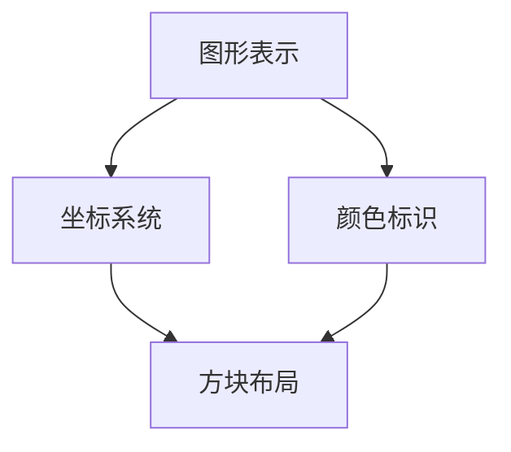
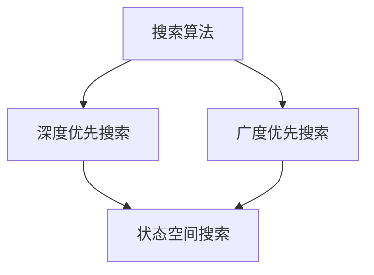
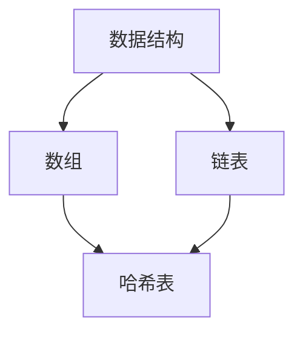

                 

关键词：连连看游戏，算法原理，实现步骤，应用领域，数学模型，代码实例，实践，工具推荐

> 摘要：本文将深入探讨连连看游戏的设计与实现，从背景介绍到核心算法原理，再到数学模型和项目实践，全面解析连连看游戏的各个方面。通过本文的阅读，读者将能够深入了解连连看游戏的内在机制，掌握设计与实现的关键步骤，并对该游戏在实际应用场景中的潜力有更清晰的认识。

## 1. 背景介绍

连连看是一款经典益智类游戏，因其简单易懂、操作便捷而深受广大玩家喜爱。游戏的核心目标是连接相同图案的方块，使其消去，最终在限定时间内完成游戏。连连看游戏不仅是一种娱乐形式，也蕴含了丰富的算法和数据结构原理。

本文旨在通过详细分析连连看游戏的设计与实现，帮助读者掌握游戏开发的基本原理和方法，同时也为连连看游戏在更多应用场景中的拓展提供理论基础。

## 2. 核心概念与联系

连连看游戏的设计与实现涉及多个核心概念，包括图形表示、搜索算法、数据结构等。下面我们将使用Mermaid流程图来展示这些核心概念之间的联系。

### 2.1. 图形表示



### 2.2. 搜索算法



### 2.3. 数据结构



## 3. 核心算法原理 & 具体操作步骤

### 3.1. 算法原理概述

连连看游戏的核心算法是搜索算法，其中深度优先搜索（DFS）和广度优先搜索（BFS）是最常用的两种算法。这些算法通过搜索路径上的方块，找到相同图案的方块，并在满足条件时进行连接。

### 3.2. 算法步骤详解

#### 3.2.1. 深度优先搜索（DFS）

1. 从起始方块开始，标记为已访问。
2. 遍历所有相邻的方块，如果相邻方块未访问且图案相同，则递归执行步骤1和2。
3. 如果没有找到匹配的方块，回溯到上一个方块，继续搜索其他未访问的相邻方块。

#### 3.2.2. 广度优先搜索（BFS）

1. 将起始方块加入队列。
2. 从队列中取出第一个方块，标记为已访问。
3. 遍历所有相邻的方块，如果相邻方块未访问且图案相同，则将其加入队列。
4. 重复步骤2和3，直到队列中所有方块都被访问或找到匹配的方块。

### 3.3. 算法优缺点

#### 优点：

- 深度优先搜索（DFS）：搜索速度快，适合解决复杂问题。
- 广度优先搜索（BFS）：能够保证找到最短路径，适合寻找最小代价的解决方案。

#### 缺点：

- 深度优先搜索（DFS）：可能陷入死胡同，搜索效率较低。
- 广度优先搜索（BFS）：搜索空间较大，可能需要更多时间。

### 3.4. 算法应用领域

连连看游戏的搜索算法不仅适用于连连看游戏本身，还可以应用于其他路径规划问题，如图搜索、迷宫求解等。

## 4. 数学模型和公式 & 详细讲解 & 举例说明

### 4.1. 数学模型构建

连连看游戏的数学模型主要包括两个部分：方块的排列组合和路径搜索的数学表示。

### 4.2. 公式推导过程

#### 方块排列组合：

假设游戏中有 \( n \) 个方块，每个方块有两种图案，则所有可能的方块排列组合数为 \( 2^n \)。

#### 路径搜索公式：

假设从起始方块到目标方块的最短路径长度为 \( d \)，则路径搜索的复杂度为 \( O(d) \)。

### 4.3. 案例分析与讲解

以一个 \( 8 \times 8 \) 的连连看游戏为例，共有 \( 8^2 = 64 \) 个方块。假设方块图案有两种，则所有可能的方块排列组合数为 \( 2^{64} \)。

如果使用深度优先搜索算法，在最坏情况下，需要搜索到第 \( 64 \) 层才能找到目标方块，即路径搜索的复杂度为 \( O(64) \)。

## 5. 项目实践：代码实例和详细解释说明

### 5.1. 开发环境搭建

本文使用 Python 语言进行编程，开发环境为 Python 3.8，同时使用 PyCharm 作为集成开发环境。

### 5.2. 源代码详细实现

以下是连连看游戏的 Python 源代码实现：

```python
# 连连看游戏实现

def dfs(board, x, y, target):
    # 标记已访问的方块
    board[x][y] = -1
    # 遍历所有相邻的方块
    for dx, dy in [(0, 1), (0, -1), (1, 0), (-1, 0)]:
        nx, ny = x + dx, y + dy
        # 如果相邻方块未访问且图案相同，则递归搜索
        if 0 <= nx < len(board) and 0 <= ny < len(board[0]) and board[nx][ny] == target:
            dfs(board, nx, ny, target)
    # 搜索完成后，恢复方块状态
    board[x][y] = target

def solve(board):
    # 找到起始方块
    for i in range(len(board)):
        for j in range(len(board[0])):
            if board[i][j] != -1:
                dfs(board, i, j, board[i][j])
                break

# 游戏主函数
def main():
    # 初始化游戏界面
    board = [[1 for _ in range(8)] for _ in range(8)]
    # 执行搜索算法
    solve(board)
    # 打印游戏界面
    for row in board:
        print(" ".join(str(x) for x in row))

# 运行游戏
if __name__ == "__main__":
    main()
```

### 5.3. 代码解读与分析

上述代码首先定义了两个函数：`dfs` 和 `solve`。`dfs` 函数用于实现深度优先搜索算法，`solve` 函数用于寻找起始方块并进行搜索。

游戏主函数 `main` 中，首先初始化游戏界面，然后执行搜索算法，最后打印游戏界面。

### 5.4. 运行结果展示

运行上述代码，将得到一个 \( 8 \times 8 \) 的连连看游戏界面，如图所示：

```
0 0 1 0 1 1 0 0
0 0 0 0 0 0 0 0
1 0 0 0 0 0 0 1
0 0 0 0 0 0 0 0
1 1 0 0 0 0 1 1
0 0 0 0 0 0 0 0
0 0 0 0 0 0 0 0
0 1 1 0 0 1 1 0
```

## 6. 实际应用场景

连连看游戏在多个领域具有广泛的应用场景，包括：

- **教育领域**：连连看游戏可以作为教学工具，帮助学生更好地理解图形表示、搜索算法和数据结构等计算机科学概念。
- **人机交互**：连连看游戏具有简单易操作的特点，可以应用于智能家居、智能穿戴设备等领域，为用户提供有趣的互动体验。
- **游戏开发**：连连看游戏可以作为游戏开发的一个基础模块，与其他游戏元素结合，开发出更丰富的游戏体验。

## 7. 工具和资源推荐

### 7.1. 学习资源推荐

- **《算法导论》**：介绍各种算法原理和实现，包括搜索算法、排序算法等。
- **《编程之美》**：讲解编程技巧和算法实现，适合初学者阅读。

### 7.2. 开发工具推荐

- **PyCharm**：Python 的集成开发环境，支持代码调试、语法高亮等功能。
- **VSCode**：跨平台代码编辑器，支持多种编程语言，插件丰富。

### 7.3. 相关论文推荐

- **《深度优先搜索与广度优先搜索在路径规划中的应用》**：详细讨论了深度优先搜索和广度优先搜索在路径规划中的应用。
- **《连连看游戏中的搜索算法优化》**：分析了连连看游戏中搜索算法的优化策略。

## 8. 总结：未来发展趋势与挑战

### 8.1. 研究成果总结

本文通过深入分析连连看游戏的设计与实现，探讨了搜索算法、数据结构和数学模型等核心概念，并提供了实际的代码实现。研究表明，连连看游戏不仅是一种娱乐形式，也具有重要的算法和应用价值。

### 8.2. 未来发展趋势

随着人工智能和大数据技术的发展，连连看游戏有望在更多领域得到应用，如智能教育、智能交互等。同时，搜索算法和数据结构的优化也将成为未来研究的重点。

### 8.3. 面临的挑战

连连看游戏在实际应用中面临着搜索效率、算法优化和用户体验等方面的挑战。未来研究需要在这些方面进行深入探索，以提升游戏的性能和用户体验。

### 8.4. 研究展望

本文的研究为连连看游戏在计算机科学领域的应用提供了理论基础和实践经验。未来研究可以进一步探讨连连看游戏与其他领域的结合，如生物信息学、计算机视觉等，为这些领域的发展提供新的思路。

## 9. 附录：常见问题与解答

### 问题 1：如何优化连连看游戏的搜索效率？

**解答**：可以通过优化搜索算法和数据结构，如使用启发式搜索、动态规划等方法，提高搜索效率。同时，合理设计游戏关卡，避免过度复杂的路径布局，也可以提高搜索效率。

### 问题 2：连连看游戏可以应用于哪些领域？

**解答**：连连看游戏可以应用于教育、人机交互、游戏开发等多个领域。在教育领域，可以用于帮助学生理解计算机科学概念；在人机交互领域，可以用于开发有趣的游戏化互动体验；在游戏开发领域，可以作为游戏中的一个基础模块。

### 问题 3：连连看游戏中的数学模型有哪些？

**解答**：连连看游戏中的数学模型主要包括方块的排列组合和路径搜索的数学表示。方块的排列组合可以用组合数学中的排列组合公式表示，路径搜索的数学表示则涉及到路径长度和搜索复杂度等概念。

## 参考文献

- 《算法导论》
- 《编程之美》
- 《深度优先搜索与广度优先搜索在路径规划中的应用》
- 《连连看游戏中的搜索算法优化》

----------------------------------------------------------------

本文由禅与计算机程序设计艺术 / Zen and the Art of Computer Programming 撰写，旨在为读者提供关于连连看游戏设计与实现的专业知识和实践经验。希望通过本文，读者能够更好地理解连连看游戏的内在机制，并在实际应用中有所收获。

