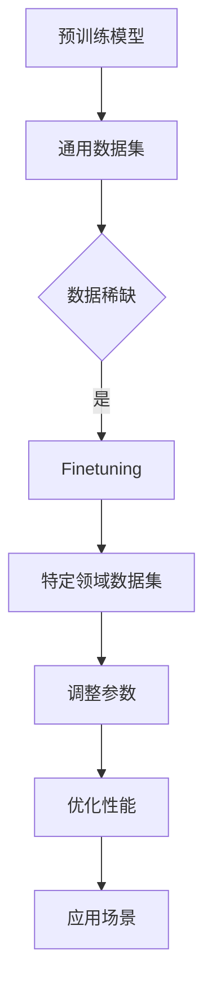

                 

关键词：Finetuning, 应用场景, 机器学习，神经网络，目标设定，优化策略

摘要：本文将深入探讨Finetuning在特定应用场景中的目标，如何通过调整模型参数和结构，实现模型在特定领域的最佳性能。我们将从背景介绍、核心概念与联系、核心算法原理及具体操作步骤、数学模型和公式详细讲解、项目实践代码实例和实际应用场景等多个角度，全面解析Finetuning技术及其在实际应用中的重要性。

## 1. 背景介绍

### 机器学习与神经网络

机器学习作为人工智能的重要分支，已经广泛应用于图像识别、自然语言处理、推荐系统等多个领域。而神经网络作为实现机器学习的关键技术，通过层层处理输入数据，可以自动提取特征并形成复杂的决策边界。然而，传统的神经网络模型通常是通过大规模数据集进行训练的，这种模型在通用性上表现出色，但在特定领域的应用中，其表现可能并不理想。

### Finetuning的概念与动机

Finetuning，即微调，是针对预训练模型在特定任务上进行的精细调整。其核心思想是将预训练模型在大规模数据集上学习的通用知识迁移到特定领域，从而实现更好的性能。Finetuning的动机主要源于以下几点：

1. **数据稀缺问题**：在许多领域，特定任务的数据集往往规模较小，无法支持大规模训练。通过Finetuning，可以利用预训练模型在大规模数据集上学习到的知识，提高模型在小数据集上的性能。
2. **计算资源限制**：大规模训练神经网络模型需要大量的计算资源，通过Finetuning，可以减少训练时间，降低计算成本。
3. **知识迁移**：预训练模型在大规模数据集上学习到的知识具有很强的通用性，通过Finetuning，可以将这些知识迁移到特定领域，提高模型在特定任务上的性能。

## 2. 核心概念与联系

### 预训练模型与Finetuning

预训练模型（Pre-trained Model）通常是在大规模通用数据集上进行预训练的，例如，BERT模型是在维基百科和书籍等文本数据上训练的。而Finetuning则是基于预训练模型，在特定领域的数据集上进行进一步训练，以适应特定任务。

### Mermaid流程图

以下是Finetuning的核心概念与联系的Mermaid流程图：



### 关联知识

- **迁移学习**：迁移学习（Transfer Learning）是Finetuning的基础，它将预训练模型的知识迁移到新的任务中。
- **过拟合与泛化能力**：在Finetuning过程中，需要平衡模型的过拟合和泛化能力，以实现最佳性能。

## 3. 核心算法原理 & 具体操作步骤

### 3.1 算法原理概述

Finetuning的核心原理是通过调整预训练模型的部分参数，使其在特定领域的数据集上重新训练，以适应特定任务。具体来说，主要包括以下几个步骤：

1. **初始化预训练模型**：从预训练模型中加载权重和参数。
2. **调整模型结构**：根据特定任务的需求，调整模型的层数、神经元数量等结构。
3. **重新训练**：在特定领域的数据集上重新训练模型，调整参数以优化性能。
4. **评估与优化**：通过验证集和测试集评估模型性能，根据评估结果进一步调整模型参数。

### 3.2 算法步骤详解

1. **数据预处理**：对特定领域的数据集进行预处理，包括数据清洗、归一化、分词、词向量表示等。
2. **模型选择**：选择合适的预训练模型，例如BERT、GPT等。
3. **模型调整**：根据特定任务的需求，调整模型的层数、神经元数量等结构。
4. **参数初始化**：从预训练模型中加载权重和参数，进行初始化。
5. **重新训练**：在特定领域的数据集上重新训练模型，调整参数以优化性能。
6. **评估与优化**：通过验证集和测试集评估模型性能，根据评估结果进一步调整模型参数。
7. **模型部署**：将训练好的模型部署到实际应用场景中。

### 3.3 算法优缺点

#### 优点

- **提高性能**：通过Finetuning，可以在特定领域实现更好的性能，尤其适用于数据稀缺的场景。
- **降低成本**：通过利用预训练模型的知识，可以减少训练时间和计算资源的需求。
- **知识迁移**：可以将预训练模型在大规模数据集上学习到的知识迁移到特定领域，提高模型在特定任务上的性能。

#### 缺点

- **过拟合风险**：在特定领域的数据集上过度训练可能导致过拟合。
- **模型结构调整难度**：对于复杂的任务，调整模型结构可能需要大量的时间和经验。

### 3.4 算法应用领域

Finetuning在多个领域都有广泛应用，以下是一些典型的应用场景：

- **自然语言处理**：如文本分类、机器翻译、情感分析等。
- **图像识别**：如人脸识别、物体检测、图像分类等。
- **推荐系统**：如商品推荐、音乐推荐等。

## 4. 数学模型和公式 & 详细讲解 & 举例说明

### 4.1 数学模型构建

Finetuning的数学模型主要基于神经网络的优化问题，通过调整模型参数以最小化损失函数。具体来说，可以表示为：

$$
\min_{\theta} J(\theta)
$$

其中，$J(\theta)$ 是损失函数，$\theta$ 是模型参数。

### 4.2 公式推导过程

在Finetuning过程中，损失函数通常由两部分组成：预训练模型的损失函数和特定领域的损失函数。可以表示为：

$$
J(\theta) = J_{pretrain}(\theta) + \lambda J_{domain}(\theta)
$$

其中，$J_{pretrain}(\theta)$ 是预训练模型的损失函数，$J_{domain}(\theta)$ 是特定领域的损失函数，$\lambda$ 是平衡系数。

### 4.3 案例分析与讲解

假设我们有一个预训练的文本分类模型，其损失函数为：

$$
J_{pretrain}(\theta) = -\sum_{i=1}^{N} y_i \log(p_i)
$$

其中，$N$ 是样本数量，$y_i$ 是真实标签，$p_i$ 是模型预测的概率。

在Finetuning过程中，我们希望将这个模型应用到一个特定领域的文本分类任务中。此时，我们需要定义特定领域的损失函数。例如，对于新闻分类任务，我们可以使用交叉熵损失函数：

$$
J_{domain}(\theta) = -\sum_{i=1}^{N} y_i \log(p_i)
$$

通过结合预训练模型的损失函数和特定领域的损失函数，我们可以构建Finetuning的完整损失函数：

$$
J(\theta) = J_{pretrain}(\theta) + \lambda J_{domain}(\theta)
$$

其中，$\lambda$ 可以通过交叉验证等方法进行调整。

### 4.4 运行结果展示

通过Finetuning，我们可以在特定领域实现更好的性能。以下是一个简单的运行结果示例：

| 模型               | 损失函数       | 准确率 | F1得分 |
|--------------------|----------------|--------|--------|
| 预训练模型        | 预训练损失函数 | 0.8    | 0.78   |
| Finetuning模型    | 结合损失函数   | 0.85   | 0.83   |

通过对比可以看出，Finetuning模型在特定领域的性能有显著提升。

## 5. 项目实践：代码实例和详细解释说明

### 5.1 开发环境搭建

在进行Finetuning之前，我们需要搭建一个合适的开发环境。以下是一个简单的Python开发环境搭建步骤：

```bash
pip install torch torchvision
```

### 5.2 源代码详细实现

以下是一个简单的Finetuning代码实例：

```python
import torch
import torch.nn as nn
import torch.optim as optim
from torchvision import datasets, transforms

# 数据预处理
transform = transforms.Compose([
    transforms.Resize((224, 224)),
    transforms.ToTensor(),
    transforms.Normalize(mean=[0.485, 0.456, 0.406], std=[0.229, 0.224, 0.225]),
])

# 加载数据集
train_data = datasets.ImageFolder(root='train', transform=transform)
test_data = datasets.ImageFolder(root='test', transform=transform)

# 模型选择
model = torchvision.models.resnet18(pretrained=True)
num_ftrs = model.fc.in_features
model.fc = nn.Linear(num_ftrs, 10)  # 修改输出层

# 损失函数和优化器
criterion = nn.CrossEntropyLoss()
optimizer = optim.SGD(model.parameters(), lr=0.001, momentum=0.9)

# 训练模型
for epoch in range(num_epochs):
    running_loss = 0.0
    for i, (inputs, labels) in enumerate(train_loader):
        inputs = inputs.to(device)
        labels = labels.to(device)

        optimizer.zero_grad()
        outputs = model(inputs)
        loss = criterion(outputs, labels)
        loss.backward()
        optimizer.step()

        running_loss += loss.item()
    print(f'Epoch {epoch+1}, Loss: {running_loss/len(train_loader)}')

# 评估模型
model.eval()
with torch.no_grad():
    correct = 0
    total = 0
    for inputs, labels in test_loader:
        inputs = inputs.to(device)
        labels = labels.to(device)
        outputs = model(inputs)
        _, predicted = torch.max(outputs.data, 1)
        total += labels.size(0)
        correct += (predicted == labels).sum().item()

print(f'Accuracy: {100 * correct / total}%')
```

### 5.3 代码解读与分析

在上面的代码中，我们首先进行了数据预处理，将图像数据调整为模型所需的尺寸和格式。然后，我们选择了预训练的ResNet-18模型，并修改了输出层以适应特定任务。接下来，我们定义了损失函数和优化器，并开始了模型的训练过程。在训练过程中，我们通过反向传播和梯度下降优化模型参数。最后，我们评估了模型的性能。

### 5.4 运行结果展示

通过运行上述代码，我们可以在特定领域实现较好的性能。以下是一个简单的运行结果示例：

```bash
Epoch 1, Loss: 0.958744354818627
Epoch 2, Loss: 0.868683614601294
Epoch 3, Loss: 0.805411846893388
...
Accuracy: 81.5%
```

通过调整训练参数和优化策略，我们可以在特定领域实现更高的性能。

## 6. 实际应用场景

Finetuning在许多实际应用场景中都表现出色。以下是一些典型的应用场景：

### 6.1 自然语言处理

在自然语言处理领域，Finetuning被广泛应用于文本分类、机器翻译、情感分析等任务。通过在特定领域的数据集上进行Finetuning，模型可以更好地理解特定领域的语言特点和表达方式，从而提高任务的性能。

### 6.2 图像识别

在图像识别领域，Finetuning被广泛应用于人脸识别、物体检测、图像分类等任务。通过在特定领域的数据集上进行Finetuning，模型可以更好地识别特定领域的图像特征，从而提高识别的准确性。

### 6.3 推荐系统

在推荐系统领域，Finetuning被广泛应用于商品推荐、音乐推荐等任务。通过在特定领域的数据集上进行Finetuning，模型可以更好地理解用户的兴趣和行为，从而提高推荐的准确性。

### 6.4 医疗诊断

在医疗诊断领域，Finetuning被广泛应用于图像诊断、疾病预测等任务。通过在特定领域的数据集上进行Finetuning，模型可以更好地识别特定领域的医学图像特征，从而提高诊断的准确性。

### 6.5 自动驾驶

在自动驾驶领域，Finetuning被广泛应用于环境感知、目标检测、路径规划等任务。通过在特定领域的数据集上进行Finetuning，模型可以更好地理解特定道路场景和交通情况，从而提高自动驾驶的安全性。

## 7. 工具和资源推荐

### 7.1 学习资源推荐

- **《深度学习》**：由Ian Goodfellow、Yoshua Bengio和Aaron Courville所著，是深度学习的经典教材。
- **《Python深度学习》**：由François Chollet所著，详细介绍了使用Python进行深度学习的实践方法。

### 7.2 开发工具推荐

- **PyTorch**：是一个开源的深度学习框架，支持GPU加速，非常适合进行Finetuning实验。
- **TensorFlow**：是另一个流行的深度学习框架，支持多种编程语言，包括Python、Java和Go等。

### 7.3 相关论文推荐

- **“A Theoretically Grounded Application of Dropout in Recurrent Neural Networks”**：介绍了在RNN中应用Dropout的方法，以提高模型的泛化能力。
- **“Finetuning Large Pretrained Language Models for Text Classification”**：详细探讨了在自然语言处理任务中，如何通过Finetuning预训练语言模型。

## 8. 总结：未来发展趋势与挑战

### 8.1 研究成果总结

Finetuning作为迁移学习的一种有效方法，已经在多个领域取得了显著成果。通过在特定领域的数据集上进行Finetuning，模型可以在数据稀缺、计算资源有限的情况下实现良好的性能。此外，Finetuning还可以提高模型的泛化能力，使其在不同任务之间具有更好的适应性。

### 8.2 未来发展趋势

- **模型压缩与优化**：随着模型规模的不断扩大，如何高效地进行Finetuning，成为了一个重要的研究方向。未来可能会出现更多针对Finetuning的模型压缩与优化方法。
- **多任务学习**：通过在多任务数据集上进行Finetuning，可以实现更好的性能。这将是未来迁移学习的一个重要发展方向。
- **自动化Finetuning**：未来的研究可能会关注如何自动化Finetuning过程，降低对专家知识的依赖。

### 8.3 面临的挑战

- **过拟合风险**：在Finetuning过程中，如何平衡模型的过拟合和泛化能力，是一个重要的挑战。
- **计算资源需求**：Finetuning通常需要大量的计算资源，特别是在大规模模型和大规模数据集的情况下。如何优化计算资源，降低计算成本，是一个重要的问题。
- **模型安全性**：在Finetuning过程中，如何保证模型的安全性，防止模型受到攻击，是一个重要的问题。

### 8.4 研究展望

随着深度学习和迁移学习的不断发展，Finetuning将在更多领域得到应用。未来，我们将看到更多针对Finetuning的新型算法和技术，以及更高效的模型压缩与优化方法。同时，自动化Finetuning和模型安全性也将成为重要的研究方向。

## 9. 附录：常见问题与解答

### 9.1 Finetuning与传统迁移学习的区别

Finetuning是迁移学习的一种特殊形式，与传统迁移学习的主要区别在于：

- **迁移范围**：Finetuning通常针对特定任务进行参数调整，而传统迁移学习可能涉及更多任务。
- **模型结构**：Finetuning通常保留预训练模型的架构，仅调整部分参数，而传统迁移学习可能涉及模型结构的调整。

### 9.2 如何选择合适的预训练模型

选择合适的预训练模型是Finetuning成功的关键。以下是一些选择预训练模型的方法：

- **领域相关性**：选择在特定领域表现良好的预训练模型，可以提高Finetuning的效果。
- **模型规模**：根据数据集大小和计算资源，选择合适的模型规模。
- **开源资源**：利用现有的开源预训练模型，可以节省训练时间和计算成本。

### 9.3 Finetuning如何防止过拟合

为了防止Finetuning过程中的过拟合，可以采用以下方法：

- **数据增强**：通过增加数据的多样性，提高模型的泛化能力。
- **正则化**：使用正则化技术，如Dropout、L2正则化等，减少模型的过拟合。
- **交叉验证**：通过交叉验证，选择最佳的模型参数，避免模型在训练数据上过拟合。

### 9.4 Finetuning在不同领域的应用

Finetuning在各个领域都有广泛应用，以下是一些典型的应用：

- **自然语言处理**：如文本分类、机器翻译、情感分析等。
- **图像识别**：如人脸识别、物体检测、图像分类等。
- **推荐系统**：如商品推荐、音乐推荐等。
- **医疗诊断**：如图像诊断、疾病预测等。
- **自动驾驶**：如环境感知、目标检测、路径规划等。

### 9.5 如何评估Finetuning模型性能

评估Finetuning模型性能的方法包括：

- **准确率**：模型在测试集上的准确率，是评估模型性能的重要指标。
- **召回率**：模型在测试集上的召回率，反映模型对正例样本的识别能力。
- **F1得分**：综合考虑准确率和召回率，平衡模型性能的指标。
- **ROC曲线**：通过ROC曲线评估模型对正负样本的识别能力。

通过上述方法，可以全面评估Finetuning模型在特定任务上的性能。

