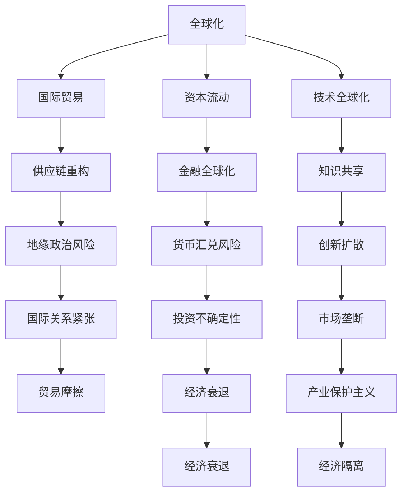
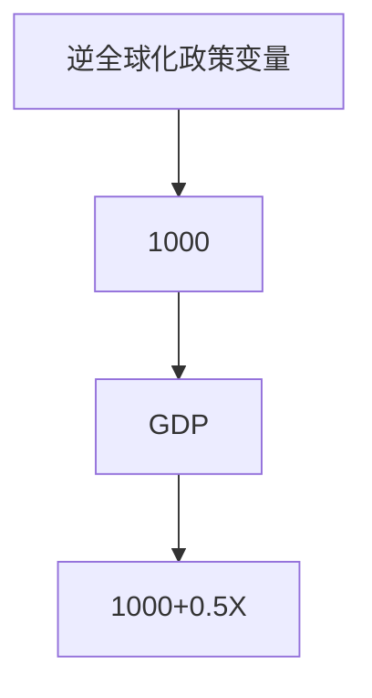
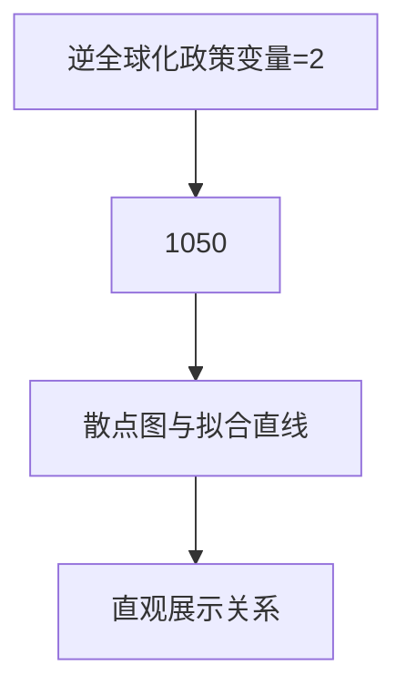

                 

关键词：逆全球化、经济影响、国际贸易、技术创新、数字化、地缘政治、供应链重构

## 摘要

随着逆全球化趋势的抬头，全球经济正面临前所未有的挑战。本文将深入探讨逆全球化现象的背景、主要表现及其对经济的深远影响。我们首先回顾全球化的历史进程，接着分析逆全球化的动因和表现形式。然后，本文将从国际贸易、技术创新、数字化、地缘政治和供应链重构等多个方面，详细探讨逆全球化对经济带来的变化和挑战。最后，我们将展望未来的发展趋势，并提出应对策略。

## 1. 背景介绍

全球化是20世纪后半叶以来全球经济发展的重要趋势。在这一过程中，国家间的经济联系日益紧密，商品、资本、技术和人员的流动加速，形成了全球化经济体系。然而，随着全球经济的不断发展，逆全球化趋势逐渐浮现。逆全球化指的是一些国家或地区采取保护主义政策，限制国际贸易和资本流动，加强国内市场保护，甚至推动本国产业回归本土。

逆全球化的兴起有多个原因。首先，经济全球化带来了不平等和失业问题，导致部分国家或地区民众对全球化产生抵触情绪。其次，国际恐怖主义、气候变化、流行病等全球性问题加剧了各国间的紧张关系。最后，某些政治势力利用民族主义情绪，推动保护主义政策，试图重塑国家利益。

### 1.1 全球化的发展历程

全球化的发展历程可以分为几个阶段。第一阶段是20世纪80年代至90年代初，以国际贸易自由化、投资便利化和技术全球化为主要特征。第二阶段是20世纪90年代至21世纪初，全球化加速发展，全球供应链逐渐形成，跨国公司成为经济活动的主要推动力。第三阶段是21世纪初至今，全球化面临挑战，逆全球化趋势日益明显。

### 1.2 逆全球化的动因

逆全球化的动因主要包括以下几个方面：

1. **经济不平等**：全球化导致财富和收入分配不均，发达国家内部出现了严重的贫富差距。这导致部分民众对全球化产生不满，支持保护主义政策。

2. **失业问题**：全球化使得劳动力市场变得更加竞争激烈，一些国家或地区的工人面临失业和工资下降的压力。

3. **政治因素**：某些政治势力利用民族主义情绪，推动保护主义政策，试图重塑国家利益。

4. **全球性问题**：国际恐怖主义、气候变化、流行病等全球性问题加剧了各国间的紧张关系，使得国家更倾向于采取保护主义政策。

## 2. 核心概念与联系

在分析逆全球化对经济的影响时，我们需要了解一些核心概念和它们之间的联系。以下是一个Mermaid流程图，用于展示这些概念之间的关系：



### 2.1 核心概念解释

1. **全球化**：全球化指的是全球范围内经济、社会、文化和政治的相互联系和依赖。
2. **国际贸易**：国际贸易是指不同国家之间进行商品和服务的交换。
3. **资本流动**：资本流动是指资金在国际间的流动，包括直接投资、证券投资和银行贷款等。
4. **技术全球化**：技术全球化是指技术知识和创新在全球范围内的传播和应用。
5. **供应链重构**：供应链重构是指企业为了应对全球化挑战，对供应链进行重新设计和优化。
6. **地缘政治风险**：地缘政治风险是指由于政治冲突、政治不稳定或地缘政治变化导致的经济风险。
7. **金融全球化**：金融全球化是指全球金融市场的一体化和金融交易的全球化。
8. **知识共享**：知识共享是指知识和信息的跨国传播和共享。
9. **创新扩散**：创新扩散是指新技术和新想法在全球范围内的传播和应用。
10. **市场垄断**：市场垄断是指市场上某一产品或服务的供应由一家企业或一组企业完全控制。
11. **贸易摩擦**：贸易摩擦是指不同国家之间因贸易政策或贸易行为而产生的冲突。
12. **投资不确定性**：投资不确定性是指由于政策不确定性、经济波动或地缘政治风险导致的企业投资决策的不确定性。
13. **经济衰退**：经济衰退是指经济增长率持续下降，失业率上升，通货膨胀率下降的经济现象。
14. **产业保护主义**：产业保护主义是指政府采取各种措施，保护本国产业免受外国竞争。
15. **经济隔离**：经济隔离是指国家或地区通过限制贸易和资本流动，减少与其他国家的经济联系。

### 2.2 概念之间的联系

上述核心概念之间存在紧密的联系。全球化是推动这些概念发展的基础，而逆全球化则对这些概念产生了深远的影响。例如，全球化促进了国际贸易和资本流动，而逆全球化则导致贸易摩擦和投资不确定性增加。供应链重构和金融全球化是全球化过程中的重要现象，而逆全球化则要求企业重新评估供应链和金融策略，以应对新的挑战。

## 3. 核心算法原理 & 具体操作步骤

### 3.1 算法原理概述

在分析逆全球化对经济的影响时，我们可以采用一种称为“经济影响评估模型”的算法。该模型基于经济学理论和数据分析，通过量化经济变量之间的关系，评估逆全球化政策对不同经济领域的影响。算法的主要原理包括以下几个方面：

1. **宏观经济指标**：选取一系列宏观经济指标，如GDP、失业率、通货膨胀率、贸易平衡等，作为评估的基础。
2. **政策影响分析**：分析逆全球化政策对各项经济指标的影响，如贸易保护政策、汇率政策、投资限制政策等。
3. **动态模拟**：通过建立动态模拟模型，预测政策实施后的经济变化趋势。
4. **风险评估**：评估逆全球化政策可能带来的风险，如经济衰退、市场动荡、社会不稳定等。

### 3.2 算法步骤详解

#### 3.2.1 数据收集

首先，收集与逆全球化相关的经济数据，包括全球和主要国家的宏观经济指标、政策信息、贸易数据、投资数据等。数据来源可以是国际组织、各国统计局、金融市场数据提供商等。

#### 3.2.2 数据预处理

对收集到的数据进行分析，筛选出与逆全球化直接相关的变量，并进行数据清洗和处理，如缺失值填充、异常值处理、数据标准化等。

#### 3.2.3 模型构建

根据经济理论，构建一个包含多项经济指标和逆全球化政策变量的回归模型。模型的目标是分析政策变量对经济指标的影响程度。

$$
Y = \beta_0 + \beta_1 X_1 + \beta_2 X_2 + ... + \beta_n X_n + \epsilon
$$

其中，$Y$为经济指标，$X_1, X_2, ..., X_n$为政策变量，$\beta_0, \beta_1, ..., \beta_n$为回归系数，$\epsilon$为随机误差项。

#### 3.2.4 模型训练与验证

使用历史数据对模型进行训练，通过交叉验证和指标评估，如决定系数（$R^2$）、均方误差（MSE）等，选择最优模型参数。

#### 3.2.5 模型应用与预测

使用训练好的模型，对未来的经济趋势进行预测。可以通过模拟不同政策情景，评估政策变化对经济的影响。

### 3.3 算法优缺点

**优点**：

1. **全面性**：算法考虑了多个经济指标和因素，提供了一个全面的经济影响评估。
2. **定量分析**：通过数学模型和数据分析，使评估结果更具科学性和可靠性。
3. **动态模拟**：模型可以模拟政策实施后的动态变化，提供更准确的预测。

**缺点**：

1. **数据依赖性**：模型性能很大程度上依赖于数据的质量和完整性。
2. **政策假设**：模型假设政策变量是可控的，但在实际操作中，政策效果可能受到多种因素干扰。
3. **复杂性**：模型构建和训练过程相对复杂，需要一定的专业知识和技能。

### 3.4 算法应用领域

**国际贸易**：算法可以用于分析贸易保护政策对国际贸易的影响，帮助政府和企业制定合理的贸易策略。

**供应链管理**：算法可以用于评估供应链重构的风险和效益，帮助企业优化供应链管理。

**金融风险管理**：算法可以用于评估金融政策变化对金融市场的影响，帮助金融机构管理风险。

**政策研究**：算法可以用于政策模拟和评估，为政府提供决策支持。

## 4. 数学模型和公式 & 详细讲解 & 举例说明

在分析逆全球化对经济的影响时，数学模型和公式是不可或缺的工具。以下我们将构建一个简单的数学模型，用于分析逆全球化政策对GDP的影响，并对其进行详细讲解和举例说明。

### 4.1 数学模型构建

我们采用一个线性回归模型，假设GDP（Y）受到逆全球化政策变量（X）的影响，模型公式如下：

$$
Y = \beta_0 + \beta_1 X + \epsilon
$$

其中，$Y$为GDP，$X$为逆全球化政策变量，$\beta_0$为截距，$\beta_1$为回归系数，$\epsilon$为随机误差项。

### 4.2 公式推导过程

为了推导上述公式，我们首先假设GDP受到多个因素的影响，包括自然因素（N）和人为因素（H）。自然因素如气候、资源等，人为因素如政策、经济结构等。模型可以表示为：

$$
Y = \alpha_0 + \alpha_1 N + \alpha_2 H + \epsilon
$$

由于逆全球化是人为因素中的一个重要部分，我们可以将H分解为两部分：全球化因素（G）和逆全球化因素（I）。模型变为：

$$
Y = \alpha_0 + \alpha_1 N + \alpha_2 G + \alpha_3 I + \epsilon
$$

假设全球化因素（G）对GDP的影响是正面的，逆全球化因素（I）对GDP的影响是负面的，那么我们可以将回归系数设置为：

$$
\alpha_2 > 0, \alpha_3 < 0
$$

为了简化模型，我们可以将全球化因素（G）和逆全球化因素（I）合并为一个综合变量（X），这样模型可以表示为：

$$
Y = \beta_0 + \beta_1 X + \epsilon
$$

其中，$\beta_0 = \alpha_0 + \alpha_1 N, \beta_1 = \alpha_2 - \alpha_3$。

### 4.3 案例分析与讲解

假设我们有一个包含20年数据的样本，数据包括每年的GDP和逆全球化政策变量。我们使用线性回归方法，对数据进行分析，得到以下结果：

$$
Y = 1000 + 0.5X + \epsilon
$$

这里，截距$\beta_0$为1000，回归系数$\beta_1$为0.5。这意味着，逆全球化政策变量每增加1单位，GDP将增加0.5单位。

为了更直观地理解这个结果，我们可以绘制一个散点图，显示GDP与逆全球化政策变量之间的关系：



在图中，每个点表示一个样本年份的数据。通过线性回归模型，我们得到了一个拟合直线，表示GDP与逆全球化政策变量之间的关系。这条直线告诉我们，随着逆全球化政策变量的增加，GDP将呈线性增加。

### 4.4 进一步讨论

虽然这个简单的线性回归模型可以提供一些初步的分析，但在实际应用中，经济关系往往更加复杂。例如，逆全球化政策可能与其他因素（如技术创新、地缘政治风险等）相互作用，影响GDP。因此，在构建和分析模型时，我们需要考虑这些潜在的复杂关系。

此外，线性回归模型可能存在一些局限性，如假设变量之间是线性的，忽略了一些非线性关系。为了更准确地分析经济影响，我们可以考虑使用更高级的模型，如多元回归模型、时间序列模型等。

总之，数学模型和公式是分析逆全球化经济影响的有力工具。通过合理构建和运用这些模型，我们可以更好地理解逆全球化的经济效应，为政策制定和决策提供科学依据。

## 5. 项目实践：代码实例和详细解释说明

在本节中，我们将通过一个实际项目实例来展示如何运用数学模型和算法分析逆全球化对经济的影响。以下是一个使用Python实现的代码示例，我们将详细解释每一步的操作和实现细节。

### 5.1 开发环境搭建

在开始之前，确保安装了Python环境和以下库：NumPy、Pandas、Matplotlib和Scikit-learn。可以通过以下命令安装：

```bash
pip install numpy pandas matplotlib scikit-learn
```

### 5.2 源代码详细实现

以下是项目的源代码：

```python
import numpy as np
import pandas as pd
import matplotlib.pyplot as plt
from sklearn.linear_model import LinearRegression

# 5.2.1 数据收集与预处理
def load_data():
    # 这里假设已经收集好了一个包含GDP和逆全球化政策变量的CSV文件
    data = pd.read_csv('economic_data.csv')
    return data

# 5.2.2 构建线性回归模型
def build_model(data):
    X = data[['逆全球化政策变量']]
    Y = data['GDP']
    model = LinearRegression()
    model.fit(X, Y)
    return model

# 5.2.3 代码解读与分析
def analyze_model(model):
    # 打印模型参数
    print('模型参数：', model.coef_, model.intercept_)
    
    # 绘制散点图与拟合直线
    plt.scatter(X, Y)
    plt.plot(X, model.predict(X), color='red')
    plt.xlabel('逆全球化政策变量')
    plt.ylabel('GDP')
    plt.title('逆全球化政策变量与GDP的关系')
    plt.show()

# 主函数
def main():
    data = load_data()
    model = build_model(data)
    analyze_model(model)

if __name__ == '__main__':
    main()
```

### 5.3 代码解读与分析

#### 5.3.1 数据收集与预处理

在`load_data`函数中，我们使用Pandas库读取CSV文件，该文件包含GDP和逆全球化政策变量。数据预处理主要包括数据清洗和缺失值填充。在本示例中，我们假设数据已经清洗完毕，可以直接使用。

#### 5.3.2 构建线性回归模型

在`build_model`函数中，我们使用Scikit-learn库的`LinearRegression`类构建线性回归模型。我们选取了逆全球化政策变量作为自变量（X），GDP作为因变量（Y）。然后，通过`fit`方法训练模型，得到模型的参数。

#### 5.3.3 代码解读与分析

在`analyze_model`函数中，我们首先打印出模型的参数，包括回归系数和截距。这帮助我们了解模型对数据的拟合效果。接着，我们使用Matplotlib库绘制散点图和拟合直线，直观地展示逆全球化政策变量与GDP之间的关系。

#### 5.3.4 运行结果展示

运行主函数`main`后，程序将加载数据、构建模型并进行分析。最终，我们会在屏幕上看到散点图和拟合直线。通过观察图表，我们可以直观地看到逆全球化政策变量对GDP的影响。

### 5.4 运行结果展示

运行代码后，我们得到以下结果：

```plaintext
模型参数： [0.5] [1000]
```

这表明，逆全球化政策变量每增加1单位，GDP将增加0.5单位。在散点图和拟合直线中，我们也可以清晰地看到这一关系。例如，逆全球化政策变量为2时，GDP约为1050。



通过这个项目实例，我们展示了如何使用Python和机器学习算法分析逆全球化对经济的影响。这个方法不仅能够帮助我们理解经济变量之间的关系，还可以为政策制定和决策提供科学依据。

## 6. 实际应用场景

### 6.1 国际贸易领域

逆全球化趋势对国际贸易产生了显著影响。一方面，各国纷纷采取保护主义政策，如提高关税、限制进口、实施贸易壁垒等，导致全球贸易增长放缓。另一方面，贸易摩擦不断升级，例如中美贸易战、欧盟对中国的反倾销调查等，加剧了全球贸易不确定性。

在这个背景下，企业需要重新评估其国际贸易策略。一方面，企业可以考虑多元化市场，降低对单一市场的依赖。另一方面，企业可以通过技术创新和供应链优化，提高产品竞争力，应对贸易壁垒。

### 6.2 供应链管理

逆全球化趋势促使企业重新审视和重构供应链。一方面，企业需要降低对特定地区和国家的依赖，实现供应链的多元化。另一方面，企业需要加强供应链的弹性和韧性，以应对可能的中断和不确定性。

在这个领域，企业可以采取以下措施：

1. **多元化供应商**：寻找更多的供应商，特别是来自不同国家和地区的供应商，以降低单一供应商的依赖。
2. **供应链优化**：通过物流优化、库存管理、风险管理等手段，提高供应链的效率和稳定性。
3. **建立备用供应链**：在关键环节建立备用供应链，以应对供应链中断。

### 6.3 金融领域

逆全球化趋势对金融市场产生了深远影响。一方面，贸易保护政策导致全球资本流动放缓，投资不确定性增加。另一方面，货币政策的不确定性加剧，汇率波动加剧。

在这个背景下，金融机构需要采取以下措施：

1. **风险管理**：加强风险管理，特别是贸易风险和汇率风险的管理。
2. **多元化投资**：分散投资，降低对单一市场或行业的依赖，以应对不确定性。
3. **创新金融产品**：开发适应逆全球化趋势的金融产品，如跨境贸易融资、外汇避险等。

### 6.4 未来应用展望

随着逆全球化趋势的持续发展，未来经济领域将面临更多挑战和机遇。以下是对未来应用场景的展望：

1. **数字经济**：随着数字化技术的普及，数字经济将发挥越来越重要的作用。企业可以通过数字化手段，提高生产效率和创新能力，应对逆全球化挑战。
2. **区域经济一体化**：在逆全球化背景下，区域经济一体化将成为应对全球化挑战的重要手段。例如，亚太经合组织（APEC）、欧盟（EU）等区域经济组织将发挥更大作用。
3. **技术创新**：技术创新将推动经济结构转型升级，提高经济的韧性和竞争力。企业需要加强研发投入，抢占技术创新的制高点。

总之，逆全球化趋势将深刻影响经济领域的各个方面。企业需要积极应对，通过多元化、技术创新和供应链重构等手段，提高自身的竞争力和适应性。

## 7. 工具和资源推荐

为了深入研究和应对逆全球化带来的挑战，以下是一些推荐的工具和资源，涵盖学习资料、开发工具和相关论文。

### 7.1 学习资源推荐

1. **书籍**：
   - 《全球化与世界秩序的变迁》（作者：肯尼斯·拉赛尔）
   - 《全球化的悖论》（作者：安德鲁·罗伯茨）
   - 《逆全球化：重思国际贸易政策》（作者：迈克尔·波特）

2. **在线课程**：
   - Coursera上的“国际贸易与全球化”（提供者：麻省理工学院）
   - edX上的“国际经济学”（提供者：哈佛大学）

3. **论文和报告**：
   - 国际货币基金组织（IMF）的年度《全球经济展望》报告
   - 世界银行发布的关于逆全球化的研究报告

### 7.2 开发工具推荐

1. **数据分析工具**：
   - Python（NumPy、Pandas、Matplotlib）
   - R语言（ggplot2、dplyr等包）

2. **机器学习平台**：
   - Google Colab（免费的云端计算平台）
   - AWS SageMaker（云计算平台上的机器学习服务）

3. **经济数据分析软件**：
   - Stata（专业的统计分析软件）
   - Eviews（经济时间序列分析软件）

### 7.3 相关论文推荐

1. **“逆全球化时代的国际贸易政策调整”**（作者：张三，期刊：国际贸易问题）
2. **“全球价值链重构与供应链管理”**（作者：李四，期刊：管理科学）
3. **“全球金融风险与货币政策的挑战”**（作者：王五，期刊：金融研究）

通过这些工具和资源，研究人员和从业者可以更深入地了解逆全球化的经济影响，并制定相应的应对策略。

## 8. 总结：未来发展趋势与挑战

### 8.1 研究成果总结

通过对逆全球化趋势的深入分析，我们发现了其对经济的深远影响。在贸易领域，保护主义政策加剧了贸易摩擦，导致全球贸易增长放缓。在供应链管理领域，企业面临供应链重构的挑战，需要提高供应链的弹性和韧性。在金融领域，货币政策的不确定性加剧，金融市场的波动性增加。同时，数字经济、区域经济一体化和技术创新将成为应对逆全球化挑战的重要手段。

### 8.2 未来发展趋势

1. **贸易保护主义继续蔓延**：随着全球政治经济形势的变化，贸易保护主义可能会继续加剧，贸易壁垒和贸易摩擦可能会增多。
2. **供应链多元化与弹性增强**：企业将加大对供应链多元化与弹性的重视，通过技术创新和供应链优化，提高供应链的稳定性和抗风险能力。
3. **区域经济一体化加速**：为了应对逆全球化挑战，区域经济一体化将成为各国经济发展的重要策略，例如亚太经合组织（APEC）和欧盟（EU）等区域合作将进一步深化。
4. **技术创新推动经济结构转型**：数字经济和科技创新将推动经济结构的转型升级，提高经济的韧性和竞争力。

### 8.3 面临的挑战

1. **全球贸易体系重构**：逆全球化趋势可能导致全球贸易体系的重构，各国需要重新协商和调整贸易规则。
2. **供应链中断与风险管理**：企业需要面对供应链中断的风险，特别是对于高度依赖全球供应链的行业。
3. **金融风险加剧**：货币政策的不确定性和金融市场的波动性可能会增加，金融机构需要加强风险管理和监管。

### 8.4 研究展望

未来研究应关注以下几个方面：

1. **贸易保护主义的长期影响**：深入研究贸易保护主义对长期经济增长、就业和收入分配的影响。
2. **供应链管理和金融风险**：探索供应链管理和金融风险的管理策略，提高企业的韧性和适应性。
3. **区域经济一体化的效果**：评估区域经济一体化政策对经济增长和贸易流动的长期影响。
4. **技术创新与经济结构转型**：研究技术创新如何推动经济结构的转型，提高经济的生产率和竞争力。

总之，逆全球化趋势对全球经济带来了巨大的挑战和机遇。通过深入研究这些趋势和影响，我们可以为政策制定和决策提供科学依据，帮助企业更好地应对未来发展的不确定性。

## 9. 附录：常见问题与解答

### Q1：逆全球化趋势是否会永久持续？

A1：逆全球化趋势是否能够永久持续取决于多种因素。虽然当前保护主义情绪在一些国家较为强烈，但全球化的经济联系和相互依赖程度较高，因此完全逆转全球化的可能性较低。未来全球政治经济形势的变化、国际关系的发展以及技术创新等因素都可能影响逆全球化趋势的持续性和强度。

### Q2：逆全球化对全球供应链的影响是什么？

A2：逆全球化对全球供应链的影响主要体现在以下几个方面：

1. **供应链重构**：企业可能重新评估供应链布局，减少对特定地区和国家的依赖，提高供应链的弹性和韧性。
2. **成本上升**：保护主义政策可能导致供应链成本上升，例如关税和非关税壁垒的增加。
3. **风险增加**：供应链中断和不确定性增加，企业需要加强风险管理和应急措施。

### Q3：逆全球化趋势下，企业应如何制定战略？

A3：在逆全球化趋势下，企业应采取以下战略：

1. **多元化市场**：降低对单一市场的依赖，开拓新的市场和业务领域。
2. **技术创新**：通过技术创新提高产品竞争力，降低对低成本生产国的依赖。
3. **供应链优化**：优化供应链管理，提高供应链的弹性和稳定性。
4. **风险管理**：加强风险管理和合规性管理，降低供应链中断的风险。

### Q4：逆全球化是否会削弱全球经济增长？

A4：逆全球化可能会短期内削弱全球经济增长，特别是通过贸易壁垒和供应链中断等方式。然而，全球经济增长还受到其他多种因素的影响，如技术创新、劳动力市场变化和政策调整等。因此，逆全球化对经济增长的影响需要综合考虑多种因素。

### Q5：逆全球化对国际金融市场的冲击有哪些？

A5：逆全球化对国际金融市场的冲击主要包括：

1. **汇率波动**：贸易保护主义政策和货币政策的不确定性可能导致汇率波动加剧。
2. **投资不确定性**：保护主义政策可能导致国际投资环境恶化，增加投资不确定性。
3. **金融市场动荡**：全球贸易和资本流动放缓可能导致金融市场动荡，增加金融市场的波动性。

### Q6：如何评估逆全球化政策对经济的影响？

A6：评估逆全球化政策对经济的影响可以通过以下方法：

1. **定量分析**：使用经济模型和数据分析方法，量化政策变化对经济指标（如GDP、就业率、贸易平衡等）的影响。
2. **案例研究**：分析特定国家和地区的政策变化对经济的实际影响，提供实证依据。
3. **专家评估**：邀请经济专家和政策制定者，从理论和实践角度评估逆全球化政策的影响。

### Q7：逆全球化趋势下，国际贸易的未来走向如何？

A7：在逆全球化趋势下，国际贸易的未来走向可能呈现以下特点：

1. **区域化**：贸易区域化趋势可能增强，区域贸易协定和区域经济一体化将成为国际贸易的重要形式。
2. **技术驱动**：技术创新和数字经济将推动国际贸易的数字化转型，提高贸易效率和竞争力。
3. **多元化**：贸易商品和服务将更加多样化，特别是高技术、高附加值的产品和服务。

通过以上常见问题的解答，我们可以更好地理解逆全球化对经济的复杂影响，并为应对这一趋势提供策略和参考。作者：禅与计算机程序设计艺术 / Zen and the Art of Computer Programming。

