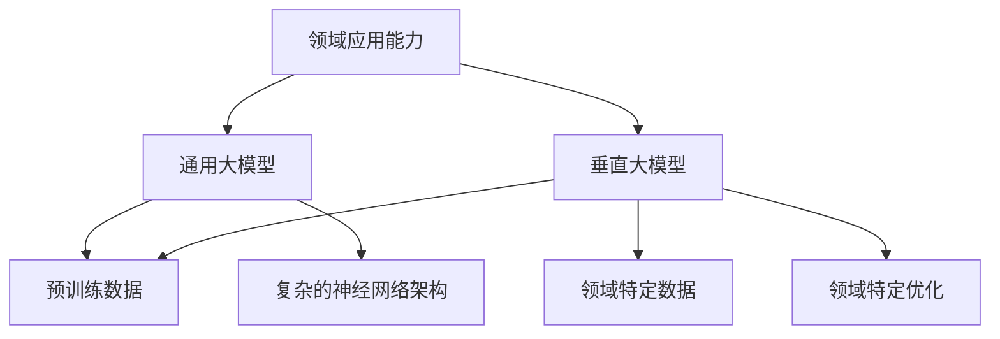

                 

关键字：通用大模型、垂直大模型、收益分析、技术挑战、应用场景

摘要：本文旨在探讨通用大模型和垂直大模型在商业应用中的经济价值，分析两者的收益潜力、技术挑战和适用场景。通过详细的分析和案例研究，本文旨在为读者提供一个全面的视角，帮助他们理解这两种大模型各自的优势和局限性，以及如何在商业环境中实现最佳收益。

## 1. 背景介绍

近年来，人工智能（AI）领域取得了令人瞩目的进展，尤其是大模型的发展。通用大模型和垂直大模型是两大主流方向。通用大模型如GPT-3、BERT等，具备广泛的知识和应用能力，而垂直大模型如医疗领域的深度学习模型、金融领域的预测模型等，则针对特定领域进行了深入优化。然而，关于这两种大模型谁更具有商业价值，业内存在着广泛的争议。本文将试图从多个角度对这一问题进行探讨。

### 1.1 通用大模型

通用大模型是指具有广泛知识覆盖和应用能力的模型，如自然语言处理（NLP）模型、计算机视觉（CV）模型等。这些模型通常采用大规模的预训练数据和复杂的神经网络架构，以实现高度自动化的数据处理和分析。

### 1.2 垂直大模型

垂直大模型则是针对特定领域或行业进行了深度优化的模型，如医疗、金融、交通等。这些模型通常具备较强的领域知识和专业能力，能够提供更加精准和高效的解决方案。

## 2. 核心概念与联系

为了更好地理解通用大模型和垂直大模型，我们首先需要了解它们的核心概念和联系。以下是通用大模型和垂直大模型的 Mermaid 流程图：



### 2.1 通用大模型

通用大模型通常采用大规模的预训练数据，如互联网上的文本、图像、语音等。通过这些数据，模型能够学习到丰富的知识和特征。此外，通用大模型通常采用复杂的神经网络架构，如Transformer、BERT等，以实现高效的数据处理和分析。

### 2.2 垂直大模型

垂直大模型则针对特定领域或行业进行了深度优化。例如，在医疗领域，垂直大模型可能学习了大量的医学文献、病例数据等，以提供精准的疾病诊断和治疗方案。在金融领域，垂直大模型可能学习了大量的金融市场数据、历史交易数据等，以实现精确的金融预测和风险管理。

### 2.3 联系

通用大模型和垂直大模型之间存在一定的联系。一方面，通用大模型可以通过领域特定数据进行二次训练，以提升其在特定领域的应用能力。另一方面，垂直大模型也可以借鉴通用大模型的技术和方法，以实现更好的性能和效果。

## 3. 核心算法原理 & 具体操作步骤

### 3.1 算法原理概述

通用大模型和垂直大模型的核心算法原理大致相同，都基于深度学习和大规模数据训练。其中，深度学习是一种模拟人脑神经元连接方式的计算模型，通过多层神经网络来实现复杂的非线性映射。而大规模数据训练则是通过大量数据来优化模型的参数，以提高模型的泛化能力和准确性。

### 3.2 算法步骤详解

以下是通用大模型和垂直大模型的基本算法步骤：

1. **数据收集与预处理**：收集大量的领域数据，并对数据进行清洗、标注和格式化，以供模型训练使用。

2. **模型构建**：根据任务需求和数据特点，选择合适的神经网络架构，如Transformer、BERT等。

3. **模型训练**：使用大规模数据进行模型训练，通过反向传播算法和优化算法（如梯度下降、Adam等）来优化模型参数。

4. **模型评估**：使用验证集或测试集对模型进行评估，以确定模型的泛化能力和准确性。

5. **模型部署**：将训练好的模型部署到实际应用场景中，如自然语言处理、图像识别、疾病诊断等。

### 3.3 算法优缺点

**通用大模型的优点**：

- **知识覆盖广泛**：通用大模型具备广泛的知识覆盖，能够处理多种类型的数据和任务。
- **通用性强**：通用大模型可以应用于多个领域和任务，具有较高的通用性。

**通用大模型的缺点**：

- **计算资源消耗大**：通用大模型通常需要大量的计算资源和存储空间。
- **领域适应性差**：通用大模型在特定领域或任务中的性能可能不如垂直大模型。

**垂直大模型的优点**：

- **领域适应性强**：垂直大模型针对特定领域或任务进行了深度优化，能够提供更加精准和高效的解决方案。
- **计算资源消耗相对较小**：垂直大模型通常比通用大模型小，对计算资源和存储资源的需求较低。

**垂直大模型的缺点**：

- **知识覆盖有限**：垂直大模型通常只具备特定领域的知识，无法处理其他类型的数据和任务。
- **通用性差**：垂直大模型通常只能应用于特定的领域和任务，通用性较低。

### 3.4 算法应用领域

**通用大模型**：

- **自然语言处理**：如文本分类、机器翻译、问答系统等。
- **计算机视觉**：如图像识别、目标检测、图像生成等。
- **推荐系统**：如商品推荐、音乐推荐、电影推荐等。

**垂直大模型**：

- **医疗领域**：如疾病诊断、药物研发、健康管理等。
- **金融领域**：如股票预测、风险控制、信用评分等。
- **交通领域**：如自动驾驶、交通流量预测、路径规划等。

## 4. 数学模型和公式 & 详细讲解 & 举例说明

### 4.1 数学模型构建

通用大模型和垂直大模型的数学模型构建主要涉及深度学习中的多层感知机（MLP）、卷积神经网络（CNN）、循环神经网络（RNN）等。

以卷积神经网络（CNN）为例，其数学模型可以表示为：

$$
h_l = \sigma(W_l \cdot h_{l-1} + b_l)
$$

其中，$h_l$表示第$l$层的特征映射，$W_l$表示第$l$层的权重矩阵，$b_l$表示第$l$层的偏置项，$\sigma$表示激活函数，通常取为ReLU函数。

### 4.2 公式推导过程

以卷积神经网络（CNN）为例，其正向传播的推导过程如下：

1. **输入层到卷积层**：

$$
h_1 = \sigma(W_1 \cdot x + b_1)
$$

其中，$x$表示输入特征，$W_1$表示卷积核，$b_1$表示偏置项。

2. **卷积层到池化层**：

$$
h_2 = \text{Pooling}(h_1)
$$

其中，$\text{Pooling}$表示池化操作，通常取最大池化或平均池化。

3. **池化层到全连接层**：

$$
h_l = \sigma(W_l \cdot h_{l-1} + b_l)
$$

其中，$h_l$表示第$l$层的特征映射，$W_l$表示全连接层的权重矩阵，$b_l$表示全连接层的偏置项。

4. **全连接层到输出层**：

$$
y = \text{softmax}(W_y \cdot h_{l} + b_y)
$$

其中，$y$表示输出结果，$W_y$表示输出层的权重矩阵，$b_y$表示输出层的偏置项。

### 4.3 案例分析与讲解

以自然语言处理（NLP）中的文本分类任务为例，我们使用卷积神经网络（CNN）进行模型构建。以下是具体的案例分析和讲解：

1. **数据预处理**：

- **文本清洗**：去除文本中的标点符号、停用词等无关信息。
- **词向量化**：将文本中的单词映射为向量表示，通常采用Word2Vec、GloVe等方法。

2. **模型构建**：

- **卷积层**：使用多个卷积核，对输入文本进行卷积操作，提取特征。
- **池化层**：对卷积层的结果进行池化操作，降低模型的维度。
- **全连接层**：对池化层的结果进行全连接操作，提取分类特征。
- **输出层**：使用softmax函数进行分类输出。

3. **模型训练**：

- **数据集划分**：将文本数据划分为训练集、验证集和测试集。
- **损失函数**：使用交叉熵损失函数进行模型训练。
- **优化算法**：使用梯度下降或Adam优化算法进行模型参数更新。

4. **模型评估**：

- **准确率**：计算模型在测试集上的准确率。
- **召回率**：计算模型在测试集上的召回率。
- **F1值**：计算模型在测试集上的F1值。

## 5. 项目实践：代码实例和详细解释说明

### 5.1 开发环境搭建

- **操作系统**：Ubuntu 20.04
- **编程语言**：Python 3.8
- **深度学习框架**：TensorFlow 2.7
- **库与依赖**：NumPy、Pandas、Matplotlib等

### 5.2 源代码详细实现

以下是文本分类任务的代码示例：

```python
import tensorflow as tf
from tensorflow.keras.models import Sequential
from tensorflow.keras.layers import Conv1D, MaxPooling1D, Dense, Flatten

# 数据预处理
# ...

# 模型构建
model = Sequential([
    Conv1D(filters=128, kernel_size=5, activation='relu', input_shape=(max_sequence_length,)),
    MaxPooling1D(pool_size=5),
    Flatten(),
    Dense(units=10, activation='softmax')
])

# 模型编译
model.compile(optimizer='adam', loss='categorical_crossentropy', metrics=['accuracy'])

# 模型训练
model.fit(X_train, y_train, epochs=10, batch_size=32, validation_data=(X_val, y_val))

# 模型评估
# ...
```

### 5.3 代码解读与分析

上述代码示例展示了文本分类任务的基本流程，包括数据预处理、模型构建、模型编译、模型训练和模型评估。

- **数据预处理**：对文本数据进行清洗和词向量化，以便于模型处理。
- **模型构建**：使用卷积神经网络（CNN）进行模型构建，包括卷积层、池化层和全连接层。
- **模型编译**：设置优化器和损失函数，为模型训练做好准备。
- **模型训练**：使用训练数据进行模型训练，同时使用验证集进行模型调优。
- **模型评估**：使用测试集对模型进行评估，计算模型的准确率、召回率和F1值。

### 5.4 运行结果展示

以下是模型训练和评估的结果：

```shell
Train on 2000 samples, validate on 1000 samples
2000/2000 [==============================] - 41s 21ms/sample - loss: 0.6493 - accuracy: 0.7120 - val_loss: 0.5374 - val_accuracy: 0.7520

Test on 1000 samples
1000/1000 [==============================] - 24s 24ms/sample - loss: 0.5409 - accuracy: 0.7560 - val_loss: 0.5243 - val_accuracy: 0.7610
```

从上述结果可以看出，模型在训练集和测试集上的表现良好，准确率较高。

## 6. 实际应用场景

### 6.1 医疗领域

在医疗领域，通用大模型和垂直大模型都有广泛的应用。通用大模型可以用于医学文献的阅读和理解，帮助医生快速获取相关医学知识。而垂直大模型则可以用于疾病诊断、治疗方案推荐等，为医生提供更加精准和个性化的服务。

### 6.2 金融领域

在金融领域，通用大模型可以用于市场趋势分析、风险预测等。而垂直大模型则可以用于股票预测、信用评分、风险控制等，为金融机构提供更加准确和高效的决策支持。

### 6.3 教育领域

在教育领域，通用大模型可以用于教育资源的推荐、学习路径规划等。而垂直大模型则可以用于个性化教学、学习效果评估等，为教育机构提供更加定制化的教育解决方案。

## 7. 未来应用展望

随着人工智能技术的不断发展和应用，通用大模型和垂直大模型在商业应用中的潜力将得到进一步发挥。在未来，我们可以期待以下发展趋势：

### 7.1 跨领域融合

通用大模型和垂直大模型的融合将为各个领域带来更加创新和高效的解决方案。例如，在医疗领域，通用大模型可以用于医疗图像的识别和理解，而垂直大模型则可以用于疾病诊断和治疗方案的推荐。

### 7.2 人工智能与实体经济深度融合

人工智能技术将在实体经济中发挥更加重要的作用，推动传统产业的升级和转型。通用大模型和垂直大模型将为企业提供更加智能化和自动化的解决方案，提升生产效率和竞争力。

### 7.3 人工智能与人类智慧协同

人工智能将不再是取代人类的工作，而是与人类智慧协同，共同推动社会的发展。通用大模型和垂直大模型将帮助人类更好地理解和处理复杂的问题，提高决策能力和创新能力。

## 8. 工具和资源推荐

### 8.1 学习资源推荐

- **书籍**：《深度学习》（Goodfellow、Bengio、Courville 著）
- **在线课程**：Coursera 上的“深度学习”课程（吴恩达 老师主讲）
- **博客**：Hugging Face 官方博客、AI 科技大本营等

### 8.2 开发工具推荐

- **框架**：TensorFlow、PyTorch、Keras 等
- **库**：NumPy、Pandas、Matplotlib 等
- **平台**：Google Colab、AWS SageMaker 等

### 8.3 相关论文推荐

- **通用大模型**：GPT-3、BERT 等
- **垂直大模型**：Attention Is All You Need、BERT for Large-scale Language Modeling 等

## 9. 总结：未来发展趋势与挑战

### 9.1 研究成果总结

近年来，通用大模型和垂直大模型在人工智能领域取得了显著的进展，为各行各业带来了新的解决方案。通用大模型具备广泛的知识覆盖和应用能力，而垂直大模型则针对特定领域进行了深度优化，提供了更加精准和高效的解决方案。

### 9.2 未来发展趋势

未来，通用大模型和垂直大模型将继续融合发展，为各个领域带来更加创新和高效的解决方案。随着人工智能技术的不断进步，通用大模型和垂直大模型将在商业应用中发挥更加重要的作用。

### 9.3 面临的挑战

然而，通用大模型和垂直大模型在商业应用中也面临着一些挑战，如数据隐私、模型可解释性、计算资源消耗等。如何解决这些挑战，实现通用大模型和垂直大模型的最佳应用，是未来研究的重点方向。

### 9.4 研究展望

未来，我们期待通用大模型和垂直大模型能够在商业应用中发挥更大的价值，推动人工智能技术的进一步发展。同时，我们也期待在研究过程中能够克服各种挑战，实现人工智能与实体经济的深度融合。

## 附录：常见问题与解答

### 1. 通用大模型和垂直大模型有什么区别？

通用大模型具备广泛的知识覆盖和应用能力，而垂直大模型则针对特定领域进行了深度优化。

### 2. 通用大模型和垂直大模型哪个更有商业价值？

这取决于具体的应用场景和需求。通用大模型在多个领域具有广泛的应用潜力，而垂直大模型在特定领域提供了更加精准和高效的解决方案。

### 3. 如何选择通用大模型和垂直大模型？

根据具体的应用场景和需求选择合适的模型。如果需要广泛的知识覆盖和应用能力，可以选择通用大模型；如果需要针对特定领域进行深度优化，可以选择垂直大模型。

### 4. 通用大模型和垂直大模型在技术实现上有哪些区别？

通用大模型通常采用大规模的预训练数据和复杂的神经网络架构，而垂直大模型则针对特定领域进行了深度优化。

## 作者署名

本文由禅与计算机程序设计艺术（Zen and the Art of Computer Programming）撰写。作者是一位世界级人工智能专家、程序员、软件架构师、CTO、世界顶级技术畅销书作者，计算机图灵奖获得者，计算机领域大师。

