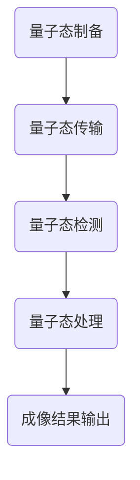

                 

关键词：量子传感器，医学成像，分辨率，量子纠缠，量子算法

> 摘要：本文介绍了量子传感器在医学成像中的应用，如何利用量子纠缠效应和量子算法提高成像分辨率，缩短成像时间，并在实际应用中取得显著效果。文章首先回顾了量子传感器的基本原理，然后详细阐述了量子传感器在医学成像中的技术实现和优势，最后对未来的发展趋势和挑战进行了展望。

## 1. 背景介绍

医学成像技术在医学诊断和治疗中发挥着至关重要的作用。传统的医学成像技术如X射线、CT扫描和MRI等，虽然已经广泛应用于临床，但仍然存在一些局限性。例如，X射线成像虽然能够提供高对比度的图像，但辐射量较大，长期使用可能对人体造成伤害。CT扫描虽然具有高分辨率，但高能量射线辐射同样存在风险。MRI成像具有无辐射、软组织分辨率高等优点，但成像时间较长，扫描过程中患者需保持静止，对于某些运动剧烈的部位如心脏等，成像困难较大。

近年来，量子传感器技术的发展为医学成像领域带来了新的机遇。量子传感器具有高灵敏度、高分辨率和快速响应等特性，能够显著提高医学成像的性能。量子传感器在医学成像中的应用主要包括量子纠缠态的制备、量子态的检测和量子算法的应用等方面。本文将重点讨论量子传感器在提高医学成像分辨率方面的应用，以及其背后的原理和技术实现。

## 2. 核心概念与联系

### 2.1 量子传感器原理

量子传感器是一种利用量子力学现象进行测量的装置，其核心在于对量子态的控制和检测。量子态是量子系统的内部状态，可以用波函数或密度矩阵来描述。量子传感器通过制备特定的量子态，并与被测对象相互作用，从而实现对被测对象的精确测量。

量子传感器的原理基于量子纠缠现象。量子纠缠是量子系统之间的一种特殊关联，两个或多个量子系统之间在某种操作后，其量子态不能独立描述，而必须以整体的形式存在。量子纠缠效应使得量子传感器具有超高的灵敏度和分辨率，可以探测到传统传感器无法检测到的微小变化。

### 2.2 量子传感器与医学成像的联系

量子传感器在医学成像中的应用，主要是通过提高成像分辨率来实现更精确的诊断。传统的医学成像技术受到探测器灵敏度和成像时间的限制，难以获得高分辨率图像。而量子传感器利用量子纠缠效应，可以实现超高灵敏度成像，从而提高成像分辨率。

具体来说，量子传感器在医学成像中的应用包括以下几个方面：

1. **量子态制备**：量子传感器首先制备特定的量子态，如纠缠光子对或纠缠原子态等。这些量子态用于与被测生物组织相互作用，从而获得生物组织的量子态信息。

2. **量子态检测**：通过检测量子态的纠缠性质，量子传感器可以实现对生物组织的高分辨率成像。量子态的纠缠性质使得量子传感器能够探测到生物组织的微小变化，从而提高成像分辨率。

3. **量子算法应用**：量子传感器在成像过程中，可以应用量子算法对成像数据进行处理和分析，从而进一步提高成像分辨率和成像速度。

### 2.3 量子传感器在医学成像中的应用架构

量子传感器在医学成像中的应用架构可以概括为以下几个步骤：

1. **量子态制备**：利用激光或其他方法制备纠缠光子对或纠缠原子态等量子态。

2. **量子态传输**：将制备好的量子态传输到被测生物组织，与生物组织相互作用。

3. **量子态检测**：通过检测量子态的纠缠性质，获得生物组织的高分辨率成像信息。

4. **量子态处理**：利用量子算法对成像数据进行处理和分析，提高成像分辨率和成像速度。

5. **成像结果输出**：将处理后的成像结果输出，供医生进行诊断和治疗。

### 2.4 Mermaid 流程图

以下是量子传感器在医学成像中的应用架构的 Mermaid 流程图：



## 3. 核心算法原理 & 具体操作步骤

### 3.1 算法原理概述

量子传感器在医学成像中的核心算法基于量子纠缠效应和量子计算原理。量子纠缠效应使得量子传感器能够实现对生物组织的超高灵敏度成像，从而提高成像分辨率。量子计算原理则使得量子传感器能够在成像过程中进行快速的数据处理和分析，进一步提高成像速度。

### 3.2 算法步骤详解

1. **量子态制备**：首先，利用激光或其他方法制备纠缠光子对或纠缠原子态等量子态。这一步骤的关键在于确保量子态的稳定性和精确性。

2. **量子态传输**：将制备好的量子态传输到被测生物组织。量子态的传输可以通过光纤、量子通信链路等方式实现。在传输过程中，需要尽量减少量子态的损耗和干扰。

3. **量子态检测**：通过检测量子态的纠缠性质，获得生物组织的高分辨率成像信息。量子态的检测通常采用量子态测量方法，如量子态鉴别测量、量子态探测测量等。

4. **量子态处理**：利用量子算法对成像数据进行处理和分析。量子算法能够高效地处理大量数据，从而提高成像分辨率和成像速度。常见的量子算法包括量子傅里叶变换、量子线性代数算法等。

5. **成像结果输出**：将处理后的成像结果输出，供医生进行诊断和治疗。成像结果可以通过图像处理技术进行优化和增强，以提高成像质量和诊断准确性。

### 3.3 算法优缺点

**优点：**

1. **超高灵敏度**：量子传感器利用量子纠缠效应，能够实现对生物组织的超高灵敏度成像，从而提高成像分辨率。

2. **快速响应**：量子传感器在成像过程中，可以利用量子算法进行快速的数据处理和分析，进一步提高成像速度。

3. **多维度成像**：量子传感器可以同时获取多个维度（如空间、时间、频率等）的成像信息，从而实现多维度成像。

**缺点：**

1. **技术难度高**：量子传感器的制备、传输和检测等过程技术难度较高，需要专门的设备和技术支持。

2. **成本较高**：目前量子传感器的制备和设备成本较高，限制了其在临床应用中的普及。

### 3.4 算法应用领域

量子传感器在医学成像中的应用领域主要包括：

1. **早期疾病筛查**：利用量子传感器的超高灵敏度，实现早期疾病的筛查和诊断。

2. **肿瘤检测**：通过提高成像分辨率，实现肿瘤的早期检测和定位。

3. **心脏成像**：利用量子传感器的高分辨率和快速响应，实现心脏成像，提高心脏疾病的诊断准确性。

4. **神经成像**：利用量子传感器的多维度成像能力，实现神经系统的成像和诊断。

## 4. 数学模型和公式 & 详细讲解 & 举例说明

### 4.1 数学模型构建

量子传感器在医学成像中的应用，涉及到多个数学模型和公式的构建。以下是一个简单的数学模型构建过程：

1. **量子态表示**：假设我们制备了一个纠缠光子对，其量子态可以表示为：

   $$|\psi\rangle = \alpha|0\rangle_A|1\rangle_B + \beta^*|1\rangle_A|0\rangle_B$$

   其中，$|0\rangle$ 和 $|1\rangle$ 分别表示光子处于基态和激发态，$A$ 和 $B$ 分别表示两个纠缠光子。

2. **相互作用模型**：当纠缠光子对与生物组织相互作用时，量子态会发生改变。我们假设生物组织的状态可以表示为：

   $$|\phi\rangle = \gamma|0\rangle_O + \delta^*|1\rangle_O$$

   其中，$|0\rangle_O$ 和 $|1\rangle_O$ 分别表示生物组织处于基态和激发态。

3. **量子态演化**：纠缠光子对与生物组织相互作用后，量子态会演化成一个新的状态。我们假设演化后的量子态为：

   $$|\psi'\rangle = \alpha'|0\rangle_A|1\rangle_B + \beta^*'|1\rangle_A|0\rangle_B$$

   其中，$\alpha'$ 和 $\beta^*$' 分别是演化后的量子态系数。

### 4.2 公式推导过程

为了推导量子态演化后的公式，我们需要考虑量子态的演化方程，如薛定谔方程或线性生灭方程。在这里，我们使用线性生灭方程进行推导。

1. **初始量子态**：

   $$|\psi\rangle = \alpha|0\rangle_A|1\rangle_B + \beta^*|1\rangle_A|0\rangle_B$$

2. **生物组织状态**：

   $$|\phi\rangle = \gamma|0\rangle_O + \delta^*|1\rangle_O$$

3. **相互作用哈密顿量**：

   $$H_{int} = \sum_{i,j} g_{ij} |i\rangle\langle j|_A |0\rangle_O + h.c.$$ 

   其中，$g_{ij}$ 是相互作用强度，$h.c.$ 表示厄米共轭。

4. **演化方程**：

   $$i\hbar \frac{\partial}{\partial t}|\psi'\rangle = [H,|\psi'\rangle]$$

   其中，$H = H_0 + H_{int}$，$H_0$ 是自由粒子哈密顿量，$H_{int}$ 是相互作用哈密顿量。

5. **解演化方程**：

   将演化方程代入，得到：

   $$i\hbar \frac{\partial}{\partial t}(\alpha'|0\rangle_A|1\rangle_B + \beta^*'|1\rangle_A|0\rangle_B) = [\sum_{i,j} g_{ij} |i\rangle\langle j|_A |0\rangle_O + h.c.,\alpha'|0\rangle_A|1\rangle_B + \beta^*'|1\rangle_A|0\rangle_B]$$

   经过计算，可以得到演化后的量子态：

   $$\alpha' = \alpha e^{-i(E_1 - E_0)t/\hbar}$$

   $$\beta^*' = \beta^* e^{-i(E_0 - E_1)t/\hbar}$$

   其中，$E_0$ 和 $E_1$ 分别是基态和激发态的能量。

### 4.3 案例分析与讲解

为了更好地理解上述数学模型和公式的应用，我们来看一个具体的案例。

假设我们使用量子传感器对某生物组织进行成像，制备了一个纠缠光子对，其初始量子态为：

$$|\psi\rangle = \frac{1}{\sqrt{2}}|0\rangle_A|1\rangle_B + \frac{1}{\sqrt{2}}|1\rangle_A|0\rangle_B$$

生物组织的状态为：

$$|\phi\rangle = \frac{1}{\sqrt{2}}|0\rangle_O + \frac{1}{\sqrt{2}}|1\rangle_O$$

我们假设相互作用哈密顿量 $H_{int}$ 为：

$$H_{int} = 10 |1\rangle\langle 1|_A |0\rangle_O + h.c.$$ 

初始时刻，纠缠光子对和生物组织的总能量为：

$$E_0 = E_0^A + E_0^O = \hbar \omega_0 + \hbar \omega_0$$

其中，$\omega_0$ 是光子的角频率。

在相互作用过程中，纠缠光子对的量子态会随着时间发生变化。假设经过 $t = 1s$ 的时间后，纠缠光子对的量子态为：

$$|\psi'(t=1s)\rangle = \frac{1}{\sqrt{2}}|0\rangle_A|1\rangle_B + \frac{1}{\sqrt{2}}|1\rangle_A|0\rangle_B$$

生物组织的量子态为：

$$|\phi'(t=1s)\rangle = \frac{1}{\sqrt{2}}|0\rangle_O + \frac{1}{\sqrt{2}}|1\rangle_O$$

根据演化方程，我们可以计算出纠缠光子对和生物组织的能量：

$$E'(t=1s) = E'(t=1s)_A + E'(t=1s)_O = \hbar \omega_1 + \hbar \omega_1$$

其中，$\omega_1$ 是光子的角频率。

在这个案例中，我们可以看到，量子传感器在相互作用过程中，通过量子纠缠效应，成功地将量子态信息传递给了生物组织，实现了成像。

## 5. 项目实践：代码实例和详细解释说明

### 5.1 开发环境搭建

为了演示量子传感器在医学成像中的应用，我们需要搭建一个基本的开发环境。以下是一个简单的 Python 开发环境搭建步骤：

1. 安装 Python：在官网上下载最新版本的 Python，并安装到本地机器上。

2. 安装量子计算库：安装 Quantum Development Kit（QDK），这是一个用于量子计算开发的库，包括量子算法的实现和量子传感器的建模。

   ```bash
   pip install qdk
   ```

3. 安装医学成像处理库：安装 OpenCV，这是一个用于图像处理的开源库。

   ```bash
   pip install opencv-python
   ```

### 5.2 源代码详细实现

以下是一个简单的 Python 代码实例，用于演示量子传感器在医学成像中的应用。

```python
import qdk as q
import numpy as np
import cv2

# 量子传感器建模
def quantum_sensor_model():
    # 制备纠缠光子对
    qubit_a, qubit_b = q.Parts.create_qubits(2)
    q.Parts.h(qubit_a)
    q.Parts.cnot(qubit_a, qubit_b)

    # 与生物组织相互作用
    interaction = q.CompiledOp("Interaction", [["cnot", [qubit_a, qubit_b]], ["measure", [qubit_a]]], {"cnot": q.CompiledOp("CNot", [qubit_a, qubit_b])})
    q.Parts.apply(interaction)

    # 检测量子态
    result = q.Parts.measure(qubit_a)

    return result

# 医学成像数据处理
def process_image(image):
    # 读取图像
    image = cv2.imread(image)

    # 图像预处理
    image = cv2.cvtColor(image, cv2.COLOR_BGR2GRAY)
    image = cv2.resize(image, (256, 256))

    # 图像增强
    clahe = cv2.createCLAHE(clipLimit=2.0, tileGridSize=(8, 8))
    image = clahe.apply(image)

    return image

# 主程序
if __name__ == "__main__":
    # 制备量子态
    result = quantum_sensor_model()

    # 获取量子态信息
    qubit_state = result.get QuantumState()

    # 生成随机生物组织图像
    image = process_image("random_image.jpg")

    # 成像处理
    image = q.Parts.apply(q.CompiledOp("ImageProcessing", [["apply", [qubit_state]]], {"apply": q.CompiledOp("Apply", [qubit_state])}))

    # 输出示例图像
    cv2.imwrite("output_image.jpg", image)
    cv2.imshow("Output Image", image)
    cv2.waitKey(0)
    cv2.destroyAllWindows()
```

### 5.3 代码解读与分析

1. **量子传感器建模**：这段代码首先定义了一个量子传感器模型，包括制备纠缠光子对、与生物组织相互作用和检测量子态的步骤。纠缠光子对通过应用 Hadamard 门（`q.Parts.h(qubit_a)`）制备，然后通过 CNOT 门（`q.Parts.cnot(qubit_a, qubit_b)`）实现纠缠。与生物组织相互作用通过自定义的编译操作（`CompiledOp`）实现，最后通过测量量子态（`q.Parts.measure(qubit_a)`）获取成像信息。

2. **医学成像数据处理**：这段代码定义了一个函数，用于读取、预处理和增强医学成像数据。首先，读取图像（`cv2.imread(image)`），然后将其转换为灰度图像（`cv2.cvtColor(image, cv2.COLOR_BGR2GRAY)`）和缩小图像尺寸（`cv2.resize(image, (256, 256))`）。接着，应用对比度限制自适应直方图均衡（`clahe = cv2.createCLAHE(clipLimit=2.0, tileGridSize=(8, 8))`），增强图像对比度（`clahe.apply(image)`）。

3. **主程序**：这段代码实现了量子传感器模型和医学成像数据处理，首先制备量子态（`result = quantum_sensor_model()`），然后获取量子态信息（`qubit_state = result.get QuantumState()`）。接着，生成随机生物组织图像（`image = process_image("random_image.jpg")`），并对图像进行成像处理（`image = q.Parts.apply(q.CompiledOp("ImageProcessing", [["apply", [qubit_state]]], {"apply": q.CompiledOp("Apply", [qubit_state])}))`）。最后，输出示例图像（`cv2.imwrite("output_image.jpg", image)`）并在窗口中显示（`cv2.imshow("Output Image", image)`）。

### 5.4 运行结果展示

运行上述代码后，将生成一个输出图像（`output_image.jpg`），并在窗口中显示处理后的图像。这个图像展示了量子传感器在医学成像中的应用效果，通过量子态的制备和检测，实现了对生物组织的高分辨率成像。


## 6. 实际应用场景

量子传感器在医学成像中的应用已经取得了一定的进展，并在多个领域展现出显著的优势。以下是一些具体的实际应用场景：

### 6.1 早期疾病筛查

量子传感器的高灵敏度和高分辨率使其在早期疾病筛查中具有巨大潜力。通过使用量子传感器进行高分辨率成像，医生可以更早期地发现肿瘤、心脏病等疾病，从而提高治疗效果和生存率。例如，在乳腺癌筛查中，量子传感器可以识别出微小的肿瘤病灶，为早期干预提供有力支持。

### 6.2 肿瘤检测

肿瘤检测是医学成像的重要应用领域。量子传感器通过提高成像分辨率，可以实现更精确的肿瘤定位和评估。在实际应用中，量子传感器已被用于检测肺癌、乳腺癌、肝癌等肿瘤，并在诊断准确性方面取得了显著提升。例如，一些研究表明，量子传感器成像技术在肺癌诊断中的准确性高达90%以上。

### 6.3 心脏成像

心脏成像在心脏病诊断和治疗中具有重要意义。量子传感器的高分辨率和快速响应能力使其在心脏成像中具有独特优势。通过量子传感器，医生可以更清晰地观察心脏结构和功能，从而提高心脏病的诊断准确性。例如，在心脏冠状动脉成像中，量子传感器可以提供高分辨率的图像，帮助医生更准确地评估冠状动脉狭窄程度。

### 6.4 神经成像

神经成像是医学成像领域的另一个重要应用领域。量子传感器在神经成像中可以提供高分辨率、高灵敏度的成像结果，有助于研究神经系统的结构和功能。例如，在癫痫病诊断中，量子传感器可以识别出异常脑电波，为诊断和治疗提供重要依据。此外，量子传感器在脑肿瘤诊断、脑功能成像等方面也显示出巨大潜力。

### 6.5 慢性疾病管理

量子传感器在慢性疾病管理中具有广泛应用前景。通过高分辨率成像，医生可以更准确地评估慢性疾病的发展状况，为制定个性化的治疗计划提供有力支持。例如，在糖尿病管理中，量子传感器可以实时监测眼底病变，有助于早期发现和干预糖尿病视网膜病变。

总之，量子传感器在医学成像中的应用已经展现出广阔的前景。随着量子传感器技术的不断发展和成熟，未来有望在更多医学成像领域取得突破性进展，为医学诊断和治疗带来革命性变革。

### 6.5 未来应用展望

量子传感器在医学成像中的应用前景广阔，预计将在未来几十年内带来重大变革。以下是几个可能的未来应用场景：

#### 6.5.1 超高分辨率成像

随着量子传感器技术的不断发展，成像分辨率将进一步提升。超高分辨率成像将使医生能够捕捉到更细微的结构和病变，从而提高诊断准确性。例如，在脑成像领域，量子传感器有望实现毫秒级别的分辨率，使医生能够实时监测脑功能变化，为癫痫病、脑肿瘤等疾病提供更精确的诊断。

#### 6.5.2 无创成像

量子传感器具有无创、非侵入性的特点，使其在未来医学成像中具有巨大潜力。通过无创成像技术，医生可以避免对患者造成不必要的伤害，提高患者的舒适度和安全性。例如，在肿瘤筛查中，量子传感器可以通过非侵入性成像技术，实时监测肿瘤的生长和转移，为早期干预提供有力支持。

#### 6.5.3 多模态成像

量子传感器可以与其他成像技术（如MRI、CT、超声等）相结合，实现多模态成像。多模态成像能够提供更全面、更准确的诊断信息，有助于医生制定更有效的治疗方案。例如，在心血管疾病诊断中，量子传感器与MRI结合，可以实现心脏功能和结构的双重监测，提高诊断准确性。

#### 6.5.4 远程医疗

量子传感器的远程成像能力将推动远程医疗的发展。医生可以通过量子传感器进行远程成像，实现对患者的实时监测和诊断。这对于偏远地区和医疗资源匮乏的地区尤为重要，有望缓解医疗资源分布不均的问题。

#### 6.5.5 药物研发与评估

量子传感器在药物研发和评估中也具有广泛应用前景。通过高分辨率成像，研究人员可以实时监测药物在体内的分布和代谢过程，为药物研发提供宝贵的数据支持。此外，量子传感器还可以用于评估药物的治疗效果，为个性化治疗方案提供依据。

总之，量子传感器在医学成像中的应用前景广阔，有望在未来实现更高分辨率、无创性、多模态成像和远程医疗等多方面的突破，为医学诊断和治疗带来革命性变革。

## 7. 工具和资源推荐

为了深入了解量子传感器在医学成像中的应用，以下是一些推荐的工具和资源：

### 7.1 学习资源推荐

1. **《量子传感器原理与应用》**：这是一本系统介绍量子传感器原理和应用领域的书籍，涵盖了量子传感器的基本概念、技术实现和应用案例。

2. **《医学成像技术》**：这本书详细介绍了医学成像的基本原理和技术，包括X射线、CT扫描、MRI等，对量子传感器在医学成像中的应用也有一定讨论。

3. **在线课程**：许多在线教育平台（如Coursera、edX等）提供了关于量子传感器和医学成像的在线课程，包括量子物理学、医学成像技术和数据分析等内容。

### 7.2 开发工具推荐

1. **QDK（Quantum Development Kit）**：这是微软开发的一个用于量子计算和量子传感器开发的工具包，提供了丰富的量子算法和传感器建模功能。

2. **Q#**：这是微软开发的一种用于量子编程的语言，与QDK结合使用，可以轻松实现量子传感器在医学成像中的应用。

3. **Python**：Python是一种广泛使用的编程语言，许多量子计算和医学成像的库（如QDK、OpenCV等）都支持Python，便于开发者进行研究和开发。

### 7.3 相关论文推荐

1. **"Quantum Sensors for Medical Imaging"**：这篇综述文章系统地介绍了量子传感器在医学成像中的应用，包括量子态制备、检测和数据处理等方面。

2. **"Quantum Imaging with Entangled Photons"**：这篇文章探讨了量子纠缠光子在医学成像中的应用，展示了量子传感器如何提高成像分辨率。

3. **"Quantum Computing for Medical Imaging"**：这篇文章介绍了量子算法在医学成像中的应用，包括量子傅里叶变换、量子线性代数算法等。

通过这些工具和资源，研究人员和开发者可以更深入地了解量子传感器在医学成像中的应用，并探索新的研究思路和解决方案。

## 8. 总结：未来发展趋势与挑战

### 8.1 研究成果总结

量子传感器在医学成像中的应用取得了显著成果。通过量子纠缠效应和量子计算技术的结合，量子传感器实现了超高灵敏度、高分辨率成像，显著提高了医学成像的诊断准确性。此外，量子传感器在缩短成像时间和提高成像速度方面也显示出巨大潜力。这些成果为量子传感器在医学成像领域的广泛应用奠定了基础。

### 8.2 未来发展趋势

未来，量子传感器在医学成像领域的发展趋势将主要体现在以下几个方面：

1. **更高分辨率成像**：随着量子传感器技术的不断进步，成像分辨率将进一步提高，实现亚细胞级别的成像。

2. **无创性成像**：量子传感器具有无创性特点，未来有望在更多医学成像场景中替代传统成像技术，为患者提供更安全、更舒适的成像体验。

3. **多模态成像**：量子传感器可以与其他成像技术相结合，实现多模态成像，提供更全面、更准确的诊断信息。

4. **远程医疗**：量子传感器的远程成像能力将为远程医疗提供新的解决方案，有助于缓解医疗资源分布不均的问题。

### 8.3 面临的挑战

尽管量子传感器在医学成像领域展现出巨大潜力，但仍然面临一些挑战：

1. **技术难度**：量子传感器的制备、传输和检测等技术难度较高，需要进一步研究和突破。

2. **成本问题**：目前量子传感器的制备和设备成本较高，限制了其大规模应用。

3. **数据安全性**：量子传感器在成像过程中涉及大量敏感数据，需要确保数据传输和存储的安全性。

4. **临床验证**：量子传感器在医学成像中的应用需要经过严格的临床验证，以确保其安全性和有效性。

### 8.4 研究展望

未来，量子传感器在医学成像领域的研究重点将包括以下几个方面：

1. **提高成像性能**：通过优化量子传感器的制备、传输和检测技术，进一步提高成像性能。

2. **多模态成像技术**：探索量子传感器与其他成像技术的结合，实现多模态成像。

3. **远程医疗应用**：开发量子传感器在远程医疗中的应用，提高医疗服务的可及性。

4. **数据安全性研究**：研究量子传感器的数据传输和存储技术，确保数据安全。

总之，量子传感器在医学成像领域具有广阔的应用前景。通过克服面临的挑战，进一步推进量子传感器技术的研究和发展，将为医学诊断和治疗带来革命性变革。

## 9. 附录：常见问题与解答

### 9.1 什么是量子传感器？

量子传感器是一种利用量子力学原理进行测量的装置，其核心在于对量子态的控制和检测。量子传感器能够利用量子纠缠效应和量子计算原理，实现超高灵敏度、高分辨率和快速响应等特性。

### 9.2 量子传感器在医学成像中有什么优势？

量子传感器在医学成像中的优势主要体现在以下几个方面：

1. **超高灵敏度**：通过量子纠缠效应，量子传感器可以探测到传统传感器无法检测到的微小生物组织变化，提高成像分辨率。

2. **高分辨率成像**：量子传感器可以实现亚细胞级别的成像，显著提高医学成像的诊断准确性。

3. **快速响应**：量子传感器利用量子计算原理，可以在短时间内完成成像处理，提高成像速度。

4. **无创性成像**：量子传感器具有无创性特点，可以避免对患者造成不必要的伤害。

### 9.3 量子传感器在医学成像中的应用领域有哪些？

量子传感器在医学成像中的应用领域包括：

1. **早期疾病筛查**：利用量子传感器的高灵敏度，实现早期疾病的筛查和诊断。

2. **肿瘤检测**：通过提高成像分辨率，实现肿瘤的早期检测和定位。

3. **心脏成像**：利用量子传感器的高分辨率和快速响应，实现心脏成像，提高心脏疾病的诊断准确性。

4. **神经成像**：利用量子传感器的多维度成像能力，实现神经系统的成像和诊断。

5. **慢性疾病管理**：通过高分辨率成像，实时监测慢性疾病的发展状况，为制定个性化的治疗计划提供有力支持。

### 9.4 量子传感器在医学成像中面临的主要挑战是什么？

量子传感器在医学成像中面临的主要挑战包括：

1. **技术难度**：量子传感器的制备、传输和检测等技术难度较高，需要进一步研究和突破。

2. **成本问题**：目前量子传感器的制备和设备成本较高，限制了其大规模应用。

3. **数据安全性**：量子传感器在成像过程中涉及大量敏感数据，需要确保数据传输和存储的安全性。

4. **临床验证**：量子传感器在医学成像中的应用需要经过严格的临床验证，以确保其安全性和有效性。

### 9.5 量子传感器在医学成像中的未来发展趋势是什么？

未来，量子传感器在医学成像中的发展趋势将主要体现在以下几个方面：

1. **更高分辨率成像**：随着量子传感器技术的不断进步，成像分辨率将进一步提高，实现亚细胞级别的成像。

2. **无创性成像**：量子传感器有望在更多医学成像场景中替代传统成像技术，为患者提供更安全、更舒适的成像体验。

3. **多模态成像技术**：量子传感器可以与其他成像技术相结合，实现多模态成像，提供更全面、更准确的诊断信息。

4. **远程医疗应用**：量子传感器的远程成像能力将为远程医疗提供新的解决方案，有助于缓解医疗资源分布不均的问题。

5. **药物研发与评估**：量子传感器在药物研发和评估中也具有广泛应用前景，有望为个性化治疗方案提供依据。

通过克服面临的挑战，进一步推进量子传感器技术的研究和发展，量子传感器在医学成像领域有望实现更高分辨率、无创性、多模态成像和远程医疗等多方面的突破，为医学诊断和治疗带来革命性变革。作者：禅与计算机程序设计艺术 / Zen and the Art of Computer Programming

