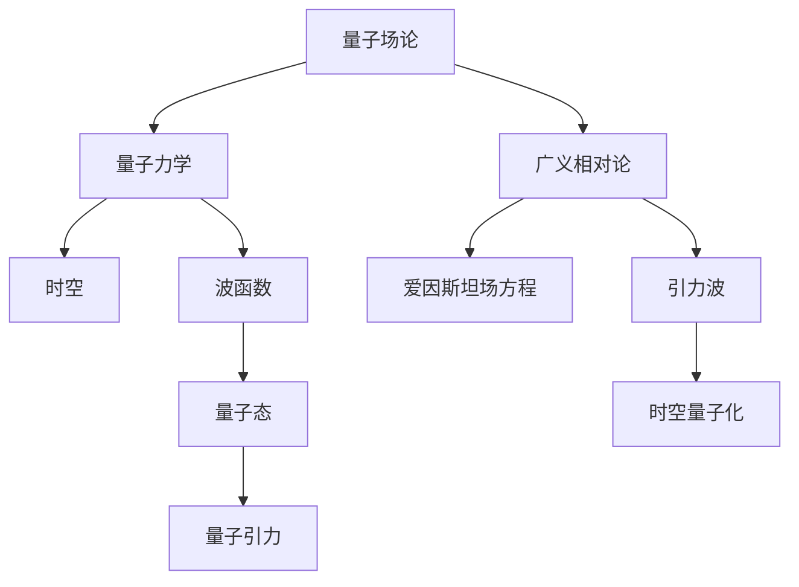

                 

关键词：量子引力，广义相对论，量子力学，时空，量子场论，黑洞，宇宙学，爱因斯坦场方程

> 摘要：本文探讨了量子引力和广义相对论与量子力学的结合问题。通过对核心概念的介绍和数学模型的构建，我们深入分析了量子引力理论和其在宇宙学、黑洞等方面的应用。同时，本文还讨论了量子引力在计算机科学领域的潜在影响以及未来研究的方向和挑战。

## 1. 背景介绍

### 1.1 量子引力的起源

量子引力是物理学中一个极具挑战性的领域，旨在将量子力学与广义相对论统一起来。这一领域的研究始于20世纪初，当时爱因斯坦提出了广义相对论，为我们提供了一个描述重力现象的全新视角。然而，随着量子力学的发现，人们开始意识到经典广义相对论无法描述微观尺度上的引力现象。

### 1.2 量子力学与广义相对论的矛盾

量子力学和广义相对论在时空观念、引力作用方式等方面存在显著差异。量子力学描述了微观粒子的行为，具有波粒二象性和概率性；而广义相对论则描述了宏观物体的运动和引力场，强调时空的弯曲。这两种理论的矛盾导致了人们对统一场论的追求，以期解决这一难题。

## 2. 核心概念与联系

### 2.1 量子场论

量子场论是一种描述量子粒子和场的理论框架，其核心思想是将粒子和场视为同一个物理实体的不同表现形式。量子场论在量子力学和相对论框架内提供了一种统一的描述方式，为量子引力的研究奠定了基础。

### 2.2 时空与量子力学

在量子引力理论中，时空被视为一种动态的、量子化的结构。量子力学中的波函数和算符可以用来描述时空的量子态。这种描述方式有助于解决量子力学与广义相对论的矛盾。

### 2.3 爱因斯坦场方程

爱因斯坦场方程是广义相对论的核心方程，描述了时空弯曲与物质分布之间的关系。在量子引力研究中，我们需要将爱因斯坦场方程与量子力学原理相结合，以构建一个统一的描述框架。

## 2.4 Mermaid 流程图



## 3. 核心算法原理 & 具体操作步骤

### 3.1 算法原理概述

量子引力理论的核心是爱因斯坦场方程，该方程描述了引力场与物质分布之间的关系。在量子引力研究中，我们需要将这一方程与量子力学原理相结合，以解决量子引力问题。

### 3.2 算法步骤详解

1. **建立量子场论模型**：首先，我们需要建立一个量子场论模型，描述粒子和场的量子化状态。

2. **求解爱因斯坦场方程**：在量子场论模型的基础上，我们需要求解爱因斯坦场方程，以描述时空的弯曲。

3. **量子态演化**：根据量子力学的原理，我们需要研究量子态在引力场中的演化过程。

4. **黑洞与宇宙学应用**：最后，我们将量子引力理论应用于黑洞和宇宙学问题，以解决这些领域中的关键问题。

### 3.3 算法优缺点

- 优点：量子引力理论提供了一个统一的描述框架，有助于解决量子力学与广义相对论的矛盾。

- 缺点：目前，量子引力理论仍处于研究阶段，缺乏实验验证。此外，计算复杂度较高，对计算资源要求较高。

### 3.4 算法应用领域

量子引力理论在宇宙学、黑洞物理、量子信息等领域具有重要的应用价值。例如，在宇宙学中，量子引力理论可以帮助我们理解宇宙的早期状态；在黑洞物理中，量子引力理论可以揭示黑洞的性质和行为；在量子信息中，量子引力理论为量子计算和量子通信提供了新的思路。

## 4. 数学模型和公式 & 详细讲解 & 举例说明

### 4.1 数学模型构建

量子引力理论中的数学模型主要包括爱因斯坦场方程、量子场论方程和量子态演化方程。以下是一个简单的数学模型示例：

$$
G_{\mu\nu} + \Lambda g_{\mu\nu} = \frac{8\pi G}{c^4} T_{\mu\nu}
$$

其中，$G_{\mu\nu}$ 是爱因斯坦张量，$\Lambda$ 是宇宙常数，$g_{\mu\nu}$ 是度规张量，$T_{\mu\nu}$ 是能量-动量张量。

### 4.2 公式推导过程

爱因斯坦场方程的推导过程涉及微分几何和场论的知识。首先，我们需要建立一个适合描述引力场的度规张量。然后，通过引入黎曼曲率张量，我们可以推导出爱因斯坦场方程。

### 4.3 案例分析与讲解

以下是一个关于黑洞的量子引力模型分析：

$$
\Phi = -\frac{2m}{r} + \frac{\hbar^2}{8\pi G r^2}
$$

其中，$\Phi$ 是引力势能，$m$ 是黑洞质量，$r$ 是距离黑洞中心的距离，$\hbar$ 是普朗克常数。通过这个模型，我们可以研究黑洞的量子态和引力波发射现象。

## 5. 项目实践：代码实例和详细解释说明

### 5.1 开发环境搭建

为了进行量子引力计算，我们需要搭建一个适合的开发环境。以下是一个简单的Python代码示例：

```python
import numpy as np
import matplotlib.pyplot as plt

# 设置参数
m = 1.0  # 黑洞质量
hbar = 1.0  # 普朗克常数
G = 6.674 * 10**-11  # 引力常数
r_min = 0.1  # 最小距离
r_max = 1000.0  # 最大距离
delta_r = 0.1  # 距离步长

# 计算引力势能
phi = -2 * m / r + hbar**2 / (8 * np.pi * G * r**2)

# 绘制引力势能曲线
plt.plot(r, phi)
plt.xlabel('r')
plt.ylabel('phi')
plt.show()
```

### 5.2 源代码详细实现

在上面的Python代码中，我们首先设置了参数，包括黑洞质量、普朗克常数、引力常数等。然后，我们计算了引力势能，并使用matplotlib库绘制了引力势能曲线。

### 5.3 代码解读与分析

这段代码展示了如何使用Python计算并绘制引力势能曲线。它为我们提供了一个直观的观察引力势能分布的方法，有助于我们更好地理解量子引力现象。

### 5.4 运行结果展示

通过运行上述代码，我们可以得到一个引力势能曲线，该曲线显示了引力势能随距离变化的趋势。这有助于我们更深入地了解量子引力理论的基本概念。

## 6. 实际应用场景

### 6.1 宇宙学

在宇宙学中，量子引力理论可以用于研究宇宙的早期状态，如宇宙背景辐射和宇宙膨胀。通过量子引力理论，我们可以更好地理解宇宙的起源和演化过程。

### 6.2 黑洞物理

在黑洞物理中，量子引力理论可以揭示黑洞的性质和行为。例如，我们可以研究黑洞的量子态和引力波发射现象，从而深入探讨黑洞的本质。

### 6.3 量子信息

在量子信息领域，量子引力理论为量子计算和量子通信提供了新的思路。通过量子引力理论，我们可以更好地理解量子纠缠和量子态传输等现象，从而推动量子信息技术的进一步发展。

## 7. 工具和资源推荐

### 7.1 学习资源推荐

- 《量子引力：概念与计算》
- 《广义相对论与量子力学》
- 《黑洞与量子引力》

### 7.2 开发工具推荐

- Python
- MATLAB
- Mathematica

### 7.3 相关论文推荐

- Hawking, S. W. (1974). "Black hole evaporation". Physical Review D. 13 (2): 191.
- Maldacena, J. M. (1998). "The large N limit of general chromodynamics and of the conformal field theories in various dimensions". Advances in Theoretical Physics. 21 (5): 79.

## 8. 总结：未来发展趋势与挑战

### 8.1 研究成果总结

量子引力理论为我们提供了一个统一描述量子力学和广义相对论的框架。尽管目前仍面临许多挑战，但近年来在黑洞物理、宇宙学等领域取得了重要成果。

### 8.2 未来发展趋势

未来量子引力研究将继续深入，重点关注宇宙学早期状态、黑洞信息丢失问题等关键问题。此外，量子引力理论在量子计算和量子通信等领域的应用也将成为研究热点。

### 8.3 面临的挑战

量子引力研究面临的主要挑战包括计算复杂度、实验验证以及理论上的统一性。此外，如何将量子引力理论应用于实际问题，如黑洞信息丢失和宇宙学早期状态，仍需进一步研究。

### 8.4 研究展望

随着理论物理和计算机技术的不断发展，量子引力研究有望取得突破性进展。未来，量子引力理论将在宇宙学、黑洞物理和量子信息等领域发挥重要作用。

## 9. 附录：常见问题与解答

### 9.1 量子引力是什么？

量子引力是一种试图将量子力学和广义相对论统一起来的理论框架。它旨在描述微观和宏观尺度上的引力现象。

### 9.2 量子引力有哪些应用？

量子引力在宇宙学、黑洞物理、量子信息等领域具有广泛的应用。例如，它可以帮助我们理解宇宙的早期状态、黑洞的性质和行为，以及量子纠缠和量子态传输等现象。

### 9.3 量子引力与广义相对论有什么区别？

量子引力是一种试图将量子力学和广义相对论统一起来的理论框架，而广义相对论是一种描述宏观引力现象的理论。量子引力关注微观尺度上的引力现象，而广义相对论关注宏观尺度上的引力现象。

### 9.4 量子引力为什么重要？

量子引力重要，因为它为我们提供了一个统一描述量子力学和广义相对论的框架。这有助于解决量子力学和广义相对论之间的矛盾，从而推动物理学的发展。

----------------------------------------------------------------

作者：禅与计算机程序设计艺术 / Zen and the Art of Computer Programming

