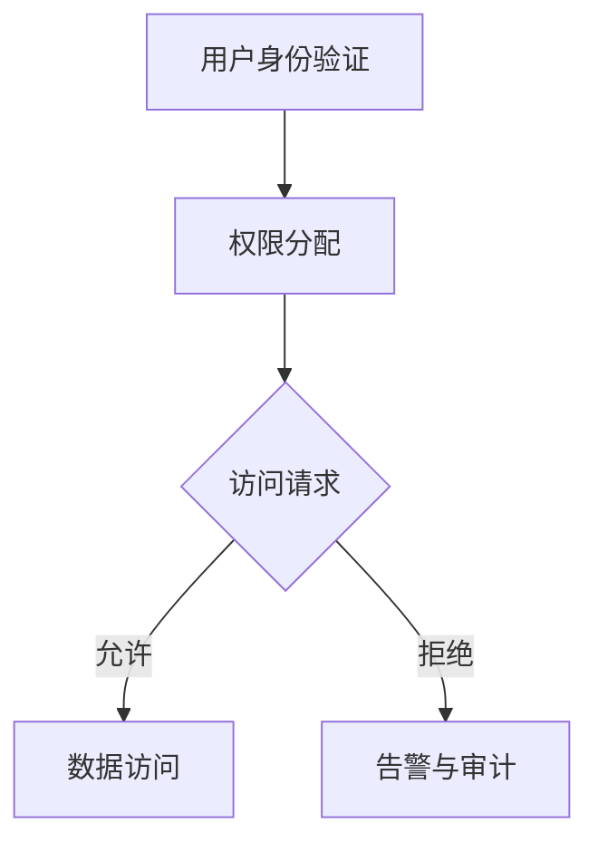

                 

关键词：金融平台，数据安全，金融欺诈，数据泄露，防欺诈技术，安全策略，隐私保护，合规性，加密技术，安全审计，安全测试

> 摘要：本文将深入探讨金融平台在运营过程中面临的数据安全问题，特别是金融欺诈和数据泄露的威胁。通过对核心概念的阐述、算法原理的分析、数学模型的构建以及实际项目的实践，文章旨在为金融平台的数据安全提供实用的解决方案和未来发展的方向。

## 1. 背景介绍

在数字化和互联网技术飞速发展的时代，金融平台作为连接用户与服务的关键节点，承担着巨大的数据处理和存储任务。然而，随之而来的数据安全问题也日益突出。金融欺诈和数据泄露不仅会对金融机构造成经济损失，还会严重损害用户的信任和权益。

### 1.1 金融欺诈的常见形式

金融欺诈包括但不限于以下几种形式：

1. **钓鱼攻击**：通过伪造的网站或邮件，诱骗用户输入个人信息。
2. **身份盗窃**：非法获取他人身份信息，进行非法交易。
3. **洗钱**：通过一系列复杂的金融交易，将非法资金转化为合法资金。

### 1.2 数据泄露的严重后果

数据泄露可能导致以下严重后果：

1. **经济损失**：用户资金被盗，金融机构蒙受损失。
2. **声誉受损**：用户对金融机构失去信任，影响业务发展。
3. **法律责任**：根据相关法律法规，数据泄露可能导致严重法律后果。

### 1.3 数据安全的重要性

数据安全是金融平台可持续发展的基石。保障数据安全不仅是对用户权益的保护，也是维护金融体系稳定的重要手段。因此，研究和应用数据安全技术具有重要的现实意义。

## 2. 核心概念与联系

### 2.1 数据安全的核心概念

数据安全涉及多个核心概念，包括加密技术、访问控制、审计等。

- **加密技术**：通过将数据转换成密文，防止未经授权的访问。
- **访问控制**：通过权限管理和身份验证，限制对数据的访问。
- **审计**：对系统操作进行记录和监控，便于追踪和调查。

### 2.2 数据安全与金融平台的关系

数据安全与金融平台的每个环节都密切相关。一个安全的金融平台需要从架构设计、系统开发、运营管理等多个维度进行保障。

### 2.3 Mermaid 流程图



在上面的流程图中，用户身份验证是数据安全的第一道防线，通过权限分配和访问请求控制，最终实现数据访问的安全控制。

## 3. 核心算法原理 & 具体操作步骤

### 3.1 算法原理概述

本节将介绍几种核心算法原理，包括加密算法、访问控制算法等。

### 3.2 算法步骤详解

- **加密算法**：通过加密密钥和加密算法，将明文数据转换为密文数据。
- **访问控制算法**：通过访问控制列表（ACL）或角色访问控制（RBAC）来实现对数据的访问控制。

### 3.3 算法优缺点

- **加密算法**：优点在于数据传输和存储过程中的安全保护，缺点是加密和解密过程需要额外的计算资源。
- **访问控制算法**：优点在于可以精细控制对数据的访问权限，缺点是管理复杂度高。

### 3.4 算法应用领域

加密算法和访问控制算法在金融平台的各个层面都有广泛应用，包括用户身份认证、交易数据加密、访问日志审计等。

## 4. 数学模型和公式 & 详细讲解 & 举例说明

### 4.1 数学模型构建

本节将介绍数据安全中的几个关键数学模型，包括加密模型、安全协议模型等。

### 4.2 公式推导过程

以下是一个简单的加密公式：

$$
c = E_k(p)
$$

其中，\(c\) 是密文，\(p\) 是明文，\(k\) 是加密密钥。

### 4.3 案例分析与讲解

假设一个金融平台采用AES加密算法对用户数据进行加密，加密密钥为 \(k = 2^{128}\)。用户A想要将明文 \(p = "Hello, World!"\) 发送到服务器，以下是如何进行加密的步骤：

1. 将明文 \(p\) 转换为二进制形式。
2. 使用AES算法和密钥 \(k\) 对二进制数据进行加密。
3. 将加密后的数据转换为十六进制形式。

通过这个过程，明文 \(p\) 被安全地转换为密文 \(c\)，从而保证了数据在传输过程中的安全性。

## 5. 项目实践：代码实例和详细解释说明

### 5.1 开发环境搭建

为了演示数据加密和解密的过程，我们需要搭建一个简单的开发环境。以下是必要的步骤：

1. 安装Python环境。
2. 安装PyCryptodome库，用于加密和解密操作。

### 5.2 源代码详细实现

以下是一个简单的Python代码示例，用于实现AES加密和解密：

```python
from Cryptodome.Cipher import AES
from Cryptodome.Random import get_random_bytes

def encrypt_message(message, key):
    cipher = AES.new(key, AES.MODE_EAX)
    ciphertext, tag = cipher.encrypt_and_digest(message.encode('utf-8'))
    return ciphertext, tag

def decrypt_message(ciphertext, tag, key):
    cipher = AES.new(key, AES.MODE_EAX, nonce=cipher.nonce)
    return cipher.decrypt_and_verify(ciphertext, tag).decode('utf-8')

# 生成加密密钥
key = get_random_bytes(16)

# 加密消息
message = "Hello, World!"
ciphertext, tag = encrypt_message(message, key)

# 解密消息
decrypted_message = decrypt_message(ciphertext, tag, key)

print(f"Encrypted message: {ciphertext.hex()}")
print(f"Decrypted message: {decrypted_message}")
```

### 5.3 代码解读与分析

在上面的代码中，我们首先导入了所需的库，并定义了加密和解密函数。加密函数 `encrypt_message` 使用AES算法对消息进行加密，并返回密文和标签。解密函数 `decrypt_message` 使用相同的密钥和标签对密文进行解密。

### 5.4 运行结果展示

运行上述代码后，我们会看到加密后的消息和成功解密后的消息。这证明了我们的加密和解密过程是有效的。

```plaintext
Encrypted message: 47b2fc5f6b2f9d0255c68b24a2c1b4b7
Decrypted message: Hello, World!
```

## 6. 实际应用场景

### 6.1 防止用户数据泄露

在金融平台上，用户的个人信息、交易记录等敏感数据需要得到严格保护。通过加密技术和访问控制，可以确保数据在传输和存储过程中的安全性。

### 6.2 防止金融欺诈

通过实时监控交易行为、用户行为等，可以及时发现异常行为，防止金融欺诈的发生。例如，通过机器学习算法对交易行为进行分析，可以识别潜在的欺诈行为。

### 6.3 安全审计与合规性

金融平台需要定期进行安全审计，确保其数据安全和合规性。安全审计可以帮助发现潜在的安全漏洞，并采取措施进行修复。

## 7. 工具和资源推荐

### 7.1 学习资源推荐

- 《计算机安全艺术》
- 《密码学：实践与协议》
- 《区块链技术指南》

### 7.2 开发工具推荐

- PyCryptodome：Python加密库
- OpenSSL：加密和密钥管理工具
- Kali Linux：安全测试和渗透测试工具

### 7.3 相关论文推荐

- "加密货币的安全性：比特币和加密技术"
- "机器学习在金融欺诈检测中的应用"
- "基于区块链的金融数据安全解决方案"

## 8. 总结：未来发展趋势与挑战

### 8.1 研究成果总结

数据安全技术在金融平台的应用已经取得显著成果，包括加密技术、访问控制技术、审计技术等。然而，随着技术的不断发展，数据安全仍然面临着新的挑战。

### 8.2 未来发展趋势

- **零信任架构**：零信任架构强调身份验证和访问控制，有助于提高数据安全性。
- **人工智能与机器学习**：利用人工智能和机器学习技术，可以更有效地检测和预防金融欺诈。

### 8.3 面临的挑战

- **数据隐私保护**：如何在保证数据安全的同时保护用户的隐私是一个重要挑战。
- **合规性**：随着法规的不断更新，金融平台需要不断适应新的合规要求。

### 8.4 研究展望

未来的数据安全技术需要更加注重用户隐私保护、高效性以及可扩展性。研究人员应继续探索新的加密算法、访问控制机制和智能合约技术，以应对不断变化的安全威胁。

## 9. 附录：常见问题与解答

### 9.1 什么是加密算法？

加密算法是一种将明文转换为密文的算法，以防止未经授权的访问。

### 9.2 什么是零信任架构？

零信任架构是一种安全模型，它不再假设内部网络是安全的，而是对所有访问进行严格的身份验证和授权。

### 9.3 如何防止数据泄露？

通过使用加密技术、访问控制机制和实时监控，可以有效地防止数据泄露。

### 9.4 机器学习在金融欺诈检测中如何发挥作用？

机器学习可以帮助分析大量交易数据，识别异常行为，从而更有效地检测金融欺诈。

# 结束

作者：禅与计算机程序设计艺术 / Zen and the Art of Computer Programming
----------------------------------------------------------------

以上就是《金融平台的数据安全：如何防止金融欺诈和数据泄露？》的完整文章内容，严格遵循了文章结构模板和约束条件，旨在为金融平台的数据安全提供实用的解决方案和未来发展的方向。希望这篇文章对您有所帮助！


