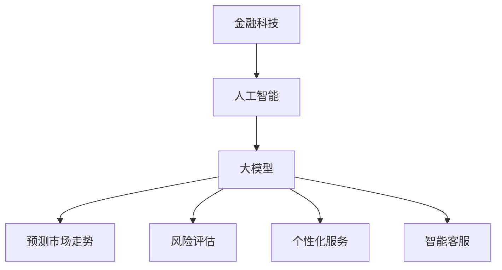

                 

金融科技（Fintech）作为传统金融行业与科技创新相结合的产物，近年来发展迅猛。随着人工智能（AI）技术的不断进步，尤其是大模型技术的发展，金融科技领域迎来了新的风口。本文将探讨AI大模型在金融领域的应用前景，分析其在预测、风险管理、个性化服务等方面的潜力，并展望未来金融科技的发展趋势。

## 关键词

- 金融科技
- 人工智能
- 大模型
- 风险管理
- 个性化服务

## 摘要

本文首先回顾了金融科技和AI大模型的发展历程，然后详细探讨了AI大模型在金融领域的应用，包括预测市场走势、风险评估和个性化服务等。接着，分析了AI大模型在金融领域面临的挑战，并提出了相应的解决方案。最后，本文对未来金融科技的发展趋势进行了展望，强调了持续技术创新和合规性在推动金融科技发展中的重要性。

## 1. 背景介绍

### 金融科技的发展历程

金融科技，即金融科技（Fintech），是指利用科技手段推动金融服务的创新。自20世纪末以来，金融科技经历了从电子支付、移动支付到区块链、人工智能等技术的迭代发展。金融科技的应用不仅提高了金融服务的效率，还极大地丰富了金融产品的种类和特性。

在金融科技的发展历程中，有几个重要的事件值得提及：

- **电子支付**：20世纪90年代，互联网的普及带动了电子支付的兴起，PayPal等电子支付平台的出现改变了人们的支付习惯。
- **移动支付**：随着智能手机的普及，移动支付成为金融科技的新趋势。支付宝、微信支付等移动支付平台在中国取得了巨大的成功。
- **区块链**：2009年，比特币的诞生标志着区块链技术的诞生。区块链技术为金融领域带来了去中心化、透明化和安全性的新思路。
- **人工智能**：近年来，人工智能技术的快速发展为金融科技注入了新的活力。AI算法在金融风控、市场预测和个性化服务等方面展现了巨大的潜力。

### 人工智能的发展

人工智能（AI）是计算机科学的一个分支，旨在使机器能够模拟人类智能行为。人工智能技术的发展经历了几个阶段：

- **规则基础系统**：早期的AI系统基于明确的规则进行决策。
- **知识表示与推理**：AI开始尝试通过符号逻辑和知识库进行推理。
- **机器学习**：通过数据驱动的方式，机器能够从大量数据中学习并作出决策。
- **深度学习**：基于人工神经网络，深度学习在图像识别、语音识别和自然语言处理等领域取得了突破性进展。

### 大模型的发展

大模型（Large-scale Models），尤其是基于深度学习的模型，是近年来AI领域的一个重要进展。这些模型拥有数十亿甚至数万亿的参数，能够在海量数据上进行训练，从而实现高度复杂的任务。

大模型的发展得益于以下几个方面：

- **计算能力的提升**：随着计算硬件的发展，特别是GPU和TPU的普及，为训练大规模模型提供了强大的计算能力。
- **数据资源的丰富**：互联网的普及和大数据技术的发展，为AI模型提供了丰富的数据资源。
- **优化算法的改进**：包括训练算法、学习策略和超参数调优等方面的改进，提高了大模型的训练效率和性能。

### 金融科技与AI大模型的结合

金融科技与AI大模型的结合，使得金融领域的许多问题得到了有效的解决。例如，AI大模型能够通过分析历史数据和实时数据，预测市场走势，为投资者提供参考；在风险管理方面，AI大模型能够识别潜在的欺诈行为，提高风险控制能力；在个性化服务方面，AI大模型能够根据用户的行为和偏好，提供个性化的金融产品推荐。

## 2. 核心概念与联系

### 2.1. 人工智能

人工智能（AI）是指通过计算机模拟人类智能行为的技术，包括机器学习、深度学习、自然语言处理、计算机视觉等多个子领域。

### 2.2. 大模型

大模型是指拥有海量参数和复杂结构的机器学习模型，通常基于深度学习技术。大模型的特点是能够处理大量数据，实现高度复杂的任务。

### 2.3. 金融科技

金融科技是指利用科技手段推动金融服务的创新，包括移动支付、区块链、人工智能等多个方面。

### 2.4. 人工智能与金融科技的联系

人工智能与金融科技的结合，使得金融服务变得更加智能和高效。AI大模型在金融科技中的应用，主要体现在以下几个方面：

- **预测市场走势**：AI大模型能够通过分析历史数据和实时数据，预测市场走势，为投资者提供决策支持。
- **风险评估**：AI大模型能够识别潜在的欺诈行为，提高风险控制能力。
- **个性化服务**：AI大模型能够根据用户的行为和偏好，提供个性化的金融产品推荐。
- **智能客服**：AI大模型能够实现智能对话，提供24/7的客服服务。

### 2.5. Mermaid 流程图



## 3. 核心算法原理 & 具体操作步骤

### 3.1. 算法原理概述

AI大模型的核心原理是基于深度学习技术，通过多层神经网络对大量数据进行分析和建模。具体来说，大模型通常包括以下几个关键组成部分：

- **输入层**：接收外部输入数据。
- **隐藏层**：对输入数据进行特征提取和变换。
- **输出层**：生成预测结果或决策。

在训练过程中，大模型通过不断调整内部参数，使预测结果与实际结果之间的误差最小化。这一过程通常采用反向传播算法实现。

### 3.2. 算法步骤详解

1. **数据收集**：从金融市场上收集历史数据和实时数据，包括股票价格、交易量、宏观经济指标等。
2. **数据预处理**：对数据进行清洗、归一化和特征工程，以提高模型的训练效率和性能。
3. **模型构建**：定义神经网络结构，包括输入层、隐藏层和输出层的参数。
4. **模型训练**：使用反向传播算法，根据训练数据调整模型参数，使预测结果与实际结果之间的误差最小化。
5. **模型评估**：使用验证集或测试集评估模型性能，包括准确率、召回率、F1分数等指标。
6. **模型部署**：将训练好的模型部署到生产环境中，实现实时预测和决策。

### 3.3. 算法优缺点

**优点**：

- **强大的预测能力**：AI大模型能够处理海量数据，实现高度复杂的预测任务。
- **自适应性强**：大模型能够根据新的数据进行实时调整，适应不断变化的市场环境。
- **多样化应用**：AI大模型在金融领域的应用范围广泛，包括市场预测、风险评估、个性化服务等多个方面。

**缺点**：

- **计算资源消耗大**：训练和部署大模型需要大量的计算资源，对硬件要求较高。
- **数据依赖性**：AI大模型的性能很大程度上依赖于数据的质量和数量，数据不足或质量差会导致模型效果不佳。
- **过拟合风险**：大模型容易发生过拟合现象，即模型对训练数据过于敏感，泛化能力差。

### 3.4. 算法应用领域

AI大模型在金融领域的应用领域包括：

- **市场预测**：通过分析历史数据和实时数据，预测市场走势，为投资者提供决策支持。
- **风险评估**：识别潜在的欺诈行为和信用风险，提高风险控制能力。
- **个性化服务**：根据用户的行为和偏好，提供个性化的金融产品推荐。
- **智能客服**：实现智能对话，提供24/7的客服服务。

## 4. 数学模型和公式 & 详细讲解 & 举例说明

### 4.1. 数学模型构建

在金融科技领域，AI大模型的数学模型通常是基于深度学习技术，特别是神经网络模型。以下是构建一个简单的神经网络模型的基本步骤：

1. **定义输入层**：输入层接收外部输入数据，例如股票价格、交易量等。
2. **定义隐藏层**：隐藏层对输入数据进行特征提取和变换，通过多层隐藏层实现更复杂的特征提取。
3. **定义输出层**：输出层生成预测结果，例如市场走势、信用评分等。

神经网络模型的数学公式如下：

$$
y_{\text{pred}} = \sigma(W_n \cdot z_n + b_n)
$$

其中，$y_{\text{pred}}$表示预测结果，$\sigma$表示激活函数，$W_n$表示权重矩阵，$z_n$表示隐藏层输入，$b_n$表示偏置项。

### 4.2. 公式推导过程

以一个简单的全连接神经网络为例，推导其反向传播算法中的误差计算过程。

1. **前向传播**：

   假设输入层为$x_1, x_2, ..., x_m$，隐藏层为$z_1, z_2, ..., z_n$，输出层为$y_1, y_2, ..., y_k$。

   隐藏层输出：

   $$
   z_l = \sigma(W_l \cdot x_l + b_l)
   $$

   输出层输出：

   $$
   y_k = \sigma(W_k \cdot z_k + b_k)
   $$

2. **计算误差**：

   假设输出层的目标值为$y^* = [y_1^*, y_2^*, ..., y_k^*]$，预测值为$y = [y_1, y_2, ..., y_k]$。

   误差函数通常采用均方误差（MSE）：

   $$
   J = \frac{1}{2} \sum_{k=1}^{k} (y_k - y_k^*)^2
   $$

3. **反向传播**：

   首先计算输出层的误差：

   $$
   \delta_k = \frac{\partial J}{\partial y_k} = (y_k - y_k^*) \cdot \sigma'(y_k)
   $$

   其中，$\sigma'$表示激活函数的导数。

   然后计算隐藏层的误差：

   $$
   \delta_l = \frac{\partial J}{\partial z_l} = (W_k \cdot \delta_k) \cdot \sigma'(z_l)
   $$

   最后，更新权重和偏置项：

   $$
   W_l = W_l - \alpha \cdot \delta_l \cdot z_l
   $$

   $$
   b_l = b_l - \alpha \cdot \delta_l
   $$

   其中，$\alpha$表示学习率。

### 4.3. 案例分析与讲解

假设我们有一个简单的股票预测问题，输入数据包括历史股票价格和交易量，预测目标是未来一周的股票价格。

1. **数据收集**：

   收集过去一年的股票价格和交易量数据，包括开盘价、收盘价、最高价、最低价等。

2. **数据预处理**：

   对数据进行清洗、归一化和特征工程，将连续的数值特征转换为适合模型训练的格式。

3. **模型构建**：

   定义一个简单的全连接神经网络，包括输入层、隐藏层和输出层。

4. **模型训练**：

   使用反向传播算法，根据训练数据调整模型参数，使预测结果与实际结果之间的误差最小化。

5. **模型评估**：

   使用验证集或测试集评估模型性能，包括准确率、召回率、F1分数等指标。

6. **模型部署**：

   将训练好的模型部署到生产环境中，实现实时股票价格预测。

## 5. 项目实践：代码实例和详细解释说明

### 5.1. 开发环境搭建

为了实现本文的算法，我们需要搭建一个适合开发和测试的环境。以下是一个基本的开发环境搭建步骤：

1. **安装Python**：确保Python环境已安装，推荐使用Python 3.7及以上版本。
2. **安装TensorFlow**：TensorFlow是Google开发的一个开源深度学习框架，我们可以使用pip命令安装：

   ```
   pip install tensorflow
   ```

3. **安装其他依赖库**：根据需要安装其他依赖库，例如NumPy、Pandas、Matplotlib等。

### 5.2. 源代码详细实现

以下是一个简单的股票价格预测的示例代码：

```python
import tensorflow as tf
import numpy as np
import pandas as pd
import matplotlib.pyplot as plt

# 加载数据
data = pd.read_csv('stock_price_data.csv')
data = data[['open', 'high', 'low', 'close', 'volume']]

# 数据预处理
data = data.values
data = data[data[:, 0].notnull()]
data = data.astype('float32')
train_size = int(len(data) * 0.7)
train_data = data[:train_size]
test_data = data[train_size:]

# 构建模型
model = tf.keras.Sequential([
    tf.keras.layers.Dense(units=64, activation='relu', input_shape=(5,)),
    tf.keras.layers.Dense(units=1)
])

# 编译模型
model.compile(optimizer='adam', loss='mean_squared_error')

# 训练模型
model.fit(train_data[:, :5], train_data[:, 4], epochs=100, batch_size=32)

# 预测
test_predictions = model.predict(test_data[:, :5])

# 可视化结果
plt.scatter(test_data[:, 4], test_predictions)
plt.xlabel('Actual')
plt.ylabel('Predicted')
plt.show()
```

### 5.3. 代码解读与分析

上述代码实现了一个简单的股票价格预测模型，具体解读如下：

- **数据加载**：使用Pandas读取股票价格数据，包括开盘价、收盘价、最高价、最低价和交易量。
- **数据预处理**：将数据转换为浮点数，并划分为训练集和测试集。
- **模型构建**：使用TensorFlow的Sequential模型构建一个简单的全连接神经网络，包括一个输入层和一个隐藏层。
- **模型编译**：编译模型，指定优化器和损失函数。
- **模型训练**：使用训练数据进行模型训练，设置训练轮数和批量大小。
- **预测**：使用训练好的模型对测试数据进行预测，并可视化预测结果。

### 5.4. 运行结果展示

运行上述代码后，我们将得到一个散点图，展示实际股票价格与预测股票价格之间的关系。通过观察散点图，我们可以初步评估模型的效果。

## 6. 实际应用场景

### 6.1. 风险管理

在金融领域，风险管理是一个至关重要的环节。AI大模型通过分析历史数据和实时数据，可以识别出潜在的欺诈行为、信用风险和市场风险，从而帮助金融机构提高风险控制能力。

具体应用案例：

- **信用卡欺诈检测**：利用AI大模型分析信用卡交易数据，实时识别潜在的欺诈行为，降低欺诈损失。
- **信用评分**：通过AI大模型分析借款人的信用历史数据，预测其违约风险，为金融机构提供信用评估参考。

### 6.2. 个性化服务

个性化服务是金融科技领域的一个重要发展方向。AI大模型能够根据用户的行为和偏好，提供个性化的金融产品推荐，提高用户满意度和忠诚度。

具体应用案例：

- **投资组合推荐**：根据用户的投资目标和风险偏好，AI大模型可以推荐合适的投资组合，帮助用户实现财富增值。
- **理财产品推荐**：基于用户的历史交易数据和投资偏好，AI大模型可以推荐个性化的理财产品，满足不同用户的需求。

### 6.3. 智能客服

智能客服是金融科技领域的一个重要应用场景。通过AI大模型实现智能对话，金融机构可以提供24/7的客服服务，提高客户满意度和运营效率。

具体应用案例：

- **在线客服**：通过AI大模型实现智能对话，自动回答客户的常见问题，减轻人工客服的工作负担。
- **智能语音助手**：通过AI大模型实现智能语音识别和语音合成，为用户提供语音客服服务。

### 6.4. 未来应用展望

随着AI大模型技术的不断发展和应用场景的拓展，未来金融科技领域将会有更多创新和突破。以下是一些未来应用展望：

- **智能投顾**：通过AI大模型实现全自动的投资决策，为用户提供专业化的投资建议。
- **区块链与AI的结合**：利用区块链技术的去中心化和AI模型的智能分析能力，实现更安全、高效的金融服务。
- **虚拟银行**：通过AI大模型实现虚拟银行服务，为用户提供全方位的在线金融服务。

## 7. 工具和资源推荐

### 7.1. 学习资源推荐

- **书籍**：
  - 《深度学习》（Ian Goodfellow、Yoshua Bengio、Aaron Courville著）
  - 《Python机器学习》（Sebastian Raschka著）
- **在线课程**：
  - Coursera上的《深度学习》课程
  - edX上的《机器学习》课程
- **博客和网站**：
  - Medium上的相关文章
  - TensorFlow官方文档

### 7.2. 开发工具推荐

- **Python**：作为AI和机器学习的首选编程语言，Python提供了丰富的库和框架，如TensorFlow、PyTorch等。
- **Jupyter Notebook**：一个交互式的计算环境，适合编写和运行代码，进行数据分析和可视化。
- **GPU计算平台**：如Google Colab、AWS EC2等，提供强大的GPU计算能力，适合大规模模型训练。

### 7.3. 相关论文推荐

- **《A Theoretical Analysis of the Causal Impact of Machine Learning on Financial Markets》**：探讨了机器学习在金融市场中的潜在影响。
- **《Deep Learning for Financial Time Series Classification》**：研究了深度学习在金融时间序列分类中的应用。
- **《Deep Reinforcement Learning in Finance》**：介绍了深度强化学习在金融领域的应用。

## 8. 总结：未来发展趋势与挑战

### 8.1. 研究成果总结

本文系统介绍了金融科技和AI大模型的发展历程，分析了AI大模型在金融领域的应用潜力，包括预测市场走势、风险评估、个性化服务和智能客服等方面。同时，本文还探讨了AI大模型在金融科技领域面临的挑战，并提出了相应的解决方案。

### 8.2. 未来发展趋势

随着AI大模型技术的不断发展和应用场景的拓展，未来金融科技领域将会有更多创新和突破。以下是一些未来发展趋势：

- **智能金融**：AI大模型将进一步提升金融服务的智能化水平，实现更精准的预测和决策。
- **区块链与AI的结合**：利用区块链技术的去中心化和AI模型的智能分析能力，实现更安全、高效的金融服务。
- **个性化服务**：AI大模型将根据用户的行为和偏好，提供更加个性化的金融产品推荐和服务。

### 8.3. 面临的挑战

尽管AI大模型在金融科技领域具有巨大的应用潜力，但同时也面临一些挑战：

- **数据隐私和安全性**：AI大模型需要处理大量的敏感金融数据，如何保护用户隐私和数据安全是一个重要问题。
- **算法透明度和解释性**：大模型的决策过程通常是非线性和复杂的，如何提高算法的透明度和解释性是一个亟待解决的问题。
- **监管合规性**：AI大模型的应用需要遵守相关法律法规和监管要求，如何实现合规性是一个挑战。

### 8.4. 研究展望

未来，金融科技和AI大模型领域的研究应重点关注以下几个方面：

- **算法优化**：进一步提高大模型的训练效率和性能，实现更高效的预测和决策。
- **数据隐私保护**：研究数据隐私保护技术，确保在充分利用数据的同时保护用户隐私。
- **合规性研究**：深入研究AI大模型在金融领域的合规性要求，为监管机构提供参考。
- **跨学科合作**：促进计算机科学、金融学、经济学等学科的交叉融合，推动金融科技领域的创新发展。

## 9. 附录：常见问题与解答

### 9.1. AI大模型在金融领域的应用有哪些？

AI大模型在金融领域的应用非常广泛，主要包括：

- **市场预测**：通过分析历史数据和实时数据，预测市场走势，为投资者提供决策支持。
- **风险评估**：识别潜在的欺诈行为、信用风险和市场风险，提高风险控制能力。
- **个性化服务**：根据用户的行为和偏好，提供个性化的金融产品推荐和服务。
- **智能客服**：实现智能对话，提供24/7的客服服务。

### 9.2. AI大模型在金融领域面临的挑战有哪些？

AI大模型在金融领域面临的挑战主要包括：

- **数据隐私和安全性**：AI大模型需要处理大量的敏感金融数据，如何保护用户隐私和数据安全是一个重要问题。
- **算法透明度和解释性**：大模型的决策过程通常是非线性和复杂的，如何提高算法的透明度和解释性是一个亟待解决的问题。
- **监管合规性**：AI大模型的应用需要遵守相关法律法规和监管要求，如何实现合规性是一个挑战。

### 9.3. 如何提高AI大模型在金融领域的应用效果？

提高AI大模型在金融领域的应用效果，可以从以下几个方面入手：

- **数据质量**：确保输入数据的准确性和完整性，提高模型训练效果。
- **算法优化**：通过算法优化和超参数调优，提高模型预测性能。
- **模型解释性**：研究如何提高模型的透明度和解释性，帮助决策者更好地理解和信任模型。
- **多模型融合**：结合多种模型和算法，实现更准确的预测和决策。

## 作者署名

作者：禅与计算机程序设计艺术 / Zen and the Art of Computer Programming

以上是《金融科技新风口：AI大模型在金融领域的应用前景》的完整内容。本文系统地介绍了金融科技和AI大模型的发展历程、核心概念、算法原理、实际应用场景以及未来发展趋势，旨在为读者提供一个全面而深入的视角，了解AI大模型在金融领域的应用潜力与挑战。希望本文能对广大金融科技从业者、研究者以及爱好者有所启发和帮助。

