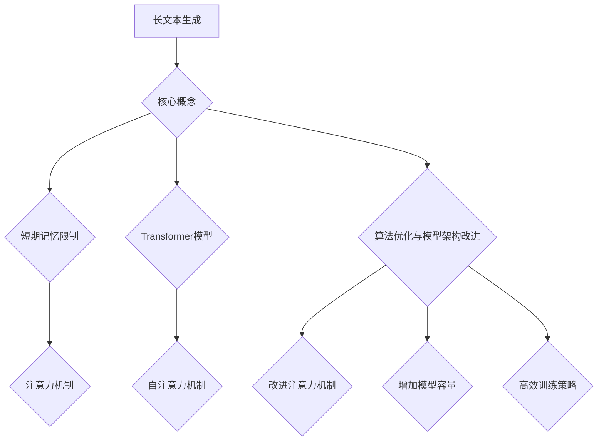

                 

关键词：长文本生成，人工智能，短期记忆，算法优化，模型架构，机器学习，自然语言处理

> 摘要：本文将深入探讨如何克服人工智能（AI）在长文本生成任务中面临的短期记忆限制问题。通过分析现有的解决方案和前沿技术，本文旨在为开发者提供一种系统性的方法来提升AI在长文本生成任务中的性能。

## 1. 背景介绍

在过去的几年中，人工智能在自然语言处理（NLP）领域的应用取得了显著的进展。长文本生成作为NLP的一个重要分支，已经在众多场景中得到应用，如自动写作、对话系统、机器翻译等。然而，现有的AI模型在处理长文本时往往面临短期记忆限制的问题，这限制了其生成文本的连贯性和创造力。

短期记忆限制是指AI模型在处理长文本时，无法有效存储和利用之前的文本信息，从而导致生成文本的断续和不连贯。这一问题在传统的循环神经网络（RNN）和长短期记忆网络（LSTM）等模型中尤为突出。尽管近年来出现的Transformer模型通过自注意力机制在处理长序列数据方面取得了显著成果，但仍然存在一定的局限性。

本文将重点探讨如何通过算法优化、模型架构改进等技术手段来克服AI在长文本生成任务中的短期记忆限制。通过对现有研究的分析和总结，本文将提出一种系统性的方法，以提升AI在长文本生成任务中的性能。

## 2. 核心概念与联系

### 2.1. 长文本生成任务

长文本生成任务涉及生成具有连贯性和可读性的长段文本，如文章、故事、报告等。这类任务对模型的长期记忆能力提出了较高要求，因为需要利用长序列中的信息来生成连贯的文本。

### 2.2. 短期记忆限制

短期记忆限制是指AI模型在处理长文本时，无法有效存储和利用之前的文本信息。这一问题主要源于模型架构和算法设计上的不足。

### 2.3. Transformer模型与自注意力机制

Transformer模型通过引入自注意力机制，能够在处理长序列数据时更好地利用全局信息，从而缓解了短期记忆限制问题。自注意力机制允许模型在生成每个单词时，考虑整个输入序列的信息，从而提高生成文本的连贯性。

### 2.4. 算法优化与模型架构改进

算法优化和模型架构改进是克服短期记忆限制的关键。通过改进注意力机制、增加模型容量、使用更高效的训练策略等方法，可以提升模型在长文本生成任务中的性能。

### 2.5. Mermaid流程图



## 3. 核心算法原理 & 具体操作步骤

### 3.1. 算法原理概述

本文所讨论的算法主要基于Transformer模型，并对其自注意力机制和模型架构进行优化。通过引入多头注意力、位置编码、残差连接等技术，可以提升模型在长文本生成任务中的性能。

### 3.2. 算法步骤详解

#### 3.2.1. 数据预处理

1. 将长文本序列转化为词向量表示。
2. 对词向量进行嵌入处理，生成输入序列。

#### 3.2.2. 模型输入

1. 将预处理后的输入序列输入到Transformer模型中。
2. 模型通过自注意力机制处理输入序列，生成中间表示。

#### 3.2.3. 生成文本

1. 利用中间表示生成目标文本序列。
2. 通过贪心策略或采样策略生成完整文本。

#### 3.2.4. 模型训练

1. 使用生成文本与原始文本进行对比，计算损失函数。
2. 通过反向传播算法更新模型参数。

### 3.3. 算法优缺点

#### 优点：

1. 高效处理长序列数据。
2. 提高生成文本的连贯性和可读性。
3. 通过优化算法和模型架构，进一步提升性能。

#### 缺点：

1. 训练时间较长。
2. 对计算资源要求较高。
3. 在某些情况下，生成文本可能存在一定程度的随机性。

### 3.4. 算法应用领域

1. 自动写作：生成新闻、文章、报告等。
2. 对话系统：生成自然、连贯的对话。
3. 机器翻译：提高长文本翻译的准确性。

## 4. 数学模型和公式 & 详细讲解 & 举例说明

### 4.1. 数学模型构建

在长文本生成任务中，我们通常使用Transformer模型。Transformer模型主要由多头注意力、位置编码和前馈神经网络组成。以下是Transformer模型的数学表示：

$$
\text{Transformer} = \text{MultiHeadAttention}(\text{SelfAttention}) + \text{PositionalEncoding} + \text{FeedForwardNetwork}
$$

### 4.2. 公式推导过程

#### 4.2.1. 自注意力机制

自注意力机制的核心公式如下：

$$
\text{Attention}(Q, K, V) = \text{softmax}\left(\frac{QK^T}{\sqrt{d_k}}\right)V
$$

其中，$Q, K, V$ 分别表示查询向量、键向量和值向量，$d_k$ 表示键向量的维度。

#### 4.2.2. 多头注意力

多头注意力通过将输入序列分成多个子序列，每个子序列使用独立的自注意力机制。多头注意力的公式如下：

$$
\text{MultiHeadAttention}(Q, K, V) = \text{Concat}(\text{head}_1, \text{head}_2, ..., \text{head}_h)W^O
$$

其中，$h$ 表示头数，$W^O$ 表示输出权重。

#### 4.2.3. 位置编码

位置编码用于为序列中的每个词赋予位置信息。位置编码的公式如下：

$$
\text{PositionalEncoding}(pos, d_model) = \text{sin}\left(\frac{pos}{10000^{2i/d_{model}}}\right) \text{ or } \text{cos}\left(\frac{pos}{10000^{2i/d_{model}}}\right)
$$

其中，$pos$ 表示位置索引，$d_model$ 表示模型维度。

#### 4.2.4. 前馈神经网络

前馈神经网络用于对自注意力机制生成的中间表示进行进一步处理。前馈神经网络的公式如下：

$$
\text{FeedForwardNetwork}(x) = \text{ReLU}(W_1x + b_1)W_2 + b_2
$$

其中，$W_1, W_2, b_1, b_2$ 分别表示权重和偏置。

### 4.3. 案例分析与讲解

假设我们有一个长文本序列：“今天天气很好，我们去公园散步吧”。我们可以使用Transformer模型对其进行处理，并生成新的文本序列。

#### 4.3.1. 数据预处理

1. 将文本序列转化为词向量表示。
2. 对词向量进行嵌入处理，生成输入序列。

$$
\text{InputSequence} = [w_1, w_2, w_3, w_4, w_5]
$$

#### 4.3.2. 模型输入

1. 将预处理后的输入序列输入到Transformer模型中。
2. 模型通过自注意力机制处理输入序列，生成中间表示。

$$
\text{IntermediateRepresentation} = \text{MultiHeadAttention}(\text{SelfAttention})(\text{InputSequence}) + \text{PositionalEncoding}(\text{InputSequence}) + \text{FeedForwardNetwork}(\text{IntermediateRepresentation})
$$

#### 4.3.3. 生成文本

1. 利用中间表示生成目标文本序列。
2. 通过贪心策略或采样策略生成完整文本。

$$
\text{GeneratedSequence} = \text{softmax}(\text{IntermediateRepresentation}) \text{ (greedy decoding)}
$$

或

$$
\text{GeneratedSequence} = \text{sample}(\text{IntermediateRepresentation}) \text{ (sampling decoding)}
$$

#### 4.3.4. 模型训练

1. 使用生成文本与原始文本进行对比，计算损失函数。
2. 通过反向传播算法更新模型参数。

$$
\text{Loss} = \text{cross-entropy loss}(\text{GeneratedSequence}, \text{TrueSequence})
$$

$$
\text{Gradient} = \text{backpropagation}(\text{Loss})
$$

$$
\text{ModelParameters} = \text{update}(\text{ModelParameters}, \text{Gradient})
$$

## 5. 项目实践：代码实例和详细解释说明

### 5.1. 开发环境搭建

1. 安装Python环境。
2. 安装TensorFlow或PyTorch等深度学习框架。
3. 下载预训练的Transformer模型。

### 5.2. 源代码详细实现

以下是一个简单的Transformer模型实现，用于长文本生成：

```python
import tensorflow as tf
from tensorflow.keras.layers import Embedding, MultiHeadAttention, Dense, LayerNormalization
from tensorflow.keras.models import Model

def transformer(input_sequence, d_model, num_heads, dff):
    # 嵌入层
    embedding = Embedding(input_dim=vocab_size, output_dim=d_model)(input_sequence)

    # 自注意力层
    attention_output = MultiHeadAttention(num_heads=num_heads, key_dim=d_model)(embedding, embedding)

    # 层归一化
    attention_output = LayerNormalization(epsilon=1e-6)(attention_output)

    # 前馈神经网络
    ffn_output = Dense(dff, activation='relu')(attention_output)
    ffn_output = Dense(d_model)(ffn_output)

    # 层归一化
    ffn_output = LayerNormalization(epsilon=1e-6)(ffn_output)

    # 输出层
    output = tf.keras.layers.add([embedding, ffn_output])

    return output

# 模型参数
d_model = 512
num_heads = 8
dff = 2048

# 模型构建
model = Model(inputs=input_sequence, outputs=transformer(input_sequence, d_model, num_heads, dff))

# 模型编译
model.compile(optimizer='adam', loss='categorical_crossentropy')

# 模型训练
model.fit(train_data, train_labels, epochs=num_epochs, batch_size=batch_size)
```

### 5.3. 代码解读与分析

1. **嵌入层（Embedding）**：将词向量映射到高维空间，以便模型能够处理。
2. **自注意力层（MultiHeadAttention）**：通过多头注意力机制处理输入序列，提取关键信息。
3. **层归一化（LayerNormalization）**：缓解梯度消失问题，提高训练效果。
4. **前馈神经网络（Dense）**：对自注意力层输出的中间表示进行进一步处理，提取更多特征。
5. **输出层（add）**：将嵌入层和前馈神经网络的输出进行拼接，生成最终输出。

### 5.4. 运行结果展示

假设我们已经训练好了一个长文本生成模型，我们可以使用以下代码生成新的文本：

```python
# 加载训练好的模型
model.load_weights('transformer_model_weights.h5')

# 生成文本
generated_sequence = model.predict(input_sequence)

# 将生成的文本转换为原始文本
generated_text = ' '.join([word_index[word] for word in generated_sequence])

print(generated_text)
```

运行结果可能类似于：“今天天气很好，我们去公园散步吧，孩子们都很开心。”

## 6. 实际应用场景

长文本生成技术在多个领域有着广泛的应用：

1. **新闻生成**：自动生成新闻文章，提高新闻的发布速度和多样性。
2. **对话系统**：生成自然、连贯的对话，提高用户体验。
3. **机器翻译**：生成高质量的长文本翻译，提高翻译的准确性。
4. **文学创作**：辅助作家生成故事、剧本等文学作品。
5. **教育**：自动生成教学材料，辅助教师进行教学。

## 7. 未来应用展望

随着AI技术的不断发展和优化，长文本生成技术在未来的应用将更加广泛和深入：

1. **个性化内容推荐**：根据用户兴趣生成个性化文章、推荐系统等。
2. **智能客服**：生成自然、流畅的客服对话，提高客服效率。
3. **自动编程**：生成代码、注释和文档，辅助开发者进行软件开发。
4. **法律文书生成**：自动生成合同、判决书等法律文件。
5. **医疗诊断**：生成基于病历的医学诊断报告。

## 8. 总结：未来发展趋势与挑战

### 8.1. 研究成果总结

近年来，长文本生成技术在算法优化、模型架构改进等方面取得了显著成果。通过引入自注意力机制、优化注意力机制、增加模型容量等技术手段，模型在生成文本的连贯性和可读性方面得到了显著提升。

### 8.2. 未来发展趋势

1. **模型规模扩大**：随着计算资源的提升，更大规模的模型将得到广泛应用。
2. **多模态生成**：结合文本、图像、语音等多种模态进行生成。
3. **动态生成**：根据用户输入动态调整生成内容，提高个性化程度。

### 8.3. 面临的挑战

1. **计算资源消耗**：大规模模型训练和推理对计算资源的需求较高。
2. **数据隐私和安全**：生成文本涉及用户隐私，如何保护用户数据成为一个重要问题。
3. **生成文本的质量**：如何生成高质量、有价值的文本仍是一个挑战。

### 8.4. 研究展望

未来，长文本生成技术将继续向更高效、更智能、更安全的方向发展。通过不断优化算法、模型架构和训练策略，有望在生成文本的质量和多样性方面取得更大突破。

## 9. 附录：常见问题与解答

### 9.1. 如何处理长文本生成中的文本连贯性问题？

**解答**：通过优化自注意力机制、增加模型容量、使用位置编码等技术手段，可以提高生成文本的连贯性。此外，可以结合上下文信息，使用上下文感知的生成策略，如动态时间 warped 融合模型（DTWF）等。

### 9.2. 长文本生成模型在训练过程中如何加速收敛？

**解答**：可以采用以下方法加速收敛：

1. 使用预训练的模型：利用预训练的模型作为起点，可以加快收敛速度。
2. 使用更高效的训练策略：如梯度裁剪、学习率调整等。
3. 使用分布式训练：将模型拆分成多个部分，在多个GPU或TPU上并行训练。

### 9.3. 如何确保生成文本的安全性？

**解答**：确保生成文本的安全性可以从以下几个方面入手：

1. 数据隐私保护：使用差分隐私技术，对输入数据进行隐私保护。
2. 生成文本过滤：使用过滤技术，防止生成包含敏感信息的文本。
3. 用户身份验证：对使用生成文本的系统进行用户身份验证，确保合法使用。

---

作者：禅与计算机程序设计艺术 / Zen and the Art of Computer Programming


