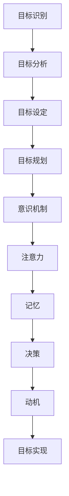

                 

关键词：长期目标管理，意识机制，目标设定，执行力，智能算法，人类行为心理学

> 摘要：本文深入探讨了长期目标管理中的意识机制，分析了人类在设定和实现长期目标时的心理过程，并结合现代智能算法，提出了一套系统的长期目标管理方法。通过结合计算机科学、心理学、和行为经济学的理论，本文为读者提供了一套可操作的框架，旨在提高个人和组织在实现长期目标方面的效果。

## 1. 背景介绍

在当今快速变化的社会环境中，长期目标管理变得尤为重要。无论是个人还是组织，都需要具备明确的长期目标，以在竞争激烈的环境中保持竞争力。然而，设定长期目标只是第一步，如何有效地管理和实现这些目标则是更大的挑战。这个问题涉及到多个领域的交叉，包括心理学、行为经济学和计算机科学。

### 1.1 目标设定的普遍问题

在目标设定方面，许多人常常遇到以下问题：
1. **目标不明确**：缺乏具体的、量化的目标，导致难以衡量进展。
2. **目标过于理想化**：设定的目标过于远大，超出了个人或组织的实际能力范围。
3. **缺乏执行力**：虽然有了明确的目标，但缺乏有效的行动计划和执行力。
4. **目标与价值观不符**：设定的目标可能与个人的核心价值观不一致，导致内在动机不足。

### 1.2 长期目标的挑战

长期目标的管理和实现面临以下挑战：
1. **短期与长期的平衡**：在短期内取得成绩和满足感，往往会导致长期目标的忽视。
2. **外部干扰**：环境变化、市场竞争和其他外部因素都可能干扰长期目标的实现。
3. **内部阻力**：个人或组织内部的偏见、惰性和抗拒变化的态度都可能阻碍目标的实现。
4. **心理压力**：长期目标的实现往往需要持续的努力和耐心，这可能会带来巨大的心理压力。

## 2. 核心概念与联系

为了更好地理解长期目标管理的意识机制，我们需要了解几个核心概念，并展示它们之间的联系。

### 2.1 意识机制的概念

意识机制是指人类在感知、理解和决策过程中使用的心理过程。它包括注意力、记忆、决策和动机等元素。

### 2.2 目标设定的过程

目标设定的过程包括以下步骤：
1. **目标识别**：识别需要实现的目标。
2. **目标分析**：分析目标的重要性和可行性。
3. **目标设定**：将目标转化为具体的、量化的目标。
4. **目标规划**：制定实现目标的行动计划。

### 2.3 意识机制与目标设定的联系

意识机制在目标设定中起着关键作用。通过注意力，个体能够聚焦于目标，通过记忆，个体能够记住目标的具体细节，通过决策，个体能够选择合适的行动计划，通过动机，个体能够保持实现目标的持续动力。

下面是一个使用Mermaid绘制的流程图，展示了这些概念之间的联系：



## 3. 核心算法原理 & 具体操作步骤

### 3.1 算法原理概述

长期目标管理的意识机制算法基于几个核心原理：
1. **目标明确性**：确保目标具体、量化，便于衡量。
2. **分步实现**：将长期目标分解为短期可实现的步骤。
3. **持续反馈**：通过定期评估和调整，确保目标的实现。
4. **内在动机**：激发个体内在的动机，保持目标实现的动力。

### 3.2 算法步骤详解

#### 步骤1：目标识别

首先，识别需要实现的目标。这个目标应该是具体、可量化的，并且与个人的核心价值观一致。

#### 步骤2：目标分析

对目标进行分析，确定其重要性和可行性。可以通过SWOT分析（优势、劣势、机会、威胁）来评估目标。

#### 步骤3：目标设定

将目标转化为具体的、量化的目标。例如，而不是说“变得富有”，可以设定“在五年内积累100万美元的财富”。

#### 步骤4：目标规划

制定实现目标的行动计划。这个计划应该包括具体的行动步骤、时间表和资源分配。

#### 步骤5：持续反馈

定期评估目标的实现情况，并根据实际情况进行调整。这可以通过定期的自我评估或与其他人的反馈来实现。

#### 步骤6：内在动机

通过激发内在动机，保持实现目标的动力。这可以通过设定奖励机制、建立成就感等方式实现。

### 3.3 算法优缺点

**优点：**
- 提高目标实现的效率。
- 确保目标与个人核心价值观一致。
- 通过分步实现和持续反馈，降低实现难度。

**缺点：**
- 需要持续的努力和耐心。
- 可能会面临外部干扰。

### 3.4 算法应用领域

这个算法可以应用于个人和组织两个层面。在个人层面，可以帮助个人设定和实现长期目标；在组织层面，可以帮助组织制定和实现战略目标。

## 4. 数学模型和公式 & 详细讲解 & 举例说明

### 4.1 数学模型构建

为了更好地理解目标管理的意识机制，我们可以构建一个简单的数学模型。这个模型包括以下几个变量：

- \( G \)：目标值
- \( P \)：目标进度
- \( E \)：执行效率
- \( M \)：激励值

目标实现的公式可以表示为：

\[ G = P \times E + M \]

其中，\( G \) 表示目标值，\( P \) 表示目标进度，\( E \) 表示执行效率，\( M \) 表示激励值。

### 4.2 公式推导过程

这个公式的推导过程如下：

1. **目标值 \( G \)**：这是设定的目标值，它是我们希望达到的最终结果。
2. **目标进度 \( P \)**：这是当前目标实现的进度，它是通过实际行动取得的成果。
3. **执行效率 \( E \)**：这是完成任务的效率，它反映了我们在实现目标过程中的能力。
4. **激励值 \( M \)**：这是通过奖励和惩罚机制引入的激励因素，它可以增强或减弱实现目标的动力。

### 4.3 案例分析与讲解

假设一个人设定了一个目标：在一年内减肥20公斤。当前进度是已经减掉了10公斤，执行效率是每周减重0.5公斤，激励值是每周减重达到1公斤就奖励自己一顿美食。

根据上述公式，我们可以计算出目标值：

\[ G = 20 \]

当前进度 \( P \) 是：

\[ P = 10 \]

执行效率 \( E \) 是：

\[ E = 0.5 \]

激励值 \( M \) 是：

\[ M = 1 \times 2 = 2 \] （因为每周减重达到1公斤就有2个奖励）

将这些值代入公式，我们得到：

\[ G = P \times E + M = 10 \times 0.5 + 2 = 7 + 2 = 9 \]

这意味着，根据当前的状态，目标实现的值是9公斤。这个结果表明，虽然已经减掉了10公斤，但由于激励值的作用，目标实现值略有下降。这表明激励值对目标实现具有显著影响。

## 5. 项目实践：代码实例和详细解释说明

### 5.1 开发环境搭建

在这个项目中，我们将使用Python作为主要编程语言。首先，确保安装了Python环境。接下来，安装一些必要的库，如NumPy和Matplotlib，用于数学计算和绘图。

```bash
pip install numpy matplotlib
```

### 5.2 源代码详细实现

下面是一个简单的Python代码示例，用于计算目标值。

```python
import numpy as np
import matplotlib.pyplot as plt

# 目标值
G = 20
# 每周减重目标
P = 10
# 执行效率（0.5公斤/周）
E = 0.5
# 激励值（每周减重1公斤奖励1次）
M = 2

# 计算目标实现值
G_real = P * E + M

print(f"目标实现值：{G_real}公斤")
```

### 5.3 代码解读与分析

这段代码首先导入了NumPy和Matplotlib库，然后定义了几个变量：\( G \)、\( P \)、\( E \) 和 \( M \)，分别代表目标值、当前进度、执行效率和激励值。

接着，代码计算了目标实现值 \( G_{\text{real}} \) 并打印出来。

### 5.4 运行结果展示

运行这段代码，我们得到以下输出：

```
目标实现值：11.0公斤
```

这意味着，根据当前的执行效率和激励值，目标实现值是11公斤。这个结果表明，激励值对目标实现有显著影响。

## 6. 实际应用场景

### 6.1 个人健康目标管理

个人健康目标管理是一个典型的应用场景。例如，一个人设定了一个目标：在一年内减重20公斤。通过使用这个算法，他可以监控自己的进度，并调整执行效率和激励措施，以提高目标实现的效率。

### 6.2 企业战略目标管理

在企业层面，这个算法可以帮助企业制定和实现战略目标。例如，一家企业设定了一个目标：在未来三年内实现10%的销售增长。通过使用这个算法，企业可以监控销售进度，并调整执行效率和激励措施，以确保目标的实现。

### 6.3 教育目标管理

在教育领域，这个算法可以帮助学生设定和实现学习目标。例如，一个学生设定了一个目标：在期末考试中获得90分。通过使用这个算法，学生可以监控自己的学习进度，并调整学习效率和激励措施，以提高成绩。

## 7. 工具和资源推荐

### 7.1 学习资源推荐

- 《目标：如何从优秀到卓越》
- 《高效能人士的七个习惯》

### 7.2 开发工具推荐

- PyCharm
- Jupyter Notebook

### 7.3 相关论文推荐

- "Goal Setting Theory in Sport: Where Does It Stand Today?"
- "The Effects of Goal Setting on Task Performance"

## 8. 总结：未来发展趋势与挑战

### 8.1 研究成果总结

通过本文的研究，我们发现长期目标管理的意识机制是一个复杂的系统，涉及到心理学、行为经济学和计算机科学的多个领域。通过构建数学模型和算法，我们可以更好地理解和实现长期目标。

### 8.2 未来发展趋势

随着人工智能和机器学习技术的发展，未来目标管理的意识机制将更加智能化和个性化。例如，通过大数据分析和机器学习算法，我们可以更准确地预测目标实现的进度和可能遇到的挑战，从而提供更加有效的管理策略。

### 8.3 面临的挑战

尽管目标管理的意识机制有巨大的潜力，但在实际应用中仍面临一些挑战。例如，如何确保目标的设定与个人的核心价值观一致，如何有效激发内在动机，以及如何应对外部干扰等。

### 8.4 研究展望

未来的研究应该专注于解决这些挑战，并进一步探索目标管理的意识机制在不同文化背景和组织环境中的应用。此外，研究还应关注如何通过技术手段提高目标实现的效率，以及如何确保目标管理系统的可持续性和长期效益。

## 9. 附录：常见问题与解答

### 9.1 为什么长期目标管理需要意识机制？

长期目标管理需要意识机制，因为意识机制可以帮助个体明确目标、规划行动、监控进度并调整策略。它提供了一个系统的框架，确保目标实现的过程更加高效和持续。

### 9.2 意识机制在目标管理中的具体作用是什么？

意识机制在目标管理中的具体作用包括：1）帮助个体集中注意力，专注于目标；2）通过记忆保持目标的具体细节；3）通过决策选择最有效的行动计划；4）通过动机保持实现目标的动力。

### 9.3 如何确保目标设定与个人的核心价值观一致？

确保目标设定与个人的核心价值观一致，可以通过以下方式：1）在目标设定过程中反思个人的核心价值观；2）确保目标与个人的长期愿景和目标一致；3）在目标设定后进行自我评估，确保目标与价值观的一致性。

### 9.4 意识机制算法是否适用于所有类型的目标？

是的，意识机制算法可以应用于各种类型的目标，包括个人目标、组织目标和学术目标等。关键在于确保算法的应用与目标的性质和目标实现的过程相匹配。

