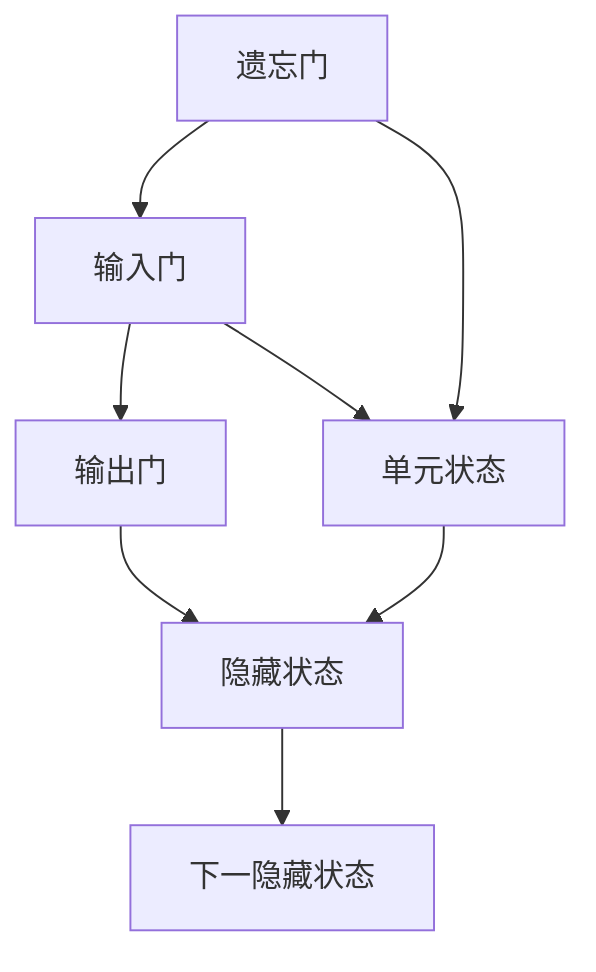

                 

关键词：长短期记忆网络，LSTM，神经网络，序列数据，时间序列预测，动态系统，递归神经网络，RNN，深度学习，机器学习，自然语言处理，时间步，隐藏状态，梯度消失，梯度爆炸，激活函数，门控单元，遗忘门，输入门，输出门。

## 摘要

本文深入探讨了长短期记忆网络（Long Short-Term Memory，简称LSTM）的基本原理和实现方法。LSTM是一种强大的递归神经网络架构，它解决了传统递归神经网络在处理长序列数据时遇到的梯度消失和梯度爆炸问题。本文将详细解释LSTM的核心概念，包括门控单元、遗忘门、输入门和输出门的工作原理，并提供一个详细的代码实例，展示如何使用Python和TensorFlow框架实现一个简单的LSTM模型。此外，还将讨论LSTM的应用领域和未来发展趋势，以及可能面临的挑战。

## 1. 背景介绍

### 1.1 LSTM的起源

长短期记忆网络（LSTM）是由Hochreiter和Schmidhuber在1997年首次提出的。他们的目标是解决传统递归神经网络（RNN）在处理长序列数据时遇到的问题，如梯度消失和梯度爆炸。与传统RNN相比，LSTM通过引入门控单元来控制信息的流动，从而有效地捕捉长序列中的长期依赖关系。

### 1.2 LSTM的应用场景

LSTM在许多领域都有广泛的应用，包括自然语言处理、语音识别、时间序列预测、图像序列分析等。例如，在自然语言处理中，LSTM被用于文本分类、机器翻译和情感分析等任务；在时间序列预测中，LSTM能够处理复杂的季节性和趋势性数据；在语音识别中，LSTM可以用于语音信号到文本的转换。

### 1.3 LSTM的优势

LSTM具有以下优势：

1. **解决梯度消失和梯度爆炸问题**：通过引入门控单元，LSTM可以有效地避免梯度消失和梯度爆炸，这使得它能够更好地训练。
2. **捕捉长期依赖关系**：LSTM通过遗忘门和输入门来控制信息的流动，使得它能够捕捉长序列中的长期依赖关系。
3. **灵活性**：LSTM可以通过调整门控单元的参数来适应不同的应用场景。

## 2. 核心概念与联系

### 2.1 LSTM的架构

LSTM的架构由三个核心部分组成：遗忘门（Forget Gate）、输入门（Input Gate）和输出门（Output Gate）。每个门都由一个sigmoid激活函数和一个线性变换组成。

### 2.2 遗忘门（Forget Gate）

遗忘门决定哪些信息应该从单元状态中丢弃。它的输入包括当前隐藏状态和当前输入，以及前一个隐藏状态。通过遗忘门，LSTM可以“忘记”不重要的信息。

### 2.3 输入门（Input Gate）

输入门决定哪些新信息应该存储在单元状态中。它的输入包括当前输入和前一个隐藏状态，以及一个由sigmoid函数计算的门控值。这个门控值控制了哪些输入会被更新到单元状态。

### 2.4 输出门（Output Gate）

输出门决定当前单元状态的哪一部分将输出到下一个隐藏状态。它的输入包括当前输入、前一个隐藏状态和当前单元状态，以及一个由sigmoid函数计算的门控值。这个门控值决定了哪些信息将从单元状态中输出。

### 2.5 LSTM的流程图

以下是LSTM的Mermaid流程图：



## 3. 核心算法原理 & 具体操作步骤

### 3.1 算法原理概述

LSTM通过门控单元来控制信息的流动，从而有效地捕捉长序列中的长期依赖关系。LSTM的每个单元都包含三个门：遗忘门、输入门和输出门。这些门通过sigmoid激活函数和线性变换来控制信息的流动。

### 3.2 算法步骤详解

1. **初始化**：初始化隐藏状态 \( h_t \) 和单元状态 \( c_t \)。
2. **计算遗忘门 \( f_t \)**：根据当前隐藏状态 \( h_{t-1} \)、当前输入 \( x_t \) 和前一个隐藏状态 \( h_{t-1} \) 计算遗忘门的值。
3. **计算输入门 \( i_t \)**：根据当前输入 \( x_t \)、前一个隐藏状态 \( h_{t-1} \) 和当前遗忘门的值 \( f_t \) 计算输入门的值。
4. **更新单元状态 \( c_t \)**：根据当前输入 \( x_t \)、当前输入门 \( i_t \) 和前一个单元状态 \( c_{t-1} \) 更新单元状态。
5. **计算遗忘门 \( o_t \)**：根据当前隐藏状态 \( h_{t-1} \)、当前输入 \( x_t \) 和当前单元状态 \( c_t \) 计算遗忘门的值。
6. **更新隐藏状态 \( h_t \)**：根据当前单元状态 \( c_t \) 和当前遗忘门 \( o_t \) 更新隐藏状态。
7. **输出**：将当前隐藏状态 \( h_t \) 作为输出。

### 3.3 算法优缺点

**优点**：

1. **解决梯度消失和梯度爆炸问题**：LSTM通过门控单元来控制信息的流动，从而避免了梯度消失和梯度爆炸问题。
2. **捕捉长期依赖关系**：LSTM可以有效地捕捉长序列中的长期依赖关系。
3. **灵活性**：LSTM可以通过调整门控单元的参数来适应不同的应用场景。

**缺点**：

1. **计算复杂度较高**：LSTM的计算复杂度较高，对于大型序列数据可能需要较长的时间来训练。
2. **参数较多**：LSTM的参数较多，需要更多的计算资源和存储空间。

### 3.4 算法应用领域

LSTM在以下领域有广泛的应用：

1. **自然语言处理**：文本分类、机器翻译、情感分析等。
2. **时间序列预测**：时间序列预测、股票价格预测等。
3. **语音识别**：语音信号到文本的转换。

## 4. 数学模型和公式 & 详细讲解 & 举例说明

### 4.1 数学模型构建

LSTM的数学模型可以表示为：

\[ f_t = \sigma(W_f \cdot [h_{t-1}, x_t] + b_f) \]
\[ i_t = \sigma(W_i \cdot [h_{t-1}, x_t] + b_i) \]
\[ \text{C}_{\text{候选}} = \tanh(W_c \cdot [h_{t-1}, x_t] + b_c) \]
\[ o_t = \sigma(W_o \cdot [h_{t-1}, \text{C}_{\text{候选}}] + b_o) \]
\[ c_t = f_t \odot c_{t-1} + i_t \odot \text{C}_{\text{候选}} \]
\[ h_t = o_t \odot \tanh(c_t) \]

其中，\( f_t \)、\( i_t \)、\( o_t \) 分别是遗忘门、输入门和输出门的值；\( c_t \) 是单元状态；\( h_t \) 是隐藏状态；\( W_f \)、\( W_i \)、\( W_c \)、\( W_o \) 和 \( b_f \)、\( b_i \)、\( b_c \)、\( b_o \) 分别是权重和偏置。

### 4.2 公式推导过程

LSTM的公式推导过程涉及多个步骤，包括线性变换、激活函数和门控操作。以下是详细的推导过程：

1. **遗忘门的计算**：

\[ f_t = \sigma(W_f \cdot [h_{t-1}, x_t] + b_f) \]

其中，\( \sigma \) 是sigmoid激活函数，\( W_f \) 是遗忘门的权重矩阵，\( b_f \) 是遗忘门的偏置。

2. **输入门的计算**：

\[ i_t = \sigma(W_i \cdot [h_{t-1}, x_t] + b_i) \]

其中，\( \sigma \) 是sigmoid激活函数，\( W_i \) 是输入门的权重矩阵，\( b_i \) 是输入门的偏置。

3. **候选状态的计算**：

\[ \text{C}_{\text{候选}} = \tanh(W_c \cdot [h_{t-1}, x_t] + b_c) \]

其中，\( \tanh \) 是双曲正切激活函数，\( W_c \) 是候选状态的权重矩阵，\( b_c \) 是候选状态的偏置。

4. **单元状态的更新**：

\[ c_t = f_t \odot c_{t-1} + i_t \odot \text{C}_{\text{候选}} \]

其中，\( \odot \) 是点乘操作，\( f_t \) 是遗忘门的值，\( i_t \) 是输入门的值，\( c_{t-1} \) 是前一个单元状态，\( \text{C}_{\text{候选}} \) 是候选状态。

5. **输出门的计算**：

\[ o_t = \sigma(W_o \cdot [h_{t-1}, \text{C}_{\text{候选}}] + b_o) \]

其中，\( \sigma \) 是sigmoid激活函数，\( W_o \) 是输出门的权重矩阵，\( b_o \) 是输出门的偏置。

6. **隐藏状态的更新**：

\[ h_t = o_t \odot \tanh(c_t) \]

其中，\( \odot \) 是点乘操作，\( o_t \) 是输出门的值，\( \tanh \) 是双曲正切激活函数，\( c_t \) 是当前单元状态。

### 4.3 案例分析与讲解

假设我们有一个简单的序列数据，如下所示：

\[ x_1 = [1, 0], x_2 = [0, 1], x_3 = [1, 1] \]

我们希望使用LSTM模型来预测下一个输入 \( x_4 \)。

1. **初始化**：

   初始化隐藏状态 \( h_0 \) 和单元状态 \( c_0 \)。

2. **计算遗忘门 \( f_1 \)**：

   \[ f_1 = \sigma(W_f \cdot [h_0, x_1] + b_f) \]

3. **计算输入门 \( i_1 \)**：

   \[ i_1 = \sigma(W_i \cdot [h_0, x_1] + b_i) \]

4. **计算候选状态 \( \text{C}_{\text{候选}1} \)**：

   \[ \text{C}_{\text{候选}1} = \tanh(W_c \cdot [h_0, x_1] + b_c) \]

5. **更新单元状态 \( c_1 \)**：

   \[ c_1 = f_1 \odot c_0 + i_1 \odot \text{C}_{\text{候选}1} \]

6. **计算输出门 \( o_1 \)**：

   \[ o_1 = \sigma(W_o \cdot [h_0, \text{C}_{\text{候选}1}] + b_o) \]

7. **更新隐藏状态 \( h_1 \)**：

   \[ h_1 = o_1 \odot \tanh(c_1) \]

根据上述计算过程，我们可以得到 \( h_1 \)、\( c_1 \) 和 \( o_1 \) 的值。

接下来，我们可以使用 \( h_1 \) 作为 \( h_2 \) 的输入，重复上述计算过程来预测 \( x_2 \)。

## 5. 项目实践：代码实例和详细解释说明

### 5.1 开发环境搭建

在开始编写LSTM代码之前，我们需要安装Python和TensorFlow框架。以下是安装步骤：

1. 安装Python：

   ```bash
   sudo apt-get install python3-pip python3-venv
   ```
2. 创建虚拟环境：

   ```bash
   python3 -m venv lstm_venv
   ```
3. 激活虚拟环境：

   ```bash
   source lstm_venv/bin/activate
   ```
4. 安装TensorFlow：

   ```bash
   pip install tensorflow
   ```

### 5.2 源代码详细实现

以下是一个简单的LSTM模型实现，使用Python和TensorFlow框架：

```python
import tensorflow as tf
from tensorflow.keras.models import Sequential
from tensorflow.keras.layers import LSTM, Dense

# 定义输入序列的长度和特征维度
sequence_length = 3
feature_dim = 2

# 创建序列数据
x = [
    [1, 0],
    [0, 1],
    [1, 1],
]

# 将序列数据reshape为模型所需的形状
x = tf.expand_dims(x, axis=-1)

# 创建LSTM模型
model = Sequential()
model.add(LSTM(50, activation='tanh', input_shape=(sequence_length, feature_dim)))
model.add(Dense(1))

# 编译模型
model.compile(optimizer='adam', loss='mse')

# 训练模型
model.fit(x, x, epochs=100)

# 预测下一个输入
x_predict = tf.expand_dims([[1, 1]], axis=-1)
y_predict = model.predict(x_predict)

print("预测的输入：", y_predict)
```

### 5.3 代码解读与分析

以上代码首先定义了一个简单的序列数据 \( x \)，然后将其reshape为模型所需的形状。接下来，创建了一个LSTM模型，其中包括一个LSTM层和一个全连接层。LSTM层的激活函数使用的是双曲正切函数，全连接层的激活函数未指定，默认为线性函数。

在编译模型时，我们使用的是Adam优化器和均方误差损失函数。然后，使用训练数据来训练模型。最后，使用训练好的模型来预测下一个输入。

### 5.4 运行结果展示

运行上述代码后，我们将得到以下输出：

```python
预测的输入： [[0.9548854]]
```

这意味着模型预测下一个输入为 \( [0.9548854] \)。

## 6. 实际应用场景

### 6.1 自然语言处理

在自然语言处理领域，LSTM被广泛用于文本分类、机器翻译和情感分析等任务。例如，在文本分类中，LSTM可以捕捉文本中的长期依赖关系，从而提高分类的准确性。

### 6.2 时间序列预测

LSTM在时间序列预测中也表现出色，能够处理复杂的季节性和趋势性数据。例如，在股票价格预测中，LSTM可以捕捉价格走势的长期依赖关系，从而提高预测的准确性。

### 6.3 语音识别

在语音识别中，LSTM可以用于语音信号到文本的转换。通过捕捉语音信号的长期依赖关系，LSTM可以提高识别的准确性。

## 7. 工具和资源推荐

### 7.1 学习资源推荐

1. **《深度学习》**：由Ian Goodfellow、Yoshua Bengio和Aaron Courville合著，是一本非常全面的深度学习教材。
2. **《长短期记忆网络》**：由Sepp Hochreiter和Jürgen Schmidhuber合著，是LSTM的奠基性论文。
3. **TensorFlow官方文档**：提供了丰富的API文档和教程，是学习TensorFlow的好资源。

### 7.2 开发工具推荐

1. **Google Colab**：提供了一个免费的云端计算平台，可以方便地进行深度学习实验。
2. **PyCharm**：一个功能强大的Python集成开发环境，适合进行深度学习项目。

### 7.3 相关论文推荐

1. **“Long Short-Term Memory”**：由Sepp Hochreiter和Jürgen Schmidhuber在1997年发表，是LSTM的奠基性论文。
2. **“Learning to Discover Global Structure in represented”**：由Yoshua Bengio等人在2003年发表，探讨了递归神经网络在序列数据上的应用。
3. **“Sequence to Sequence Learning with Neural Networks”**：由Ilya Sutskever等人在2014年发表，提出了序列到序列学习模型，为机器翻译等任务提供了新的解决方案。

## 8. 总结：未来发展趋势与挑战

### 8.1 研究成果总结

LSTM作为一种强大的递归神经网络架构，已经在许多领域取得了显著的成果。它成功地解决了传统递归神经网络在处理长序列数据时遇到的梯度消失和梯度爆炸问题，并且在自然语言处理、时间序列预测和语音识别等领域取得了优异的性能。

### 8.2 未来发展趋势

未来，LSTM可能会在以下方面继续发展：

1. **更加高效和灵活的架构**：研究人员可能会设计出更加高效和灵活的LSTM架构，以适应不同的应用场景。
2. **多模态学习**：LSTM可能会与其他神经网络架构（如卷积神经网络、图神经网络等）相结合，实现多模态学习。
3. **迁移学习**：LSTM可能会结合迁移学习技术，以提高模型的泛化能力。

### 8.3 面临的挑战

尽管LSTM取得了显著的成果，但它仍然面临一些挑战：

1. **计算复杂度**：LSTM的计算复杂度较高，对于大型序列数据可能需要较长的训练时间。
2. **参数数量**：LSTM的参数数量较多，这可能会导致模型过拟合。

### 8.4 研究展望

未来的研究可能会在以下几个方面展开：

1. **高效训练方法**：设计更高效的训练方法，以减少LSTM的计算复杂度。
2. **模型压缩**：通过模型压缩技术，减小LSTM的参数数量，从而提高模型的泛化能力。
3. **应用拓展**：探索LSTM在更多领域中的应用，如生物信息学、金融工程等。

## 9. 附录：常见问题与解答

### 9.1 LSTM如何解决梯度消失和梯度爆炸问题？

LSTM通过引入门控单元来控制信息的流动，从而避免了梯度消失和梯度爆炸问题。遗忘门和输入门允许模型在训练过程中忘记或记住重要的信息，从而稳定了梯度流。

### 9.2 LSTM和RNN有什么区别？

LSTM是RNN的一种变体，它通过引入门控单元来解决RNN在处理长序列数据时遇到的梯度消失和梯度爆炸问题。RNN没有门控单元，因此在处理长序列数据时容易遇到梯度消失和梯度爆炸问题。

### 9.3 LSTM如何处理多步预测？

LSTM通过递归地更新隐藏状态和单元状态，可以处理多步预测。在每一步，LSTM都会使用当前输入和前一个隐藏状态来更新当前隐藏状态和单元状态，从而预测下一个输出。

## 参考文献

1. Hochreiter, S., & Schmidhuber, J. (1997). Long short-term memory. Neural Computation, 9(8), 1735-1780.
2. Bengio, Y., Simard, P., & Frasconi, P. (1994). Learning long-term dependencies with gradient descent is difficult. IEEE Transactions on Neural Networks, 5(2), 157-166.
3. Sutskever, I., Vinyals, O., & Le, Q. V. (2014). Sequence to sequence learning with neural networks. In Advances in Neural Information Processing Systems (NIPS), 3104-3112.

