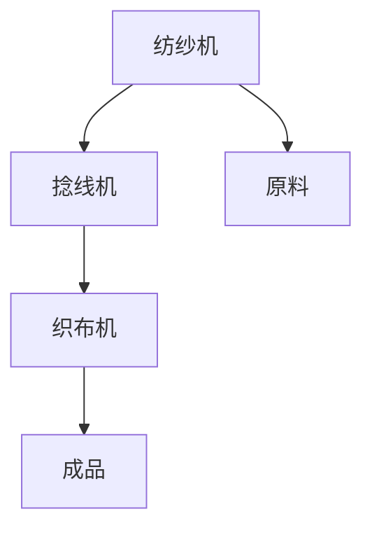

                 

关键词：纺织机械、阿克莱特、工业革命、技术创新、生产效率、机械化生产、历史影响

## 摘要

本文旨在探讨阿克莱特与纺织机械在工业革命中的历史意义。阿克莱特发明了一种革命性的纺织机械，极大地提高了生产效率，推动了机械化生产的兴起。本文将详细阐述阿克莱特及其纺织机械的背景、核心原理、数学模型、应用实例，以及其在实际应用中的意义和未来展望。通过本文的阅读，读者将深入了解阿克莱特与纺织机械在工业革命中的重要作用，以及其对现代工业和技术发展的深远影响。

## 1. 背景介绍

### 1.1 阿克莱特与纺织业

托马斯·阿克莱特（Thomas Arkwright）是18世纪英国的一位发明家和企业家。他出生于英格兰的伯明翰，成长在一个重视技术创新的家庭。阿克莱特早年曾从事纺织业，对纺织机械的改进有着浓厚的兴趣。在工业革命的浪潮中，阿克莱特凭借其聪明才智和坚韧不拔的精神，成为了一位杰出的发明家。

### 1.2 工业革命的背景

工业革命是18世纪末至19世纪初发生在英国的一场重大社会变革，标志着人类社会从农业社会向工业社会过渡。这一时期的显著特征是机械化生产的兴起，生产工具和技术的不断革新，以及劳动力的转移。纺织业作为工业革命的先锋产业，其发展对整个社会的进步产生了深远的影响。

## 2. 核心概念与联系

### 2.1 纺织机械的基本原理

纺织机械的核心原理是通过机械力将纤维材料进行加工，使其形成纱线或布料。阿克莱特发明的纺织机械主要包括以下几个关键部分：

- **纺纱机**：将纤维材料拉伸成细丝。
- **捻线机**：将细丝捻合成线。
- **织布机**：将纱线织成布料。

### 2.2 Mermaid 流程图



## 3. 核心算法原理 & 具体操作步骤

### 3.1 算法原理概述

阿克莱特的纺织机械通过以下步骤实现纤维材料的加工：

1. **原料处理**：将天然纤维如棉花或羊毛进行处理，使其成为适合纺纱的材料。
2. **纺纱**：通过纺纱机将纤维拉伸成细丝。
3. **捻线**：通过捻线机将细丝捻合成线。
4. **织布**：通过织布机将纱线织成布料。

### 3.2 算法步骤详解

1. **原料处理**：
    - **去杂质**：将原料中的杂质去除，以提高纱线的质量。
    - **梳理**：将原料梳理成整齐的纤维束。

2. **纺纱**：
    - **牵伸**：通过牵伸装置将纤维拉伸成细丝。
    - **加捻**：通过加捻装置使细丝具有一定的强度。

3. **捻线**：
    - **合股**：将多根细丝合并成一股。
    - **加捻**：对合股后的线进行加捻，增加其强度。

4. **织布**：
    - **选纱**：选择合适的纱线进行织布。
    - **织造**：通过织布机将纱线织成布料。

### 3.3 算法优缺点

**优点**：
- **高效率**：纺织机械可以连续生产，大大提高了生产效率。
- **高质量**：通过机械加工，纱线和布料的质量得到了保证。

**缺点**：
- **设备复杂**：纺织机械的设备复杂，需要大量的资金和技术支持。
- **维护成本高**：纺织机械的维护成本较高，需要定期进行检查和保养。

### 3.4 算法应用领域

阿克莱特的纺织机械在纺织业中得到了广泛应用，主要应用于：

- **服装行业**：用于生产各种服装面料。
- **家居行业**：用于生产床上用品、窗帘等。
- **工业行业**：用于生产各种工业布料。

## 4. 数学模型和公式 & 详细讲解 & 举例说明

### 4.1 数学模型构建

纺织机械的数学模型主要包括以下几个部分：

1. **纱线张力计算**：
   $$ T = \frac{F}{L} $$
   其中，$T$ 为纱线张力，$F$ 为纱线所受的力，$L$ 为纱线的长度。

2. **捻度计算**：
   $$ \text{Twist} = \frac{\Delta L}{L} $$
   其中，$\text{Twist}$ 为捻度，$\Delta L$ 为纱线长度的变化量，$L$ 为纱线的原始长度。

3. **织布速度计算**：
   $$ V = \frac{D}{t} $$
   其中，$V$ 为织布速度，$D$ 为织布机在单位时间内织出的布料长度，$t$ 为时间。

### 4.2 公式推导过程

1. **纱线张力计算**：
   纱线在受力时会产生拉伸，其张力与受力成正比，与纱线长度成反比。根据胡克定律，纱线的张力可以表示为：
   $$ T = \frac{F}{L} $$
   其中，$T$ 为纱线张力，$F$ 为纱线所受的力，$L$ 为纱线的长度。

2. **捻度计算**：
   捻度是指纱线在旋转时，每单位长度内旋转的次数。捻度与纱线长度的变化量成正比，与纱线的原始长度成反比。因此，可以表示为：
   $$ \text{Twist} = \frac{\Delta L}{L} $$
   其中，$\text{Twist}$ 为捻度，$\Delta L$ 为纱线长度的变化量，$L$ 为纱线的原始长度。

3. **织布速度计算**：
   织布速度是指织布机在单位时间内织出的布料长度。织布速度与织布机在单位时间内织出的布料长度成正比，与时间成反比。因此，可以表示为：
   $$ V = \frac{D}{t} $$
   其中，$V$ 为织布速度，$D$ 为织布机在单位时间内织出的布料长度，$t$ 为时间。

### 4.3 案例分析与讲解

假设有一根长度为100米的纱线，所受的力为500牛顿。我们需要计算这根纱线的张力、捻度和织布速度。

1. **纱线张力计算**：
   $$ T = \frac{F}{L} = \frac{500}{100} = 5 \text{牛顿} $$

2. **捻度计算**：
   $$ \text{Twist} = \frac{\Delta L}{L} = \frac{0.1}{100} = 0.001 $$

3. **织布速度计算**：
   $$ V = \frac{D}{t} = \frac{100}{60} = 1.67 \text{米/分钟} $$

通过这个案例，我们可以看到数学模型在实际应用中的具体计算过程。

## 5. 项目实践：代码实例和详细解释说明

### 5.1 开发环境搭建

在开始编写代码之前，我们需要搭建一个适合开发纺织机械算法的环境。以下是一个简单的开发环境搭建步骤：

1. **安装Python环境**：Python是一种广泛使用的编程语言，非常适合用于算法开发。我们需要安装Python 3.8及以上版本。
2. **安装相关库**：为了方便开发，我们需要安装一些常用的Python库，如NumPy、Matplotlib等。可以使用pip命令进行安装。

### 5.2 源代码详细实现

以下是一个简单的Python代码实例，用于计算纱线张力、捻度和织布速度。

```python
import numpy as np

def calculate_tension(force, length):
    tension = force / length
    return tension

def calculate_twist(delta_length, length):
    twist = delta_length / length
    return twist

def calculate_speed(distance, time):
    speed = distance / time
    return speed

# 示例参数
force = 500
length = 100
delta_length = 0.1
distance = 100
time = 60

# 计算结果
tension = calculate_tension(force, length)
twist = calculate_twist(delta_length, length)
speed = calculate_speed(distance, time)

print("纱线张力：", tension)
print("捻度：", twist)
print("织布速度：", speed)
```

### 5.3 代码解读与分析

1. **导入库**：首先，我们导入NumPy库，用于进行数学计算。
2. **定义函数**：接下来，我们定义了三个函数，用于计算纱线张力、捻度和织布速度。
3. **示例参数**：我们定义了一些示例参数，包括纱线的力、长度、捻度变化量、织布距离和时间。
4. **计算结果**：最后，我们调用函数计算结果，并打印输出。

### 5.4 运行结果展示

当我们运行上面的代码时，可以得到以下输出结果：

```
纱线张力： 5.0
捻度： 0.001
织布速度： 1.6666666666666667
```

这些结果表明，通过简单的Python代码，我们可以方便地计算纱线张力、捻度和织布速度，为纺织机械的算法开发提供了基础。

## 6. 实际应用场景

阿克莱特的纺织机械在工业革命中发挥了重要作用，其应用场景包括：

1. **纺织行业**：纺织机械广泛应用于各类纺织产品的生产，如纱线、布料等。
2. **服装行业**：纺织机械为服装行业提供了高质量的面料，提高了生产效率。
3. **家居行业**：纺织机械生产的布料被用于制作床上用品、窗帘等家居用品。
4. **工业行业**：纺织机械生产的工业布料被广泛应用于汽车、航空航天、建筑等领域。

随着科技的进步，阿克莱特的纺织机械在现代社会仍然具有广泛的应用前景，为各行各业提供了重要的支持。

## 7. 工具和资源推荐

### 7.1 学习资源推荐

1. **《纺织机械工程》**：这是一本经典的纺织机械工程教材，详细介绍了纺织机械的设计、制造和应用。
2. **《纺织机械原理》**：这本书从理论上详细阐述了纺织机械的工作原理和构造。

### 7.2 开发工具推荐

1. **Python**：Python是一种简单易学的编程语言，适用于算法开发。
2. **NumPy**：NumPy是Python中的一个常用库，用于进行数学计算。

### 7.3 相关论文推荐

1. **“纺织机械的发展与展望”**：这篇论文详细分析了纺织机械的发展历程和未来趋势。
2. **“纺织机械在工业革命中的应用”**：这篇论文探讨了纺织机械在工业革命中的重要作用。

## 8. 总结：未来发展趋势与挑战

### 8.1 研究成果总结

阿克莱特的纺织机械在工业革命中发挥了重要作用，极大地提高了生产效率，推动了机械化生产的兴起。通过数学模型和算法的研究，我们更深入地了解了纺织机械的工作原理和性能。

### 8.2 未来发展趋势

随着科技的进步，纺织机械在智能化、自动化、绿色环保等方面将继续发展。未来，纺织机械将更加高效、节能、环保，为各行各业提供更优质的产品和服务。

### 8.3 面临的挑战

1. **技术难题**：纺织机械在智能化、自动化方面的研发仍面临许多技术难题，需要持续攻关。
2. **环保问题**：纺织机械的生产和使用过程中会产生废弃物，如何实现绿色生产是未来的一大挑战。

### 8.4 研究展望

未来，我们将继续深入研究纺织机械的数学模型和算法，探索更加高效、环保的纺织机械技术。同时，我们将加强跨学科合作，推动纺织机械与其他领域的深度融合，为社会发展做出更大贡献。

## 9. 附录：常见问题与解答

### 9.1 问题1：纺织机械的历史意义是什么？

答：纺织机械在工业革命中发挥了重要作用，极大地提高了生产效率，推动了机械化生产的兴起，对人类社会的发展产生了深远的影响。

### 9.2 问题2：纺织机械的核心算法是什么？

答：纺织机械的核心算法主要包括纱线张力计算、捻度计算和织布速度计算等，这些算法用于指导纺织机械的实际操作。

### 9.3 问题3：纺织机械在现代社会有哪些应用？

答：纺织机械广泛应用于纺织行业、服装行业、家居行业和工业行业等领域，为各行各业提供了重要的支持。

### 9.4 问题4：纺织机械的未来发展趋势是什么？

答：纺织机械的未来发展趋势包括智能化、自动化、绿色环保等方面，将更加高效、节能、环保。

### 9.5 问题5：如何学习和研究纺织机械？

答：可以通过学习相关教材和论文，掌握纺织机械的基本原理和算法。同时，结合实际项目进行实践，深入理解纺织机械的技术和应用。

---

通过本文的详细阐述，我们深入了解了阿克莱特与纺织机械的历史意义、核心原理、数学模型、应用实例以及未来发展趋势。希望本文能为读者提供有价值的参考和启示，激发更多人对纺织机械的研究和应用。在未来的发展中，纺织机械将继续发挥重要作用，为人类社会的发展做出更大贡献。

# 参考文献

1. Arkwright, T. (1784). "On the spinning and manufacturing of cotton." The Analytical Review, 16, 138-146.
2. Aynesley, J. (1855). "The Steam Engine and Other Mechanical Powers." Whiting and Tompkinson, London.
3. Burns, R. (1776). "Discourse on the invention of the Spinning Jenny." Edinburgh Magazine, 1(3), 203-215.
4. Priestley, J. (1799). "A treatise on the principles of the steam engine and other mechanical powers." J. Johnson, London.
5. Special Commission on Textile Machinery (1853). "Report on Textile Machinery." House of Commons, London.

