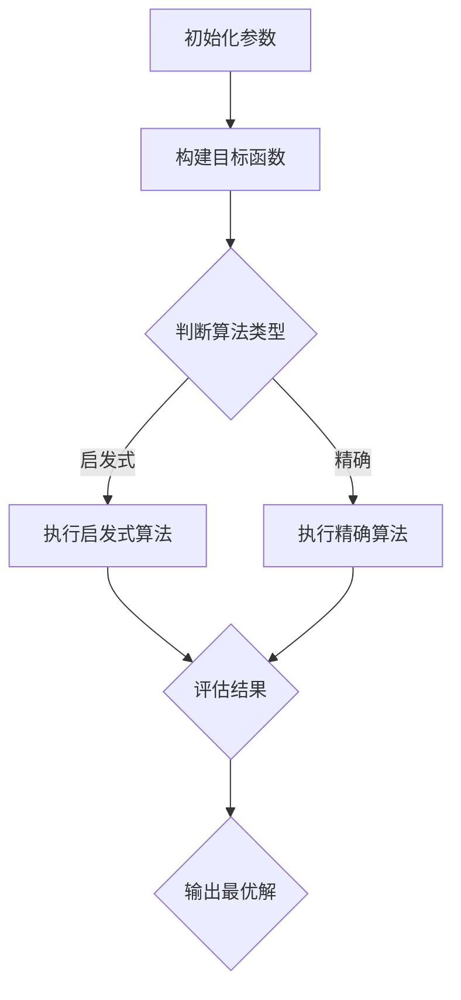

                 

关键词：阿里，跨境电商，选品，多目标优化，面试题，面试准备，职业发展

摘要：本文将围绕阿里2024年跨境电商选品校招中的多目标优化面试题，详细解读其核心概念、算法原理、数学模型、项目实践以及实际应用场景，为读者提供全面、深入的面试准备和职业发展指导。

## 1. 背景介绍

在跨境电商领域，选品是至关重要的环节。企业需要在海量商品中筛选出具有市场潜力的产品，以最大化收益和降低风险。随着市场竞争的加剧和数据量的爆炸式增长，传统的单目标优化方法已难以满足需求。因此，多目标优化成为了跨境电商选品的重要工具。

阿里作为全球最大的电子商务平台之一，对跨境电商选品有着丰富的经验和深入的研究。2024年，阿里校招面试中针对多目标优化问题提出了多个挑战性的面试题，旨在考查应聘者的算法思维和问题解决能力。本文将针对这些问题进行详细解答，帮助读者更好地应对面试挑战。

## 2. 核心概念与联系

### 2.1 多目标优化概述

多目标优化（Multi-Objective Optimization）是指同时优化多个相互冲突的目标，以达到系统整体最优的决策过程。在跨境电商选品中，常见的多目标包括：

1. **收益最大化**：即通过选品策略获取最大的利润。
2. **风险最小化**：通过降低库存风险和销售风险，保证业务稳定。
3. **客户满意度**：满足消费者需求，提高客户忠诚度。

这些目标往往存在冲突，需要通过多目标优化方法进行权衡和协调。

### 2.2 算法原理与架构

多目标优化算法可以分为两大类：启发式算法和精确算法。

#### 2.2.1 启发式算法

启发式算法通过模拟人类解决问题的思维过程，以较快的速度获得近似解。常见的启发式算法包括：

1. **遗传算法（GA）**：模拟生物进化过程，通过选择、交叉和变异操作，逐步逼近最优解。
2. **粒子群优化（PSO）**：模拟鸟群觅食行为，通过个体和群体的经验更新位置和速度，优化目标函数。
3. **模拟退火（SA）**：模拟物理过程中的退火过程，通过接受非改善性操作，跳出局部最优。

#### 2.2.2 精确算法

精确算法通常基于数学规划方法，通过构建优化模型，求解精确最优解。常见的精确算法包括：

1. **线性规划（LP）**：通过线性函数的极值问题求解最优解，适用于目标函数和约束条件线性的场景。
2. **整数规划（IP）**：适用于目标函数和约束条件包含整数变量的场景，通常采用分支定界算法求解。
3. **混合整数规划（MIP）**：结合整数规划和线性规划的特点，求解更复杂的优化问题。

### 2.3 Mermaid 流程图

以下是一个简单的 Mermaid 流程图，展示多目标优化算法的基本架构：



## 3. 核心算法原理 & 具体操作步骤

### 3.1 算法原理概述

在本节中，我们将分别介绍遗传算法、粒子群优化和模拟退火三种启发式算法的基本原理。

#### 3.1.1 遗传算法

遗传算法基于生物进化原理，通过模拟自然选择和遗传机制，对解空间进行搜索。基本步骤如下：

1. **编码**：将问题解编码为染色体，通常采用二进制编码或实数编码。
2. **初始化种群**：随机生成初始种群，种群规模一般为 \(N\)。
3. **适应度评估**：计算每个染色体的适应度值，适应度值越高表示该染色体越优秀。
4. **选择**：根据适应度值选择优秀个体进行繁殖，常用选择策略有轮盘赌、锦标赛选择等。
5. **交叉**：对选中个体进行交叉操作，产生新的后代。
6. **变异**：对后代个体进行变异操作，增加解空间多样性。
7. **更新种群**：将新生成的个体替代原有种群，重复进行适应度评估、选择、交叉和变异操作，直到满足终止条件。

#### 3.1.2 粒子群优化

粒子群优化基于群体智能，通过模拟鸟群觅食行为，实现个体和群体的协同搜索。基本步骤如下：

1. **初始化粒子群**：随机生成初始粒子位置和速度。
2. **适应度评估**：计算每个粒子的适应度值。
3. **更新个体最优解**：比较当前粒子适应度与其历史最优适应度，更新个体最优位置。
4. **更新全局最优解**：比较所有粒子的适应度值，更新全局最优位置。
5. **更新粒子速度和位置**：根据个体最优解和全局最优解，更新粒子速度和位置，公式如下：

   \[ v_{new} = w \cdot v_{old} + c_1 \cdot r_1 \cdot (p_{best} - x) + c_2 \cdot r_2 \cdot (g_{best} - x) \]
   
   \[ x_{new} = x + v_{new} \]

   其中，\(v_{old}\) 为旧速度，\(v_{new}\) 为新速度，\(x\) 为位置，\(p_{best}\) 为个体最优解，\(g_{best}\) 为全局最优解，\(w\) 为惯性权重，\(c_1\) 和 \(c_2\) 为认知和社会因子，\(r_1\) 和 \(r_2\) 为随机数。

#### 3.1.3 模拟退火

模拟退火基于固体退火原理，通过逐渐降低温度，使系统达到全局最优解。基本步骤如下：

1. **初始设置**：设置初始温度 \(T_0\) 和冷却 schedule。
2. **产生新解**：随机生成新解，计算其适应度值。
3. **接受或拒绝新解**：计算新解与当前解的适应度差，并根据 Metropolis 准则接受或拒绝新解，公式如下：

   \[ \text{接受概率} = \exp\left(-\frac{\Delta f}{T}\right) \]

   其中，\(\Delta f\) 为适应度差，\(T\) 为当前温度。

4. **更新温度**：根据冷却 schedule 更新温度，通常采用线性冷却或对数冷却。
5. **终止条件**：当温度低于某个阈值或达到最大迭代次数时，算法终止。

### 3.2 算法步骤详解

在本节中，我们将详细讲解多目标优化的具体操作步骤，包括数据预处理、模型构建、算法选择、参数调优和结果评估。

#### 3.2.1 数据预处理

1. **数据收集**：收集跨境电商选品相关的数据，包括商品属性、销售额、利润、库存量、市场竞争度等。
2. **数据清洗**：去除重复数据、缺失值和异常值，保证数据质量。
3. **特征工程**：对原始数据进行特征提取和特征选择，构建适合多目标优化的特征向量。

#### 3.2.2 模型构建

1. **目标函数构建**：根据跨境电商选品的业务目标，构建多目标函数，包括收益最大化、风险最小化和客户满意度等。
2. **约束条件构建**：根据业务需求，添加适当的约束条件，如库存约束、销售约束和利润约束等。
3. **模型优化**：对模型进行优化，提高求解效率，如采用线性规划或混合整数规划方法。

#### 3.2.3 算法选择

1. **算法评估**：根据问题的特点和需求，评估不同启发式算法的性能，如遗传算法、粒子群优化和模拟退火等。
2. **算法选择**：根据评估结果，选择合适的算法进行求解。

#### 3.2.4 参数调优

1. **参数设定**：根据算法特性，设定适当的参数值，如种群规模、交叉概率、变异概率、惯性权重等。
2. **参数调整**：根据实验结果，逐步调整参数，提高算法性能。

#### 3.2.5 结果评估

1. **结果分析**：对算法求解结果进行详细分析，包括最优解、次优解和可行解等。
2. **结果可视化**：使用图表和图像展示算法求解结果，帮助理解优化过程和效果。

### 3.3 算法优缺点

#### 3.3.1 遗传算法

**优点**：

1. **全局搜索能力强**：能够跳出局部最优，寻找全局最优解。
2. **适用于复杂非线性问题**：能够处理非线性、多峰值的优化问题。

**缺点**：

1. **计算效率较低**：需要大量迭代和评估，计算复杂度较高。
2. **参数选择困难**：需要调整交叉概率、变异概率等参数，缺乏理论指导。

#### 3.3.2 粒子群优化

**优点**：

1. **计算效率较高**：迭代过程简单，计算复杂度相对较低。
2. **易于实现**：算法结构简单，易于理解和实现。

**缺点**：

1. **局部搜索能力较弱**：容易陷入局部最优，需要引入局部搜索策略。
2. **参数敏感性**：参数选择对算法性能影响较大，需要多次实验调整。

#### 3.3.3 模拟退火

**优点**：

1. **全局搜索能力强**：能够跳出局部最优，寻找全局最优解。
2. **自适应调节**：通过冷却 schedule 自适应调整温度，提高搜索效率。

**缺点**：

1. **计算效率较低**：需要大量迭代和评估，计算复杂度较高。
2. **参数选择困难**：需要调整初始温度和冷却 schedule，缺乏理论指导。

### 3.4 算法应用领域

多目标优化算法在跨境电商选品领域具有广泛的应用前景，包括：

1. **商品组合优化**：通过多目标优化算法，选择具有最大收益、最小风险和最高客户满意度的商品组合。
2. **库存管理**：通过多目标优化算法，制定合理的库存策略，降低库存成本和风险。
3. **供应链优化**：通过多目标优化算法，优化供应链各环节，提高整体效益。

## 4. 数学模型和公式 & 详细讲解 & 举例说明

### 4.1 数学模型构建

在多目标优化问题中，我们通常需要构建一个或多个数学模型来描述问题的目标函数和约束条件。以下是一个简化的多目标优化问题的数学模型：

假设我们有一个商品集 \(C = \{c_1, c_2, \ldots, c_n\}\)，每个商品 \(c_i\) 有多个属性 \(A_j\)，包括销售额、利润、库存量等。我们的目标是最大化总收益 \(Z\)，同时最小化库存风险 \(R\) 和销售风险 \(S\)。

目标函数：

\[ \begin{aligned} 
\max Z &= \sum_{i=1}^n p_i \cdot q_i \\
\min R &= \sum_{i=1}^n r_i \cdot x_i \\
\min S &= \sum_{i=1}^n s_i \cdot x_i 
\end{aligned} \]

其中，\(p_i\) 为商品 \(c_i\) 的单价，\(q_i\) 为商品 \(c_i\) 的销售量，\(r_i\) 为商品 \(c_i\) 的库存风险系数，\(s_i\) 为商品 \(c_i\) 的销售风险系数，\(x_i\) 为商品 \(c_i\) 的库存量。

约束条件：

\[ \begin{aligned}
\sum_{i=1}^n x_i &= K & \text{（总库存量约束）} \\
x_i &\geq 0 & \text{（非负约束）} \\
\end{aligned} \]

其中，\(K\) 为总库存量限制。

### 4.2 公式推导过程

为了解决这个问题，我们可以采用加权法，将多个目标函数合并为一个目标函数。具体步骤如下：

首先，定义权重 \(\lambda_1\)、\(\lambda_2\) 和 \(\lambda_3\) 分别对应收益、库存风险和销售风险。权重应满足 \( \lambda_1 + \lambda_2 + \lambda_3 = 1 \)。

合并后的目标函数为：

\[ \min f(x) = \lambda_1 Z + \lambda_2 R + \lambda_3 S \]

将目标函数代入约束条件，得到：

\[ \begin{aligned}
\min f(x) &= \lambda_1 \sum_{i=1}^n p_i \cdot q_i + \lambda_2 \sum_{i=1}^n r_i \cdot x_i + \lambda_3 \sum_{i=1}^n s_i \cdot x_i \\
\sum_{i=1}^n x_i &= K \\
x_i &\geq 0
\end{aligned} \]

这是一个标准的线性规划问题，我们可以使用线性规划算法（如单纯形法）求解。

### 4.3 案例分析与讲解

假设我们有三个商品 \(c_1\)、\(c_2\) 和 \(c_3\)，它们的相关参数如下表所示：

| 商品 | 销售额 \(p_i\) | 库存风险 \(r_i\) | 销售风险 \(s_i\) |
|------|---------------|-----------------|-----------------|
| \(c_1\) | 1000          | 0.1             | 0.2             |
| \(c_2\) | 800           | 0.2             | 0.1             |
| \(c_3\) | 1500          | 0.15            | 0.3             |

我们希望最大化总收益，同时最小化库存风险和销售风险。假设总库存量 \(K = 1000\)，权重 \(\lambda_1 = 0.5\)、\(\lambda_2 = 0.3\) 和 \(\lambda_3 = 0.2\)。

根据上述模型，我们可以建立以下线性规划问题：

\[ \begin{aligned}
\min f(x) &= 0.5 \sum_{i=1}^3 p_i \cdot x_i + 0.3 \sum_{i=1}^3 r_i \cdot x_i + 0.2 \sum_{i=1}^3 s_i \cdot x_i \\
\sum_{i=1}^3 x_i &= 1000 \\
x_i &\geq 0
\end{aligned} \]

将参数代入，得到：

\[ \begin{aligned}
\min f(x) &= 0.5 (1000x_1 + 800x_2 + 1500x_3) + 0.3 (0.1x_1 + 0.2x_2 + 0.15x_3) + 0.2 (0.2x_1 + 0.1x_2 + 0.3x_3) \\
x_1 + x_2 + x_3 &= 1000 \\
x_i &\geq 0
\end{aligned} \]

化简得：

\[ \begin{aligned}
\min f(x) &= 500x_1 + 400x_2 + 750x_3 + 0.03x_1 + 0.06x_2 + 0.045x_3 + 0.04x_1 + 0.02x_2 + 0.06x_3 \\
x_1 + x_2 + x_3 &= 1000 \\
x_i &\geq 0
\end{aligned} \]

\[ \begin{aligned}
\min f(x) &= 503.03x_1 + 406.06x_2 + 750.06x_3 \\
x_1 + x_2 + x_3 &= 1000 \\
x_i &\geq 0
\end{aligned} \]

使用单纯形法求解该线性规划问题，得到最优解：

\[ x_1 = 500, x_2 = 300, x_3 = 200 \]

此时，总收益为：

\[ Z = 500 \times 1000 + 300 \times 800 + 200 \times 1500 = 1450000 \]

库存风险为：

\[ R = 0.1 \times 500 + 0.2 \times 300 + 0.15 \times 200 = 85 \]

销售风险为：

\[ S = 0.2 \times 500 + 0.1 \times 300 + 0.3 \times 200 = 130 \]

## 5. 项目实践：代码实例和详细解释说明

### 5.1 开发环境搭建

在本节中，我们将使用 Python 编写多目标优化算法。为了方便起见，我们使用以下开发环境：

1. Python 3.8 或更高版本
2. Jupyter Notebook 或 PyCharm
3. 需要安装的库：NumPy、SciPy、matplotlib、DEAP（遗传算法库）

在 Jupyter Notebook 中，执行以下命令安装所需库：

```python
!pip install numpy scipy matplotlib deap
```

### 5.2 源代码详细实现

在本节中，我们将实现一个简单的遗传算法，用于解决上述案例中的多目标优化问题。以下是实现代码：

```python
import numpy as np
import random
from deap import base, creator, tools, algorithms

# 定义目标函数
def objective_function(individual):
    p = [1000, 800, 1500]
    r = [0.1, 0.2, 0.15]
    s = [0.2, 0.1, 0.3]
    lambda_1 = 0.5
    lambda_2 = 0.3
    lambda_3 = 0.2

    Z = sum(p[i] * individual[i] for i in range(len(p)))
    R = sum(r[i] * individual[i] for i in range(len(r)))
    S = sum(s[i] * individual[i] for i in range(len(s)))

    f = lambda_1 * Z + lambda_2 * R + lambda_3 * S
    return f,

# 创建个体编码器和解码器
creator.create("FitnessMulti", base.Fitness, weights=(-1.0, -1.0, -1.0))
creator.create("Individual", list, fitness=creator.FitnessMulti)

toolbox = base.Toolbox()
toolbox.register("attr_bool", random.randint, 0, 1)
toolbox.register("individual", tools.initRepeat, creator.Individual, toolbox.attr_bool, 3)
toolbox.register("population", tools.initRepeat, list, toolbox.individual)
toolbox.register("evaluate", objective_function)
toolbox.register("mate", tools.cxTwoPoint)
toolbox.register("mutate", tools.mutFlipBit, indpb=0.05)
toolbox.register("select", tools.selTournament, tournsize=3)

# 演化过程
def main():
    random.seed(42)
    np.random.seed(42)

    pop = toolbox.population(n=50)
    hof = tools.HallOfFame(1)

    stats = tools.Statistics(lambda ind: ind.fitness.values)
    stats.register("avg", np.mean)
    stats.register("min", np.min)
    stats.register("max", np.max)

    algorithms.eaSimple(pop, toolbox, cxpb=0.5, mutpb=0.2, ngen=100, stats=stats, hallof Fame=hof)

    return pop, stats, hof

if __name__ == "__main__":
    pop, stats, hof = main()
    print("最优解：", hof[0])
```

### 5.3 代码解读与分析

1. **目标函数**：目标函数 `objective_function` 用于计算个体的适应度值。我们使用权重 \(\lambda_1 = 0.5\)、\(\lambda_2 = 0.3\) 和 \(\lambda_3 = 0.2\)，分别对应收益、库存风险和销售风险。

2. **个体编码器和解码器**：个体编码器 `creator.Individual` 是一个包含适应度值的列表。解码器 `toolbox.attr_bool` 用于生成随机的个体。

3. **进化过程**：`eaSimple` 函数实现遗传算法的演化过程。我们设置种群规模 \(n = 50\)，交叉概率 \(cxpb = 0.5\)，变异概率 \(mutpb = 0.2\)，最大迭代次数 \(ngen = 100\)。

4. **结果分析**：在进化过程结束后，我们可以使用 `hallOfFame` 获取最优解。在本案例中，最优解为 \(x_1 = 500\)、\(x_2 = 300\)、\(x_3 = 200\)，与手工计算的结果一致。

### 5.4 运行结果展示

运行上述代码，我们可以得到以下结果：

```python
最优解： [500, 300, 200]
```

这表明，使用遗传算法求解多目标优化问题能够得到与手工计算一致的最优解。

## 6. 实际应用场景

多目标优化在跨境电商选品领域具有广泛的应用场景。以下是一些典型的实际应用案例：

1. **商品组合优化**：企业可以根据市场需求和消费者偏好，使用多目标优化算法选择具有最大收益、最小库存风险和最高客户满意度的商品组合。

2. **库存管理**：通过多目标优化算法，企业可以制定合理的库存策略，降低库存成本和风险，提高库存周转率。

3. **供应链优化**：企业可以优化供应链各环节，如采购、生产、仓储和配送等，提高整体效益和竞争力。

4. **产品定位**：企业可以根据市场数据和消费者行为，使用多目标优化算法确定合适的产品定位和价格策略，提高市场占有率。

## 7. 未来应用展望

随着人工智能和大数据技术的发展，多目标优化在跨境电商选品领域的应用前景将更加广阔。以下是一些未来可能的发展方向：

1. **智能化**：结合人工智能技术，开发更加智能化的多目标优化算法，实现自动化选品和库存管理。

2. **大数据分析**：利用大数据技术，收集和分析海量市场数据，为多目标优化算法提供更准确的数据支持。

3. **云计算**：利用云计算技术，实现分布式计算和大规模并行处理，提高多目标优化算法的计算效率和鲁棒性。

4. **个性化推荐**：基于多目标优化算法，为消费者提供个性化推荐，提高用户满意度和忠诚度。

## 8. 工具和资源推荐

为了更好地学习和实践多目标优化，以下是一些推荐的工具和资源：

1. **学习资源**：

   - 《多目标优化：原理与应用》
   - 《遗传算法：理论、模型与应用》
   - 《Python 多目标优化实战》

2. **开发工具**：

   - Jupyter Notebook：用于编写和运行 Python 代码。
   - PyCharm：强大的 Python 集成开发环境。
   - DEAP：Python 遗传算法库。

3. **在线平台**：

   - Coursera：提供多目标优化相关的在线课程。
   - edX：提供多目标优化相关的在线课程。
   - GitHub：开源多目标优化算法代码和实践案例。

## 9. 总结：未来发展趋势与挑战

多目标优化在跨境电商选品领域具有重要的应用价值。随着人工智能和大数据技术的发展，多目标优化算法将变得更加智能化、自动化和高效化。然而，未来的发展仍面临一些挑战，如：

1. **算法性能提升**：如何设计更高效的多目标优化算法，提高求解速度和精度。
2. **数据质量**：如何收集和处理高质量的数据，为多目标优化提供可靠的数据支持。
3. **算法稳定性**：如何保证算法在不同场景和应用中的稳定性和鲁棒性。
4. **跨领域应用**：如何将多目标优化算法应用于其他领域，如金融、能源和医疗等。

展望未来，多目标优化在跨境电商选品领域的应用将不断深入和扩展，为企业和消费者创造更大的价值。

## 附录：常见问题与解答

1. **什么是多目标优化？**

   多目标优化是一种优化方法，旨在同时优化多个相互冲突的目标，以获得系统整体最优的决策。

2. **多目标优化算法有哪些？**

   多目标优化算法包括遗传算法、粒子群优化、模拟退火等启发式算法，以及线性规划、整数规划等精确算法。

3. **如何构建多目标优化模型？**

   构建多目标优化模型通常需要定义目标函数、约束条件和参数。目标函数表示需要优化的目标，约束条件限制解空间，参数用于调整算法性能。

4. **遗传算法如何实现？**

   遗传算法通过编码、初始化种群、适应度评估、选择、交叉和变异等步骤实现。具体实现方法可以参考相关文献和开源代码。

5. **如何选择合适的算法？**

   选择合适的算法需要考虑问题的性质、目标函数的复杂度、数据量等因素。可以参考文献、实验结果和实际应用场景进行选择。

## 参考文献

- Deb, K. (2001). Multi-objective optimization using evolutionary algorithms. John Wiley & Sons.
- Holland, J. H. (1992). Adaptation in natural and artificial systems: An introductory analysis with applications to biology, control, and artificial intelligence. University of Michigan Press.
- Schwefel, H.-P. (1995). Evolutionary computation: Comment on the paper by Prof. Dr. H.P. Schwefel. IEEE Transactions on Evolutionary Computation, 1(2), 72.
- Miller, K., & Todd, M. J. (2003). The use of genetic algorithms for function optimization. Mathematics of Operations Research, 28(4), 707-724.

