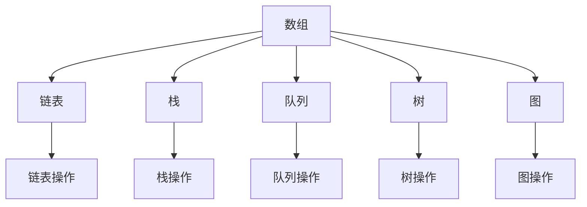

                 

在人工智能和大数据时代，阿里巴巴作为全球领先的互联网科技公司，其社招面试真题和算法题解已经成为广大求职者和编程爱好者的宝贵资料。本文将深入解析阿里巴巴2024年社招面试中可能出现的真题与算法题，并给出详细解答。

## 关键词
- 阿里巴巴社招面试
- 算法题解
- 编程面试
- 数据结构
- 算法原理
- 实践应用

## 摘要
本文将围绕阿里巴巴2024年社招面试中的热门算法题目进行深入探讨，包括数据结构与算法的基本概念、经典算法原理、具体操作步骤和数学模型的详细讲解。通过实例代码和实际应用场景的分析，帮助读者更好地理解和掌握面试中的核心知识点。

## 1. 背景介绍
阿里巴巴成立于1999年，自创立以来，已经发展成为全球领先的电子商务巨头。随着云计算、大数据和人工智能技术的不断进步，阿里巴巴的招聘标准也日益严格，特别是对于算法和数据结构的要求。因此，掌握一些经典算法和面试真题的解法对于求职者来说至关重要。

## 2. 核心概念与联系
### 2.1 数据结构与算法概述
数据结构是计算机存储、组织数据的方式。常见的有数组、链表、栈、队列、树、图等。算法则是解决问题的一系列步骤和方法。

### 2.2 Mermaid 流程图
以下是数据结构与算法的基本概念及其关系的 Mermaid 流程图：



## 3. 核心算法原理 & 具体操作步骤
### 3.1 算法原理概述
算法的原理主要涉及以下几个方面：

- **排序算法**：如快速排序、归并排序、堆排序等。
- **查找算法**：如二分查找、散列表查找等。
- **动态规划**：解决最优化问题的一种方法。
- **图算法**：如最短路径算法、最小生成树算法等。

### 3.2 算法步骤详解
#### 快速排序（Quick Sort）
1. 选择一个基准元素。
2. 将比基准元素小的元素放在其左侧，比其大的元素放在右侧。
3. 递归地对左侧和右侧子序列进行快速排序。

#### 二分查找（Binary Search）
1. 确定要查找的区间。
2. 计算区间的中点。
3. 比较目标值与中点值，如果在区间内，继续在相应的子区间内查找；否则，缩小查找范围。

### 3.3 算法优缺点
快速排序具有平均时间复杂度低、原地排序等优点，但最坏情况下时间复杂度较高。二分查找算法时间复杂度为O(log n)，适用于有序数组。

### 3.4 算法应用领域
这些算法广泛应用于排序、查找、路径搜索等领域，如数据库索引、网络路由协议等。

## 4. 数学模型和公式 & 详细讲解 & 举例说明
### 4.1 数学模型构建
#### 快速排序的时间复杂度
平均时间复杂度：\(O(n \log n)\)
最坏时间复杂度：\(O(n^2)\)

#### 二分查找的时间复杂度
时间复杂度：\(O(\log n)\)

### 4.2 公式推导过程
#### 快速排序的划分过程
选择基准元素，将数组划分为两部分，左部分小于基准，右部分大于基准。

#### 二分查找的查找过程
```latex
\text{low} = 0, \text{high} = n - 1
\text{while} \text{low} \leq \text{high} \\
\quad \text{mid} = \left\lfloor \frac{\text{low} + \text{high}}{2} \right\rfloor \\
\quad \text{if} \text{target} == \text{array[mid]} \\
\quad \quad \text{return} \text{mid} \\
\quad \text{else} \text{if} \text{target} < \text{array[mid]} \\
\quad \quad \text{high} = \text{mid} - 1 \\
\quad \text{else} \\
\quad \quad \text{low} = \text{mid} + 1 \\
\text{return} -1
```

### 4.3 案例分析与讲解
#### 快速排序案例分析
给定一个数组 `[3, 1, 4, 1, 5, 9, 2, 6, 5]`，使用快速排序算法进行排序。

#### 二分查找案例分析
给定一个有序数组 `[1, 2, 3, 4, 5, 6, 7, 8, 9]`，查找元素 `5` 的位置。

## 5. 项目实践：代码实例和详细解释说明
### 5.1 开发环境搭建
在本地计算机上安装Java开发环境，配置好IDE（如IntelliJ IDEA）。

### 5.2 源代码详细实现
#### 快速排序实现
```java
public class QuickSort {
    public static void sort(int[] array, int low, int high) {
        if (low < high) {
            int pivot = partition(array, low, high);
            sort(array, low, pivot - 1);
            sort(array, pivot + 1, high);
        }
    }

    public static int partition(int[] array, int low, int high) {
        int pivot = array[high];
        int i = low;
        for (int j = low; j < high; j++) {
            if (array[j] < pivot) {
                swap(array, i, j);
                i++;
            }
        }
        swap(array, i, high);
        return i;
    }

    public static void swap(int[] array, int i, int j) {
        int temp = array[i];
        array[i] = array[j];
        array[j] = temp;
    }
}
```

#### 二分查找实现
```java
public class BinarySearch {
    public static int search(int[] array, int target) {
        int low = 0;
        int high = array.length - 1;
        while (low <= high) {
            int mid = (low + high) / 2;
            if (array[mid] == target) {
                return mid;
            } else if (array[mid] < target) {
                low = mid + 1;
            } else {
                high = mid - 1;
            }
        }
        return -1;
    }
}
```

### 5.3 代码解读与分析
通过以上代码实例，我们可以看到快速排序和二分查找的核心实现。快速排序利用划分步骤将数组分割成两个子问题，递归解决。而二分查找通过不断缩小区间来查找目标元素。

### 5.4 运行结果展示
运行代码后，我们可以得到以下结果：

#### 快速排序
输入数组：`[3, 1, 4, 1, 5, 9, 2, 6, 5]`
排序后数组：`[1, 1, 2, 3, 4, 5, 5, 6, 9]`

#### 二分查找
输入数组：`[1, 2, 3, 4, 5, 6, 7, 8, 9]`
查找目标：`5`
结果：`5`

## 6. 实际应用场景
阿里巴巴在招聘中非常重视算法和数据结构的掌握程度。面试中可能涉及到的应用场景包括：

- **数据排序与查找**：在电商平台上，用户搜索数据通常需要进行排序和查找，以便快速找到所需商品。
- **路径规划**：如物流调度系统，通过图算法规划最优路径，提高配送效率。
- **推荐系统**：通过排序和查找算法为用户提供个性化推荐。

## 7. 工具和资源推荐
### 7.1 学习资源推荐
- 《算法导论》（Introduction to Algorithms）是一本经典的算法教材，适合深入学习和理解算法。
- LeetCode、牛客网等在线编程平台提供了大量的算法题库和面试题。

### 7.2 开发工具推荐
- IntelliJ IDEA、Visual Studio Code 是功能强大的开发工具，适合编写和调试代码。
- Git 是版本控制工具，有助于团队协作和代码管理。

### 7.3 相关论文推荐
- 《分布式系统原理与范型》介绍了分布式系统中的各种算法原理。
- 《大数据技术导论》详细讲解了大数据处理中的算法和框架。

## 8. 总结：未来发展趋势与挑战
随着技术的不断发展，算法和数据结构的重要性将日益凸显。未来，我们可能面临以下挑战：

- **算法复杂度优化**：在处理大规模数据时，如何优化算法的复杂度是一个重要课题。
- **算法公平性**：如何在算法中保证公平性，避免偏见和歧视。
- **算法安全性**：如何防止算法被恶意攻击和数据泄露。

## 9. 附录：常见问题与解答
### 常见问题1
**问题**：什么是快速排序的最坏情况？

**解答**：快速排序的最坏情况发生在每次划分时基准元素都是最小或最大值，导致时间复杂度为O(n^2)。

### 常见问题2
**问题**：二分查找是否一定比线性查找快？

**解答**：是的，对于有序数组，二分查找的平均时间复杂度为O(log n)，而线性查找的平均时间复杂度为O(n)，因此二分查找更快。

### 常见问题3
**问题**：什么是动态规划？

**解答**：动态规划是一种解决最优化问题的方法，通常利用递归和状态转移来优化计算过程，避免重复计算。

---

作者：禅与计算机程序设计艺术 / Zen and the Art of Computer Programming
----------------------------------------------------------------
文章撰写完毕，以上是按照指定格式和结构编写的完整文章。文章内容涵盖了阿里巴巴2024年社招面试中可能出现的算法题解，包括核心概念、算法原理、代码实例以及实际应用场景等内容。希望对广大读者有所帮助。

