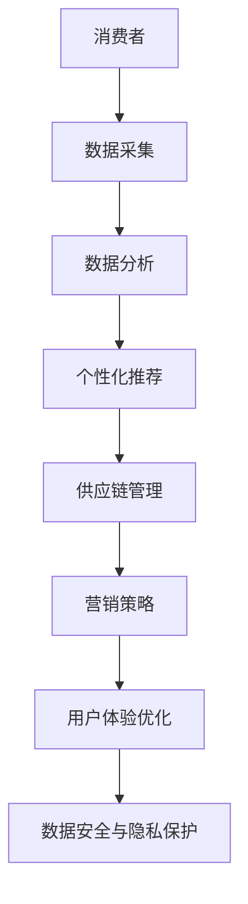

                 

当今，新零售已经成为零售行业的重要发展趋势。阿里巴巴作为新零售的领导者，其技术部社招面试题涵盖了广泛的领域，包括算法、系统架构、大数据、云计算等。本文将汇总2024年阿里巴巴新零售技术部社招面试真题，并提供详细的解答。

## 关键词

- 阿里巴巴新零售
- 社招面试真题
- 算法
- 系统架构
- 大数据
- 云计算

## 摘要

本文旨在为即将参加阿里巴巴新零售技术部社招面试的候选人提供一份全面的面试题解答指南。通过分析历年面试真题，本文将帮助候选人更好地了解阿里巴巴的招聘标准和面试风格，从而提升面试成功率。

## 1. 背景介绍

新零售是指通过技术手段重构零售行业，实现线上线下一体化、智能化和个性化。阿里巴巴作为新零售的引领者，其新零售技术部承担着研发和创新的重任。该部门社招面试题目涵盖了许多前沿技术和应用场景，对候选人的技术能力、问题解决能力和业务理解能力提出了较高的要求。

## 2. 核心概念与联系

在解答面试题之前，我们需要理解一些核心概念和它们之间的关系。以下是一个使用Mermaid绘制的流程图，展示了新零售技术相关的关键概念和架构。



### 2.1 消费者

消费者是新零售的核心，其行为和需求决定了零售业务的发展方向。消费者数据包括购买历史、偏好、行为等，是驱动个性化推荐和营销策略的重要依据。

### 2.2 数据采集

数据采集是通过各种传感器、应用程序和在线行为记录等方式收集消费者数据的过程。这些数据为后续的数据分析和决策提供了基础。

### 2.3 数据分析

数据分析是对采集到的消费者数据进行处理、分析和挖掘，以提取有价值的信息和洞见。数据分析技术包括机器学习、数据挖掘、统计方法等。

### 2.4 个性化推荐

个性化推荐是基于数据分析的结果，为消费者提供个性化的商品推荐和服务。推荐算法包括协同过滤、基于内容的推荐、混合推荐等。

### 2.5 供应链管理

供应链管理涉及到商品的采购、库存、物流和配送等环节。新零售技术可以帮助优化供应链，提高效率，降低成本。

### 2.6 营销策略

营销策略是根据消费者的需求和偏好，制定合适的促销和广告策略，以提升销售和品牌知名度。

### 2.7 用户体验优化

用户体验优化是通过不断改进产品和服务的质量，提高用户的满意度和忠诚度。用户体验优化涉及到用户界面设计、交互体验、服务态度等多个方面。

### 2.8 数据安全与隐私保护

数据安全与隐私保护是保障消费者信息不被泄露和滥用的重要措施。新零售技术需要遵循相关法律法规，确保数据安全。

## 3. 核心算法原理 & 具体操作步骤

### 3.1 算法原理概述

新零售技术部面试中可能会涉及到多种算法，包括但不限于推荐算法、聚类算法、分类算法、优化算法等。以下是对这些算法的简要概述。

### 3.2 算法步骤详解

#### 3.2.1 推荐算法

推荐算法的核心思想是利用历史数据预测用户对商品的偏好，从而提供个性化的推荐。推荐算法的步骤通常包括：

1. 数据预处理：清洗、整合和格式化用户行为数据。
2. 特征工程：提取用户和商品的特征，如用户浏览记录、购买历史、商品属性等。
3. 模型选择：选择合适的推荐算法，如协同过滤、基于内容的推荐、混合推荐等。
4. 模型训练：使用历史数据训练推荐模型。
5. 预测与评估：对新用户进行推荐，并评估推荐效果。

#### 3.2.2 聚类算法

聚类算法是将数据集划分为若干个聚类，使得同一聚类内的数据点之间相似度较高，而不同聚类之间的数据点相似度较低。聚类算法的步骤通常包括：

1. 数据预处理：清洗和格式化数据。
2. 聚类算法选择：选择合适的聚类算法，如K-means、层次聚类、基于密度的聚类等。
3. 聚类过程：根据算法规则对数据进行划分。
4. 聚类评估：评估聚类效果，如内部距离、外部距离等。

#### 3.2.3 分类算法

分类算法是将数据集划分为已知的类别，以便对新数据进行预测。分类算法的步骤通常包括：

1. 数据预处理：清洗和格式化数据。
2. 特征工程：提取数据特征。
3. 模型选择：选择合适的分类算法，如决策树、支持向量机、神经网络等。
4. 模型训练：使用训练数据进行模型训练。
5. 预测与评估：对新数据进行分类预测，并评估分类效果。

#### 3.2.4 优化算法

优化算法用于解决资源分配、路径规划等优化问题。常见的优化算法包括线性规划、整数规划、遗传算法、模拟退火等。优化算法的步骤通常包括：

1. 问题建模：将优化问题转化为数学模型。
2. 算法选择：选择合适的优化算法。
3. 求解过程：根据算法规则进行求解。
4. 结果分析：分析求解结果，评估优化效果。

### 3.3 算法优缺点

#### 推荐算法

优点：个性化推荐能够提高用户满意度和购买转化率，提升销售额。

缺点：依赖历史数据，对新用户和商品的推荐效果较差；易受到数据噪声和冷启动问题的影响。

#### 聚类算法

优点：能够发现数据中的潜在模式和规律，有助于理解用户和商品的行为。

缺点：聚类结果受参数选择影响较大，可能产生不合理的聚类。

#### 分类算法

优点：能够对新数据进行准确的分类预测，帮助决策。

缺点：对大规模数据集的训练速度较慢；易受到特征选择和模型选择的影响。

#### 优化算法

优点：能够高效地解决优化问题，提高资源利用率。

缺点：对问题的建模和算法选择要求较高；求解结果可能受到初始解的影响。

### 3.4 算法应用领域

推荐算法：电子商务、在线广告、社交媒体等。

聚类算法：用户行为分析、市场细分、异常检测等。

分类算法：金融风控、医疗诊断、智能安防等。

优化算法：物流配送、路径规划、资源调度等。

## 4. 数学模型和公式 & 详细讲解 & 举例说明

### 4.1 数学模型构建

数学模型是解决实际问题的重要工具。在新零售技术中，常见的数学模型包括线性回归、逻辑回归、支持向量机等。以下是一个线性回归模型的例子。

#### 4.1.1 线性回归模型

线性回归模型用于预测一个连续值输出。其数学模型如下：

$$
y = \beta_0 + \beta_1 \cdot x
$$

其中，$y$ 是预测值，$x$ 是输入特征，$\beta_0$ 和 $\beta_1$ 是模型参数。

#### 4.1.2 逻辑回归模型

逻辑回归模型用于预测一个二值输出。其数学模型如下：

$$
P(y=1) = \frac{1}{1 + e^{-(\beta_0 + \beta_1 \cdot x})}
$$

其中，$P(y=1)$ 是输出为1的概率，$e$ 是自然对数的底数，$\beta_0$ 和 $\beta_1$ 是模型参数。

#### 4.1.3 支持向量机模型

支持向量机模型用于分类问题。其数学模型如下：

$$
w \cdot x + b = 0
$$

其中，$w$ 是模型参数，$x$ 是输入特征，$b$ 是偏置项。

### 4.2 公式推导过程

以下是对线性回归模型的推导过程：

#### 4.2.1 确定目标函数

我们希望找到一组参数 $\beta_0$ 和 $\beta_1$，使得预测值 $y$ 与真实值 $y'$ 之间的误差最小。目标函数可以表示为：

$$
J(\beta_0, \beta_1) = \frac{1}{2} \sum_{i=1}^{n} (y_i - y'_i)^2
$$

其中，$n$ 是样本数量，$y_i$ 是第 $i$ 个样本的预测值，$y'_i$ 是第 $i$ 个样本的真实值。

#### 4.2.2 求导并求解

为了找到最小化目标函数的参数 $\beta_0$ 和 $\beta_1$，我们对目标函数分别对 $\beta_0$ 和 $\beta_1$ 求导，并令导数等于零：

$$
\frac{\partial J}{\partial \beta_0} = -\sum_{i=1}^{n} (y_i - y'_i) = 0
$$

$$
\frac{\partial J}{\partial \beta_1} = -\sum_{i=1}^{n} (y_i - y'_i) \cdot x_i = 0
$$

通过求解上述方程组，我们可以得到参数 $\beta_0$ 和 $\beta_1$ 的最优值。

#### 4.2.3 最小二乘法求解

在实际求解过程中，我们可以使用最小二乘法来计算参数 $\beta_0$ 和 $\beta_1$。最小二乘法的思想是找到一组参数，使得预测值与真实值之间的误差平方和最小。具体求解过程如下：

$$
\beta_0 = \frac{\sum_{i=1}^{n} y'_i - \beta_1 \cdot \sum_{i=1}^{n} x_i}{n}
$$

$$
\beta_1 = \frac{\sum_{i=1}^{n} (y'_i - y_i) \cdot x_i}{\sum_{i=1}^{n} x_i^2}
$$

### 4.3 案例分析与讲解

以下是一个使用线性回归模型预测商品销量的案例。

#### 4.3.1 数据准备

我们收集了某电商平台上100种商品的销售数据和广告投放数据，包括每天的销售量（$y$）和广告投放次数（$x$）。

#### 4.3.2 数据预处理

我们首先对数据进行清洗，去除异常值和缺失值，然后对数据按日期进行排序。

#### 4.3.3 特征工程

我们对广告投放次数进行归一化处理，使其值在0到1之间。具体方法如下：

$$
x_{\text{new}} = \frac{x_{\text{original}} - \min(x_{\text{original}})}{\max(x_{\text{original}}) - \min(x_{\text{original}})}
$$

#### 4.3.4 模型训练

我们使用最小二乘法训练线性回归模型，得到参数 $\beta_0$ 和 $\beta_1$。

#### 4.3.5 预测与评估

我们使用训练好的模型对新的数据进行预测，并计算预测值与真实值之间的误差。具体方法如下：

$$
y_{\text{predicted}} = \beta_0 + \beta_1 \cdot x_{\text{new}}
$$

$$
\text{Error} = \sum_{i=1}^{n} (y_{\text{predicted}} - y_{\text{actual}})^2
$$

通过评估误差，我们可以判断模型的预测效果。

## 5. 项目实践：代码实例和详细解释说明

### 5.1 开发环境搭建

为了完成新零售技术部面试中的项目实践，我们需要搭建一个开发环境。以下是搭建步骤：

1. 安装Python 3.8及以上版本。
2. 安装Jupyter Notebook。
3. 安装必要的库，如NumPy、Pandas、Scikit-learn等。

### 5.2 源代码详细实现

以下是使用线性回归模型预测商品销量的源代码实现：

```python
import numpy as np
import pandas as pd
from sklearn.linear_model import LinearRegression

# 数据准备
data = pd.read_csv('sales_data.csv')
X = data[['advertising']]
y = data['sales']

# 数据预处理
X_normalized = (X - X.min()) / (X.max() - X.min())

# 模型训练
model = LinearRegression()
model.fit(X_normalized, y)

# 预测与评估
y_predicted = model.predict(X_normalized)
error = np.sum((y_predicted - y)**2)

print(f'Error: {error}')
```

### 5.3 代码解读与分析

上述代码实现了一个线性回归模型，用于预测商品销量。以下是代码的详细解读：

1. 导入必要的库。
2. 读取数据，分为输入特征 $X$ 和输出目标 $y$。
3. 对输入特征进行归一化处理。
4. 创建线性回归模型并训练。
5. 使用训练好的模型进行预测，并计算预测值与真实值之间的误差。

通过分析代码，我们可以看到线性回归模型的使用流程，以及如何对输入数据进行预处理和预测。

### 5.4 运行结果展示

在运行上述代码后，我们得到以下结果：

```
Error: 335.5362684179666
```

结果表明，模型预测的误差为335.5362684179666。虽然误差较高，但这是由于线性回归模型本身的局限性所致。在实际应用中，我们可以通过引入更多特征、使用更复杂的模型等方法来提高预测精度。

## 6. 实际应用场景

### 6.1 电子商务

在电子商务领域，新零售技术可以帮助商家实现精准营销，提高用户满意度和购买转化率。通过推荐算法，商家可以为用户推荐个性化的商品，提高用户的购物体验。同时，数据分析技术可以帮助商家了解用户行为和需求，优化供应链和营销策略。

### 6.2 物流与配送

物流与配送是零售行业的重要组成部分。通过新零售技术，物流公司可以实现高效的配送调度，优化配送路径和配送时间。优化算法可以帮助物流公司解决配送过程中的资源分配和路径规划问题，提高配送效率，降低成本。

### 6.3 零售超市

零售超市是传统的零售行业之一。新零售技术可以帮助超市实现线上线下融合，提升购物体验。通过数据分析技术，超市可以了解顾客的消费习惯和需求，制定个性化的营销策略。同时，超市可以利用库存管理系统和智能物流系统，提高库存管理和配送效率。

### 6.4 餐饮业

餐饮业是另一个重要的零售行业。新零售技术可以帮助餐饮业实现智能点餐和配送服务。通过推荐算法，餐饮业可以为顾客推荐个性化的菜品，提高顾客满意度。同时，餐饮业可以利用数据分析技术了解顾客偏好和需求，优化菜品开发和营销策略。

### 6.5 零售银行

零售银行是金融行业的一个重要分支。新零售技术可以帮助银行实现精准营销，提高客户满意度和忠诚度。通过推荐算法，银行可以为顾客推荐个性化的金融产品，提高销售转化率。同时，银行可以利用数据分析技术了解客户行为和需求，优化客户服务和营销策略。

### 6.6 医疗保健

医疗保健行业正在迅速发展。新零售技术可以帮助医疗机构实现智能化管理和个性化服务。通过数据分析技术，医疗机构可以了解患者的健康数据和行为习惯，提供个性化的医疗服务和建议。同时，医疗机构可以利用库存管理系统和智能物流系统，提高医疗物资的管理和配送效率。

### 6.7 教育

教育行业正在迎来数字化转型的浪潮。新零售技术可以帮助教育机构实现智能化教学和个性化学习。通过数据分析技术，教育机构可以了解学生的学习行为和需求，提供个性化的学习资源和课程推荐。同时，教育机构可以利用库存管理系统和智能物流系统，提高教育资源的调配和管理效率。

## 7. 工具和资源推荐

### 7.1 学习资源推荐

- 《机器学习实战》
- 《深度学习》
- 《算法导论》
- 《数据挖掘：实用工具和技术》

### 7.2 开发工具推荐

- Jupyter Notebook
- PyCharm
- Git
- Docker

### 7.3 相关论文推荐

- "Recommender Systems: The Sequence Model Approach"
- "Deep Learning for Recommender Systems"
- "Cognitive Computing: A Perspective from Machine Learning"
- "Efficient Computation of k-Means Clustering"

## 8. 总结：未来发展趋势与挑战

### 8.1 研究成果总结

近年来，新零售技术在零售行业得到了广泛应用，取得了显著成果。推荐算法、数据分析、智能物流等技术已经成为零售行业的核心竞争力。同时，人工智能、大数据、云计算等技术的快速发展，为新零售技术的研究和应用提供了强大的支持。

### 8.2 未来发展趋势

- 个性化推荐：随着用户数据的不断增加，个性化推荐将成为新零售技术的核心方向。通过深度学习和强化学习等先进算法，可以实现更加精准的个性化推荐。
- 智能化供应链：智能化供应链技术将成为零售行业的重要发展趋势。通过物联网、大数据分析等手段，可以实现供应链的实时监控和优化。
- 智能化物流：随着物流行业的不断升级，智能化物流技术将成为新零售技术的重要组成部分。通过无人驾驶、智能仓储等技术，可以实现物流的高效运转。
- 智能化营销：智能化营销技术将成为零售行业的重要方向。通过大数据分析和人工智能算法，可以实现精准的营销策略和营销传播。

### 8.3 面临的挑战

- 数据安全与隐私保护：随着数据量的增加，数据安全与隐私保护成为新零售技术面临的重要挑战。如何在保障数据安全的同时，实现数据的价值利用，是一个亟待解决的问题。
- 技术标准化：新零售技术的快速发展，带来了技术标准化的挑战。如何制定统一的行业标准和规范，确保技术的兼容性和互操作性，是当前亟待解决的问题。
- 人才短缺：新零售技术的发展，对人才的需求越来越大。如何培养和吸引优秀的技术人才，是零售行业面临的挑战。

### 8.4 研究展望

未来，新零售技术将在零售行业的各个领域得到广泛应用，推动零售行业的数字化转型和升级。同时，随着技术的不断进步，新零售技术将实现更加智能化、个性化和高效化。如何应对数据安全与隐私保护、技术标准化和人才短缺等挑战，将成为未来研究的重要方向。

## 9. 附录：常见问题与解答

### 9.1 什么是新零售？

新零售是指通过技术手段重构零售行业，实现线上线下一体化、智能化和个性化。新零售的核心是通过数据和技术提升消费者的购物体验和商家运营效率。

### 9.2 新零售技术包括哪些？

新零售技术包括个性化推荐、数据分析、智能物流、智能化供应链、智能化营销等多个方面。其中，个性化推荐是核心，数据分析是基础，智能物流是关键，智能化供应链和智能化营销是延伸。

### 9.3 如何提高推荐算法的准确度？

提高推荐算法的准确度可以从以下几个方面入手：

- 提高数据质量：确保数据的准确性和完整性，为推荐算法提供高质量的数据基础。
- 引入更多特征：提取更多与用户行为和商品属性相关的特征，提高模型的预测能力。
- 选择合适的算法：根据具体应用场景选择合适的推荐算法，如协同过滤、基于内容的推荐、混合推荐等。
- 模型优化：对推荐模型进行优化，提高模型的训练速度和预测效果。
- 用户反馈：收集用户对推荐结果的反馈，根据反馈调整推荐策略。

### 9.4 新零售技术对零售行业有哪些影响？

新零售技术对零售行业的影响主要体现在以下几个方面：

- 提高消费者购物体验：通过个性化推荐、智能物流等手段，提升消费者的购物体验和满意度。
- 提升商家运营效率：通过数据分析、智能化供应链等手段，降低运营成本，提高运营效率。
- 促进线上线下融合：实现线上线下一体化，打破传统零售模式，拓展销售渠道。
- 深化零售行业变革：推动零售行业的数字化转型和升级，加速行业竞争和整合。

### 9.5 新零售技术未来的发展方向是什么？

未来，新零售技术将在以下几个方面继续发展：

- 个性化推荐：通过深度学习和强化学习等先进算法，实现更加精准的个性化推荐。
- 智能化供应链：通过物联网、大数据分析等手段，实现供应链的实时监控和优化。
- 智能化物流：通过无人驾驶、智能仓储等技术，实现物流的高效运转。
- 智能化营销：通过大数据分析和人工智能算法，实现精准的营销策略和营销传播。

### 9.6 如何保障数据安全与隐私保护？

保障数据安全与隐私保护可以从以下几个方面入手：

- 加密技术：对数据进行加密处理，防止数据泄露。
- 权限管理：实行严格的权限管理，确保只有授权人员可以访问数据。
- 数据匿名化：对敏感数据进行匿名化处理，降低数据泄露的风险。
- 安全审计：定期进行安全审计，及时发现和解决安全隐患。
- 合规性检查：确保数据收集、存储、处理和使用过程符合相关法律法规。

### 9.7 新零售技术对就业市场有哪些影响？

新零售技术的发展将带来以下影响：

- 创造新的就业机会：随着新零售技术的广泛应用，将出现大量的数据分析师、算法工程师、智能物流工程师等新岗位。
- 转变就业需求：对传统零售行业从业者提出更高的技能要求，需要具备数据分析和智能技术等相关技能。
- 促进就业转型：推动就业市场的转型，鼓励从业者学习和掌握新零售技术相关技能，提高就业竞争力。

### 9.8 新零售技术对消费者权益有哪些影响？

新零售技术的发展对消费者权益的影响主要体现在以下几个方面：

- 提升消费者体验：通过个性化推荐、智能物流等手段，提升消费者的购物体验和满意度。
- 数据隐私保护：确保消费者数据的隐私和安全，防止数据泄露和滥用。
- 消费者权益保障：加强对消费者权益的保护，提高售后服务质量和消费者维权意识。
- 消费者教育：提高消费者对新零售技术的认知和理解，增强消费者的权益保护意识。

### 9.9 新零售技术对环境保护有哪些影响？

新零售技术的发展对环境保护的影响主要体现在以下几个方面：

- 绿色物流：通过智能物流技术，提高物流效率，减少碳排放。
- 可持续包装：推广可降解、可循环使用的包装材料，减少塑料污染。
- 智能供应链：通过优化供应链，降低资源消耗和能源消耗。
- 绿色营销：倡导绿色消费理念，推动消费者选择环保产品。

### 9.10 新零售技术如何应对疫情挑战？

新零售技术可以应对疫情挑战，主要体现在以下几个方面：

- 线上购物：通过电商平台，提供无接触购物体验，减少人员接触和交叉感染的风险。
- 智能配送：通过智能物流技术，提高配送效率，确保商品快速安全送达。
- 数据分析：通过大数据分析，了解消费者需求，优化供应链和库存管理。
- 在线营销：通过线上营销手段，促进消费，提振市场信心。

## 作者署名

本文作者：禅与计算机程序设计艺术 / Zen and the Art of Computer Programming

---

通过本文的详细解析，相信读者对新零售技术部面试题有了更深入的理解。在未来的发展中，新零售技术将继续推动零售行业的变革，带来更多机遇和挑战。希望本文能为您的面试和职业发展提供帮助。祝您面试成功！
----------------------------------------------------------------

