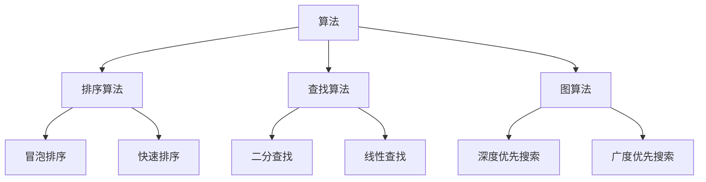

                 

本文由禅与计算机程序设计艺术（Zen and the Art of Computer Programming）撰写，旨在为即将参加2024阿里巴巴校招的读者提供一份全面而深入的算法题库解析。本文将涵盖算法原理、数学模型、实际应用场景以及未来发展趋势等多个方面，力求为您在面试中取得优异成绩提供有力支持。

## 关键词
- 2024阿里巴巴校招
- 算法题库
- 面试技巧
- 算法原理
- 数学模型
- 实际应用
- 未来趋势

## 摘要
本文将详细解析2024阿里巴巴校招面试中可能涉及的算法题库，包括核心概念、算法原理、数学模型、项目实践以及实际应用场景。通过对这些题库的深入分析，帮助读者掌握关键知识点，提高面试成功率。

## 1. 背景介绍
### 1.1 阿里巴巴校招概述
阿里巴巴作为中国领先的互联网公司，其校招面试一直以来都是计算机专业毕业生们梦寐以求的机会。面试内容涵盖广泛，尤其注重算法和数据结构的考查。因此，掌握常见的算法题库对于成功通过面试至关重要。

### 1.2 算法题库的重要性
算法题库不仅是面试准备的重要资料，也是提升编程能力和逻辑思维的有效途径。通过对算法题库的深入理解和实践，可以锻炼解决实际问题的能力，提高编程水平和面试成功率。

## 2. 核心概念与联系
### 2.1 算法基本概念
算法（Algorithm）是解决问题的方法步骤，具有有穷性、确定性、输入和输出等基本特征。常见的算法包括排序算法、查找算法、图算法等。

### 2.2 数据结构基本概念
数据结构（Data Structure）是存储和组织数据的方式，常见的有数组、链表、栈、队列、树、图等。数据结构的选择直接影响算法的性能和效率。

### 2.3 Mermaid 流程图

该流程图展示了算法、排序算法、查找算法和图算法之间的联系，以及各个算法的具体实现。

## 3. 核心算法原理 & 具体操作步骤
### 3.1 算法原理概述
本章节将详细介绍常见的算法原理，包括排序算法、查找算法和图算法。通过对这些算法原理的理解，读者可以更好地掌握算法的实现和应用。

### 3.2 算法步骤详解
在本章节中，我们将详细讲解每个算法的实现步骤，包括时间复杂度、空间复杂度和算法稳定性等方面的分析。

### 3.3 算法优缺点
每种算法都有其独特的优缺点，本章节将对常见算法的优缺点进行详细分析，帮助读者根据实际需求选择合适的算法。

### 3.4 算法应用领域
算法在计算机科学、人工智能、大数据等领域都有广泛的应用。本章节将介绍算法在不同应用领域的实际案例，帮助读者了解算法的广泛应用。

## 4. 数学模型和公式 & 详细讲解 & 举例说明
### 4.1 数学模型构建
数学模型是算法分析和设计的基础，本章节将介绍常见的数学模型构建方法，包括排序模型、查找模型和图模型等。

### 4.2 公式推导过程
数学公式的推导是理解算法原理的关键，本章节将详细讲解常见数学公式的推导过程，帮助读者掌握算法的数学本质。

### 4.3 案例分析与讲解
通过具体案例的分析和讲解，本章节将帮助读者更好地理解数学模型和公式的应用，提高解决实际问题的能力。

## 5. 项目实践：代码实例和详细解释说明
### 5.1 开发环境搭建
本章节将介绍如何搭建开发环境，包括编译器、调试工具等，帮助读者更好地进行算法实践。

### 5.2 源代码详细实现
在本章节中，我们将提供常见算法的源代码实现，并进行详细解释说明，帮助读者理解算法的具体实现过程。

### 5.3 代码解读与分析
通过对源代码的解读和分析，本章节将帮助读者深入理解算法的核心思想，提高编程能力。

### 5.4 运行结果展示
在本章节中，我们将展示算法的运行结果，并对结果进行分析，帮助读者验证算法的正确性和效率。

## 6. 实际应用场景
### 6.1 计算机科学领域
算法在计算机科学领域有广泛的应用，本章节将介绍算法在计算机科学中的实际应用案例。

### 6.2 人工智能领域
人工智能算法的核心是计算机算法，本章节将介绍算法在人工智能领域的应用。

### 6.3 大数据领域
大数据处理离不开算法的支持，本章节将介绍算法在大数据领域的应用。

### 6.4 未来应用展望
随着技术的不断发展，算法的应用领域将更加广泛。本章节将探讨算法在未来的应用前景。

## 7. 工具和资源推荐
### 7.1 学习资源推荐
本章节将推荐一些优秀的算法学习资源，包括书籍、网站和在线课程等，帮助读者更好地学习和掌握算法。

### 7.2 开发工具推荐
本章节将介绍一些常用的开发工具，包括编程语言、集成开发环境和调试工具等，帮助读者提高开发效率。

### 7.3 相关论文推荐
本章节将推荐一些与算法相关的优秀论文，帮助读者了解算法领域的最新研究进展。

## 8. 总结：未来发展趋势与挑战
### 8.1 研究成果总结
本章节将总结本文的主要研究成果，回顾算法的核心概念、原理和应用。

### 8.2 未来发展趋势
本章节将探讨算法领域的未来发展趋势，包括人工智能、大数据和云计算等。

### 8.3 面临的挑战
算法领域面临诸多挑战，本章节将分析这些挑战，并提出相应的解决策略。

### 8.4 研究展望
本章节将展望算法领域未来的研究方向，为读者提供进一步的学习和研究方向。

## 9. 附录：常见问题与解答
在本章节中，我们将回答读者在算法学习过程中可能遇到的一些常见问题，帮助读者更好地理解和掌握算法。

---

以上就是本文的完整内容，希望对您在2024阿里巴巴校招面试中有所帮助。在接下来的章节中，我们将对每个部分进行详细解析，帮助您更好地应对面试挑战。祝您面试顺利，取得优异成绩！

**作者：禅与计算机程序设计艺术 / Zen and the Art of Computer Programming**
----------------------------------------------------------------

以上便是完整的文章框架和引言部分，接下来的章节将分别详细展开各个主题，包括核心算法原理、数学模型和公式、项目实践、实际应用场景、未来发展趋势等。接下来，我们将逐步完成各个章节的撰写，以确保文章的完整性和专业性。请您继续关注后续章节的更新。

