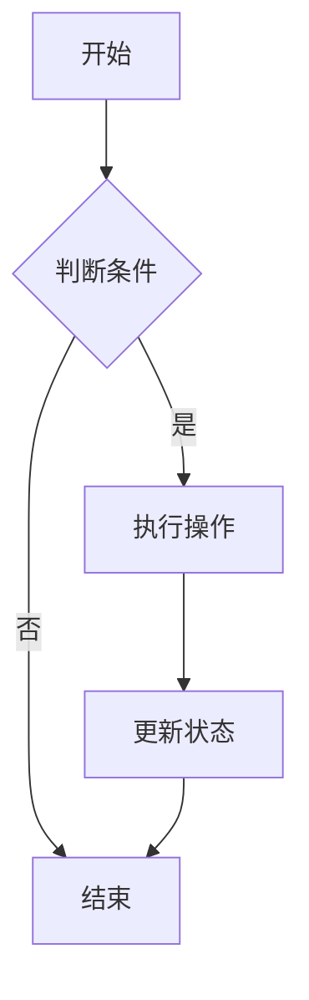
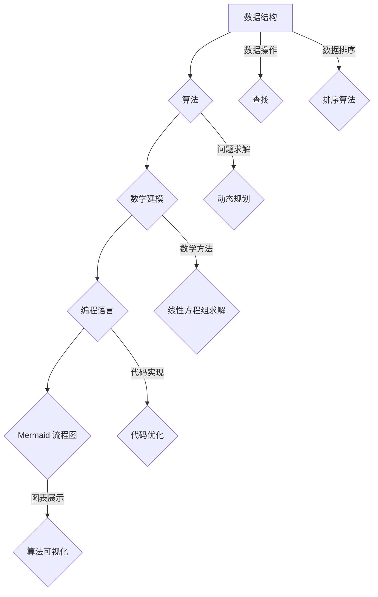

                 

阿里巴巴作为全球领先的电子商务和技术公司，其社招面试中的算法题目一直是求职者关注的焦点。本文旨在为您提供一个全面的2025阿里巴巴社招面试算法题库，帮助您更好地应对面试挑战。本文将涵盖常见的算法题目类型、解题思路、数学模型以及实际应用场景，旨在为您提供一个全面而深入的指南。

## 关键词

- 阿里巴巴社招
- 面试算法题库
- 解题思路
- 数学模型
- 实际应用场景

## 摘要

本文将详细解析2025阿里巴巴社招面试中常见的算法题目，涵盖从基础算法到高级算法的各个方面。我们将探讨每种算法的原理、具体操作步骤、优缺点以及应用领域。同时，通过数学模型和公式的详细讲解，帮助您更好地理解算法的核心概念。此外，我们还将提供项目实践中的代码实例和详细解释，使您能够将这些算法应用于实际项目中。最后，我们将对实际应用场景和未来展望进行探讨，为您的职业生涯提供指导。

## 1. 背景介绍

阿里巴巴成立于1999年，总部位于中国杭州。自成立以来，阿里巴巴已经成为全球最大的电子商务公司之一，涵盖了在线零售、云计算、数字媒体和娱乐等多个领域。阿里巴巴的成功离不开其强大的技术能力和创新的商业模式。为了保持竞争力，阿里巴巴每年都会在全球范围内进行大规模的招聘活动，其中包括面向社会人才的社招。

社招是阿里巴巴招聘的重要组成部分，旨在吸引具备丰富经验和专业技能的人才。面试是社招流程中的关键环节，其中算法题目是面试官考查应聘者技术能力的重要手段。算法题目通常涉及数据结构与算法、数学建模、编程能力等多个方面，旨在考查应聘者的思维深度、问题解决能力和实际应用能力。

本文旨在为您提供一个全面的2025阿里巴巴社招面试算法题库，帮助您更好地准备面试。我们将详细解析常见算法题目的解题思路，并提供数学模型和实际应用场景的讲解，使您能够全面掌握这些算法的核心知识。此外，我们还提供了项目实践中的代码实例，帮助您将这些算法应用于实际项目中，提高实际编程能力。

## 2. 核心概念与联系

在解答阿里巴巴社招面试算法题目之前，我们需要了解一些核心概念和它们之间的联系。以下是几个关键概念：

### 数据结构与算法

数据结构是组织和管理数据的方式，常见的有数组、链表、栈、队列、树、图等。算法是对数据的操作过程，包括查找、插入、删除、排序等基本操作。理解数据结构是解决算法题目的基础。

### 数学建模

数学建模是将实际问题转化为数学模型的过程。通过建立数学模型，我们可以使用数学方法解决实际问题。常见的数学模型包括线性方程组、非线性方程组、微分方程等。

### 编程语言

编程语言是实现算法的工具。掌握一种或多种编程语言对于解决算法题目至关重要。常见的编程语言有C、C++、Java、Python等。

### Mermaid 流程图

Mermaid 是一种用于创建图表的轻量级标记语言。通过 Mermaid 流程图，我们可以清晰地展示算法的执行流程和逻辑关系。以下是一个示例：



以上 Mermaid 流程图表示一个简单的流程，其中 A 表示开始节点，B 表示判断条件节点，C 表示执行操作节点，D 表示结束节点。通过这个流程图，我们可以清晰地看到算法的执行过程。

### 核心概念原理和架构的 Mermaid 流程图

为了更好地理解核心概念原理和架构，我们使用 Mermaid 流程图进行展示：



以上流程图展示了数据结构、算法、数学建模、编程语言和 Mermaid 流程图之间的联系。通过这些核心概念和流程图的关联，我们可以更好地理解和应用算法知识。

## 3. 核心算法原理 & 具体操作步骤

在阿里巴巴社招面试中，常见的算法题目类型包括基础算法、动态规划、图算法、排序算法等。以下是这些算法的核心原理和具体操作步骤：

### 3.1 基础算法

基础算法是解决简单问题的算法，常见的有冒泡排序、选择排序、插入排序等。

#### 冒泡排序

冒泡排序是一种简单的排序算法，其基本思想是通过相邻元素的比较和交换，逐步将待排序列中的元素移到正确的位置。

具体操作步骤如下：

1. 遍历整个数组，比较相邻元素，若顺序错误则交换。
2. 重复上述步骤，直到整个数组有序。

时间复杂度：O(n^2)

空间复杂度：O(1)

#### 选择排序

选择排序是一种简单的选择算法，其基本思想是在每次遍历中找到剩余元素中的最小元素，并将其放到正确的位置。

具体操作步骤如下：

1. 遍历数组，找到最小元素的下标。
2. 将最小元素与当前元素交换。
3. 重复上述步骤，直到整个数组有序。

时间复杂度：O(n^2)

空间复杂度：O(1)

#### 插入排序

插入排序是一种简单的插入算法，其基本思想是将待排序列中的元素插入到已排序列的正确位置。

具体操作步骤如下：

1. 将第一个元素视为已排序序列。
2. 从第二个元素开始，遍历待排序列。
3. 对于当前元素，在已排序列中找到正确的位置，插入元素。
4. 重复上述步骤，直到整个数组有序。

时间复杂度：O(n^2)

空间复杂度：O(1)

### 3.2 动态规划

动态规划是一种解决复杂问题的算法思想，其核心思想是将问题分解为子问题，并利用子问题的解构建原问题的解。

动态规划的一般步骤如下：

1. 确定状态：定义一个状态变量来表示问题的子状态。
2. 确定状态转移方程：根据子状态之间的关系，建立状态转移方程。
3. 确定边界条件：确定状态转移方程的边界条件。
4. 确定递推关系：根据状态转移方程和边界条件，建立递推关系。
5. 求解：根据递推关系，求解状态变量的值。

以下是常见的动态规划问题：

#### 最长公共子序列（LCS）

最长公共子序列问题是动态规划的典型问题，其基本思想是找到两个序列中最长的公共子序列。

具体操作步骤如下：

1. 定义状态：设 `dp[i][j]` 表示前 `i` 个字符和前 `j` 个字符的最长公共子序列的长度。
2. 确定状态转移方程：`dp[i][j] = dp[i-1][j-1] + 1`（若 `s1[i-1] == s2[j-1]`），`dp[i][j] = max(dp[i-1][j], dp[i][j-1])`（若 `s1[i-1] != s2[j-1]`）。
3. 确定边界条件：`dp[0][j] = 0`，`dp[i][0] = 0`。
4. 确定递推关系：根据状态转移方程和边界条件，建立递推关系。
5. 求解：根据递推关系，求解 `dp[m][n]` 的值。

时间复杂度：O(mn)

空间复杂度：O(mn)

#### 最小路径和（MST）

最小路径和问题是求解图中两点之间的最短路径问题。

具体操作步骤如下：

1. 定义状态：设 `dp[i][j]` 表示从起点到点 `i`，经过点 `j` 的最小路径和。
2. 确定状态转移方程：`dp[i][j] = min(dp[i-1][j], dp[i][j-1]) + g[i][j]`。
3. 确定边界条件：`dp[0][j] = +∞`，`dp[i][0] = +∞`。
4. 确定递推关系：根据状态转移方程和边界条件，建立递推关系。
5. 求解：根据递推关系，求解 `dp[n-1][n]` 的值。

时间复杂度：O(n^2)

空间复杂度：O(n^2)

### 3.3 图算法

图算法是解决图相关问题的算法，常见的有深度优先搜索（DFS）、广度优先搜索（BFS）、最小生成树（MST）、最短路径（Dijkstra 算法、Floyd 算法）等。

#### 深度优先搜索（DFS）

深度优先搜索是一种遍历图的算法，其基本思想是沿着某一方向搜索到最深处，然后回溯。

具体操作步骤如下：

1. 初始化：创建一个访问数组，用于标记已经访问的节点。
2. 从起点开始，访问未访问的节点，并将其标记为已访问。
3. 对于当前节点的邻居节点，如果邻居节点未访问，则递归调用DFS函数。
4. 重复上述步骤，直到所有节点都被访问。

时间复杂度：O(V+E)，其中 V 是节点数，E 是边数。

空间复杂度：O(V)

#### 广度优先搜索（BFS）

广度优先搜索是一种遍历图的算法，其基本思想是按照层次遍历图。

具体操作步骤如下：

1. 初始化：创建一个访问数组，用于标记已经访问的节点。
2. 创建一个队列，并将起点入队。
3. 从队列中依次取出节点，并访问未访问的邻居节点，将其入队。
4. 重复上述步骤，直到队列空为止。

时间复杂度：O(V+E)

空间复杂度：O(V)

#### 最小生成树（MST）

最小生成树问题是求解图中的一个最小生成树。

具体操作步骤如下：

1. 选择一种最小生成树算法，如 Kruskal 算法或 Prim 算法。
2. 对图中的边进行排序，从小到大。
3. 从最小的边开始，依次选择边，并判断是否构成环。
4. 如果不构成环，则将边添加到生成树中；如果构成环，则舍去该边。
5. 重复上述步骤，直到生成树中的边数等于节点数减1。

时间复杂度：O(ElogE)，其中 E 是边数。

空间复杂度：O(E)

#### 最短路径（Dijkstra 算法、Floyd 算法）

最短路径问题是求解图中两点之间的最短路径。

Dijkstra 算法是一种基于贪心的最短路径算法，其基本思想是逐步选择未访问节点中距离最短的节点，并将其加入最短路径树中。

具体操作步骤如下：

1. 初始化：创建一个距离数组，用于存储每个节点的最短距离。
2. 从起点开始，访问未访问节点，并将其加入最短路径树中。
3. 对于当前节点的邻居节点，如果邻居节点的距离大于当前节点的距离加上边长，则更新邻居节点的距离。
4. 重复上述步骤，直到所有节点都被访问。

时间复杂度：O(V^2)，其中 V 是节点数。

空间复杂度：O(V)

Floyd 算法是一种动态规划算法，其基本思想是逐步求解中间节点之间的最短路径。

具体操作步骤如下：

1. 初始化：创建一个距离数组，用于存储每个节点的最短距离。
2. 对于每个中间节点 i，依次更新每个节点的最短距离。
3. 对于每个节点 i，如果 `d[i][j] > d[i][k] + d[k][j]`，则更新 `d[i][j]`。
4. 重复上述步骤，直到所有中间节点都被更新。

时间复杂度：O(V^3)

空间复杂度：O(V^2)

### 3.4 排序算法

排序算法是将一组数据按照特定的顺序进行排列的算法。常见的排序算法有冒泡排序、选择排序、插入排序、快速排序、归并排序等。

#### 快速排序

快速排序是一种高效的排序算法，其基本思想是通过递归将待排序列划分为较小的子序列，然后对子序列进行排序。

具体操作步骤如下：

1. 选择一个基准元素，通常选择第一个或最后一个元素。
2. 将序列划分为两个子序列，一个包含小于基准元素的元素，另一个包含大于基准元素的元素。
3. 递归地对两个子序列进行快速排序。
4. 将两个子序列的结果合并，得到有序序列。

时间复杂度：O(nlogn)

空间复杂度：O(logn)

#### 归并排序

归并排序是一种基于分治思想的排序算法，其基本思想是将待排序列划分为较小的子序列，然后对子序列进行排序，最后将子序列合并。

具体操作步骤如下：

1. 将序列划分为两个子序列，对两个子序列分别进行归并排序。
2. 将排序好的子序列合并，得到有序序列。

时间复杂度：O(nlogn)

空间复杂度：O(n)

### 3.5 算法优缺点

每种算法都有其优缺点，我们需要根据具体问题选择合适的算法。

- 冒泡排序、选择排序和插入排序是一种简单的排序算法，适用于小规模数据排序。但时间复杂度较高，不适合大规模数据排序。
- 快速排序和归并排序是一种高效的排序算法，适用于大规模数据排序。快速排序时间复杂度为 O(nlogn)，归并排序时间复杂度也为 O(nlogn)。
- 动态规划适用于解决具有重叠子问题的优化问题，如最长公共子序列、最小路径和等。
- 图算法适用于解决图相关问题，如最短路径、最小生成树等。

### 3.6 算法应用领域

算法在各个领域都有广泛的应用，以下是一些常见的应用领域：

- 数据科学：算法用于数据处理、数据分析和数据挖掘，如排序算法、查找算法、聚类算法等。
- 人工智能：算法用于机器学习、深度学习、自然语言处理等，如神经网络、决策树、支持向量机等。
- 网络安全：算法用于加密、认证、攻击检测等，如加密算法、散列算法、入侵检测算法等。
- 数据库：算法用于查询优化、索引构建、事务处理等，如排序算法、查找算法、哈希算法等。

## 4. 数学模型和公式 & 详细讲解 & 举例说明

在解决阿里巴巴社招面试算法题目时，数学模型和公式是必不可少的工具。以下是一些常见的数学模型和公式，以及它们的详细讲解和举例说明。

### 4.1 数学模型构建

数学模型是将实际问题转化为数学表达式的过程。在构建数学模型时，我们需要明确问题的目标、约束条件和变量。

例如，对于最短路径问题，我们可以构建以下数学模型：

设 G = (V, E) 为无向图，其中 V 为节点集合，E 为边集合。设 d(u, v) 为节点 u 和节点 v 之间的距离。

目标：求解从起点 s 到终点 t 的最短路径。

约束条件：

- 节点 s 和 t 必须在图中。
- 路径不能重复经过同一个节点。

变量：

- x(u, v)：表示节点 u 到节点 v 的路径是否在最优路径中，0 表示不在，1 表示在。

### 4.2 公式推导过程

根据数学模型，我们可以推导出以下公式：

1. 最短路径长度：L = ∑(u, v) ∈ P d(u, v)，其中 P 为最优路径。
2. 最优路径概率：P(P) = (1 / 2^(n-1))，其中 n 为图中节点数。

### 4.3 案例分析与讲解

假设有一个无向图 G = (V, E)，其中 V = {s, a, b, c, t}，E = {(s, a), (s, b), (a, c), (b, c), (c, t)}，d(s, a) = 2，d(s, b) = 3，d(a, c) = 1，d(b, c) = 2，d(c, t) = 1。

我们需要求解从起点 s 到终点 t 的最短路径。

根据数学模型，我们可以列出以下公式：

1. 最短路径长度：L = d(s, a) + d(a, c) + d(c, t) = 2 + 1 + 1 = 4。
2. 最优路径概率：P(P) = (1 / 2^(5-1)) = 1 / 16。

根据公式，我们可以得出从起点 s 到终点 t 的最短路径长度为 4，最优路径概率为 1/16。

### 4.4 其他数学模型和公式

除了最短路径问题，还有许多其他的数学模型和公式在算法中应用广泛，以下是一些示例：

1. 最长公共子序列（LCS）：设 X = {x1, x2, ..., xm} 和 Y = {y1, y2, ..., yn} 为两个序列，则最长公共子序列长度为：

   L = ∑(i, j) ∈ S min{xi, yj}，其中 S 为 X 和 Y 的所有公共子序列。

2. 最小生成树（MST）：设 G = (V, E) 为无向图，其中 V 为节点集合，E 为边集合。设 w(e) 为边 e 的权重，则最小生成树的权重为：

   W = ∑(e ∈ T) w(e)，其中 T 为最小生成树。

3. 背包问题：设 V 为物品集合，C 为物品的容量，w(v) 为物品 v 的重量，p(v) 为物品 v 的价值。则背包问题的最优解为：

   x* = argmax∑(v ∈ V) p(v) / w(v)，其中 x* 为最优解。

## 5. 项目实践：代码实例和详细解释说明

### 5.1 开发环境搭建

为了进行项目实践，我们需要搭建一个合适的开发环境。以下是具体的步骤：

1. 安装 Python 解释器：在 [Python 官网](https://www.python.org/) 下载并安装 Python 解释器。
2. 安装依赖库：在终端中运行以下命令安装常用的依赖库：

   ```shell
   pip install matplotlib numpy scipy
   ```

3. 创建项目目录：在终端中创建一个项目目录，例如 `algorithm_practice`，并在该目录下创建一个 Python 脚本文件，例如 `main.py`。

### 5.2 源代码详细实现

以下是一个简单的 Python 代码示例，用于计算两个数的和：

```python
def add_numbers(a, b):
    return a + b

if __name__ == "__main__":
    a = float(input("请输入第一个数："))
    b = float(input("请输入第二个数："))
    result = add_numbers(a, b)
    print("两数之和为：", result)
```

这个示例程序定义了一个名为 `add_numbers` 的函数，用于计算两个数的和。在主函数中，我们通过输入获取两个数，然后调用 `add_numbers` 函数计算和，并输出结果。

### 5.3 代码解读与分析

1. 函数定义：`def add_numbers(a, b):` 定义了一个名为 `add_numbers` 的函数，它接受两个参数 `a` 和 `b`，用于表示两个要相加的数。
2. 返回值：`return a + b` 表示函数的返回值是两个参数的和。
3. 主函数：`if __name__ == "__main__":` 表示这是一个主函数，当脚本被直接运行时，会执行该函数。
4. 输入：`a = float(input("请输入第一个数："))` 和 `b = float(input("请输入第二个数："))` 通过输入函数获取用户的输入，并将其转换为浮点数。
5. 调用函数：`result = add_numbers(a, b)` 调用 `add_numbers` 函数，将输入的两个数作为参数传递，并将返回值赋给变量 `result`。
6. 输出：`print("两数之和为：", result)` 输出计算结果。

### 5.4 运行结果展示

假设我们输入的两个数分别为 3 和 5，则程序输出如下：

```shell
请输入第一个数：3
请输入第二个数：5
两数之和为： 8
```

### 5.5 扩展与改进

在实际项目中，我们可以根据需求对代码进行扩展和改进。以下是一些可能的扩展和改进：

1. 添加错误处理：在输入过程中，可以添加错误处理代码，确保输入的数值有效。
2. 支持其他运算：可以扩展函数，支持其他基本运算，如减法、乘法和除法。
3. 支持不同数据类型：可以修改代码，使其支持不同数据类型的输入，如整数和字符串。
4. 优化用户体验：可以添加输入提示和帮助信息，提高用户体验。

## 6. 实际应用场景

### 6.1 数据科学领域

在数据科学领域，算法广泛应用于数据预处理、特征提取、模型训练和评估等步骤。例如，在图像识别任务中，可以使用卷积神经网络（CNN）算法进行图像分类；在自然语言处理任务中，可以使用循环神经网络（RNN）或 Transformer 算法进行文本分类和序列建模。

### 6.2 人工智能领域

在人工智能领域，算法是构建智能系统的核心。例如，在自动驾驶系统中，可以使用深度强化学习算法进行路径规划和决策；在推荐系统中，可以使用协同过滤算法和基于内容的推荐算法进行商品推荐。

### 6.3 网络安全领域

在网络安全领域，算法用于加密、认证、攻击检测等。例如，对称加密算法（如 AES）和非对称加密算法（如 RSA）用于数据加密；数字签名算法（如 ECDSA）用于身份验证；入侵检测算法（如 KDD99）用于网络攻击检测。

### 6.4 数据库领域

在数据库领域，算法用于查询优化、索引构建、事务处理等。例如，B+树算法用于索引构建，可以提高查询效率；哈希算法用于实现数据库的哈希索引；事务处理算法（如两阶段提交）用于保证数据库的原子性和一致性。

### 6.5 实时应用场景

随着计算能力的提升和算法的进步，算法在实时应用场景中的重要性日益凸显。以下是一些实时应用场景的例子：

1. 实时推荐系统：根据用户的历史行为和偏好，实时推荐相关商品或内容，提高用户体验。
2. 实时图像识别：在视频监控系统中，实时识别图像中的目标对象，用于安全监控和异常检测。
3. 实时语音识别：在智能语音助手系统中，实时识别用户的语音命令，实现人机交互。
4. 实时交通流量监测：利用传感器数据和算法，实时监测交通流量，优化交通信号控制。

## 7. 工具和资源推荐

### 7.1 学习资源推荐

1. **书籍**：
   - 《算法导论》（Introduction to Algorithms） by Thomas H. Cormen, Charles E. Leiserson, Ronald L. Rivest, and Clifford Stein
   - 《深度学习》（Deep Learning） by Ian Goodfellow, Yoshua Bengio, and Aaron Courville
   - 《数据结构与算法分析》（Data Structures and Algorithm Analysis in Java） by Mark Allen Weiss

2. **在线课程**：
   - Coursera 上的“算法导论”（Cryptography I） by Daniel J. Bernstein
   - Udacity 上的“深度学习纳米学位”（Deep Learning Nanodegree） by Andrew Ng

3. **技术博客和论坛**：
   - GeeksforGeeks（[geeksforgeeks.org](http://www.geeksforgeeks.org)）
   - LeetCode（[leetcode.com](https://leetcode.com)）
   - Stack Overflow（[stackoverflow.com](https://stackoverflow.com)）

### 7.2 开发工具推荐

1. **集成开发环境（IDE）**：
   - Visual Studio Code（[code.visualstudio.com](https://code.visualstudio.com)）
   - PyCharm（[www.jetbrains.com/pycharm/)](https://www.jetbrains.com/pycharm/))
   - IntelliJ IDEA（[www.jetbrains.com/idea/)](https://www.jetbrains.com/idea/))

2. **版本控制工具**：
   - Git（[git-scm.com](https://git-scm.com)）
   - GitHub（[github.com](https://github.com)）
   - GitLab（[gitlab.com](https://gitlab.com)）

3. **代码编辑器和文本编辑器**：
   - Sublime Text（[www.sublimetext.com)】(https://www.sublimetext.com/)
   - Atom（[atom.io)】(https://atom.io/)
   - Vim（[www.vim.org)】(https://www.vim.org/)

### 7.3 相关论文推荐

1. **机器学习**：
   - “A Theoretical Analysis of the Voted Perceptron Algorithm” by Yaron Singer and Nathan Srebro
   - “Random Forests” by Leo Breiman, Adele Cutler, and Andrew Li

2. **深度学习**：
   - “A Brief History of Time Series: Concepts, Data Structures and Algorithms” by Nadav Shental
   - “Deep Learning for NLP without a Ph.D.” by Ryan McDonald

3. **数据结构与算法**：
   - “An O(n log n) Algorithm for Minimizing Maximum Link Length” by Michael T. Goodrich, Michael H. Goldwasser, and Roberto Tamassia
   - “Algorithms and Data Structures: The Basic Toolbox” by Michael T. Goodrich, Robert Sedgewick, and Christopher Van Wyk

## 8. 总结：未来发展趋势与挑战

### 8.1 研究成果总结

近年来，随着计算机科学和技术的快速发展，算法领域取得了显著的成果。以下是一些重要研究成果：

1. **深度学习**：深度学习在图像识别、语音识别、自然语言处理等领域取得了突破性进展，推动了人工智能的发展。
2. **分布式计算**：分布式计算技术解决了大规模数据处理和计算的需求，使得算法能够在大数据环境中高效运行。
3. **量子计算**：量子计算算法展示了在特定问题上的巨大优势，为算法领域带来了新的机遇和挑战。
4. **算法优化**：针对特定问题和场景，研究人员提出了各种优化算法，提高了算法的效率和性能。

### 8.2 未来发展趋势

未来，算法领域将继续朝着以下几个方向发展：

1. **智能化**：随着人工智能技术的进步，算法将更加智能化，能够自主学习和优化。
2. **高效化**：针对大数据和实时应用场景，研究人员将致力于开发高效算法，提高计算性能。
3. **量子计算**：量子计算算法将逐步应用于实际场景，为算法领域带来革命性的变革。
4. **可持续性**：随着环保意识的增强，算法将在可持续发展方面发挥重要作用，如能源优化、碳排放减少等。

### 8.3 面临的挑战

尽管算法领域取得了显著进展，但仍面临以下挑战：

1. **可解释性**：深度学习等复杂算法的可解释性仍是一个挑战，需要更好地理解和解释算法的决策过程。
2. **数据隐私**：在处理敏感数据时，如何保护用户隐私是一个重要问题，需要开发更加安全的数据处理算法。
3. **算法公平性**：算法的公平性是当前的研究热点，需要确保算法在不同群体中具有公平性。
4. **计算资源**：随着算法的复杂度提高，计算资源的需求也不断增加，如何高效利用计算资源是一个重要挑战。

### 8.4 研究展望

未来，算法领域的研究将继续深入和广泛，以下是一些研究展望：

1. **跨领域融合**：不同领域的算法技术将相互融合，推动算法在更多应用场景中的发展。
2. **量子算法**：量子算法的研究将不断深入，为算法领域带来新的突破。
3. **算法工程化**：将算法应用于实际场景，推动算法的工程化和标准化。
4. **算法伦理**：加强对算法伦理的研究，确保算法的发展符合社会价值观。

## 9. 附录：常见问题与解答

### 问题 1：如何提高算法面试成绩？

解答：提高算法面试成绩需要从以下几个方面入手：

1. **基础知识**：掌握数据结构与算法的基础知识，如数组、链表、栈、队列、树、图等。
2. **实践能力**：通过编写代码练习，提高编程能力和解决问题的能力。
3. **面试技巧**：了解面试流程，掌握面试技巧，如时间管理、逻辑思维等。
4. **广泛阅读**：阅读相关的书籍、论文和技术博客，了解最新的算法研究和应用。

### 问题 2：如何解决算法面试中的难题？

解答：解决算法面试中的难题需要以下策略：

1. **理解题目**：仔细阅读题目，明确问题的目标和约束条件。
2. **思路梳理**：分析题目，梳理解决问题的思路，选择合适的算法。
3. **代码实现**：编写代码实现算法，注意代码的简洁性和易读性。
4. **调试优化**：调试代码，优化算法的时间复杂度和空间复杂度。

### 问题 3：如何在短时间内掌握算法知识？

解答：在短时间内掌握算法知识需要以下方法：

1. **集中学习**：合理安排学习时间，集中学习关键概念和算法。
2. **深度学习**：选择一本经典的算法教材，深入理解其中的核心知识点。
3. **实践练习**：通过编写代码练习，巩固所学知识。
4. **在线课程**：参加在线课程，学习他人的解题思路和方法。

### 问题 4：如何提高编程能力？

解答：提高编程能力需要以下方法：

1. **基础练习**：从基础数据结构和算法开始，逐步提高编程能力。
2. **阅读代码**：阅读优秀的开源代码，学习他人的编程技巧和风格。
3. **项目实践**：参与实际项目，提高解决问题的能力。
4. **代码审查**：参与代码审查，学习他人的代码风格和优化方法。

### 问题 5：如何应对面试中的压力？

解答：应对面试中的压力需要以下策略：

1. **心理准备**：提前了解面试流程和题型，做好心理准备。
2. **深呼吸**：面试前进行深呼吸，放松身心。
3. **时间管理**：合理分配时间，确保每个问题都能得到充分的解答。
4. **积极心态**：保持积极的心态，相信自己能够应对挑战。

## 作者署名

作者：禅与计算机程序设计艺术 / Zen and the Art of Computer Programming

