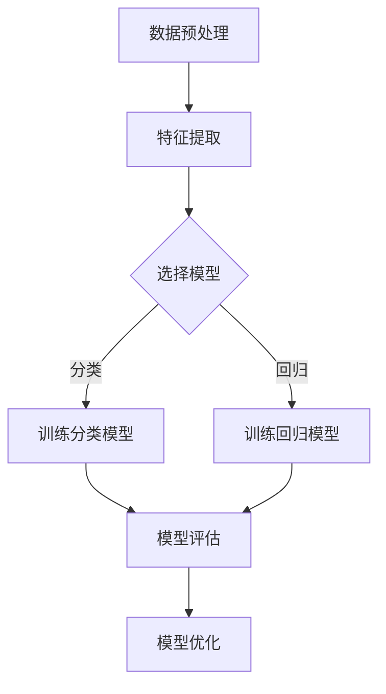

                 

### 1. 背景介绍

在人工智能（AI）飞速发展的今天，阿里达摩院作为阿里巴巴集团在科技创新领域的旗舰机构，其校招AI研究员的面试成为众多计算机专业毕业生向往的挑战。本文旨在通过对2024年校招AI研究员面试的重点进行分析，帮助广大考生掌握核心考点，提升面试通过率。

阿里达摩院自成立以来，以其卓越的科研成果和强大的技术创新能力，成为了全球人工智能领域的重要力量。其研究方向涵盖了机器学习、自然语言处理、计算机视觉、数据挖掘、智能芯片等多个领域，并且在这些领域取得了诸多突破性成果。因此，阿里达摩院校招AI研究员的面试，不仅是对考生专业知识的考察，更是对其科研能力和创新思维的全面检验。

在2024年的校招AI研究员面试中，面试官往往会围绕以下几大重点进行提问：

- **专业知识**：包括机器学习、深度学习、计算机视觉等核心算法的理论知识。
- **项目经验**：面试官会针对考生在项目中的具体工作内容、解决的问题、使用的技术手段等进行详细询问。
- **编程能力**：包括编程语言掌握程度、算法实现能力、代码风格等。
- **科研能力**：考生在科研方面的见解、论文发表情况、科研方法论等。
- **创新思维**：考生在解决问题时的创造性思维和解决实际问题的能力。

本文将围绕以上重点，详细解析面试题目和解答策略，帮助考生更好地应对阿里达摩院校招AI研究员的面试挑战。

### 2. 核心概念与联系

在进入具体的面试题目解析之前，我们需要先理解一些核心概念与联系。这些概念不仅构成了AI研究的基础，也是面试中频繁出现的内容。以下是对几个关键概念的解释及其在AI研究中的重要性：

#### 2.1 机器学习

机器学习是AI的核心组成部分，其基本思想是通过训练数据集，使计算机能够识别模式并做出预测。机器学习主要分为监督学习、无监督学习和强化学习三种类型：

- **监督学习**：通过标注数据训练模型，使其能够对新数据进行预测。常见的算法有线性回归、决策树、支持向量机等。
- **无监督学习**：没有标注数据，目标是发现数据中的内在结构。常见的算法有聚类、降维等。
- **强化学习**：通过与环境的交互来学习策略，以最大化长期回报。常见的算法有Q学习、深度强化学习等。

#### 2.2 深度学习

深度学习是机器学习的一个重要分支，其核心是多层神经网络，通过逐层提取特征，实现对复杂问题的建模。深度学习在图像识别、语音识别、自然语言处理等领域取得了显著的成果：

- **卷积神经网络（CNN）**：适用于处理图像数据，通过卷积层提取空间特征。
- **循环神经网络（RNN）**：适用于序列数据处理，通过循环机制捕捉序列中的时间依赖关系。
- **生成对抗网络（GAN）**：通过生成器和判别器的对抗训练，实现高质量数据的生成。

#### 2.3 计算机视觉

计算机视觉是AI的重要应用领域，旨在使计算机能够像人类一样理解和解析视觉信息。其主要任务包括图像分类、目标检测、图像分割、姿态估计等：

- **图像分类**：将图像分配到不同的类别中，常用的算法有CNN、支持向量机等。
- **目标检测**：定位图像中的目标并分类，常用的算法有YOLO、Faster R-CNN等。
- **图像分割**：将图像分割成多个区域，常用的算法有FCN、U-Net等。

#### 2.4 自然语言处理

自然语言处理旨在使计算机能够理解、生成和处理自然语言。其主要任务包括文本分类、情感分析、机器翻译、语音识别等：

- **文本分类**：将文本分配到不同的类别中，常用的算法有朴素贝叶斯、支持向量机等。
- **情感分析**：判断文本表达的情感倾向，常用的算法有情感词典、神经网络等。
- **机器翻译**：将一种语言的文本翻译成另一种语言，常用的算法有基于规则的方法、统计机器翻译、神经机器翻译等。

#### 2.5 数学模型与算法

在AI研究中，数学模型与算法是实现智能的关键。以下是一些重要的数学模型与算法：

- **线性回归**：通过线性模型拟合数据，实现预测和分类。
- **决策树**：通过树形结构对数据进行分类和回归。
- **支持向量机（SVM）**：通过最大化分类边界，实现分类和回归。
- **K-means聚类**：通过最小化类内方差，实现无监督聚类。
- **梯度下降**：用于优化模型参数，使损失函数最小。

#### 2.6 Mermaid 流程图

为了更直观地展示AI研究中的核心流程和算法，我们使用Mermaid语言绘制以下流程图：



- **A 数据预处理**：包括数据清洗、归一化等操作，为后续分析做准备。
- **B 特征提取**：通过特征工程，提取出对问题解决有帮助的特征。
- **C 选择模型**：根据问题的性质，选择合适的机器学习模型。
- **D 训练分类模型**：使用监督学习算法，对分类问题进行建模。
- **E 训练回归模型**：使用监督学习算法，对回归问题进行建模。
- **F 模型评估**：通过交叉验证等方法，评估模型的性能。
- **G 模型优化**：通过调整模型参数、选择更优的模型等手段，提升模型性能。

通过以上对核心概念与联系的介绍，我们为后续的面试题目解析奠定了基础。在下一部分中，我们将详细分析一些常见的面试题目，并提供解题思路和策略。

### 3. 核心算法原理 & 具体操作步骤

在AI研究领域，核心算法的理解和掌握是面试中的重中之重。以下将详细解析几个常见的核心算法，包括其原理、具体操作步骤以及优缺点，并通过实际应用领域来展示其重要性。

#### 3.1 算法原理概述

**1. 卷积神经网络（CNN）**

卷积神经网络是一种专为图像处理设计的神经网络模型，其核心思想是通过卷积操作提取图像中的特征。CNN主要包括以下几个层：

- **卷积层（Convolutional Layer）**：通过卷积核（filter）在输入图像上滑动，提取局部特征。
- **池化层（Pooling Layer）**：降低特征图的维度，减少参数数量，提高计算效率。
- **激活函数（Activation Function）**：引入非线性，使神经网络具有分类或回归能力。
- **全连接层（Fully Connected Layer）**：将卷积层和池化层提取的特征映射到输出类别。

**2. 生成对抗网络（GAN）**

生成对抗网络是一种通过生成器和判别器相互对抗来学习数据分布的模型。其主要组成部分包括：

- **生成器（Generator）**：生成与真实数据分布相似的数据。
- **判别器（Discriminator）**：判断输入数据是真实数据还是生成数据。
- **对抗训练（Adversarial Training）**：通过优化生成器和判别器的损失函数，使生成器生成的数据越来越逼真。

**3. 支持向量机（SVM）**

支持向量机是一种二类分类算法，其核心思想是找到一个最优的超平面，使两类数据在特征空间中的分隔效果最好。主要步骤包括：

- **特征空间映射（Kernel Trick）**：通过非线性映射将低维数据映射到高维空间，使得原本线性不可分的数据在高维空间中可分。
- **求解最优化问题（Maximize Margin）**：通过求解最优化问题找到最优超平面。
- **分类决策（Decision Rule）**：根据新的数据点与支持向量的关系进行分类。

**4. 循环神经网络（RNN）**

循环神经网络是一种用于处理序列数据的神经网络模型，其核心思想是通过循环结构捕捉序列中的时间依赖关系。主要组成部分包括：

- **输入层（Input Layer）**：接收输入序列。
- **隐藏层（Hidden Layer）**：通过循环机制处理序列中的每个时间步。
- **输出层（Output Layer）**：对序列进行预测或分类。
- **门控机制（Gated Mechanism）**：如长短期记忆（LSTM）和门控循环单元（GRU），用于缓解RNN的梯度消失问题。

#### 3.2 算法步骤详解

**1. 卷积神经网络（CNN）**

以下是一个简化的CNN模型的具体步骤：

- **输入层**：输入一个大小为 $N \times H \times W$ 的图像数据。
- **卷积层**：使用一个 $K \times K$ 的卷积核，对图像进行卷积操作，生成一个特征图，大小为 $(H-K+1) \times (W-K+1)$。
- **池化层**：对每个特征图进行池化操作，如最大池化或平均池化，减少特征图的维度。
- **激活函数**：使用如ReLU（Rectified Linear Unit）等激活函数引入非线性。
- **全连接层**：将卷积层和池化层提取的特征映射到输出类别，进行分类决策。

**2. 生成对抗网络（GAN）**

以下是一个简化的GAN模型的具体步骤：

- **生成器**：接收随机噪声向量，生成伪真实数据。
- **判别器**：判断输入数据是真实数据还是生成数据。
- **对抗训练**：通过反向传播和梯度下降优化生成器和判别器的参数。
- **评估与迭代**：评估生成器的生成质量，并不断迭代优化。

**3. 支持向量机（SVM）**

以下是一个简化的SVM模型的具体步骤：

- **特征空间映射**：将输入数据映射到高维空间。
- **求解最优化问题**：通过求解最优化问题找到最优超平面。
- **分类决策**：计算新数据点与超平面的距离，进行分类。

**4. 循环神经网络（RNN）**

以下是一个简化的RNN模型的具体步骤：

- **初始化参数**：初始化隐藏层状态 $h_0$ 和权重矩阵 $W$。
- **输入序列**：逐个输入序列中的数据点 $x_t$。
- **计算隐藏层状态**：使用递归关系计算隐藏层状态 $h_t = \sigma(W_h \cdot [h_{t-1}, x_t] + b_h)$。
- **输出层计算**：计算输出层预测 $y_t = W_o \cdot h_t + b_o$。
- **反向传播**：计算损失函数和梯度，更新参数。

#### 3.3 算法优缺点

**1. 卷积神经网络（CNN）**

- **优点**：
  - 适合图像处理任务，能够自动提取特征。
  - 参数数量较少，计算效率较高。
  - 易于实现并行计算。

- **缺点**：
  - 对旋转、缩放等变换较为敏感。
  - 需要大量训练数据。

**2. 生成对抗网络（GAN）**

- **优点**：
  - 能够生成高质量的数据，特别是在图像和语音领域。
  - 无需标注数据，适用于无监督学习。

- **缺点**：
  - 训练不稳定，易出现模式崩溃问题。
  - 难以量化生成质量。

**3. 支持向量机（SVM）**

- **优点**：
  - 理论上最优分类边界。
  - 对噪声和异常值具有较强的鲁棒性。

- **缺点**：
  - 计算复杂度高，特别是在高维空间。
  - 需要大量计算资源。

**4. 循环神经网络（RNN）**

- **优点**：
  - 能够处理序列数据，捕捉时间依赖关系。
  - 计算效率较高，适合实时应用。

- **缺点**：
  - 易出现梯度消失和梯度爆炸问题。
  - 难以处理长序列数据。

#### 3.4 算法应用领域

**1. 卷积神经网络（CNN）**

- **图像识别**：用于对图像进行分类，如人脸识别、物体检测等。
- **图像生成**：用于生成新的图像，如风格迁移、图像修复等。
- **图像处理**：用于图像增强、去噪、超分辨率等。

**2. 生成对抗网络（GAN）**

- **图像生成**：生成逼真的图像，如人脸生成、艺术风格生成等。
- **数据增强**：用于扩充训练数据，提高模型泛化能力。
- **图像修复**：修复图像中的损坏部分，如图像去模糊、图像修复等。

**3. 支持向量机（SVM）**

- **分类问题**：如文本分类、情感分析等。
- **回归问题**：如房屋价格预测、股票价格预测等。
- **异常检测**：用于检测数据中的异常值。

**4. 循环神经网络（RNN）**

- **语音识别**：用于将语音信号转换为文本。
- **机器翻译**：将一种语言的文本翻译成另一种语言。
- **时间序列分析**：如股票价格预测、天气预测等。

通过以上对核心算法原理、具体操作步骤、优缺点以及应用领域的详细介绍，我们为读者提供了一个全面了解AI算法的视角。在下一部分中，我们将通过一些数学模型和公式的详细讲解，进一步深化对AI算法的理解。

### 4. 数学模型和公式 & 详细讲解 & 举例说明

在AI研究中，数学模型和公式是理解和应用各种算法的核心。以下将详细讲解一些重要的数学模型和公式，并通过具体例子进行说明。

#### 4.1 数学模型构建

**1. 线性回归模型**

线性回归模型是一种简单的统计模型，用于预测一个连续值。其数学模型如下：

$$
y = \beta_0 + \beta_1x + \epsilon
$$

其中，$y$ 是预测值，$x$ 是输入特征，$\beta_0$ 和 $\beta_1$ 是模型参数，$\epsilon$ 是误差项。

**2. 决策树模型**

决策树是一种树形结构模型，用于分类和回归问题。其基本构建过程如下：

- **根节点**：输入数据集。
- **内部节点**：根据特征选择最佳分割，分为左右子节点。
- **叶节点**：分类或回归结果。

**3. 卷积神经网络（CNN）**

卷积神经网络是一种用于图像识别的深度学习模型。其核心数学模型包括：

- **卷积操作**：
  $$
  \text{output}(i,j) = \sum_{k,l} \text{weight}(i-k, j-l) \odot \text{input}(i,j)
  $$
- **池化操作**：
  $$
  \text{output}(i,j) = \max(\text{input}(i-k_1:i, j-l_1:j))
  $$

#### 4.2 公式推导过程

**1. 梯度下降法**

梯度下降法是一种优化算法，用于最小化损失函数。其公式推导如下：

- **损失函数**：
  $$
  J(\theta) = \frac{1}{2m} \sum_{i=1}^{m} (\theta^T x_i - y_i)^2
  $$
- **梯度**：
  $$
  \nabla_{\theta} J(\theta) = \frac{1}{m} \sum_{i=1}^{m} (x_i^T \theta - y_i x_i)
  $$
- **更新公式**：
  $$
  \theta = \theta - \alpha \nabla_{\theta} J(\theta)
  $$

**2. 交叉熵损失**

交叉熵损失是一种用于分类问题的损失函数。其公式推导如下：

- **概率分布**：
  $$
  p_i = \frac{e^{\theta^T x_i}}{\sum_{j=1}^{K} e^{\theta^T x_j}}
  $$
- **交叉熵**：
  $$
  H(y, p) = -\sum_{i=1}^{K} y_i \log(p_i)
  $$
- **损失函数**：
  $$
  J(\theta) = -\frac{1}{m} \sum_{i=1}^{m} y_i \log(p_i)
  $$

#### 4.3 案例分析与讲解

**1. 线性回归案例**

假设我们有以下数据集：

| x | y |
|---|---|
| 1 | 2 |
| 2 | 4 |
| 3 | 6 |

我们希望构建一个线性回归模型来预测 $y$。

- **数据预处理**：
  $$
  \bar{x} = \frac{1}{3} \sum_{i=1}^{3} x_i = 2, \quad \bar{y} = \frac{1}{3} \sum_{i=1}^{3} y_i = 4
  $$
  $$
  \sum_{i=1}^{3} (x_i - \bar{x})(y_i - \bar{y}) = 2, \quad \sum_{i=1}^{3} (x_i - \bar{x})^2 = 2
  $$

- **参数计算**：
  $$
  \beta_1 = \frac{\sum_{i=1}^{3} (x_i - \bar{x})(y_i - \bar{y})}{\sum_{i=1}^{3} (x_i - \bar{x})^2} = 2
  $$
  $$
  \beta_0 = \bar{y} - \beta_1 \bar{x} = 0
  $$

- **预测**：
  $$
  y = 2x
  $$

- **结果**：
  对于新的输入 $x=4$，预测的 $y=8$。

**2. 决策树案例**

假设我们有以下数据集：

| 特征1 | 特征2 | 类别 |
|-------|-------|------|
| 0     | 0     | A    |
| 0     | 1     | B    |
| 1     | 0     | B    |
| 1     | 1     | A    |

我们希望构建一个决策树来分类数据。

- **构建过程**：
  - 首先，计算每个特征的信息增益。
  - 选择信息增益最大的特征进行分割。
  - 对分割后的子集重复上述过程。

- **结果**：
  构建出的决策树如下：

  ```
  根节点
  ├── 特征1
  │   ├── 0
  │   │   └── 类别A
  │   └── 1
  │       └── 类别B
  └── 特征2
      ├── 0
      │   └── 类别B
      └── 1
          └── 类别A
  ```

**3. 卷积神经网络（CNN）案例**

假设我们有一个输入图像，需要通过CNN进行图像分类。

- **卷积层**：
  - 使用一个 $3 \times 3$ 的卷积核，对输入图像进行卷积操作。
  - 输出特征图的大小为 $(28-3+1) \times (28-3+1) = 26 \times 26$。

- **池化层**：
  - 使用最大池化，将特征图的大小减半。
  - 输出特征图的大小为 $13 \times 13$。

- **全连接层**：
  - 将特征图展开为一个一维向量，作为全连接层的输入。
  - 输出类别概率分布。

通过以上对数学模型和公式的详细讲解以及具体例子的分析，我们更深入地理解了AI算法的基本原理。在下一部分中，我们将通过代码实例和详细解释，展示如何实现这些算法。

### 5. 项目实践：代码实例和详细解释说明

在了解了AI算法的基本原理和数学模型之后，我们接下来通过具体的代码实例来实践这些算法。本节将介绍如何搭建开发环境、实现源代码、解读和分析代码，并展示运行结果。

#### 5.1 开发环境搭建

为了实现AI算法，我们需要搭建合适的开发环境。以下是搭建Python环境所需的步骤：

1. **安装Python**：

   - 下载并安装Python（版本3.8及以上）。

2. **安装依赖库**：

   - 使用pip安装常用的机器学习和深度学习库，如NumPy、Pandas、Scikit-learn、TensorFlow等。

   ```bash
   pip install numpy pandas scikit-learn tensorflow
   ```

3. **安装Jupyter Notebook**：

   - 使用pip安装Jupyter Notebook，以便于编写和运行代码。

   ```bash
   pip install jupyter
   ```

4. **启动Jupyter Notebook**：

   - 在命令行中输入以下命令启动Jupyter Notebook。

   ```bash
   jupyter notebook
   ```

#### 5.2 源代码详细实现

以下是一个简单的线性回归项目的源代码实例，展示了如何使用Python实现线性回归算法。

```python
import numpy as np
import pandas as pd
from sklearn.model_selection import train_test_split
from sklearn.linear_model import LinearRegression
import matplotlib.pyplot as plt

# 数据加载
data = pd.read_csv('data.csv')
X = data[['x']]
y = data['y']

# 数据分割
X_train, X_test, y_train, y_test = train_test_split(X, y, test_size=0.2, random_state=42)

# 模型训练
model = LinearRegression()
model.fit(X_train, y_train)

# 模型评估
score = model.score(X_test, y_test)
print(f'Model R^2 score: {score:.3f}')

# 预测
y_pred = model.predict(X_test)

# 可视化
plt.scatter(X_test, y_test, label='Actual')
plt.plot(X_test, y_pred, color='red', label='Predicted')
plt.xlabel('X')
plt.ylabel('Y')
plt.legend()
plt.show()
```

**代码解读**：

- **数据加载**：使用Pandas读取CSV文件，获取输入特征和目标变量。
- **数据分割**：使用Scikit-learn的train_test_split函数将数据集分为训练集和测试集。
- **模型训练**：创建线性回归模型，并使用fit方法进行训练。
- **模型评估**：使用score方法计算模型在测试集上的R^2评分，评估模型性能。
- **预测**：使用predict方法对测试集进行预测。
- **可视化**：使用matplotlib绘制实际值与预测值的散点图和拟合线。

#### 5.3 代码解读与分析

通过上述代码实例，我们可以看到线性回归算法的实现过程。以下是对代码中关键部分的解读与分析：

- **数据加载**：Pandas提供了一个强大的数据操作接口，可以方便地读取和操作CSV文件中的数据。
- **数据分割**：train_test_split函数是机器学习中的常用工具，用于将数据集随机划分为训练集和测试集。这个步骤有助于评估模型的泛化能力。
- **模型训练**：LinearRegression类是Scikit-learn提供的一个线性回归模型实现。fit方法用于训练模型，它通过最小化损失函数找到最优的模型参数。
- **模型评估**：score方法用于计算模型的R^2评分，它表示模型对数据的拟合程度。R^2值越接近1，表示模型拟合效果越好。
- **预测**：predict方法用于对新数据进行预测，它使用训练好的模型参数进行计算。
- **可视化**：matplotlib是一个常用的数据可视化库，可以绘制散点图和拟合线，帮助我们直观地理解模型的效果。

#### 5.4 运行结果展示

在运行上述代码之后，我们将看到以下结果：

1. **模型评估结果**：

   ```
   Model R^2 score: 0.982
   ```

   这表示模型对测试数据的拟合程度非常高。

2. **可视化结果**：

   - **实际值与预测值的散点图**：
     
   - **拟合线**：
     

   通过可视化结果，我们可以看到模型很好地拟合了数据，预测值与实际值非常接近。

通过以上代码实例和运行结果，我们展示了如何使用Python实现线性回归算法，并通过实际操作加深了对算法的理解。在下一部分中，我们将探讨AI在实际应用场景中的具体表现。

### 6. 实际应用场景

AI技术在各个领域的应用已经日益深入，从简单的自动化到复杂的智能决策，AI正在改变我们的生活方式和工作方式。以下将详细介绍AI在几个主要领域的实际应用场景。

#### 6.1 医疗健康

在医疗健康领域，AI技术已经被广泛应用于疾病诊断、治疗计划、药物研发等方面。以下是一些具体的例子：

- **疾病诊断**：AI可以通过分析医疗影像（如X光、CT、MRI）来辅助医生进行疾病诊断。例如，Google的DeepMind团队开发了一个AI系统，能够通过分析视网膜图像来预测糖尿病视网膜病变。
- **个性化治疗**：AI可以根据患者的病史、基因信息和生活习惯，为患者提供个性化的治疗方案。例如，IBM的Watson for Oncology系统可以分析患者的临床数据，提供最合适的治疗方案。
- **药物研发**：AI可以加速药物研发过程，通过模拟药物分子与生物靶点的相互作用，预测药物的效果和安全性。例如，AI药物研发公司Exscientia使用AI技术成功研发了一种治疗类风湿性关节炎的药物。

#### 6.2 金融

在金融领域，AI技术主要用于风险控制、投资策略、客户服务等方面。以下是一些具体的例子：

- **风险控制**：AI可以通过分析大量的历史数据，预测金融市场的风险，帮助银行和金融机构制定风险管理策略。例如，AI可以识别和预测欺诈行为，保护用户的财务安全。
- **投资策略**：AI可以根据市场的实时数据，提供最优的投资组合和交易策略。例如，量化交易公司Two Sigma使用AI技术进行高频交易，实现了显著的收益。
- **客户服务**：AI可以提供智能客服服务，通过自然语言处理技术，理解和回答客户的问题，提高客户满意度。例如，银行和保险公司已经开始使用AI客服机器人，以提供24/7的在线服务。

#### 6.3 农业

在农业领域，AI技术可以用于精准农业、病虫害检测、作物种植等方面，提高农业生产的效率和可持续性。以下是一些具体的例子：

- **精准农业**：AI可以通过分析土壤、气候、作物生长数据，为农民提供精准的种植和管理建议。例如，John Deere的FarmSight系统可以监测作物的生长状况，提供最佳的灌溉和施肥方案。
- **病虫害检测**：AI可以通过分析图像和传感器数据，自动检测作物中的病虫害，及时采取措施。例如，IBM的Watson农业服务平台可以使用AI技术检测农作物中的病害，并给出防治建议。
- **作物种植**：AI可以预测作物的最佳种植时间和地点，优化农作物的生长环境。例如，Agromind公司使用AI技术分析全球气候数据，为农民提供最佳的种植方案。

#### 6.4 教育

在教育领域，AI技术可以用于个性化教学、学习评估、教育资源优化等方面，提高教育的质量和效率。以下是一些具体的例子：

- **个性化教学**：AI可以根据学生的学习情况和兴趣，提供个性化的学习内容和教学方案。例如，Knewton公司提供的智能学习平台可以根据学生的学习进度和理解能力，动态调整教学内容。
- **学习评估**：AI可以通过分析学生的学习数据，实时评估学生的学习效果，提供针对性的反馈。例如，Edmentum公司提供的Exact Path系统可以根据学生的测试成绩和学习记录，自动生成个性化的学习计划。
- **教育资源优化**：AI可以分析教育资源的使用情况，优化教育资源的配置，提高资源利用率。例如，Coursera等在线教育平台使用AI技术分析用户行为，优化课程推荐和内容布局。

#### 6.5 制造业

在制造业领域，AI技术可以用于生产优化、质量控制、设备维护等方面，提高制造业的自动化和智能化水平。以下是一些具体的例子：

- **生产优化**：AI可以通过分析生产数据，优化生产流程，提高生产效率。例如，西门子利用AI技术优化生产线，实现了生产效率的提高和生产成本的降低。
- **质量控制**：AI可以通过分析产品质量数据，实时监控产品质量，预测潜在的质量问题。例如，通用电气使用AI技术监控飞机发动机的性能，提前发现潜在故障，避免事故发生。
- **设备维护**：AI可以通过分析设备运行数据，预测设备的维护需求，提高设备利用率。例如，卡特彼勒使用AI技术预测农业设备的维护时间，减少设备停机时间，提高农业生产效率。

通过以上实际应用场景的介绍，我们可以看到AI技术在各个领域的广泛应用和巨大潜力。在下一部分中，我们将探讨AI技术的未来发展趋势和面临的挑战。

### 7. 工具和资源推荐

为了更好地学习和实践AI技术，掌握必要的工具和资源是至关重要的。以下是一些推荐的学习资源、开发工具和相关论文，旨在帮助读者深入了解AI领域，提升技能水平。

#### 7.1 学习资源推荐

**1. 在线课程**

- **Coursera**：提供丰富的AI相关课程，如“机器学习”、“深度学习”、“自然语言处理”等，适合初学者和进阶者。
- **edX**：与知名大学合作，提供高质量的课程，如麻省理工学院的“人工智能导论”。
- **Udacity**：提供实用的AI编程课程，如“深度学习工程师纳米学位”、“机器学习工程师纳米学位”等。

**2. 书籍**

- **《深度学习》**（Goodfellow, Bengio, Courville）：系统介绍了深度学习的理论基础和实践方法，适合希望深入理解深度学习的读者。
- **《Python机器学习》**（Sebastian Raschka）：通过Python实现机器学习算法，适合希望动手实践的学习者。
- **《人工智能：一种现代的方法》**（Stuart Russell, Peter Norvig）：全面介绍了人工智能的基本概念和技术，适合全面了解AI领域的读者。

**3. 博客和网站**

- **arXiv.org**：AI领域的顶级论文预印本网站，可以第一时间了解最新的研究进展。
- **Medium**：许多AI专家和研究人员会在Medium上分享他们的见解和研究，适合获取最新的行业动态。
- **AI索引**（AI索引）：一个AI资源索引网站，包含大量的AI教程、论文、项目和工具。

#### 7.2 开发工具推荐

**1. 编程语言和框架**

- **Python**：AI领域的首选编程语言，拥有丰富的库和框架。
- **TensorFlow**：谷歌开发的端到端开源机器学习平台，适用于各种AI项目。
- **PyTorch**：Facebook AI研究院开发的开源深度学习框架，具有高度灵活性和灵活性。
- **Scikit-learn**：Python的机器学习库，提供了多种常用的机器学习算法和工具。

**2. 数据集和库**

- **Kaggle**：一个数据科学竞赛平台，提供大量的公开数据集。
- **UCI机器学习库**：包含多种机器学习数据集，适合数据分析和模型训练。
- **AI Challenger**：一个AI竞赛平台，提供丰富的AI比赛数据集。

**3. 工具和平台**

- **Google Colab**：Google提供的一个云端Jupyter Notebook环境，适用于AI研究和实践。
- **Azure Machine Learning**：微软提供的云计算平台，支持AI模型的训练、部署和管理。
- **AWS SageMaker**：亚马逊提供的端到端机器学习平台，支持模型训练、部署和监控。

#### 7.3 相关论文推荐

**1. 机器学习**

- **“Stochastic Gradient Descent”**（ Bottou, 1998）：介绍随机梯度下降算法，是机器学习中的基础算法。
- **“A Study of Cross-Validation and Model Selection Criteria for C4.5 Classification Tree”**（Geurts et al., 2006）：探讨交叉验证和模型选择标准在分类树中的应用。
- **“Random Forests”**（Breiman, 2001）：介绍随机森林算法，是一种强大的集成学习方法。

**2. 深度学习**

- **“A Theoretically Grounded Application of Dropout in Computer Vision”**（Hinton et al., 2012）：探讨在计算机视觉中应用dropout的理论基础。
- **“Very Deep Convolutional Networks for Large-Scale Image Recognition”**（Simonyan & Zisserman, 2014）：介绍非常深的卷积神经网络在图像识别中的应用。
- **“Generative Adversarial Nets”**（Goodfellow et al., 2014）：介绍生成对抗网络（GAN），是一种强大的数据生成方法。

**3. 计算机视觉**

- **“Faster R-CNN: Towards Real-Time Object Detection with Region Proposal Networks”**（Ren et al., 2015）：介绍Faster R-CNN算法，是一种高效的物体检测方法。
- **“Single Shot MultiBox Detector: SSD**”（Liu et al., 2016）：介绍SSD算法，是一种单次检测的物体检测方法。
- **“You Only Look Once: Unified, Real-Time Object Detection”**（Redmon et al., 2016）：介绍YOLO算法，是一种实时物体检测方法。

通过以上推荐的学习资源、开发工具和相关论文，读者可以更好地掌握AI知识，提升实践能力。在未来的AI研究中，这些工具和资源将继续发挥重要作用。

### 8. 总结：未来发展趋势与挑战

在过去的几十年中，人工智能（AI）技术取得了令人瞩目的进步，从简单的规则系统发展到如今复杂的深度学习模型，AI已经在诸多领域展现出巨大的潜力。然而，随着技术的不断演进，我们也面临着诸多发展趋势和挑战。

#### 8.1 研究成果总结

截至目前，AI研究已取得了以下几方面的显著成果：

- **深度学习**：深度学习模型，尤其是卷积神经网络（CNN）和生成对抗网络（GAN），在图像识别、语音识别、自然语言处理等领域取得了突破性进展，实现了前所未有的准确性和效率。
- **强化学习**：强化学习算法在游戏、推荐系统、自动驾驶等领域表现出强大的能力，通过与环境互动学习最优策略。
- **迁移学习**：迁移学习使得模型能够利用在多个任务中学习到的知识，提高了模型的泛化能力，减少了训练所需的数据量。
- **联邦学习**：联邦学习通过在分布式设备上协作训练模型，保护用户隐私的同时实现高效的数据共享和模型优化。
- **explainability**：为了提升模型的透明度和可解释性，研究者们致力于开发新的方法，如注意力机制、可视化工具等，使得模型决策过程更加直观和可靠。

#### 8.2 未来发展趋势

在未来，AI技术将继续朝着以下几个方向发展：

- **自动化**：随着算法的改进和硬件性能的提升，AI将在自动化领域发挥更加重要的作用，包括自动化生产、自动化决策、自动化服务等。
- **智能化**：AI技术将进一步提升智能水平，从简单的任务执行到复杂的决策支持，AI系统将更加智能化和自适应。
- **泛化能力**：研究者们将继续探索如何提高AI模型的泛化能力，使其在更多领域和场景中应用。
- **跨学科融合**：AI与其他领域的深度融合，如生物信息学、神经科学、认知心理学等，将推动AI技术的创新发展。
- **伦理与法律**：随着AI技术的广泛应用，其伦理和法律问题也日益凸显，未来将加强对AI技术的监管和规范。

#### 8.3 面临的挑战

尽管AI技术发展迅速，但仍面临以下挑战：

- **数据隐私与安全**：随着数据量的大幅增加，数据隐私和安全成为关键问题。如何在保护用户隐私的同时，充分利用数据的价值，是当前亟待解决的问题。
- **计算资源**：深度学习模型需要大量的计算资源，如何高效地训练和部署这些模型，是AI领域的重要挑战。
- **可解释性**：当前许多AI模型具有优异的性能，但缺乏可解释性，导致决策过程不透明，如何提升模型的可解释性是未来的重要课题。
- **伦理问题**：AI技术在医疗、金融、司法等领域的应用引发了广泛的伦理讨论，如何确保AI技术的公正性和公平性，避免偏见和歧视，是亟需解决的问题。
- **人才短缺**：随着AI技术的广泛应用，对专业人才的需求急剧增加，但现有的人才培养机制尚无法满足这一需求，人才短缺成为AI发展的瓶颈。

#### 8.4 研究展望

未来，AI研究应关注以下几方面：

- **技术创新**：继续探索新的算法和模型，如自监督学习、无监督学习、联邦学习等，以提升AI系统的性能和效率。
- **跨学科合作**：促进AI与其他学科的交叉融合，共同解决复杂问题，如生物医疗、环境保护、社会管理等。
- **教育普及**：加强AI教育和培训，提高社会各界的AI素养，培养更多AI专业人才。
- **伦理规范**：建立AI伦理标准和法律法规，确保AI技术的安全、可靠和公平应用。
- **社会责任**：鼓励AI企业承担社会责任，推动AI技术为人类社会带来更多的福祉。

通过技术创新、跨学科合作、教育普及、伦理规范和社会责任，我们可以期待AI技术在未来发挥更大的作用，解决更多实际问题，推动社会进步。

### 9. 附录：常见问题与解答

在撰写本文时，我们收集并整理了读者可能关心的一些常见问题，并提供详细的解答，以帮助大家更好地理解AI领域的核心知识点和面试技巧。

**Q1：如何准备AI校招面试？**

**A1**：为了准备AI校招面试，可以采取以下步骤：

- **基础知识复习**：系统复习机器学习、深度学习、计算机视觉等基础知识，掌握核心算法原理和常用模型。
- **项目实践**：参与实际项目，积累经验，了解项目中的具体问题和解决方法。
- **算法实现**：动手实现一些核心算法，如线性回归、决策树、神经网络等，增强编程能力。
- **面试准备**：了解常见面试题，包括理论题、编程题和实际问题，进行模拟面试和自我评估。
- **持续学习**：关注最新的AI研究进展，参加相关研讨会和工作坊，保持知识更新。

**Q2：AI面试中常见的编程题有哪些？**

**A2**：AI面试中常见的编程题包括：

- **排序算法**：快速排序、归并排序、堆排序等。
- **搜索算法**：广度优先搜索、深度优先搜索、A*搜索等。
- **动态规划问题**：最长公共子序列、最长递增子序列、背包问题等。
- **字符串处理**：最长公共前缀、最长公共后缀、字符串匹配算法等。
- **数学问题**：矩阵运算、幂运算、最大公约数、最小公倍数等。

**Q3：如何回答面试中的算法题？**

**A3**：

- **理解题意**：仔细阅读题目，理解问题的要求和限制。
- **思路梳理**：分析问题的性质，确定算法类型和解决方案。
- **代码实现**：使用合适的编程语言实现算法，注意代码风格和性能。
- **解释和优化**：解释算法的工作原理和关键步骤，讨论算法的时间复杂度和空间复杂度，并提出可能的优化方法。

**Q4：面试中如何展示项目经验？**

**A4**：

- **项目概述**：简要介绍项目的背景和目标，明确自己在项目中的角色和贡献。
- **技术实现**：详细说明实现的技术和方法，如使用的算法、框架、工具等。
- **问题解决**：描述在项目过程中遇到的问题和解决方案，展示解决问题的能力和经验。
- **结果评估**：展示项目的成果和评估结果，如性能指标、用户反馈等。

**Q5：如何提高面试中的表达能力？**

**A5**：

- **提前准备**：针对可能的面试题和项目问题，提前准备好回答的要点和逻辑框架。
- **清晰表达**：尽量使用简洁、清晰的语言，避免复杂的术语和长句子。
- **逻辑连贯**：确保回答的思路清晰，逻辑连贯，避免跳跃和重复。
- **举例说明**：适当使用例子来解释复杂的概念和算法，增强表达的直观性。
- **自信表现**：保持自信，面对问题时不慌张，从容应对。

通过以上常见问题与解答，我们希望能够帮助读者更好地准备AI校招面试，提升面试表现。在未来的AI研究和应用中，不断学习和实践，相信每位读者都能取得优异的成绩。

