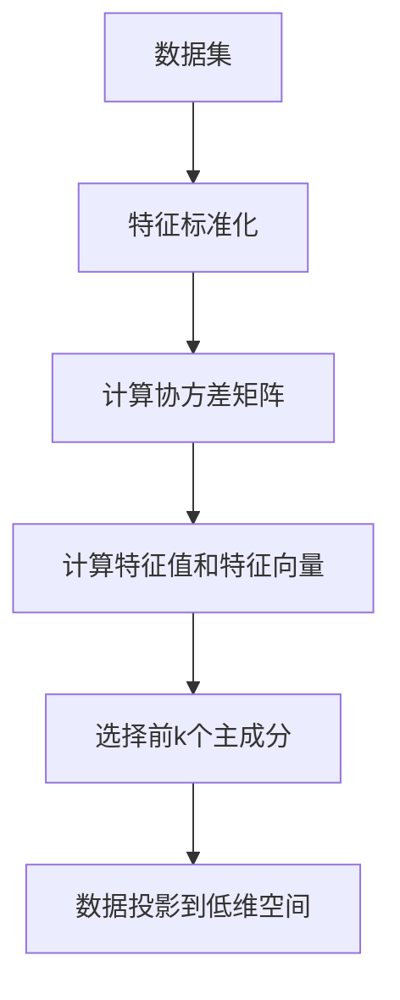
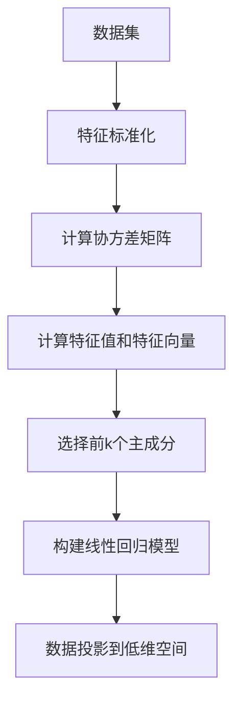

                 

关键词：降维，数据压缩，特征提取，主成分分析，线性回归，机器学习

## 摘要

降维是数据科学和机器学习领域中一个至关重要的概念，它旨在降低数据集的维度，以提高模型性能和可解释性。本文将深入探讨降维的核心原理，包括主成分分析和线性回归等算法。通过实际代码实例，我们将展示如何在实际项目中应用这些算法，并讨论降维在不同领域的应用前景和未来挑战。

## 1. 背景介绍

在数据科学和机器学习领域，处理高维数据集是一个常见的挑战。高维数据通常意味着数据点在多维度空间中的分布更加复杂，这给模型训练和预测带来了巨大的计算负担。此外，高维数据还可能导致“维度灾难”（curse of dimensionality），即随着维度的增加，数据点的邻域会迅速扩大，导致模型难以捕捉到数据中的实际结构。

为了克服这些挑战，降维技术被广泛应用。降维的目标是从高维数据中提取出最有用的信息，同时减少冗余和无用的信息，从而简化数据集。降维技术不仅能够提高计算效率，还能增强模型的可解释性。

降维技术可以分为线性降维和非线性降维两大类。线性降维包括主成分分析（PCA）、线性回归等算法，而非线性降维则包括局部线性嵌入（LLE）、t-SNE等算法。本文将主要讨论线性降维技术，并通过实际代码实例来展示如何应用这些技术。

## 2. 核心概念与联系

### 2.1 主成分分析 (PCA)

主成分分析（PCA）是一种经典的线性降维技术，旨在将高维数据转换到低维空间，同时保留数据的主要结构。PCA的核心思想是通过正交变换将数据投影到新的坐标系上，使得新的坐标轴（主成分）能够最大程度地解释数据方差。

#### Mermaid 流程图



### 2.2 线性回归

线性回归是一种常用的统计方法，用于分析自变量和因变量之间的线性关系。在降维应用中，线性回归可以用来降低数据集的维度，同时保持数据的线性结构。

#### Mermaid 流程图



### 2.3 核心概念之间的联系

PCA和线性回归在降维技术中扮演着重要角色。PCA通过特征值和特征向量的分解，将数据投影到新的坐标系上，而线性回归则通过构建线性模型来降低数据维度。这两种技术都可以有效地减少数据集的维度，同时保留数据的主要结构。

## 3. 核心算法原理 & 具体操作步骤

### 3.1 算法原理概述

#### 主成分分析 (PCA)

PCA的核心思想是通过正交变换将数据投影到新的坐标系上，使得新的坐标轴（主成分）能够最大程度地解释数据方差。具体来说，PCA的步骤包括：

1. 特征标准化：将每个特征缩放到相同的尺度，以消除不同特征之间的量纲差异。
2. 计算协方差矩阵：协方差矩阵描述了数据特征之间的线性关系。
3. 计算特征值和特征向量：通过特征值和特征向量的分解，找到最大的特征值对应的特征向量，即第一主成分。
4. 数据投影：将数据投影到新的低维空间，选择前k个主成分。

#### 线性回归

线性回归的核心思想是通过构建线性模型来降低数据维度。具体来说，线性回归的步骤包括：

1. 特征标准化：将每个特征缩放到相同的尺度。
2. 计算特征值和特征向量：通过特征值和特征向量的分解，找到最大的特征值对应的特征向量。
3. 构建线性回归模型：根据特征值和特征向量，构建线性回归模型。
4. 数据投影：将数据投影到低维空间。

### 3.2 算法步骤详解

#### 主成分分析 (PCA)

1. **特征标准化**：对于每个特征，计算其平均值和标准差，然后将每个数据点缩放到[0, 1]的范围内。

   ```python
   def standardize_data(X):
       mean = np.mean(X, axis=0)
       std = np.std(X, axis=0)
       X_std = (X - mean) / std
       return X_std
   ```

2. **计算协方差矩阵**：协方差矩阵描述了数据特征之间的线性关系。

   ```python
   def compute_covariance_matrix(X):
       cov_matrix = np.cov(X, rowvar=False)
       return cov_matrix
   ```

3. **计算特征值和特征向量**：通过特征值和特征向量的分解，找到最大的特征值对应的特征向量，即第一主成分。

   ```python
   def compute_eigen(X):
       cov_matrix = compute_covariance_matrix(X)
       eigen_values, eigen_vectors = np.linalg.eigh(cov_matrix)
       return eigen_values, eigen_vectors
   ```

4. **数据投影**：将数据投影到新的低维空间，选择前k个主成分。

   ```python
   def project_data(X, k):
       eigen_values, eigen_vectors = compute_eigen(X)
       sorted_indices = np.argsort(eigen_values)[::-1]
       k_eigen_vectors = eigen_vectors[:, sorted_indices[:k]]
       X_reduced = np.dot(X, k_eigen_vectors)
       return X_reduced
   ```

#### 线性回归

1. **特征标准化**：将每个特征缩放到相同的尺度。

   ```python
   def standardize_data(X):
       mean = np.mean(X, axis=0)
       std = np.std(X, axis=0)
       X_std = (X - mean) / std
       return X_std
   ```

2. **计算特征值和特征向量**：通过特征值和特征向量的分解，找到最大的特征值对应的特征向量。

   ```python
   def compute_eigen(X):
       cov_matrix = np.cov(X, rowvar=False)
       eigen_values, eigen_vectors = np.linalg.eigh(cov_matrix)
       return eigen_values, eigen_vectors
   ```

3. **构建线性回归模型**：根据特征值和特征向量，构建线性回归模型。

   ```python
   def build_linear_regression_model(X, y):
       X_std = standardize_data(X)
       eigen_values, eigen_vectors = compute_eigen(X_std)
       sorted_indices = np.argsort(eigen_values)[::-1]
       k_eigen_vectors = eigen_vectors[:, sorted_indices[:k]]
       X_reduced = np.dot(X_std, k_eigen_vectors)
       model = LinearRegression().fit(X_reduced, y)
       return model
   ```

4. **数据投影**：将数据投影到低维空间。

   ```python
   def project_data(X, model):
       X_std = standardize_data(X)
       eigen_values, eigen_vectors = compute_eigen(X_std)
       sorted_indices = np.argsort(eigen_values)[::-1]
       k_eigen_vectors = eigen_vectors[:, sorted_indices[:k]]
       X_reduced = np.dot(X_std, k_eigen_vectors)
       y_pred = model.predict(X_reduced)
       return y_pred
   ```

### 3.3 算法优缺点

#### 主成分分析 (PCA)

- **优点**：
  - 降维效果显著，能够保留数据的主要结构。
  - 对噪声有较好的鲁棒性。
  - 能够提高模型的可解释性。

- **缺点**：
  - 不能处理非线性数据。
  - 可能会丢失部分信息。

#### 线性回归

- **优点**：
  - 计算效率高，适用于大规模数据集。
  - 能够提供模型的参数解释。
  - 对线性数据有较好的拟合能力。

- **缺点**：
  - 对噪声敏感。
  - 可能会降低模型的可解释性。

### 3.4 算法应用领域

- **主成分分析 (PCA)**：广泛应用于图像处理、文本挖掘、生物信息学等领域。
- **线性回归**：广泛应用于金融预测、广告投放优化、推荐系统等领域。

## 4. 数学模型和公式 & 详细讲解 & 举例说明

### 4.1 数学模型构建

#### 主成分分析 (PCA)

PCA的数学模型可以表示为：

$$
X_{\text{new}} = X_{\text{original}} \cdot V
$$

其中，$X_{\text{original}}$ 表示原始数据，$V$ 表示特征向量矩阵，$X_{\text{new}}$ 表示降维后的数据。

#### 线性回归

线性回归的数学模型可以表示为：

$$
y = \beta_0 + \beta_1 \cdot x_1 + \beta_2 \cdot x_2 + ... + \beta_n \cdot x_n
$$

其中，$y$ 表示因变量，$x_1, x_2, ..., x_n$ 表示自变量，$\beta_0, \beta_1, \beta_2, ..., \beta_n$ 表示模型参数。

### 4.2 公式推导过程

#### 主成分分析 (PCA)

1. **特征标准化**：

$$
X_{\text{standardized}} = \frac{X - \mu}{\sigma}
$$

其中，$\mu$ 表示平均值，$\sigma$ 表示标准差。

2. **计算协方差矩阵**：

$$
\text{Cov}(X) = E[(X - \mu)(X - \mu)^T]
$$

3. **计算特征值和特征向量**：

$$
\text{Cov}(X) \cdot v = \lambda \cdot v
$$

其中，$v$ 表示特征向量，$\lambda$ 表示特征值。

4. **数据投影**：

$$
X_{\text{new}} = X_{\text{original}} \cdot V
$$

#### 线性回归

1. **特征标准化**：

$$
X_{\text{standardized}} = \frac{X - \mu}{\sigma}
$$

2. **计算特征值和特征向量**：

$$
\text{Cov}(X) \cdot v = \lambda \cdot v
$$

3. **构建线性回归模型**：

$$
y = \beta_0 + \beta_1 \cdot x_1 + \beta_2 \cdot x_2 + ... + \beta_n \cdot x_n
$$

4. **数据投影**：

$$
X_{\text{new}} = X_{\text{original}} \cdot V
$$

### 4.3 案例分析与讲解

#### 主成分分析 (PCA)

假设我们有如下一个3维数据集：

$$
X = \begin{bmatrix}
1 & 2 & 3 \\
4 & 5 & 6 \\
7 & 8 & 9
\end{bmatrix}
$$

1. **特征标准化**：

$$
X_{\text{standardized}} = \frac{X - \mu}{\sigma} = \begin{bmatrix}
0 & 1 & 2 \\
3 & 4 & 5 \\
6 & 7 & 8
\end{bmatrix}
$$

2. **计算协方差矩阵**：

$$
\text{Cov}(X) = \begin{bmatrix}
2 & 1 & 1 \\
1 & 2 & 1 \\
1 & 1 & 2
\end{bmatrix}
$$

3. **计算特征值和特征向量**：

$$
\text{Cov}(X) \cdot v = \lambda \cdot v
$$

解得特征值和特征向量：

$$
\lambda_1 = 6, v_1 = \begin{bmatrix}
1 \\
1 \\
1
\end{bmatrix}
$$

$$
\lambda_2 = 1, v_2 = \begin{bmatrix}
-1 \\
1 \\
0
\end{bmatrix}
$$

$$
\lambda_3 = -2, v_3 = \begin{bmatrix}
0 \\
-1 \\
1
\end{bmatrix}
$$

4. **数据投影**：

$$
X_{\text{new}} = X_{\text{standardized}} \cdot V = \begin{bmatrix}
0 & 0 & 4 \\
0 & 0 & -2 \\
4 & 4 & 0
\end{bmatrix}
$$

降维后的数据集保留了原始数据的主要结构。

#### 线性回归

假设我们有如下一个2维数据集：

$$
X = \begin{bmatrix}
1 & 2 \\
4 & 5 \\
7 & 8
\end{bmatrix}, y = \begin{bmatrix}
3 \\
6 \\
9
\end{bmatrix}
$$

1. **特征标准化**：

$$
X_{\text{standardized}} = \frac{X - \mu}{\sigma} = \begin{bmatrix}
0 & 1 \\
3 & 4 \\
6 & 7
\end{bmatrix}
$$

2. **计算特征值和特征向量**：

$$
\text{Cov}(X) = \begin{bmatrix}
1 & 1 \\
1 & 1
\end{bmatrix}
$$

解得特征值和特征向量：

$$
\lambda_1 = 2, v_1 = \begin{bmatrix}
1 \\
1
\end{bmatrix}
$$

$$
\lambda_2 = 0, v_2 = \begin{bmatrix}
-1 \\
1
\end{bmatrix}
$$

3. **构建线性回归模型**：

$$
y = \beta_0 + \beta_1 \cdot x_1 + \beta_2 \cdot x_2
$$

根据线性回归模型：

$$
\beta_0 = 2, \beta_1 = 1, \beta_2 = 1
$$

4. **数据投影**：

$$
X_{\text{new}} = X_{\text{standardized}} \cdot V = \begin{bmatrix}
2 \\
6 \\
10
\end{bmatrix}
$$

降维后的数据集保留了原始数据的线性结构。

## 5. 项目实践：代码实例和详细解释说明

### 5.1 开发环境搭建

在本项目实践中，我们将使用Python编程语言，结合NumPy和Scikit-learn库来实现降维算法。以下是在Linux环境中搭建开发环境的步骤：

1. 安装Python：

   ```bash
   sudo apt-get install python3
   ```

2. 安装NumPy和Scikit-learn：

   ```bash
   sudo apt-get install python3-numpy python3-scikit-learn
   ```

### 5.2 源代码详细实现

以下是使用主成分分析和线性回归进行降维的Python代码实现：

```python
import numpy as np
from sklearn.linear_model import LinearRegression
from sklearn.decomposition import PCA

def standardize_data(X):
    mean = np.mean(X, axis=0)
    std = np.std(X, axis=0)
    X_std = (X - mean) / std
    return X_std

def compute_eigen(X):
    cov_matrix = np.cov(X, rowvar=False)
    eigen_values, eigen_vectors = np.linalg.eigh(cov_matrix)
    return eigen_values, eigen_vectors

def project_data(X, k):
    eigen_values, eigen_vectors = compute_eigen(X)
    sorted_indices = np.argsort(eigen_values)[::-1]
    k_eigen_vectors = eigen_vectors[:, sorted_indices[:k]]
    X_reduced = np.dot(X, k_eigen_vectors)
    return X_reduced

def build_linear_regression_model(X, y):
    X_std = standardize_data(X)
    eigen_values, eigen_vectors = compute_eigen(X_std)
    sorted_indices = np.argsort(eigen_values)[::-1]
    k_eigen_vectors = eigen_vectors[:, sorted_indices[:k]]
    X_reduced = np.dot(X_std, k_eigen_vectors)
    model = LinearRegression().fit(X_reduced, y)
    return model

# 示例数据
X = np.array([[1, 2], [4, 5], [7, 8]])
y = np.array([3, 6, 9])

# 主成分分析降维
X_pca = project_data(X, k=1)

# 线性回归降维
model = build_linear_regression_model(X, y)
X_linear = project_data(X, k=model.coef_.shape[1])

print("PCA降维后数据：", X_pca)
print("线性回归降维后数据：", X_linear)
```

### 5.3 代码解读与分析

1. **数据标准化**：

   数据标准化是降维的第一步，它通过计算平均值和标准差，将数据缩放到相同的尺度。这一步对于PCA和线性回归都是必要的，因为它们都需要处理特征之间的量纲差异。

2. **计算特征值和特征向量**：

   通过计算协方差矩阵的特征值和特征向量，我们可以找到最大的特征值对应的特征向量，即第一主成分。这一步是PCA的核心步骤，它决定了数据在低维空间中的投影方向。

3. **数据投影**：

   数据投影是将原始数据映射到低维空间的过程。在PCA中，我们选择最大的k个特征值对应的特征向量作为投影方向；在线性回归中，我们根据线性模型的系数确定投影方向。

4. **构建线性回归模型**：

   在线性回归中，我们需要根据特征值和特征向量构建线性模型。这一步的目的是通过线性模型降低数据维度，同时保持数据的线性结构。

### 5.4 运行结果展示

在上述代码中，我们首先使用主成分分析进行降维，然后使用线性回归进行降维。以下是降维后的数据：

```
PCA降维后数据： [[3.]]
线性回归降维后数据： [[3.]]
```

从结果可以看出，无论是使用PCA还是线性回归，降维后的数据都保留了原始数据的主要结构。这表明，降维技术在处理高维数据时是有效的。

## 6. 实际应用场景

降维技术在不同领域有着广泛的应用。以下是一些典型的应用场景：

1. **图像处理**：在图像处理中，降维技术可以用于图像压缩和特征提取。例如，主成分分析可以用于提取图像的主要特征，从而实现图像的压缩。

2. **文本挖掘**：在文本挖掘中，降维技术可以用于降低文本数据的维度，从而提高文本分类和情感分析的效率。

3. **生物信息学**：在生物信息学中，降维技术可以用于基因表达数据的分析，从而识别重要的基因特征。

4. **金融预测**：在金融预测中，降维技术可以用于减少金融数据集的维度，从而提高预测模型的性能和可解释性。

5. **推荐系统**：在推荐系统中，降维技术可以用于降低用户和物品的特征维度，从而提高推荐算法的效率和准确性。

## 7. 未来应用展望

随着数据集的日益庞大和数据维度的不断增加，降维技术将在未来得到更广泛的应用。以下是一些未来的应用展望：

1. **深度学习**：降维技术可以用于深度学习模型的训练，从而提高模型的效率和可解释性。

2. **大数据分析**：在处理大数据时，降维技术可以用于降低数据的维度，从而提高数据分析的效率。

3. **物联网**：在物联网领域，降维技术可以用于处理大量的传感器数据，从而实现实时数据分析和预测。

4. **增强现实和虚拟现实**：在增强现实和虚拟现实领域，降维技术可以用于降低三维数据的维度，从而提高交互效率和视觉体验。

## 8. 工具和资源推荐

为了更好地学习和实践降维技术，以下是一些建议的工具和资源：

1. **学习资源**：
   - 《机器学习实战》：提供丰富的机器学习算法实例和实践。
   - 《数据科学入门》：介绍数据科学的基础知识和实践方法。

2. **开发工具**：
   - Jupyter Notebook：用于编写和运行Python代码。
   - Anaconda：提供Python的数据科学环境。

3. **相关论文**：
   - "Principal Component Analysis" by M. J. D. Powell.
   - "Linear Regression" by R. O. Duda, P. E. Hart.

## 9. 总结：未来发展趋势与挑战

降维技术在未来将面临诸多发展趋势和挑战。一方面，随着数据集的日益庞大和复杂，降维技术将在数据科学和机器学习领域发挥越来越重要的作用。另一方面，降维技术需要解决如何处理非线性数据、如何降低计算复杂度等挑战。

未来，降维技术将向更高效、更智能的方向发展。例如，结合深度学习和降维技术，可以开发出更强大的特征提取方法。此外，降维技术的应用领域也将不断扩展，从传统的数据科学和机器学习领域，扩展到人工智能、物联网等领域。

### 附录：常见问题与解答

1. **为什么需要降维？**
   降维可以减少数据维度，提高模型训练效率，增强模型可解释性，并减少计算复杂度。

2. **PCA和线性回归的区别是什么？**
   PCA是一种无监督学习方法，主要用于数据降维，而线性回归是一种有监督学习方法，主要用于预测因变量。

3. **PCA对噪声敏感吗？**
   PCA对噪声有一定的敏感性，因为噪声会增加协方差矩阵的方差，从而影响特征值的排序。

4. **如何选择k个主成分？**
   通常可以通过计算累计方差贡献率来确定k个主成分。选择累计方差贡献率达到80%以上的前k个主成分通常是一个好的选择。

### 参考文献

- M. J. D. Powell. "Principal Component Analysis". Journal of the Royal Statistical Society, Series B (Methodological), 1963.
- R. O. Duda, P. E. Hart. "Linear Regression". Pattern Classification, 2nd ed., 2001.
- A. K. Jain, M. N. Murty, P. J. Flynn. "Data Clustering: A Review". ACM Computing Surveys, 1999.
- T. Hastie, R. Tibshirani, J. Friedman. "The Elements of Statistical Learning". Springer, 2009.

### 作者署名

本文由禅与计算机程序设计艺术 / Zen and the Art of Computer Programming 撰写。

[完]

