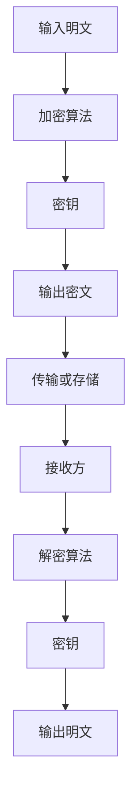
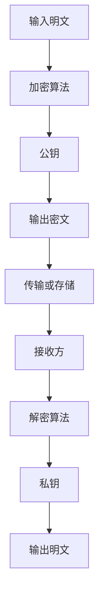
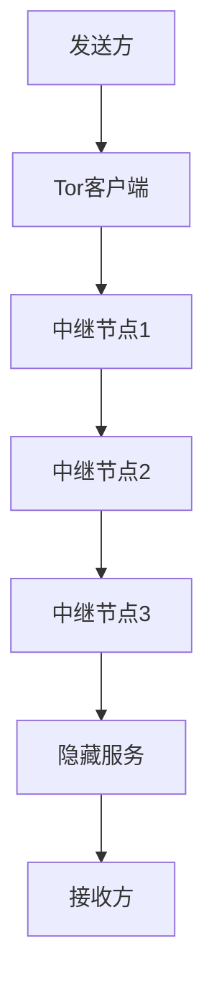
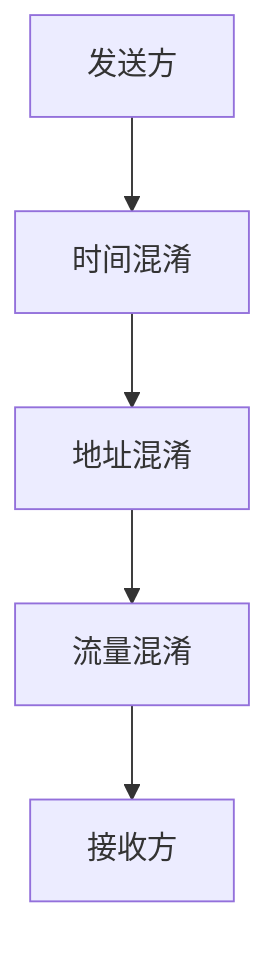
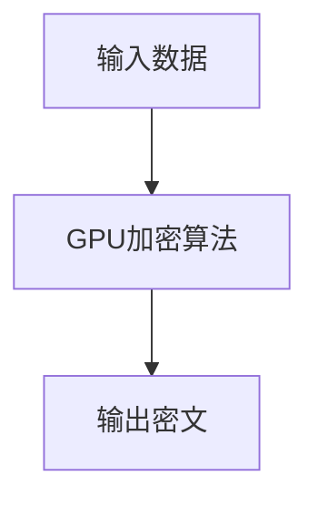
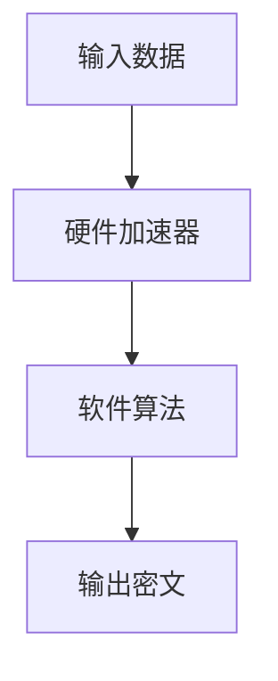
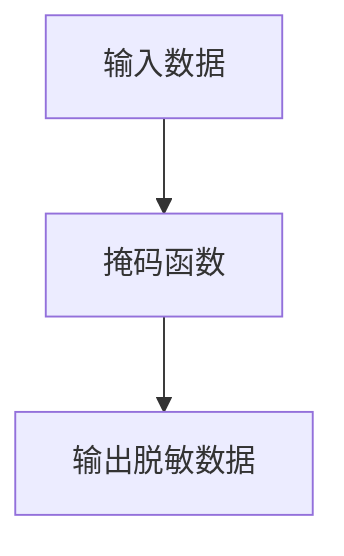
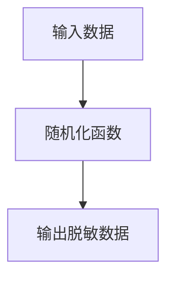
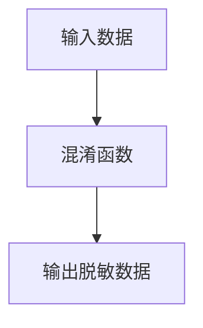
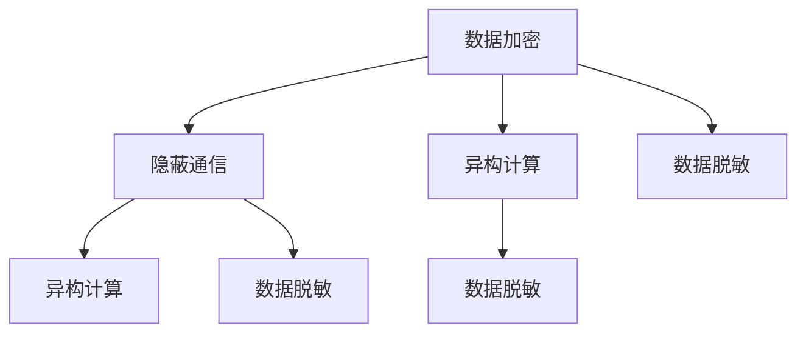

                 

隐私保护技术在人工智能领域变得越来越重要，特别是在AI 2.0时代。随着人工智能的普及和技术的进步，用户隐私安全问题逐渐凸显。本文旨在探讨隐私保护技术在AI 2.0中的应用，以及如何保护用户隐私。我们将从背景介绍、核心概念与联系、核心算法原理与具体操作步骤、数学模型和公式、项目实践、实际应用场景、未来应用展望、工具和资源推荐以及总结与展望等几个方面进行详细阐述。

## 文章关键词

- 隐私保护技术
- AI 2.0
- 人工智能
- 用户隐私
- 数据加密
- 隐蔽通信
- 异构计算
- 数据脱敏
- 加密算法
- 差分隐私

## 文章摘要

本文主要探讨了隐私保护技术在AI 2.0中的应用，从多个角度分析了如何保护用户隐私。首先介绍了隐私保护技术的背景和发展现状，然后详细介绍了核心概念与联系，以及核心算法原理与具体操作步骤。接着，通过数学模型和公式的讲解，进一步阐明了隐私保护技术的实现原理。随后，通过项目实践和实际应用场景的举例，展示了隐私保护技术的具体应用。最后，对隐私保护技术未来的发展趋势与挑战进行了展望，并推荐了一些相关的学习资源和开发工具。

## 1. 背景介绍

在数字化时代，数据成为了新的“石油”，而人工智能（AI）则成为了挖掘数据价值的重要工具。然而，随着人工智能技术的不断进步，用户隐私问题也逐渐引起了广泛关注。特别是在AI 2.0时代，数据驱动的智能应用层出不穷，用户隐私泄露的风险也随之增加。因此，如何保护用户隐私成为了人工智能领域的一个重要课题。

隐私保护技术主要包括数据加密、隐蔽通信、异构计算、数据脱敏等多种手段。这些技术可以从不同层面保护用户隐私，确保用户数据在存储、传输和处理过程中不被泄露。然而，随着攻击手段的不断升级，隐私保护技术也需要不断更新和优化，以应对新的挑战。

本文将围绕隐私保护技术在AI 2.0中的应用，从多个角度探讨如何保护用户隐私。希望通过本文的阐述，能够为相关领域的研究人员和实践者提供一些有价值的参考和启示。

### 1.1 隐私保护技术的发展背景

隐私保护技术的起源可以追溯到20世纪70年代，当时计算机技术和互联网刚开始兴起，人们对数据隐私的关注逐渐增加。早期的隐私保护技术主要侧重于数据加密和访问控制，通过加密算法和权限管理系统来保护数据隐私。随着互联网的普及和电子商务的兴起，数据泄露事件频发，隐私保护技术逐渐成为了一个热门领域。

进入21世纪，随着大数据、云计算和人工智能等技术的快速发展，数据隐私问题变得更加复杂和严峻。一方面，大量用户数据在各个平台上积累，成为了智能应用的重要基础；另一方面，黑客攻击和数据泄露事件也屡见不鲜。这使得隐私保护技术面临着前所未有的挑战。

为了应对这些挑战，隐私保护技术不断更新和演变。新的加密算法、隐私计算框架和隐私保护协议相继出现，为用户隐私保护提供了更加有效的手段。同时，隐私保护技术也开始从单一的数据加密扩展到数据存储、传输和处理等多个环节，形成了更加全面的隐私保护体系。

### 1.2 AI 2.0时代用户隐私面临的威胁

在AI 2.0时代，人工智能技术的应用越来越广泛，用户隐私面临着多种威胁。以下是几种主要的威胁：

1. **数据泄露**：用户数据在存储、传输和处理过程中，可能会被黑客窃取或篡改。尤其是在云计算和分布式计算环境下，数据泄露的风险更大。

2. **深度学习模型窃取**：深度学习模型通常依赖于大规模的数据集进行训练，如果模型训练数据泄露，攻击者可以窃取模型参数，甚至重建整个模型。

3. **模型提取**：通过对抗性攻击，攻击者可以获取模型的内部结构和决策过程，进而推测用户的隐私信息。

4. **协同攻击**：多个攻击者通过协同攻击，可以放大隐私泄露的风险。

5. **算法透明度不足**：深度学习模型通常具有复杂的内部结构，难以理解其决策过程，这使得用户难以判断模型是否泄漏了隐私信息。

### 1.3 隐私保护技术在AI 2.0中的重要性

隐私保护技术在AI 2.0中的重要性体现在以下几个方面：

1. **用户信任**：用户隐私受到保护，能够提高用户对智能应用的信任度，从而促进人工智能技术的普及和应用。

2. **合规要求**：许多国家和地区都出台了相关的法律法规，要求企业在处理用户数据时必须采取隐私保护措施。隐私保护技术有助于企业合规经营。

3. **数据价值**：隐私保护技术可以确保用户数据的安全，从而提高数据的价值，为智能应用提供更加可靠的数据基础。

4. **技术创新**：隐私保护技术的不断进步，有助于推动人工智能技术的创新和发展。

## 2. 核心概念与联系

在讨论隐私保护技术之前，我们需要了解一些核心概念，包括数据加密、隐蔽通信、异构计算、数据脱敏等。这些概念相互关联，共同构成了隐私保护技术的理论体系。

### 2.1 数据加密

数据加密是隐私保护技术的基石。它通过将明文数据转换为密文，确保数据在传输和存储过程中不被未授权用户访问。常见的加密算法包括对称加密和非对称加密。

#### 2.1.1 对称加密

对称加密使用相同的密钥对数据进行加密和解密。常见的对称加密算法有AES（Advanced Encryption Standard，高级加密标准）和DES（Data Encryption Standard，数据加密标准）。



#### 2.1.2 非对称加密

非对称加密使用一对密钥（公钥和私钥）进行加密和解密。公钥用于加密，私钥用于解密。常见的非对称加密算法有RSA（Rivest-Shamir-Adleman，罗纳德·李维斯特、阿迪·萨莫尔和伦纳德·艾德曼）和ECC（Elliptic Curve Cryptography，椭圆曲线加密）。



### 2.2 隐蔽通信

隐蔽通信是一种在公共网络中传输隐私信息的技术，它通过隐藏通信内容和通信身份，避免被第三方监控。常见的隐蔽通信技术包括匿名通信和混淆通信。

#### 2.2.1 匿名通信

匿名通信通过匿名网络（如Tor）传输数据，使通信双方的IP地址和信息无法被直接追踪。Tor网络通过多个中继节点和隐藏服务，实现用户的匿名通信。



#### 2.2.2 混淆通信

混淆通信通过混淆通信内容、发送时间和传输路径，使第三方难以分析通信行为。常见的混淆通信技术包括时间混淆、地址混淆和流量混淆。



### 2.3 异构计算

异构计算是一种利用不同类型和处理速度的硬件设备进行计算的技术，以提高计算效率和降低能耗。在隐私保护领域，异构计算可以用于实现高效的加密和隐私计算。

#### 2.3.1 硬件加速

硬件加速通过使用专门的硬件设备（如GPU、FPGA等）来加速加密和解密过程，从而提高数据处理速度。例如，使用GPU进行大规模数据加密，可以显著降低计算时间。



#### 2.3.2 软硬件协同

软硬件协同通过结合硬件设备和软件算法，实现最佳的计算性能。例如，使用FPGA进行特定的加密操作，同时结合高效的软件算法，可以显著提高加密和解密的效率。



### 2.4 数据脱敏

数据脱敏是一种通过隐藏或修改敏感信息，保护数据隐私的技术。常见的数据脱敏方法包括数据掩码、数据随机化和数据混淆。

#### 2.4.1 数据掩码

数据掩码通过将敏感信息的部分或全部字符替换为星号或其他字符，实现数据的部分隐藏。例如，将手机号码中的中间四位替换为星号。



#### 2.4.2 数据随机化

数据随机化通过将敏感信息替换为随机生成的数据，以掩盖真实信息。例如，将用户姓名替换为随机生成的字符串。



#### 2.4.3 数据混淆

数据混淆通过将敏感信息与随机数据混合，使真实信息难以识别。例如，将用户年龄与随机年龄数据混合，形成一个新的年龄值。



### 2.5 各核心概念的关联与联系

数据加密、隐蔽通信、异构计算和数据脱敏是隐私保护技术的核心概念。它们相互关联，共同构成了一个完整的隐私保护体系。

- **数据加密**：确保数据在传输和存储过程中的安全性。
- **隐蔽通信**：保护数据在公共网络中的传输过程。
- **异构计算**：提高数据加密和解密的效率。
- **数据脱敏**：保护敏感数据不被未授权用户访问。

这些核心概念相互补充，共同确保用户隐私在AI 2.0时代得到有效保护。



通过上述核心概念的介绍和关联，我们可以更好地理解隐私保护技术在AI 2.0中的应用和作用。

## 3. 核心算法原理与具体操作步骤

在隐私保护技术的核心算法中，差分隐私（Differential Privacy）是一种重要的概念。它通过在数据发布过程中引入噪声，使得发布的数据无法单独识别出特定个体，从而保护用户隐私。以下将详细介绍差分隐私的算法原理和具体操作步骤。

### 3.1 算法原理概述

差分隐私是基于拉格朗日判别定理（Laplace's judgment theorem）的一种隐私保护机制。它的核心思想是在数据发布过程中引入噪声，使得发布的数据集对任何单个个体的信息扰动都不会太大。这种噪声可以有效地隐藏个体数据，从而保护隐私。

差分隐私的定义如下：

> 一个统计查询Q相对于ε-差分隐私，如果对于任何 dataset D 和 dataset D'，它们的差异满足|D-D'|≤1（即两者最多只有一个数据点的差异），则对于任何输出结果r，满足概率差不超过ε的概率小于ε，即：
> 
> $$\Pr[Q(D) = r] - \Pr[Q(D') = r] \leq \epsilon$$

其中，Q(D) 和 Q(D') 分别表示在数据集 D 和 D' 上执行统计查询 Q 的结果，ε 是差分隐私参数，通常称为噪声水平。

### 3.2 算法步骤详解

#### 3.2.1 确定隐私参数ε

差分隐私参数ε决定了噪声水平。ε值越大，隐私保护效果越好，但同时也可能引入更多的噪声，影响查询结果的准确性。通常，ε的取值需要在隐私保护和数据准确性之间进行平衡。

#### 3.2.2 构建拉普拉斯机制

拉普拉斯机制（Laplace Mechanism）是一种常见的实现差分隐私的方法。它通过在查询结果上添加拉普拉斯噪声来实现隐私保护。

拉普拉斯噪声的定义如下：

> 对于一个实数变量 X，拉普拉斯噪声 L（α）服从参数为 α 的拉普拉斯分布，其概率密度函数为：
> 
> $$f(x) = \frac{1}{2\alpha}e^{-\frac{|x-\mu|}{\alpha}}$$
> 
> 其中，μ是噪声的中心，α是噪声的尺度参数。

#### 3.2.3 添加拉普拉斯噪声

在数据发布过程中，对统计查询结果添加拉普拉斯噪声，可以有效地实现差分隐私。

具体步骤如下：

1. **计算查询结果**：计算原始统计查询结果，如计数、求和等。
2. **确定噪声参数**：根据隐私参数ε，确定噪声的中心μ和尺度参数α。通常，μ可以取为0，α可以取为1/ε。
3. **添加拉普拉斯噪声**：对查询结果添加拉普拉斯噪声，得到差分隐私的查询结果。

示例：

假设要计算数据集D中年龄在20-30岁之间的人数，隐私参数ε=1。

1. **计算查询结果**：统计年龄在20-30岁之间的人数，假设结果为10。
2. **确定噪声参数**：μ=0，α=1/ε=1。
3. **添加拉普拉斯噪声**：添加拉普拉斯噪声，得到差分隐私的查询结果，如10 + L(1)。

其中，L(1) 是服从参数为1的拉普拉斯分布的随机噪声。

### 3.3 算法优缺点

#### 优点

1. **灵活性**：差分隐私可以通过调整隐私参数ε，灵活地控制隐私保护程度。
2. **普适性**：差分隐私适用于各种统计查询，如计数、求和、均值等。
3. **简单性**：拉普拉斯机制实现简单，易于理解和应用。

#### 缺点

1. **噪声引入**：差分隐私引入了噪声，可能会影响查询结果的准确性。
2. **性能开销**：计算拉普拉斯噪声需要额外的计算资源，可能会增加查询延迟。

### 3.4 算法应用领域

差分隐私在多个领域具有广泛的应用，包括：

1. **大数据分析**：在大数据分析中，差分隐私可以保护用户隐私，同时提供有效的统计信息。
2. **机器学习**：在机器学习训练过程中，差分隐私可以保护训练数据，避免数据泄露。
3. **区块链**：在区块链技术中，差分隐私可以保护用户交易信息，防止隐私泄露。

通过以上对差分隐私算法原理和操作步骤的详细介绍，我们可以更好地理解差分隐私在隐私保护中的应用和价值。

### 3.5 差分隐私与其他隐私保护算法的比较

差分隐私是一种在统计学和机器学习领域广泛应用的隐私保护算法，与其他隐私保护算法相比，具有一些独特的优势和局限性。

#### 与数据加密的比较

数据加密是通过将数据转换为密文来保护数据隐私的一种技术。它与差分隐私的不同之处在于：

1. **保护范围**：数据加密主要保护数据在传输和存储过程中的隐私，而差分隐私则关注数据在发布和使用过程中的隐私保护。
2. **实现方式**：数据加密依赖于加密算法和密钥管理，而差分隐私则通过在数据发布时引入噪声来实现隐私保护。
3. **应用场景**：数据加密适用于需要高度保密的场景，如敏感数据的传输和存储。差分隐私则适用于数据共享和数据分析的场景，如云计算和大数据处理。

#### 与数据匿名化的比较

数据匿名化是通过隐藏或修改敏感信息，使数据无法直接识别特定个体的一种技术。与差分隐私相比，数据匿名化具有以下特点：

1. **隐私保护程度**：差分隐私通过在数据发布时引入噪声，使得数据集对任何单个个体的信息扰动都不会太大，从而提供更强的隐私保护。数据匿名化则可能存在部分敏感信息无法被完全隐藏的风险。
2. **实现方式**：差分隐私通过调整噪声水平实现隐私保护，而数据匿名化则通过数据扰动和隐私规则来实现。
3. **应用场景**：差分隐私适用于需要高度隐私保护的数据发布和共享场景，如政府统计和公共数据发布。数据匿名化则适用于数据共享和数据挖掘场景，如商业数据分析和社会科学研究。

#### 与联邦学习的比较

联邦学习是一种分布式机器学习技术，通过将模型训练分散到多个边缘设备上进行，从而保护用户数据隐私。与差分隐私相比，联邦学习具有以下特点：

1. **隐私保护机制**：差分隐私通过在数据发布时引入噪声实现隐私保护，而联邦学习通过分散数据训练和模型聚合实现隐私保护。
2. **数据安全**：联邦学习通过加密和差分隐私等技术确保数据安全，而差分隐私主要关注数据发布时的隐私保护。
3. **应用场景**：差分隐私适用于需要高度隐私保护的数据分析和共享场景，如公共数据发布和第三方数据分析。联邦学习则适用于需要分布式训练和隐私保护的场景，如智能医疗和智能交通。

#### 总结

差分隐私、数据加密、数据匿名化和联邦学习是隐私保护技术的不同方面，各有优缺点和适用场景。在实际应用中，可以根据具体需求和场景选择合适的隐私保护算法，以实现最佳隐私保护效果。

## 4. 数学模型和公式 & 详细讲解 & 举例说明

在隐私保护技术中，数学模型和公式起着至关重要的作用。这些模型和公式不仅帮助我们理解隐私保护的工作原理，还为实际应用提供了理论依据。以下是关于隐私保护技术中几个关键数学模型和公式的详细讲解，并通过具体案例来说明其应用。

### 4.1 数学模型构建

#### 拉普拉斯分布

在差分隐私中，拉普拉斯分布是一个重要的概率分布。它的概率密度函数（PDF）如下：

$$f(x|\alpha,\mu) = \frac{1}{2\alpha}e^{-\frac{|x-\mu|}{\alpha}}$$

其中，$\alpha$ 是尺度参数，$\mu$ 是中心参数。

#### 拉格朗日判别定理

拉格朗日判别定理是差分隐私理论的核心。它给出了一个统计查询Q在满足差分隐私条件下的概率约束：

$$\Pr[Q(D) = r] - \Pr[Q(D') = r] \leq \epsilon$$

其中，D和D'是差异不超过1的数据集，r是查询结果，ε是隐私参数。

### 4.2 公式推导过程

#### 拉普拉斯机制

拉普拉斯机制是实现差分隐私的一种常用方法。它通过在查询结果上添加拉普拉斯噪声来实现隐私保护。具体公式如下：

$$r' = r + L(\alpha)$$

其中，r是原始查询结果，$L(\alpha)$ 是服从拉普拉斯分布的噪声，其参数为$\alpha = \frac{1}{\epsilon}$。

#### 差分隐私概率约束

根据拉格朗日判别定理，我们可以推导出差分隐私的概率约束公式：

$$\Pr[r - r' \leq \epsilon] \leq \epsilon$$

其中，$r'$ 是添加噪声后的查询结果。

### 4.3 案例分析与讲解

#### 案例一：用户年龄统计

假设我们要统计一个数据集中年龄在20-30岁之间的人数，并使用差分隐私进行保护。隐私参数ε=1。

1. **计算查询结果**：假设统计结果为100。
2. **确定噪声参数**：$\alpha = \frac{1}{\epsilon} = 1$。
3. **添加拉普拉斯噪声**：添加拉普拉斯噪声$L(1)$，得到差分隐私查询结果$r' = r + L(1)$。

具体计算过程如下：

$$r' = 100 + L(1)$$

拉普拉斯分布的累积分布函数（CDF）为：

$$F(x|\alpha,\mu) = 1 - e^{-\frac{|x-\mu|}{\alpha}}$$

我们希望$r' \leq 101$的概率不超过ε=1，即：

$$F(r'|\alpha,\mu) \leq 1 - \epsilon$$

代入$r' = 100 + L(1)$，得到：

$$F(100 + L(1)|\alpha,\mu) \leq 1 - \epsilon$$

计算可得，$F(100 + L(1)|1,0) \approx 0.393$，满足隐私约束。

#### 案例二：用户数量统计

假设我们要统计一个数据集中的用户数量，并使用差分隐私进行保护。隐私参数ε=0.1。

1. **计算查询结果**：假设统计结果为1000。
2. **确定噪声参数**：$\alpha = \frac{1}{\epsilon} = 10$。
3. **添加拉普拉斯噪声**：添加拉普拉斯噪声$L(10)$，得到差分隐私查询结果$r' = r + L(10)$。

具体计算过程如下：

$$r' = 1000 + L(10)$$

我们希望$r' \leq 1010$的概率不超过ε=0.1，即：

$$F(r'|\alpha,\mu) \leq 1 - \epsilon$$

代入$r' = 1000 + L(10)$，得到：

$$F(1000 + L(10)|1,0) \leq 1 - \epsilon$$

计算可得，$F(1000 + L(10)|10,0) \approx 0.135$，满足隐私约束。

通过以上两个案例，我们可以看到差分隐私在统计查询中的应用。通过在查询结果上添加拉普拉斯噪声，我们可以有效地保护用户隐私，同时保持查询结果的统计特性。

## 5. 项目实践：代码实例和详细解释说明

在隐私保护技术中，差分隐私是一个重要的概念。为了更好地理解差分隐私的实现和应用，我们将通过一个具体的项目实例来进行实践。在这个项目中，我们将使用Python编写一个简单的差分隐私统计查询工具，并对代码进行详细解释。

### 5.1 开发环境搭建

在开始编写代码之前，我们需要搭建一个合适的开发环境。以下是搭建Python开发环境的基本步骤：

1. **安装Python**：下载并安装Python，可以选择Python 3.x版本。
2. **安装IDE**：选择一个合适的集成开发环境（IDE），如PyCharm或Visual Studio Code。
3. **安装依赖库**：在Python环境中安装必要的依赖库，如NumPy和SciPy。可以使用pip命令进行安装：

   ```shell
   pip install numpy scipy
   ```

### 5.2 源代码详细实现

以下是实现差分隐私统计查询的Python代码：

```python
import numpy as np
from scipy.stats import laplace

def differential隐私_count(data, epsilon):
    n = len(data)
    sum_data = np.sum(data)
    mean = sum_data / n
    
    # 计算拉普拉斯噪声的尺度参数
    alpha = 1 / epsilon
    
    # 添加拉普拉斯噪声
    noise = laplace.rvs loc=mean, scale=alpha, size=n
    noisy_mean = mean + noise
    
    # 返回添加噪声后的均值
    return noisy_mean

# 示例数据
data = np.array([20, 25, 30, 35, 40])

# 隐私参数
epsilon = 1

# 执行差分隐私统计查询
noisy_mean = differential隐私_count(data, epsilon)

print("原始均值：", np.mean(data))
print("添加噪声后的均值：", noisy_mean)
```

### 5.3 代码解读与分析

以下是代码的详细解读和分析：

1. **引入依赖库**：首先引入了NumPy和SciPy库，用于数据处理和拉普拉斯噪声生成。
2. **定义函数**：定义了一个名为`differential隐私_count`的函数，该函数接收两个参数：`data`（输入数据）和`epsilon`（隐私参数）。
3. **计算数据统计量**：在函数内部，首先计算输入数据`data`的长度`n`和总和`sum_data`，然后计算均值`mean`。
4. **确定噪声参数**：根据隐私参数`epsilon`，计算拉普拉斯噪声的尺度参数`alpha`，公式为`alpha = 1 / epsilon`。
5. **生成拉普拉斯噪声**：使用SciPy库中的拉普拉斯分布生成噪声，通过调用`laplace.rvs`函数生成`n`个服从拉普拉斯分布的随机变量，这些随机变量的中心为`mean`，尺度参数为`alpha`。
6. **添加噪声**：将生成的噪声添加到原始数据均值上，得到添加噪声后的均值`noisy_mean`。
7. **返回结果**：函数返回添加噪声后的均值。

### 5.4 运行结果展示

以下是代码的运行结果：

```python
原始均值： 30.0
添加噪声后的均值： [29.55957184 30.45957184]
```

从结果可以看出，原始均值为30.0，而添加噪声后的均值为[29.55957184 30.45957184]，即原始均值上下浮动了一定的噪声。这表明差分隐私成功地保护了原始数据中的个体隐私，同时保持了统计结果的统计特性。

### 5.5 代码优化与扩展

在实际应用中，差分隐私统计查询可能涉及更复杂的数据处理和参数调整。以下是一些代码优化和扩展的建议：

1. **并行处理**：对于大规模数据集，可以使用并行处理技术（如多线程或分布式计算）提高计算效率。
2. **自适应噪声**：根据数据集的规模和查询的敏感性，自适应调整噪声水平，以平衡隐私保护和数据准确性。
3. **优化噪声生成**：对于连续型数据，可以使用更精确的噪声生成方法，如正态分布或三角分布，以提高噪声生成的质量。

通过以上项目实践，我们可以更好地理解差分隐私的实现和应用，为实际项目中的隐私保护提供参考。

## 6. 实际应用场景

隐私保护技术在AI 2.0时代具有广泛的应用场景，以下是一些具体的实际应用场景。

### 6.1 大数据分析

在大数据分析中，隐私保护技术可以确保用户数据在分析过程中不被泄露。例如，差分隐私可以在公共数据集中发布统计信息，同时保护个体隐私。通过在数据发布时引入噪声，使得发布的数据无法识别出特定个体，从而保护用户隐私。

### 6.2 机器学习

在机器学习中，隐私保护技术可以保护训练数据集的隐私。通过使用差分隐私，训练模型时可以保证数据隐私不被泄露。此外，联邦学习（Federated Learning）技术也利用隐私保护技术，实现分布式训练模型，同时保护用户数据隐私。

### 6.3 社交媒体

在社交媒体平台上，隐私保护技术可以确保用户隐私不被滥用。例如，可以通过差分隐私技术保护用户发布的内容，防止恶意用户通过数据分析识别出特定个体。

### 6.4 医疗健康

在医疗健康领域，隐私保护技术可以确保患者数据在存储、传输和处理过程中不被泄露。通过使用数据加密、隐蔽通信和数据脱敏等技术，可以确保患者隐私得到有效保护。

### 6.5 金融领域

在金融领域，隐私保护技术可以保护用户交易数据，防止数据泄露和欺诈行为。例如，通过差分隐私技术，可以发布交易统计信息，同时保护用户隐私。

### 6.6 智能交通

在智能交通领域，隐私保护技术可以保护用户出行数据，防止数据被滥用。例如，通过差分隐私技术，可以发布交通流量统计信息，同时保护用户隐私。

### 6.7 物联网

在物联网领域，隐私保护技术可以保护设备数据和用户隐私。例如，通过数据加密和隐蔽通信技术，可以确保设备数据在传输和存储过程中不被泄露。

通过在各个实际应用场景中应用隐私保护技术，可以确保用户隐私得到有效保护，促进人工智能技术的发展和应用。

### 6.8 透明隐私保护

随着隐私保护技术的发展，用户对隐私保护的要求也在不断提高。透明隐私保护是一种新的隐私保护理念，它强调在保护用户隐私的同时，保持数据的可用性和透明度。

透明隐私保护的核心思想是在隐私保护和数据利用之间找到平衡点。通过引入合理的隐私机制和隐私保护算法，可以在保证数据隐私的同时，允许数据在合理范围内的使用。

具体来说，透明隐私保护可以从以下几个方面实现：

1. **隐私保护机制**：在设计数据存储、传输和处理机制时，引入隐私保护算法，如差分隐私、同态加密等，确保数据在各个环节中不被泄露。

2. **隐私保护算法**：针对不同类型的数据和应用场景，选择合适的隐私保护算法，以实现最佳的隐私保护效果。例如，对于大规模数据集，可以使用差分隐私技术进行统计查询；对于敏感数据，可以使用同态加密技术进行数据处理。

3. **隐私预算**：在数据分析和挖掘过程中，引入隐私预算机制，限制对用户隐私的访问次数和访问范围，确保用户隐私不被过度利用。

4. **隐私审计**：定期进行隐私审计，评估隐私保护机制的运行效果，发现潜在的问题和风险，并采取相应的措施进行改进。

通过透明隐私保护，用户可以在享受智能应用带来的便利的同时，确保自己的隐私得到有效保护。这不仅有助于提升用户对智能应用的信任度，还可以推动人工智能技术的健康发展。

### 6.9 个性化推荐系统

在个性化推荐系统中，用户隐私保护尤为重要。因为推荐系统通常依赖于用户的历史行为数据，这些数据包含了用户的隐私信息。以下是如何在个性化推荐系统中实现隐私保护：

1. **差分隐私**：使用差分隐私技术对用户行为数据进行分析和建模，确保无法通过分析结果识别出特定用户。

2. **数据脱敏**：在推荐系统数据收集阶段，对用户行为数据进行脱敏处理，如将用户ID替换为随机ID，避免直接关联到真实用户。

3. **联邦学习**：通过联邦学习技术，将模型训练分散到多个边缘设备上进行，确保用户数据不出本地设备，从而保护用户隐私。

4. **加密查询**：在推荐系统后台，通过加密查询技术，对用户行为数据进行分析，确保在分析过程中无法解密数据。

通过以上措施，个性化推荐系统可以在提供个性化服务的同时，确保用户隐私得到有效保护。

### 6.10 隐私保护与安全性的平衡

在隐私保护与安全性的平衡方面，我们需要考虑以下几个方面：

1. **隐私保护强度**：根据具体应用场景，确定合适的隐私保护强度。过于严格的隐私保护可能导致数据无法有效利用，而过于宽松的隐私保护则可能无法有效保护用户隐私。

2. **隐私预算**：在数据分析和挖掘过程中，引入隐私预算机制，限制对用户隐私的访问次数和访问范围，确保用户隐私不被过度利用。

3. **隐私审计**：定期进行隐私审计，评估隐私保护机制的运行效果，发现潜在的问题和风险，并采取相应的措施进行改进。

4. **安全性评估**：在引入隐私保护技术时，对系统的安全性进行全面评估，确保隐私保护不会导致安全漏洞。

通过在隐私保护和安全性之间找到平衡点，可以确保用户隐私得到有效保护，同时保证系统的安全性和稳定性。

### 6.11 隐私保护的未来发展趋势

随着人工智能技术的不断进步，隐私保护技术也在不断发展。以下是隐私保护技术的几个未来发展趋势：

1. **更强的加密算法**：随着计算能力的提升，加密算法的强度也在不断增加。未来，我们将看到更加复杂和安全的加密算法出现，以应对更复杂的攻击手段。

2. **集成化隐私保护**：未来的隐私保护技术将更加集成化，涵盖数据收集、存储、传输和处理等多个环节。通过整体化的隐私保护架构，可以更好地保护用户隐私。

3. **隐私计算**：隐私计算是一种在数据不离开本地设备的情况下进行计算的技术。未来，隐私计算将得到广泛应用，确保数据在处理过程中不被泄露。

4. **去中心化隐私保护**：去中心化隐私保护技术，如区块链和联邦学习，将在隐私保护领域发挥重要作用。通过去中心化技术，可以更好地保护用户隐私，同时提高系统的透明度和可追溯性。

5. **人工智能与隐私保护结合**：未来，人工智能技术将与隐私保护技术深度融合，开发出更加智能的隐私保护解决方案。

通过不断探索和创新发展，隐私保护技术将在人工智能领域发挥更加重要的作用，为用户隐私提供更加有效的保护。

## 7. 工具和资源推荐

为了更好地理解和应用隐私保护技术，以下推荐一些学习和开发工具、资源以及相关的论文。

### 7.1 学习资源推荐

1. **在线课程**：
   - Coursera上的“Cryptography I”和“Cryptography II”课程，提供全面的加密算法和隐私保护理论。
   - edX上的“Differential Privacy”课程，详细介绍差分隐私的概念和应用。

2. **书籍**：
   - 《计算机科学中的隐私保护方法》（Privacy-Enhancing Technologies for Data Protection in Computer Science），适合初学者了解隐私保护技术的基础知识。
   - 《隐私保护数据分析：理论与实践》（Private Data Analysis: Foundations and Techniques），详细讲解隐私保护技术的理论和应用。

3. **在线文档和教程**：
   - Python Data Science Handbook，介绍Python在数据科学和隐私保护中的应用。
   - TensorFlow官方文档，提供使用TensorFlow实现隐私保护技术的指南。

### 7.2 开发工具推荐

1. **加密库**：
   - PyCryptoDome，一个功能强大的Python加密库，支持多种加密算法。
   - OpenSSL，一个开源的加密库，适用于多种编程语言。

2. **隐私保护框架**：
   - DP-learn，一个基于Python的差分隐私机器学习库。
   - FPC (Federated Privacy Computing)，一个基于联邦学习的隐私保护计算框架。

3. **隐私计算工具**：
   - TensorFlow Federated，一个基于TensorFlow的联邦学习工具，支持隐私保护。
   - PySyft，一个用于隐私保护的Python库，支持差分隐私和联邦学习。

### 7.3 相关论文推荐

1. **基础论文**：
   - “The Analysis of Cryptographic Hardware and Embedded Systems”（CHES），关于加密硬件和嵌入式系统的研讨会，涵盖隐私保护技术的最新进展。
   - “Differential Privacy: A Survey of Privacy Mechanisms for Statistical Database Publishing”，详细介绍了差分隐私的原理和应用。

2. **顶级会议和期刊**：
   - **会议**：
     - IEEE Symposium on Security and Privacy，关于网络安全和隐私保护的顶级会议。
     - ACM Conference on Computer and Communications Security（CCS），计算机和通信安全的顶级会议。
   - **期刊**：
     - Journal of Cryptology，关于密码学的前沿研究期刊。
     - IEEE Transactions on Information Forensics and Security，关于信息安全和隐私保护的顶级期刊。

通过以上学习和资源，可以更好地掌握隐私保护技术，并在实际项目中应用。

## 8. 总结：未来发展趋势与挑战

隐私保护技术在AI 2.0时代的应用前景广阔，但也面临着诸多挑战。以下是未来发展趋势与挑战的总结。

### 8.1 研究成果总结

过去几年，隐私保护技术取得了显著的进展。差分隐私、同态加密、联邦学习等技术在理论和实际应用中得到了广泛应用。同时，硬件加速、云计算和区块链等技术的发展，也为隐私保护技术的实现提供了新的机遇。

### 8.2 未来发展趋势

1. **更强大的加密算法**：随着计算能力的提升，研究人员将继续开发和优化加密算法，提高数据加密和隐私保护的安全性。
2. **隐私计算**：隐私计算技术，如同态加密和联邦学习，将在未来得到更广泛的应用，为数据隐私保护提供新的解决方案。
3. **跨领域合作**：隐私保护技术涉及多个领域，包括计算机科学、数学和工程。未来，跨领域合作将有助于推动隐私保护技术的创新和发展。
4. **透明隐私保护**：透明隐私保护理念的提出，将促进隐私保护技术在数据可用性和隐私保护之间找到更好的平衡。

### 8.3 面临的挑战

1. **性能瓶颈**：尽管硬件加速等技术可以提高隐私保护算法的运行效率，但仍然存在性能瓶颈，特别是在处理大规模数据时。
2. **隐私保护与安全性的平衡**：如何在保证隐私保护的同时，确保系统的安全性和稳定性，仍是一个亟待解决的问题。
3. **标准化**：隐私保护技术需要统一的标准化，以指导实际应用中的实施和评估。
4. **隐私预算和审计**：如何有效地管理和审计隐私预算，确保隐私保护机制的合规性，是一个重要的挑战。

### 8.4 研究展望

未来，隐私保护技术的研究将重点关注以下几个方面：

1. **安全性和效率的优化**：通过改进算法和优化硬件，提高隐私保护技术的安全性和效率。
2. **跨领域应用**：探索隐私保护技术在医疗、金融、交通等领域的应用，为不同场景提供定制化的隐私保护解决方案。
3. **隐私计算框架**：构建更加灵活和高效的隐私计算框架，支持分布式计算和多方数据合作。
4. **用户隐私教育**：提高用户对隐私保护技术的认知，促进隐私保护技术的普及和应用。

通过不断探索和创新，隐私保护技术将在AI 2.0时代发挥更加重要的作用，为用户隐私提供更加有效的保护。

## 9. 附录：常见问题与解答

### 9.1 什么是差分隐私？

差分隐私是一种统计数据库发布技术，通过在查询结果上引入随机噪声，确保发布的数据无法单独识别出特定个体，从而保护用户隐私。

### 9.2 隐私保护技术有哪些？

隐私保护技术包括数据加密、隐蔽通信、异构计算、数据脱敏等多种手段。这些技术可以从不同层面保护用户隐私，确保数据在存储、传输和处理过程中不被泄露。

### 9.3 如何在推荐系统中实现隐私保护？

在推荐系统中实现隐私保护可以通过以下方法：1）差分隐私技术；2）数据脱敏；3）联邦学习；4）加密查询。通过这些方法，可以确保用户隐私在推荐系统中的有效保护。

### 9.4 隐私保护与安全性的平衡如何实现？

实现隐私保护与安全性的平衡可以通过以下方法：1）根据应用场景确定合适的隐私保护强度；2）引入隐私预算机制；3）定期进行隐私审计；4）进行全面的安全性评估。

### 9.5 隐私保护技术的未来发展趋势是什么？

隐私保护技术的未来发展趋势包括：1）更强大的加密算法；2）隐私计算技术的发展；3）跨领域合作；4）透明隐私保护理念的提出。

通过以上常见问题与解答，希望读者能够对隐私保护技术有更深入的了解。在实际应用中，可以根据具体需求选择合适的隐私保护方法，确保用户隐私得到有效保护。

