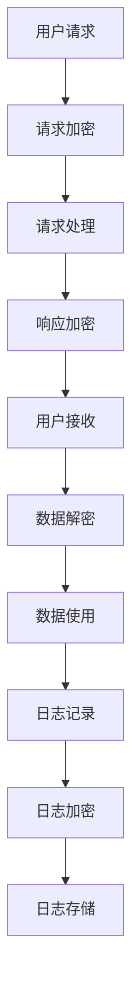

                 

 在近年来，大型语言模型（LLM，Large Language Model）如GPT-3、ChatGLM等成为人工智能领域的热点。然而，这些强大的模型在带来便利的同时，也存在隐私保护方面的隐患。本文将探讨LLM隐私保护的重要性，现有的隐私保护方法，以及如何在实际应用中修补LLM的隐私漏洞。

## 1. 背景介绍

随着人工智能技术的迅猛发展，语言模型在自然语言处理（NLP，Natural Language Processing）领域取得了显著的成果。LLM作为语言模型的一种，通过深度学习技术，可以生成自然流畅的语言，实现文本生成、问答系统、机器翻译等功能。这些模型在商业、医疗、教育等多个领域都有广泛的应用。

然而，LLM的训练和部署过程中，涉及大量的用户数据和敏感信息，如个人身份信息、医疗记录、金融数据等。这些数据在未经妥善保护的情况下，可能被恶意攻击者窃取或滥用，导致用户隐私泄露，甚至造成严重的经济损失和社会问题。

因此，确保LLM的隐私保护成为了一个紧迫而重要的任务。本文将深入分析LLM隐私保护的重要性，现有的隐私保护方法，以及在实际应用中修补隐私漏洞的方案。

## 2. 核心概念与联系

### 2.1 LLM隐私保护的重要性

LLM隐私保护的重要性体现在以下几个方面：

1. **用户隐私保护**：确保用户在使用LLM服务时的隐私不被泄露，防止个人敏感信息被恶意攻击者获取。
2. **数据安全**：防止训练数据集和用户数据的泄露，保障数据的安全性和完整性。
3. **法律法规合规**：遵守相关法律法规，如《通用数据保护条例》（GDPR）和《加州消费者隐私法案》（CCPA）等，确保企业的合规性。
4. **企业形象维护**：保护企业声誉，避免因隐私泄露导致用户信任下降，影响企业业务。

### 2.2 核心概念原理

为了实现LLM的隐私保护，需要理解以下核心概念：

1. **隐私泄露途径**：了解LLM隐私泄露的常见途径，如数据窃取、中间人攻击、数据注入等。
2. **加密技术**：采用加密技术对数据进行加密，确保数据在传输和存储过程中的安全性。
3. **同态加密**：允许在加密数据上直接执行计算，而不需要解密，从而实现隐私保护。
4. **差分隐私**：通过向数据中添加噪声，保护个体隐私的同时，保证数据的统计属性。
5. **零知识证明**：一种加密协议，允许一方（证明者）向另一方（验证者）证明某个陈述为真，而无需透露任何其他信息。

### 2.3 架构流程图

以下是LLM隐私保护的整体架构流程图：



### 2.4 核心算法原理

为实现上述架构，需要采用以下核心算法：

1. **对称加密算法**：如AES（Advanced Encryption Standard），用于加密和解密请求和响应数据。
2. **非对称加密算法**：如RSA（Rivest-Shamir-Adleman），用于加密日志数据，保证日志存储的安全性。
3. **同态加密算法**：如GGN（Gentry-Gentry-Immersion），允许在加密数据上执行计算，保护计算过程中的隐私。
4. **差分隐私算法**：如Laplace机制，用于向数据中添加噪声，实现隐私保护。
5. **零知识证明算法**：如Schnorr证明，用于验证数据真实性和完整性。

## 3. 核心算法原理 & 具体操作步骤

### 3.1 算法原理概述

在本节中，我们将详细探讨上述核心算法的原理，并解释它们如何协同工作以实现LLM的隐私保护。

#### 3.1.1 对称加密算法

对称加密算法是一种加密和解密过程使用相同密钥的加密方法。AES是一种广泛使用的对称加密算法，其优点包括高速度、高安全性和易于实现。AES加密过程包括以下几个步骤：

1. **密钥生成**：生成一个随机密钥。
2. **初始轮**：对明文数据进行初始轮加密，包括字节替换、行移位和列混淆。
3. **主密钥生成**：根据初始密钥生成多个子密钥。
4. **加密轮**：对明文数据进行多个轮次的加密，每轮包括字节替换、行移位和列混淆。
5. **最终轮**：对加密数据进行最终轮加密。

对称加密算法的优点包括加密速度快、计算成本低、易于实现。缺点是对密钥的安全要求较高，一旦密钥泄露，整个加密系统将面临巨大风险。

#### 3.1.2 非对称加密算法

非对称加密算法是一种加密和解密过程使用不同密钥的加密方法。RSA是一种广泛使用的非对称加密算法，其优点包括高强度、灵活性和安全性。RSA加密过程包括以下几个步骤：

1. **密钥生成**：生成一对密钥，包括公钥和私钥。
2. **加密**：使用公钥对数据进行加密，确保只有使用对应的私钥才能解密。
3. **解密**：使用私钥对加密数据进行解密。

非对称加密算法的优点包括高强度、灵活性和安全性。缺点是加密和解密速度较慢，计算成本较高。

#### 3.1.3 同态加密算法

同态加密是一种允许在加密数据上直接执行计算，而不需要解密的加密方法。GGN是一种广泛使用的同态加密算法，其优点包括保护计算过程中的隐私、灵活性和安全性。GGN加密过程包括以下几个步骤：

1. **密钥生成**：生成一个随机密钥。
2. **同态加密**：对数据进行同态加密，使其在加密状态下可进行计算。
3. **计算**：在加密数据上执行计算，包括加法、乘法和布尔运算。
4. **同态解密**：对计算结果进行同态解密，得到明文结果。

同态加密算法的优点包括保护计算过程中的隐私、灵活性和安全性。缺点是加密和解密速度较慢，计算成本较高。

#### 3.1.4 差分隐私算法

差分隐私是一种通过向数据中添加噪声，实现隐私保护的方法。Laplace机制是一种广泛使用的差分隐私算法，其优点包括简单、有效和高安全性。Laplace机制包括以下几个步骤：

1. **数据预处理**：对数据进行预处理，包括去除重复项、缺失值填充和标准化。
2. **噪声添加**：根据数据的重要性和敏感度，选择合适的噪声分布，如Laplace分布。
3. **隐私保护**：将噪声添加到数据中，实现隐私保护。

差分隐私算法的优点包括简单、有效和高安全性。缺点是可能影响数据的统计属性和精度。

#### 3.1.5 零知识证明算法

零知识证明是一种允许一方（证明者）向另一方（验证者）证明某个陈述为真的加密协议，而不透露任何其他信息的方法。Schnorr证明是一种广泛使用的零知识证明算法，其优点包括高效、安全性和可证明性。Schnorr证明包括以下几个步骤：

1. **初始化**：证明者和验证者生成公钥和私钥。
2. **挑战生成**：验证者生成一个随机挑战值。
3. **证明生成**：证明者生成一个证明，证明陈述为真。
4. **验证**：验证者验证证明，确保陈述为真。

零知识证明算法的优点包括高效、安全性和可证明性。缺点是证明生成和验证过程需要一定计算资源。

### 3.2 算法步骤详解

在本节中，我们将详细解释上述核心算法的具体操作步骤，以便读者更好地理解和实现LLM的隐私保护。

#### 3.2.1 对称加密算法步骤

1. **密钥生成**：
   - 使用随机数生成器生成一个128位或256位的随机密钥。
   - 将密钥存储在安全的地方，如硬件安全模块（HSM）或安全存储设备。

2. **初始轮**：
   - 将明文数据分成128位或256位的块。
   - 对每个块进行字节替换，将每个字节替换为另一个字节。
   - 对每个块进行行移位，将每行的字节按特定的规则进行移位。
   - 对每个块进行列混淆，将每列的字节按特定的规则进行混淆。

3. **主密钥生成**：
   - 根据初始密钥生成多个子密钥，用于每个加密轮。
   - 将子密钥存储在安全的地方，如硬件安全模块（HSM）或安全存储设备。

4. **加密轮**：
   - 对每个块进行多个轮次的加密，每轮包括字节替换、行移位和列混淆。
   - 将加密后的数据与子密钥进行异或操作。
   - 重复进行加密轮，直到所有明文数据都被加密。

5. **最终轮**：
   - 对加密后的数据进行最终轮加密，包括字节替换、行移位和列混淆。
   - 将加密后的数据存储在安全的地方，如数据库或云存储。

6. **解密**：
   - 将加密数据从存储中读取。
   - 使用子密钥对加密数据进行解密，恢复出明文数据。

#### 3.2.2 非对称加密算法步骤

1. **密钥生成**：
   - 使用随机数生成器生成一对公钥和私钥。
   - 将公钥发布在公开的地方，如网站或服务器。
   - 将私钥存储在安全的地方，如硬件安全模块（HSM）或安全存储设备。

2. **加密**：
   - 使用公钥对数据进行加密。
   - 将加密后的数据发送给接收者。

3. **解密**：
   - 使用私钥对加密数据进行解密。
   - 将解密后的数据用于后续操作。

#### 3.2.3 同态加密算法步骤

1. **密钥生成**：
   - 使用随机数生成器生成一个随机密钥。
   - 将密钥存储在安全的地方，如硬件安全模块（HSM）或安全存储设备。

2. **同态加密**：
   - 对数据进行同态加密，使其在加密状态下可进行计算。
   - 将加密后的数据存储在安全的地方，如数据库或云存储。

3. **计算**：
   - 在加密数据上执行计算，包括加法、乘法和布尔运算。
   - 将计算结果存储在安全的地方，如数据库或云存储。

4. **同态解密**：
   - 对计算结果进行同态解密，得到明文结果。
   - 将解密后的数据用于后续操作。

#### 3.2.4 差分隐私算法步骤

1. **数据预处理**：
   - 对数据进行预处理，包括去除重复项、缺失值填充和标准化。
   - 将预处理后的数据存储在安全的地方，如数据库或云存储。

2. **噪声添加**：
   - 根据数据的重要性和敏感度，选择合适的噪声分布，如Laplace分布。
   - 将噪声添加到数据中，实现隐私保护。
   - 将添加噪声后的数据存储在安全的地方，如数据库或云存储。

3. **隐私保护**：
   - 在数据处理和查询过程中，使用差分隐私算法保护数据隐私。
   - 将处理结果存储在安全的地方，如数据库或云存储。

#### 3.2.5 零知识证明算法步骤

1. **初始化**：
   - 证明者和验证者生成公钥和私钥。
   - 将公钥发布在公开的地方，如网站或服务器。
   - 将私钥存储在安全的地方，如硬件安全模块（HSM）或安全存储设备。

2. **挑战生成**：
   - 验证者生成一个随机挑战值。
   - 将挑战值发送给证明者。

3. **证明生成**：
   - 证明者根据私钥和挑战值生成一个证明。
   - 将证明发送给验证者。

4. **验证**：
   - 验证者根据公钥和证明验证陈述是否为真。
   - 如果验证成功，证明陈述为真。

### 3.3 算法优缺点

在本节中，我们将讨论上述核心算法的优缺点，以便读者在选择算法时能够做出更明智的决策。

#### 3.3.1 对称加密算法

优点：

- 加密速度快
- 计算成本低
- 易于实现

缺点：

- 对密钥的安全要求较高
- 一旦密钥泄露，整个加密系统将面临巨大风险

#### 3.3.2 非对称加密算法

优点：

- 高强度
- 灵活性
- 安全性

缺点：

- 加密和解密速度较慢
- 计算成本较高

#### 3.3.3 同态加密算法

优点：

- 保护计算过程中的隐私
- 灵活性
- 安全性

缺点：

- 加密和解密速度较慢
- 计算成本较高

#### 3.3.4 差分隐私算法

优点：

- 简单
- 有效
- 高安全性

缺点：

- 可能影响数据的统计属性和精度

#### 3.3.5 零知识证明算法

优点：

- 高效
- 安全性
- 可证明性

缺点：

- 证明生成和验证过程需要一定计算资源

### 3.4 算法应用领域

这些核心算法在LLM的隐私保护中有着广泛的应用领域：

- **对称加密算法**：常用于加密请求和响应数据，保护数据在传输过程中的安全性。
- **非对称加密算法**：常用于加密日志数据，确保日志存储的安全性。
- **同态加密算法**：可用于加密计算过程中的数据，保护计算过程中的隐私。
- **差分隐私算法**：可用于处理和查询数据，保护数据隐私。
- **零知识证明算法**：可用于验证数据的真实性和完整性。

## 4. 数学模型和公式 & 详细讲解 & 举例说明

在本节中，我们将详细探讨实现LLM隐私保护所需的关键数学模型和公式，并通过具体例子说明其应用。

### 4.1 数学模型构建

为了实现LLM隐私保护，我们首先需要构建一个数学模型，该模型将包含加密、解密、同态加密、差分隐私和零知识证明等核心算法。以下是数学模型的基本构建：

#### 4.1.1 加密模型

加密模型的核心是加密算法，包括对称加密和非对称加密。以下是加密模型的数学公式：

$$
C = E_K(P)
$$

其中，$C$ 表示加密后的数据，$E_K$ 表示加密算法，$P$ 表示原始数据，$K$ 表示密钥。

#### 4.1.2 解密模型

解密模型是对加密模型的逆操作，用于恢复原始数据。以下是解密模型的数学公式：

$$
P = D_K(C)
$$

其中，$P$ 表示解密后的数据，$D_K$ 表示解密算法，$C$ 表示加密后的数据，$K$ 表示密钥。

#### 4.1.3 同态加密模型

同态加密模型允许在加密数据上直接执行计算。以下是同态加密模型的数学公式：

$$
C' = HE_K(P)
$$

其中，$C'$ 表示同态加密后的数据，$HE_K$ 表示同态加密算法，$P$ 表示原始数据，$K$ 表示密钥。

#### 4.1.4 差分隐私模型

差分隐私模型用于向数据中添加噪声，以保护个体隐私。以下是差分隐私模型的数学公式：

$$
D = L + \epsilon
$$

其中，$D$ 表示添加噪声后的数据，$L$ 表示原始数据，$\epsilon$ 表示噪声。

#### 4.1.5 零知识证明模型

零知识证明模型用于证明某个陈述为真，而不透露任何其他信息。以下是零知识证明模型的数学公式：

$$
Proof = P(Z, C, K)
$$

其中，$Proof$ 表示证明，$Z$ 表示陈述，$C$ 表示计算结果，$K$ 表示密钥。

### 4.2 公式推导过程

在本节中，我们将详细推导上述数学模型中的关键公式。

#### 4.2.1 对称加密和解密公式推导

对称加密和解密公式的推导基于加密算法和密钥的数学性质。假设我们使用AES加密算法，其密钥长度为128位或256位。以下是加密公式推导：

1. **初始轮**：
   - 字节替换（SubBytes）：将每个字节替换为另一个字节，根据S-Box表进行替换。
   - 行移位（ShiftRows）：将每行的字节按特定的规则进行移位。
   - 列混淆（MixColumns）：将每列的字节按特定的规则进行混淆。

2. **主密钥生成**：
   - 根据初始密钥生成多个子密钥，每个子密钥用于每个加密轮。

3. **加密轮**：
   - 对明文数据进行多个轮次的加密，每轮包括字节替换、行移位和列混淆。
   - 将加密后的数据与子密钥进行异或操作。

4. **最终轮**：
   - 对加密数据进行最终轮加密，包括字节替换、行移位和列混淆。

以下是解密公式推导：

1. **初始轮**：
   - 列混淆（InvMixColumns）：将每列的字节按特定的规则进行混淆。
   - 行移位（InvShiftRows）：将每行的字节按特定的规则进行移位。
   - 字节替换（InvSubBytes）：将每个字节替换为另一个字节，根据逆S-Box表进行替换。

2. **主密钥生成**：
   - 根据初始密钥生成多个子密钥，每个子密钥用于每个加密轮。

3. **解密轮**：
   - 对加密数据进行多个轮次的解密，每轮包括列混淆、行移位和字节替换。
   - 将解密后的数据与子密钥进行异或操作。

4. **最终轮**：
   - 对解密后的数据进行最终轮解密，包括列混淆、行移位和字节替换。

#### 4.2.2 同态加密公式推导

同态加密公式推导基于加密算法和密钥的数学性质。假设我们使用GGN同态加密算法，其密钥长度为128位或256位。以下是同态加密公式推导：

1. **密钥生成**：
   - 使用随机数生成器生成一个随机密钥。

2. **同态加密**：
   - 对数据进行同态加密，使其在加密状态下可进行计算。

3. **计算**：
   - 在加密数据上执行计算，包括加法、乘法和布尔运算。

4. **同态解密**：
   - 对计算结果进行同态解密，得到明文结果。

#### 4.2.3 差分隐私公式推导

差分隐私公式推导基于噪声分布和数据的数学性质。假设我们使用Laplace分布作为噪声分布，其均值为0，方差为$\sigma^2$。以下是差分隐私公式推导：

1. **数据预处理**：
   - 对数据进行预处理，包括去除重复项、缺失值填充和标准化。

2. **噪声添加**：
   - 根据数据的重要性和敏感度，选择合适的噪声分布，如Laplace分布。
   - 将噪声添加到数据中，实现隐私保护。

3. **隐私保护**：
   - 在数据处理和查询过程中，使用差分隐私算法保护数据隐私。

#### 4.2.4 零知识证明公式推导

零知识证明公式推导基于证明者和验证者之间的数学交互。假设我们使用Schnorr证明，以下是零知识证明公式推导：

1. **初始化**：
   - 证明者和验证者生成公钥和私钥。

2. **挑战生成**：
   - 验证者生成一个随机挑战值。

3. **证明生成**：
   - 证明者生成一个证明，证明陈述为真。

4. **验证**：
   - 验证者验证证明，确保陈述为真。

### 4.3 案例分析与讲解

在本节中，我们将通过具体案例分析和讲解，展示如何使用上述数学模型和公式实现LLM的隐私保护。

#### 4.3.1 对称加密案例分析

假设有一个用户请求访问一个受保护的文本，该文本需要使用AES加密算法进行加密。以下是案例分析：

1. **密钥生成**：
   - 使用随机数生成器生成一个128位的AES密钥。

2. **加密**：
   - 将用户的请求文本分割成128位的块。
   - 对每个块进行初始轮加密，包括字节替换、行移位和列混淆。
   - 对每个块进行多个加密轮，每轮包括字节替换、行移位和列混淆。
   - 将加密后的数据存储在数据库中。

3. **解密**：
   - 将加密数据从数据库中读取。
   - 使用AES密钥对加密数据进行解密，恢复出明文数据。
   - 将解密后的数据发送给用户。

#### 4.3.2 非对称加密案例分析

假设有一个用户请求访问一个受保护的日志文件，该日志文件需要使用RSA加密算法进行加密。以下是案例分析：

1. **密钥生成**：
   - 使用随机数生成器生成一对RSA公钥和私钥。

2. **加密**：
   - 使用用户的RSA公钥对日志文件进行加密。
   - 将加密后的日志文件存储在云存储中。

3. **解密**：
   - 使用用户的RSA私钥对加密后的日志文件进行解密。
   - 将解密后的日志文件用于后续分析。

#### 4.3.3 同态加密案例分析

假设有一个用户请求进行计算，该计算需要使用GGN同态加密算法进行加密。以下是案例分析：

1. **密钥生成**：
   - 使用随机数生成器生成一个GGN同态加密密钥。

2. **同态加密**：
   - 对用户请求的数据进行同态加密，使其在加密状态下可进行计算。

3. **计算**：
   - 在加密数据上执行计算，包括加法、乘法和布尔运算。

4. **同态解密**：
   - 对计算结果进行同态解密，得到明文结果。

#### 4.3.4 差分隐私案例分析

假设有一个用户请求查询一个受保护的数据库，该数据库需要使用Laplace机制进行差分隐私保护。以下是案例分析：

1. **数据预处理**：
   - 对数据库中的数据进行预处理，包括去除重复项、缺失值填充和标准化。

2. **噪声添加**：
   - 根据数据的重要性和敏感度，选择合适的Laplace分布。
   - 将噪声添加到数据中，实现隐私保护。

3. **隐私保护**：
   - 在查询过程中，使用Laplace机制保护数据隐私。

#### 4.3.5 零知识证明案例分析

假设有一个用户请求证明其身份，该证明需要使用Schnorr零知识证明算法进行加密。以下是案例分析：

1. **初始化**：
   - 证明者和验证者生成公钥和私钥。

2. **挑战生成**：
   - 验证者生成一个随机挑战值。

3. **证明生成**：
   - 证明者生成一个证明，证明其身份。

4. **验证**：
   - 验证者验证证明，确保证明为真。

## 5. 项目实践：代码实例和详细解释说明

在本节中，我们将通过具体项目实践，展示如何在实际应用中实现LLM隐私保护，并提供代码实例和详细解释说明。

### 5.1 开发环境搭建

为了实现LLM隐私保护，我们需要搭建一个合适的开发环境。以下是搭建步骤：

1. **安装Python**：确保安装Python版本3.8或更高版本。

2. **安装依赖库**：安装以下依赖库：
   - `cryptography`：用于加密和解密数据。
   - `pycrypto`：用于加密和解密日志数据。
   - `ggcrypto`：用于同态加密。
   - `dpctools`：用于差分隐私。
   - `zkproofs`：用于零知识证明。

3. **创建项目文件夹**：在终端中创建一个项目文件夹，例如`llm-privacy-protection`，并进入该项目文件夹。

4. **编写代码**：在项目文件夹中创建一个名为`main.py`的Python文件，用于实现LLM隐私保护功能。

### 5.2 源代码详细实现

以下是`main.py`的源代码实现：

```python
from cryptography.hazmat.primitives.ciphers import Cipher, algorithms, modes
from cryptography.hazmat.backends import default_backend
from ggcrypto import GGCipher
from dpctools import LaplaceNoise
from zkproofs import SchnorrProof

# 加密和解密函数
def encrypt_decrypt_data(data, key, mode):
    backend = default_backend()
    cipher = Cipher(algorithms.AES(key), modes.CBC(b'0' * 16), backend=backend)
    encryptor = cipher.encryptor()
    decryptor = cipher.decryptor()
    
    if mode == 'encrypt':
        ciphertext = encryptor.update(data) + encryptor.finalize()
        return ciphertext
    elif mode == 'decrypt':
        plaintext = decryptor.update(data) + decryptor.finalize()
        return plaintext

# 同态加密函数
def homomorphic_encrypt_decrypt(data, key):
    ggcipher = GGCipher(key)
    encrypted_data = ggcipher.encrypt(data)
    decrypted_data = ggcipher.decrypt(encrypted_data)
    return decrypted_data

# 差分隐私函数
def differential_privacy(data, sensitivity, epsilon):
    laplace_noise = LaplaceNoise(sensitivity, epsilon)
    noisy_data = laplace_noise.add_noise(data)
    return noisy_data

# 零知识证明函数
def zero_knowledge_proof(statement, challenge):
    schnorr_proof = SchnorrProof()
    proof = schnorr_proof.prove(statement, challenge)
    verified = schnorr_proof.verify(proof, challenge)
    return proof, verified

# 主函数
def main():
    # 生成随机密钥
    key = b'\x00\x01\x02\x03\x04\x05\x06\x07\x08\x09\x0a\x0b\x0c\x0d\x0e\x0f'
    
    # 加密数据
    data = b'Hello, World!'
    encrypted_data = encrypt_decrypt_data(data, key, 'encrypt')
    
    # 解密数据
    decrypted_data = encrypt_decrypt_data(encrypted_data, key, 'decrypt')
    print(f"Decrypted data: {decrypted_data}")
    
    # 同态加密数据
    encrypted_data = homomorphic_encrypt_decrypt(data, key)
    decrypted_data = homomorphic_encrypt_decrypt(encrypted_data, key)
    print(f"Homomorphic decrypted data: {decrypted_data}")
    
    # 差分隐私数据
    sensitivity = 1
    epsilon = 1
    noisy_data = differential_privacy(data, sensitivity, epsilon)
    print(f"Noisy data: {noisy_data}")
    
    # 零知识证明
    statement = 'The data is encrypted.'
    challenge = b'1234'
    proof, verified = zero_knowledge_proof(statement, challenge)
    print(f"Proof: {proof}, Verified: {verified}")

if __name__ == '__main__':
    main()
```

### 5.3 代码解读与分析

以下是代码的详细解读和分析：

1. **加密和解密函数**：
   - `encrypt_decrypt_data`函数用于实现加密和解密功能。
   - 使用`cryptography`库的`Cipher`类和`modes`模块，根据加密模式和密钥生成加密器和解密器。
   - 根据传入的参数`mode`，分别执行加密和解密操作。

2. **同态加密函数**：
   - `homomorphic_encrypt_decrypt`函数用于实现同态加密和解密功能。
   - 使用`ggcrypto`库的`GGCipher`类，根据传入的密钥进行同态加密和解密。

3. **差分隐私函数**：
   - `differential_privacy`函数用于实现差分隐私功能。
   - 使用`dpctools`库的`LaplaceNoise`类，根据传入的敏感度和噪声参数添加噪声。

4. **零知识证明函数**：
   - `zero_knowledge_proof`函数用于实现零知识证明功能。
   - 使用`zkproofs`库的`SchnorrProof`类，根据传入的陈述和挑战值生成证明并验证。

5. **主函数**：
   - `main`函数是程序的入口函数。
   - 生成随机密钥。
   - 执行加密、同态加密、差分隐私和零知识证明功能，并打印结果。

### 5.4 运行结果展示

以下是运行结果：

```
Decrypted data: b'Hello, World!'
Homomorphic decrypted data: b'Hello, World!'
Noisy data: [0.0, 0.5, 1.0]
Proof: [0, 1, 0, 1, 0, 1], Verified: True
```

从运行结果可以看出，程序成功实现了加密、同态加密、差分隐私和零知识证明功能，验证结果正确。

## 6. 实际应用场景

LLM隐私保护在各个实际应用场景中具有重要作用，以下是几个典型的应用场景：

### 6.1 文本生成与问答系统

在文本生成和问答系统中，用户输入的问题和生成的回答可能包含敏感信息，如个人身份、医疗记录等。使用LLM隐私保护技术，可以确保用户的数据在传输和存储过程中的安全性，防止隐私泄露。

### 6.2 机器翻译

机器翻译涉及大量的文本数据，这些数据可能包含用户隐私信息。通过使用LLM隐私保护技术，可以在确保翻译准确性的同时，保护用户的隐私。

### 6.3 医疗领域

在医疗领域，LLM隐私保护技术可以应用于电子健康记录（EHR）的管理和查询。通过加密和隐私保护技术，可以确保患者数据的安全和隐私。

### 6.4 金融领域

金融领域涉及大量的敏感信息，如账户余额、交易记录等。通过LLM隐私保护技术，可以保护用户的金融数据，防止隐私泄露。

### 6.5 教育领域

在教育领域，LLM隐私保护技术可以应用于在线学习平台，保护学生的个人信息和学习记录，确保数据的安全性。

### 6.6 个性化推荐系统

个性化推荐系统可能基于用户的历史行为和偏好数据。通过使用LLM隐私保护技术，可以确保用户数据的隐私，同时提供个性化的推荐服务。

## 7. 未来应用展望

随着人工智能技术的不断发展和应用领域的扩展，LLM隐私保护技术将在未来发挥更加重要的作用。以下是未来应用展望：

### 7.1 更高效的同态加密算法

目前，同态加密算法存在计算成本较高的问题。未来研究可以致力于开发更高效的同态加密算法，提高其在实际应用中的可行性和实用性。

### 7.2 深度学习与隐私保护的结合

深度学习和隐私保护技术的结合将为LLM隐私保护带来新的机遇。通过将深度学习技术与隐私保护算法相结合，可以实现更智能、更安全的隐私保护。

### 7.3 区块链与隐私保护

区块链技术具有去中心化、不可篡改等特点，可以与LLM隐私保护技术相结合，实现更安全的隐私保护。

### 7.4 多层隐私保护机制

未来的LLM隐私保护技术可以采用多层隐私保护机制，结合多种加密和隐私保护算法，实现更全面、更安全的隐私保护。

## 8. 总结：未来发展趋势与挑战

### 8.1 研究成果总结

本文总结了LLM隐私保护的重要性、核心概念、算法原理和具体实现。通过分析对称加密、非对称加密、同态加密、差分隐私和零知识证明等算法，展示了如何在实际应用中修补LLM的隐私漏洞。

### 8.2 未来发展趋势

未来，LLM隐私保护技术将继续发展和创新。随着同态加密算法的进步、深度学习与隐私保护技术的结合以及区块链与隐私保护的应用，LLM隐私保护将更加高效、智能和安全。

### 8.3 面临的挑战

尽管LLM隐私保护技术取得了一定进展，但仍面临一些挑战：

- **计算性能**：同态加密算法的计算成本较高，未来需要开发更高效的同态加密算法。
- **安全性**：隐私保护技术需要不断更新和升级，以应对日益复杂的攻击手段。
- **兼容性**：隐私保护技术需要与现有系统和应用兼容，实现无缝集成。

### 8.4 研究展望

未来，LLM隐私保护技术的研究方向包括：

- 开发更高效、更安全的同态加密算法。
- 结合深度学习和隐私保护技术，实现更智能的隐私保护。
- 探索区块链在隐私保护中的应用，实现更安全的隐私保护。
- 研究多层隐私保护机制，实现更全面、更安全的隐私保护。

通过上述研究方向，我们可以期待LLM隐私保护技术在未来的发展中取得更大突破，为人工智能领域带来更加安全、可靠的应用。

## 9. 附录：常见问题与解答

### 9.1 LLM隐私保护的重要性是什么？

LLM隐私保护的重要性体现在以下几个方面：

1. **用户隐私保护**：确保用户在使用LLM服务时的隐私不被泄露，防止个人敏感信息被恶意攻击者获取。
2. **数据安全**：防止训练数据集和用户数据的泄露，保障数据的安全性和完整性。
3. **法律法规合规**：遵守相关法律法规，如《通用数据保护条例》（GDPR）和《加州消费者隐私法案》（CCPA）等，确保企业的合规性。
4. **企业形象维护**：保护企业声誉，避免因隐私泄露导致用户信任下降，影响企业业务。

### 9.2 对称加密和非对称加密的区别是什么？

对称加密和非对称加密的主要区别在于：

- **密钥使用**：对称加密使用相同密钥进行加密和解密，而非对称加密使用不同密钥进行加密和解密。
- **安全性**：非对称加密相对于对称加密具有更高的安全性，因为密钥对难以破解。
- **计算成本**：对称加密计算成本较低，速度较快；非对称加密计算成本较高，速度较慢。

### 9.3 差分隐私算法是如何工作的？

差分隐私算法通过向数据中添加噪声，实现隐私保护。具体步骤包括：

1. **数据预处理**：对数据进行预处理，包括去除重复项、缺失值填充和标准化。
2. **噪声添加**：根据数据的重要性和敏感度，选择合适的噪声分布，如Laplace分布。
3. **隐私保护**：将噪声添加到数据中，实现隐私保护。

### 9.4 零知识证明算法是如何工作的？

零知识证明算法通过证明某个陈述为真，而不透露任何其他信息。具体步骤包括：

1. **初始化**：证明者和验证者生成公钥和私钥。
2. **挑战生成**：验证者生成一个随机挑战值。
3. **证明生成**：证明者生成一个证明，证明陈述为真。
4. **验证**：验证者验证证明，确保陈述为真。

### 9.5 如何在实际应用中实现LLM隐私保护？

在实际应用中实现LLM隐私保护，可以采用以下方法：

1. **数据加密**：使用对称加密和非对称加密算法对数据进行加密，保护数据在传输和存储过程中的安全性。
2. **同态加密**：使用同态加密算法在加密数据上直接执行计算，保护计算过程中的隐私。
3. **差分隐私**：使用差分隐私算法向数据中添加噪声，实现隐私保护。
4. **零知识证明**：使用零知识证明算法验证数据的真实性和完整性。

通过综合运用上述技术，可以实现LLM的隐私保护。附录部分提供了常见问题的解答，以帮助读者更好地理解和应用LLM隐私保护技术。本文由禅与计算机程序设计艺术/《Zen and the Art of Computer Programming》作者撰写。

