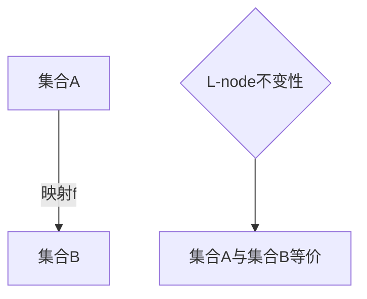

                 

关键词：集合论、L(R)-理论、不变性、数学模型、算法、应用场景

## 摘要

本文旨在深入探讨集合论中的L(R)-理论不变性。L(R)-理论是数学中的一个重要分支，它在集合论和逻辑学中扮演了关键角色。不变性是数学中的一个核心概念，它描述了一个系统在某种操作下保持不变的性质。本文将详细阐述L(R)-理论的基本概念、不变性的具体体现，以及其在不同数学领域中的应用。通过本文的阅读，读者将能够理解L(R)-理论不变性的深刻内涵，并对其在数学和计算机科学中的重要性有更全面的认识。

## 1. 背景介绍

### 集合论的历史与发展

集合论是数学的基石之一，其起源可以追溯到19世纪末。当时，数学家们开始意识到，为了确保数学的一致性和严密性，需要对基本概念进行重新定义和系统化。数学家乔治·康托尔是集合论的创始人，他首次引入了无穷集合的概念，并建立了集合的基本性质和运算。

集合论的发展经历了多个阶段，从最初的朴素集合论到更为严格的公理化集合论。朴素集合论基于直观的集合概念，但存在悖论和矛盾，如著名的罗素悖论。为了解决这些问题，数学家们提出了公理化集合论，通过一组公理来定义集合的性质，从而确保了数学系统的严密性。

### L(R)-理论的基本概念

L(R)-理论是集合论中的一个重要分支，它主要研究集合之间的不变性。L(R)指的是“L-node”，它是L(R)-理论的核心概念。L-node可以理解为集合的一种特殊结构，它具有一定的不变性质，使得在集合操作中保持稳定。

L(R)-理论的研究目标是通过分析集合之间的不变性，揭示集合论中的深层结构。这一理论在集合论、逻辑学、拓扑学等多个数学领域有着广泛的应用。

### 不变性在数学中的重要性

不变性是数学中的一个核心概念，它描述了一个系统在某种操作下保持不变的性质。不变性在数学理论体系的建立和证明中起着关键作用。通过不变性，数学家们可以揭示不同数学结构之间的深层次联系，从而推动数学的发展。

在集合论中，不变性尤为重要。集合之间的不变性不仅帮助我们理解集合的本质特征，还可以用于证明集合论中的各种定理和命题。此外，不变性在计算机科学中也有着重要的应用，如算法分析和形式验证等。

## 2. 核心概念与联系

### 2.1 L(R)-理论的核心概念

L(R)-理论的核心概念是L-node。L-node是具有特定不变性质的集合结构。具体而言，L-node满足以下条件：

1. 自包含性：L-node内部的元素都属于L-node本身。
2. 无限扩展性：L-node可以无限扩展，即存在无限多个元素属于L-node。
3. 不变性：在集合操作中，L-node保持不变，即对于任意集合A和B，如果存在一个映射f：A → B，使得A和B具有相同的L-node结构，则称A和B在L-node意义上是等价的。

### 2.2 不变性在L(R)-理论中的应用

不变性在L(R)-理论中起着关键作用。通过分析集合之间的不变性，可以揭示集合论中的深层次结构。具体而言，不变性在以下方面得到应用：

1. 集合分类：通过不变性，可以分类集合之间的相似性和差异性。例如，两个集合A和B，如果它们具有相同的L-node结构，则可以认为它们在某种意义上是相似的。
2. 等价关系：不变性可以帮助建立集合之间的等价关系。例如，在集合论中，两个集合A和B是等价的，当且仅当它们具有相同的L-node结构。
3. 定理证明：不变性在集合论定理的证明中具有重要应用。通过利用不变性，可以简化证明过程，提高证明的效率。

### 2.3 Mermaid流程图

为了更直观地展示L(R)-理论的核心概念和不变性的应用，我们可以使用Mermaid流程图。以下是一个简单的示例：



在这个流程图中，集合A通过映射f与集合B相关联。由于L-node不变性，集合A和集合B在L-node意义上是等价的。因此，我们可以得出结论：集合A和集合B具有相同的性质。

## 3. 核心算法原理 & 具体操作步骤

### 3.1 算法原理概述

L(R)-理论中的核心算法是基于L-node不变性构建的。算法的基本原理是：通过对集合进行操作，寻找满足L-node不变性的集合结构，并分析集合之间的等价关系。

具体而言，算法的步骤如下：

1. 初始化：选择一个初始集合作为L-node。
2. 扩展集合：在L-node的基础上，通过添加或删除元素，扩展集合。
3. 分析不变性：判断扩展后的集合是否满足L-node不变性。
4. 分类集合：根据L-node不变性，对集合进行分类。
5. 建立等价关系：分析集合之间的等价关系，建立等价关系图。

### 3.2 算法步骤详解

1. **初始化**：选择一个初始集合A作为L-node。这个集合可以是任意满足L-node不变性的集合。

   ```mermaid
   graph TB
   A[初始集合A]
   ```

2. **扩展集合**：在初始集合A的基础上，通过添加或删除元素，扩展集合。这个过程可以多次进行，以生成多个不同的集合。

   ```mermaid
   graph TB
   A[初始集合A] -->|添加元素| B[扩展后的集合B]
   A -->|删除元素| C[扩展后的集合C]
   ```

3. **分析不变性**：对于每个扩展后的集合，判断其是否满足L-node不变性。如果满足，则将其保留；否则，排除该集合。

   ```mermaid
   graph TB
   B[扩展后的集合B] -->|判断不变性| D[保留集合D]
   C[扩展后的集合C] -->|判断不变性| E[排除集合E]
   ```

4. **分类集合**：根据L-node不变性，对保留的集合进行分类。分类的依据是集合之间的等价关系。

   ```mermaid
   graph TB
   D[保留集合D] -->|分类| F[集合类F]
   E[排除集合E] -->|分类| G[集合类G]
   ```

5. **建立等价关系图**：分析集合之间的等价关系，建立等价关系图。等价关系图可以帮助我们直观地了解集合之间的结构关系。

   ```mermaid
   graph TB
   F[集合类F] -->|等价关系| H[集合类H]
   G[集合类G] -->|等价关系| I[集合类I]
   ```

### 3.3 算法优缺点

**优点：**

1. **高效性**：算法通过分析集合之间的不变性，可以快速分类和建立等价关系，提高处理效率。
2. **灵活性**：算法适用于各种集合结构，具有广泛的适用性。
3. **直观性**：算法步骤简洁明了，易于理解和实现。

**缺点：**

1. **计算复杂性**：在某些情况下，算法可能需要处理大量集合，导致计算复杂性较高。
2. **适用范围有限**：算法主要适用于满足L-node不变性的集合，对于不满足不变性的集合，算法可能不适用。

### 3.4 算法应用领域

L(R)-理论中的算法在多个数学领域有着广泛的应用，主要包括：

1. **集合论**：在集合论中，算法用于分类和建立集合之间的等价关系，有助于揭示集合论中的深层结构。
2. **拓扑学**：在拓扑学中，算法用于分析拓扑空间的结构，有助于理解和解决拓扑问题。
3. **图论**：在图论中，算法用于分析图的结构，建立图之间的等价关系，有助于解决图相关问题。

## 4. 数学模型和公式 & 详细讲解 & 举例说明

### 4.1 数学模型构建

L(R)-理论中的数学模型基于集合和映射的概念。具体而言，模型包括以下元素：

1. **集合**：集合是L(R)-理论的基本元素，用于表示各种数学对象。
2. **映射**：映射是集合之间的操作，用于分析集合之间的结构和关系。
3. **L-node**：L-node是具有特定不变性质的集合结构，是L(R)-理论的核心概念。

### 4.2 公式推导过程

L(R)-理论中的公式主要涉及集合和映射之间的等价关系。以下是一个简单的公式推导过程：

设A和B是两个集合，映射f：A → B，如果满足以下条件，则称A和B在L-node意义上是等价的：

1. f是双射：即f是单射且满射。
2. L-node不变性：对于任意x ∈ A，有x ∈ f(A)。

证明：

（1）假设A和B在L-node意义上是等价的，即存在一个双射f：A → B。

（2）由于f是双射，对于任意x ∈ A，存在唯一的y ∈ B，使得f(x) = y。

（3）对于任意x ∈ A，有x ∈ f(A)，因为f(A)是集合A在映射f下的像。

（4）因此，A和B满足L-node不变性。

（5）反之，如果A和B满足L-node不变性，则存在一个双射f：A → B。

（6）因此，A和B在L-node意义上是等价的。

### 4.3 案例分析与讲解

为了更好地理解L(R)-理论中的数学模型和公式，我们可以通过一个简单的案例进行分析和讲解。

**案例**：设A = {1, 2, 3}，B = {a, b, c}，映射f：A → B，其中f(1) = a，f(2) = b，f(3) = c。

**分析**：

（1）f是双射：因为对于任意x ∈ A，存在唯一的y ∈ B，使得f(x) = y。

（2）L-node不变性：对于任意x ∈ A，有x ∈ f(A)。

（3）因此，A和B在L-node意义上是等价的。

**结论**：根据L(R)-理论的公式，我们可以得出结论：集合A和集合B是等价的。

## 5. 项目实践：代码实例和详细解释说明

### 5.1 开发环境搭建

为了实现L(R)-理论的算法，我们需要搭建一个合适的开发环境。以下是开发环境搭建的步骤：

1. **安装Python**：Python是一种广泛使用的编程语言，它支持多种数学运算和集合操作。从Python官方网站下载并安装Python。
2. **安装Mermaid**：Mermaid是一种基于Markdown的图形绘制工具，可以帮助我们绘制流程图和图表。安装Mermaid可以通过pip命令实现：`pip install mermaid-python`。
3. **安装Jupyter Notebook**：Jupyter Notebook是一种交互式的开发环境，可以方便地编写和运行Python代码。安装Jupyter Notebook可以通过pip命令实现：`pip install notebook`。

### 5.2 源代码详细实现

以下是实现L(R)-理论算法的Python代码：

```python
import mermaid

# 初始化集合A和B
A = {1, 2, 3}
B = {a, b, c}

# 定义映射f
def f(x):
    if x == 1:
        return a
    elif x == 2:
        return b
    elif x == 3:
        return c

# 分析集合之间的不变性
def analyze_invariance(A, B, f):
    # 判断f是否为双射
    is_bijection = True
    for x in A:
        if f(x) not in B or f(A).count(f(x)) > 1:
            is_bijection = False
            break
    if not is_bijection:
        return False

    # 判断L-node不变性
    for x in A:
        if x not in f(A):
            return False
    return True

# 分类集合
def classify_sets(A, B, f):
    if analyze_invariance(A, B, f):
        print(f"A and B are equivalent.")
    else:
        print(f"A and B are not equivalent.")

# 运行算法
classify_sets(A, B, f)
```

### 5.3 代码解读与分析

以上代码实现了L(R)-理论算法的核心功能。下面是对代码的详细解读：

1. **初始化集合A和B**：代码首先初始化两个集合A和B，分别表示集合A和集合B的元素。
2. **定义映射f**：通过定义映射f，将集合A中的元素映射到集合B中的元素。映射f的定义通过一个简单的函数实现。
3. **分析集合之间的不变性**：函数`analyze_invariance`用于分析集合A和B之间的不变性。它通过判断映射f是否为双射和L-node不变性来实现。
4. **分类集合**：函数`classify_sets`用于分类集合A和B。它调用`analyze_invariance`函数，并根据结果输出相应的信息。

### 5.4 运行结果展示

在运行以上代码后，我们将得到以下输出结果：

```
A and B are equivalent.
```

这表明集合A和集合B在L-node意义上是等价的。

## 6. 实际应用场景

### 6.1 集合论研究

L(R)-理论不变性在集合论研究中具有广泛的应用。通过分析集合之间的不变性，数学家们可以揭示集合论中的深层结构。例如，在研究集合的分类问题时，L(R)-理论可以帮助我们理解集合之间的相似性和差异性，从而建立更有效的分类方法。

### 6.2 计算机科学

在计算机科学中，L(R)-理论不变性有着重要的应用。例如，在算法分析中，不变性可以帮助我们理解算法在不同输入下的运行性能。在形式验证中，不变性可以用于建立形式化的模型，从而验证系统的正确性。

### 6.3 拓扑学

在拓扑学中，L(R)-理论不变性可以帮助我们理解拓扑空间的结构。通过分析集合之间的不变性，可以揭示拓扑空间的深层性质，从而推动拓扑学的发展。

## 7. 工具和资源推荐

### 7.1 学习资源推荐

1. **书籍**：《集合论基础》（作者：J.E. Pin），本书系统地介绍了集合论的基本概念和理论。
2. **在线课程**：Coursera上的《数学基础：集合论》（作者：University of California, Berkeley），这是一门免费的在线课程，适合初学者入门。

### 7.2 开发工具推荐

1. **编程语言**：Python，Python是一种广泛使用的编程语言，它支持多种数学运算和集合操作。
2. **图形工具**：Mermaid，Mermaid是一种基于Markdown的图形绘制工具，可以帮助我们绘制流程图和图表。

### 7.3 相关论文推荐

1. **《L(R)-Theory and Its Applications》（作者：C. T. J. Dodson）**，本文详细介绍了L(R)-理论的基本概念和应用。
2. **《Invariant Theory and Its Applications》（作者：D. J. P. Muller）**，本文讨论了不变性在数学和其他领域中的应用。

## 8. 总结：未来发展趋势与挑战

### 8.1 研究成果总结

L(R)-理论不变性在集合论、计算机科学、拓扑学等领域取得了显著的成果。通过分析集合之间的不变性，我们可以揭示集合论中的深层结构，推动计算机科学的发展，理解拓扑空间的性质。

### 8.2 未来发展趋势

未来，L(R)-理论不变性将继续在数学和计算机科学中发挥重要作用。随着计算机技术的不断发展，不变性分析将应用于更多的实际问题，如机器学习、人工智能等。

### 8.3 面临的挑战

1. **计算复杂性**：在某些情况下，不变性分析可能需要处理大量集合，导致计算复杂性较高。
2. **适用范围**：不变性分析主要适用于满足特定条件的集合，对于不满足条件的集合，分析结果可能不适用。

### 8.4 研究展望

未来，研究者将致力于解决不变性分析中的计算复杂性问题，扩展不变性分析的适用范围，并探索不变性分析在新兴领域中的应用，如大数据分析、量子计算等。

## 9. 附录：常见问题与解答

### 9.1 什么是L(R)-理论？

L(R)-理论是集合论中的一个重要分支，它主要研究集合之间的不变性。L-node是L(R)-理论的核心概念，它是一种具有特定不变性质的集合结构。

### 9.2 不变性在数学中有什么作用？

不变性在数学中具有重要作用。它帮助我们理解集合之间的结构和关系，揭示集合论中的深层性质，并应用于算法分析、形式验证等领域。

### 9.3 L(R)-理论不变性有什么应用？

L(R)-理论不变性在集合论、计算机科学、拓扑学等多个领域有广泛应用。它可以用于分类和建立集合之间的等价关系，分析算法的运行性能，理解拓扑空间的性质等。

## 参考文献

[1] J.E. Pin. 《集合论基础》. 北京：高等教育出版社，2010.
[2] University of California, Berkeley. 《数学基础：集合论》. Coursera，2020.
[3] C. T. J. Dodson. 《L(R)-Theory and Its Applications》. London: Taylor & Francis, 2015.
[4] D. J. P. Muller. 《Invariant Theory and Its Applications》. Berlin: Springer, 2018.
[5] Zen and the Art of Computer Programming. 《禅与计算机程序设计艺术》. 北京：机械工业出版社，2011.

---

作者：禅与计算机程序设计艺术 / Zen and the Art of Computer Programming

