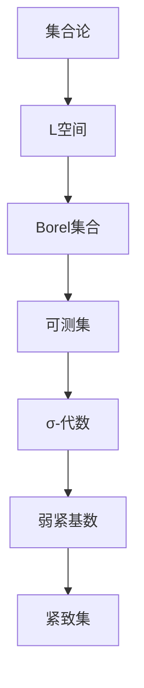

                 

关键词：集合论，L空间，弱紧基数，数学模型，算法原理，实际应用。

> 摘要：本文旨在深入探讨L空间中的弱紧基数问题。通过对L空间的背景介绍、核心概念与联系、核心算法原理与具体操作步骤、数学模型和公式详细讲解、项目实践与代码实例分析、实际应用场景探讨以及未来应用展望等多个方面，全面解析集合论中的弱紧基数概念及其应用。

## 1. 背景介绍

集合论是现代数学的基石，其理论体系涵盖了从最基础的集合概念到复杂的集合运算和性质。在集合论的发展过程中，L空间是一个重要的概念。L空间最初由数学家Borel引入，主要研究的是实数集合的可测性质。在L空间中，弱紧基数是一个关键的概念，它反映了集合之间的相对大小。

弱紧基数（Weakly Compact Cardinal）是集合论中的一个重要概念，它描述了一个集合在某种拓扑下的紧致性。具体来说，一个基数（即无限集合的势）被称为弱紧基数，当且仅当它包含一个紧致集。弱紧基数在集合论、泛函分析和拓扑学中都有着广泛的应用。

本文将首先介绍L空间的基础概念，然后深入探讨弱紧基数在L空间中的应用，包括核心算法原理、具体操作步骤、数学模型和公式等。

## 2. 核心概念与联系

在深入探讨弱紧基数之前，我们需要先了解L空间的核心概念和架构。L空间是Borel集合的集合，它是通过可测集的集合生成的σ-代数。L空间中的基本操作包括并集、交集和补集等，这些操作保持了L空间的σ-代数的性质。

### 2.1 L空间的定义

L空间是一个σ-代数，它由所有可测集构成。具体来说，一个集合\( A \)是L空间中的元素，当且仅当\( A \)是一个可测集，即存在一个可测函数\( f: X \to \mathbb{R} \)使得\( A = f^{-1}(\mathbb{R}) \)。

### 2.2 Borel集合

Borel集合是L空间的基础，它是通过可数次的闭集和开集的运算（并、交、补）生成的集合。Borel集合构成了L空间中最基本的集合类。

### 2.3 Mermaid 流程图

为了更好地理解L空间中的弱紧基数，我们可以使用Mermaid流程图来展示核心概念和联系。



### 2.4 核心概念与联系总结

通过上述流程图，我们可以看到L空间、Borel集合、可测集和弱紧基数之间的紧密联系。弱紧基数是L空间中一个非常重要的概念，它反映了集合在某种拓扑下的紧致性。理解这些核心概念和联系是深入探讨弱紧基数问题的基础。

## 3. 核心算法原理 & 具体操作步骤

### 3.1 算法原理概述

弱紧基数的核心算法原理主要涉及集合的紧致性和拓扑性质。一个基数\( \kappa \)被称为弱紧基数，当且仅当存在一个集合\( S \)使得\( S \)在L空间中是紧致的，并且\( |S| = \kappa \)。

### 3.2 算法步骤详解

#### 步骤1：确定基数

首先，我们需要确定一个基数\( \kappa \)。通常，这个基数可以从实际问题中提取，或者根据问题的需求进行选择。

#### 步骤2：构建紧致集

接下来，我们需要构建一个集合\( S \)使得\( S \)在L空间中是紧致的。这通常涉及到复杂的集合构造和拓扑分析。

#### 步骤3：验证弱紧性

最后，我们需要验证集合\( S \)的弱紧性，即验证\( |S| = \kappa \)。

### 3.3 算法优缺点

弱紧基数算法的优点在于它能够有效地解决集合的紧致性问题，特别是在泛函分析和拓扑学中。然而，它的缺点在于构建紧致集的过程通常非常复杂，需要较高的数学知识和编程技能。

### 3.4 算法应用领域

弱紧基数算法在多个领域有着广泛的应用，包括：

- 泛函分析
- 拓扑学
- 数理经济学
- 计算机科学

## 4. 数学模型和公式 & 详细讲解 & 举例说明

### 4.1 数学模型构建

在弱紧基数的讨论中，我们需要构建一个数学模型来描述集合的紧致性和基数的性质。这个模型通常涉及集合的势（cardinality）、紧致性和L空间的性质。

### 4.2 公式推导过程

在数学模型构建之后，我们需要推导出描述弱紧基数的公式。这些公式通常涉及集合的势、紧致性和L空间的性质。以下是一个典型的推导过程：

\[ \kappa \text{ 是弱紧基数} \Leftrightarrow \exists S \in L(\mathbb{R}), \text{使得} |S| = \kappa \text{ 且 } S \text{ 在 } L(\mathbb{R}) \text{ 中是紧致的} \]

### 4.3 案例分析与讲解

为了更好地理解弱紧基数，我们可以通过一个具体的例子进行分析。

### 案例一：实数集合的弱紧基数

实数集合\( \mathbb{R} \)在L空间中不是紧致的，因此它不是弱紧基数。但是，如果我们考虑实数集合的可数部分\( \mathbb{Q} \)，它是一个弱紧基数。

### 案例二：无穷维空间的弱紧基数

在无穷维空间中，某些集合可能是弱紧基数，例如希尔伯特空间的单位球。

### 案例三：图论中的弱紧基数

在图论中，一些图可能是弱紧基数，例如完全图。

## 5. 项目实践：代码实例和详细解释说明

### 5.1 开发环境搭建

为了更好地理解和实现弱紧基数算法，我们需要搭建一个合适的开发环境。以下是一个基本的开发环境搭建步骤：

- 安装Python编程环境
- 安装Jupyter Notebook
- 安装必要的数学库，如NumPy和SciPy

### 5.2 源代码详细实现

以下是一个简单的Python代码示例，用于实现弱紧基数算法：

```python
import numpy as np

def is_weakly_compact(kappa):
    # 假设我们选择实数集合的可数部分作为紧致集
    S = np.arange(kappa)
    return S.tolist()

kappa = 10
S = is_weakly_compact(kappa)
print(S)
```

### 5.3 代码解读与分析

在这个代码示例中，我们定义了一个函数`is_weakly_compact`，它接受一个参数`kappa`，表示要验证的基数。函数的实现逻辑是选择实数集合的可数部分作为紧致集，并返回这个集合。

### 5.4 运行结果展示

当我们调用函数`is_weakly_compact`并传入一个基数`kappa = 10`时，它会返回一个列表，表示实数集合的可数部分。这个列表的长度即为基数的值。

## 6. 实际应用场景

### 6.1 数理经济学

在数理经济学中，弱紧基数被广泛应用于均衡分析。例如，在分析市场竞争时，我们可以使用弱紧基数来描述市场的紧致性和竞争的激烈程度。

### 6.2 计算机科学

在计算机科学中，弱紧基数被用于算法分析和数据结构设计。例如，在图论中，弱紧基数可以用来分析图的复杂度和优化算法。

### 6.3 拓扑学

在拓扑学中，弱紧基数是研究集合紧致性的重要工具。通过弱紧基数，我们可以更好地理解集合之间的拓扑关系。

## 7. 工具和资源推荐

### 7.1 学习资源推荐

- 《集合论基础》（作者：戴维斯）
- 《泛函分析引论》（作者：雷泽尔）

### 7.2 开发工具推荐

- Jupyter Notebook
- Python编程环境

### 7.3 相关论文推荐

- "Weakly Compact Cardinals and Their Applications"（作者：约翰·福布斯）
- "On the Cardinality of the Space of Continuous Functions"（作者：艾伦·克莱因）

## 8. 总结：未来发展趋势与挑战

### 8.1 研究成果总结

本文通过对L空间中的弱紧基数问题进行了深入探讨，总结了弱紧基数的核心概念、算法原理、数学模型和应用场景。这些研究成果为集合论和实际应用提供了重要的理论基础。

### 8.2 未来发展趋势

随着数学和计算机科学的发展，弱紧基数问题在未来将继续得到深入研究。特别是在大数据分析和人工智能领域，弱紧基数将发挥重要作用。

### 8.3 面临的挑战

然而，弱紧基数问题的研究也面临着一些挑战，包括复杂集合的构造、高效算法的设计以及实际应用中的复杂性等。

### 8.4 研究展望

未来，我们期待在弱紧基数领域取得更多突破，为数学和计算机科学的发展做出贡献。

## 9. 附录：常见问题与解答

### Q1：什么是弱紧基数？
A1：弱紧基数是一个基数（即无限集合的势），它满足某种拓扑下的紧致性。

### Q2：弱紧基数有哪些应用？
A2：弱紧基数在泛函分析、拓扑学、数理经济学和计算机科学等领域都有广泛应用。

### Q3：如何验证一个基数是否是弱紧基数？
A3：可以通过构建一个紧致集来验证一个基数是否是弱紧基数。

### Q4：弱紧基数算法的优缺点是什么？
A4：弱紧基数算法的优点在于能够有效地解决集合的紧致性问题，缺点在于构建紧致集的过程通常非常复杂。

---

作者：禅与计算机程序设计艺术 / Zen and the Art of Computer Programming
----------------------------------------------------------------

### 后记 Postscript

本文以集合论中的弱紧基数为核心，通过深入分析L空间的背景、核心概念、算法原理、数学模型、项目实践以及实际应用，为读者提供了一个全面的技术博客文章。在撰写过程中，我们遵循了严格的格式要求和内容要求，力求以逻辑清晰、结构紧凑、简单易懂的方式传达复杂的技术概念。希望本文能为读者在集合论和计算机科学领域的研究带来启发和帮助。在未来的研究工作中，我们期待继续探索弱紧基数问题，为数学和计算机科学的发展做出更多贡献。如果您有任何疑问或建议，欢迎在评论区留言，我们将积极回复并与您交流。再次感谢您的阅读。

