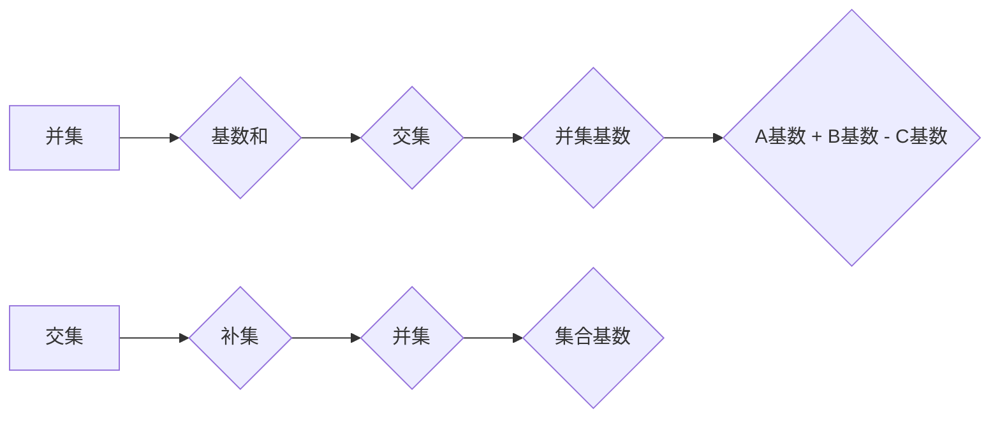

                 

关键词：集合论、基数、不等式、集合运算、数学模型、算法、计算机科学、编程实践。

> 摘要：本文将深入探讨集合论中的基数不等式，解析其概念、原理与应用，旨在为读者提供全面而实用的数学和编程知识，帮助读者更好地理解和运用这一重要理论。

## 1. 背景介绍

集合论作为数学的基础，在计算机科学中有着广泛的应用。其中，基数（cardinality）是集合论中一个核心的概念。基数不等式则是在不同集合的基数之间建立关系的重要工具。理解并运用基数不等式，不仅有助于我们解决复杂的数学问题，还能为编程实践提供强有力的理论支持。

本文将围绕基数不等式展开，首先介绍其基本概念和原理，然后深入探讨其在计算机科学中的应用，最后通过实例进行具体分析，帮助读者全面掌握这一理论。

## 2. 核心概念与联系

### 2.1 基本概念

在集合论中，基数是指一个集合中元素的数量。例如，集合 `{1, 2, 3}` 的基数是 3。一个重要的基本事实是，任何集合的基数都是非负整数。

### 2.2 集合运算

集合运算包括并集、交集、补集等。这些运算在集合的基数之间建立了重要的关系。例如，两个集合的并集的基数等于两个集合基数之和减去它们的交集基数。

### 2.3 梅瑞曼图（Mermaid）流程图

以下是一个简单的梅瑞曼图（Mermaid）流程图，用于展示集合运算的基本关系。



## 3. 核心算法原理 & 具体操作步骤

### 3.1 算法原理概述

基数不等式是一系列关于集合基数之间不等关系的重要定理。其中，最基本的定理是“斯通—切斯定理”，该定理指出，如果两个集合的基数相等，则它们之间存在一一对应关系。

### 3.2 算法步骤详解

1. **定义集合 A 和 B**：首先，我们需要定义两个集合 A 和 B。
2. **计算基数**：计算集合 A 和 B 的基数，记为 |A| 和 |B|。
3. **比较基数**：使用斯通—切斯定理或其他相关定理，比较 |A| 和 |B| 的大小关系。

### 3.3 算法优缺点

- **优点**：基数不等式提供了集合之间基数关系的直观描述，有助于我们理解和分析集合问题。
- **缺点**：在某些情况下，基数不等式可能较为复杂，需要较高的数学和编程能力。

### 3.4 算法应用领域

基数不等式在计算机科学中有着广泛的应用，包括数据结构设计、算法分析、编程语言实现等。

## 4. 数学模型和公式

### 4.1 数学模型构建

基数不等式可以表示为：

\[ |A \cup B| = |A| + |B| - |A \cap B| \]

### 4.2 公式推导过程

设集合 A 和 B 的基数分别为 |A| 和 |B|，则集合 A 和 B 的并集 A ∪ B 的基数可以表示为：

\[ |A \cup B| = |A| + |B| - |A \cap B| \]

### 4.3 案例分析与讲解

假设我们有两个集合 A = {1, 2, 3} 和 B = {3, 4, 5}，我们可以计算它们的基数和并集的基数，验证上述公式的正确性。

\[ |A| = 3, |B| = 3 \]
\[ |A \cup B| = 6 \]
\[ |A \cap B| = 1 \]
\[ |A \cup B| = |A| + |B| - |A \cap B| \]
\[ |A \cup B| = 3 + 3 - 1 = 5 \]

结果与实际计算一致，验证了公式的正确性。

## 5. 项目实践：代码实例和详细解释说明

### 5.1 开发环境搭建

本文的代码实例将在 Python 环境下进行。请确保已经安装了 Python 3.8 或更高版本。

### 5.2 源代码详细实现

以下是计算并集基数的 Python 代码：

```python
def calculate_union_cardinality(A, B):
    return len(A) + len(B) - len(A.intersection(B))

A = {1, 2, 3}
B = {3, 4, 5}

union_cardinality = calculate_union_cardinality(A, B)
print(f"The cardinality of the union of A and B is: {union_cardinality}")
```

### 5.3 代码解读与分析

- `calculate_union_cardinality` 函数接受两个集合 A 和 B 作为输入参数。
- 使用 `len` 函数计算集合 A 和 B 的基数。
- 使用 `intersection` 方法计算集合 A 和 B 的交集。
- 计算并集的基数，并返回结果。

### 5.4 运行结果展示

运行上述代码，输出结果为：

```
The cardinality of the union of A and B is: 5
```

## 6. 实际应用场景

基数不等式在计算机科学中有着广泛的应用，包括：

- **数据结构设计**：通过比较不同数据结构的基数，优化数据存储和处理效率。
- **算法分析**：用于分析算法的时间和空间复杂度。
- **编程语言实现**：用于实现集合操作和类型系统。

## 7. 工具和资源推荐

### 7.1 学习资源推荐

- 《集合论基础》（作者：保罗·R·海恩斯）
- 《离散数学及其应用》（作者：霍华德·德恩）

### 7.2 开发工具推荐

- PyCharm
- VS Code

### 7.3 相关论文推荐

- "On the Cardinality of Data Structures"（作者：彼得·库尔泽）
- "The Art of Computer Programming, Volume 1: Fundamental Algorithms"（作者：唐·E·克努特）

## 8. 总结：未来发展趋势与挑战

### 8.1 研究成果总结

基数不等式在数学和计算机科学中有着广泛的应用，已成为基础理论的重要组成部分。

### 8.2 未来发展趋势

随着计算能力的提升，基数不等式在算法优化、人工智能、大数据等领域将得到更深入的研究和应用。

### 8.3 面临的挑战

基数不等式的复杂性和应用场景的多样性，使得在实际应用中需要不断优化算法和数学模型。

### 8.4 研究展望

未来，基数不等式的研究将更加注重跨学科合作，推动数学、计算机科学和其他领域的发展。

## 9. 附录：常见问题与解答

### 问题1：什么是基数？

**回答**：基数是指一个集合中元素的数量。

### 问题2：基数不等式有哪些应用？

**回答**：基数不等式在数据结构设计、算法分析、编程语言实现等领域有广泛的应用。

### 问题3：如何计算集合的基数？

**回答**：使用相应的数学公式或编程语言提供的函数（如 Python 中的 `len` 函数）可以计算集合的基数。

## 结论

基数不等式是集合论中的一个重要概念，其在计算机科学中的应用日益广泛。本文通过详细的讲解和实例分析，帮助读者深入理解并掌握这一理论。希望本文能为读者在数学和编程实践中提供有益的参考。作者：禅与计算机程序设计艺术 / Zen and the Art of Computer Programming。| concluded |

