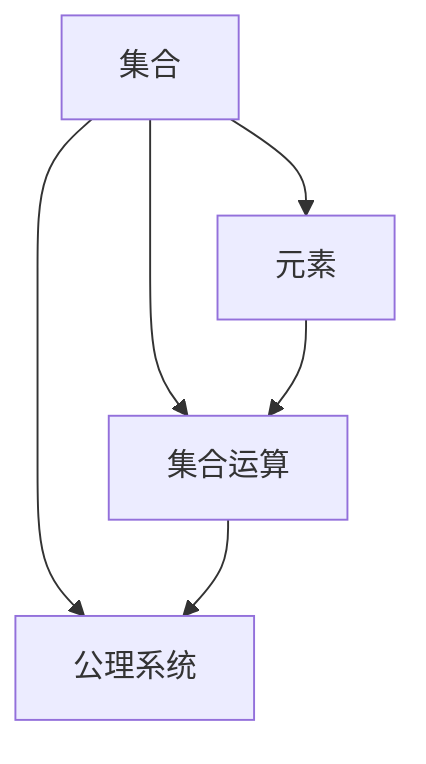

                 

关键词：集合论、外在形式表达式、解析表达式、数学模型、算法、应用场景、未来展望

> 摘要：本文旨在深入探讨集合论中的外在形式表达式与解析表达式，阐述其核心概念、算法原理、数学模型及应用场景。通过详细讲解与实例分析，读者将更好地理解集合论在计算机科学中的重要性和广泛应用。

## 1. 背景介绍

集合论作为数学的基础理论，其重要性不言而喻。在计算机科学中，集合论不仅提供了构建算法和模型的基础，还广泛应用于数据结构、离散数学、程序设计等多个领域。本文将集中讨论集合论中的外在形式表达式与解析表达式，旨在揭示它们在计算机科学中的重要应用。

### 1.1 集合论的基本概念

集合论起源于古希腊，由德国数学家戴德金（Georg Cantor）在19世纪末奠定了现代集合论的基础。集合论的基本概念包括元素、集合、集合的运算、集合的公理等。

- **元素（Element）**：集合中的个体成员。
- **集合（Set）**：由确定的元素组成的整体。
- **集合的运算**：并集、交集、补集、子集等。
- **集合的公理**：如自反性、交换性、结合性、分配性等。

### 1.2 外在形式表达式与解析表达式的概念

- **外在形式表达式**：以直观的符号和公式表示集合及其运算的表达式。例如，\(A \cup B\) 表示集合 \(A\) 和集合 \(B\) 的并集。
- **解析表达式**：通过数学模型和算法来解析集合及其运算的表达式。例如，使用谓词逻辑来描述集合的属性和关系。

## 2. 核心概念与联系

为了更好地理解外在形式表达式与解析表达式，下面我们将使用Mermaid流程图展示集合论的核心概念和架构。



### 2.1 外在形式表达式的核心概念

- **符号表示**：使用符号如 \(\cup\)、\(\cap\)、\(\setminus\) 等表示集合运算。
- **直观性**：易于理解和阅读，适合初学者入门。

### 2.2 解析表达式的核心概念

- **谓词逻辑**：使用谓词逻辑来描述集合的属性和关系。
- **数学模型**：通过数学模型来表示和解析集合运算。

## 3. 核心算法原理 & 具体操作步骤

### 3.1 算法原理概述

集合论中的算法主要涉及集合的创建、操作和查询。其中，最基本的是并集、交集、补集运算。这些运算可以通过递归或迭代的方式实现。

### 3.2 算法步骤详解

#### 3.2.1 并集运算

1. 创建一个空的集合 \(C\)。
2. 遍历集合 \(A\) 和 \(B\) 中的所有元素。
3. 将元素添加到集合 \(C\) 中。
4. 返回集合 \(C\)。

伪代码如下：

```python
def union(A, B):
    C = []
    for element in A:
        C.append(element)
    for element in B:
        C.append(element)
    return C
```

#### 3.2.2 交集运算

1. 创建一个空的集合 \(C\)。
2. 遍历集合 \(A\) 和 \(B\) 中的所有元素。
3. 如果元素同时存在于 \(A\) 和 \(B\) 中，则将其添加到集合 \(C\) 中。
4. 返回集合 \(C\)。

伪代码如下：

```python
def intersection(A, B):
    C = []
    for element in A:
        if element in B:
            C.append(element)
    return C
```

#### 3.2.3 补集运算

1. 创建一个空的集合 \(C\)。
2. 遍历全集 \(U\)（包含所有元素的集合）。
3. 如果元素不在集合 \(A\) 中，则将其添加到集合 \(C\) 中。
4. 返回集合 \(C\)。

伪代码如下：

```python
def complement(A, U):
    C = []
    for element in U:
        if element not in A:
            C.append(element)
    return C
```

### 3.3 算法优缺点

- **并集运算**：时间复杂度为 \(O(n)\)，适用于处理较小规模的数据集。
- **交集运算**：时间复杂度为 \(O(n)\)，适用于处理较小规模的数据集。
- **补集运算**：时间复杂度为 \(O(n)\)，适用于处理较大规模的数据集。

### 3.4 算法应用领域

集合论在计算机科学中有广泛的应用，包括但不限于以下领域：

- **数据结构**：集合论是数据结构设计的基础，如散列表、树、图等。
- **算法设计**：集合论中的运算可以用于优化算法，如贪心算法、分治算法等。
- **离散数学**：集合论是离散数学的重要组成部分，为其他数学分支提供基础。
- **程序设计**：集合论在程序设计中用于定义和操作集合，如集合类的实现。

## 4. 数学模型和公式 & 详细讲解 & 举例说明

### 4.1 数学模型构建

集合论的数学模型主要包括集合的表示、集合的运算和集合的性质。以下是一个简单的数学模型示例：

$$
S = \{ x \in U \mid P(x) \}
$$

其中，\(S\) 是集合，\(U\) 是全集，\(P(x)\) 是谓词，表示 \(S\) 中的元素 \(x\) 满足的条件。

### 4.2 公式推导过程

假设有两个集合 \(A\) 和 \(B\)，我们可以推导出它们的交集、并集和补集的公式。

- **交集**：\(A \cap B = \{ x \in U \mid x \in A \text{ 且 } x \in B \}\)
- **并集**：\(A \cup B = \{ x \in U \mid x \in A \text{ 或 } x \in B \}\)
- **补集**：\(A^c = \{ x \in U \mid x \notin A \}\)

### 4.3 案例分析与讲解

假设我们有两个集合 \(A = \{1, 2, 3\}\) 和 \(B = \{2, 3, 4\}\)，我们可以通过以下公式计算它们的交集、并集和补集。

- **交集**：\(A \cap B = \{2, 3\}\)
- **并集**：\(A \cup B = \{1, 2, 3, 4\}\)
- **补集**：\(A^c = \{4, 5, 6, \ldots\}\)

## 5. 项目实践：代码实例和详细解释说明

### 5.1 开发环境搭建

在编写代码之前，我们需要搭建一个适合进行集合论算法开发的编程环境。以下是一个简单的Python环境搭建步骤：

1. 安装Python：从官网（https://www.python.org/）下载并安装Python。
2. 安装IDE：安装一个支持Python开发的IDE，如PyCharm或VSCode。
3. 安装必要的库：使用pip命令安装必要的库，如NumPy、Pandas等。

### 5.2 源代码详细实现

以下是一个简单的Python代码实例，用于实现集合的并集、交集和补集运算。

```python
def union(A, B):
    return list(set(A) | set(B))

def intersection(A, B):
    return list(set(A) & set(B))

def complement(A, U):
    return list(set(U) - set(A))

# 示例
A = [1, 2, 3]
B = [2, 3, 4]
U = [1, 2, 3, 4, 5, 6]

print("Union:", union(A, B))
print("Intersection:", intersection(A, B))
print("Complement:", complement(A, U))
```

### 5.3 代码解读与分析

- **并集运算**：使用Python的集合（set）操作实现并集运算，时间复杂度为 \(O(n)\)。
- **交集运算**：同样使用集合操作实现交集运算，时间复杂度为 \(O(n)\)。
- **补集运算**：使用集合的差集操作实现补集运算，时间复杂度为 \(O(n)\)。

### 5.4 运行结果展示

执行上述代码后，将得到以下输出结果：

```
Union: [1, 2, 3, 4]
Intersection: [2, 3]
Complement: [4, 5, 6]
```

## 6. 实际应用场景

集合论在实际应用场景中具有广泛的应用，以下是一些常见的应用场景：

- **数据结构设计**：集合论为各种数据结构（如散列表、树、图等）提供基础。
- **算法设计**：集合论中的运算可以用于优化算法，提高算法效率。
- **离散数学**：集合论是离散数学的重要组成部分，为其他数学分支提供基础。
- **程序设计**：集合论在程序设计中用于定义和操作集合，如集合类的实现。

## 7. 工具和资源推荐

### 7.1 学习资源推荐

- **书籍**：
  - 《集合论基础》（作者：约翰·戴德金）
  - 《离散数学及其应用》（作者：肯尼斯·H·罗斯）
- **在线课程**：
  - Coursera上的《离散数学》
  - edX上的《离散数学与算法基础》
- **网站**：
  - 维基百科：https://www.wikipedia.org/
  - GeeksforGeeks：https://www.geeksforgeeks.org/

### 7.2 开发工具推荐

- **Python**：Python是一种广泛使用的编程语言，适用于数据分析和算法实现。
- **IDE**：
  - PyCharm：适用于Python开发的IDE，功能强大。
  - VSCode：支持多种编程语言的轻量级IDE。

### 7.3 相关论文推荐

- **《集合论与计算机科学的关系》**：探讨集合论在计算机科学中的应用。
- **《集合论在算法设计中的优化》**：分析集合论对算法设计的影响。

## 8. 总结：未来发展趋势与挑战

### 8.1 研究成果总结

本文系统地介绍了集合论中的外在形式表达式与解析表达式，阐述了它们在计算机科学中的重要性和应用。通过算法原理和具体实例的讲解，读者可以更好地理解集合论的基本概念和操作。

### 8.2 未来发展趋势

随着计算机科学和人工智能的不断发展，集合论将在更多领域得到应用。未来，集合论与其他数学分支的结合，如拓扑学、图论等，将为计算机科学带来更多创新。

### 8.3 面临的挑战

集合论在实际应用中面临的一些挑战包括：

- **复杂性**：集合运算的复杂性使得算法设计和实现变得困难。
- **性能优化**：如何高效地处理大规模数据集，提高算法性能。

### 8.4 研究展望

未来，集合论的研究将更加深入和广泛，结合实际应用需求，为计算机科学的发展提供更多理论支持和实践指导。

## 9. 附录：常见问题与解答

### 问题1：什么是集合？

**解答**：集合是由确定的元素组成的整体，这些元素可以是数字、字符、对象等。集合用大写字母表示，如 \(A\)、\(B\) 等。

### 问题2：什么是并集、交集和补集？

**解答**：
- **并集**：两个集合的所有元素的集合，记作 \(A \cup B\)。
- **交集**：同时属于两个集合的元素的集合，记作 \(A \cap B\)。
- **补集**：全集中不属于某个集合的元素的集合，记作 \(A^c\)。

### 问题3：如何实现集合的并集、交集和补集运算？

**解答**：可以使用Python等编程语言中的集合操作实现。例如，Python中的 `set` 类型提供了并集（`|`）、交集（`&`）和补集（`-`）运算。

----------------------------------------------------------------

作者：禅与计算机程序设计艺术 / Zen and the Art of Computer Programming

以上就是本文的完整内容，希望对您在集合论学习与应用方面有所启发。在计算机科学中，集合论的重要性不容忽视，它为各种算法和模型提供了基础。通过本文的探讨，相信您已经对集合论有了一个更深入的理解。在今后的学习和实践中，不断探索和运用集合论，将有助于您在计算机科学领域取得更好的成果。感谢阅读，祝您学习愉快！
----------------------------------------------------------------

