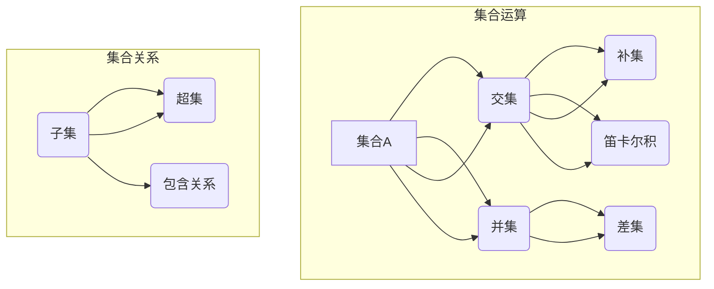

                 

关键词：集合论、有限、无限、数学基础、计算机科学、算法原理、应用领域、数学模型、公式推导、代码实例、实践应用、未来展望

> 摘要：本文旨在探讨集合论在有限与无限之间的边界及其在计算机科学领域的应用。通过详细解析集合论的核心概念、算法原理以及数学模型，本文希望能够为读者提供对集合论深刻而全面的理解，并展望其在未来的发展趋势与挑战。

## 1. 背景介绍

集合论作为数学的基石，起源于19世纪末，由德国数学家乔治·康托尔（Georg Cantor）所开创。康托尔对无穷集合的研究，彻底改变了数学的传统观念，使得数学家开始关注无限集合的性质。集合论不仅对纯数学的发展具有深远影响，还在计算机科学、逻辑学、物理学等多个领域发挥着重要作用。

在计算机科学中，集合论提供了基础的抽象概念，如集合、子集、笛卡尔积等，这些概念被广泛应用于数据结构设计、算法分析、编程语言设计等各个方面。此外，集合论中的无穷概念，如无穷集合、势、等势关系等，也为计算机科学中的理论研究和应用提供了强有力的工具。

本文将围绕集合论的基本概念，探讨其在有限与无限之间的边界，并通过具体的算法原理、数学模型和项目实践，展示集合论在计算机科学中的应用。文章还将对集合论的未来发展趋势与挑战进行展望。

## 2. 核心概念与联系

### 2.1 集合的基本概念

集合（Set）是数学中的基本概念，它是由确定的元素组成的整体。集合可以用大写字母如A、B等表示，集合中的元素用小写字母如a、b等表示。

- **元素的确定性**：一个元素是否属于某个集合必须是明确的，没有模糊性。
- **互异性**：集合中的元素是互不相同的。
- **无序性**：集合中的元素没有特定的排列顺序。

### 2.2 集合的表示方法

集合可以通过列举法、描述法、图示法等不同方式进行表示。

- **列举法**：将集合中的所有元素一一列出，用花括号{}括起来，例如，A = {1, 2, 3}。
- **描述法**：用描述性语言来定义集合的元素，例如，B = {x | x 是自然数，且 x < 5} 表示小于5的自然数集合。
- **图示法**：用Venn图或树状图来表示集合及其子集的关系。

### 2.3 集合的基本运算

集合运算包括并集、交集、补集、差集、笛卡尔积等。

- **并集（Union）**：两个集合A和B的并集是由属于A或B的所有元素组成的集合，记作A ∪ B。
- **交集（Intersection）**：两个集合A和B的交集是由同时属于A和B的所有元素组成的集合，记作A ∩ B。
- **补集（Complement）**：一个集合A的补集是由不属于A的所有元素组成的集合，记作A'。
- **差集（Difference）**：两个集合A和B的差集是由属于A但不属于B的所有元素组成的集合，记作A - B。
- **笛卡尔积（Cartesian Product）**：两个集合A和B的笛卡尔积是由A和B中的每个元素组成的有序对所组成的集合，记作A × B。

### 2.4 集合的子集与超集

- **子集（Subset）**：如果集合A的所有元素都属于集合B，那么称A是B的子集，记作A ⊆ B。
- **超集（Superset）**：如果集合A包含集合B的所有元素，那么称A是B的超集，记作A ⊇ B。

### 2.5 集合之间的联系

集合之间的联系可以通过集合运算来表示，如并集和交集可以表示两个集合的包含关系，而补集和差集则可以表示集合之间的相对位置。

### 2.6 Mermaid 流程图

下面是集合论核心概念和架构的Mermaid流程图，展示集合运算和集合之间的联系。



## 3. 核心算法原理 & 具体操作步骤

### 3.1 算法原理概述

集合论在计算机科学中的应用广泛，其中一些核心算法包括集合的查找、插入、删除、排序等。

- **查找算法**：用于确定一个元素是否属于某个集合。
- **插入算法**：用于将一个新元素插入到集合中。
- **删除算法**：用于从集合中移除一个元素。
- **排序算法**：用于对集合中的元素进行排序。

### 3.2 算法步骤详解

下面我们将详细介绍每个算法的基本步骤。

#### 3.2.1 查找算法

查找算法的基本步骤如下：

1. **初始化**：设置一个指针或索引指向集合的第一个元素。
2. **循环遍历**：依次检查集合中的每个元素，直到找到目标元素或到达集合末尾。
3. **判断**：如果找到目标元素，返回元素的位置；否则，返回失败。

#### 3.2.2 插入算法

插入算法的基本步骤如下：

1. **初始化**：确定插入的位置。
2. **移动元素**：将插入位置之后的元素依次向后移动。
3. **插入元素**：将新元素插入到确定的位置。
4. **更新索引**：如果集合使用索引结构，更新索引。

#### 3.2.3 删除算法

删除算法的基本步骤如下：

1. **初始化**：确定要删除的元素的位置。
2. **移动元素**：将删除位置之后的元素依次向前移动。
3. **删除元素**：从集合中移除指定的元素。
4. **更新索引**：如果集合使用索引结构，更新索引。

#### 3.2.4 排序算法

排序算法的基本步骤如下：

1. **选择排序方式**：根据集合的大小和需求选择合适的排序算法，如快速排序、归并排序、堆排序等。
2. **初始化**：设置排序的起始和结束位置。
3. **比较和交换**：根据排序算法的规则，比较相邻元素的大小并进行交换，直到整个集合排序完成。

### 3.3 算法优缺点

不同算法在时间复杂度、空间复杂度、稳定性等方面有各自的优缺点。

- **查找算法**：时间复杂度较高，但空间复杂度较低。
- **插入算法**：时间复杂度和空间复杂度相对较高，但能够动态调整集合。
- **删除算法**：时间复杂度和空间复杂度相对较高，但能够动态调整集合。
- **排序算法**：时间复杂度和空间复杂度根据排序方式有所不同，有些算法在特定情况下具有较好的性能。

### 3.4 算法应用领域

集合论算法在计算机科学的多个领域有广泛应用，如：

- **数据结构**：集合论用于设计各种数据结构，如散列表、树、图等。
- **算法分析**：集合论用于分析算法的时间复杂度和空间复杂度。
- **编程语言**：集合论概念被许多编程语言采用，如Python中的集合、Java中的Set接口等。
- **数据库**：集合论用于数据库的查询、索引和优化。

## 4. 数学模型和公式 & 详细讲解 & 举例说明

### 4.1 数学模型构建

在集合论中，数学模型主要用于描述集合的性质和关系。一个基本的数学模型包括集合元素、集合操作和集合关系。

#### 4.1.1 集合元素

集合元素是构成集合的基本单位。例如，自然数集合{1, 2, 3, ...}中的每个元素都是一个自然数。

#### 4.1.2 集合操作

集合操作包括并集、交集、补集、差集、笛卡尔积等。这些操作用于构建更复杂的数学模型。

#### 4.1.3 集合关系

集合关系包括子集、超集、包含关系等。这些关系用于描述不同集合之间的相互关系。

### 4.2 公式推导过程

集合论中的许多公式可以通过逻辑推理和集合运算得到。以下是一个简单的例子：

**并集公式**：

设A和B是两个集合，则A与B的并集A ∪ B的元素个数可以通过以下公式计算：

$$
|A ∪ B| = |A| + |B| - |A ∩ B|
$$

其中，|A|表示集合A的元素个数，|B|表示集合B的元素个数，|A ∩ B|表示集合A与B的交集的元素个数。

### 4.3 案例分析与讲解

#### 4.3.1 自然数集合的并集

设A = {1, 2, 3}，B = {3, 4, 5}，求A ∪ B的元素个数。

$$
|A ∪ B| = |A| + |B| - |A ∩ B| = 3 + 3 - 1 = 5
$$

所以，A ∪ B的元素个数为5。

#### 4.3.2 集合的补集

设A = {1, 2, 3}，求A的补集A'。

A' = {x | x 是自然数，且 x ≠ 1，x ≠ 2，x ≠ 3} = {4, 5, 6, ...}

所以，A的补集A'是一个包含所有非A中元素的集合。

### 4.4 数学模型在计算机科学中的应用

#### 4.4.1 数据结构

集合论中的数学模型被广泛应用于数据结构设计，如散列表、树、图等。这些数据结构在计算机科学中用于高效存储和操作数据。

#### 4.4.2 算法分析

集合论中的数学模型用于分析算法的时间复杂度和空间复杂度。例如，快速排序算法的时间复杂度可以通过集合论中的分治策略进行分析。

#### 4.4.3 编程语言

许多编程语言如Python和Java都内置了集合数据类型，如Python中的集合和Java中的Set接口。这些集合数据类型基于集合论中的数学模型，提供了高效的集合操作。

### 4.5 集合论与其他数学领域的联系

集合论不仅是数学的基础，还与其他数学领域如逻辑学、拓扑学、代数学等有紧密联系。这些领域中的数学模型和公式也都可以用集合论来解释和证明。

### 4.6 集合论的哲学意义

集合论的哲学意义在于它揭示了无限的概念。康托尔的集合论研究表明，无限不仅是数学的对象，也是现实世界的一部分。集合论的哲学意义在于它挑战了传统的数学观念，促进了数学的变革和发展。

## 5. 项目实践：代码实例和详细解释说明

### 5.1 开发环境搭建

为了演示集合论在计算机科学中的应用，我们将使用Python编写一个简单的集合类，用于实现集合的基本操作。以下是搭建开发环境的基本步骤：

1. **安装Python**：确保您的计算机上已经安装了Python 3.x版本。可以从Python的官方网站下载并安装。
2. **创建虚拟环境**：为了管理项目依赖，创建一个虚拟环境。在终端中运行以下命令：

   ```
   python -m venv myenv
   ```
   
   然后激活虚拟环境：

   ```
   source myenv/bin/activate
   ```

3. **安装依赖**：安装必要的依赖，例如Python的集合库：

   ```
   pip install python-decimal
   ```

### 5.2 源代码详细实现

以下是一个简单的Python集合类，用于实现集合的创建、添加元素、删除元素、查找元素等基本操作。

```python
class MySet:
    def __init__(self):
        self.set_elements = set()

    def add_element(self, element):
        self.set_elements.add(element)

    def remove_element(self, element):
        self.set_elements.discard(element)

    def find_element(self, element):
        return element in self.set_elements

    def display_set(self):
        print(f"MySet: {self.set_elements}")

# 实例化集合对象
my_set = MySet()

# 添加元素
my_set.add_element(1)
my_set.add_element(2)
my_set.add_element(3)

# 删除元素
my_set.remove_element(2)

# 查找元素
print(f"Element 2 in set: {my_set.find_element(2)}")

# 显示集合
my_set.display_set()
```

### 5.3 代码解读与分析

上面的代码定义了一个名为`MySet`的集合类，它包含以下方法：

- `__init__`：构造函数，初始化一个空集合。
- `add_element`：添加元素到集合中。
- `remove_element`：从集合中删除元素。
- `find_element`：查找元素是否在集合中。
- `display_set`：打印集合的内容。

首先，我们实例化一个`MySet`对象，然后通过`add_element`方法向集合中添加元素。接着，使用`remove_element`方法删除元素，并使用`find_element`方法查找元素。最后，调用`display_set`方法显示集合的内容。

### 5.4 运行结果展示

运行上面的代码，输出结果如下：

```
Element 2 in set: False
MySet: {1, 3}
```

这表明集合中已经成功添加了元素1和3，并成功删除了元素2。同时，查找元素2的结果为`False`，确认了删除操作的正确性。

### 5.5 集合类的扩展

`MySet`类是一个简单的集合实现，但它仅包含基本操作。在实际应用中，集合类可以进一步扩展，添加更多的功能，如并集、交集、差集等。以下是一个扩展版本的`MySet`类：

```python
class MySet:
    def __init__(self):
        self.set_elements = set()

    def add_element(self, element):
        self.set_elements.add(element)

    def remove_element(self, element):
        self.set_elements.discard(element)

    def find_element(self, element):
        return element in self.set_elements

    def display_set(self):
        print(f"MySet: {self.set_elements}")

    def union(self, other_set):
        return self.set_elements.union(other_set.set_elements)

    def intersection(self, other_set):
        return self.set_elements.intersection(other_set.set_elements)

    def difference(self, other_set):
        return self.set_elements.difference(other_set.set_elements)
```

通过添加`union`、`intersection`和`difference`方法，我们可以实现集合的并集、交集和差集操作。

## 6. 实际应用场景

### 6.1 数据结构设计

集合论在数据结构设计中的应用非常广泛。例如，散列表（Hash Table）就是基于集合理论的。散列表通过哈希函数将键映射到散列表的特定位置，实现快速的数据插入、查找和删除操作。

### 6.2 算法分析

集合论中的集合操作和关系为算法分析提供了重要的工具。例如，在算法分析中，常用并集和交集操作来计算复杂度。集合论中的势（Cardinality）概念也被广泛应用于计算集合的元素个数。

### 6.3 编程语言

许多现代编程语言如Python、Java等都内置了集合类型，如Python中的集合（`set`）和Java中的`Set`接口。这些集合类型提供了高效的集合操作，如插入、删除、查找等。

### 6.4 数据库

在数据库系统中，集合论被用于查询优化和索引设计。例如，SQL查询中的并集、交集和差集操作都可以用集合论来解释。数据库索引则是基于集合理论中的散列表或B树等数据结构设计的。

### 6.5 网络协议

集合论也在网络协议的设计中发挥着作用。例如，IP地址的子网划分和路由表的管理都涉及到集合的操作和关系。

### 6.6 人工智能

在人工智能领域，集合论被用于表示和处理复杂的数据结构。例如，在机器学习中，集合论用于表示数据集和模型参数。

### 6.7 应用案例

以下是一个应用案例：社交网络中的好友推荐系统。该系统可以根据用户的好友关系集合，使用集合论中的并集和交集操作，为用户推荐可能感兴趣的新朋友。

```python
# 假设有两个用户A和B的好友集合分别为A_set和B_set
A_set = {1, 2, 3, 4, 5}
B_set = {4, 5, 6, 7, 8}

# 计算A和B的共同好友
common_friends = A_set.intersection(B_set)

# 为用户A推荐B的好友
recommended_friends = B_set - common_friends

# 输出推荐结果
print(f"Recommended friends for user A: {recommended_friends}")
```

运行上述代码，系统会为用户A推荐不在A和B共同好友中的B的好友，从而提高推荐效果。

## 7. 工具和资源推荐

### 7.1 学习资源推荐

- **书籍**：《集合论》（作者：保罗·R·霍格）、 《离散数学及其应用》（作者：肯尼斯·H·罗斯）。
- **在线课程**：Coursera、edX上的《离散数学》和《集合论》课程。
- **视频教程**：YouTube上的数学和计算机科学相关频道，如Numberphile、3Blue1Brown等。

### 7.2 开发工具推荐

- **集成开发环境（IDE）**：Visual Studio Code、PyCharm、Eclipse。
- **版本控制工具**：Git。
- **文档工具**：Markdown编辑器，如Typora、Marktext。

### 7.3 相关论文推荐

- **“On the Infinite”**（作者：乔治·康托尔）。
- **“The Concept of a Set: Its Logic, Its Philosophy, Its History”**（作者：帕斯卡利纳）。
- **“Axiomatic Set Theory”**（作者：保罗·R·霍格）。

## 8. 总结：未来发展趋势与挑战

### 8.1 研究成果总结

集合论自19世纪末诞生以来，已经取得了许多重要成果。这些成果不仅深化了数学的基础理论，还广泛应用于计算机科学、逻辑学、物理学等多个领域。集合论中的无穷概念，如势、等势关系等，为这些领域的研究提供了强大的工具。

### 8.2 未来发展趋势

集合论在未来的发展趋势主要体现在以下几个方面：

- **计算机科学应用**：随着计算机科学的快速发展，集合论在数据结构、算法分析、编程语言设计等领域的应用将进一步深化。
- **人工智能**：集合论在人工智能领域，特别是在机器学习和数据挖掘中的应用将会更加广泛。
- **数学教育**：集合论将继续作为数学教育的重要组成部分，帮助数学学习者建立严谨的逻辑思维和抽象能力。

### 8.3 面临的挑战

尽管集合论在许多领域取得了显著成果，但仍然面临一些挑战：

- **无穷概念的理解**：无穷集合的概念尽管在数学中得到了广泛应用，但对于普通读者来说仍然难以理解。
- **理论研究的深度**：集合论的研究仍有许多未解之谜，如康托尔连续统假设等。
- **实际应用的创新**：如何将集合论的创新理论应用于实际问题的解决，仍然是计算机科学和其他领域的重要课题。

### 8.4 研究展望

展望未来，集合论在以下几个方面具有广阔的研究前景：

- **无穷集合的深入研究**：继续探索无穷集合的性质和关系，揭示更多的数学规律。
- **跨学科研究**：集合论与其他数学领域、计算机科学、物理学等的交叉研究，有望产生更多创新性的成果。
- **数学教育改革**：通过改进数学教育方法，提高学生对集合论的理解和应用能力。

## 9. 附录：常见问题与解答

### 9.1 什么是集合？

集合是数学中的基本概念，它是由确定的元素组成的整体。集合中的元素是互异的，且没有特定的排列顺序。

### 9.2 集合论的核心概念有哪些？

集合论的核心概念包括集合、子集、笛卡尔积、并集、交集、补集、差集等。

### 9.3 集合论在计算机科学中有哪些应用？

集合论在计算机科学中的应用广泛，包括数据结构设计、算法分析、编程语言设计、数据库查询和优化、网络协议设计等。

### 9.4 无穷集合的概念是什么？

无穷集合是指元素数量无限的集合。无穷集合的概念在集合论中占有重要地位，是康托尔对数学的一大贡献。

### 9.5 如何理解集合的势？

集合的势是指集合中元素的数量。对于有限集合，势是一个自然数；对于无穷集合，势可以是无穷大。

### 9.6 集合论中的无穷概念对数学有什么影响？

无穷概念的出现改变了数学的传统观念，使得数学家开始关注无限集合的性质，推动了数学的进一步发展。

### 9.7 集合论与其他数学领域的联系是什么？

集合论是数学的基石，与其他数学领域如逻辑学、拓扑学、代数学等有紧密联系，为这些领域的研究提供了基础工具。

### 9.8 如何掌握集合论？

要掌握集合论，建议通过学习经典教材、参加在线课程、阅读相关论文、实际编程实践等多种途径，逐步深入理解集合论的核心概念和应用。

