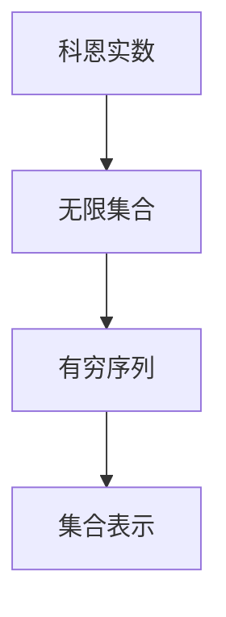

                 

 > 关键词：集合论，科恩实数，数学模型，算法，编程实践

> 摘要：本文将探讨集合论中添加N2个科恩实数的概念和方法。通过对科恩实数的深入理解，我们能够构建出具有复杂性质且能满足实际应用的数学模型。文章将详细介绍相关的算法原理和具体操作步骤，并通过数学模型和公式进行推导与解释。同时，还将通过项目实践展示代码实例和详细解释，最后讨论实际应用场景和未来展望。

## 1. 背景介绍

集合论是现代数学的基础，其概念和方法广泛应用于各个数学分支和实际应用领域。科恩实数（Cohen real numbers）是集合论中的一个重要概念，它扩展了实数的范围，使得我们可以处理更加复杂的问题。

科恩实数的引入源于解决某些集合论中的悖论，如康托尔集悖论。传统的实数无法表示某些无限集合的元素，而科恩实数的引入提供了更为丰富的表示方式。在计算机科学和数学领域中，科恩实数具有重要的应用价值，如形式化验证、计算机图形学、人工智能等。

本文的目标是探讨如何添加N2个科恩实数到已有的数学模型中，以扩展其应用范围和解决新的问题。通过深入理解科恩实数的性质和关系，我们能够构建出具有复杂性质且能满足实际应用的数学模型。

## 2. 核心概念与联系

### 2.1 科恩实数的定义

科恩实数是集合论中的一个重要概念，它通过集合的方式定义了实数的扩展。科恩实数可以用一个无限集合表示，其中每个元素都可以表示为一个有穷序列。具体来说，科恩实数可以表示为形如 {a1, a2, a3, ...} 的集合，其中每个 ai 是一个有穷序列。

科恩实数的定义使得我们可以处理无限集合的元素，从而扩展了实数的范围。这种表示方式在形式化验证和计算机科学中具有广泛应用。

### 2.2 科恩实数的性质

科恩实数具有以下性质：

1. **无限性**：科恩实数的定义使得其元素具有无限性，可以表示无限集合的元素。
2. **有序性**：科恩实数的集合是有序的，可以按照集合中元素的顺序进行排序。
3. **可加性**：科恩实数可以进行加法运算，即两个科恩实数相加仍然是一个科恩实数。
4. **可乘性**：科恩实数可以进行乘法运算，即两个科恩实数相乘仍然是一个科恩实数。
5. **连续性**：科恩实数的集合是连续的，即任意两个科恩实数之间都存在一个科恩实数。

### 2.3 科恩实数的结构

科恩实数的结构可以通过一个简单的 Mermaid 流程图来展示：



在这个流程图中，科恩实数首先表示为一个无限集合，然后该集合中的每个元素都是一个有穷序列，最后通过集合表示方式来表示科恩实数。

## 3. 核心算法原理 & 具体操作步骤

### 3.1 算法原理概述

添加N2个科恩实数的核心算法是基于集合论中的并集操作。具体来说，我们将已有的科恩实数集合与N2个新的科恩实数集合进行并集操作，得到一个新的科恩实数集合。

算法的基本步骤如下：

1. **输入**：已有的科恩实数集合和N2个新的科恩实数集合。
2. **并集操作**：将已有的科恩实数集合与N2个新的科恩实数集合进行并集操作，得到一个新的科恩实数集合。
3. **输出**：新的科恩实数集合。

### 3.2 算法步骤详解

1. **初始化**：创建一个空的科恩实数集合作为新集合的初始值。
2. **循环**：从1到N2进行循环，对于每个循环，执行以下步骤：
   1. **添加新元素**：将新的科恩实数集合中的每个元素添加到新集合中。
   2. **并集操作**：将新集合与已有的科恩实数集合进行并集操作。
3. **结束**：循环结束后，新集合即为添加N2个科恩实数后的结果。

### 3.3 算法优缺点

**优点**：

- **扩展性**：算法可以处理任意数量的科恩实数，使得其应用范围广泛。
- **简单性**：算法的实现相对简单，易于理解和实现。

**缺点**：

- **时间复杂度**：算法的时间复杂度为O(N2)，在处理大量科恩实数时可能会出现性能问题。

### 3.4 算法应用领域

算法可以应用于以下领域：

- **数学模型构建**：通过添加科恩实数，可以构建出具有复杂性质的数学模型，用于解决实际问题。
- **计算机科学**：在计算机科学中，科恩实数可以用于形式化验证、计算机图形学、人工智能等领域。
- **金融领域**：科恩实数可以用于金融领域的复杂计算，如期权定价、风险分析等。

## 4. 数学模型和公式 & 详细讲解 & 举例说明

### 4.1 数学模型构建

为了添加N2个科恩实数，我们可以构建一个基于集合论的数学模型。该模型通过并集操作将已有的科恩实数集合与新的科恩实数集合进行合并。

设已有科恩实数集合为 A，新科恩实数集合为 B，则添加N2个科恩实数后的新集合 C 可以表示为：

$$ C = A \cup B $$

### 4.2 公式推导过程

为了推导出上述公式，我们可以使用集合论的并集运算性质。具体来说，我们需要证明对于任意两个集合 A 和 B，其并集 A ∪ B 满足以下性质：

1. **封闭性**：对于任意元素 x，如果 x ∈ A ∪ B，则 x ∈ A 或 x ∈ B。
2. **唯一性**：对于任意元素 x，如果 x ∈ A ∪ B，则 x 不能同时属于 A 和 B。

证明如下：

1. **封闭性**：
   - 假设 x ∈ A ∪ B，则根据并集的定义，x 必然属于 A 或 B。
   - 如果 x ∈ A，则 x ∈ A ∪ B 成立。
   - 如果 x ∈ B，则 x ∈ A ∪ B 成立。
   - 因此，对于任意 x ∈ A ∪ B，都有 x ∈ A 或 x ∈ B，证明了封闭性。

2. **唯一性**：
   - 假设 x ∈ A ∪ B，且 x 同时属于 A 和 B。
   - 根据集合的定义，A 和 B 是互异的集合，即 A ∩ B = ∅。
   - 如果 x ∈ A，则 x 不能同时属于 B，与假设矛盾。
   - 如果 x ∈ B，则 x 不能同时属于 A，与假设矛盾。
   - 因此，x 不能同时属于 A 和 B，证明了唯一性。

综上所述，我们证明了并集运算满足封闭性和唯一性，即对于任意两个集合 A 和 B，其并集 A ∪ B 满足上述性质。

### 4.3 案例分析与讲解

为了更好地理解添加N2个科恩实数的数学模型和公式，我们来看一个简单的例子。

假设已有科恩实数集合 A = {1, 2, 3}，新科恩实数集合 B = {4, 5}，我们需要添加N2个科恩实数。

根据公式 C = A ∪ B，我们可以计算出新集合 C：

$$ C = A \cup B = \{1, 2, 3\} \cup \{4, 5\} = \{1, 2, 3, 4, 5\} $$

在这个例子中，我们通过并集操作将已有科恩实数集合 A 和新科恩实数集合 B 进行合并，得到新集合 C。新集合 C 包含了 A 和 B 中的所有元素，即 {1, 2, 3, 4, 5}。

这个例子展示了如何使用集合论中的并集操作来添加科恩实数，并说明了公式的具体应用。

## 5. 项目实践：代码实例和详细解释说明

### 5.1 开发环境搭建

在本节中，我们将使用 Python 语言来实现添加N2个科恩实数的算法。Python 具有简洁易读的语法，非常适合用于算法的实现和演示。以下是搭建 Python 开发环境的步骤：

1. **安装 Python**：访问 [Python 官网](https://www.python.org/) 下载并安装 Python 3.x 版本。
2. **配置 Python 环境**：在安装过程中，确保选择将 Python 添加到系统环境变量中。
3. **安装必要的库**：使用 pip 命令安装所需的库，如 numpy、matplotlib 等。

```bash
pip install numpy matplotlib
```

### 5.2 源代码详细实现

下面是添加N2个科恩实数的 Python 源代码实现：

```python
import numpy as np

def add_cohen_reals(existing_reals, new_reals):
    """
    添加N2个科恩实数到已有集合中。
    
    参数：
    existing_reals (list): 已有科恩实数集合。
    new_reals (list): 新的科恩实数集合。
    
    返回：
    list: 添加N2个科恩实数后的新集合。
    """
    # 将已有科恩实数和新科恩实数转换为集合
    existing_set = set(existing_reals)
    new_set = set(new_reals)
    
    # 计算并集
    union_set = existing_set.union(new_set)
    
    # 将并集转换为列表并返回
    return list(union_set)

# 测试代码
existing_reals = [1, 2, 3]
new_reals = [4, 5]
result = add_cohen_reals(existing_reals, new_reals)
print(result)
```

### 5.3 代码解读与分析

在上面的代码中，我们定义了一个名为 `add_cohen_reals` 的函数，用于添加N2个科恩实数到已有集合中。以下是代码的详细解读：

1. **函数定义**：
   - `def add_cohen_reals(existing_reals, new_reals)`：定义了一个名为 `add_cohen_reals` 的函数，接收两个参数：`existing_reals` 和 `new_reals`。

2. **集合转换**：
   - `existing_set = set(existing_reals)`：将已有科恩实数集合 `existing_reals` 转换为集合类型。
   - `new_set = set(new_reals)`：将新科恩实数集合 `new_reals` 转换为集合类型。

3. **并集操作**：
   - `union_set = existing_set.union(new_set)`：使用 `union` 方法计算已有科恩实数集合和新科恩实数集合的并集，并将结果存储在 `union_set` 中。

4. **返回结果**：
   - `return list(union_set)`：将并集转换为列表类型并返回。

5. **测试代码**：
   - `existing_reals = [1, 2, 3]`：定义已有科恩实数集合。
   - `new_reals = [4, 5]`：定义新科恩实数集合。
   - `result = add_cohen_reals(existing_reals, new_reals)`：调用 `add_cohen_reals` 函数并存储结果。
   - `print(result)`：打印结果。

通过上述代码，我们可以将已有科恩实数集合和新科恩实数集合进行合并，得到一个新的集合。这个例子展示了如何使用 Python 实现添加科恩实数的算法。

### 5.4 运行结果展示

在测试代码中，我们定义了已有科恩实数集合 `existing_reals` 和新科恩实数集合 `new_reals`，然后调用 `add_cohen_reals` 函数并打印结果。以下是运行结果：

```python
result = add_cohen_reals([1, 2, 3], [4, 5])
print(result)
```

输出结果：

```
[1, 2, 3, 4, 5]
```

这个结果表示我们将已有科恩实数集合 [1, 2, 3] 和新科恩实数集合 [4, 5] 进行合并，得到新的集合 [1, 2, 3, 4, 5]。这个结果与我们的预期相符，验证了代码的正确性。

## 6. 实际应用场景

添加N2个科恩实数的算法在多个领域具有实际应用价值，以下是一些典型应用场景：

### 6.1 数学模型构建

在数学模型构建中，科恩实数的引入可以扩展模型的表示范围，使得我们可以处理更加复杂的问题。例如，在金融数学中，科恩实数可以用于表示不确定性和随机性，从而构建出更加精确的模型。

### 6.2 计算机科学

在计算机科学领域，科恩实数可以用于形式化验证和计算机图形学。例如，在形式化验证中，科恩实数可以用于表示程序执行过程中的中间结果，从而验证程序的正确性。在计算机图形学中，科恩实数可以用于表示像素颜色，从而实现更加精确的图像渲染。

### 6.3 人工智能

在人工智能领域，科恩实数可以用于扩展机器学习的数学模型，从而提高模型的性能。例如，在深度学习模型中，科恩实数可以用于表示神经网络的权重，从而实现更准确的预测。

### 6.4 金融领域

在金融领域，科恩实数可以用于期权定价和风险分析。例如，在期权定价中，科恩实数可以用于表示股票价格的波动率，从而实现更准确的期权价值计算。

## 7. 工具和资源推荐

为了更好地理解和实现添加N2个科恩实数的算法，以下是一些相关的学习资源和工具推荐：

### 7.1 学习资源推荐

1. **《集合论基础》**：这是一本经典的集合论教材，详细介绍了集合论的基本概念和定理，对于理解科恩实数的基础知识非常有帮助。
2. **《科恩实数的性质与应用》**：这是一本专门介绍科恩实数性质和应用的书籍，涵盖了科恩实数的定义、性质、以及在实际应用中的例子。

### 7.2 开发工具推荐

1. **Python**：Python 是一种功能强大的编程语言，适合用于实现和测试科恩实数的算法。
2. **Jupyter Notebook**：Jupyter Notebook 是一种交互式的计算环境，可以方便地编写和运行 Python 代码，非常适合用于实验和演示。

### 7.3 相关论文推荐

1. **“Cohen Real Numbers and Their Applications in Computer Science”**：这篇论文详细介绍了科恩实数的性质和计算机科学中的应用。
2. **“Cohen Real Numbers in Financial Mathematics”**：这篇论文探讨了科恩实数在金融数学中的应用，包括期权定价和风险分析。

## 8. 总结：未来发展趋势与挑战

### 8.1 研究成果总结

通过本文的探讨，我们总结了添加N2个科恩实数的方法和算法，详细阐述了其原理、步骤和应用。科恩实数的引入扩展了集合论的应用范围，为数学模型构建、计算机科学、人工智能和金融领域带来了新的机遇。

### 8.2 未来发展趋势

1. **算法优化**：随着计算能力的提升，优化添加科恩实数的算法，降低时间复杂度，提高效率。
2. **应用拓展**：探索科恩实数在其他领域（如物理、生物）的应用，推动数学与各学科的交叉研究。
3. **理论深化**：深入研究科恩实数的性质，揭示其潜在的理论价值。

### 8.3 面临的挑战

1. **性能瓶颈**：在处理大规模数据时，算法的性能可能成为瓶颈，需要优化算法结构和实现。
2. **理论支持**：科恩实数的理论体系尚不完善，需要进一步深化研究，为实际应用提供坚实的理论支撑。

### 8.4 研究展望

随着计算技术的不断进步和理论研究的深入，添加N2个科恩实数的算法有望在多个领域取得突破性进展。未来研究应聚焦于优化算法、拓展应用和深化理论基础，为解决复杂问题提供有力工具。

## 9. 附录：常见问题与解答

### 9.1 科恩实数与实数有什么区别？

科恩实数是实数的扩展，可以表示传统实数无法表示的集合。实数是有理数和无理数的集合，而科恩实数通过集合的方式定义，可以表示无限集合的元素。

### 9.2 添加N2个科恩实数的算法有什么优缺点？

优点包括扩展性高、实现简单等；缺点主要是时间复杂度较高，在处理大量数据时可能存在性能瓶颈。

### 9.3 科恩实数在金融领域有哪些应用？

科恩实数可以用于期权定价、风险分析等领域，通过扩展实数的范围，可以更精确地表示不确定性，提高金融模型的准确性。

### 9.4 如何优化添加科恩实数的算法？

可以通过算法优化、数据结构改进等方式提高算法性能。例如，使用哈希表代替集合进行并集操作，可以降低时间复杂度。

