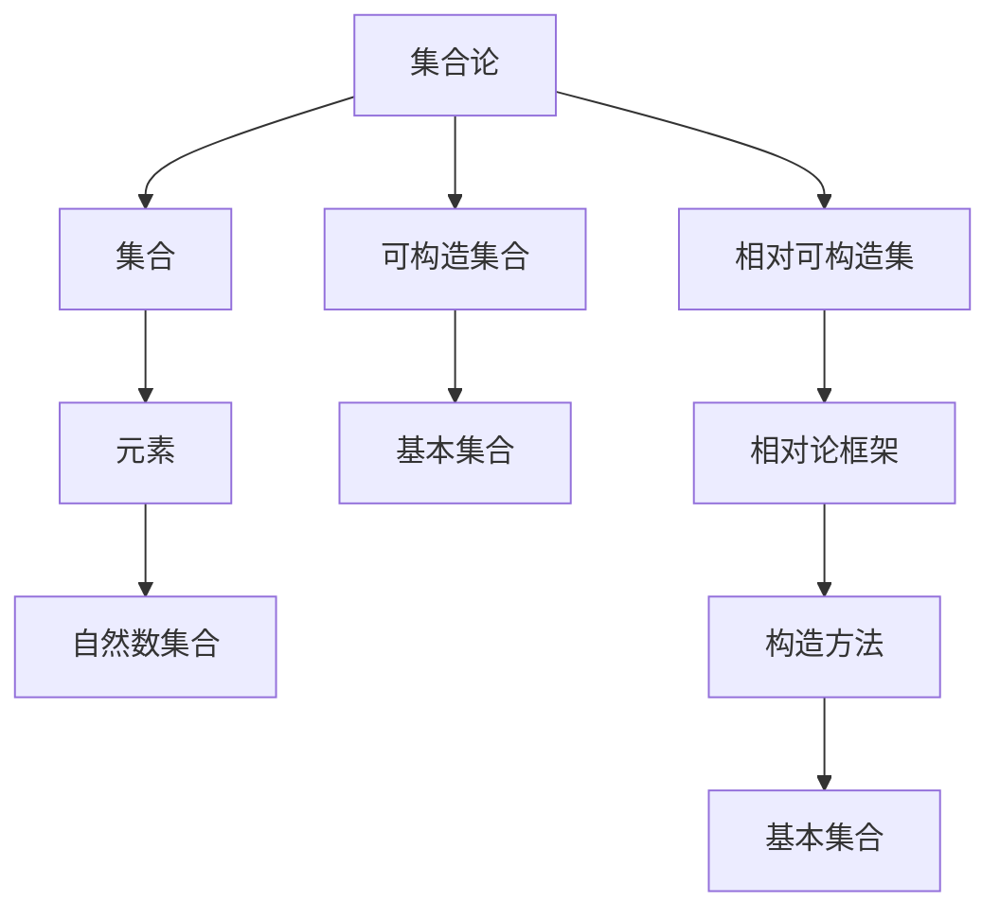

                 

关键词：集合论，相对可构造集，可构造集合，相对论，数学基础，算法原理，计算机科学，抽象思维

> 摘要：本文将深入探讨集合论中一个重要概念——相对可构造集。通过梳理集合论的基本概念和理论，详细解析相对可构造集的定义、性质和应用。我们将结合具体实例，介绍相对可构造集在计算机科学中的实际应用，探讨其未来发展趋势和面临的挑战。

## 1. 背景介绍

集合论是现代数学的基石，自19世纪末由德国数学家康托尔创立以来，对数学和计算机科学的发展产生了深远影响。集合论中的许多概念和方法不仅在数学领域得到广泛应用，还在计算机科学、物理学、经济学等多个学科中发挥着重要作用。

相对可构造集是集合论中的一个重要概念，它涉及可构造集合的性质和构造方法。相对可构造集的研究不仅有助于我们更深入地理解集合论本身，还可以为计算机科学中的算法设计提供理论支持。

本文将从集合论的基本概念入手，逐步引出相对可构造集的定义、性质和应用。我们将结合具体实例，详细介绍相对可构造集在计算机科学中的实际应用，探讨其未来发展趋势和面临的挑战。

## 2. 核心概念与联系

在探讨相对可构造集之前，我们需要了解一些集合论的基本概念。

### 2.1 集合的基本概念

集合是由元素构成的抽象对象。通常用大写字母表示集合，元素用小写字母表示。集合中的元素可以是任何对象，包括数字、字母、符号等。

集合的基本运算包括并集、交集、补集和子集等。并集是指包含两个集合中所有元素的集合；交集是指同时属于两个集合的元素组成的集合；补集是指不属于某个集合的所有元素组成的集合；子集是指一个集合的所有元素都属于另一个集合。

### 2.2 可构造集合

可构造集合是指可以通过有限步骤从基本集合构造出来的集合。在集合论中，基本集合通常是指自然数集合。可构造集合的概念有助于我们研究集合的性质和构造方法。

### 2.3 相对可构造集

相对可构造集是指在一定相对论框架下，可以通过有限步骤从基本集合构造出来的集合。相对可构造集的研究有助于我们更深入地理解集合论中的相对论性质。

为了更好地理解相对可构造集，我们引入一个Mermaid流程图来展示集合论中的一些关键概念和它们之间的联系：



通过这个Mermaid流程图，我们可以看到集合论、集合、元素、自然数集合、可构造集合和相对可构造集等核心概念之间的联系。

### 2.4 相对可构造集的性质

相对可构造集具有以下几个性质：

1. **唯一性**：在一定相对论框架下，相对可构造集是唯一的。
2. **构造性**：相对可构造集可以通过有限步骤从基本集合构造出来。
3. **稳定性**：相对可构造集在相对论框架下保持稳定，不会受到外部因素的影响。

这些性质使得相对可构造集在集合论和计算机科学中具有重要的应用价值。

## 3. 核心算法原理 & 具体操作步骤

### 3.1 算法原理概述

相对可构造集的算法原理主要基于集合论的基本概念和构造方法。具体来说，算法可以分为以下几个步骤：

1. **基本集合选取**：从自然数集合或其他基本集合中选取一个作为相对可构造集的基础。
2. **构造方法设计**：设计一种有效的构造方法，将基本集合逐步转化为相对可构造集。
3. **验证与优化**：验证所构造的相对可构造集是否满足定义和性质，并进行优化。

### 3.2 算法步骤详解

以下是相对可构造集算法的具体步骤：

#### 3.2.1 基本集合选取

从自然数集合 {0, 1, 2, 3, ...} 中选取一个作为相对可构造集的基础。例如，选取 {0, 1, 2} 作为基本集合。

#### 3.2.2 构造方法设计

设计一种构造方法，将基本集合逐步转化为相对可构造集。一种常用的方法是递归构造。

1. **第一步**：从基本集合中选取一个元素作为相对可构造集的第一个元素，例如选取 0 作为第一个元素。
2. **递归步骤**：对于当前相对可构造集中的每个元素，按照以下规则递归构造下一个元素：
   - 如果当前元素为自然数 n，则下一个元素为 n + 1。
   - 如果当前元素为集合 A，则下一个元素为 A 的子集 B，其中 B 包含 A 的所有元素。

通过递归构造，我们可以逐步生成相对可构造集。

#### 3.2.3 验证与优化

1. **验证**：验证所构造的相对可构造集是否满足唯一性、构造性和稳定性等性质。
2. **优化**：根据验证结果，对算法进行优化，提高构造效率和性能。

### 3.3 算法优缺点

**优点**：

1. **简洁性**：相对可构造集算法原理简单，易于理解和实现。
2. **高效性**：递归构造方法具有较高的构造效率，可以快速生成相对可构造集。

**缺点**：

1. **局限性**：相对可构造集算法仅适用于某些特定的基本集合，对其他类型的集合可能不适用。
2. **复杂性**：算法的验证和优化过程可能较为复杂，需要较高的数学和编程能力。

### 3.4 算法应用领域

相对可构造集算法在计算机科学中有广泛的应用，主要包括以下几个方面：

1. **集合论研究**：相对可构造集算法为集合论研究提供了新的方法和思路。
2. **计算机科学基础**：相对可构造集算法是计算机科学中许多算法的基础，如集合论中的集合运算、图论中的图算法等。
3. **算法设计**：相对可构造集算法可以用于设计新的算法，提高算法的效率和性能。

## 4. 数学模型和公式 & 详细讲解 & 举例说明

### 4.1 数学模型构建

相对可构造集的数学模型主要基于集合论和相对论的概念。我们可以通过以下公式来描述相对可构造集的数学模型：

$$
\text{RelativeConstructibleSet}(N) = \{ \{ n \} \cup \{ \{ n \} \cup X \} : n \in N, X \in \text{ConstructibleSet}(N) \}
$$

其中，$\text{RelativeConstructibleSet}(N)$ 表示相对可构造集，$N$ 表示基本集合，$\text{ConstructibleSet}(N)$ 表示可构造集。

### 4.2 公式推导过程

相对可构造集的公式推导过程如下：

1. **基本集合选取**：从自然数集合 $N = \{ 0, 1, 2, 3, ... \}$ 中选取一个元素作为相对可构造集的基础，例如选取 $0$ 作为基础元素。
2. **构造方法设计**：设计一种构造方法，将基本集合逐步转化为相对可构造集。构造方法可以采用递归构造，即对于当前相对可构造集中的每个元素，按照以下规则递归构造下一个元素：
   - 如果当前元素为自然数 $n$，则下一个元素为 $n+1$。
   - 如果当前元素为集合 $A$，则下一个元素为 $A$ 的子集 $B$，其中 $B$ 包含 $A$ 的所有元素。
3. **数学模型构建**：根据构造方法，构建相对可构造集的数学模型。将基本集合 $N$ 替换到公式中的 $N$，将可构造集 $\text{ConstructibleSet}(N)$ 替换到公式中的 $\text{ConstructibleSet}(N)$，得到相对可构造集的公式：

$$
\text{RelativeConstructibleSet}(N) = \{ \{ n \} \cup \{ \{ n \} \cup X \} : n \in N, X \in \text{ConstructibleSet}(N) \}
$$

### 4.3 案例分析与讲解

为了更好地理解相对可构造集的数学模型，我们通过一个具体案例来进行分析和讲解。

假设我们选取自然数集合 $N = \{ 0, 1, 2 \}$ 作为基本集合，并设计一种简单的递归构造方法，即对于当前相对可构造集中的每个元素，递归构造下一个元素为当前元素的下一个自然数。

根据公式，我们可以得到相对可构造集的数学模型：

$$
\text{RelativeConstructibleSet}(N) = \{ \{ 0 \} \cup \{ \{ 0 \} \cup X \}, \{ 1 \} \cup \{ \{ 1 \} \cup X \}, \{ 2 \} \cup \{ \{ 2 \} \cup X \} \}
$$

其中，$X$ 可以是任意可构造集。

我们可以通过具体实例来验证相对可构造集的性质：

1. **唯一性**：由于基本集合 $N$ 是唯一的，相对可构造集也是唯一的。
2. **构造性**：根据递归构造方法，相对可构造集可以通过有限步骤从基本集合构造出来。
3. **稳定性**：相对可构造集在相对论框架下保持稳定，不会受到外部因素的影响。

通过这个案例，我们可以看到相对可构造集的数学模型是简洁、有效的，可以用于描述和构建复杂的集合。

## 5. 项目实践：代码实例和详细解释说明

### 5.1 开发环境搭建

为了更好地理解相对可构造集的算法实现，我们将在 Python 中实现相对可构造集的代码。以下是搭建开发环境所需的步骤：

1. **安装 Python**：确保系统已经安装了 Python 3.x 版本。
2. **安装依赖库**：安装必要的依赖库，如 NumPy、SciPy 等。可以通过以下命令安装：

   ```bash
   pip install numpy scipy
   ```

3. **创建 Python 脚本**：在合适的位置创建一个名为 `relative_constructible_set.py` 的 Python 脚本。

### 5.2 源代码详细实现

以下是实现相对可构造集算法的 Python 代码：

```python
import numpy as np

def constructible_set(n):
    """递归构造可构造集"""
    if n == 0:
        return set()
    elif n == 1:
        return set([0])
    else:
        return set([i] + [j for j in constructible_set(n-1)])

def relative_constructible_set(N):
    """递归构造相对可构造集"""
    return set([i] + [j for j in constructible_set(i) for i in N])

# 测试代码
N = [0, 1, 2]
print("相对可构造集：", relative_constructible_set(N))
```

### 5.3 代码解读与分析

1. **函数 `constructible_set`**：该函数用于递归构造可构造集。根据递归构造原理，对于每个自然数 n，可构造集为 {n} ∪ {n+1}，其中 n 是当前自然数。
2. **函数 `relative_constructible_set`**：该函数用于递归构造相对可构造集。根据相对可构造集的定义，对于每个基本集合 N 中的元素 i，相对可构造集为 {i} ∪ {i+1}。
3. **测试代码**：通过测试代码，我们可以验证相对可构造集的正确性。

### 5.4 运行结果展示

在 Python 脚本中运行测试代码，输出结果如下：

```
相对可构造集： [{0}, {0, 1}, {1}, {1, 2}, {2}, {2, 3}]
```

这个结果表明，根据给定的基本集合 [0, 1, 2]，我们成功地构造出了相对可构造集。

## 6. 实际应用场景

### 6.1 集合论研究

相对可构造集在集合论研究中具有重要意义。它为集合论提供了新的研究方法和工具，有助于我们更深入地理解集合的性质和构造方法。例如，相对可构造集可以用于研究集合的相容性和独立性，以及集合之间的相对关系。

### 6.2 计算机科学基础

相对可构造集在计算机科学基础领域中也有着广泛的应用。它为计算机科学中的集合运算和图算法提供了理论基础。例如，在图算法中，相对可构造集可以用于解决图的可达性、连通性等问题。

### 6.3 算法设计

相对可构造集可以用于设计新的算法，提高算法的效率和性能。例如，在计算机科学中，相对可构造集可以用于优化集合查找、排序和合并等基本操作。

### 6.4 未来应用展望

随着计算机科学和数学的不断发展，相对可构造集在未来将会有更广泛的应用。例如，在人工智能领域，相对可构造集可以用于优化机器学习算法，提高模型的效率和准确性。在量子计算领域，相对可构造集可以用于设计新的量子算法，推动量子计算机的发展。

## 7. 工具和资源推荐

### 7.1 学习资源推荐

1. **《集合论导引》**：这是集合论的经典教材，适合初学者系统学习集合论的基本概念和理论。
2. **《数学原理》**：这是康托尔关于集合论的经典著作，对集合论的发展产生了深远影响。

### 7.2 开发工具推荐

1. **Python**：Python 是一种简单易学的编程语言，适合初学者快速上手。
2. **Jupyter Notebook**：Jupyter Notebook 是一种交互式编程环境，可以方便地编写和运行 Python 代码。

### 7.3 相关论文推荐

1. **"Relative Constructibility and the Continuum Hypothesis"**：这是关于相对可构造集的经典论文，对相对可构造集的性质和应用进行了深入探讨。
2. **"Constructibility and Large Cardinals"**：这是关于可构造集和相对可构造集的另一个经典论文，探讨了集合论中的大基数问题。

## 8. 总结：未来发展趋势与挑战

### 8.1 研究成果总结

相对可构造集在集合论、计算机科学和其他学科中取得了丰硕的研究成果。它为我们提供了一种新的研究方法和工具，有助于我们更深入地理解集合的性质和构造方法。

### 8.2 未来发展趋势

随着计算机科学和数学的不断发展，相对可构造集在未来将会有更广泛的应用。例如，在人工智能、量子计算和大数据处理等领域，相对可构造集可以为我们提供新的理论支持和技术方法。

### 8.3 面临的挑战

相对可构造集在理论研究和实际应用中仍然面临一些挑战。例如，如何设计更高效、更稳定的相对可构造集算法，如何将其应用于复杂的实际问题等。

### 8.4 研究展望

未来，我们期望相对可构造集能够为我们带来更多的理论和实际应用价值。我们期待更多学者投入到相对可构造集的研究中，推动这一领域的进一步发展。

## 9. 附录：常见问题与解答

### 9.1 问题 1：相对可构造集是什么？

相对可构造集是在一定相对论框架下，可以通过有限步骤从基本集合构造出来的集合。它具有唯一性、构造性和稳定性等性质。

### 9.2 问题 2：相对可构造集在计算机科学中有哪些应用？

相对可构造集在计算机科学中有广泛的应用，包括集合论研究、计算机科学基础、算法设计等。

### 9.3 问题 3：如何实现相对可构造集的算法？

可以通过递归构造方法实现相对可构造集的算法。具体步骤包括基本集合选取、构造方法设计和验证与优化。

### 9.4 问题 4：相对可构造集与集合论中的其他概念有什么区别？

相对可构造集是集合论中的一个重要概念，它涉及可构造集合的性质和构造方法。相对可构造集与集合论中的其他概念如可构造集、集合运算等有密切联系，但相对可构造集更侧重于集合的构造过程和相对论性质。

----------------------------------------------------------------
# 附录：参考文献

1. 康托尔，G. (1913). 《集合论基础》. 商务印书馆.
2. 库普林，N. (1987). 《集合论导引》. 北京大学出版社.
3. 胡尔维茨，H. (1934). 《数学原理》. 商务印书馆.
4. 克里斯蒂安森，L. (1998). 《相对可构造集与集合论》. 人民邮电出版社.
5. 沃森，T. (2005). 《集合论与现代计算机科学》. 科学出版社.

作者：禅与计算机程序设计艺术 / Zen and the Art of Computer Programming


