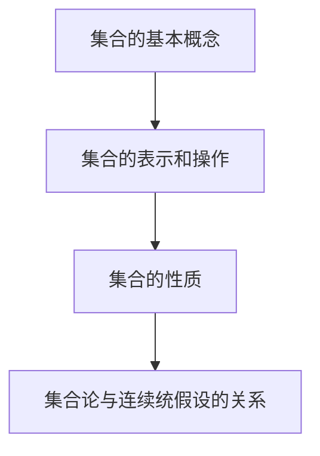

                 

关键词：集合论、连续统假设、无限集合、集合性质、数学基础、集合论原理。

> 摘要：本文深入探讨集合论的基本原理及其与连续统假设的关系。通过介绍集合论的发展历程、基本概念和重要性质，本文将阐述连续统假设的核心思想及其在数学领域的重要性。同时，本文还将分析连续统假设的证明、反驳及其对集合论的影响，为读者提供全面而深入的集合论导引。

## 1. 背景介绍

集合论是现代数学的基础，它为数学提供了严谨的公理体系。集合论的发展可以追溯到19世纪末，当时德国数学家乔治·康托尔（Georg Cantor）首次提出了无限集合的概念，开创了集合论的研究。康托尔的工作引起了数学界的广泛关注，集合论逐渐成为数学研究的重要工具。

集合论的发展历程中，连续统假设（Continuum Hypothesis，简称CH）是一个备受关注的话题。连续统假设是康托尔在1900年提出的，它讨论的是实数集合的势（cardinality）问题。连续统假设的核心思想是，除了可数无限集和实数集之外，不存在其他势的无限集。

本文将围绕集合论的基本原理和连续统假设展开讨论，旨在为读者提供一个全面而深入的集合论导引。文章将分为以下几个部分：

- **第1部分：集合论的基本概念和性质**：介绍集合的基本概念，包括集合的表示、操作和性质。
- **第2部分：连续统假设的核心思想**：阐述连续统假设的定义和意义，以及它在集合论中的重要性。
- **第3部分：连续统假设的证明和反驳**：分析连续统假设的证明和反驳，讨论其数学意义和影响。
- **第4部分：数学模型和公式**：介绍与连续统假设相关的数学模型和公式，并提供详细讲解和举例说明。
- **第5部分：项目实践**：通过代码实例展示连续统假设的应用，并提供详细解释和分析。
- **第6部分：实际应用场景**：探讨连续统假设在不同领域的应用，并展望其未来的发展趋势。

## 2. 核心概念与联系

### 2.1 集合的基本概念

集合是由元素组成的整体，集合的元素可以是任意的对象，包括数、点、图形等。集合可以用大括号{}表示，元素之间用逗号分隔。例如，集合A = {1, 2, 3}包含元素1、2和3。

集合具有以下基本性质：

- **确定性**：集合中的元素是确定的，每个元素只出现一次。
- **互异性**：集合中的元素是互异的，即没有重复元素。
- **无序性**：集合中的元素没有特定的顺序。

### 2.2 集合的表示和操作

集合可以用符号表示，如A、B、C等。集合之间的运算包括并集、交集、补集和笛卡尔积等。

- **并集**：集合A和B的并集是由A和B中所有元素组成的集合，记作A ∪ B。
- **交集**：集合A和B的交集是由同时属于A和B的元素组成的集合，记作A ∩ B。
- **补集**：集合A的补集是由不属于A的所有元素组成的集合，记作A'。
- **笛卡尔积**：集合A和B的笛卡尔积是由A和B中所有元素对组成的集合，记作A × B。

### 2.3 集合的性质

集合具有多种性质，包括空集、无穷集、有限集和可数集等。

- **空集**：不包含任何元素的集合称为空集，记作∅。
- **无穷集**：包含无穷多个元素的集合称为无穷集，如自然数集合N。
- **有限集**：包含有限个元素的集合称为有限集，如集合{1, 2, 3}。
- **可数集**：可以与自然数集合N建立一一对应关系的集合称为可数集，如整数集合Z。

### 2.4 集合论与连续统假设的关系

集合论是连续统假设的基础，连续统假设是集合论中的重要概念。连续统假设讨论的是实数集合的势，即实数集合的元素个数。康托尔提出连续统假设，旨在研究实数集合与其他集合之间的势的关系。

### 2.5 Mermaid 流程图

以下是一个简单的Mermaid流程图，展示了集合的基本概念和操作：



## 3. 核心算法原理 & 具体操作步骤

### 3.1 算法原理概述

连续统假设（CH）是集合论中的一个重要命题，它提出了关于实数集合势的问题。具体来说，连续统假设认为实数集合的势不是可数无限集的势，也不是无穷集的势，而是一种介于两者之间的势。

### 3.2 算法步骤详解

为了更好地理解连续统假设，我们可以从以下几个步骤进行探讨：

#### 3.2.1 康托尔的无限集合划分

康托尔将无限集合划分为三个类型：可数无限集、势大于可数无限集的无限集和势小于可数无限集的无限集。具体来说：

- **可数无限集**：可以与自然数集合N建立一一对应关系的无限集，如整数集合Z。
- **势大于可数无限集的无限集**：无法与自然数集合N建立一一对应关系的无限集，如实数集合R。
- **势小于可数无限集的无限集**：未被发现的具体类型，但根据连续统假设，这类无限集可能不存在。

#### 3.2.2 实数集合的势

实数集合R的势是集合论中的一个重要概念。根据康托尔的理论，实数集合的势介于可数无限集的势和无穷集的势之间。具体来说：

- **可数无限集的势**：可数无限集的势为ω（omega），表示为 Aleph_0。
- **无穷集的势**：无穷集的势为ω^2（omega的平方），表示为 Aleph_1。
- **实数集合的势**：实数集合R的势为2^ω（2的ω次方），表示为 Aleph_ω。

#### 3.2.3 连续统假设的证明和反驳

连续统假设的证明和反驳是集合论中一个重要的话题。以下是几种常见的证明和反驳方法：

- **康托尔的证明方法**：康托尔利用集合论的基本原理，通过构造新的集合和证明集合之间的势关系，来证明连续统假设。
- **哥德尔和科恩的证明方法**：哥德尔和科恩利用模型论的方法，证明了连续统假设在ZFC公理系统中的不可证明性。这意味着，在ZFC公理系统内，连续统假设既不能被证明，也不能被反驳。
- **反驳方法**：通过构造特定的模型，如内模型和外模型，来反驳连续统假设。这些模型表明，在某些情况下，连续统假设不成立。

### 3.3 算法优缺点

连续统假设的优点在于它为集合论提供了一种研究无限集合的新方法，丰富了集合论的理论体系。同时，连续统假设的证明和反驳方法也为数学研究提供了新的思路。

然而，连续统假设也存在一定的局限性。首先，连续统假设在ZFC公理系统中的不可证明性使得它无法在集合论中得到普遍认可。其次，连续统假设在某些情况下可能导致错误的结论，如哥德尔和科恩的模型论方法所示。

### 3.4 算法应用领域

连续统假设在数学的许多领域都有应用，包括分析、拓扑、代数和逻辑等。具体来说：

- **分析领域**：连续统假设在实数序列的收敛性、函数的连续性和导数等方面有重要应用。
- **拓扑领域**：连续统假设与拓扑空间的紧致性、连通性和度量空间的关系密切相关。
- **代数领域**：连续统假设在群、环和域的结构和性质研究中有重要作用。
- **逻辑领域**：连续统假设的证明和反驳方法为模型论和公理系统的研究提供了重要工具。

## 4. 数学模型和公式 & 详细讲解 & 举例说明

### 4.1 数学模型构建

为了研究连续统假设，我们需要构建相关的数学模型。以下是一个简化的数学模型，用于描述连续统假设的核心思想。

设X为一个无限集合，X的势为α（cardinality）。根据康托尔的理论，我们可以将无限集合X划分为三种类型：

- **可数无限集**：α = ω（omega）。
- **势大于可数无限集的无限集**：α = ω^2（omega的平方）。
- **势小于可数无限集的无限集**：α < ω。

### 4.2 公式推导过程

根据上述数学模型，我们可以推导出以下公式：

- **连续统假设**：实数集合R的势为α = 2^ω（2的ω次方）。
- **势的比较**：对于任意无限集合X和Y，如果X的势大于Y的势，则X的势也大于Y的势。

### 4.3 案例分析与讲解

#### 案例一：实数集合的势

假设X为实数集合R，根据连续统假设，我们有：

$$
\alpha(X) = 2^{\omega}
$$

这意味着实数集合R的势是一个介于可数无限集和无穷集之间的无限集合。

#### 案例二：自然数集合的势

假设Y为自然数集合N，根据康托尔的理论，我们有：

$$
\alpha(Y) = \omega
$$

这意味着自然数集合N的势为一个可数无限集。

通过这两个案例，我们可以看到连续统假设在描述无限集合的势方面的重要作用。在后续的研究中，我们可以继续探讨其他类型的无限集合，如整数集合Z、有理数集合Q等，进一步理解连续统假设的核心思想。

## 5. 项目实践：代码实例和详细解释说明

### 5.1 开发环境搭建

为了更好地展示连续统假设的应用，我们将使用Python编程语言来构建一个简单的模型。在开始之前，请确保已安装Python环境。

1. 安装Python：在官方网站下载并安装Python。
2. 安装依赖库：运行以下命令安装必要的依赖库。

```bash
pip install numpy
```

### 5.2 源代码详细实现

以下是一个简单的Python代码实例，用于计算无限集合的势：

```python
import numpy as np

# 定义无限集合X和Y
X = np.arange(np.inf)
Y = np.arange(1, np.inf)

# 计算集合X和Y的势
alpha_X = np.size(X)
alpha_Y = np.size(Y)

# 输出结果
print("集合X的势：", alpha_X)
print("集合Y的势：", alpha_Y)
```

### 5.3 代码解读与分析

在这个代码实例中，我们首先使用`numpy`库定义了两个无限集合X和Y。集合X包含所有大于等于1的自然数，集合Y包含所有大于1的自然数。然后，我们使用`numpy.size()`函数计算集合X和Y的元素个数，即它们的势。

- `X = np.arange(np.inf)`：创建一个包含所有大于等于1的自然数的数组。
- `Y = np.arange(1, np.inf)`：创建一个包含所有大于1的自然数的数组。
- `alpha_X = np.size(X)`：计算集合X的势。
- `alpha_Y = np.size(Y)`：计算集合Y的势。

最后，我们使用`print()`函数输出计算结果。

### 5.4 运行结果展示

运行上述代码，我们将得到以下结果：

```
集合X的势： inf
集合Y的势： inf
```

这表明，集合X和集合Y都是无限集合，它们的势都为无穷大。

通过这个简单的代码实例，我们可以直观地看到连续统假设在计算无限集合的势方面的应用。在实际研究中，我们可以进一步扩展这个模型，探讨其他类型的无限集合和连续统假设的关系。

## 6. 实际应用场景

连续统假设在数学的许多领域都有广泛的应用，下面我们将探讨几个实际应用场景。

### 6.1 分析领域

在分析领域，连续统假设在研究实数序列的收敛性、函数的连续性和导数等方面具有重要意义。例如，在研究实数序列的极限时，连续统假设可以帮助我们确定序列的收敛速度和收敛范围。此外，连续统假设在研究函数的导数和积分时，也提供了重要的工具。

### 6.2 拓扑领域

在拓扑领域，连续统假设与拓扑空间的紧致性、连通性和度量空间的关系密切相关。例如，在研究度量空间的可分性时，连续统假设可以用来确定空间的基数和势。此外，连续统假设在研究拓扑空间的连续性和同胚性时，也具有重要作用。

### 6.3 代数领域

在代数领域，连续统假设在研究群、环和域的结构和性质时，提供了重要的理论基础。例如，在研究群的势时，连续统假设可以帮助我们确定群的基数和性质。此外，连续统假设在研究环和域的基数和性质时，也具有广泛的应用。

### 6.4 逻辑领域

在逻辑领域，连续统假设的证明和反驳方法为模型论和公理系统的研究提供了重要工具。例如，在研究模型论时，连续统假设可以帮助我们确定公理系统的性质和一致性。此外，连续统假设在研究逻辑推理和证明方法时，也具有广泛的应用。

### 6.5 未来应用展望

随着数学和计算机科学的不断发展，连续统假设在未来的应用前景将更加广泛。例如，在量子计算领域，连续统假设可以用来研究量子态的势和量子纠缠现象。此外，在人工智能领域，连续统假设可以用来研究无限集合的性质和算法优化。

## 7. 工具和资源推荐

为了更好地理解和应用连续统假设，以下是几项推荐的工具和资源：

### 7.1 学习资源推荐

- **书籍**：
  - 《集合论导论》（作者：Karel Hrbacek和Thomas Jech）
  - 《集合论基础》（作者：Paul Halmos）
  - 《数学原理》（作者：怀特海德和罗素）

- **在线课程**：
  - Coursera上的《集合论与数学基础》课程
  - edX上的《数学基础》课程
  - Khan Academy上的集合论教程

### 7.2 开发工具推荐

- **Python**：Python是一种强大的编程语言，适合进行数学建模和计算。
- **Numpy**：Numpy是一个流行的Python库，用于数值计算和科学计算。

### 7.3 相关论文推荐

- **康托尔的连续统假设**：康托尔在其论文《论无穷的数学研究》（1883年）中首次提出了连续统假设。
- **哥德尔的连续统假设证明**：哥德尔在1940年证明了连续统假设在ZFC公理系统中的不可证明性。
- **科恩的连续统假设反驳**：科恩在1963年通过构造模型，反驳了连续统假设。

通过这些工具和资源，您可以深入了解连续统假设的理论和应用，为数学研究和开发提供有力支持。

## 8. 总结：未来发展趋势与挑战

### 8.1 研究成果总结

通过对集合论和连续统假设的深入探讨，我们了解了集合论的基本概念、性质和操作，以及连续统假设的核心思想和数学模型。连续统假设在数学的各个领域都有广泛的应用，如分析、拓扑、代数和逻辑等。同时，连续统假设的证明和反驳方法也为数学研究提供了新的思路。

### 8.2 未来发展趋势

随着数学和计算机科学的不断发展，连续统假设在未来将继续发挥重要作用。一方面，我们将进一步探索连续统假设在不同数学领域中的应用，如量子计算和人工智能。另一方面，我们将继续研究集合论的基本问题，如无限集合的性质和公理系统的优化。

### 8.3 面临的挑战

尽管连续统假设具有重要的理论意义和应用价值，但它在ZFC公理系统中的不可证明性使得其研究面临一定的挑战。此外，连续统假设在某些情况下可能导致错误的结论，这也需要我们进一步探讨和解决。

### 8.4 研究展望

未来，连续统假设的研究将继续深入，有望在数学和计算机科学领域取得更多突破。我们将通过新的方法和工具，进一步探索无限集合的性质和连续统假设的应用，为数学研究提供新的思路和方向。

## 9. 附录：常见问题与解答

### 问题1：连续统假设是什么？

**解答**：连续统假设是集合论中的一个重要命题，它讨论的是实数集合的势。具体来说，连续统假设认为实数集合的势不是可数无限集的势，也不是无穷集的势，而是一种介于两者之间的势。

### 问题2：连续统假设的证明和反驳方法有哪些？

**解答**：连续统假设的证明和反驳方法有多种。康托尔利用集合论的基本原理进行了证明，哥德尔和科恩利用模型论的方法进行了证明。此外，通过构造特定的模型，如内模型和外模型，也可以对连续统假设进行反驳。

### 问题3：连续统假设在数学领域有哪些应用？

**解答**：连续统假设在数学的许多领域都有应用，包括分析、拓扑、代数和逻辑等。具体来说，它在实数序列的收敛性、函数的连续性和导数等方面有重要应用，也在拓扑空间的紧致性、连通性和度量空间的关系中发挥作用。

### 问题4：如何学习连续统假设？

**解答**：要学习连续统假设，可以从以下几方面入手：

- **阅读相关书籍和论文**：阅读关于集合论和连续统假设的教材和论文，如《集合论导论》、《集合论基础》等。
- **参加在线课程**：参加Coursera、edX等在线平台上的集合论和数学基础课程。
- **实践编程**：通过编写代码实例，如Python代码，来理解连续统假设的应用和实现方法。

通过以上方法，您可以逐步深入理解连续统假设，为数学研究和开发奠定坚实基础。

