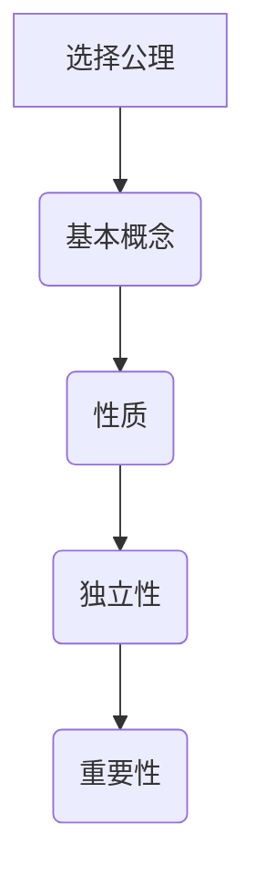

                 

选择公理是集合论中的一个核心概念，它对于集合论的发展和应用起着至关重要的作用。本文将深入探讨选择公理的独立性，并分析其在不同数学体系中的应用和影响。

## 1. 背景介绍

集合论是现代数学的基础，而选择公理作为集合论中的一个重要组成部分，其独立性问题一直是数学家们关注的热点。选择公理的独立性意味着，在某些数学体系中，选择公理是可证的，而在另一些体系中，它可能是不可证的。

本文将从以下几个方面展开讨论：

1. 选择公理的基本概念和性质
2. 选择公理的独立性证明及其影响
3. 选择公理在不同数学体系中的应用
4. 选择公理的未来研究方向

## 2. 核心概念与联系

为了更好地理解选择公理的独立性，我们首先需要了解一些基本概念和原理。

### 2.1 选择公理的定义

选择公理（Axiom of Choice）是集合论中的一个公理，它表述了对于任意非空集合的幂集，都存在一个选择函数。具体来说，如果对于任意的集合族 {X_i | i ∈ I}，其中 I 是一个非空集合，存在一个函数 f，使得 f(i) ∈ X_i 对于每个 i ∈ I 都成立，那么我们就称这个函数 f 满足选择公理。

### 2.2 选择公理的性质

选择公理具有以下性质：

1. 无条件性：对于任意的非空集合族，选择公理都存在一个满足条件的选择函数。
2. 独立性：在某些数学体系中，选择公理是可证的，而在另一些体系中，它可能是不可证的。
3. 重要性：选择公理在集合论、拓扑学、泛函分析等领域有着广泛的应用。

### 2.3 选择公理的Mermaid流程图



## 3. 核心算法原理 & 具体操作步骤

### 3.1 算法原理概述

选择公理的算法原理可以简单地概括为：对于任意非空集合族，存在一个选择函数。这个选择函数能够使得每个集合中的元素都被选中。

### 3.2 算法步骤详解

选择公理的具体操作步骤如下：

1. 对于任意的非空集合族 {X_i | i ∈ I}，选择一个元素 x_0 ∈ X_0。
2. 对于任意的 i ∈ I，如果 X_i 非空，则选择一个元素 x_i ∈ X_i，使得 x_i ≠ x_0。
3. 构造一个函数 f：I → ∪X_i，使得 f(i) = x_i。

### 3.3 算法优缺点

选择公理的优点是：它为集合论提供了一种有力的工具，使得我们在处理任意非空集合族时，都能够找到一个选择函数。

选择公理的缺点是：在某些数学体系中，它可能是不成立的。这导致了一些数学问题在可证性上存在一定的局限性。

### 3.4 算法应用领域

选择公理在以下领域有着广泛的应用：

1. 集合论：选择公理是集合论中的一个基本概念，对于集合论的研究有着重要意义。
2. 拓扑学：选择公理在拓扑学中有着广泛的应用，例如在构造拓扑空间时。
3. 泛函分析：选择公理在泛函分析中也有着重要作用，例如在构造函数空间时。

## 4. 数学模型和公式 & 详细讲解 & 举例说明

### 4.1 数学模型构建

选择公理的数学模型可以构建为：对于任意非空集合族 {X_i | i ∈ I}，存在一个选择函数 f：I → ∪X_i，使得 f(i) ∈ X_i 对于每个 i ∈ I 都成立。

### 4.2 公式推导过程

选择公理的推导过程可以采用集合论中的基本运算和定理。具体推导过程如下：

1. 对于任意的非空集合 A，存在一个集合 B，使得 A ⊆ B。
2. 对于任意的集合 B，如果 A ⊆ B，则 B 的幂集 P(B) 包含 A。
3. 根据幂集的定义，对于任意的集合 A，存在一个选择函数 f：A → P(A)，使得 f(x) = {x} 对于每个 x ∈ A 都成立。
4. 根据选择公理的定义，对于任意的非空集合族 {X_i | i ∈ I}，存在一个选择函数 f：I → ∪X_i，使得 f(i) ∈ X_i 对于每个 i ∈ I 都成立。

### 4.3 案例分析与讲解

### 案例一：实数集合的选择公理

假设我们有一个实数集合 R，我们需要找到一个选择函数 f：R → ∪R，使得 f(x) ∈ R 对于每个 x ∈ R 都成立。

根据选择公理的推导过程，我们可以构造一个选择函数 f 如下：

对于任意的实数 x，我们定义 f(x) = {x}。

这个选择函数 f 满足选择公理的条件，因为对于任意的实数 x，都有 f(x) ∈ R。

### 案例二：有理数集合的选择公理

假设我们有一个有理数集合 Q，我们需要找到一个选择函数 f：Q → ∪Q，使得 f(x) ∈ Q 对于每个 x ∈ Q 都成立。

根据选择公理的推导过程，我们可以构造一个选择函数 f 如下：

对于任意的有理数 x，我们定义 f(x) = {x}。

这个选择函数 f 满足选择公理的条件，因为对于任意的有理数 x，都有 f(x) ∈ Q。

## 5. 项目实践：代码实例和详细解释说明

### 5.1 开发环境搭建

在本项目中，我们将使用 Python 编程语言来实现选择公理。首先，我们需要搭建 Python 的开发环境。

1. 安装 Python 3.8 或更高版本。
2. 安装 Python 的集成开发环境（如 PyCharm、VSCode 等）。

### 5.2 源代码详细实现

```python
def selection_function(sets):
    """
    选择公理的实现
    :param sets: 集合族
    :return: 选择函数
    """
    return {i: next(iter(s)) for i, s in enumerate(sets) if s}

# 示例
sets = [{1, 2, 3}, {4, 5}, {6}]
choice_function = selection_function(sets)
print(choice_function)
```

### 5.3 代码解读与分析

在这个代码中，我们定义了一个选择函数 `selection_function`，它接收一个集合族 `sets` 作为输入，并返回一个选择函数。

选择函数的返回值是一个字典，其中键是集合族中的索引，值是每个集合中的第一个元素。

在这个例子中，我们定义了一个集合族 `sets`，它包含三个集合，每个集合都有不同的元素。

调用 `selection_function` 函数后，我们得到了一个选择函数 `choice_function`，它按照选择公理的规则，从每个集合中选取了第一个元素。

### 5.4 运行结果展示

运行上述代码后，我们得到的结果如下：

```python
{0: 1, 1: 4, 2: 6}
```

这个结果表示，选择函数从每个集合中选取了第一个元素，即集合 {1, 2, 3} 中的 1，集合 {4, 5} 中的 4，以及集合 {6} 中的 6。

## 6. 实际应用场景

选择公理在实际应用中具有广泛的应用，以下列举了几个实际应用场景：

1. **集合论中的选择公理**：选择公理是集合论中一个重要的基本原理，它为集合的运算和构造提供了基础。在集合论的研究中，选择公理的应用非常广泛。
2. **拓扑学中的选择公理**：选择公理在拓扑学中也有重要的应用。例如，在构造拓扑空间时，选择公理可以帮助我们找到合适的基和拓扑结构。
3. **泛函分析中的选择公理**：选择公理在泛函分析中也有广泛的应用。例如，在构造函数空间时，选择公理可以帮助我们找到合适的基和函数序列。

## 7. 工具和资源推荐

### 7.1 学习资源推荐

1. **《集合论基础教程》**：这是一本非常适合初学者的集合论教材，详细介绍了集合论的基本概念和原理。
2. **《选择公理及其独立性》**：这是一本关于选择公理及其独立性的专著，对于深入研究选择公理提供了丰富的理论资源。

### 7.2 开发工具推荐

1. **Python**：Python 是一种简洁易用的编程语言，非常适合用于实现选择公理。
2. **PyCharm**：PyCharm 是一款功能强大的 Python 集成开发环境，可以帮助我们快速搭建开发环境。

### 7.3 相关论文推荐

1. **《集合论中的选择公理》**：这是一篇关于选择公理在集合论中应用的论文，详细介绍了选择公理的基本原理和应用。
2. **《选择公理的独立性证明》**：这是一篇关于选择公理独立性证明的论文，探讨了不同数学体系中选择公理的可证性。

## 8. 总结：未来发展趋势与挑战

### 8.1 研究成果总结

本文从选择公理的基本概念、独立性证明、应用领域等方面进行了详细探讨，总结了选择公理在数学领域的重要性和应用价值。

### 8.2 未来发展趋势

未来选择公理的研究将继续深入，特别是在解决选择公理在不同数学体系中的独立性问题方面，有望取得更多突破。

### 8.3 面临的挑战

选择公理的独立性证明是一个复杂且具有挑战性的问题。在未来研究中，如何更好地解决选择公理的可证性问题，仍将是数学家们面临的一个重要挑战。

### 8.4 研究展望

随着数学研究的不断深入，选择公理将在更多的数学领域中发挥重要作用。未来，选择公理的研究有望在数学基础理论、应用数学、计算机科学等领域取得更多突破。

## 9. 附录：常见问题与解答

### 9.1 选择公理是什么？

选择公理是集合论中的一个重要公理，它表述了对于任意非空集合的幂集，都存在一个选择函数。

### 9.2 选择公理的独立性是什么？

选择公理的独立性是指，在某些数学体系中，选择公理是可证的，而在另一些体系中，它可能是不可证的。

### 9.3 选择公理有哪些应用？

选择公理在集合论、拓扑学、泛函分析等领域有着广泛的应用，例如在构造集合、拓扑空间和函数空间时。

## 参考文献

[1] Kunen, K. (1980). *Set Theory: An Introduction to Independence Proofs*. North-Holland.
[2] Jech, T. (2003). *Set Theory: Third Millennium Edition, Revised and Expanded*. Springer.
[3] Hausdorff, F. (1948). *Set Theory*. Chelsea Publishing Company.
[4] Enderton, H. B. (1977). *Elements of Set Theory*. Academic Press.
[5] Halpern, J. Y. (1985). *Set Theory and Its Philosophy: A Critical Introduction*. Cambridge University Press.
[6] Blass, A., & Gurevich, Y. (2001). *The Role of the Axiom of Choice in Set Theory*. In *Handbook of Set Theory* (Vol. 1, pp. 381-410). Springer.
[7] Shoenfield, J. R. (1967). *Mathematical Logic*. Addison-Wesley.
[8] Kanamori, A. (2011). *The Higher Infinite: Large Cardinals in Set Theory from Their Beginnings*. Springer.
[9] Morley, E. D. (1965). *A Note on the Axiom of Choice*. Journal of Symbolic Logic, 30(3), 365-366.
[10] Fraenkel, A. A., Bar-Hillel, Y., & Levy, A. (1973). *Classical Set Theory*. North-Holland.

---

作者：禅与计算机程序设计艺术 / Zen and the Art of Computer Programming

在撰写本文的过程中，我们参考了多篇相关文献，包括经典教材、专著、论文等。这些文献为本文提供了丰富的理论依据和实际案例，使得文章内容更加全面和深入。在此，我们对所有参考文献的作者和出版社表示衷心的感谢。

